****************************
A Tour of the DUIM Libraries
****************************

Introduction
------------

This chapter provides an overview of the gadgets and functionality that
are provided by DUIM. Of necessity, it covers a lot of ground in as
short a space as possible, and does not attempt to place any information
in the more general context of application development.

To gain an understanding of how different pieces of DUIM functionality
can be glued together to create a working application, you should follow
the extended example given in this manual in `See Designing A Simple
DUIM Application <design.htm#77027>`_ through `See Adding Callbacks to
the Application <callbacks.htm#15598>`_. If you need more complete
information on any particular aspect of DUIM, you should refer to the
DUIM Reference Manual.

The most important DUIM classes are as follows:

-  ``<frame>`` A window in your application.
-  ``<sheet>`` A unique piece of any window.
-  ``<gadget>`` Sheets that are window controls.
-  ``<layout>`` Sheets that control the arrangement of other sheets in the
   sheet hierarchy.

All of these are subclasses of ``<object>``, except ``<layout>`` which is a
subclass of ``<sheet>``.

As with any other Dylan class, use ``make`` to create an instance of a
DUIM class.

This chapter introduces you to the most important and useful of all
these elements.

-  `See A tour of gadgets <tour.htm#54586>`_ describes many of the
   gadgets available in DUIM. A wide variety of different gadgets are
   available in DUIM, to enable you to create applications that utilize
   all of the controls for the target operating system.
-  `See A tour of layouts <tour.htm#99071>`_ describes layouts. These
   are classes that allow you to group together other sheets
   hierarchically (typically gadgets and other layouts) in order to put
   together the elements in any window.
-  `See A tour of sheets <tour.htm#12388>`_ introduces you to the more
   general concept of sheets. If you intend defining your own sheet
   classes (for instance, to design your own controls), then you will
   need to understand how to handle sheets on a more general level than
   is needed to use gadgets or layouts.
-  `See A tour of frames <tour.htm#20992>`_ introduces the different
   kinds of frame available. There are two basic types of frame: normal
   windows and dialog boxes. This section also describes how to create
   your own classes of frame.

You can use the Dylan Playground to run the examples in this chapter.
*Reminder:* to interactively run the segments of example code presented
in this chapter, you must pass them to ``contain`` (see `See Using contain
to run examples interactively <design.htm#73778>`_ for details).

A tour of gadgets
-----------------

The DUIM-Gadgets library provides you with all the controls you can use
to create an interface. Objects like buttons, menus, boxes, and other
common interface elements are defined as subclasses of the base class
``<gadget>``.

General properties of gadgets
~~~~~~~~~~~~~~~~~~~~~~~~~~~~~

Each class of gadget has a set of associated slots that help define the
properties for that class. Different classes of gadget have different
sets of slots. This section describes some of the more important slots
available. The following slots are common across most (though not
necessarily all) gadget classes.

-  ``gadget-label`` This slot holds the label that is associated with a
   gadget.
-  For an item on a menu or a button, for example, this label appears on
   the gadget itself. For a gadget such as a text field or a border, the
   label may be displayed next to the gadget.
-  A label is usually a text string, but can often be an icon, such as
   is often found on the buttons of an application’s toolbar.
-  If a gadget does not have a label, ``gadget-label`` returns ``#f``.

``gadget-enabled?``

-  This slot specifies whether or not the gadget is active—that is,
   whether the user of your application can interact with the gadget.
   All gadgets have a ``gadget-enabled?`` slot. The ``gadget-enabled?`` slot
   returns either ``#t`` or ``#f``. When a gadget is disabled, it is
   usually grayed out on the screen, and cannot be interacted with in
   any way.
-  ``gadget-value`` This slot holds the value of the gadget. Most gadgets
   can have a value of some kind; these are general instances of the
   ``<value-gadget>`` class. However, gadgets such as borders that are
   placed around elements have no associated value.
-  Generally speaking, you can think of the gadget value as a value that
   the user of your application has assigned to the gadget. The
   ``gadget-value-type`` depends on the class of gadget involved. For a
   text field, the gadget value is the string typed into the text field.
   For a gadget with several items (see ``gadget-items`` below), such as a
   list, the gadget value is the selected item. For a radio button, the
   gadget value is a boolean that denotes whether the button is selected
   or not.
-  If a gadget does not have any values, ``gadget-value`` returns ``#f``.

All of the slots described above can also be specified as init-keyword
values when creating an instance of a gadget. In all cases, the
init-keyword name is the same as the slot name, but without the
preceding "gadget-". Thus, a gadget can be enabled or disabled when it
is first created by specifying the ``enabled?:`` init-keyword
appropriately.

Gadgets can also have a variety of associated callbacks. A callback is a
function that is invoked when a particular event occurs that is
associated with a given gadget, such as pressing a button. It is the
primary technique you use to make your applications “do something”. Like
gadget properties, different classes of gadget can have different
callback types available. For an introduction to callbacks, see `See
Assigning callbacks to gadgets <tour.htm#77603>`_.

Button gadgets
~~~~~~~~~~~~~~

Broadly speaking, these are gadgets whose value can be changed, or for
which some user-defined functionality can be invoked, by clicking on the
gadget. Button gadgets encompass obvious controls such as push buttons,
radio buttons, and check boxes, and, less obviously, menu items.

Standard buttons
~~~~~~~~~~~~~~~~

DUIM provides three standard button gadget classes:

-  ``<push-button>`` Sometimes referred to as *command button* in
   Microsoft documentation.
-  ``<radio-button>`` Sometimes referred to as *option button* in
   Microsoft documentation.
-  ``<check-button>`` Sometimes referred to as *check box* in Microsoft
   documentation.

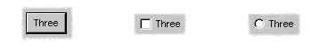

   A push button, a radio button, and a check button

The chapters covering the task list manager application (chapters `See
Designing A Simple DUIM Application <design.htm#77027>`_ to `See Using
Command Tables <commands.htm#99799>`_) introduced you to the
``<push-button>`` class. This is the default type of button (that is,
creating an instance of ``<button>`` actually creates an instance of
``<push-button>`` ).

.. code-block:: dylan

    make(<push-button>, label: "Hello");

Radio buttons let you choose one option out of a group of several. They
are usually implemented in groups of several buttons (using the
``<radio-box>`` class), although they can also be created singly, as shown
in `See A push button, a radio button, and a check
button <tour.htm#43717>`_. For more information about creating groups of
radio buttons, see `See Button boxes <tour.htm#34577>`_.

.. code-block:: dylan

    make(<radio-button>, label: "Hello");

Check buttons are buttons whose setting can be toggled on and off. Like
radio buttons, they are often implemented in groups, although unlike
radio buttons, they are frequently used individually. For more
information about creating groups of check buttons, see `See Button
boxes <tour.htm#34577>`_.

.. code-block:: dylan

    define variable *my-check-button*
      := make(<check-button>, label: "Hello"
              value: #f);

Remember that you can use ``gadget-label`` to set or return the label for
any button. As demonstrated in the examples above, it is also good
practice to set the label when defining any button, using the ``label:``
init-keyword.

Radio and check buttons have a ``gadget-value`` of ``#t`` or ``#f``,
depending on whether or not the button is selected. For example:

.. code-block:: dylan

    gadget-value(*my-check-button*)

returns ``#f`` if the check button is not selected.

You can set the ``gadget-value`` with the ``:=`` operator.

    gadget-value(*my-check-button*) := #t;

Supplying a value for a push button is a useful way of sending
information to your application. The value of a push button can be used
by any callback defined on the push button.

You can make any push button the default option for the frame it is a
part of using the ``default?:`` init-keyword when defining the button. By
default, this is ``#f``, but if specified as ``#t``, the button is
displayed on the screen with a heavier border, and any callback defined
for the button is invoked by pressing the RETURN key on the keyboard, as
well as by clicking the button itself.

.. code-block:: dylan

    define variable *my-default-button*
      := make(<push-button>,
              label: "Click me or press Return",
              default?: #t));

It is good practice to define a default button in most dialog boxes, so
that the user can easily perform a default action. Generally, the *OK*
or *Yes* button in a dialog box is the most acceptable default button,
though for particularly destructive operations you should consider
another choice.

Buttons are intrinsically “non-stretchy” objects. That is, the width of
a button is computed from the length of its label, and the button will
not automatically size itself according to the size of the sheet that it
is a part of. You should use the ``max-width:`` init-keyword to make a
button fill all the available space, by setting it to the constant
``$fill``.

Thus, the button created by

.. code-block:: dylan

    make(<button>, label: "Red");

will only be as wide as the label it is given—“Red”, in this case—but
the button created by

.. code-block:: dylan

    make(<button>, label: "Red", max-width: $fill);

will have a width that is determined by the sheet that it is a child of
and will still have the same minimum width, so it cannot be resized too
small.

Menu buttons
~~~~~~~~~~~~

`See Standard buttons <tour.htm#41055>`_ described buttons that are all
displayed in windows on the screen. For each of those buttons, there is
an analogous type of button that is displayed as an item in a menu.

|image0| The ``<push-menu-button>`` class is used to create a standard
menu item. This class is the menu-specific equivalent to ``<push-button>``
.

Like push buttons, you can make a given push menu button the default
command in a menu by specifying the ``default?:`` init-keyword. The label
for a default menu button is highlighted in the menu that it is
displayed in, usually by displaying the label using a bold font.

|image1| The ``<radio-menu-button>`` class is used to create a menu item
that has the properties of a radio button. The value of a radio menu
button may be toggled on and off, just like a radio button, and from any
group of radio menu buttons, only one may be on at any one time.

In appearance, a selected radio menu button is usually shown with a
small dot to the left of the command name on the menu.

As with radio buttons, radio menu buttons are most useful when used in
group form. The class ``<radio-menu-box>`` is provided for this purpose.
See `See Menu boxes <tour.htm#44083>`_ for more details.

|image2| The ``<check-menu-button>`` class is used to create a menu item
that has the properties of a check button. The value of a check menu
button may be toggled on and off, just like a check button, by
repeatedly choosing the menu item. In a group of check menu buttons, any
number may be on at any one time.

In appearance, a selected check menu button is usually shown with a
check mark to the left of the command name on the menu.

For more information about creating menus, see `See Adding Menus To The
Application <menus.htm#81811>`_.

Collection gadgets
~~~~~~~~~~~~~~~~~~

Collection gadgets are gadgets whose items can consist of any Dylan
collection. They are typically used to group together a number of
related objects, such as items in a list or a group of buttons. All
collection gadgets are general instances of the protocol class
``<collection-gadget>``.

Note that collection gadgets are not actually defined as collections of
gadgets, as you might assume. Instead, they contain a sequence of items,
such as strings, numbers, or symbols, that describe the contents of the
collection gadget. It is worth emphasizing this distinction since,
visually, collection gadgets often look like groups of individual
gadgets.

Useful properties of collection gadgets
~~~~~~~~~~~~~~~~~~~~~~~~~~~~~~~~~~~~~~~

All collection gadgets share certain essential properties. These can
either be specified when an instance of a gadget is created, using an
init-keyword, or set interactively via a slot value.

-  ``gadget-items`` This slot contains a Dylan collection representing the
   contents of a collection gadget.

``gadget-label-key``

-  The label key is a function that is used to compute the label of each
   item in a collection gadget, and therefore defines the “printed
   representation” of each item. If ``gadget-label-key`` is not explicitly
   defined for a collection gadget, its items are labeled numerically.

``gadget-value-key``

-  Similar to the label key, the value key is used to compute a value
   for each item in a collection gadget. The gadget value of a
   collection gadget is the value of any selected items in the
   collection gadget.

``gadget-selection-mode``

-  The selection mode of a collection gadget determines how many items
   in the gadget can be selected at any time. This takes one of three
   symbolic values: ``#"single"`` (only one item can be selected at any
   time), ``#"multiple"`` (any number of items can be selected at once),
   ``#"none"`` (no items can be selected at all).
-  Note that you can use ``gadget-selection-mode`` to read the selection
   mode of a gadget, but you cannot reset the selection mode of a gadget
   once it has been created. Instead, use the ``selection-mode:``
   init-keyword to specify the selection mode when the gadget is
   created.
-  Generally, different subclasses of collection gadget specify this
   property automatically. For example, a radio box is single selection,
   and a check box is multiple selection.

To specify any of these slot values as an init-keyword, remove the
"gadget-" prefix. Thus, the ``gadget-value-key`` slot becomes the
``value-key:`` init-keyword.

Button boxes
~~~~~~~~~~~~

Groups of functionally related buttons are placed in button boxes. The
superclass for button boxes is the ``<button-box>`` class. The two most
common types of button box are ``<check-box>`` (groups of check buttons)
and ``<radio-box>`` (groups of radio buttons). In addition, ``<push-box>``
(groups of push buttons) can be used.

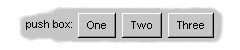

   A push box

.. note:: You should be aware of the distinction between the use of the
   term “box” in DUIM, and the use of the term “box” in some other
   development documentation (such as Microsoft’s interface guidelines).
   *In the context of DUIM, a box always refers to a group containing
   several gadgets* (usually buttons). In other documentation, a box may
   just be a GUI element that looks like a box. For example, a *check
   button* may sometimes be called a *check box*.

A ``<radio-box>`` is a button box that contains one or more radio buttons,
only one of which may be selected at any time.

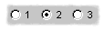

.. code-block:: dylan

    define variable *my-radio-box*
      := make(<radio-box>, items: #[1, 2, 3],
              value: 2);

Note the use of ``value:`` to choose the item initially selected when the
box is created.

For all boxes, the ``gadget-value`` is the selected button. In the
illustration above the ``gadget-value`` is 2.

::
    gadget-value(*my-radio-box*);
    => 2

You can set the ``gadget-value`` to 3 and the selected button changes to
3:

.. code-block:: dylan

    gadget-value(*my-radio-box*) := 3;

As with all collection gadgets, use ``gadget-items`` to set or return the
collection that defines the contents of a radio box.

::

    gadget-items(*my-radio-box*);
    => #[1, 2, 3]

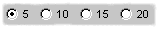

If you reset the ``gadget-items`` in a collection gadget, the gadget
resizes accordingly:

.. code-block:: dylan

    gadget-items(*my-radio-box*) := range(from: 5, to: 20, by: 5);

A check box, on the other hand, can have any number of buttons selected.
The following code creates a check box. After creating it, select the
buttons labelled 4 and 6, as shown below.

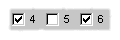

.. code-block:: dylan

    define variable *my-check-box*
      := make(<check-box>, items: #(4, 5, 6));

You can return the current selection, or set the selection, using
``gadget-value``.

::

    gadget-value(*my-check-box*);
    => #[4, 6]
    gadget-value(*my-check-box*) := #[5, 6];

Remember that for a multiple-selection collection gadget, the gadget
value is a sequence consisting of the values of all the selected items.
The value of any given item is calculated using the value key.

Menu boxes
~~~~~~~~~~

In addition to groups of buttons, groups of menu items can be created.
All of these are subclasses of the class ``<menu-box>``.

|image5| A ``<push-menu-box>`` is a group of several standard menu items.
A ``<push-menu-box>`` is the menu-specific version of ``<push-box>``. This
is the default type of ``<menu-box>``.

|image6| A ``<radio-menu-box>`` is a group of several radio menu items. A
``<radio-menu-box>`` is the menu-specific version of ``<radio-box>``.

|image7| A ``<check-menu-box>`` is a group of several check menu items. A
``<check-menu-box>`` is the menu-specific version of ``<check-box>``.

All the items in a menu box are grouped together on the menu in which
they are placed. A divider separates these items visually from any other
menu buttons or menu boxes placed above or below in the menu. It is
useful to use push menu boxes to group together related menu commands
such as *Cut*, *Copy*, and *Paste*, where the operations performed by
the commands are related, even though the commands themselves do not act
as a group. Note that you can also use command tables to create and
group related menu commands. See `See Using Command
Tables <commands.htm#99799>`_ for more details.

Lists
~~~~~

A ``<list-box>``, although it has a different appearance than a
``<radio-box>``, shares many of the same characteristics:

.. code-block:: dylan

    make(<list-box>, items: #(1, 2, 3));

.. figure:: images/lbox.png
   :align: center

   A list box

As with other boxes, ``gadget-value`` is used to return and set the
selection in the box, and ``gadget-items`` is used to return and set the
items in the box.

Like button boxes, list boxes can be specified as either single,
multiple, or no selection when they are created, using the
``selection-mode:`` init-keyword. Unlike button boxes, different values
for ``selection-mode:`` do not produce gadgets that are different in
appearance; a single selection list box is visually identical to a
multiple selection list box.

Two init-keywords let you specify different characteristics of a list
box.

The ``borders:`` init-keyword controls the appearance of the border placed
between the list itself, and the rest of the gadget. It takes a number
of symbolic arguments, the most useful of which are as follows:

-  ``#"sunken"`` The list looks as if it is recessed compared to the
   surrounding edge of the gadget.
-  ``#"raised"`` The list looks as if it is raised compared to the
   surrounding edge of the gadget.
-  ``#"groove"`` Rather than raising or lowering the list with respect to
   its border, a groove is drawn around it.
-  ``#"flat"`` No border is placed between the list and the edges of the
   gadget.

The ``scroll-bars:`` init-keyword controls how scroll bars are placed
around a list box. It takes the following values:

-  ``#"vertical"`` The list box is given a vertical scroll bar.
-  ``#"horizontal"`` The list box is given a horizontal scroll bar.
-  ``#"both"`` The list box is given both vertical and horizontal scroll
   bars.
-  ``#"none"`` The list box is given no scroll bars.
-  ``#"dynamic"`` The list box is given vertical and horizontal scroll
   bars only when they are necessary because of the amount of
   information visible in the list.

|image8| The ``<option-box>`` class is another list control that you will
frequently use in your applications. This gadget is usually referred to
in Microsoft documentation as a *drop-down list box*. It differs from a
standard list box in that it looks rather like a text field, with only
the current selection visible at any one time. In order to see the
entire list, the user must click on an arrow displayed to the right of
the field.

.. code-block:: dylan

    make(<option-box>, items: #("&Red", "&Green", "&Blue"));

Notice the use of the & character to denote a keyboard shortcut.
Pressing the R key when the option box has focus selects Red, pressing G
selects Green, and pressing B selects Blue.

Like list boxes, option boxes also support the ``borders:`` and
``scroll-bars:`` init-keywords.

The ``<combo-box>`` class is visually identical to the ``<option-box>``
class, except that the user can type into the text field portion of the
gadget. This is a useful way of allowing the user to specify an option
that is not provided in the list, and a common technique is to add any
new options typed by the user into the drop-down list part of the gadget
for future use.

Like list boxes and option boxes, combo boxes support the ``borders:`` and
``scroll-bars:`` init-keywords.

Display controls
~~~~~~~~~~~~~~~~

Display controls describe a set of collection gadgets that provide a
richer set of features for displaying more complex objects, such as
files on disk, that may have properties such as icons associated with
them.

A number of display controls are available that, like lists, are used to
display information in a variety of ways.

Tree controls
~~~~~~~~~~~~~

The ``<tree-control>`` class (also known as a tree view control in
Microsoft documentation) is a special list control that displays a set
of objects in an indented outline based on the logical hierarchical
relationship between the objects. A number of slots are available to
control the information that is displayed in the control, and the
appearance of that information.

.. figure:: images/tree.png
   :align: center

   A tree control

The ``tree-control-children-generator`` slot contains a function that is
used to generate any children below the root of the tree control. It is
called with one argument, which can be any instance of ``<object>``.

The ``icon-function:`` init-keyword specifies a function that returns an
icon to display with each item in the tree control. The function is
called with the item that needs an icon as its argument, and it should
return an instance of ``<image>`` as its result. Typically, you might want
to define an icon function that returns a different icon for each type
of item in the control. For example, if the control is used to display
the files and directories on a hard disk, you would want to return the
appropriate icon for each registered file type.

Typically, icons should be no larger than 32 pixels high and 32 pixels
wide: if the icon function returns an image larger than this, then there
may be unexpected results.

Note that there is no setter for the icon function, so the function
cannot be manipulated after the control has been created. In the example
below, ``$odd-icon`` and ``$even-icon`` are assumed to be icons that have
been defined.

.. code-block:: dylan

    make(<tree-control>,
         roots: #[1],
         children-generator:
           method (x) vector(x * 2, 1 + (x * 2)) end,
         icon-function: method (item :: <integer>)
           case
             odd?(item) => $odd-icon;
             even?(item) => $even-icon;
           end);

Like list boxes and list controls, tree controls support the
``scroll-bars:`` init-keyword.

List controls
~~~~~~~~~~~~~

|image9| The ``<list-control>`` class is used to display a collection of
items, each item consisting of an icon and a label. In Microsoft
documentation, this control corresponds to the List View control in its
“icon”, “small icon”, and “list” views. Like other collection gadgets,
the contents of a list control is determined using the ``gadget-items``
slot.

Like tree controls, list controls support the ``icon-function:``
init-keyword. Note, however, that unlike tree controls, you can also use
the ``list-control-icon-function`` generic function to retrieve and set
the value of this slot after the control has been created.

A number of different views are available, allowing you to view the
items in different ways. These views let you choose whether each item
should be accompanied by a large or a small icon. You can specify the
view for a list control when it is first created, using the ``view:``
init-keyword. After creation, the ``list-control-view`` slot can be used
to read or set the view for the list control.

The list control in the example below contains a number of items, each
of which consists of a two element vector.

-  The first element (a string) represents the label for each item in
   the list control.
-  The second element (beginning with "reply-" ) represents the value of
   each item in the list control—in this case the callback function that
   is invoked when that item is double-clicked.

The example assumes that you have already defined these callback
functions elsewhere.

.. code-block:: dylan

    make(<list-control>,
         items: vector(vector("Yes or No?", reply-yes-or-no),
                       vector("Black or White?",
                              reply-black-or-white),
                       vector("Left or Right?", reply-left-or-right),
                       vector("Top or Bottom?", reply-top-or-bottom),
                       vector("North or South?",
                              reply-north-or-south)),
         label-key: first,
         value-key: second,
         scroll-bars: #"none",
         activate-callback: method (sheet :: <sheet>)
             gadget-value(sheet)(sheet-frame(sheet))
           end);

In the example above, ``first`` is used to calculate the label that is
used for each item in the list, and ``second`` specifies what the value
for each item is. The activate callback examines this gadget value, so
that the callback specified in the ``items:`` init-keyword can be used.
Note that the ``scroll-bars:`` init-keyword can be used to specify which,
if any, scroll bars are added to the control.

Like list boxes, and tree controls, list controls support the ``borders:``
and ``scroll-bars:`` init-keywords.

Table controls
~~~~~~~~~~~~~~

|image10| The ``<table-control>`` class (which corresponds to the List
View control in its “report” view in Microsoft documentation) allows you
to display items in a table, with information divided into a number of
column headings. This type of control is used when you need to display
several pieces of information about each object, such as the name, size,
modification date and owner of a file on disk. Typically, items can be
sorted by any of the columns shown, in ascending or descending order, by
clicking on the column header in question.

Because a table control displays more complex information than a list
control, two init-keywords, ``headings:`` and ``generators:`` are used to
create the contents of a table control, based on the control’s items.

-  ``headings:`` This takes a sequence of strings that are used as the
   labels for each column in the control.
-  ``generators:`` This takes a sequence of functions. Each function is
   invoked on each item in the control to calculate the information
   displayed in the respective column.

Thus, the first element of the ``headings:`` sequence contains the heading
for the first column in the control, and the first function in the
``generators:`` sequence is used to generate the contents of that column,
and so on for each element in each sequence, as shown in `See Defining
column headings and contents in table controls <tour.htm#68215>`_.

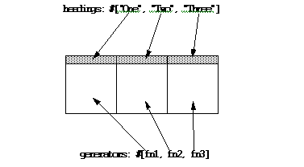

   Defining column headings and contents in table controls

Note that the sequences passed to both of these init-keywords should
contain the same number of elements, since there must be as many column
headings as there are functions to generate their contents.

Like list boxes and list controls, table controls support the ``borders:``
and ``scroll-bars:`` init-keywords. Like list controls, the ``view:``
init-keyword and ``table-control-view`` slot can be used to manipulate the
view used to display the information: choose between ``#"table"``,
``#"small-icon"``, ``#"large-icon"``, and ``#"list"``. The ``widths:``
init-keyword can be used to determine the width of each column in a
table control when it is created. This column takes a sequence of
integers, each of which represents the width in pixels of its respective
column in the control.

Spin boxes
~~~~~~~~~~

A ``<spin-box>`` is a collection gadget that only accepts a limited set of
ordered values as input. To the right of the text field are a pair of
buttons depicting an upward pointing|image11| arrow and a downward
pointing arrow. Clicking on the buttons changes the value in the text
field, incrementing or decrementing the value as appropriate.

A typical spin box might accept the integers 0-50. You could specify a
value in this spin box either by typing it directly into the text field,
or by clicking the up or down arrows until the number 50 was displayed
in the text field.

The ``gadget-items`` slot is used to specify the possible values that the
spin box can accept.

Consider the following example:

.. code-block:: dylan

    make(<spin-box>, items: range(from: 6, to: 24, by: 2));

This creates a spin box that accepts any even integer value between 6
and 24.

Text gadgets
~~~~~~~~~~~~

Several text gadgets are provided by the DUIM-Gadgets library. These
represent gadgets into which the user of your application can type
information. The superclass of all text gadgets is the ``<text-gadget>``
class.

There are three kinds of text gadget available: text fields, text
editors, and password fields.

Useful properties of text gadgets
~~~~~~~~~~~~~~~~~~~~~~~~~~~~~~~~~

You an initialize the text string in a text gadget using the ``text:``
init-keyword. The ``gadget-text`` slot can then be used to manipulate this
text after the gadget has been created.

The ``value-type:`` init-keyword (and the ``gadget-value-type`` slot) is
used to denote that a given text gadget is of a particular type.
Currently, three types are supported: ``<string>``, ``<integer>``, and
``<symbol>``. The type of a text gadget defines the way that the text
typed into a text gadget is treated by ``gadget-value``. The default is
``<string>``.

The ``gadget-text`` slot *always* returns the exact text contents of a
text gadget. However, ``gadget-value`` interprets the text and returns a
value of the proper type, depending on the ``gadget-value-type``, or ``#f``
if the text cannot be parsed. Setting the ``gadget-value`` “prints” the
value and inserts the appropriate text into the text field.

For example, if you specify ``value-type: <integer>``, then ``gadget-text``
always returns the exact text typed into the text gadget, as an instance
of ``<string>``, even if the text contains non-integer characters.
However, ``gadget-value`` can only return an instance of ``<integer>``,
having interpreted the ``gadget-text``. If the ``gadget-text`` contains any
non-integer characters, then interpretation fails, and ``gadget-value``
returns ``#f``.

Note that the combo boxes and spin boxes also contains a textual
element, though they are not themselves text gadgets.

Text fields
~~~~~~~~~~~

The ``<text-field>`` class is a single line edit control, and is the most
basic type of text gadget, consisting of a single line into which you
can type text.

.. figure:: images/textfld.png
   :align: center

.. code-block:: dylan

    make(<text-field>, value-type: <integer>, text: "1234");

Use the``x-alignment:`` init-keyword to specify how text typed into the
field should be aligned. This can be either ``#"left"``, ``#"center"``, or
``#"right"``, the default being ``#"left"``.

Text editors
~~~~~~~~~~~~

The ``<text-editor>`` class is a multiple line edit control, used when
more complex editing controls and several lines of text are needed by
the user.

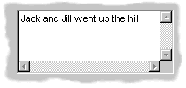

The ``columns:`` and ``lines:`` init-keywords control the size of a text
editor when it is created. Each init-keyword takes an integer argument,
and the resulting text editor has the specified number of character
columns (width) and the specified number of lines (height).

In addition, text editors support the ``scroll-bars:`` init-keyword
described in `See Lists <tour.htm#21075>`_.

.. code-block:: dylan

    make(<text-editor>, lines: 10, fixed-height?: #t);

Password fields
~~~~~~~~~~~~~~~

The ``<password-field>`` class provides a specialized type of single line
edit control for use in situations where the user is required to type
some text that should not be seen by anyone else, such as when typing in
a password or identification code. Visually, a password field looks
identical to a text field. However, when text is typed into a password
field, it is not displayed on the screen; a series of asterisks may be
used instead.

.. figure:: images/passwd.png
   :align: center

Range gadgets
~~~~~~~~~~~~~

Range gadgets are gadgets whose ``gadget-value`` can be any value on a
sliding scale. The most obvious examples of range gadgets are scroll
bars and sliders. The protocol class of all range gadgets is the class
``<value-range-gadget>``.

Useful properties of range gadgets
~~~~~~~~~~~~~~~~~~~~~~~~~~~~~~~~~~

When creating a range gadget, you must specify the range of values over
which the ``gadget-value`` of the gadget can vary, using the
``gadget-value-range`` slot. An instance of type ``<range>`` must be passed
to this slot. You can initialize this value when creating a value range
gadget using the ``value-range:`` init-keyword. The default range for any
value range gadget is the set of integers from 0 to 100.

When first created, the value of a range gadget is the minimum value of
the ``gadget-value-range`` of the gadget, unless ``value:`` is specified. As
with all other gadgets, use ``gadget-value`` to return or set this value,
as shown in `See Returning or setting the gadget-value of a
scroll-bar <tour.htm#35517>`_, which illustrates this behavior for a
scroll bar.

.. figure:: images/tour-24.gif
   :align: center

   Returning or setting the gadget-value of a scroll-bar

Scroll bars
~~~~~~~~~~~

The ``<scroll-bar>`` class is the most common type of value range gadget.
Interestingly, it is probably also the class that is explicitly used the
least. Because most gadgets that make use of scroll bars support the
``scroll-bars:`` init-keyword; you rarely need to explicitly create an
instance of ``<scroll-bar>`` and attach it to another gadget.

.. code-block:: dylan

    define variable *my-scroll-bar* :=
      contain(make(<scroll-bar>,
                   value-range: range(from: 0, to: 50)));

On the occasions when you do need to place scroll bars around a gadget
explicitly, use the ``scrolling`` macro.

.. code-block:: dylan

    scrolling (scroll-bars: #"vertical")
      make(<radio-box>,
           orientation: #"vertical",
           items: range(from: 1, to: 50))
    end

Sliders
~~~~~~~

Sliders can be created in much the same way as scroll bars. By default,
the gadget value is displayed alongside the slider itself.

|image12| You can display tick marks along the slider using the
``tick-marks:`` init-keyword, which is either ``#f`` (no tick marks are
displayed) or an integer, which specifies the number of tick marks to
display. The default is not to show tick marks.

If tick marks are used, they are distributed evenly along the length of
the slider. You can use as many or as few tick marks as you wish, and
you are advised to use a number that is natural to the user, such as 3,
5, or 10. While it is possible to use oddball numbers such as 29, this
could confuse the user of your application, unless there is a compelling
reason to do so.

.. code-block:: dylan

    define variable *my-slider*
      := make(<slider>,
              value-range: range(from: 0, to: 50)
              tick-marks: 10);

Progress bars
~~~~~~~~~~~~~

|image13| The ``<progress-bar>`` class is used to display a dialog that
provides a gauge illustrating the progress of a particular task.
Possible uses for progress bars include the progress of an installation
procedure, downloading e-mail messages from a mail server, performing a
file backup, and compiling one or more files of source code. Any
situation in which the user may have to wait for a task to complete is a
good candidate for a progress bar.

Assigning callbacks to gadgets
~~~~~~~~~~~~~~~~~~~~~~~~~~~~~~

To make gadgets actually do something, you have to assign them callback
functions. A callback is a function that is invoked when a particular
event occurs on a gadget, such as pressing a button. When the user
presses a button, the appropriate callback method is invoked and some
behavior, defined by you, occurs. It is the main way of providing your
applications with some kind of interactive functionality. Most classes
of gadget have a number of different callbacks available. Like gadget
properties, different classes of gadget can have different callback
types available.

The most common type of callback is the activate callback. This is the
callback that is invoked whenever a general instance ``<action-gadget>``
is activated: for instance, if a push button is clicked. All the gadget
classes you have seen so far are general instances of ``<action-gadget>``
.

The following code creates a push button that has an activate callback
defined:

.. code-block:: dylan

    make(<push-button>,
         label: "Hello",
         activate-callback: method (button)
             notify-user("Pressed button!",
             owner: button)
           end)));

The ``notify-user`` function is a useful function that lets you display a
message in a dialog.

Now when you click on the button, a notification pops up saying “Pressed
button!”

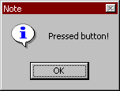

   Simple behavior of notify-user

Two callbacks are unique to general instances of ``<value-gadget>`` : the
value-changing and the value-changed callbacks. The value-changing
callback is invoked as the gadget value of the gadget changes, and the
value-changed callback is invoked when the value has changed, and is
passed back to the gadget.

In practice, a value-changing callback is of most use in a gadget whose
value you need to monitor constantly, such as a ``<value-range-gadget>``.
A value-changed callback is of most use when the user enters a value
explicitly and returns it to the application, for instance by clicking
on a button or pressing RETURN.

In a text field, for example, a value-changing callback would be invoked
whenever a character is typed in the text field, whereas a value-changed
callback would be invoked once the user had finished typing and had
returned the value to the gadget. For a text field, the value-changed
callback is usually more useful than the value-changing callback.

.. code-block:: dylan

    contain(make(<text-field>,
     value-changed-callback:
       method (gadget)
         notify-user
           ("Changed to %=", gadget-value(gadget))
       end));

A tour of layouts
-----------------

Layouts determine how the elements that make a GUI are presented on the
screen. Together with gadgets, layouts are an important type of sheet
that you need to be familiar with in order to develop basic DUIM
applications. Support for layouts is provided by the DUIM-Layouts
library.

You can think of layouts as containers for gadgets and other layouts.
They have little or no physical substance on the screen, and simply
define the way in which other elements are organized. The sheet at the
top of the sheet hierarchy will always be a layout.

Any layout takes a number of children, expressed as a sequence (usually
a vector), and lays them out according to certain constraints. Each
child must be an instance of a DUIM class. Typically, the children of
any layout will be gadgets or other layouts.

There are six main classes of layouts, as follows:

``<column-layout>``

-  This lays out its children in a single column, with all its children
   left-aligned by default.
-  ``<row-layout>`` This lays out its children in a single row.

``<pinboard-layout>``

-  This does not constrain the position of its children in any way. It
   is up to you to position each child individually, like pins on a
   pinboard.
-  ``<fixed-layout>`` This class is similar to pinboard layouts, in that
   you must specify the position of each child. Unlike pinboard layouts,
   however, you must also specify the size of each child.
-  ``<stack-layout>`` This lays out its children one on top of another,
   with all the children aligned at the top left corner by default. It
   is used to design property sheets, tab controls, or wizards, which
   contain several layouts, only one of which is visible at any one
   time.
-  ``<table-layout>`` This lays out its children in a table, according to
   a specified number of rows and columns.

Row layouts and column layouts
~~~~~~~~~~~~~~~~~~~~~~~~~~~~~~

Create a column layout containing three buttons as follows:

.. code-block:: dylan

    contain(make(<column-layout>,
                 children: vector(make(<push-button>, label: "One"),
                                  make(<push-button>, label: "Two"),
                                  make(<push-button>, label: "Three"))));

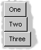

   Three button arranged in a column layout

Similarly, ``<row-layout>`` can be used to lay out any number of children
in a single row.

A number of different init-keywords can be used to specify the initial
appearance of any layouts you create. Using these init-keywords, you can
ensure that all children are the same size in one or both dimensions,
and that a certain amount of space is placed between each child. You can
also place a border of any width around the children of a layout.

To equalize the heights or widths of any child in a layout, use
``equalize-heights?: #t`` or ``equalize-widths?: #t`` respectively. To
ensure that each child is shown in its entirety, the children are sized
according to the largest child in the layout, for whatever dimension is
being equalized.

The ``equalize-heights?:`` and ``equalize-widths?:`` init-keywords are
particularly useful when defining a row of buttons, when you want to
ensure that the buttons are sized automatically. In addition, remember
that each button can be specified as ``max-width: $fill`` to ensure that
the button is sized to be as large as possible, rather than the size of
its label.

To add space between each child in a layout, use ``spacing:``, which
takes an integer value that represents the number of pixels of space
that is placed around each child in the layout. Use ``border:`` in much
the same way; specifying an integer value creates a border around the
entire layout which is that number of pixels wide. Notice that while
``spacing:`` places space around each individual child in the layout,
``border:`` creates a border around the entire layout. You can use
``border-type:`` to specify whether you want borders to appear sunken,
raised, or flat.

Each of the init-keywords described above apply to both row layouts and
column layouts. The following init-keywords each only apply to one of
these classes.

Use ``x-alignment:`` to align the children of a column layout along the
``x`` axis. This can be either ``#"left"``, ``#"right"``, or ``#"center"``,
and the children of the column layout are aligned appropriately. By
default, the children of a column layout are aligned along the left hand
side.

Use ``y-alignment:`` to align the children of a row layout along the ``y``
axis. This can be either ``#"top"``, ``#"bottom"``, ``or`` ``#"center"``, and
the children of the column layout are aligned appropriately. By default,
the children of a row layout are aligned along the top.

Stack layouts
~~~~~~~~~~~~~

The ``<stack-layout>`` class is provided to let you create layout classes
in which only one child is visible at a time. They are used to implement
tab controls and wizards. In a stack layout, all children are placed on
top of one another, with each child aligned at the top left corner by
default.

.. code-block:: dylan

    make(<stack-layout>,
         children: vector(make(<list-box>, label: "List 1"
                               items: #("One", "Two",
                                        "Three", "Four"),
                          make(<list-box>, label: "List 2"
                               items: #("Five", "Six",
                                        "Seven", "Eight"),
                          make(<push-button>, label: "Finish")));

Pinboard layouts and fixed layouts
~~~~~~~~~~~~~~~~~~~~~~~~~~~~~~~~~~

A pinboard layout is a framework that serves as a place to locate any
number of child gadgets. It has no built in layout information, so,
unless you specify coordinates explicitly, any object placed in a
pinboard layout is placed at the coordinates 0,0 (top left), with the
most recently created object on top.

In normal use, you should supply coordinate information for each child
to determine its position in the layout. You have complete flexibility
in positioning objects in a pinboard layout by giving each object
coordinates, as shown in the following example:

.. code-block:: dylan

    contain
      (make
        (<pinboard-layout>,
         children:
           vector (make(<push-button>, label: "One", x: 0, y: 0),
                   make(<push-button>, label: "Two", x: 50,y: 50),
                   make(<push-button>, label: "Three",
                        x: 50, y: 100))));

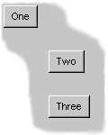

   Three buttons arranged in a pinboard layout

Any child in a pinboard layout obeys any size constraints that may apply
to it, whether those constraints have been specified by you, or
calculated by DUIM. For instance, any button you place on a pinboard
layout will always be large enough to display all the text in its label,
as shown in `See Three buttons arranged in a pinboard
layout <tour.htm#35716>`_. The ``<fixed-layout>`` class takes
generalization of layouts a step further, by requiring that you specify
not only the position of every child, but also its size, so that DUIM
performs no constraint calculation at all.This class of layout should
only be used if you know exactly what size and position every child in
the layout should have. It might be useful, for instance, if you were
setting up a resource database in which the sizes and positions of a
number of sheets were specified, and were to be read directly into your
application code from this database. For most situations, however, you
will not need to use the ``<fixed-layout>`` class.

Using horizontally and vertically macros
~~~~~~~~~~~~~~~~~~~~~~~~~~~~~~~~~~~~~~~~

The macros ``horizontally`` and ``vertically`` are provided to position
objects sequentially in a column layout or row layout. Using these
macros, rather than creating layout objects explicitly, can lead to
shorter and more readable code.

.. code-block:: dylan

    horizontally ()
      make(<push-button>, label: "One");
      make(<push-button>, label: "Two");
      make(<push-button>, label: "Three")
    end;

.. figure:: images/row.png
   :align: center

   Three buttons arranged in a horizontal layout

.. code-block:: dylan

    vertically ()
      make(<push-button>, label: "One");
      make(<push-button>, label: "Two");
      make(<push-button>, label: "Three")
    end;

You can specify any init-keywords that you would specify for an instance
of ``<row-layout>`` or ``<column-layout>`` using ``vertically`` and
``horizontally``. To do this, just pass the init-keywords as arguments to
the macro. The following code ensures that the row layout created by
``horizontally`` is the same width as the button with the really long
label. In addition, the use of ``max-width:`` in the definitions of the
two other buttons ensures that those buttons are sized so as to occupy
the entire width of the row layout.

.. code-block:: dylan

    vertically (equalize-widths?: #t)
      horizontally ()
        make(<button>, label: "Red", max-width: $fill);
        make(<button>, label: "Ultraviolet", max-width: $fill);
      end;
      make(<button>,
           label: "A button with a really really long label");
    end

A tour of sheets
----------------

Each unique piece of a window is a sheet. Thus, a sheet creates a
visible element of some sort on the screen. In any frame, sheets are
nested in a parent-child hierarchy. The DUIM-Sheets library provides
DUIM with many different types of sheet, and defines the behavior of
sheets in any application.

For basic DUIM applications, you do not need to be aware of sheet
protocols, and you do not need to define your own sheet classes, since
most of the sheet classes you need to use have been implemented for you
in the form of gadgets (`See A tour of gadgets <tour.htm#54586>`_) and
layouts (`See A tour of layouts <tour.htm#99071>`_).

Basic properties of sheets
~~~~~~~~~~~~~~~~~~~~~~~~~~

All sheets, including gadgets and layouts, have a number of properties
that deal with the fairly low level implementation behavior of sheet
classes. When developing basic DUIM applications, you do not need to be
concerned with these properties for the most part, since gadgets and
layouts have been designed so as to avoid the need for direct low level
manipulation. However, if you design your own classes of sheet, you need
to support these properties.

-  ``sheet-region`` The sheet region is used to define the area of the
   screen that “belongs to” a sheet. This is essential for deciding in
   which sheet a particular event occurs. For example, the
   ``sheet-region`` for a gadget defines the area of the screen in which
   its callbacks are invoked, should an event occur.
-  The sheet region is expressed in the sheet’s own coordinate system.
   It can be an instance of any concrete subclass of ``<region>``, but is
   usually represented by the region class ``<bounding-box>``.
-  The sheet-region is defined relative to the region of its parent,
   rather than an absolute region of the screen.

``sheet-transform``

-  This maps the sheet’s coordinate system to the coordinate system of
   its parent. This is an instance of a concrete subclass of
   ``<transform>``.
-  Providing the sheet transform means that you do not have to worry
   about the absolute screen position of any given element of an
   interface. Instead, you can specify its location relative to its
   parent in the sheet hierarchy. For example, you can arrange gadgets
   in an interface in terms of the layout that contains them, rather
   than in absolute terms.
-  ``sheet-parent`` This is ``#f`` if the sheet has no parent, or another
   sheet otherwise. This slot is used to describe any hierarchy of
   sheets.
-  ``sheet-mapped?`` This is a boolean that specifies whether the sheet is
   visible on a display, ignoring issues of occluding windows.
-  ``sheet-frame`` This returns the frame a sheet belongs to.

Many sheet classes, such as ``<menu-bar>`` or ``<tool-bar>``, have single
or multiple children, in which case they have additional attributes:

-  ``sheet-children`` The value of this slot is a sequence of sheets. Each
   sheet in the sequence is a child of the current sheet.
-  Methods to add, remove, and replace a child.
-  Methods to map over children.

Some classes of sheet — usually gadgets — can receive input. These have:

``sheet-event-queue``

-  This is a list of all the events currently queued and waiting for
   execution for a given sheet.

Methods for ``<handle-event>``

-  Each class of sheet must have methods for ``<handle-event>`` defined,
   so that callbacks may be described for the sheet class.

Sheets that can be repainted have methods for ``handle-repaint``. Sheets
that can display output have a ``sheet-medium`` slot. As a guide, all
gadgets can be repainted and can display output, and no layouts can be
repainted or display output.

A tour of frames
----------------

As you will have seen if you worked through the task list manager
example application, frames are the basic components used to display
DUIM objects on-screen. Every window in your application is a general
instance of ``<frame>``, and contains a hierarchy of sheets. Frames
control the overall appearance of the entire window, and organize such
things as menu bars, tool bars, and status bars.

A subclass of ``<frame>``, ``<simple-frame>``, is the way to create basic
frames. Usually, you will find it most convenient to define your own
classes of frame by subclassing ``<simple-frame>``.

The event loop associated with a frame is represented by a queue of
instances, each instance being a subclass of ``<event>``. The most
important events are subclasses of ``<device-event>``, for example,
``<button-press-event>`` and ``<key-press-event>``. Unless you intend
defining your own event or sheet classes, you do not need to understand
events.

Different types of frame are provided, allowing you to create normal
windows, as well as dialog boxes (both modal and modeless), property
pages and wizards.

Support for frames is provided by the DUIM-Frames library.

Creating frames and displaying them on-screen
~~~~~~~~~~~~~~~~~~~~~~~~~~~~~~~~~~~~~~~~~~~~~

To create an instance of a frame class, use ``make``, as you would any
other class. To display an instance of a frame on the screen, use the
function ``start-frame``. This takes as an argument a name bound to an
existing frame, or an expression (including function and macro calls)
that evaluates to a frame instance.

For example, to create a simple frame that contains a single button, use
the following code:

.. code-block:: dylan

    start-frame(make(<simple-frame>,
                     title: "Simple frame",
                     layout:
                       make(<push-button>,
                            label: "A button on a simple frame")));

.. figure:: images/frame.png
   :align: center

   A simple frame

Note that normally you should define your own subclasses or
``<simple-frame>`` and call ``start-frame`` on instances of these, rather
than creating direct instances of ``<simple-frame>``.

Useful properties of frames
~~~~~~~~~~~~~~~~~~~~~~~~~~~

You can specify a wide variety of properties for any instance or class
of frame. This section describes some of the most common properties you
might want to use. Naturally, when you create your own classes of frame
by subclassing ``<simple-frame>``, you can define new properties as well.
For more information on creating your own frame classes, see `See
Defining new classes of frame <tour.htm#34210>`_, and review the
description of the task list manager in `See Improving The
Design <improve.htm#63710>`_ and `See Adding Menus To The
Application <menus.htm#81811>`_.

The ``frame-pane`` property is used to define every discrete element in a
frame class. Exactly what constitutes a discrete element is, to a large
extent, up to the programmer. As a guide, every pane definition creates
an accessor just like a slot accessor, and so any element whose value
you might want to retrieve should be defined as a pane. Individual
gadgets, layouts, and menus are all generally expressed as panes in a
frame definition. When defining a frame class, use the ``pane`` option to
define each pane.

The ``frame-layout`` property is used to specify the topmost layout in the
sheet hierarchy that forms the contents of a frame class. This take an
instance of any subclass of ``<layout>`` which may itself contain any
number of gadgets or other layouts as children. The children of this
layout are themselves typically defined as panes within the same frame
definition. When defining a frame class, use the ``layout`` option to
define the topmost layout.

Other major components of a frame can be specified using
``frame-menu-bar``, ``frame-tool-bar``, and ``frame-status-bar``. Each
property takes an instance of the corresponding gadget class as its
value. You can also use ``frame-command-table`` to specify a command table
defining all the menu commands available in the menu bar. All of these
slots have corresponding options you can set when creating your own
frame classes.

To determine the initial size and position of any frame, use
``frame-width``, ``frame-height``, ``frame-x``, and ``frame-y``. Each of
these properties takes an integer argument that represents a number of
pixels. Note that ``frame-x`` and ``frame-y`` represent the position of the
frame with respect to the top left hand corner of the screen.

Sometimes, it may be useful to fix the height or width of a frame. This
can be done using ``frame-fixed-width?`` and ``frame-fixed-height?``, both
of which take a boolean value. Setting ``frame-resizable?`` to ``#f`` fixes
both the width and height of a frame.

Defining new classes of frame
~~~~~~~~~~~~~~~~~~~~~~~~~~~~~

As described in `See Defining a new frame class <improve.htm#66956>`_,
the ``define frame`` macro is used to create new classes of frame. The
bulk of the definition of any new frame is split into several parts:

-  The definition of any slots and init-keywords you want available for
   the new class of frame.
-  The definition of any panes that should be used in the new class of
   frame.
-  The definition of other components that you wish to include, such as
   a menu bar, status bar, and so on.

Slots and init-keywords can be used to let you (or the user of your
applications) set the properties of any instances of the new frame class
that are created.

Panes control the overall appearance of the new class of frame. You need
to define panes for any GUI elements you wish to place in the frame.

Specifying slots for a new class of frame
~~~~~~~~~~~~~~~~~~~~~~~~~~~~~~~~~~~~~~~~~

As with any other Dylan class, you can use standard slot options to
define slots for any new class of frame. This includes techniques such
as setting default values, specifying init-keyword names, and specifying
whether or not an init-keyword is required.

The following example defines a subclass of ``<simple-frame>`` that
defines an additional slot that can be set to a date and time. The
default value of the slot is set to the current date and time using an
init expression. So that you can provide an initial value for the slot,
it is defined with an init-keyword of the same name.

.. code-block:: dylan

    define frame <date-frame> (<simple-frame>)
      slot date :: <date> = current-date(),
        init-keyword: date:;
      // Other stuff here
    end class <date-frame>;

Specifying panes for a new class of frame
~~~~~~~~~~~~~~~~~~~~~~~~~~~~~~~~~~~~~~~~~

In the same way that you can define slots, you can define panes for a
frame class using pane options. Panes may be used to define all the
visual aspects of a frame class, including such things as:

-  The layouts and gadgets displayed in the frame
-  The menu bar, menus, and menu commands available in the frame
-  Additional components, such as tool bars or status bars

Typically, the definition for any pane has the following syntax:

::

    pane *pane-name* (*pane-owner* ) *pane-definition* ;

This breaks down into the following elements:

-  The reserved word ``pane``.
-  The name you wish to give the pane, which acts as a slot accessor for
   the frame, to let you retrieve the pane.
-  A space in which you can bind the owner of the pane (usually the
   frame itself) to a local variable for use inside the pane definition
-  The definition of the pane

Once you have defined all the visual components of a frame using an
arrangement of panes of your choice, each major component needs to be
included in the frame using an appropriate clause. For example, to
include a tool bar, having created a pane called ``app-tool-bar`` that
contains the definition of the tool bar itself, you need to include the
following code at the end of the definition of the frame:

.. code-block:: dylan

    tool-bar (frame) frame.app-tool-bar;

The major components that need to be activated in any frame definition
are the top level layout, menu bar, tool bar, and status bar.

The following example shows how to define and activate panes within a
frame.

Three panes are defined:

-  ``button`` A push button that contains a simple callback.
-  ``status`` A status bar.
-  ``main-layout`` A column layout that consists of the ``button`` pane,
   together with a drawing pane.

.. code-block:: dylan

    define frame <example-frame> (<simple-frame>)
      ... other code here

      // pane definitions
      pane button (frame)
        make(<push-button>,
             label: "Press",
             activate-callback:
               method (button)
                 notify-user (format-to-string ("Pressed button"),
                              owner: frame)
               end);

      pane status (frame)
        make(<status-bar>);

      pane main-layout (frame)
        vertically (spacing: 10)
          horizontally (borders: 2, x-alignment: #"center")
            frame.button;
          end;
          make(<drawing-pane>,
               foreground: $red);
        end;

      ... other code here

      // activate components of frame
      layout (frame) frame.main-layout;
      status-bar (frame) frame.status;

      // frame title
      keyword title: = "Example Frame";
    end frame <example-frame>;

The following method creates an instance of an ``<example-frame>``.

The simplest way to create an example frame is by calling this method
thus: ``make-example-frame();``.

.. code-block:: dylan

    define method make-example-frame => (frame :: <example-frame>)
      let frame
        = make(<example-frame>);
      start-frame(frame);
    end method make-example-frame;

For a more complete example of how to define your own class of frame for
use in an application, see the chapters that cover the development of
the Task List Manager in this manual (Chapters `See Designing A Simple
DUIM Application <design.htm#77027>`_ to `See Using Command
Tables <commands.htm#99799>`_).

Overview of dialogs
~~~~~~~~~~~~~~~~~~~

Dialog boxes are a standard way of requesting more information from the
user in order to proceed with an operation. Typically, dialog boxes are
modal — that is, the operation cannot be continued until the dialog is
dismissed from the screen. Whenever an application requires additional
information from the user before carrying out a particular command or
task, you should provide a dialog to gather information.

For general purposes, you can create your own custom dialog boxes using
frames: the class ``<dialog-frame>`` is provided as a straightforward way
of designing frames specifically for use as dialogs. See `See A tour of
frames <tour.htm#20992>`_ for an introduction to frames.

For commonly used dialog boxes, DUIM provides you with a number of
convenience functions that let you use predefined dialogs in your
applications without having to design each one specifically. These
convenience functions use pre-built dialog interfaces supplied by the
system wherever possible,. This not only makes them more efficient, it
also guarantees that the dialogs have the correct look and feel for the
system for which you are developing.

Many systems, for example, provide pre-built interfaces for the Open,
Save As, Font, and similar dialog boxes. By using the functions
described in this section, you can guarantee that your application uses
the dialog boxes supplied by the system wherever they are available.

The most commonly used convenience function is ``notify-user``, which you
have already seen. This function provides you with a straightforward way
of displaying an alert message on screen in whatever format is standard
for the target operating system.

.. code-block:: dylan

    contain(make(<push-button>,
                 label: "Press me!",
                 activate-callback:
                   method (gadget)
                     notify-user
                       (format-to-string ("You pressed me!"))
                   end));

The example above creates a push button which, when pressed, calls
``notify-user`` to display message.

The common Open File and Save File As dialogs can both be generated
using ``choose-file``. The ``direction:`` keyword lets you specify a
direction that distinguishes between the two types of dialog: thus, if
the direction is ``#"input"``, a file is opened, and if the direction is
``#"output"`` a file is saved.

.. code-block:: dylan

    choose-file(title: "Open File", direction: #"input");
    choose-file(title: "Save File As", direction: #"input");

Note that DUIM provides default titles based on the specified direction,
so you need only specify these titles if you want to supply a
non-standard title to the dialog.

Further examples of this function can be found in `See Handling files in
the task list manager <callbacks.htm#78540>`_.

The convenience functions ``choose-color`` and ``choose-text-style``
generate the common dialogs for choosing a color and a font
respectively. Use ``choose-color`` when you need to ask the user to choose
a color from the standard color palette available on the target
operating system, and use ``choose-text-style`` when you want the user to
choose the font, style, and size for a piece of text.

Several other convenience dialogs are provided by DUIM. The following is
a complete list, together with a brief description of each. For more
information on these dialogs, please refer to the *DUIM Reference
Manual*.

``choose-color`` — Choose a system color.

``choose-directory`` — Choose a directory on disk.

``choose-file`` — Choose an input or output file.

``choose-from-dialog`` — Choose from a list presented in a dialog.

``choose-from-menu`` — Choose from a list presented in a popup menu

``choose-text-style`` — Choose a font.

``notify-user`` — Provide various kinds of notification to the user.

There are a number of standard dialogs provided by Windows that are not
listed above. If you wish to use any of them, you must either use the
Win32 control directly, or you must emulate the dialog yourself by
building it using DUIM classes.

Where to go from here
---------------------

This concludes a fairly basic tour of the major functionality provided
by DUIM. Other topics that have not been covered in this tour include
colors, fonts, images, generic drawing properties, and the functionality
provided to for defining your own sheets and handling events.

From here, you can refer to two other sources of information.

-  If you have not already done so, go back and study the chapters that
   cover the development of the Task List Manager application (`See
   Designing A Simple DUIM Application <design.htm#77027>`_ to `See
   Adding Callbacks to the Application <callbacks.htm#15598>`_
   inclusive). Try building the project in the development environment,
   experiment with the code, and extend the application in any way you
   wish.
-  A number of DUIM examples are supplied with Open Dylan, in
   addition to those discussed in this book. In the environment, choose
   *Tools > Open Example Project* to display the Open Example Project
   dialog, and try some of the examples listed under the DUIM category.
-  For complete information on everything provided by DUIM, look at the
   *DUIM Reference Manual*. This contains a complete description of
   every interface exported by DUIM, together with examples where
   relevant. The reference manual also provides further information
   about how you should use DUIM, and the organization of the DUIM class
   hierarchy.

.. |image0| image:: images/pushmb.png
.. |image1| image:: images/radiomb.png
.. |image2| image:: images/checkmb.png
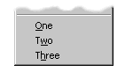
.. |image6| image:: images/radiombx.png
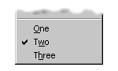
.. |image8| image:: images/obox.png
.. |image9| image:: images/listcont.png
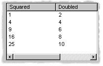
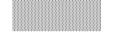
.. |image12| image:: images/slider.png
.. |image13| image:: images/progress.png
