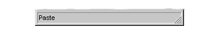
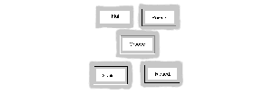
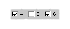
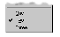
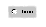
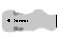
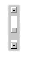
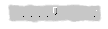
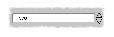

********************
DUIM-Gadgets Library
********************

Overview
========

The elements that comprise a Graphical User Interface (GUI) are arranged
in a hierarchical ordering of object classes. At the top level of the
DUIM hierarchy there are three main classes*,* *<sheet>*, *<gadget>*,
and *<frame>*, all of which are subclasses of *<object>.*

The DUIM-Gadgets library contains classes that define a wide variety of
gadgets for use in your GUI applications, such as push buttons, radio
buttons, and check boxes. The library also provides the necessary
functions, generic functions, and macros for creating and manipulating
these classes. The library contains a single module, *duim-gadgets*,
from which all the interfaces described in this chapter are exposed.
`DUIM-Gadgets Module`_ contains complete
reference entries for each exposed interface.

Gadgets are the basic behavioral GUI element (above the level of
events).

-  Gadgets do not *need* to have a visual presence, though in practice
   every gadget provided by DUIM does, since all general instances of
   *<gadget>* are also general instances of *<sheet>*.
-  Many classes of gadget maintain some kind of state for their
   behavior, and in practice some of this is usually reflected in the
   UI. For example, you can tell that a check box is selected just by
   looking at it.
-  They handle events and turn these into callbacks, for convenience.

Some of the more important types of gadget are as follows:

-  *Buttons* A wide variety of buttons are provided by DUIM. These
   include not only standard buttons such as push buttons and radio
   buttons, but items that can be placed within menus.
-  *Action gadgets* An action gadget is any gadget that can be used to
   perform an action, such as a button, or menu command.
-  *Value gadgets* A value gadget is any gadget that can have a value
   associated with it. In principle, this is true of the majority of
   gadgets, but the value of a gadget is more important for certain
   types of gadget (for instance, lists or radio boxes) than for others
   (for instance, push buttons).

*Value range gadgets*

-  Value range gadgets are those value gadgets for which the possible
   value sits within a defined range. This includes gadgets such as
   scroll bars and sliders.

*Collection gadgets*

-  Collection gadgets are those gadgets that can contain a number of
   "child" gadgets, the specification of which can be described in terms
   of a Dylan collection, and includes gadgets such as list controls and
   groups of buttons. Usually, the behavior of each of the "child"
   gadgets is interdependent in some way; for example, only one button
   in a group of radio buttons may be selected at any time. With
   collection gadgets, you can specify the "child" gadgets very simply,
   without having to worry about defining each "child" explicitly.

Each of these types of gadget is described in more detail in subsequent
sections, and full reference entries for every interface exposed in the
DUIM-Gadgets library are available in `DUIM-Gadgets
Module`_. For a more general introduction to the
gadgets provided in DUIM, see the tour in the *Building Applications
using DUIM* book. See the same book for a more practical example of
implementing an application using the DUIM library.

Callbacks and keys
==================

When an event occurs in a user interface (for example, a button is
pressed, a menu command is chosen, or an item in a list is
double-clicked), you usually want some operation to be performed. If the
user of your application chooses the *File > Open* command, a File Open
dialog should be displayed. If the user clicks on an *OK* button in a
dialog, the dialog should be dismissed and the appropriate changes to
the application state to be performed. In DUIM, you can provide this
functionality by specifying a function known as a *callback*.

Generally speaking, a callback gets passed a single argument, which is
the gadget that is affected. Thus, the argument passed to the callback
for a button is the button itself. Callbacks do not need to have a
return value, although they are not forbidden either. If a value is
returned by a callback function, then it is just ignored.

Callbacks are used in preference to event handlers because Dylan does
not let you write methods that specialize on individual instances. In
languages such as C, you uniquely name each element in an interface, and
then provide behavior for each element by writing event handlers that
contain case statements that let you discriminate on individual
elements. This is a somewhat inelegant solution. Instead, in Dylan you
specify the names of the callbacks for each element in an interface when
you *create* the elements. It is then a simple matter for the system to
know what behavior goes with what elements, and is much less tedious
than having to write many cumbersome methods for `See
handle-event <silica.htm#94892>`_.

In Dylan, you use events in order to create new kinds of class. If you
were creating a new kind of button, you would need to define a new
method for `handle-event <silica.htm#94892>`_ in order to describe
what happens when you click on an instance of that button. You would
then write callbacks to deal with particular instance of the new class
of button.

By contrast with callbacks, you can also provide functions in DUIM known
as *keys*, which are specific to collection gadgets. A key is used to
set the value of some aspect of the collection gadget for which the key
is defined. With keys, therefore, the values returned by the function
are fundamental to the operation of the gadget. There are two keys that
are generally used by gadgets, known as the value key and the label key.
The value key is a function that is used to calculate the value of the
gadget for which the key is defined. The label key is used to calculate
the printed representation, or label, of all the items in a collection
gadget.

Gadget protocols
================

Gadgets are objects that make up an interface: the menus, buttons,
sliders, check lists, tool bars, menu bars, and so on. Gadget classes
may support three protocols, *value*, *items*, and *activate*.

-  Gadgets that support the *value* protocol respond to the
   *gadget-value* message, a value-changed callback, and have a setter
   function associated with them.
-  Gadgets that support the *items* protocol respond to *gadget-items*
   and have a gadget setter function associated with them.
-  Gadgets that support the *activate* protocol have an activation
   callback associated with them.

Gadgets have a set of slots, or properties, associated with them:
*gadget-label*, *gadget-value*, *gadget-items*, and*gadget-enabled?*
Every gadget has some or all of these properties.

-  *gadget-label* This slot holds the label that appears on the gadget
   on the screen. If a gadget does not have a label, the *gadget-label*
   function returns ``#f``.
-  *gadget-value* This slot holds the value(s) of the gadget. If a
   gadget does not have any values, the *gadget-value* function returns
   ``#f``.
-  *gadget-items* This slot is a list of the contents of the gadget. If
   the gadget does not have items, for example a button, *gadget-items*
   returns nothing.

*gadget-enabled?*

-  This slot tests whether or not the gadget is active. All gadgets have
   a *gadget-enabled?* slot.

An introduction to the protocols supported by different sorts of gadget
can also be found in the *Building Applications using DUIM* book.

The class hierarchy for DUIM-Gadgets
====================================

This section presents an overview of the available classes of gadget,
and describes the class hierarchy present.

In each table below, classes that support the *items* protocol are
displayed in *bold text*, and classes that support the activate
protocol are displayed using *italic text*.

*Note:* In `Subclasses of the <collection-gadget>
class`_, every subclass shown supports the *items*
protocol, though for clarity, no bold is used.

All subclasses of *<value-gadget>* support the *value* protocol. These
are described in `Subclasses of
<value-gadget>`_, `Subclasses of
<button>`_, and `Subclasses of
<collection-gadget>`_.

The <gadget> class and its subclasses
^^^^^^^^^^^^^^^^^^^^^^^^^^^^^^^^^^^^^

The base class for the majority of DUIM gadgets is the *<gadget>* class,
which is itself a subclass of *<object>*. All other DUIM gadgets are
subclasses of *<gadget>*, with the exception of *<list-item>*,
*<tree-node>*, and *<table-item>*.

The immediate subclasses of *<gadget>* are shown in `Overall class
hierarchy for the DUIM-Gadgets library`_. Only
*<value-gadget>* and *<page>* have any subclasses defined. See `See
Subclasses of <value-gadget>`_ and `Subclasses
of <value-gadget>`_ for details of these subclasses.

The *<gadget>* class provides a number of subclasses that allow
particular parts of a user interface to be created:

-  *<menu>* Use this class to add a menu to the menu bar of any
   application frame. Menus themselves contain commands created using
   the menu-specific button and collection gadgets described in `See
   Subclasses of <button>`_ and `Subclasses of
   <collection-gadget>`_.
-  *<tool-bar>* This class is used to add a tool bar to an application
   frame. A tool bar is a row of buttons that duplicates the
   functionality of the most commonly used menu commands, thereby
   providing the user with quick access to the most useful operations in
   the application.
-  *<scroller>* This is a generic scrolling gadget that can be used in a
   number of situations.
-  *<viewport>* A viewport can be used to create a generic pane for
   displaying specialized contents that you may have defined. Use this
   class when there is no other class provided for displaying the
   objects in question.
-  *<splitter>* This class can be used to split the current view in
   half. This allows the user, for example, to create a second view of
   the same document.

The *<gadget>* class provides a number of subclasses that allow general
spatial and grouping capability, in addition to the layout functionality
described in `DUIM-Layouts Library <layouts.htm#21962>`_. These are
as follows:

-  *<label>* This class is used to assign label to many other types of
   gadget. Many gadgets can be assigned one or more labels, usually by
   means of a label: init-keyword. This class is used to assign any
   label.
-  *<separator>* This allows a line to be drawn between any two gadgets
   or groups of gadgets, so as to provide a visible barrier between
   them.
-  *<spacing>* This allows you to specify how much space should be
   placed between any two gadgets or groups of gadgets.
-  *<border>* This allows a visible border to be placed around any
   number of gadgets.
-  *<group-box>* This allows you to group together any number of related
   gadgets in a frame. Grouped elements are usually displayed with a
   border and label identifying the grouping.

Overall class hierarchy for the DUIM-Gadgets library

.. figure:: images/gadgets-2.png
   :align: center
   :alt: 
<object>

<gadget>

<action-gadget>

<value-gadget>

See `Subclasses of <value-gadget>`_

<label>

*<menu>*

*<tool-bar>*

<scroller>

<separator>

<viewport>

<spacing>

<border>

<group-box>

<splitter>

<page>

See `Subclasses of <page>`_

<list-item>

<tree-node>

<table-item>

Subclasses of <value-gadget>
^^^^^^^^^^^^^^^^^^^^^^^^^^^^

Any gadget that can take a value of some sort is a subclass of
*<value-gadget>*. As might be expected, this includes the majority of
the gadgets in the DUIM-Gadgets library.

Every subclass of *<value-gadget>* supports the *value* protocol, as
described in `Overview`_.

Several subclasses of *<value-gadget>* themselves have a number of
subclasses defined. These include:

-  *<text-gadget>* Any gadget into which you can type text. These
   include both text editors (multiple line edit controls) and text
   fields (single line edit controls).

*<value-range-gadget>*

-  Value gadgets whose value can vary within a known range, such as
   scroll bars.
-  *<button>* Any button, such as a radio button, check button, or push
   button. See `Subclasses of <button>`_ for
   more details about the classes of button available.

*<collection-gadget>*

-  Any gadget whose contents form a collection, such as a list, a tree
   control, or a group of buttons. See `Subclasses of
   <collection-gadget>`_ for more details about the
   classes of collection gadget available.

Also provided are the following specific GUI elements:

-  *<menu-bar>* This used to create the standard menu bar that is
   commonly found across the top of an application frame.
-  *<status-bar>* This is used to create a status bar, usually placed at
   the bottom of an application frame. A status bar is used to display
   miscellaneous information about the current state of the application.
-  *<tab-control>* Tab controls are analogous to dividers in a filing
   cabinet or notebook, with multiple logical pages of information
   displayed within the same window. Clicking on any of the tabs
   displayed in a tab control displays a new page of information.

The subclasses of *<value-gadget>* are as shown in `Subclasses of
the <value-gadget> class`_.

Subclasses of the *<value-gadget>* class

.. figure:: images/gadgets-2.png
   :align: center
   :alt: 
<value-gadget>

<text-gadget>

*<password-field>*

*<text-editor>*

*<text-field>*

<value-range-gadget>

<slider>

<scroll-bar>

<progress-bar>

<button>

See `Subclasses of <button>`_

*<menu-bar>*

<status-bar>

<tab-control>

<collection-gadget>

See `Subclasses of <collection-gadget>`_

Subclasses of <page>
^^^^^^^^^^^^^^^^^^^^

The *<page>* class is the base class of gadgets that are used to display
a whole page of information within a "parent" element, with the page
itself optionally containing other layouts or gadgets. Pages are used in
situations where different sets of information (the pages themselves)
need to be displayed in a common parent.

The subclasses of *<page>* are as shown in `Subclasses of the <page>
class`_.

Subclasses of the *<page>* class

.. figure:: images/gadgets-2.png
   :align: center
   :alt: 
<page>

<tab-control-page>

<property-page>

<wizard-page>

The *<tab-control-page>* class is used to define the elements that are
associated with each tab in a tab control.

A tab control page

.. figure:: images/gadgets-2.png
   :align: center
   :alt: 

.. figure:: images/gadgets-3.png
   :align: center
   :alt: 
The *<property-page>* class performs a similar job for property frames
(visually, a property frame looks like a tab control in a dialog box,
and is one way of implementing a dialog box that has several pages of
information. Property frames are so named because they are often used to
display the user-configurable properties of an application.

A property page

.. figure:: images/gadgets-2.png
   :align: center
   :alt: 

.. figure:: images/gadgets-4.png
   :align: center
   :alt: 
The *<wizard-page>* class is used to define the elements in each page of
a wizard frame. Wizard frames are another form of multi-page dialog, but
consist of several physically distinct windows that are presented to the
user in a strict order.

A tab control page

.. figure:: images/gadgets-2.png
   :align: center
   :alt: 

.. figure:: images/gadgets-5.png
   :align: center
   :alt: 
Subclasses of <button>
^^^^^^^^^^^^^^^^^^^^^^

The subclasses of *<button>* are as shown in `Subclasses of the
<button> class`_. These subclasses include not only
buttons that can appear in any sheet, but also their equivalent classes
of menu item. Thus, an instance of *<check-button>* represents a button
whose state can toggle a specific value on and off, and an instance of
*<check-menu-button>* represents a menu item whose state can toggle a
specific value on and off in the same way.

Since all the subclasses of *<button>* are themselves value gadgets,
each one supports the *value* protocol, as described in `See
Overview`_.

Subclasses of the *<button>* class

.. figure:: images/gadgets-2.png
   :align: center
   :alt: 
<button>

<check-button>

<check-menu-button>

<menu-button>

*<push-button>*

<push-menu-button>

<radio-button>

<radio-menu-button>

Subclasses of <collection-gadget>
^^^^^^^^^^^^^^^^^^^^^^^^^^^^^^^^^

The subclasses of *<collection-gadget>* are as shown in `Subclasses
of the <collection-gadget> class`_. All of these
subclasses support the *items* protocol, even though they are not
displayed in bold.

Subclasses of the *<collection-gadget>* class

.. figure:: images/gadgets-2.png
   :align: center
   :alt: 
<collection-gadget>

<button-box>

<check-box>

<push-box>

<radio-box>

*<list-box>*

*<menu-box>*

*<check-menu-box>*

*<push-menu-box>*

*<radio-menu-box>*

<option-box>

<combo-box>

<spin-box>

*<list-control>*

*<tree-control>*

*<table-control>*

Two subclasses themselves have a number of subclasses defined: those
subclasses representing collections of buttons:

-  *<button-box>* These are used to create collections of buttons of the
   same type. You can create collections of any of the three basic types
   of button available: check buttons, radio buttons, or push buttons.
-  *<menu-box>* These are used to create collections of menu items of
   the same type. As with *<button-box>*, you can create collections of
   any of the three basic types of menu button available: check, radio,
   or push menu buttons.

In addition, the following types of list are provided:

-  *<list-box>* These are standard list boxes, allowing a list of items
   to be displayed in a pane, with a scroll bar allowing the complete
   list to be viewed if necessary. List boxes may be single, multiple,
   or no selection.
-  *<option-box>* A standard drop-down list box. This is similar to a
   list box, except that the entire list of options is only displayed on
   demand. In its closed state, only the current selection is visible.
-  *<combo-box>* A combo box combines an option box with a text field,
   providing a list box whose contents can be displayed on demand, or
   edited by typing into the box in its closed state. Any new values
   typed in by the user are automatically added to the list of options
   subsequently displayed.
-  *<spin-box>* A spin box is a text box that will only accept a limited
   number of input values, themselves making up a loop. A typical
   example might be the integers between 0 and 10. Spin boxes also
   incorporate small buttons (up-down controls) that allow the user to
   change the value by clicking the button in the appropriate direction.

Three controls are also available for displaying more general pieces of
information:

-  *<list-control>* List controls provide an extended list box
   functionality that let you display a collection of items, each item
   consisting of an icon and a label. A number of different views are
   available, allowing you to view the items in different ways.
-  *<tree-control>* Tree controls are a special list control that
   displays a set of objects in an indented outline based on the logical
   hierarchical relationship between the objects.

*<table-control>*

-  These allow you to display information as a table, with information
   divided into a number of column headings.

Since all the subclasses of *<collection-gadget>* are themselves value
gadgets, each one supports the *value* protocol, as described in `See
Overview`_.

Button gadgets
==============

Broadly speaking, buttons are gadgets whose value can be changed, or for
which some user-defined functionality can be invoked, by clicking on the
gadget with the pointer device. Buttons encompass obvious controls such
as push buttons, radio buttons, and check boxes, and, less obviously,
menu items.

A selection of button and equivalent menu buttons

.. figure:: images/gadgets-2.png
   :align: center
   :alt: 

.. figure:: images/gadgets-6.png
   :align: center
   :alt: 
Text gadgets
============

A text gadget is a gadget into which you can type textual information.
There are three different classes of text gadget available in DUIM, each
of which is a subclass of the *<text-gadget>* class.

-  *<text-field>* This is the most basic type of text gadget: the single
   line

-  *<text-editor>*

*<password-field>*

-  

Collection gadgets
==================

A collection gadget is any gadget whose items may themselves form a
Dylan collection. Often, a collection gadget is used to group together a
number other gadgets, such as buttons, in such a way that the
functionality of those gadgets is connected in some way. For example, a
*<radio-box>* is a collection of radio buttons connected in such a way
that only one of the buttons can be selected at any time (as is the
standard behavior for a group of radio buttons). The items contained in
a collection gadget are expressed using the *gadget-items* slot.

Note that collection gadgets are not defined as collections of other
gadgets, even though this might be a convenient way to think of them.
When defining a collection gadget, you give the *gadget-items* slot a
standard Dylan collection. The type of collection gadget you are
creating then determines the type of gadget that is contained in the
resulting collection gadget.

The most simple types of collection gadget mirror the standard buttons
and menu buttons available, allowing you to create collections of push
buttons, radio buttons, check buttons, and their menu button
equivalents. Separators are automatically added to collections of menu
buttons so as to delineate them visually from other menu buttons in the
same menu.

A variety of simple collection gadgets

.. figure:: images/gadgets-2.png
   :align: center
   :alt: 

.. figure:: images/gadgets-10.png
   :align: center
   :alt: 
Value range gadgets
===================

A value range gadget is any gadget whose value falls within a defined
Dylan range.

A variety of value range gadgets

.. figure:: images/gadgets-2.png
   :align: center
   :alt: 

.. figure:: images/gadgets-11.png
   :align: center
   :alt: 
Sliders, scroll bars, and scroll bars are all examples of value range
gadgets. Value range gadgets provide immediate visual feedback of the
value of the gadget at any time, as shown in `A variety of value
range gadgets`_. In the case of sliders and scroll
bars, the user can set the *gadget-value* by dragging the appropriate
part of the gadget to a new point on the scale. Progress bars are
typically used only to provide the user with feedback about the progress
of a task.

Page gadgets
============

A page gadget is used to define the contents of a page in any control
that consists of multiple pages. Different classes of page gadget are
used for different types of multi-page control. There are three types of
page available:

*<tab-control-page>*

-  These are pages that are used within a tab control. Clicking on any
   tab in a tab control displays a different page of information.

*<property-page>*

-  These are pages that are displayed in property frames: modeless
   dialog boxes that contain several pages of information displayed as
   tabbed pages. This class is similar to *<tab-control-page>*, except
   that its use is limited to modeless dialog boxes. For more
   information about property frames, see ` <frames.htm#89815>`_.
-  *<wizard-page>* This type of page is used exclusively in wizard
   frames, in which the user is guided through a sequence of steps in
   order to perform a specified operation. For more information about
   wizard frames, see ` <frames.htm#89815>`_.

A tab control page, a property page, and a wizard page

.. figure:: images/gadgets-2.png
   :align: center
   :alt: 

.. figure:: images/gadgets-12.png
   :align: center
   :alt: 
*Note:* The *<wizard-page>* and *<property-page>* classes are actually
exposed by the DUIM-Frames library, rather than the DUIM-Gadgets
library. See ` <frames.htm#89815>`_for full details on this library.

Gadgets that can have children
==============================

Most gadgets cannot have any children associated with them; they are
leaf elements in the sheet hierarchy. However, a number of specialized
gadgets exist which can take children. This section describes those
classes.

For all the classes described in this section, the children of any
instance of the class are defined using the children: init-keyword. In
addition, the children of an instance of any of these classes must
themselves be gadgets of some kind. In some cases (menu bars, for
instance), the type of gadgets that can be defined as a child is
constrained.

Menus and menu bars
^^^^^^^^^^^^^^^^^^^

You can define a system of menus for a DUIM application by creating a
hierarchy of menu bar, menu, and menu button objects. Menu bars can be
defined for any application written using DUIM using the *<menu-bar>*
class. For most applications, a single menu bar is defined for each
window in the application that contains a system of menus. Each menu bar
contains a number of menus: the children of the menu bar. Each menu in
an application is an instance of the *<menu>* class. The menus of an
application can be populated using several different classes of gadget,
all of which are subclasses of the *<menu-button>* class.

Status bars
^^^^^^^^^^^

You can add a status bar to a window in a DUIM application by creating
an instance of the *<status-bar>* class. A status bar is typically used
to provide feedback to the user, and by default shows displays the
documentation string for any menu command currently under the mouse
cursor. In addition, you can define status bars that display any textual
information your application requires, and to this end, status bars can
take a number of children.

A status bar

.. figure:: images/gadgets-2.png
   :align: center
   :alt: 

In word processing applications, the status bar may also display the
current position of the insertion point, and information about the
current font family, size, and variation, if appropriate. In an e-mail
client application, the status bar may display the number of messages in
the current folder. Often, the system time is displayed in the status
bar for an application.

Tab controls
^^^^^^^^^^^^

An instance of the class *<tab-control>* lets you define a sheet that
contains several "pages" of information. Each page of information is
displayed by clicking on the appropriate tab along the top of the sheet.

A tab control

.. figure:: images/gadgets-2.png
   :align: center
   :alt: 

.. figure:: images/gadgets-14.png
   :align: center
   :alt: 
This children of a tab control are the pages of information themselves.
Each child should be an instance of the *<page>* class. The various
types of page available are described in `Page
gadgets`_.

Group boxes
^^^^^^^^^^^

|image0| The *<group-box>* class allows you to group together any number
of gadgets that are associated to some degree in an interface. A group
box creates a purely visual grouping, and does not affect the behavior
or interaction between its children in any way. For this reason, there
are no constraints on the types of gadget that you can group together;
the children of a group box can be any type of gadget.

DUIM-Gadgets Module
===================

This section contains a complete reference of all the interfaces that
are exported from the *duim-gadgets* module.

<action-gadget>
---------------

Open abstract class
'''''''''''''''''''
The protocol class for gadgets that have action callbacks.

   :superclasses:

*`<gadget>`_*

Init-keywords

*activate-callback:*

An instance of type *false-or(<function>)*. Default value: ``#f``.

   :description:

The class used by gadgets that have an action callback that allows some
type of action to be performed, such as a push button. Action gadgets
can only be activated when they are enabled.

   :operations:

`gadget-activate-callback`_ `See
gadget-activate-callback-setter`_

   See also

*`<gadget>`_*

activate-gadget
---------------

Generic function
''''''''''''''''
Activates the specified gadget.

   :signature: activate-gadget *gadget* => ()

Arguments

-  *gadget* An instance of type `<gadget>`_.

   :description:

Activates gadget by calling the activate callback. For example, in the
case of a button, calling this generic function would be as if the user
had pressed the button.

add-column
----------

Generic function
''''''''''''''''
Adds a column to the specified table.

   :signature: add-column *table heading generator index* => ()

Arguments

-  *table* An instance of type `See
   <table-control>`_.
-  *heading* An instance of type *type-union(<string>,* `See
   <label>`_*)*.
-  *generator* An instance of type ``<function>``.
-  *index* An instance of type ``<integer>``.

   :description:

Adds a column *table*, with a table heading given by *heading*. The
contents of the column are generated by calling the *generator* function
on the item for each row of *table*. The *index* specifies where in the
column order the new column should be added.

   See also

*`remove-column`_*

add-item
--------

Generic function
''''''''''''''''
Adds an item to the specified list or table control.

   :signature: add-item *list-or-table item* #key *after* => *item*

Arguments

-  *list-or-table* An instance of *type-union(
    `<list-control>`_, `See
   <table-control>`_)*.
-  *item* An instance of type *type-union(`See
   <list-item>`_,`See
   <table-item>`_)*.
-  *after* An instance of type *type-union(`See
   <list-item>`_,`See
   <table-item>`_)*.

Values

-  *item* An instance of type *type-union(`See
   <list-item>`_, `See
   <table-item>`_)*.

   :description:

Adds an *item* to the specified *list-or-table*. The new item is
created via a call to *`make-item`_*.

The *after* argument indicates which item to place the new item after.

   See also

`find-item`_

`<list-control>`_

`<list-item>`_

*`make-item`_*

*`remove-item`_*

`<table-control>`_

`<table-item>`_

add-node
--------

Generic function
''''''''''''''''
Adds node to the specified tree control.

   :signature: add-node *tree parent node* #key *after setting-roots?* => *node*

Arguments

-  *tree* An instance of *`<tree-control>`_*.
-  *parent* An instance of *`<tree-control>`_*.
-  *node* An instance of type *`<tree-node>`_*.
-  *after* An instance of type *`<tree-node>`_*
   .
-  *setting-roots?* An instance of type ``<boolean>``.

Values

-  *node* An instance of type *`<tree-node>`_*.

   :description:

Adds a *node* to the specified *tree* with the specified *parent*. The
new item is created via a call to *make-node*.

The *after* argument indicates which node to place the new node after.
If *setting-roots?* is true, then the new node is added at the root of
*tree*.

   See also

*`find-node`_*

`make-node`_

`remove-node`_

`<tree-control>`_

<border>
--------

Open abstract instantiable class
''''''''''''''''''''''''''''''''
The class of bordering gadgets.

   :superclasses:

*`<gadget>`_ `See
<single-child-composite-pane> <layouts.htm#47412>`_*

Init-keywords

-  *thickness:* An instance of type ``<integer>``. Default value: 1.
-  *type:* An instance of type *one-of(#f, #"flat", #"sunken",
   #"raised", #"ridge", #"groove", #"input", #"output")*. Default
   value: ``#f``.

   :description:

The base class of gadgets that provide borders to their children.

The thickness of the border is specified by the *thickness:*
init-keyword, and is given in pixels.

The *type:* init-keyword represents the kind of border to be created.
Borders may appear raised from the area they surround, or lowered with
respect to it. Alternatively, a border may be displayed as a thin ridge
or groove. Input and output borders represent "logical" borders.

Different types of border

.. figure:: images/gadgets-2.png
   :align: center
   :alt: 

Borders are usually created using the `See
with-border`_ macro, rather than by making direct
instances of this class.

   :operations:

-  None.

   See also

*`<group-box>`_*

*`with-border`_*

<button>
--------

Open abstract instantiable class
''''''''''''''''''''''''''''''''
The class of all button gadgets.

   :superclasses:

*`<value-gadget>`_*

Init-keywords

-  *accelerator:* An instance of type *false-or(`See
   <gesture> <silica.htm#76256>`_)*. Default value: ``#f``.
-  *mnemonic:* An instance of type *false-or(<character>)*. Default
   value: ``#f``.

   :description:

The class of all button gadgets.

The *accelerator:* init-keyword is used to specify a keyboard
accelerator for the button. This is a key press that gives the user a
method for activating the button using a short key sequence rather than
by clicking the button itself. Keyboard accelerators usually combine the
CONTROL and possibly SHIFT keys with an alphanumeric character.

When choosing accelerators, you should be aware of style guidelines that
might be applicable for the operating system you are developing for. For
example, a common accelerator for the command *File > Open* in Windows
is CTRL+O.

Keyboard accelerators are mostly used in menu buttons, though they can
be applied to other forms of button as well.

The *mnemonic:* init-keyword is used to specify a keyboard mnemonic for
the button. This is a key press that involves pressing the ALT key
followed by a number of alphanumeric keys.

Note that the choice of keys is more restrictive than for keyboard
accelerators. They are determined in part by the names of button itself
(and, in the case of menu buttons, the menu that contains it), as well
as by any appropriate style guidelines. For example, a common mnemonic
for the *File > Open* command is ALT, F, O.

Mnemonics have the advantage that the letters forming the mnemonic are
automatically underlined in the button label on the screen (and, for
menu buttons, the menu itself). This means that they do not have to be
remembered. In addition, when the user makes use of a mnemonic in a
menu, the menu itself is displayed on screen, as if the command had been
chosen using the mouse. This does not happen if the keyboard accelerator
is used.

Buttons are intrinsically "non-stretchy" gadgets. That is, the width and
height of a button is generally calculated on the basis of the button’s
label, and the button will be sized so that it fits the label
accordingly. Sometimes, however, you want a button to occupy all the
available space that is given it, however large that space may be. To
force a button to use all the available width or height, specify
*max-width: $fill* or *max-height: $fill* accordingly in the button
definition. See the second example below to see how this is done.

   :operations:

` <frames.htm#56017>`_ ` <frames.htm#56015>`_
 ` <frames.htm#24406>`_
 ` <frames.htm#37806>`_ ` <frames.htm#48310>`_ ` <frames.htm#91817>`_
` <frames.htm#56017>`_

Example

contain

(make(<button>, label: "Hello",

activate-callback:

method (gadget)

notify-user

(format-to-string

("Pressed button %=", gadget),

owner: gadget)

end));

The following example creates a column layout that contains two
elements.

-  The first is a row layout that itself contains two buttons with short
   labels.
-  The second is a button with a long label.

The use of *equalize-widths?:* in the call to *vertically* ensures that
these two elements have the same width.

The interesting part of this example is in the use of *max-width: $fill*
in the definition of the buttons with shorter labels. If this was not
used, then each button would be sized such that it just fit its own
label, and there would be empty space in the row layout. However, using
*max-width: $fill* ensures that each button is made as large as
possible, so as to fit the entire width of the row layout.

vertically (equalize-widths?: #t)

horizontally ()

make(<button>, label: "Red", max-width: $fill);

make(<button>, label: "Ultraviolet",

max-width: $fill);

end;

make(<button>,

label:

"A button with a really really long label");

end

   See also

`<button-box>`_

`<check-button>`_

`$fill <layouts.htm#86272>`_

`gadget-accelerator`_

`<menu-button>`_

`<radio-button>`_

`<space-requirement> <layouts.htm#38351>`_

<button-box>
------------

Open abstract instantiable class
''''''''''''''''''''''''''''''''
A class that groups buttons.

   :superclasses:

`<collection-gadget>`_ `See
<multiple-child-composite-pane> <layouts.htm#45992>`_

Init-keywords

-  *rows:* An instance of type *false-or(<integer>)*.
-  *columns:* An instance of type *false-or(<integer>)*.
-  *orientation:* An instance of type *one-of(#"horizontal",
   #"vertical")*. Default value: *#"horizontal"*.
-  *layout-class:* An instance of type *subclass(`See
   <layout> <layouts.htm#13344>`_)*. Default value: *`See
   <column-layout> <layouts.htm#22240>`_* or *`See
   <row-layout> <layouts.htm#32870>`_*, depending on orientation.
-  *child:* An instance of type *false-or(`See
   <sheet> <silica.htm#13118>`_)*. Default value: ``#f``.

   :description:

The class of grouped buttons; the superclass of *`See
<check-box>`_* and *`See
<radio-box>`_*.

The *rows:* and *columns:* init-keywords allow you to specify how many
rows or columns should be used to lay out the buttons. In addition, you
can set the orientation of the button box by specifying the
*orientation:* init-keyword.

An instance of the class that is specified by *layout-class:* is used to
parent the buttons that are created, and any extra arguments that are
specified, such as *x-alignment:* and *x-spacing:*, are passed along to
this layout.

You can use the *child:* init-keyword to specify a sheet hierarchy to be
used in place of a list of items. Under normal circumstances, the items
defined for any button box are realized in terms of their "natural"
gadget class. For example, if you create a radio button box, DUIM
creates a radio button for each item that you specify. By using the
*child:* init-keyword, you can define sheet hierarchies that override
these "natural" gadget classes, letting you specify more complex
arrangements of gadgets: in this way, you could create a check button
box where each check button is itself surrounded by a group box. For an
example of the use of the *child:* init-keyword, look at the initial
dialog box that is displayed when you first start the Dylan environment.
In this dialog, a number of radio buttons are presented, each delineated
by its own group box. In fact, this dialog is implemented s a radio
button box in which the *child:* init-keyword has been used rather than
the *items:* init-keyword.

If you use *child:*, then the *gadget-value* returned by the gadget is
the *gadget-id* of the selected button. Contrast this with *items:*,
where the selected item is returned as the *gadget-value*.

   :operations:

-  None.

Examples

contain(make(<button-box>,

selection-mode: #"multiple",

items: range(from: 0, to: 20)));

The following examples illustrate the use of some of the init-keywords
described. They each create an instance of a subclass of *<button-box>*
. Note that the *selection-mode:* init-keyword may be used instead,
rather than creating a direct instance of one of the subclasses.

contain(make(<check-box>, items: range(from: 1, to: 9),

columns: 3));

contain(make(<radio-box>, items: #("Yes", "No"),

orientation: #"vertical");

contain(make(<check-box>, items: #(1, 2, 3. 4),

layout-class: <table-layout>

rows: 2));

   See also

*`<check-box>`_*

*`<push-box>`_*

*`<radio-box>`_*

<check-box>
-----------

Open abstract instantiable class
''''''''''''''''''''''''''''''''
The class of check boxes, or groups of check buttons.

   :superclasses:

*`<button-box>`_ `See
<action-gadget>`_*

Init-keywords

None.

   :description:

|image1| The instantiable class that implements an abstract check box,
that is, a gadget that constrains a number of toggle buttons, zero or
more of which may be selected at any one time.

The value of a check box is a sequence of all the currently selected
items in the check box.

   :operations:

-  None.

Examples

contain(make(<check-box>, items: #(1, 2, 3, 4, 5)));

contain(make(<check-box>, items: range(from: 1, to: 9),

columns: 3));

contain(make(<check-box>, items: #(1, 2, 3, 4),

layout-class: <table-layout>

rows: 2));

   See also

`<group-box>`_

*`<push-box>`_*

*`<radio-box>`_*

<check-button>
--------------

Open abstract instantiable class
''''''''''''''''''''''''''''''''
The class of check buttons.

   :superclasses:

`<button>`_ `See
<action-gadget>`_

Init-keywords

None.

   :description:

|image2| The class of check buttons. The value of a check button is
either ``#t`` or ``#f``, depending whether or not it is currently selected.

Internally, this class maps into the check box Windows control.

   :operations:

-  None.

Example

contain(make(<check-button>, label: "Check button"));

   See also

`<check-menu-button>`_

`<push-button>`_

`<radio-button>`_

<check-menu-box>
----------------

Open abstract instantiable class
''''''''''''''''''''''''''''''''
The class of groups of check buttons displayed in a menu.

   :superclasses:

*`<menu-box>`_ `See
<action-gadget>`_*

Init-keywords

None.

   :description:

The class of groups of check buttons displayed in a menu|image3| .

Internally, this class maps into the menu Windows control.

   :operations:

-  None.

Example

The following example creates a menu that shows an example of a check
menu box.

contain(make(<menu>,

label: "Hello...",

children: vector

(make(<radio-menu-box>,

items:

#("You", "All",

"Everyone")),

)));

   See also

*`<menu-box>`_*

*`<push-menu-box>`_*

*`<radio-menu-box>`_*

<check-menu-button>
-------------------

Open abstract instantiable class
''''''''''''''''''''''''''''''''
The class of check buttons that can be displayed in a menu.

   :superclasses:

`<menu-button>`_

Init-keywords

None.

   :description:

|image4| The class of check buttons that can be displayed in a menu. The
values of a menu button is either ``#t`` or ``#f``.

Internally, this class maps into the menu item Windows control.

   :operations:

-  None.

Example

contain

(make(<check-menu-button>,

label: "Menu button",

activate-callback:

method (gadget)

notify-user(format-to-string

("Toggled button %=", gadget)) end));

   See also

`<check-button>`_

`<radio-menu-button>`_

<collection-gadget>
-------------------

Open abstract class
'''''''''''''''''''
The class of all gadgets that contain collections.

   :superclasses:

*`<value-gadget>`_*

Init-keywords

-  *items:* An instance of type *<sequence>*. Default value: *#[]*.
-  *label-key:* An instance of type ``<function>``.
-  *value-key:* An instance of type ``<function>``. Default value:
   *identity*.
-  *test:* An instance of type ``<function>``. Default value: *==*.
-  *selection:* An instance of type *limited(<sequence>, of: <integer>)*
   . Default value: *#[]*.

*selection-mode:*

An instance of type *one-of(#"single", #"multiple", #"none")*. Default
value: *#"single"*.

*key-press-callback:*

An instance of type *false-or(` <frames.htm#40934>`_, <function>)*.

   :description:

The class of all gadgets that can contain collections.

The *items:* init-keyword is used to specify the collection of items
that the collection gadget contains.

The *label-key:* and *value-key:* init-keywords are functions that are
used to calculate the labels and the value of the gadget respectively.

The value of a collection gadget is determined by calling the value key
of the gadget on each selected item in the gadget. The "printed
representation" of a collection gadget is determined by calling the
label key of the gadget on each item.

By default, the label key returns the numeric label of the gadget items
(for example, the buttons in a button box would be labeled 1, 2, 3, and
so on). In general, the label key can be trusted to "do the right thing"
by default.

By default, the value key returns the collection gadget itself.

Note also that the `gadget-value`_** method for
collection gadgets is different for single and multiple selection
gadgets. For single selection, the item that is selected is returned.
For multiple selection, a sequence of the selected items is returned.

The *test:* init-keyword is the function used to test whether two items
of the collection are considered identical.

The *selection:* init-keyword is available only to those subclasses of
`<collection-gadget>`_ that contain items that
may be selected. The selection is a collection containing the selected
keys from the items collection.

Subclasses of *<collection-gadget>* that can have selections are: `See
<list-box>`_, `See
<option-box>`_, `See
<list-control>`_, `See
<tree-control>`_, `See
<table-control>`_, `See
<radio-box>`_, `See
<check-box>`_, `See
<check-menu-box>`_, `See
<radio-menu-box>`_, `See
<combo-box>`_.

The *key-press-callback:* init-keyword lets you specify a key-press
callback. This type of callback is invoked whenever a key on the
keyboard is pressed while the gadget has focus. It applies only to graph
controls, list controls, tab controls, and table controls. See `See
gadget-key-press-callback`_, for a fuller
description of key-press callbacks.

   :operations:

`gadget-items`_ `See
gadget-items-setter`_ `See
gadget-key-press-callback`_ `See
gadget-key-press-callback-setter`_ `See
gadget-label-key`_ `See
gadget-selection`_ `See
gadget-selection-mode`_
 `gadget-selection-setter`_ `See
gadget-test`_ `See
gadget-value-key`_

   See also

`<button-box>`_

`<check-box>`_

`<check-menu-box>`_

`<combo-box>`_

`<list-box>`_

`<list-control>`_

`<option-box>`_

`<radio-box>`_

`<radio-menu-box>`_

`<table-control>`_

`<tree-control>`_

<combo-box>
-----------

Open abstract instantiable class
''''''''''''''''''''''''''''''''
The class of combo boxes, which combine options boxes with text fields.

   :superclasses:

*`<collection-gadget>`_ `See
<action-gadget>`_ `See
<text-gadget>`_*

Init-keywords

-  *borders:* An instance of type *one-of(#f, #"none", #"flat",
   #"sunken", #"raised", #"ridge", #"groove", #"input", #"output")*.
   Default value: ``#f``.
-  *scroll-bars:* An instance of type *one-of(#f, #"none",
   #"horizontal", #"vertical", #"both", #"dynamic")*. Default value:
   *#"both"*.

   :description:

The class of combo boxes. Combo boxes are similar to option boxes,
except that the text field is editable, so that new values can be
specified in addition to those already provided in the drop-down list.
Users may either choose an existing option from the list, or type in
their own.|image5|

It is common for additional items typed by the user to be added to the
list of options available. A combo box is often used to specify text in
a Find dialog box, for example, and any previous search terms can be
recalled by choosing them from the list. If you wish to provide this
functionality, then you can do so using a combination of `See
add-item`_ and `find-item`_,
to search for the presence of an item and add it if it does not already
exist.

The *borders:* init-keyword lets you specify a border around the combo
box. If specified, a border of the appropriate type is drawn around the
gadget.

The *scroll-bars:* init-keyword lets you specify the scroll bar behavior
for the gadget.

Internally, this class maps into the Windows combo box control.

   :operations:

-  None.

Example

contain(make(<combo-box>, value-type: <integer>

items: range(from: 1 to: 5)));

   See also

`<option-box>`_

`<text-field>`_

contract-node
-------------

Generic function
''''''''''''''''
Contracts the specified node in a tree control.

   :signature: contract-node *tree-control* *node* => ()

Arguments

-  *tree-control* An instance of `See
   <tree-control>`_.
-  *node* An instance of type `<tree-node>`_.

   :description:

Contracts the specified *node* in *tree-control*, thereby hiding any
children of the node that were displayed.

   See also

`expand-node`_

display-menu
------------

Generic function
''''''''''''''''
Displays the specified menu.

   :signature: display-menu *menu* #key *x y* => ()

Arguments

-  *menu* An instance of type `<menu>`_.
-  *x* An instance of type *false-or(<integer>)*. Default value: ``#f``.
-  *y* An instance of type *false-or(<integer>)*. Default value: ``#f``.

   :description:

Displays the specified menu, optionally at a precise position on the
screen, specified by *x* and *y*, where *x* and *y* are both relative
to the owner of the menu.

The function returns when the menu has been popped down again.

   See also

`<menu>`_

expand-node
-----------

Generic function
''''''''''''''''
Expands the specified node in a tree control.

   :signature: expand-node *tree-control* *node* #key *sort-function* => ()

Arguments

-  *tree-control* An instance of `See
   <tree-control>`_.
-  *node* An instance of type `<tree-node>`_.

   :description:

Expands the specified node in a *tree-control*, thereby displaying any
children that the node has.

If no children have been explicitly added to the node before it is
expanded, they are generated by calling the tree’s children generating
function on the node.

   See also

`contract-node`_

`tree-control-children-generator`_

find-item
---------

Generic function
''''''''''''''''
Finds an item in a list control or a table control.

   :signature: find-item *list-or-table* *object* #key => *found-item*

Arguments

-  *list-or-table* An instance of *type-union
    (`<list-control>`_*, `See
   <table-control>`_).
-  *object* An instance of type ``<object>``.

Values

-  *found-item* An instance of type *type-union(* `See
   <list-item>`_, `See
   <table-item>`_*, #f)*.

   :description:

Finds the item in a list control or a table control that corresponds to
*object*.

   See also

`add-item`_

`<list-control>`_

`<list-item>`_

*`make-item`_*

*`remove-item`_*

`<table-control>`_

`<table-item>`_

find-node
---------

Generic function
''''''''''''''''
Finds a node in a tree control.

   :signature: find-item *tree* *object* #key *parent-node* => *found-item*

Arguments

-  *tree* An instance of *`<tree-control>`_*.
-  *object* An instance of *<object>*.
-  *parent-node* An instance of type *`See
   <tree-node>`_*.

Values

-  *found-item* An instance of type *`See
   <tree-node>`_*.

   :description:

Finds the item in a tree control that corresponds to *object*.

   See also

`add-node`_

`make-node`_

`remove-node`_

`<tree-control>`_

<gadget>
--------

Open abstract class
'''''''''''''''''''
The protocol class of all gadgets.

   :superclasses:

*<object>*

Init-keywords

-  *id:* An instance of type *false-or(<object>)*. Default value: ``#f``
   .
-  *client:* An instance of type *false-or(<object>)*. Default value:
   ``#f``.
-  *label:* An instance of type *type-union(<string>,* `See
   <image> <dcs.htm#51234>`_*)*. Required.
-  *documentation:* An instance of type *false-or(<string>)*. Default
   value: ``#f``.
-  *enabled?:* An instance of type ``<boolean>``. Default value: ``#t``.
-  *read-only?:* An instance of type ``<boolean>``. Default value: ``#f``.

   :description:

The class of all gadgets. You should not create a direct instance of
this class.

The *id:* init-keyword lets you specify a unique identifier for the
action gadget. This is a useful way of identifying gadgets, and provides
you with an additional way of controlling execution of your code,
allowing you to create simple branching statements such as:

select (gadget-id)

#"ok" => do-okay();

#"cancel" => do-cancel();

end select;

Note, however, that specifying *id:* is not generally necessary. The
*id:* init-keyword is useful in the case of tab controls, where it is
returned by *`gadget-value`_*.

Every gadget has a *client:* that is specified when the gadget is
created. Typically, *client:* is a frame or a composite sheet.

The *label:* init-keyword lets you assign a label to any gadget. A label
may be any string, or an image of an appropriate size (usually a small
icon).

The *documentation:* init-keyword is used to provide a short piece of
online help for the gadget. Any documentation supplied for a gadget may
be used in a tooltip or a status bar. For example, moving the mouse over
a menu command may display the supplied documentation for that command
in the status bar of your application, or moving the mouse over any of
the buttons in a tool bar may display a tooltip (a piece of pop-up text)
that contains the supplied documentation.

If *enabled?:* is true, then the gadget is enabled; that is, the user
can interact with the gadget in an appropriate way. If the gadget is not
enabled, then the user cannot interact with it. For example, if a push
button is not enabled, it cannot be clicked, or if a check box is not
enabled, its setting cannot be switched on or off. Gadgets that are not
enabled are generally grayed out on the screen.

If *read-only?*: is true, then the user cannot alter any of the values
displayed in the gadget; this typically applies to text gadgets. Note
that this is not the same as disabling the gadget — if a gadget is set
to read-only, it is not grayed out, and the user may still interact with
it: only the values cannot be changed.

   :operations:

`activate-gadget`_ `See
choose-from-dialog <silica.htm#89621>`_ `See
gadget-accelerator`_
 `gadget-accelerator-setter`_
 `gadget-client`_ `See
gadget-client-setter`_ `See
gadget-command`_
 `gadget-command-setter`_ `See
gadget-default?`_ `See
gadget-default?-setter`_ `See
gadget-documentation`_
 `gadget-documentation-setter`_ `See
gadget-value-changing-callback`_ `See
gadget-value-changing-callback-setter`_
 `gadget-enabled?`_ `See
gadget-enabled?-setter`_ `See
gadget-id`_
 `gadget-id-setter`_ `See
gadget-label`_ `See
gadget-label-setter`_ `See
gadget-mnemonic`_ `See
gadget-mnemonic-setter`_
 `gadget-orientation`_ `See
gadget-popup-menu-callback`_
 `gadget-popup-menu-callback-setter`_ `See
gadget-read-only?`_ `See
gadget-scrolling-horizontally?`_
 `gadget-scrolling-vertically?`_ `See
update-gadget`_

   See also

`<action-gadget>`_

`<border>`_

`gadget-value`_

`<group-box>`_

`<label>`_

`<menu>`_

`<page>`_

`<separator>`_

`<spacing>`_

`<tool-bar>`_

`<value-gadget>`_

`<viewport>`_

gadget?
-------

Generic function
''''''''''''''''
Returns true if the specified object is a gadget.

   :signature: gadget? *object* => *gadget?*

Arguments

-  *object* An instance of type ``<object>``.

Values

-  *gadget?* An instance of type ``<boolean>``.

   :description:

Returns true if *object* is a gadget.

Example

\*gadget\* := contain(make

(<radio-menu-box>,

items: range(from: 0, to: 20)));

gadget?(\*gadget\*);

   See also

`<gadget>`_

gadget-accelerator
------------------

Generic function
''''''''''''''''
Returns the keyboard accelerator of the specified gadget.

   :signature: gadget-accelerator *gadget* => *accelerator*

Arguments

-  *gadget* An instance of type `<gadget>`_.

Values

-  *accelerator* An instance of type `See
   <gesture> <silica.htm#76256>`_.

   :description:

Returns the keyboard accelerator of the specified gadget. An accelerator
is a keyboard gesture that activates a gadget (that is, it invokes the
activate callback for the gadget) without needing to use the mouse.

Accelerators are of most use with button gadgets, and in particular menu
button gadgets.

   See also

`<button>`_

`gadget-accelerator-setter`_

`<gesture> <silica.htm#76256>`_

`<menu-button>`_

gadget-accelerator-setter
-------------------------

Generic function
''''''''''''''''
Sets the keyboard accelerator of the specified gadget.

   :signature: gadget-accelerator-setter *accelerator gadget* => *accelerator*

Arguments

-  *accelerator* An instance of type `See
   <gesture> <silica.htm#76256>`_.
-  *gadget* An instance of type `<gadget>`_.

Values

-  *accelerator* An instance of type `See
   <gesture> <silica.htm#76256>`_.

   :description:

Sets the keyboard accelerator of the specified gadget. An accelerator is
a keyboard gesture that invokes the activate callback of a gadget
without needing to use the mouse.

Accelerators are of most use with button gadgets, and in particular menu
button gadgets.

   See also

`<button>`_

`gadget-accelerator`_

`<gesture> <silica.htm#76256>`_

`<menu-button>`_

gadget-activate-callback
------------------------

Generic function
''''''''''''''''
Returns the activate callback of the specified gadget.

   :signature: gadget-activate-callback *gadget* => *activate-callback*

Arguments

-  *gadget* An instance of type `See
   <action-gadget>`_.

Values

-  *activate-callback* An instance of type *false-or(<function>)*.

   :description:

Returns the function that will be called when *gadget* is activated.
This function will be invoked with one argument, the gadget itself.

When this function returns ``#f``, this indicates that there is no
activate callback for the gadget.

   See also

`gadget-activate-callback-setter`_

gadget-activate-callback-setter
-------------------------------

Generic function
''''''''''''''''
Sets the activate callback for the specified gadget.

   :signature: gadget-activate-callback-setter *activate-callback gadget*
 => *activate-callback*

Arguments

-  *activate-callback* An instance of type *false-or(<function>)*.
-  *gadget* An instance of type `See
   <action-gadget>`_.

Values

-  *activate-callback* An instance of type *false-or(<function>)*.

   :description:

Sets the activate callback for *gadget* to *function*.

   See also

`gadget-activate-callback`_

gadget-client
-------------

Generic function
''''''''''''''''
Returns the client of the specified gadget.

   :signature: gadget-client *gadget* => *client*

Arguments

-  *gadget* An instance of type `<gadget>`_.

Values

-  *client* An instance of type ``<object>``.

   :description:

Returns the client of *gadget*. The client is the gadget or frame that
gadget should look to for callback information.

In any sheet hierarchy, the client is usually the immediate parent of
gadget. This often means that the client is a frame, but it can also be
another gadget. In the majority of cases, you need not be concerned with
the client of a gadget. However, rather like the gadget-id, you are free
to assign your own client to a given gadget whenever it is necessary for
your code.

In less obvious cases, the client8t may not be the immediate parent: for
example, in the case of a radio box, the client of each button in the
radio box is the radio box itself. At the implementation level, the
radio box is not the immediate parent of the buttons that it contains,
since there is an intervening layout object that arranges the buttons
within the box. See `<action-gadget>`_, for more
details.

Gadget clients enable you to pass messages between the gadget and its
client when a callback is received.

   See also

`gadget-client-setter`_

gadget-client-setter
--------------------

Generic function
''''''''''''''''
Sets the client of the specified gadget.

   :signature: gadget-client-setter *client gadget* => *client*

Arguments

-  *client* An instance of type ``<object>``.
-  *gadget* An instance of type `<gadget>`_.

Values

-  *client* An instance of type ``<object>``.

   :description:

Sets the *client* of the specified *gadget*.

The client is often a frame, but it could be another gadget (for
example, in the case of a push button that is contained in a radio box,
the client of the button could be the radio box). See `See
<action-gadget>`_, for more details.

Gadget clients enable you to pass messages between the gadget and its
client when a callback is received.

   See also

`gadget-client`_

gadget-command
--------------

Generic function
''''''''''''''''
Returns the command associated with the specified gadget.

   :signature: gadget-command *gadget* => *command*

Arguments

-  *gadget* An instance of type `<gadget>`_.

Values

-  *command* An instance of type *false-or(` <frames.htm#40934>`_)*.

   :description:

Returns the command associated with *gadget*.

A command is typically associated with a gadget if that gadget has been
created by using a command table. For example, the command associated
with a menu button would represent the callback that is invoked when the
user chooses the relevant menu command.

   See also

`gadget-command-setter`_

gadget-command-setter
---------------------

Generic function
''''''''''''''''
Sets the command of the specified gadget.

   :signature: gadget-command-setter *command* *gadget* => *command*

Arguments

-  *command* An instance of type *false-or(` <frames.htm#40934>`_)*.
-  *gadget* An instance of type `<gadget>`_.

Values

-  *command* An instance of type *false-or(` <frames.htm#40934>`_)*.

   :description:

Sets the command of the specified *gadget*.

A command is typically associated with a gadget if that gadget has been
created by using a command table. For example, the command associated
with a menu button would represent the callback that is invoked when the
user chooses the relevant menu command.

   See also

`gadget-command`_

gadget-default?
---------------

Generic function
''''''''''''''''
Returns true if the specified gadget is the default gadget in a frame.

   :signature: gadget-default? *gadget* => *default?*

Arguments

-  *gadget* An instance of type `<gadget>`_.

Values

-  *default?* An instance of type ``<boolean>``.

   :description:

Returns true if the specified gadget is the default gadget for the frame
it is part of.

It is generally useful to set a default gadget in a frame, or a default
menu if there is no suitable gadget.

When a default gadget is specified, using the default keyboard gesture
in the frame invokes the activate callback for the default gadget. The
default gesture is usually pressing the RETURN button.

   See also

`gadget-default?-setter`_

gadget-default?-setter
----------------------

Generic function
''''''''''''''''
Toggles whether the specified button is the default for the current
frame.

   :signature: gadget-default?-setter *default? button* => *default?*

Arguments

-  *default?* An instance of type ``<boolean>``.
-  *button* An instance of type `<button>`_.

Values

-  *default?* An instance of type ``<boolean>``.

   :description:

If *default?* is true, *button* becomes the default gadget for the
current frame. If *default?* is ``#f``, *button* is not the default
gadget for the current frame, regardless of any previous value the
*gadget-default?* slot may have had.

It is generally useful to set a default gadget in a frame, or a default
menu if there is no suitable gadget.

When a default gadget is specified, using the default keyboard gesture
in the frame invokes the activate callback for the default gadget. The
default gesture is usually pressing the RETURN button.

   See also

`gadget-default?`_

gadget-documentation
--------------------

Generic function
''''''''''''''''
Returns the documentation string for the specified gadget.

   :signature: gadget-documentation *gadget* => *documentation*

Arguments

-  *gadget* An instance of type `<gadget>`_.

Values

-  *documentation* An instance of type *false-or(<string>)*.

   :description:

Returns the documentation string for *gadget*.

The documentation string can be used to specify a short piece of online
help text describing the action performed by the gadget. This text can
then be displayed in a number of different ways. On Windows, for
example, the documentation for a menu button might be displayed in the
status bar of the application, and the documentation for a button might
be displayed as a tooltip (a piece of pop-up text that appears next to
the mouse pointer when the pointer is inside the region occupied by the
gadget).

You are strongly encouraged to supply documentation strings for
significant gadgets in your application. Because of the nature of their
presentation, you should keep them as short as possible.

   See also

`gadget-documentation-setter`_

gadget-documentation-setter
---------------------------

Generic function
''''''''''''''''
Sets the documentation string for the specified gadget.

   :signature: gadget-documentation-setter *documentation gadget* => *documentation*

Arguments

-  *documentation* An instance of type *<string>*.
-  *gadget* An instance of type `<gadget>`_.

Values

-  *documentation* An instance of type *<string>*.

   :description:

Sets the documentation string for *gadget* to *documentation*.

The documentation string can be used to specify a short piece of online
help text describing the action performed by the gadget. This text can
then be displayed in a number of different ways. On Windows, for
example, the documentation for a menu button might be displayed in the
status bar of the application, and the documentation for a button might
be displayed as a tooltip (a piece of pop-up text that appears next to
the mouse pointer when the pointer is inside the region occupied by the
gadget).

You are strongly encouraged to supply documentation strings for
significant gadgets in your application. Because of the nature of their
presentation, you should keep them as short as possible.

   See also

*`gadget-documentation`_*

*`<status-bar>`_*

gadget-enabled?
---------------

Generic function
''''''''''''''''
Returns true if the gadget is enabled.

   :signature: gadget-enabled? *gadget* => *enabled?*

Arguments

-  *gadget* An instance of type `<gadget>`_.

Values

-  *enabled?* An instance of type ``<boolean>``.

   :description:

Returns true if *gadget* is enabled.

If the gadget is enabled, the user can interact with it in an
appropriate way. If the gadget is not enabled, then the user cannot
interact with it. For example, if a push button is not enabled, it
cannot be clicked, or if a check box is not enabled, its setting cannot
be switched on or off. Gadgets that are not enabled are generally grayed
out on the screen.

Example

\*gadget\* := contain(make

(<radio-box>,

items: range(from: 0, to: 20)));

gadget-enabled?(\*gadget\*);

   See also

*`<gadget>`_*

*`gadget-enabled?-setter`_*

gadget-enabled?-setter
----------------------

Generic function
''''''''''''''''
Toggles the enabled state of the specified gadget.

   :signature: gadget-enabled?-setter *enabled?* *gadget* => *enabled?*

Arguments

-  *enabled?* An instance of type ``<boolean>``.
-  *gadget* An instance of type `<gadget>`_.

Values

-  *enabled?* An instance of type ``<boolean>``.

   :description:

Causes *gadget* to become active (that is, available for input) or
inactive, by toggling its enabled state. If *enabled?* is true, then
*gadget* is enabled, otherwise, *gadget* is not enabled.

If the gadget is enabled, the user can interact with it in an
appropriate way. If the gadget is not enabled, then the user cannot
interact with it. For example, if a push button is not enabled, it
cannot be clicked, or if a check box is not enabled, its setting cannot
be switched on or off. Gadgets that are not enabled are generally grayed
out on the screen.

Example

\*gadget\* := contain(make

(<radio-box>,

items: range(from: 0, to: 20)));

gadget-enabled?(\*gadget\*) := #f;

   See also

*`<gadget>`_*

*`gadget-enabled?`_*

gadget-id
---------

Generic function
''''''''''''''''
Returns the ID of the specified gadget.

   :signature: gadget-id *gadget* => *id*

Arguments

-  *gadget* An instance of type `<gadget>`_.

Values

-  *id* An instance of type ``<object>``.

   :description:

Returns the identifier of *gadget*. The identifier is typically a
simple Dylan object that uniquely identifies the gadget. For most
gadgets, it is usually not necessary. Making use of a gadget ID provides
you with an additional way of controlling execution of your code,
allowing you to create simple branching statements such as:

select (gadget-id)

#"modify" => do-modify();

#"add" => do-add();

#"remove" => do-remove();

#"done" => do-done();

end select;

In the specific case of tab controls, it is more important that you
specify an ID. The gadget ID for a tab control is returned as the gadget
value for that tab control.

Example

\*gadget\* := contain(make(<button>, id: #test,

label: "Test"));

gadget-id(\*gadget\*);

   See also

*`gadget-id-setter`_*

*`gadget-value`_*

*`<tab-control>`_*

gadget-id-setter
----------------

Generic function
''''''''''''''''
Sets the ID of the specified gadget.

   :signature: gadget-id-setter *id gadget* => *id*

Arguments

-  *id* An instance of type ``<object>``.
-  *gadget* An instance of type `<gadget>`_.

Values

-  *id* An instance of type ``<object>``.

   :description:

Sets the identifier of *gadget*. The identifier is typically a simple
Dylan object that uniquely identifies the gadget. For most gadgets, it
is usually not necessary, though it does provide you with an additional
way of controlling execution of your code based on the gadget returned.

In the specific case of tab controls, it is more important that you
specify an ID. The gadget ID for a tab control is returned as the gadget
value for that tab control.

Example

\*gadget\* := contain(make(<button>, id: #test,

label: "Test"));

gadget-id(\*gadget\*) := #test-two;

gadget-id(\*gadget\*);

   See also

*`gadget-id`_*

*`gadget-value`_*

*`<tab-control>`_*

gadget-items
------------

Generic function
''''''''''''''''
Returns the items for the specified gadget.

   :signature: gadget-items *gadget* => *items*

Arguments

-  *gadget* An instance of type `See
   <collection-gadget>`_.

Values

-  *items* An instance of type *<sequence>*. Default value: *#[]*.

   :description:

Returns the items for *gadget*. The items of any collection gadget is
the collection of items that the collection gadget contains. In a list
box, for example, the items are the list items themselves.

Example

The following code creates a list box whose items are the lower-cased
equivalents of the symbols stated. Note that the label key for a gadget
is a function that computes the label for the items in that gadget.

\*gadget\* := contain

(make(<list-box>,

items: #(#"One", #"Two", #"Three"),

label-key:

method (symbol)

as-lowercase

(as(<string>, symbol)) end));

You can return the items in the gadget as follows:

gadget-items(\*g\*);

This returns the symbol: *#(#"one", #"two", #"three")*.

   See also

*`gadget-items-setter`_*

*`gadget-label-key`_*

*`gadget-selection`_*

*`gadget-value-key`_*

gadget-items-setter
-------------------

Generic function
''''''''''''''''
Sets the items for the specified gadget.

   :signature: gadget-items-setter *items gadget* => *items*

Arguments

-  *items* An instance of type *<sequence>*.
-  *gadget* An instance of type `See
   <collection-gadget>`_.

Values

-  *items* An instance of type *<sequence>*.

   :description:

Sets the items for *gadget* to the items specified by *items*.

Example

\*gadget\* := contain(make

(<radio-box>,

items: range(from: 0, to: 20)));

gadget-items(\*gadget\*) := range(from: 0, to: 15);

   See also

*`gadget-items`_*

gadget-key-press-callback
-------------------------

Generic function
''''''''''''''''
Returns the key-press callback for the specified gadget.

   :signature: gadget-key-press-callback *gadget* => *key-press-callback*

Arguments

-  *gadget* An instance of type `See
   <collection-gadget>`_.

Values

*key-press-callback*

An instance of type *false-or(` <frames.htm#40934>`_, <function>)*.

   :description:

Returns the key-press callback for *gadget*. The key-press callback is
the callback invoked when a key on the keyboard is pressed while the
gadget has focus. They are of most use in tab controls, list controls,
table controls, graph controls, and tree controls.

In Windows, a good use for the key-press callback would be to mirror the
behavior of Windows Explorer, where typing a filename, or part of a
filename, selects the first file in the current folder whose name
matches that typed.

   See also

*`gadget-key-press-callback-setter`_*

*`<list-control>`_*

*`<tab-control>`_*

*`<table-control>`_*

*`<tree-control>`_*

gadget-key-press-callback-setter
--------------------------------

Generic function
''''''''''''''''
Sets the key-press callback for the specified gadget.

   :signature: gadget-key-press-callback-setter *key-press-callback* *gadget
* => *key-press-callback*

Arguments

*key-press-callback*

An instance of type *false-or(` <frames.htm#40934>`_, <function>)*.

-  *gadget* An instance of type `See
   <collection-gadget>`_.

Values

*key-press-callback*

An instance of type *false-or(` <frames.htm#40934>`_, <function>)*.

   :description:

Sets the key-press callback for *gadget*. The key-press callback is the
callback invoked when a key on the keyboard is pressed while the gadget
has focus. They are of most use in tab controls, list controls, table
controls, graph controls, and tree controls.

In Windows, a good use for the key-press callback would be to mirror the
behavior of Windows Explorer, where typing a filename, or part of a
filename, selects the first file in the current folder whose name
matches that typed.

   See also

*`gadget-key-press-callback`_*

*`<list-control>`_*

*`<tab-control>`_*

*`<table-control>`_*

*`<tree-control>`_*

gadget-label
------------

Generic function
''''''''''''''''
Returns the label for the specified gadget.

   :signature: gadget-label *gadget* => *label*

Arguments

-  *gadget* An instance of type `<gadget>`_.

Values

-  *label* An instance of type *type-union(<string>,* `See
   <image> <dcs.htm#51234>`_*)*.

   :description:

Returns the label for *gadget*.

Example

\*gadget\* := contain(make(<button>, label: "Hello"));

gadget-label(\*gadget\*);

   See also

*`gadget-label-key`_*

*`gadget-label-setter`_*

gadget-label-key
----------------

Generic function
''''''''''''''''
Returns the function that is used to compute the label for the items in
the specified gadget.

   :signature: gadget-label-key *gadget* => *label-key*

Arguments

-  *gadget* An instance of type `See
   <collection-gadget>`_.

Values

-  *label-key* An instance of type ``<function>``.

   :description:

Returns the function that is used to compute the labels for the items in
*gadget*. Using a label key can be a useful way of consistently
specifying labels that are a mapping of, but not directly equivalent to,
the item names. As shown in the example, it is possible to force the
case of item labels, and this is useful if the items are specified as
symbol names, rather than strings.

Example

The following code creates a list box whose items are the lower-cased
equivalents of the symbols stated.

\*gadget\* := contain

(make(<list-box>,

items: #(#"One", #"Two", #"Three"),

label-key:

method (symbol)

as-lowercase

(as(<string>, symbol))

end));

The label key function can be returned as follows:

gadget-label-key(\*gadget\*);

   See also

*`gadget-label`_*

*`gadget-label-setter`_*

*`gadget-value-key`_*

gadget-label-setter
-------------------

Generic function
''''''''''''''''
Sets the label for the specified gadget.

   :signature: gadget-label-setter *label gadget* => *label*

Arguments

-  *label* An instance of type *type-union(<string>,* `See
   <image> <dcs.htm#51234>`_*)*.
-  *gadget* An instance of type `<gadget>`_.

Values

-  *label* An instance of type *type-union(<string>,* `See
   <image> <dcs.htm#51234>`_*)*.

   :description:

Sets the label for *gadget* to *label*. The *label* must be ``#f``, a
string, or an instance of `<image> <dcs.htm#51234>`_. Changing the
label of a gadget may result in invoking the layout protocol on the
gadget and its ancestor sheets, if the new label occupies a different
amount of space than the old label.

Example

\*gadget\* := contain(make(<button>, label: "Hello"));

gadget-label(\*gadget\*) := "Hello world";

   See also

*`gadget-label`_*

*`gadget-label-key`_*

gadget-mnemonic
---------------

Generic function
''''''''''''''''
Returns the mnemonic for the specified gadget.

   :signature: gadget-mnemonic *gadget* => *mnemonic*

Arguments

-  *gadget* An instance of type `<gadget>`_.

Values

-  *mnemonic* An instance of type *false-or(<character>)*.

   :description:

Returns the mnemonic for *gadget*. On Windows, the mnemonic is
displayed as an underlined character in the label of the gadget, and
pressing the key for that character activates the gadget or gives it the
focus.

   See also

*`gadget-accelerator`_*

*`gadget-mnemonic-setter`_*

gadget-mnemonic-setter
----------------------

Generic function
''''''''''''''''
Sets the mnemonic for the specified gadget.

   :signature: gadget-mnemonic-setter *mnemonic gadget* => *mnemonic*

Arguments

-  *mnemonic* An instance of type *false-or(<character>)*.
-  *gadget* An instance of type `<gadget>`_.

Values

-  *mnemonic* An instance of type *false-or(<character>)*.

   :description:

Sets the mnemonic for *gadget* to *mnemonic*. On Windows, the mnemonic
is displayed as an underlined character in the label of the gadget, and
pressing the key for that character activates the gadget or gives it the
focus.

   See also

*`gadget-accelerator-setter`_*

*`gadget-mnemonic`_*

gadget-orientation
------------------

Generic function
''''''''''''''''
Returns the orientation of the specified gadget.

   :signature: gadget-orientation *gadget* => *orientation*

Arguments

-  *gadget* An instance of type `<gadget>`_.

Values

-  *orientation* An instance of *type one-of(#"horizontal", #"vertical",
   #"none")*.

   :description:

Returns the orientation of *gadget*: either horizontal or vertical.

Example

The following code creates a vertical row of buttons:

\*buttons\* := contain(make(<button-box>,

selection-mode: #"multiple",

orientation: #"vertical",

items: range(from: 0, to: 5)));

The orientation can be returned as follows:

gadget-orientation(\*buttons\*);

gadget-popup-menu-callback
--------------------------

Generic function
''''''''''''''''
Returns the popup menu callback of the specified gadget.

   :signature: gadget-popup-menu-callback *gadget* => *popup-menu-callback*

Arguments

-  *gadget* An instance of type `<gadget>`_.

Values

*popup-menu-callback*

An instance of type ``<function>``.

   :description:

Returns the popup menu callback of *gadget*. This is typically a
function that is used to create a context-sensitive menu of available
commands. It is generally invoked when the user right clicks on the
gadget.

   See also

*`gadget-popup-menu-callback-setter`_*

gadget-popup-menu-callback-setter
---------------------------------

Generic function
''''''''''''''''
Sets the popup menu callback of the specified gadget.

   :signature: gadget-popup-menu-callback-setter
 *popup-menu-callback gadget*
 => *popup-menu-callback*

Arguments

*popup-menu-callback*

An instance of type ``<function>``.

-  *gadget* An instance of type `<gadget>`_.

Values

*popup-menu-callback*

An instance of type ``<function>``.

   :description:

Sets the popup menu callback of *gadget* to *function*. The function
should typically create a menu of commands suited to the context in
which the function is called. The function is generally invoked by
right-clicking on the gadget.

   See also

*`gadget-popup-menu-callback`_*

gadget-ratios
-------------

Generic function
''''''''''''''''

gadget-ratios *splitter* => *ratios*

Returns the ratios of the windows in *splitter*. This generic function
lets you query the position of a splitter.

The *splitter* argument is an instance of type *<splitter>*. The
*ratios* argument is an instance of type *false-or(<sequence>)*.

gadget-ratios-setter
--------------------

Generic function
''''''''''''''''

gadget-ratios-setter *ratios splitter* => *ratios*

Sets the ratios of the windows in *splitter*. This generic function
lets you set the position of a splitter.

The *splitter* argument is an instance of type *<splitter>*. The
*ratios* argument is an instance of type
 *false-or(<sequence>)*. Set *ratios* to ``#f`` if you do not care what
ratios are used.

gadget-read-only?
-----------------

Generic function
''''''''''''''''
Returns true if the gadget is editable.

   :signature: gadget-read-only? *gadget* => *read-only?*

Arguments

-  *gadget* An instance of type `<gadget>`_.

Values

-  *read-only?* An instance of type ``<boolean>``.

   :description:

Returns true if *gadget* is read-only. The read-only attribute of a
gadget is of most use with text gadgets.

   See also

*`gadget-enabled?`_*

gadget-scrolling-horizontally?
------------------------------

Generic function
''''''''''''''''
Returns true if the specified gadget has an associated horizontal scroll
bar.

   :signature: gadget-scrolling-horizontally? *gadget* => *horizontal?*

Arguments

-  *gadget* An instance of type `<gadget>`_.

Values

-  *horizontal?* An instance of type ``<boolean>``.

   :description:

Returns true if the *gadget* has an associated horizontal scroll bar,
false otherwise.

   See also

*`gadget-scrolling-vertically?`_*

gadget-scrolling-vertically?
----------------------------

Generic function
''''''''''''''''
Returns true if the specified gadget has an associated vertical scroll
bar.

   :signature: gadget-scrolling-vertically? *gadget* => *vertical?*

Arguments

-  *gadget* An instance of type `<gadget>`_.

Values

-  *vertical?* An instance of type ``<boolean>``.

   :description:

Returns true if the *gadget* has an associated vertical scroll bar,
false otherwise.

   See also

*`gadget-scrolling-horizontally?`_*

gadget-selection
----------------

Generic function
''''''''''''''''
Returns the currently selected items of the specified gadget.

   :signature: gadget-selection *gadget* => *selection*

Arguments

-  *gadget* An instance of type `See
   <collection-gadget>`_.

Values

-  *selection* An instance of type *limited(<sequence>, of: <integer>)*
   . Default value: *#[]*.

   :description:

Returns the keys for the currently selected items of *gadget*.
Generally, you should use `gadget-value`_ to
return the selected item, rather than *gadget-selection*, which is best
used for handling repeated items.

Single selection gadgets (such as radio boxes) always have exactly one
key selected. Multiple selection gadgets (such as check boxes) have zero
or more keys selected. The value of a collection gadget is determined by
calling the value key of the gadget on each selected item in the gadget.

Example

Create a radio box as follows:

\*radio\* := contain(make(<radio-box>,

items: range(from: 0, to: 5)));

Select one of the items in the radio box. This selection can be returned
with:

gadget-selection(\*radio\*);

   See also

*`gadget-items`_*

*`gadget-selection-mode`_*

*`gadget-selection-setter`_*

*`gadget-value`_*

gadget-selection-mode
---------------------

Generic function
''''''''''''''''
Returns the type of selection for the specified gadget.

   :signature: gadget-selection-mode *gadget* => *selection-mode*

Arguments

-  *gadget* An instance of type `See
   <collection-gadget>`_.

Values

-  *selection-mode* An instance of *type one-of(#"single", #"multiple",
   #"none")*.

   :description:

Returns the selection mode for *gadget*. Typically, gadgets are either
single or multiple selection (that is, either only one item can be
selected at a time, or any number of items can be selected), or there is
no selection behavior (items cannot be selected). Some gadgets, such as
list boxes and button boxes, can choose a selection mode at
initialization time using the *selection-mode:* init-keyword.

Example

Create a radio box as follows:

\*radio\* := contain(make(<radio-box>,

items: range(from: 0, to: 5)));

The selection mode of the radio box is returned with:

gadget-selection-mode(\*radio\*);

Because the gadget is a radio box, only one item of which may be
selected at a time, the selection mode returned is *#"single"*.

   See also

*`<button-box>`_*

*`gadget-selection`_*

*`gadget-selection-setter`_*

*`<list-box>`_*

gadget-selection-setter
-----------------------

Generic function
''''''''''''''''
Sets the selection of the specified gadget.

   :signature: gadget-selection-setter *selection gadget* #key *do-callback?* =>
 *selection*

Arguments

-  *selection* An instance of type *limited(<sequence>, of: <integer>)*
   .
-  *gadget* An instance of type `See
   <collection-gadget>`_.
-  *do-callback?* An instance of type ``<boolean>``. Default value: ``#f``
   .

Values

-  *selection* An instance of type *limited(<sequence>, of: <integer>)*
   .

   :description:

Sets the selection of *gadget*. When setting the selection, you need to
be wary of the selection mode for *gadget*. It is an error to try to
set multiple items in a single selection mode gadget.

If *do-callback?* is true, the selection callback for *gadget* is
invoked.

As with `gadget-selection`_, you should usually
use `gadget-value-setter`_ to set the selected
item, rather than *gadget-selection-setter*, which is best used for
handling repeated items. See `gadget-selection`_
for more details.

Example

Create a radio box as follows:

\*radio\* := contain(make(<radio-box>,

items: range(from: 0, to: 5)));

You can select the third item with:

gadget-selection(\*radio\*, do-callback?: #t) := #[3];

This sets the appropriate item, and invokes the callback that would have
been invoked had the item been set manually, rather than
programmatically (assuming that such a callback has been defined).

   See also

*`gadget-selection`_*

*`gadget-selection-mode`_*

*`gadget-value-setter`_*

gadget-slug-size
----------------

Generic function
''''''''''''''''
Returns the slug size of the specified gadget.

   :signature: gadget-slug-size *gadget* => *slug-size*

Arguments

-  *gadget* An instance of type `<scroll-bar>`_.

Values

-  *slug-size* An instance of type ``<real>``.

   :description:

Returns the slug size of *gadget*. The slug is the part of *gadget*
that can be dragged using the mouse. The value returned uses the same
units as those used for `gadget-value-range`_.

*Note:* The Microsoft Windows Interface Guidelines refer to the slug as
a *scroll-box*, and the area in which the slug can slide as the
*scroll-shaft*. You should be aware of this difference if you are using
those guidelines as a reference.

   See also

*`gadget-slug-size-setter`_*

`gadget-value-range`_

gadget-slug-size-setter
-----------------------

Generic function
''''''''''''''''
Sets the slug size of the specified gadget.

   :signature: gadget-slug-size-setter *slug-size gadget* => *slug-size*

Arguments

-  *slug-size* An instance of type ``<real>``.
-  *gadget* An instance of type `<gadget>`_.

Values

-  *slug-size* An instance of type ``<real>``.

   :description:

Sets the slug size of *gadget*. The value should use the same units as
those used for `gadget-value-range`_.

*Note:* The Microsoft Windows Interface Guidelines refer to the slug as
a *scroll-box*, and the area in which the slug can slide as the
*scroll-shaft*. You should be aware of this difference if you are using
those guidelines as a reference.

   See also

*`gadget-slug-size`_*

gadget-test
-----------

Generic function
''''''''''''''''
Returns the test function for the specified gadget.

   :signature: gadget-test *gadget* => *gadget-test*

Arguments

-  *gadget* An instance of type `See
   <collection-gadget>`_.

Values

-  *gadget-test* An instance of type ``<function>``.

   :description:

Returns the test function for the specified gadget. This function is
used to test whether two items of the collection are considered
identical.

gadget-text
-----------

Generic function
''''''''''''''''
Returns the text for the specified gadget.

   :signature: gadget-text *gadget* => *gadget-text*

Arguments

-  *gadget* An instance of type `See
   <text-gadget>`_.

Values

-  *gadget-text* An instance of type *<string>*.

   :description:

Returns the text for the specified gadget.

Example

First, create and display a text field by typing the following into an
interactor:

\*g\* := contain(make(<text-field>,

value-type: <integer>));

Next, type something into the text field. You can return the text string
that you just typed with the following form:

gadget-text(\*g\*);

   See also

`gadget-text-setter`_

`<text-gadget>`_

gadget-text-setter
------------------

Generic function
''''''''''''''''
Sets the text for the specified gadget.

   :signature: gadget-text *gadget-text* *gadget* => *gadget-text*

Arguments

-  *gadget-text* An instance of type *<string>*.
-  *gadget* An instance of type `See
   <text-gadget>`_.

Values

-  *gadget-text* An instance of type *<string>*.

   :description:

Sets the text for the specified gadget.

Example

First, create and display a text field by typing the following into an
interactor:

\*g\* := contain(make(<text-field>,

value-type: <integer>));

Next, set the value of the text field with the following form:

gadget-text-setter("Hello world", \*g\*);

   See also

`gadget-text`_

`<text-gadget>`_

gadget-value
------------

Generic function
''''''''''''''''
Returns the gadget value of the specified gadget.

   :signature: gadget-value *gadget* => *gadget-value*

Arguments

-  *gadget* An instance of type `See
   <value-gadget>`_.

Values

-  *gadget-value* An instance of type ``<object>``.

   :description:

Returns the gadget value of the specified gadget.

The interpretation of the value varies from gadget to gadget. Most
gadgets conceptually have "raw" values that can be determined directly
using the generic function appropriate to the gadget class concerned
(`gadget-text`_ for an instance of `See
<text-gadget>`_, `See
gadget-selection`_for an instance of `See
<collection-gadget>`_, and so on). These gadget
classes also have a convenience method on *gadget-value* that wraps up
the raw value in some useful way. So, text gadgets have a method on
*gadget-value* that converts the `See
gadget-text`_based on the `See
gadget-value-type`_, for example converting the
string to an integer for *value-type: <integer>*.

The *gadget-value* method for collection gadgets is different for single
and multiple selection gadgets. For single selection, the item that is
selected is returned. For multiple selection, a sequence of the selected
items is returned.

*Note:* If the gadget ID has been specified for a tab control, then this
is returned as the gadget value.

Example

Create a radio button:

\*radio\* := contain(make(<radio-button>,

label: "Radio"));

The gadget value of *\*radio\** can be returned as follows:

gadget-value(\*radio\*);

If the radio button is selected, *gadget-value* returns ``#t``. If not
selected, *gadget-value* returns ``#f``.

   See also

`<gadget>`_

*`gadget-id`_*

*`gadget-value-key`_*

*`gadget-value-range`_*

*`gadget-value-setter`_*

*`gadget-value-type`_*

gadget-value-changed-callback
-----------------------------

Generic function
''''''''''''''''
Returns the value-changed callback of the specified gadget.

   :signature: gadget-value-changed-callback *gadget*
 => *value-changed-callback*

Arguments

-  *gadget* An instance of type `See
   <value-gadget>`_.

Values

*value-changed-callback*

An instance of type *false-or(<function>)*.

   :description:

Returns the value-changed callback of *gadget*. This is the callback
function that is called once the gadget value of *gadget* has been
changed.

The value-changed callback function is invoked with one argument, the
gadget.

If *gadget-value-changed-callback* returns ``#f``, there is no value
changed callback for *gadget*.

   See also

*`gadget-value-changed-callback-setter`_*

gadget-value-changed-callback-setter
------------------------------------

Generic function
''''''''''''''''
Sets the value-changed-callback of the specified gadget.

   :signature: gadget-value-changed-callback-setter *callback gadget*
 => *callback*

Arguments

-  *callback* An instance of type *false-or(<function>)*.
-  *gadget* An instance of type `<gadget>`_.

Values

-  *callback* An instance of type *false-or(<function>)*.

   :description:

Sets the value-changed callback of *gadget* to *function*. This is the
callback function that is called once the gadget value of *gadget* has
been changed.

The value-changed callback function is invoked with one argument, the
gadget.

   See also

*`gadget-value-changed-callback`_*

gadget-value-changing-callback
------------------------------

Generic function
''''''''''''''''
Returns the value changing callback of the specified gadget.

   :signature: gadget-value-changing-callback *gadget*
 => *value-changing-callback*

Arguments

-  *gadget* An instance of type `<gadget>`_.

Values

*value-changing-callback*

An instance of type ``<function>``.

   :description:

Returns the function that will be called when the value of *gadget* is
in the process of changing, such as when a slider is being dragged. The
*function* will be invoked with a two arguments, *gadget* and the new
value.

   See also

*`gadget-value-changing-callback-setter`_*

gadget-value-changing-callback-setter
-------------------------------------

Generic function
''''''''''''''''
Sets the value-changing callback of the specified gadget.

   :signature: gadget-value-changing-callback-setter
 *value-changing-callback gadget* =>*value-chaning-callback*

Arguments

*value-changing-callback*

An instance of type ``<function>``.

-  *gadget* An instance of type `<gadget>`_.

Values

*value-changing-callback*

An instance of type ``<function>``.

   :description:

Sets the function that will be called when the value of *gadget* is in
the process of changing, such as when a slider is being dragged. The
*function* will be invoked with a two arguments, *gadget* and the new
value.

   See also

*`gadget-value-changing-callback`_*

gadget-value-key
----------------

Generic function
''''''''''''''''
Returns the function that is used to calculate the gadget value of the
specified gadget.

   :signature: gadget-value-key *gadget* => *value-key*

Arguments

-  *gadget* An instance of type `See
   <collection-gadget>`_.

Values

-  *value-key* An instance of type ``<function>``. Default value:
   *identity*.

   :description:

Returns the function that is used to calculate the gadget value of
*gadget*, given the selected items. The function takes an item and
returns a value.

Example

The list box defined below has three items, each of which is a pair of
two symbols. A label-key and a value-key is defined such that the label
for each item is calculated from the first symbol in each pair, and the
gadget value is calculated from the second.

\*list\* := contain(make(<list-box>,

items: #(#("One", #"one"),

#("Two", #"two"),

#("Three", #"three")),

label-key: first,

value-key: second));

This ensures that while the label of the first item is displayed
on-screen as *One*, the value returned from that item is *#"one"*, and
similarly for the other items in the list.

The gadget value key function can be returned with:

gadget-value-key(\*list\*);

   See also

*`gadget-label-key`_*

*`gadget-value`_*

gadget-value-range
------------------

Generic function
''''''''''''''''
Returns the range of values for the specified gadget.

   :signature: gadget-value-range *gadget* => *range*

Arguments

-  *gadget* An instance of type `See
   <value-range-gadget>`_.

Values

-  *range* An instance of type *<range>*.

   :description:

Returns the range of values for *gadget*. The value range is the
elements represented by the range specified for gadget.

*Note:* The value range is not simply the difference between the maximum
and minimum values in the range. Consider the following range:

range (from: 10, to: 0, by: -2)

In this case, the value range is the elements 10, 8, 6, 4, 2, 0.

The units in which the range is specified are also used for *`See
gadget-slug-size`_*.

Example

You can create a slider with a given range as follows:

\*slider\* := contain(make(<slider>,

value-range: range(from: -20,

to: 20,

by: 5)));

You can return the range of this gadget by executing the following:

gadget-value-range(\*slider\*);

which in this case returns *{range -20 through 20, by 5}*.

   See also

*`gadget-slug-size`_*

*`gadget-value`_*

*`gadget-value-range-setter`_*

gadget-value-range-setter
-------------------------

Generic function
''''''''''''''''
Sets the range of values for the specified gadget.

   :signature: gadget-value-range-setter *range gadget* => *range*

Arguments

-  *range* An instance of type *<range>*.
-  *gadget* An instance of type `See
   <value-range-gadget>`_.

Values

-  *range* An instance of type *<range>*.

   :description:

Sets the range of values for *gadget*. The value range is the elements
represented by the range specified for gadget.

Example

Create a slider without specifying a range:

\*slider\* := contain(make(<slider>);

You can specify the range of this gadget by executing the following:

gadget-value-range(\*slider\*) :=

(range (from: -20 to: 20, by: 5});

   See also

*`gadget-value-range`_*

gadget-value-setter
-------------------

Generic function
''''''''''''''''
Sets the gadget value of the specified gadget.

   :signature: gadget-value-setter *gadget-value gadget* #key *do-callback?* =>
*gadget-value*

Arguments

-  *gadget-value* An instance of type ``<object>``.
-  *gadget* An instance of type `See
   <value-gadget>`_.
-  *do-callback?* An instance of type ``<boolean>``. Default value: ``#f``
   .

Values

-  *gadget-value* An instance of type ``<object>``.

   :description:

Sets the gadget value of *gadget*.

The *value* that you need to specify varies from gadget to gadget. For
example, for a scroll bar, *value* might be a number between 0 and 1,
while for a radio button, *value* is either true or false.

If *do-callback?* is true, the value-changed callback for *gadget* is
invoked.

Example

Create a radio button:

\*radio\* := contain(make(<radio-button>,

label: "Radio"));

The gadget value of *\*radio\** can be set with either of the following:

gadget-value(\*radio\*) := #t;

gadget-value(\*radio\*) := #f;

Setting the gadget value to ``#t`` selects the button, and setting it to
``#f`` deselects it.

   See also

*`gadget-value`_*

gadget-value-type
-----------------

Generic function
''''''''''''''''
Returns the type of the gadget value for the specified gadget.

   :signature: gadget-value-type *gadget* => *type*

Arguments

-  *gadget* An instance of type `See
   <value-gadget>`_.

Values

-  *type* An instance of type *<type>*.

   :description:

Returns the type of the gadget value for *gadget*.

Example

The following code creates a text field, the contents of which are
constrained to be an integer.

\*numeric\* := contain(make(<text-field>,

value-type: <integer>));

Evaluating the following code confirms the gadget value type to be the
class *<integer>*.

gadget-value-type(\*numeric\*);

   See also

*`gadget-value`_*

gadget-x-alignment
------------------

Generic function
''''''''''''''''
Returns the horizontal alignment of the specified gadget.

   :signature: gadget-x-alignment *gadget* => *alignment*

Arguments

-  *gadget* An instance of type `<gadget>`_.

Values

-  *alignment* An instance of type *one-of(#"left", #"right",
   #"center")*.

   :description:

Returns the horizontal alignment of *gadget*. You can only set the
horizontal alignment of a gadget when first initializing that gadget,
using the *x-alignment:* init-keyword.

   See also

*`gadget-y-alignment`_*

gadget-y-alignment
------------------

Generic function
''''''''''''''''
Returns the vertical alignment of the specified gadget.

   :signature: gadget-x-alignment *gadget* => *alignment*

Arguments

-  *gadget* An instance of type `<gadget>`_.

Values

-  *alignment* An instance of type *one-of(#"top", #"bottom",
   #"center")*.

   :description:

Returns the vertical alignment of *gadget*. You can only set the
vertical alignment of a gadget when first initializing that gadget,
using the *y-alignment:* init-keyword.

   See also

*`gadget-x-alignment`_*

<group-box>
-----------

Open abstract instantiable class
''''''''''''''''''''''''''''''''
The class of gadgets that group their children using a labelled border.

   :superclasses:

`<gadget>`_

Init-keywords

-  *label:* An instance of type `<label>`_.

*label-position:*

An instance of type *one-of(#"top", #"bottom")*. Default value:
*#"top"*.

   :description:

The class of gadgets that group their children using a labelled border.
You can use this gadget class to group together a number of related
items visually.

A group box

.. figure:: images/gadgets-2.png
   :align: center
   :alt: 

The *label:* init-keyword specifies a string or icon that is to be used
as a label for the gadget.

The *label-position:* init-keyword is used to specify whether the label
should be displayed along the top or the bottom edge of the border.

Internally, this class maps into the Windows group box control.

   :operations:

-  None.

Example

contain(make(<group-box>,

child: make(<radio-box>, items: #(1,2,3,4),

orientation: #"vertical"),

label: "Select integer:"));

   See also

`<border>`_

`<check-box>`_

*`<push-box>`_*

`<radio-box>`_

item-object
-----------

Generic function
''''''''''''''''
Returns the Dylan object representing an item in a list or table
control.

   :signature: item-object *item* => *object*

Arguments

-  *item* An instance of type *type-union(`See
   <list-item>`_, `See
   <table-item>`_)*.

Values

-  *object* An instance of type ``<object>``.

   :description:

Returns the Dylan object representing an item in a list or table
control.

<label>
-------

Open abstract instantiable class
''''''''''''''''''''''''''''''''
The class of label gadgets.

   :superclasses:

`<gadget>`_

Init-keywords

-  *label:* An instance of type *type-union(<string>,* `See
   <image> <dcs.htm#51234>`_*)*.

   :description:

The class of label gadgets.

The *label:* init-keyword specifies a string or image that is to be used
as a label for the gadget. If you use an image, you should be wary of
its size: only use images that are the size of a typical icon.

Internally, this class maps into the Windows static control.

   :operations:

`gadget-label`_ `See
gadget-label-setter`_ ` <frames.htm#74637>`_
` <frames.htm#10131>`_ ` <frames.htm#68823>`_ ` <frames.htm#14565>`_

Example

contain(make(<label>, label: "Hello"));

   See also

*`labelling`_*

labelling
---------

Statement macro
'''''''''''''''
Creates the specified sheet and assigns a label to it.

Macro call

labelling ([*options* ]) {*pane* } end

Arguments

-  *options* Dylan arguments*bnf*.
-  *pane* A Dylan expression*bnf*.

Values

-  None.

   :description:

Creates *pane* with a label assigned to it, taking into account any of
the specified *options*.

The options specified may be any of the legal init-keywords used to
specify an instance of *`<label>`_*. If no
options are specified, then the default label is used.

The *pane* is an expression whose return value is the sheet to which the
label should be assigned.

Example

labelling ("Color Type:")

make(<check-box>, items: #("Color", "Monochrome"))

end;

   See also

*`<label>`_*

<list-box>
----------

Open abstract instantiable class
''''''''''''''''''''''''''''''''
The class of list boxes.

   :superclasses:

`<collection-gadget>`_ `See
<action-gadget>`_

Init-keywords

-  *borders:* An instance of type *one-of(#f, #"none", #"flat",
   #"sunken", #"raised", #"ridge", #"groove", #"input", #"output")*.
   Default value: ``#f``.
-  *scroll-bars:* An instance of type *one-of(#f, #"none",
   #"horizontal", #"vertical", #"both", #"dynamic")*. Default value:
   *#"both"*.

   :description:

The class of list boxes.

.. figure:: images/gadgets-23.png
   :align: center
   :alt: 
The *borders:* init-keyword lets you specify a border around the list
box. If specified, a border of the appropriate type is drawn around the
gadget.

The *scroll-bars:* init-keyword lets you specify the presence of scroll
bars around the gadget. By default, both horizontal and vertical scroll
bars are created. You can also force the creation of only horizontal or
vertical scroll bars, or you can create scroll bars dynamically: that
is, have them created only if necessary, dependent on the size of the
gadget. If *scroll-bars:* is ``#f``, no scroll bars are added to the
gadget.

Internally, this class maps into the Windows list box control.

   :operations:

-  None.

Example

The following creates a list of three items, without scroll bars.

\*list\* := contain(make(<list-box>,

items: #(#("One", #"one"),

#("Two", #"two"),

#("Three", #"three")),

label-key: first,

value-key: second,

scroll-bars: #f));

   See also

`<list-control>`_

*`<list-item>`_*

<list-control>
--------------

Open abstract instantiable class
''''''''''''''''''''''''''''''''
The class of list controls.

   :superclasses:

`<collection-gadget>`_ `See
<action-gadget>`_

Init-keywords

-  *icon-function:* An instance of type ``<function>``.
-  *view:* An instance of type `See
   <list-control-view>`_. Default value: *#"list"*.
-  *borders:* An instance of type *one-of(#f, #"none", #"flat",
   #"sunken", #"raised", #"ridge", #"groove", #"input", #"output")*.
   Default value: ``#f``.
-  *scroll-bars:* An instance of type *one-of(#f, #"none",
   #"horizontal", #"vertical", #"both", #"dynamic")*. Default value:
   *#"both"*.

*popup-menu-callback:*

An instance of type ``<function>``.

*key-press-callback:*

An instance of type *false-or(` <frames.htm#40934>`_, <function>)*.

   :description:

|image6| The class of list controls. These are controls that can list
items in a number of different ways, using a richer format than the `See
<list-box>`_** class. Examples of list controls are
the main panels in the Windows Explorer, or the Macintosh Finder. List
controls can also be seen in the standard Windows 95 Open File dialog
box.

The *icon-function:* init-keyword lets you specify a function to supply
icons for display in the control. The function is called with the item
that needs an icon as its argument, and it should return an instance of
*<image>* as its result. Typically, you might want to define an icon
function that returns a different icon for each kind of item in the
control. For example, if the control is used to display the files and
directories on a hard disk, you would want to return the appropriate
icon for each registered file type.

The *view:* init-keyword can be used to specify the way in which the
items in the list box are displayed. There are three options,
corresponding to the view options that will be familiar to most users of
GUI-based operating systems.

The *borders:* init-keyword lets you specify a border around the list
control. If specified, a border of the appropriate type is drawn around
the gadget.

The *scroll-bars:* init-keyword lets you specify the presence of scroll
bars around the gadget. By default, both horizontal and vertical scroll
bars are created. You can also force the creation of only horizontal or
vertical scroll bars, or you can create scroll bars dynamically: that
is, have them created only if necessary, dependent on the size of the
gadget. If *scroll-bars:* is ``#f``, no scroll bars are added to the
gadget.

You can use the *popup-menu-callback:* init-keyword to specify a
context-sensitive menu to display for one or more selected items in the
list control. In Windows 95, for instance, such a context-sensitive menu
can be displayed by right-clicking on any item or group of selected
items in the list control.

The *key-press-callback:* init-keyword lets you specify a key-press
callback. This type of callback is invoked whenever a key on the
keyboard is pressed while the gadget has focus. See `See
gadget-key-press-callback`_, for a fuller
description of key-press callbacks.

Internally, this class maps into the Windows list view control.

   :operations:

`add-item`_ `find-item`_
`list-control-view`_ `See
list-control-view-setter`_ `See
make-item`_ `remove-item`_

   See also

*`add-item`_*

*`list-control-view`_*

*`make-item`_*

*`remove-item`_*

** list-control-icon-function
-----------------------------

Generic function
''''''''''''''''
Returns the icon function for the specified list control.

   :signature: list-control-icon-function *list-control* => *icon-function*

Arguments

-  *list-control* An instance of `See
   <list-control>`_.

Values

-  *icon-function* An instance of type ``<function>``.

   :description:

Returns the icon-function for *list-control*. This function lets you
specify which icon to display for each item in the control. The function
is called with the item that needs an icon as its argument, and it
should return an instance of *<image>* as its result. Typically, you
might want to define an icon function that returns a different icon for
each kind of item in the control. For example, if the control is used to
display the files and directories on a hard disk, you would want to
return the appropriate icon for each registered file type.

Note that, unlike tree controls, the icon function for a list control
can be changed once the list control has been created.

   See also

`<list-control>`_

*`list-control-icon-function-setter`_*

** list-control-icon-function-setter
------------------------------------

Generic function
''''''''''''''''
Sets the icon function for the specified list control.

   :signature: list-control-icon-function-setter *icon-function* *list-control* =>
*icon-function*

Arguments

-  *icon-function* An instance of type ``<function>``.
-  *list-control* An instance of `See
   <list-control>`_.

Values

-  *icon-function* An instance of type ``<function>``.

   :description:

Sets the icon-function for *list-control*. This function lets you
specify which icon to display for each item in the control. The function
is called with the item that needs an icon as its argument, and it
should return an instance of *<image>* as its result. Typically, you
might want to define an icon function that returns a different icon for
each kind of item in the control. For example, if the control is used to
display the files and directories on a hard disk, you would want to
return the appropriate icon for each registered file type.

Note that, unlike tree controls, the icon function for a list control
can be changed once the list control has been created.

   See also

`<list-control>`_

*`list-control-icon-function`_*

<list-control-view>
-------------------

   :type:
''''
The type of possible views for a list control

Equivalent

one-of(#"small-icon", #"large-icon", #"list")

   :superclasses:

None.

Init-keywords

-  None.

   :description:

This type represents the acceptable values for the view arguments to
operators of `<list-control>`_. You should not
attempt to redefine this type in any way.

There are three possible values, corresponding to the view options that
will be familiar to most users of GUI-based operating systems:

-  *#"small-icon"* Displays each item in the list control using a small
   icon to the left of the item. Items are arranged horizontally.
-  *#"large-icon"* Displays each item in the list control using a large
   icon to the left of the item. Items are arranged horizontally.
-  *#"list"* Displays each item in the list control using a small icon
   to the left of the item. Items are arranged vertically in one column.

   See also

`<list-control>`_

`list-control-view`_

`<table-control-view>`_

list-control-view
-----------------

Generic function
''''''''''''''''
Returns the view for the specified list control.

   :signature: list-control-view *list-control* => *view*

Arguments

-  *list-control* An instance of `See
   <list-control>`_.

Values

-  *view* An instance of type `See
   <list-control-view>`_.

   :description:

Returns the view for *list-control*. The view defines how items in the
list control are displayed. Three views are available; items are
accompanied either by a small icon or a large icon. In addition, items
can be listed vertically, and additional details can be displayed for
each item. For more details, see the description for `See
<list-control-view>`_.

Example

Given a list control created with the following code:

\*list\* := contain(make(<list-control>,

items: #(#("One", #"one"),

#("Two", #"two"),

#("Three", #"three")),

view: #"list"

scroll-bars: #f));

The list control view may be returned with:

list-control-view(\*list\*);

   See also

`<list-control>`_

`<list-control-view>`_

*`list-control-view-setter`_*

list-control-view-setter
------------------------

Generic function
''''''''''''''''
Sets the view for the specified list control.

   :signature: list-control-view-setter *view list-control* => *view*

Arguments

-  *view* An instance of type `See
   <list-control-view>`_.
-  *list-control* An instance of `See
   <list-control>`_.

Values

-  *view* An instance of type `See
   <list-control-view>`_.

   :description:

Sets the view for *list-control*. The view defines how items in the
list control are displayed. Three views are available; items are
accompanied either by a small icon or a large icon. In addition, items
can be listed vertically, and additional details can be displayed for
each item. For more details, see the description for `See
<list-control-view>`_.

Example

Given a list control created with the following code:

\*list\* := contain(make(<list-control>,

items: #("One",

"Two",

"Three")));

The list control view may be specified with:

list-control-view(\*list\*) := #"view";

   See also

`<list-control>`_

`<list-control-view>`_

*`list-control-view`_*

<list-item>
-----------

Open abstract instantiable class
''''''''''''''''''''''''''''''''
The class that represents an item in a list control.

   :superclasses:

*<object>*

Init-keywords

-  *object:* An instance of type ``<object>``. Default value: ``#f``.

   :description:

The class that represents an item in a list control.

   :operations:

-  `add-item`_ `See
   item-object`_ `See
   remove-item`_

   See also

`<list-control>`_

`<table-item>`_

make-item
---------

Generic function
''''''''''''''''
Creates an item which can be inserted in the specified list control or
table control.

   :signature: make-item *list-or-table object* #key *frame-manager* => *item*

Arguments

-  *list-or-table* An instance of *type-union
    (`<list-control>`_, `See
   <table-control>`_)*.
-  *object* An instance of type ``<object>``.
-  *frame-manager* An instance of type `See
   <frame-manager> <silica.htm#32466>`_.

Values

-  *item* An instance of type *`<list-item>`_*.

   :description:

Creates an item that represents *object* which can be inserted in the
specified *list-or-table*. To insert the item in the list control or
table control, *`add-item`_* is used. You would
not normally call *make-item* explicitly: just use *`See
add-item`_* and the item is created automatically
before it is added to the list or table control.

If the *frame-manager* argument is specified, then this is used instead
of the default frame manager.

   See also

*`add-item`_*

*`find-item`_*

`<list-control>`_

`<list-item>`_

*`remove-item`_*

*`<table-control>`_*

`<table-item>`_

make-menu-from-items
--------------------

Generic function
''''''''''''''''
Returns a menu object created from the specified items.

   :signature: make-menu-from-items *framem items* #key *owner title label-key
value-key foreground background text-style* => *menu*

Arguments

-  *framem* An instance of type `See
   <frame-manager> <silica.htm#32466>`_.
-  *items* An instance of type *<sequence>*.
-  *owner* An instance of type `<sheet> <silica.htm#13118>`_.
-  *title* An instance of type *<string>*.
-  *label-key* An instance of *<function>*. Default value: *identity*.
-  *value-key* An instance of *<function>*. Default value: *identity*.
-  *foreground* An instance of type *false-or(* `See
   <ink> <dcs.htm#15007>`_*)*. Default value: ``#f``.
-  *background* An instance of type *false-or(* `See
   <ink> <dcs.htm#15007>`_*)*. Default value: ``#f``.
-  *text-style* An instance of type `<text-style> <dcs.htm#85385>`_.

Values

-  *menu* An instance of type *`<menu>`_*.

   :description:

Returns a menu object created from the specified *items*.

The *framem* argument lets you specify a frame manager.

The *owner* argument is used to specify which sheet owns the menu. If
you fail to supply this, then the menu will be owned by the entire
screen.

You can specify a *title*, if desired.

The *label-key* and *value-key* can be functions used to compute the
label and value for each item in the menu, respectively. For more
information, see *`gadget-label-key`_*, or
*`gadget-value-key`_*. In general, the label
key can be trusted to "do the right thing" by default.

The *text-style* argument specified a text style for the menu. The
*foreground* and *background* arguments specify foreground and
background colors for the menu: *foreground* being used for the text in
the menu, and *background* for the menu itself.

   See also

`display-menu`_

make-node
---------

Generic function
''''''''''''''''
Creates a node which can be inserted in the specified tree control.

   :signature: make-node *tree object* #key #all-keys => *node*

Arguments

-  *tree* An instance of *`<tree-control>`_*.
-  *object* An instance of type ``<object>``.

Values

-  *node* An instance of type *`<tree-node>`_*.

   :description:

Creates a node that represents *object* which can be inserted in the
specified *tree*. To insert the item in the tree control, *`See
add-node`_* is used. You would not normally call
*make-node* explicitly: just use *`add-node`_*
and the node is created automatically before it is added to the tree
control.

   See also

*`add-node`_*

*`find-node`_*

*`remove-node`_*

*`<tree-control>`_*

<menu>
------

Open abstract instantiable class
''''''''''''''''''''''''''''''''
The class of menu gadgets.

   :superclasses:

`<gadget>`_ `See
<multiple-child-composite-pane> <layouts.htm#45992>`_

Init-keywords

*update-callback:*

An instance of type *false-or(<function>)*.

-  *owner:* An instance of type `<sheet> <silica.htm#13118>`_.
-  *mnemonic:* An instance of type *false-or(<character>)*. Default
   value: ``#f``.
-  *command:* An instance of *false-or(` <frames.htm#40934>`_)*.
   Default value: ``#f``.

   :description:

The class of menu gadgets.

Support for dynamically modifying the contents of a menu is provided in
the form of an update callback, If this is supplied using the
*update-callback:* init-keyword, then it is invoked just before the menu
is displayed. This callback is free to make changes to the contents of
the menu, which will then appear when the update callback is complete.
Note that you can also supply an update callback to any menu box which
forms a part of the menu, using the relevant init-keyword to `See
<menu-box>`_.

The *owner:* argument is used to specify which sheet owns the menu. If
you fail to supply this, then the menu will be owned by the entire
screen.

The *mnemonic:* init-keyword is used to specify a keyboard mnemonic for
the button. This is a key press that involves pressing the ALT key
followed by a number of alphanumeric keys.

The *command:* init-keyword specifies a command that is invoked when the
menu is chosen. For most menus, you should not specify a command;
instead, you assign menu buttons as children to the menu, and the menu
buttons themselves have commands specified. However, in the rare case
where the menu has no children, and you want the menu itself to invoke a
command, you can use this init-keyword.

Internally, this class maps into the menu Windows control.

   :operations:

` <frames.htm#89020>`_ `choose-from-dialog <silica.htm#89621>`_ `See
choose-from-menu <silica.htm#30973>`_
 `display-menu`_ `See
menu-owner`_

Example

The following code creates a menu, *Hello*, that contains a single
button, *World*. Notice how using *contain* creates a menu bar for you
automatically. You should note that using `See
display-menu`_ would not have this effect.

\*menu\* := contain(make(<menu>,

label: "Hello",

children:

vector

(make(<menu-button>,

label: "World"))));

   See also

`display-menu`_

`make-menu-from-items`_

<menu-bar>
----------

Open abstract instantiable class
''''''''''''''''''''''''''''''''
The class of menu bar gadgets.

   :superclasses:

*`<value-gadget>`_* `See
<multiple-child-composite-pane> <layouts.htm#45992>`_

Init-keywords

*update-callback:*

An instance of type ``<function>``.

   :description:

The class of menu bar gadgets.

Internally, this class maps into the Windows menu control.

   :operations:

-  ` <frames.htm#63229>`_ ` <frames.htm#56600>`_

Example

The following example is similar to the example for `See
<menu>`_, except that here, the menu bar object is
explicitly defined. In the example for *<menu>*, it is created
automatically by using *contain* :

\*menu\* := make(<menu-bar>,

children:

vector(make(<menu>,

label: "Hello",

children: vector

(make(<menu-button>,

label: "World")

))));

   See also

`<menu>`_

<menu-box>
----------

Open abstract instantiable class
''''''''''''''''''''''''''''''''
A class that groups menu buttons.

   :superclasses:

`<collection-gadget>`_

Init-keywords

*update-callback:*

An instance of type *false-or(<function>)*.

   :description:

A class that groups menu buttons. Like the `See
<button-box>`_ class, you can use this class to
create groups of menu buttons that are related in some way. A visual
separator is displayed in the menu in which a menu box is inserted,
separating the menu buttons defined in the menu box from other menu
buttons or menu boxes in the menu.

An example of the way in which a menu box may be used is to implement
the clipboard menu commands usually found in applications. A menu box
containing items that represent the *Cut*, *Copy*, and *Paste*
commands can be created and inserted into the *Edit* menu.

Internally, this class maps into the menu Windows control.

Support for dynamically modifying the contents of a menu box is provided
in the form of an update callback, If this is supplied using the
*update-callback:* init-keyword, then it is invoked just before the menu
box is displayed (this usually occurs at the same time that the menu of
which the menu box is a part is displayed). This callback is free to
make changes to the contents of the menu box, which will then appear
when the update callback is complete.

   :operations:

-  None.

Example

\*menu-box\* := contain(make(<menu-box>,

items: range

(from: 0, to: 5)));

   See also

*`<check-menu-box>`_*

*`<push-menu-box>`_*

*`<radio-menu-box>`_*

<menu-button>
-------------

Open abstract instantiable class
''''''''''''''''''''''''''''''''
The class of all buttons that can appear in menus.

   :superclasses:

`<button>`_

Init-keywords

*update-callback:*

An instance of type ``<function>``.

   :description:

The class of all buttons that can appear on menus.

You should take special care to define keyboard accelerators and
keyboard mnemonics for any menu buttons you create. For a full
discussion on this, see the entry for `See
<button>`_

Internally, this class maps into the menu item Windows control.

   :operations:

-  None.

Example

contain

(make(<menu-button>, label: "Hello",

activate-callback:

method (gadget)

notify-user

(format-to-string

("Pressed button %=", gadget),

owner: gadget) end));

   See also

`<check-menu-button>`_

`gadget-accelerator`_

*`<menu-box>`_*

*`<push-menu-button>`_*

*`<radio-menu-button>`_*

menu-owner
----------

Generic function
''''''''''''''''
Returns the sheet that owns the specified menu.

   :signature: menu-owner *menu* => *sheet*

Arguments

-  *menu* An instance of type `<menu>`_.

Values

-  *sheet* An instance of type `<sheet> <silica.htm#13118>`_.

   :description:

Returns the sheet that owns *menu*, that is, the sheet in which *menu*
is displayed.

Every menu should specify which sheet it is owned by. If this is not
specified, then the menu will be owned by the entire screen.

node-children
-------------

Generic function
''''''''''''''''
Returns the children of the specified node in a tree control.

   :signature: node-children *tree-node* => *children*

Arguments

-  *tree-node* An instance of type `See
   <tree-node>`_.

Values

-  *children* An instance of type *limited(<sequence>, of: `See
   <tree-node>`_)*.

   :description:

Returns the children of *tree-node* in a tree control.

   See also

*`node-children-setter`_*

*`node-parents`_*

*`tree-control-children-generator`_*

*`<tree-node>`_*

node-children-setter
--------------------

Generic function
''''''''''''''''
Sets the children of the specified node in a tree control.

   :signature: node-children-setter *children tree-node* => *children*

Arguments

-  *children* An instance of type *limited(<sequence>, of: `See
   <tree-node>`_)*.
-  *tree-node* An instance of type `See
   <tree-node>`_.

Values

-  *children* An instance of type *limited(<sequence>, of: `See
   <tree-node>`_)*.

   :description:

Sets the children of *tree-node* in a tree control.

   See also

*`node-children`_*

*`node-parents`_*

*`tree-control-children-generator`_*

*`<tree-node>`_*

node-expanded?
--------------

Generic function
''''''''''''''''
Returns true if the specified node is expanded in a tree control.

   :signature: node-expanded? *tree-node* => *expanded?*

Arguments

-  *tree-node* An instance of type `See
   <tree-node>`_.

Values

-  *expanded?* An instance of type ``<boolean>``.

   :description:

Returns true if *tree-node* is expanded in a tree control, so that its
children are displayed in the tree control.

   See also

*`<tree-node>`_*

node-object
-----------

Generic function
''''''''''''''''
Returns the object that the specified node in a tree control represents.

   :signature: node-object *tree-node* => *object*

Arguments

-  *tree-node* An instance of type `See
   <tree-node>`_.

Values

-  *object* An instance of type ``<object>``.

   :description:

Returns the object that *tree-node* represents.

   See also

*`<tree-node>`_*

node-parents
------------

Generic function
''''''''''''''''
Returns the parents of the specified node in a tree control.

   :signature: node-parents *tree-node* => *parents*

Arguments

-  *tree-node* An instance of type `See
   <tree-node>`_.

Values

-  *parents* An instance of type *<sequence>*.

   :description:

Returns the parents of *tree-node* in a tree control.

   See also

*`node-children`_*

*`<tree-node>`_*

node-state
----------

Generic function
''''''''''''''''
Returns the state of the specified node in a tree control.

   :signature: node-parents *tree-node* => *state*

Arguments

-  *tree-node* An instance of type `See
   <tree-node>`_.

Values

-  *parents* An instance of type *one-of(#"expanded", #"contracted",
   #f)*.

   :description:

Returns the state of *tree-node* in a tree control, that is, whether it
is currently expanded or contracted. This function returns ``#f`` if
tree-node does not exist.

   See also

*`node-expanded?`_*

*`<tree-node>`_*

<option-box>
------------

Open abstract instantiable class
''''''''''''''''''''''''''''''''
The class of option boxes.

   :superclasses:

`<collection-gadget>`_

Init-keywords

-  *borders:* An instance of type *one-of(#f, #"none", #"flat",
   #"sunken", #"raised", #"ridge", #"groove", #"input", #"output")*.
   Default value: ``#f``.
-  *scroll-bars:* An instance of type *one-of(#f, #"none",
   #"horizontal", #"vertical", #"both", #"dynamic")*. Default value:
   *#"both"*.

   :description:

The class of option boxes.

.. figure:: images/gadgets-25.png
   :align: center
   :alt: 
The *borders:* init-keyword lets you specify a border around the option
box. If specified, a border of the appropriate type is drawn around the
gadget.

The *scroll-bars:* init-keyword lets you specify the scroll bar behavior
for the gadget.

Internally, this class maps into the Windows drop-down list control.

   :operations:

-  None.

   See also

*`<combo-box>`_*

<page>
------

Open abstract instantiable class
''''''''''''''''''''''''''''''''
The class that represents a page in a tab control.

   :superclasses:

`<gadget>`_

Init-keywords

-  *label:* An instance of type *type-union(<string>,* `See
   <image> <dcs.htm#51234>`_*)*.

   :description:

The class that represents a page in a multi-page frame, such as a tab
control or wizard frame or property frame.

The *label:* init-keyword specifies a string or icon that is to be used
as a label for the gadget. Pages typically appear inside a tab control,
where the label for the page becomes the label on the tab for the page.

   :operations:

-  ` <frames.htm#88015>`_ ` <frames.htm#89408>`_

   See also

` <frames.htm#93333>`_

`<tab-control-page>`_

` <frames.htm#87607>`_

<password-field>
----------------

Open abstract instantiable class
''''''''''''''''''''''''''''''''
The class of text fields that do not echo typed text.

   :superclasses:

*`<text-field>`_*

Init-keywords

None.

   :description:

|image7| The class of text fields that do not echo typed text. This
class of gadgets are very similar in appearance to the *`See
<text-field>`_* gadget, except that any text typed
by the user is hidden in some way, rather than being echoed to the
screen in the normal way.

Internally, this class maps into the Windows single-line edit control
with ES-PASSWORD style.

   :operations:

-  None.

Example

\*pass\* := contain(make(<password-field>));

   See also

*`<text-field>`_*

<progress-bar>
--------------

Open abstract instantiable class
''''''''''''''''''''''''''''''''
The class of progress bar windows.

   :superclasses:

*`<value-range-gadget>`_*

Init-keywords

-  *orientation:* An instance of type *one-of(#"horizontal",
   #"vertical")*. Default value: *#"horizontal"*.

   :description:

The class of progress bar windows.

.. figure:: images/gadgets-27.png
   :align: center
   :alt: 
The *orientation:* init-keyword lets you specify whether the progress
bar should be horizontal or vertical.

Internally, this class maps into the Windows progress indicator control.

   :operations:

-  None.

Example

The following code creates an "empty" progress bar:

\*prog\* := contain

(make(<progress-bar>,

value-range:

range(from: 0, to: 100)));

By setting the gadget value of the progress bar, the progress of a task
can be monitored as follows:

for (i from 0 to 100) gadget-value(\*prog\*) := i end;

   See also

*`<slider>`_*

<push-box>
----------

Open abstract instantiable class
''''''''''''''''''''''''''''''''
The class of grouped push buttons.

   :superclasses:

*`<button-box>`_ `See
<action-gadget>`_*

Init-keywords

None.

   :description:

The class of grouped push buttons.

The `gadget-value`_ of a push box is always the
gadget value of the last push button in the box to be pressed. You
should use the gadget value of a push box as the way of determining
which button has been pressed in a callback for the push box.

   :operations:

-  None.

Example

\*push-box\* := contain

(make(<push-box>,

items: range(from: 0, to: 5)));

   See also

*`<check-box>`_*

`<group-box>`_

*`<radio-box>`_*

<push-button>
-------------

Open abstract instantiable class
''''''''''''''''''''''''''''''''
The class of push buttons.

   :superclasses:

`<button>`_ `See
<action-gadget>`_

Init-keywords

-  *default?:* An instance of type ``<boolean>``. Default value: ``#f``.

   :description:

The class of push buttons.The push button gadget provides
press-to-activate switch behavior.

.. figure:: images/gadgets-29.png
   :align: center
   :alt: 
When the button is activated (by releasing the pointer button over it),
its activate callback is invoked.

If you supply a `gadget-value`_ for a push
button, this can be used by any callback defined on the push button.
This is especially useful in the case of push boxes, where this value
can be used to test which button in the push box has been pressed.

The *default?:* init-keyword sets the default property for the push
button gadget. When true, the push button is drawn with a heavy border,
indicating that it is the "default operation" for that frame. Usually,
this means that pressing the Return key invokes the activate callback.

Internally, this class maps into the push button Windows control.

   :operations:

-  None.

Example

The following code creates a push button which, when clicked, displays a
message showing the label of the button.

contain(make(<push-button>,

label: "Hello",

activate-callback:

method (gadget)

notify-user(format-to-string

("Pressed button %=",

gadget-label(gadget)),

owner: gadget) end));

   See also

*`<check-button>`_*

*`<radio-button>`_*

<push-menu-box>
---------------

Open abstract instantiable class
''''''''''''''''''''''''''''''''
The class of grouped push buttons in menus.

   :superclasses:

*`<menu-box>`_ `See
<action-gadget>`_*

Init-keywords

None.

   :description:

The class of grouped push buttons in menus.

Internally, this class maps into the menu Windows control.

   :operations:

-  None.

Example

contain(make(<push-menu-box>,

items: range(from: 0, to: 5)));

   See also

*`<check-menu-box>`_*

*`<menu-box>`_*

*`<radio-menu-box>`_*

<push-menu-button>
------------------

Open abstract instantiable class
''''''''''''''''''''''''''''''''
The class of push buttons that appear on menus.

   :superclasses:

`<push-menu-button>`_

Init-keywords

-  *default?:* An instance of type ``<boolean>``. Default value: ``#f``.

   :description:

The class of push buttons that appear on menus.

.. figure:: images/gadgets-31.png
   :align: center
   :alt: 
The *default?:* init-keyword sets the default value for the push menu
button gadget.

Internally, this class maps into the menu item Windows control.

   :operations:

-  None.

   See also

*`<check-menu-button>`_*

*`<menu-button>`_*

*`<radio-menu-button>`_*

<radio-box>
-----------

Open abstract instantiable class
''''''''''''''''''''''''''''''''
The class of radio boxes, or groups of mutually exclusive radio buttons.

   :superclasses:

*`<button-box>`_ `See
<action-gadget>`_*

Init-keywords

None.

   :description:

|image8| The instantiable class that implements an abstract radio box,
that is, a gadget that constrains a number of toggle buttons, only one
of which may be selected at any one time.

The value of the radio box is the value of the currently selected item
in the radio box.

   :operations:

-  None.

Examples

contain(make(<radio-box>, items: #("Yes", "No"),

orientation: #"vertical");

The following example defines a label-key function which formats the
label of each item in the radio box, rather than just using the item
itself.

\*radio-box\* := contain

(make(<radio-box>,

items: #(1, 2, 3, 4, 5),

orientation: #"vertical",

label-key:

method (item)

format-to-string("===%d===",

item) end));

   See also

*`<check-box>`_*

`<group-box>`_

*`<push-box>`_*

<radio-button>
--------------

Open abstract instantiable class
''''''''''''''''''''''''''''''''
The class of radio buttons.

   :superclasses:

`<button>`_ *`See
<action-gadget>`_*

Init-keywords

None.

   :description:

|image9| The class of radio buttons. Isolated radio buttons are of
limited use: you will normally want to combine several instances of such
buttons using the *<radio-box>* gadget.

Internally, this class maps into the radio button Windows control.

   :operations:

-  None.

Example

contain(make(<radio-button>, label: "Hello"));

   See also

`<button>`_

*`<check-button>`_*

*`<menu-button>`_*

*`<radio-box>`_*

<radio-menu-box>
----------------

Open abstract instantiable class
''''''''''''''''''''''''''''''''
The class of grouped radio buttons that can appear in menus.

   :superclasses:

*`<menu-box>`_ `See
<action-gadget>`_*

Init-keywords

None.

   :description:

The class of grouped radio buttons that can appear in menus.

A radio menu box

.. figure:: images/gadgets-2.png
   :align: center
   :alt: 

.. figure:: images/gadgets-34.png
   :align: center
   :alt: 
Internally, this class maps into the menu Windows control.

   :operations:

-  None.

Example

The following example creates a menu that shows an example of a radio
menu box, as well as several other menu gadgets.

contain(make(<menu>,

label: "Hello...",

children: vector

(make(<menu-button>,

label: "World"),

make(<menu-button>,

label: "Bonzo"),

make(<radio-menu-box>,

items:

#("You", "All",

"Everyone")),

make(<menu>,

label: "Others",

children:

vector

(make(<check-menu-box>,

items: #(1, 2, 3)))

))));

   See also

*`<menu-box>`_*

*`<push-menu-box>`_*

*`<radio-menu-button>`_*

<radio-menu-button>
-------------------

Open abstract instantiable class
''''''''''''''''''''''''''''''''
The class of radio buttons that can appear in menus.

   :superclasses:

`<menu-button>`_

Init-keywords

None.

   :description:

|image10| The class of radio buttons that can appear in menus. Isolated
radio menu buttons are of limited use: you will normally want to combine
several instances of such buttons using the *<radio-menu-box>* gadget.

Internally, this class maps into the menu radio item Windows control.

   :operations:

-  None.

Example

contain(make(<radio-menu-button>, label: "Hello"));

   See also

*`<menu-button>`_*

*`<push-menu-button>`_*

*`<radio-menu-box>`_*

remove-column
-------------

Generic function
''''''''''''''''
Removes a column from the specified table.

   :signature: remove-column *table index* =>

Arguments

-  *table* An instance of type `See
   <table-control>`_.
-  *index* An instance of type ``<integer>``.

Values

-  None.

   :description:

Removes a column from *table*.

   See also

*`add-column`_*

remove-item
-----------

Generic function
''''''''''''''''
Removes an item from a list control or table control.

   :signature: remove-item *list-or-table item* => ()

Arguments

-  *list-or-table* An instance of *type-union(`See
   <list-control>`_, `See
   <table-control>`_)*.
-  *item* An instance of type *`<list-item>`_*.

   :description:

Removes *item* from *list-or-table*.

   See also

*`add-item`_*

*`find-item`_*

`<list-control>`_

`<list-item>`_

*`make-item`_*

*`<table-control>`_*

`<table-item>`_

remove-node
-----------

Generic function
''''''''''''''''
Removes a node from a tree control.

   :signature: remove-node *tree node* => ()

Arguments

-  *tree* An instance of `<tree-control>`_.
-  *node* An instance of type *`<tree-node>`_*.

   :description:

Removes *node* from *tree*.

   See also

*`add-node`_*

*`find-node`_*

*`make-node`_*

`<tree-control>`_

<scroll-bar>
------------

Open abstract instantiable class
''''''''''''''''''''''''''''''''
The class of scroll bars.

   :superclasses:

*`<value-range-gadget>`_*

Init-keywords

-  *orientation:* An instance of type *one-of(#"horizontal",
   #"vertical", #"none")*. Default value: *#"none"*.

*value-changing-callback:*

An instance of type ``<function>``.

*value-changed-callback:*

An instance of type ``<function>``.

-  *slug-size:* An instance of type ``<real>``.

   :description:

|image11| The instantiable class that implements an abstract scroll bar.

The *orientation:* init-keyword defines whether the scroll bar is
horizontal or vertical.

The *value-changing-callback:* init-keyword is the callback that is
invoked when the gadget value is in the process of changing, such as
when the scroll bar slug is dragged.

The *value-changed-callback:* init-keyword is the callback that is
invoked when the gadget value has changed, such as when the scroll bar
slug has come to rest after being dragged. You could use this callback,
for example, to refresh the screen in your application to show a
different part of a sheet, after the scroll bar had been moved.

The *slug-size:* init-keyword defines the size of the slug in the scroll
bar, as a proportion of *value-range:*. For example, if *value-range:*
is from 0 to 100, and *slug-size:* is 25, then the slug occupies a
quarter of the total length of the scroll bar. The slug is the part of
the scroll bar that can be dragged up and down, and represents how much
of the sheet being scrolled is visible.

*Note:* The Microsoft Windows Interface Guidelines refer to the slug as
a *scroll-box*, and the area in which the slug can slide as the
*scroll-shaft*. You should be aware of this difference if you are using
those guidelines as a reference.

Internally, this class maps into the Windows scroll bar control.

   :operations:

-  `gadget-slug-size`_ `See
   gadget-slug-size-setter`_

Example

As an example of how the *slug-size:* init-keyword operates, compare the
two examples of scroll bars below. The second scroll bar has a slug that
is twice the size of the first.

contain(make(<scroll-bar>,

value-range: range(from: 0, to: 100)

slug-size: 10));

contain(make(<scroll-bar>,

value-range: range(from: 0, to: 100)

slug-size: 20));

   See also

*`<slider>`_*

scrolling
---------

Statement macro
'''''''''''''''
Places scroll bars around the specified DUIM panes, if required.

Macro call

scrolling ([*options* ]) {*pane* } end

Arguments

-  *options* Dylan arguments*bnf*.
-  *pane* A Dylan expression*bnf*.

Values

-  None.

   :description:

Places scroll bars around the DUIM panes created by *pane*, if
required. It is useful to use this macro if you are unsure that the
panes created can be displayed on the screen successfully without scroll
bars: this macro only adds scroll bars when it is necessary.

Creates *pane* with scroll bars attached to it, taking into account any
of the specified *options*.

The *pane* is an expression whose return value is the sheet to which the
scroll bars should be attached.

The options can be used to specify the properties of the scroll bars. As
well as all the properties of `<gadget>`_, these
include a *scroll-bars:* init-keyword, which may take one of the
following values: *#f, #"none", #"horizontal", #"vertical", #"both",
#"dynamic"*. If no options are specified, then both vertical and
horizontal scroll bars are used.

The pane is a body of code whose return value is the sheet to which the
label should be assigned.

Example

scrolling (scroll-bars: #"vertical")

make(<radio-box>,

orientation: #"vertical",

items: range(from: 1, to: 50))

end

   See also

`<scroll-bar>`_

*`scroll-position`_*

*`set-scroll-position`_*

scroll-position
---------------

Generic function
''''''''''''''''
Returns the position of the scroll bar slug in the specified sheet.

   :signature: scroll-position *sheet* => *x y*

Arguments

-  *sheet* An instance of type `<sheet> <silica.htm#13118>`_.

Values

-  *x* An instance of type ``<integer>``.
-  *y* An instance of type ``<integer>``.

   :description:

Returns the position of the scroll bar slug in *sheet*. Note that this
generic function only returns the position of scroll bar slugs that have
been created using the *`scrolling`_* macro. It
does not work on gadgets with scroll bars defined explicitly.

*Note:* The Microsoft Windows Interface Guidelines refer to the slug as
a *scroll-box*, and the area in which the slug can slide as the
*scroll-shaft*. You should be aware of this difference if you are using
those guidelines as a reference.

Example

   See also

*`scrolling`_*

*`set-scroll-position`_*

<separator>
-----------

Open abstract instantiable class
''''''''''''''''''''''''''''''''
The class of gadgets used as a visual separator.

   :superclasses:

`<gadget>`_

Init-keywords

-  *orientation:* An instance of type *one-of(#"horizontal",
   #"vertical")*. Default value: *#"horizontal"*.

   :description:

The class of gadgets used as a visual separator.

A separator

.. figure:: images/gadgets-2.png
   :align: center
   :alt: 

The *orientation:* init-keyword specifies whether the separator is
vertical or horizontal.

   :operations:

-  None.

Example

The following example creates a column layout and places two buttons in
it, separated with a separator.

contain(vertically ()

make(<button>, label: "Hello");

make(<separator>);

make(<button>, label: "World")

end);

   See also

*`<spacing>`_*

set-scroll-position
-------------------

Generic function
''''''''''''''''
Scrolls the window on the specified sheet.

   :signature: set-scroll-position *sheet x y* => ()

Arguments

-  *sheet* An instance of type `<sheet> <silica.htm#13118>`_.
-  *x* An instance of type ``<integer>``.
-  *y* An instance of type ``<integer>``.

   :description:

Scrolls the window on *sheet* by setting the position of the scroll bar
slug. Note that this generic function only sets the position of scroll
bar slugs that have been created using the *`See
scrolling`_* macro. It does not work on gadgets with
scroll bars defined explicitly.

*Note:* The Microsoft Windows Interface Guidelines refer to the slug as
a *scroll-box*, and the area in which the slug can slide as the
*scroll-shaft*. You should be aware of this difference if you are using
those guidelines as a reference.

   See also

*`scroll-position`_*

*`scrolling`_*

sheet-viewport
--------------

Generic function
''''''''''''''''
Returns the viewport that is clipping the specified sheet.

   :signature: sheet-viewport *sheet* => *viewport*

Arguments

-  *sheet* An instance of type `<sheet> <silica.htm#13118>`_.

Values

-  *viewport* An instance of type *false-or(* `See
   <viewport>`_*)*.

   :description:

Returns the viewport that is clipping *sheet*.

   See also

*`sheet-viewport-region`_*

*`<viewport>`_*

sheet-viewport-region
---------------------

Generic function
''''''''''''''''
Returns the sheet region of the specified sheet’s viewport, if it has
one.

   :signature: sheet-viewport-region *sheet* => *region*

Arguments

-  *sheet* An instance of type `<sheet> <silica.htm#13118>`_.

Values

-  *region* An instance of type :class:`<region>`.

   :description:

Returns the sheet region of *sheet* ’s viewport, if it has one. If sheet
has no viewport, it returns *sheet* ’s own region.

   See also

*`sheet-viewport`_*

*`<viewport>`_*

<slider>
--------

Open abstract instantiable class
''''''''''''''''''''''''''''''''
The class of slider gadgets.

   :superclasses:

*`<value-range-gadget>`_*

Init-keywords

-  *min-label:* An instance of type *type-union(<string>,* `See
   <image> <dcs.htm#51234>`_*)*.
-  *max-label:* An instance of type *type-union(<string>,* `See
   <image> <dcs.htm#51234>`_*)*.
-  *borders:* An instance of type *one-of(#f, #"none", #"flat",
   #"sunken", #"raised", #"ridge", #"groove", #"input", #"output")*.
   Default value: ``#f``.
-  *tick-marks:* An instance of type *false-or(<integer>)*. Default
   value: ``#f``
-  *orientation:* An instance of type *one-of(#"horizontal",
   #"vertical")*. Default value: *#"horizontal"*.

*value-changing-callback:*

An instance of type ``<function>``.

   :description:

|image12| The class of slider gadgets. This is a gadget used for setting
or adjusting the value on a continuous range of values, such as a volume
or brightness control.

You can specify a number of attributes for the labels in a slider. The
*min-label:* and *max-label:* init-keywords let you specify a label to
be displayed at the minimum and maximum points of the slider bar,
respectively. In addition, the *range-label-text-style:* init-keyword
lets you specify a text style for these labels.

The *borders:* init-keyword lets you specify a border around the slider.
If specified, a border of the appropriate type is drawn around the
gadget.

The *tick-marks:* init-keyword specifies the number of tick-marks that
are shown on the slider. Displaying tick marks gives the user a better
notion of the position of the slug at any time.

The *orientation:* init-keyword specifies whether the slider is
horizontal or vertical.

The *value-changing-callback:* init-keyword is the callback that is
invoked when the slider slug is dragged.

Internally, this class maps into the Windows trackbar control.

When designing a user interface, you will find that spin boxes are a
suitable alternative to spin boxes in many situations.

   :operations:

-  None.

Example

contain(make(<slider>,

value-range:

range(from: -20, to: 20, by: 5)));

   See also

`<scroll-bar>`_

`<spin-box>`_

<spacing>
---------

Open abstract instantiable class
''''''''''''''''''''''''''''''''
The class of gadgets that can be used to provide spacing around a sheet.

   :superclasses:

`<gadget>`_

Init-keywords

-  *child:* An instance of type *limited(<sequence> of: `See
   <sheet> <silica.htm#13118>`_)*.
-  *thickness:* An instance of type ``<integer>``. Default value: 1.

   :description:

The class of gadgets that can be used to provide spacing around a sheet.

The *child:* init-keyword is the sheet or sheets that you are adding
spacing around.

The *thickness:* init-keyword specifies the thickness of the spacing
required.

It is usually clearer to use the *`See
with-spacing`_* macro, rather than to create an
instance of *<spacing>* explicitly.

   :operations:

-  None.

Example

The following creates a vertical layout containing two buttons separated
by a text field that has spacing added to it.

contain(vertically ()

make(<button>, label: "Hello");

make(<spacing>,

child: make(<text-field>),

thickness: 10);

make(<button>, label: "World")

end);

   See also

*`<null-pane> <layouts.htm#65339>`_*

*`<separator>`_*

*`with-spacing`_*

<spin-box>
----------

Open abstract instantiable class
''''''''''''''''''''''''''''''''
The class of spin box gadgets.

   :superclasses:

`<collection-gadget>`_

Init-keywords

-  *borders:* An instance of type *one-of(#f, #"none", #"flat",
   #"sunken", #"raised", #"ridge", #"groove", #"input", #"output")*.
   Default value: ``#f``.

   :description:

|image13| The class of spin box gadgets. A spin box gadget is a text box
that only accepts a limited range of values that form an ordered loop.
As well as typing a value directly into the text box, small buttons are
placed on its right hand side (usually with up and down arrow icons as
labels). You can use these buttons to increase or decrease the value
shown in the text box.

A spin box may be used when setting a percentage value, for example. In
this case, only the values between 0 and 100 are valid, and a spin box
is a suitable way of ensuring that only valid values are specified by
the user.

The *borders:* init-keyword lets you specify a border around the spin
box. If specified, a border of the appropriate type is drawn around the
gadget.

When designing a user interface, you will find that sliders are a
suitable alternative to spin boxes in many situations.

   :operations:

-  None.

Example

contain(make(<spin-box>,

items: range(from: 1, to: 10)));

   See also

`<slider>`_

<splitter>
----------

Abstract instantiable class
'''''''''''''''''''''''''''

The class of splitter gadgets. Splitters are subclasses of both
*<gadget>* and *<layout>*. Splitters (sometimes referred to as split
bars in Microsoft documentation) are gadgets that allow you to split a
pane into two resizable portions. For example, you could create a
splitter that would allow more than one view of a single document. In a
word processor, this may be used to let the user edit disparate pages on
screen at the same time.

A splitter consists of two components: a button that is used to create
the splitter component itself (referred to as a split box), and the
splitter component (referred to as the split bar). The split box is
typically placed adjacent to the scroll bar. When the user clicks on the
split box, a movable line is displayed in the associated pane which,
when clicked, creates the split bar.

The *split-box-callback:* init-keyword is an instance of type
*false-or(<function>)*, and specifies the callback that is invoked when
the split box is clicked.

The *split-bar-moved-callback:* init-keyword is an instance of type
*false-or<function>)*, and specifies a callback that is invoked when
the user moves the split bar.

The *horizontal-split-box?:* init-keyword is an instance of type
*<boolean>*, and if true a horizontal split bar is created.

The *vertical-split-box?:* init-keyword is an instance of type
*<boolean>*, and if true a vertical split bar is created.

splitter-split-bar-moved-callback
---------------------------------

Generic function
''''''''''''''''

splitter-split-bar-moved-callback *splitter* => *function*

Returns the function invoked when the split bar of *splitter* is moved.

The *splitter* argument is an instance of type *<splitter>*. The
*function* argument is an instance of type ``<function>``.

splitter-split-bar-moved-callback-setter
----------------------------------------

Generic function
''''''''''''''''

splitter-split-bar-moved-callback-setter *function splitter*

=> *function*

Sets the callback invoked when the split bar of *splitter* is moved.

The *splitter* argument is an instance of type *<splitter>*. The
*function* argument is an instance of type ``<function>``.

splitter-split-box-callback
---------------------------

Generic function
''''''''''''''''

splitter-split-box-callback *splitter* => *function*

Returns the callback invoked when the split box of *splitter* is
clicked.

The *splitter* argument is an instance of type *<splitter>*. The
*function* argument is an instance of type ``<function>``.

splitter-split-box-callback-setter
----------------------------------

Generic function
''''''''''''''''

splitter-split-box-callback-setter *function splitter*

=> *function*

Sets the callback invoked when the split box of *splitter* is clicked.

The *splitter* argument is an instance of type *<splitter>*. The
*function* argument is an instance of type ``<function>``.

<status-bar>
------------

Open abstract instantiable class
''''''''''''''''''''''''''''''''
The class of status bars.

   :superclasses:

*`<value-range-gadget>`_*

Init-keywords

-  *label:* An instance of type *type-union(<string>,* `See
   <image> <dcs.htm#51234>`_*)*.
-  *label-pane:* An instance of *false-or(`See
   <gadget>`_)*. Default value: ``#f``.
-  *progress-bar?:* An instance of type ``<boolean>``. Default value:
   ``#f``.
-  *progress-bar:* An instance of *false-or(`See
   <progress-bar>`_)*. Default value: ``#f``.
-  *value:* An instance of type ``<object>``.
-  *value-range:* An instance of type *<range>*.

   :description:

The class of status bars. Status bars are often used at the bottom of an
application window, and can provide a range of feedback on the current
state of an application. Some examples of information that is often
placed in a status bar are:

-  Documentation strings for the currently selected menu button.
-  Progress indicators to show the state of operations such as loading
   and saving files.
-  The current position of the caret on the screen.
-  Currently selected configurable values (such as the current font
   family, size, and style in a word processor).
-  The current time.

In particular, it is trivial to add an in-built progress bar to a status
bar. Any documentation strings specified for menu buttons in a frame are
automatically displayed in the label pane of a status bar when the mouse
pointer is placed over the menu button itself.

The *label:* init-keyword specifies a string or icon that is to be used
as a label for the gadget. Alternatively, the *label-pane:* init-keyword
specifies a pane that should be used as the label. You should only use
one of these init-keywords; see the discussion about creating status
bars below.

If *progress-bar?:* is true, then the status bar has a progress bar.
Alternatively, the *progress-bar:* init-keyword specifies a pane that
should be used as the label. You should only use one of these
init-keywords; see the discussion about creating status bars below.

The *value:* init-keyword specifies the gadget value of the progress
bar, if there is one.

The *value-range:* init-keyword is the range of values across which the
progress bar can vary, if there is one.

Internally, this class maps into the Windows status window control.

There are two ways that you can create a status bar:

-  The simple way is to provide a simple status bar that only has a
   label and, optionally, a progress bar.
-  The more complicated way is to define all the elements of a status
   bar from scratch, as children of the status bar.

If you want to create a simple status bar, then use the *label:*
init-keyword to specify the text to be displayed in the status bar. In
addition, you can set or check the label using *gadget-label* once the
status bar has been created.

You can create a basic progress bar by setting *progress-bar?:* to true.
If you create a progress bar in this way, then it will respond to the
*gadget-value* and *gadget-value-range* protocols: you can use
*gadget-value* to set the position of the progress bar explicitly, or to
check it, and you can use *gadget-value-range* to define the range of
values that the progress bar can take, just like any other value gadget.
By default, the range of possible values is 0 to 100.

The more complicated way to create a status bar is to define all its
children from scratch. You need to do this if you want to provide the
user with miscellaneous feedback about the application state, such as
online documentation for menu commands, or the current position of the
cursor. Generally speaking, if you need to provide pane in which to
display information, you should define instances of `See
<label>`_ for each piece of information you want to
use. However, if you wish you can add any type of gadget to your status
bar in order to create a more interactive status bar. For instance, many
word processors include gadgets in the status bar that let you select
the zoom level at which to view the current document from a drop-down
list of options.

If you define the children of a status bar from scratch in this way, you
should make appropriate use of the *label-pane:* and *progress-bar:*
init-keywords. The *label-pane:* init-keyword lets you specify the pane
that is to act as the label for the status bar; that is, the pane that
responds to the *gadget-label* protocol. The *progress-bar:*
init-keyword lets you define a progress bar to add to the status bar. If
you create a status bar from scratch, you should not use either the
*label:* or *progress-bar?:* init-keywords.

   :operations:

` <frames.htm#32720>`_ ` <frames.htm#56600>`_ `See
status-bar-label-pane`_ `See
status-bar-progress-bar`_

Example

The following creates a basic status bar with the given label, and a
progress bar with the given range of values.

contain(make(<status-bar>,

progress-bar?: #t,

value-range: range(from: 0, to: 50)

label: "Status"));

   See also

*` <frames.htm#12376>`_*

*` <frames.htm#36830>`_*

*`gadget-documentation`_*

*`status-bar-label-pane`_*

*`status-bar-progress-bar`_*

status-bar-label-pane
---------------------

Generic function
''''''''''''''''
Returns the gadget that displays the label of the specified status bar.

   :signature: status-bar-label-pane *status-bar* => *label*

Arguments

-  *status-bar* An instance of type *`See
   <status-bar>`_*.

Values

-  *label* An instance of type *false-or(* `See
   <label>`_*)*.

   :description:

Returns the gadget that displays the label of *status-bar*.

Example

Create a status bar with a label as follows:

\*status\* := contain(make(<status-bar>,

value-range:

range(from: 0, to: 100),

label: "Status"));

The pane that the label of the status bar is displayed in can be
returned with the following call:

status-bar-label-pane(\*status\*);

   See also

*`<status-bar>`_*

*`status-bar-progress-bar`_*

status-bar-progress-bar
-----------------------

Generic function
''''''''''''''''
Returns the progress bar for the specified status bar.

   :signature: status-bar-progress-bar *status-bar* => *progress-bar*

Arguments

-  *status-bar* An instance of type *`See
   <status-bar>`_*.

Values

-  *progress-bar* An instance of type *false-or(`See
   <progress-bar>`_)*.

   :description:

Returns the progress bar for *status-bar*, if there is one.

   See also

*`<progress-bar>`_*

<tab-control>
-------------

Open abstract instantiable class
''''''''''''''''''''''''''''''''
The class of tab controls.

   :superclasses:

*`<value-gadget>`_*

Init-keywords

-  *pages:* An instance of type *limited(<sequence>, of: `See
   <page>`_)*.
-  *current-page:* An instance of type *false-or(`See
   <sheet> <silica.htm#13118>`_)*.

*key-press-callback:*

An instance of type *false-or(` <frames.htm#40934>`_, <function>)*.

   :description:

|image14| The class of tab controls. These controls let you implement a
multi-page environment in a window or dialog. Each page in a tab control
has its own associated layout of sheets and gadgets, and an accompanying
tab (usually displayed at the top of the page, rather like the tab
dividers commonly used in a filing cabinet. Each page in a tab control
can be displayed by clicking on the appropriate tab.

The *pages:* init-keyword is used to define the pages that the tab
control contains. Each page in the tab control is an instance of the
class *`<page>`_*.

The *current-page:* init-keyword specifies which tab is visible when the
tab control is first displayed.

The *key-press-callback:* init-keyword lets you specify a key-press
callback. This type of callback is invoked whenever a key on the
keyboard is pressed while the gadget has focus. In a tab control, a
key-press callback might be used as a quick way to display each page in
the tab control. See `See
gadget-key-press-callback`_, for a fuller
description of key-press callbacks.

The `gadget-id`_ of a tab control is
particularly useful, because it is returned by *`See
gadget-value`_*.

Internally, this class maps into the Windows tab control.

   :operations:

`tab-control-current-page`_ `See
tab-control-current-page-setter`_ `See
tab-control-labels`_ `See
tab-control-pages`_
 `tab-control-pages-setter`_

Example

The following example creates a tab control that has two pages. The
first page contains a button, and the second page contains a list.

contain(make(<tab-control>,

pages:

vector(make(<tab-control-page>,

label: "First",

child: make(<push-button>,

label: "One")),

make(<tab-control-page>,

label: "Second",

child: make(<list-box>,

items:

#(1, 2, 3)

)))));

   See also

`<page>`_

tab-control-current-page
------------------------

Generic function
''''''''''''''''
Returns the current visible page of the specified tab control.

   :signature: tab-control-current-page *tab-control* => *visible-page*

Arguments

-  *tab-control* An instance of type `See
   <tab-control>`_.

Values

-  *visible-page* An instance of type `<page>`_.

   :description:

Returns the current visible page of *tab-control*.

Example

The following example creates a tab control that has two pages.

\*tab\* := contain

(make

(<tab-control>,

pages:

vector(make(<tab-control-page>,

label: "First",

child: make(<push-button>,

label: "One")),

make(<tab-control-page>,

label: "Second",

child: make(<list-box>,

items:

#(1, 2, 3)

)))));

The current page of the tab control can be returned with the following
code:

tab-control-current-page(\*tab\*);

   See also

`<page>`_

*`<tab-control>`_*

*`tab-control-current-page-setter`_*

*`tab-control-pages`_*

tab-control-current-page-setter
-------------------------------

Generic function
''''''''''''''''
Sets the current visible page of the specified tab control.

   :signature: tab-control-current-page-setter *visible-page tab-control*
 => *visible-page*

Arguments

-  *visible-page* An instance of type `<page>`_.
-  *tab-control* An instance of type `See
   <tab-control>`_.

Values

-  *visible-page* An instance of type `<page>`_.

   :description:

Sets the current visible page of *tab-control*.

Example

The following example creates a tab control that has two pages.

\*tab\* := contain

(make

(<tab-control>,

pages:

vector(make(<tab-control-page>,

label: "First",

child: make(<push-button>,

label: "One")),

make(<tab-control-page>,

label: "Second",

child: make(<list-box>,

items:

#(1, 2, 3)

)))));

Assign a variable to the current page of the tab control as follows:

\*page\* := tab-control-current-page(\*tab\*);

Next, change the current page of the tab control by clicking on the tab
for the hidden page. The, set the current page to be the original
current page as follows:

tab-control-current-page(\*tab\*) := \*page\*;

   See also

`<page>`_

*`<tab-control>`_*

*`tab-control-current-page`_*

tab-control-labels
------------------

Generic function
''''''''''''''''
Returns the tab labels of the specified pane.

   :signature: tab-control-labels *tab-control* => *labels*

Arguments

-  *tab-control* An instance of type `See
   <tab-control>`_.

Values

-  *labels* An instance of type *limited(<sequence>, of: `See
   <label>`_*.

   :description:

Returns the tab labels of *tab-control*, as a sequence. Each element in
*labels* is an instance of `<label>`_.

Example

Given the tab control created by the code below:

\*tab\* := contain

(make

(<tab-control>,

pages:

vector(make(<tab-control-page>,

label: "First"),

make(<tab-control-page>,

label: "Second"),

make(<tab-control-page>,

label: "Third"),

make(<tab-control-page>,

label: "Fourth"),

make(<tab-control-page>,

label: "Fifth"))));

You can return a list of the labels as follows:

tab-control-labels(\*tab\*);

   See also

*`<tab-control>`_*

*`tab-control-pages`_*

<tab-control-page>
------------------

Open abstract instantiable class
''''''''''''''''''''''''''''''''
The class that represents a page in a tab control.

   :superclasses:

`<page>`_

Init-keywords

None.

   :description:

The class that represents a page in a tab control.

A tab control page

.. figure:: images/gadgets-2.png
   :align: center
   :alt: 

.. figure:: images/gadgets-42.png
   :align: center
   :alt: 
   :operations:

-  None.

   See also

`<page>`_

`<tab-control>`_

` <frames.htm#93333>`_

` <frames.htm#87607>`_

tab-control-pages
-----------------

Generic function
''''''''''''''''
Returns the tab pages of the specified pane.

   :signature: tab-control-pages *tab-control* => *pages*

Arguments

-  *tab-control* An instance of type `See
   <tab-control>`_.

Values

-  *pages* An instance of type *limited(<sequence>, of: `See
   <page>`_)*. Default value: *#[]*.

   :description:

Returns the tab pages of *pane*.

Example

Given the tab control created by the code below:

\*tab\* := contain

(make

(<tab-control>,

pages:

vector(make(<tab-control-page>,

label: "First"),

make(<tab-control-page>,

label: "Second"),

make(<tab-control-page>,

label: "Third"),

make(<tab-control-page>,

label: "Fourth"),

make(<tab-control-page>,

label: "Fifth"))));

You can return a list of the pages as follows:

tab-control-pages(\*tab\*);

   See also

`<page>`_

*`<tab-control>`_*

*`tab-control-current-page`_*

*`tab-control-labels`_*

*`tab-control-pages-setter`_*

tab-control-pages-setter
------------------------

Generic function
''''''''''''''''
Sets the tab pages of the specified tab control.

   :signature: tab-control-pages-setter *pages tab-control* #key *page*

=> *pages*

Arguments

-  *pages* An instance of type *limited(<sequence>, of: `See
   <page>`_)*.
-  *tab-control* An instance of `See
   <tab-control>`_.
-  *page* An instance of *`<page>`_*.

Values

-  *pages* An instance of type *limited(<sequence>, of: `See
   <page>`_)*.

   :description:

Sets the tab pages available to *tab-control*, optionally setting
*page* to the default page to be displayed. The pages argument is an
instance of *limited(<sequence>, of: <page>)*. The *page* argument is
an instance of *<page>* and, moreover, must be one of the pages
contained in *pages*.

The *tab-control-pages-setter* function is used as follows:

tab-control-pages(my-tab-control, page: my-page)

:= my-pages

   See also

`<page>`_

*`<tab-control>`_*

*`tab-control-pages`_*

<table-column>
--------------

Sealed class
''''''''''''
The class of columns in table controls.

   :superclasses:

*<object>*

Init-keywords

-  *heading:* An instance of type *<string>*.
-  *width:* An instance of type ``<integer>``. Default value: 100.
-  *alignment:* An instance of type *one-of(#"left", #"right",
   #"center")*. Default value: *#"left"*.
-  *generator:* An instance of type ``<function>``.
-  *callback:* An instance of type *false-or(<function>)*. Default
   value: ``#f``.

   :description:

The class of columns in table controls.

The *width:* init-keyword lets you specify the width of the column. The
alignment: init-keyword is used to specify how the column should be
aligned in the table.

To populate the table column, the function specified by *generator:* is
invoked. This function is called for each item in the table control, and
the value returned is placed at the appropriate place in the column.

In addition, you can also specify a callback that can be used for
sorting the items in the table column, using the *callback:*
init-keyword.

   :operations:

None.

Example

   See also

`<table-control>`_

<table-control>
---------------

Open abstract instantiable class
''''''''''''''''''''''''''''''''
The class of table controls.

   :superclasses:

`<collection-gadget>`_ `See
<action-gadget>`_

Init-keywords

-  *headings:* An instance of type *limited(<sequence>, of: <string>)*.
-  *generators:* An instance of type *limited(<sequence>, of:
   <function>)*.
-  *view:* An instance of type `See
   <table-control-view>`_. Default value: *#"table"*
   .
-  *borders:* An instance of type *one-of(#f, #"none", #"flat",
   #"sunken", #"raised", #"ridge", #"groove", #"input", #"output")*.
   Default value: ``#f``.
-  *scroll-bars:* An instance of type *one-of(#f, #"none",
   #"horizontal", #"vertical", #"both", #"dynamic")*. Default value:
   *#"both"*.

*popup-menu-callback:*

An instance of type ``<function>``.

*key-press-callback:*

An instance of type *false-or(` <frames.htm#40934>`_, <function>)*.

-  *widths:* An instance of type *limited(<sequence>, of: <integer>)*.

   :description:

The class of table controls.

.. figure:: images/gadgets-43.png
   :align: center
   :alt: 
The *view:* init-keyword can be used to specify how the items in the
table control are displayed. See `See
<table-control-view>`_, for more details.

The *borders:* init-keyword lets you specify a border around the table
control. If specified, a border of the appropriate type is drawn around
the gadget.

The *scroll-bars:* init-keyword defined the scroll bar behavior for the
gadget.

You can use the *popup-menu-callback:* init-keyword to specify a
context-sensitive menu to display for one or more selected items in the
table control. In Windows 95, for instance, such a context-sensitive
menu can be displayed by right-clicking on any item or group of selected
items in the list control.

The *key-press-callback:* init-keyword lets you specify a key-press
callback. This type of callback is invoked whenever a key on the
keyboard is pressed while the gadget has focus. In a table control, a
key-press callback might be used as a quick way to select an item in the
control. See `gadget-key-press-callback`_, for a
fuller description of key-press callbacks.

The *headings:* and *generators:* init-keywords can be used to specify
the titles of each column in the control, and a sequence of functions
that are used to generate the contents of each column. The headings
should be a sequence of strings, and the generators should be a sequence
of functions.

The first item in the sequence of headings is used as the title for the
first column, the second is used as the title of the second column, and
so on. Similarly, the first function in the sequence of generators is
invoked on each item in the control, thereby generating the contents of
the first column, the second is used to generate the contents of the
second column by invoking it on each item in the control, and so on.
This is illustrated in `Defining column headings and contents in
table controls`_.

Defining column headings and contents in table controls

.. figure:: images/gadgets-2.png
   :align: center
   :alt: 

.. figure:: images/gadgets-44.png
   :align: center
   :alt: 
If you do not specify both of these init-keywords, you must supply
columns for the table control, using the `See
<table-column>`_ class.

The *widths:* init-keyword lets you specify the width of each column in
the table control. It takes a sequence of integers, each of which
represents the width, in pixels, of the respective column in the
control. Note that there must be as many widths as there are columns.

Internally, this class maps into the Windows list view control with
LVS-REPORT style.

   :operations:

`add-column`_ `See
remove-column`_ `See
table-control-view`_ `See
table-control-view-setter`_

   See also

`<table-column>`_

`<table-control-view>`_

<table-control-view>
--------------------

   :type:
''''
The type of possible views for a table control

Equivalent

one-of(#"table", #"small-icon", #"large-icon", #"list")

   :superclasses:

None.

Init-keywords

-  None.

   :description:

This type represents the acceptable values for the view arguments to
operators of `<table-control>`_.

There are four possible values, corresponding to the view options that
will be familiar to most users of GUI-based operating systems:

-  *#"small-icon"* Displays each item in the table with a small icon to
   the left of the item. Items are arranged horizontally.
-  *#"large-icon"* Displays each item in the table with a large icon to
   the left of the item. Items are arranged horizontally.
-  *#"list"* Displays each item in the table with a small icon to the
   left of the item. Items are arranged vertically in one column.
-  *#"table"* Displays each item in the list with a small icon to the
   left of the item. Items are arranged vertically in one column.
   Additional details not available in other views are also displayed.
   The details that are displayed depend on the nature of the items in
   the table control. For example, if filenames are displayed in the
   table control, additional details may include the size, modification
   date, and creation date of each file. If e-mail messages are
   displayed in the table control, additional details may include the
   author of the e-mail, its subject, and the date and time it was sent.

   See also

`<list-control-view>`_

`<table-control>`_

`table-control-view`_

table-control-view
------------------

Generic function
''''''''''''''''
Returns the current view of the specified table control.

   :signature: table-control-view *table-control* => *view*

Arguments

-  *table-control* An instance of type `See
   <table-control>`_.

Values

-  *view* An instance of type `See
   <table-control-view>`_.

   :description:

Returns the current view of *table-control*. The available views are
described in the entry for `See
<table-control-view>`_.

   See also

`<table-control-view>`_

`table-control-view-setter`_

table-control-view-setter
-------------------------

Generic function
''''''''''''''''
Sets the current view of the specified table control.

   :signature: table-control-view-setter *view table-control* => *view*

Arguments

-  *view* An instance of type `See
   <table-control-view>`_.
-  *table-control* An instance of type `See
   <table-control>`_.

Values

-  *view* An instance of type `See
   <table-control-view>`_.

   :description:

Sets the current view of *table-control*.

The *view* argument is used to specify the way in which the items in the
table control are displayed.

   See also

`<table-control-view>`_

`table-control-view`_

<table-item>
------------

Open abstract instantiable class
''''''''''''''''''''''''''''''''
The class that represents an item in a table control.

   :superclasses:

*<object>*

Init-keywords

-  *object:* An instance of type ``<object>``.

   :description:

The class that represents an item in a table control.

The *object:* init-keyword describes the object that an instance of
table item represents.

   :operations:

-  None.

   See also

`add-item`_

`find-item`_

`make-item`_

`remove-item`_

`<table-control>`_

<text-editor>
-------------

Open abstract instantiable class
''''''''''''''''''''''''''''''''
The class of multiple line text editors.

   :superclasses:

*`<text-field>`_*

Init-keywords

-  *columns:* An instance of type *false-or(<integer>)*. Default value:
   ``#f``.
-  *lines:* An instance of type *false-or(<integer>)*. Default value:
   ``#f``.
-  *scroll-bars:* An instance of type *one-of(#f, #"none",
   #"horizontal", #"vertical", #"both", #"dynamic")*. Default value:
   *#"both"*.

   :description:

The class of multiple line text editors.

.. figure:: images/gadgets-45.png
   :align: center
   :alt: 
The *columns:* and *lines:* init-keywords specify the number of columns
and lines of characters visible in the text editor, respectively.

The *scroll-bars:* init-keyword specifies whether the text editor has
scroll bars or not.

Internally, this class maps into the multi-line edit control Windows
control.

   :operations:

-  None.

Examples

To constrain the number of lines and columns when an editor is first
displayed:

\*editor\* := contain(make(<text-editor>,

lines: 20, columns: 80));

To make a text editor that is fixed at 10 lines high:

make(<text-editor>, lines: 10, fixed-height?: #t);

   See also

*`<text-field>`_*

<text-field>
------------

Open abstract instantiable class
''''''''''''''''''''''''''''''''
The class of single line text fields.

   :superclasses:

*`<text-gadget>`_*

Init-keywords

-  *x-alignment:* An instance of type *one-of(#"left", #"right",
   #"center")*. Default value: *#"left"*.
-  *case:* An instance of type *one-of(#f, #"lower", #"upper")*.
   Default value: ``#f``.
-  *auto-scroll?:* An instance of type ``<boolean>``. Default value: ``#f``
   .

   :description:

The class of single line text fields.

The *x-alignment:* init-keyword is used to align the text in the text
field.

The *case:* init-keyword lets you specify which case is used to display
the text in the text field. You can specify either upper or lower case.
The default is to display letters of either case.

If *auto-scroll?*: is true, then text scrolls off to the left of the
text field if more text is typed than can be displayed in the text field
itself.

Internally, this class maps into the single-line edit control Windows
control.

   :operations:

-  None.

Example

To make a text field with a fixed width:

make(<text-field>, width: 200, fixed-width?: #t);

The following example creates a text field which, after pressing Return,
invokes a callback that displays the gadget value in a dialog box.

\*text\* := contain

(make(<text-field>,

value-changed-callback:

method (gadget)

notify-user

(format-to-string

("Changed to %=",

gadget-value(gadget)),

owner: gadget) end));

   See also

*`<password-field>`_*

<text-gadget>
-------------

Open abstract class
'''''''''''''''''''
The class of all text gadgets.

   :superclasses:

*`<value-gadget>`_ `See
<action-gadget>`_*

Init-keywords

-  *text:* An instance of type *<string>*. Default value: *""*.
-  *value-type:* An instance of type *<type>*. Default value:
   *<string>*.

*value-changing-callback:*

An instance of type *false-or(<function>)*.

   :description:

The class of all text gadgets. You should not create a direct instance
of this class.

The *text:* init-keyword specifies a text value for the combo box.

The *value-type:* init-keyword specifies the type of the gadget value of
the text gadget, which by default is *<string>*. Other supported types
are *<integer>* and *<symbol>*. The string entered in the text gadget
is parsed, and converted to the appropriate type automatically.

Text gadgets have a method on `gadget-value`_
that converts the `gadget-text`_ based on the
`gadget-value-type`_, for example converting the
string to an integer for *value-type: <integer>*.

The `gadget-text`_ generic function always
returns the exact text typed into a text gadget. However, `See
gadget-value`_ always returns a "parsed" value of
the appropriate type, depending on the value of `See
gadget-value-type`_. If the string contains any
characters that are not appropriate to the `See
gadget-value-type`_ (for example, if the string
contains any non-integers, and the `See
gadget-value-type`_ is *<integer>*), then `See
gadget-value`_ returns ``#f``.

Setting the gadget value "prints" the value and inserts the appropriate
text into the text field.

The *value-changing-callback:* init-keyword allows you to specify a
callback that is invoked as the value of the text gadget is changing
during the course of "casual" typing. Generally, this means when the
user is typing text, but before the text is committed (usually by
pressing the RETURN key).

Conversely, the value-changed callback of a text gadget is invoked when
the change to the gadget value is committed (again, usually by pressing
the RETURN key).

The action required to "commit" a text change is defined by the back-end
for the platform that you are writing for, and is not configurable.

   :operations:

-  `gadget-text`_

Example

contain(make(<text-field>, value-type: <integer>

text: "1234"));

   See also

`<combo-box>`_

`gadget-value-type`_

`<password-field>`_

`<text-editor>`_

`<text-field>`_

<tool-bar>
----------

Open abstract instantiable class
''''''''''''''''''''''''''''''''
The class of tool bars.

   :superclasses:

*`<gadget>`_ `See
<multiple-child-composite-pane> <layouts.htm#45992>`_*

Init-keywords

*update-callback:*

An instance of type ``<function>``.

   :description:

The class of tool bars. A tool bar is a gadget that contains, as
children, a number of buttons that give the user quick access to the
more common commands in an application. Typically, the label for each
button is an icon that pictorially represents the operation that
clicking the button performs.

A tool bar

.. figure:: images/gadgets-2.png
   :align: center
   :alt: 

.. figure:: images/gadgets-47.png
   :align: center
   :alt: 
A tool bar is often placed underneath the menu bar of an application,
although its position is very often configurable, and a tool bar may
often be "docked" against any edge of the application’s frame. In
addition, a tool bar can sometimes be displayed as a free-floating
window inside the application.

Internally, this class maps into the Windows toolbar control.

   :operations:

-  ` <frames.htm#88622>`_ ` <frames.htm#56600>`_

   See also

*`<button-box>`_*

*`<status-bar>`_*

<tree-control>
--------------

Open abstract instantiable class
''''''''''''''''''''''''''''''''
The class of tree controls.

   :superclasses:

`<collection-gadget>`_

Init-keywords

*children-generator:*

An instance of type ``<function>``.

*children-predicate:*

An instance of type ``<function>``.

-  *icon-function:* An instance of type ``<function>``.
-  *show-edges?:* An instance of type ``<boolean>``. Default value: ``#t``
   .
-  *show-root-edges?:* An instance of type ``<boolean>``. Default value:
   ``#t``.
-  *show-buttons?:* An instance of type ``<boolean>``. Default value:
   ``#t``.
-  *initial-depth:* An instance of type ``<integer>``. Default value: 0.
-  *scroll-bars:* An instance of type *one-of(#f, #"none",
   #"horizontal", #"vertical", #"both", #"dynamic")*. Default value:
   *#"both"*.

*popup-menu-callback:*

An instance of type ``<function>``.

*key-press-callback:*

An instance of type *false-or(` <frames.htm#40934>`_, <function>)*.

-  *roots:* An instance of type *<sequence>*. Default value: *#[]*.

   :description:

The class of tree controls.

.. figure:: images/gadgets-48.png
   :align: center
   :alt: 
The *children-generator:* is the function that is used to generate the
children below the root of the tree control. It is called with one
argument, an object.

The *icon-function:* init-keyword lets you specify a function to supply
icons for display in the control. The function is called with the item
that needs an icon as its argument, and it should return an instance of
*<image>* as its result. Typically, you might want to define an icon
function that returns a different icon for each kind of item in the
control. For example, if the control is used to display the files and
directories on a hard disk, you would want to return the appropriate
icon for each registered file type.

The *show-edges?:*, *show-root-edges?:*, and *show-buttons?:*
init-keywords define whether lines are displayed for the edges of items
in the tree control, the roots in the tree control, and whether the
icons of items in the tree control are displayed, respectively. By
default, all three are visible.

The number of levels of outline that are shown when the tree control is
first displayed is controlled by the *initial-depth:* init-keyword. The
default value of this is 0, meaning that only the top level of the
outline is shown, with no nodes expanded.

The *scroll-bars:* init-keyword specifies whether the tree control has
scroll bars or not.

You can use the *popup-menu-callback:* init-keyword to specify a
context-sensitive menu to display for one or more selected items in the
tree control. In Windows 95, for instance, such a context-sensitive menu
can be displayed by right-clicking on any item or group of selected
items in the list control.

The *key-press-callback:* init-keyword lets you specify a key-press
callback. This type of callback is invoked whenever a key on the
keyboard is pressed while the gadget has focus. For tree controls, a
typical key-press callback might select an item in the control. See `See
gadget-key-press-callback`_, for a fuller
description of key-press callbacks.

The *roots:* init-keyword is used to specify any roots for the tree
control. It is a sequence.

Internally, this class maps into the Windows tree view control.

   :operations:

`contract-node`_ `See
expand-node`_ `See
tree-control-children-predicate`_ `See
tree-control-children-predicate-setter`_ `See
tree-control-children-generator`_ `See
tree-control-children-generator-setter`_ `See
tree-control-roots`_ `See
tree-control-roots-setter`_

Example

make(<tree-control>,

roots: #[1],

children-generator:

method (x) vector(x \* 2, 1 + (x \* 2)) end,

icon-function: method (item :: <integer>)

case

odd?(item) => $odd-icon;

even?(item) => $even-icon;

end);

   See also

*`add-node`_*

*`find-node`_*

`make-node`_

*`remove-node`_*

tree-control-children-predicate
-------------------------------

Generic function
''''''''''''''''
Returns the children predicate function of the specified tree control.

   :signature: tree-control-children-predicate *tree-control*
 => *children-predicate*

Arguments

-  *tree-control* An instance of type `See
   <tree-control>`_.

Values

-  *children-predicate* An instance of type ``<function>``.

   :description:

Returns the children predicate function of *tree-control*.

   See also

*`<tree-control>`_*

*`tree-control-children-predicate-setter`_*

*`tree-control-children-generator`_*

tree-control-children-predicate-setter
--------------------------------------

Generic function
''''''''''''''''
Sets the children predicate function of the specified tree control.

   :signature: tree-control-children-predicate-setter
 *children-predicate tree-control*
 => *children-predicate*

Arguments

-  *children-predicate* An instance of type ``<function>``.
-  *tree-control* An instance of type `See
   <tree-control>`_.

Values

-  *children-predicate* An instance of type ``<function>``.

   :description:

Sets the children predicate function of *tree-control*.

   See also

*`<tree-control>`_*

*`tree-control-children-predicate`_*

*`tree-control-children-generator-setter`_*

tree-control-children-generator
-------------------------------

Generic function
''''''''''''''''
Returns the function that generates the children of the specified tree
control.

   :signature: tree-control-children-generator *tree-control*
 => *children-generator*

Arguments

-  *tree-control* An instance of type `See
   <tree-control>`_.

Values

-  *children-generator* An instance of type ``<function>``.

   :description:

Returns the function that generates the children of *tree-control*.
This is the function that is used to generate the children below the
root of *tree-control*.

   See also

*`<tree-control>`_*

*`tree-control-children-predicate`_*

*`tree-control-children-generator-setter`_*

tree-control-children-generator-setter
--------------------------------------

Generic function
''''''''''''''''
Sets the function that generates the children of the specified tree
control.

   :signature: tree-control-children-generator-setter
 *children-generator tree-control
* => *children-generator*

Arguments

-  *children-generator* An instance of type ``<function>``.
-  *tree-control* An instance of type `See
   <tree-control>`_.

Values

-  *children-generator* An instance of type ``<function>``.

   :description:

Sets the function that generates the children of *tree-control*. This
is the function that is used to generate the children below the root of
*tree-control*.

   See also

*`<tree-control>`_*

*`tree-control-children-predicate-setter`_*

*`tree-control-children-generator`_*

tree-control-icon-function
--------------------------

Generic function
''''''''''''''''
Returns the icon function for the specified list control.

   :signature: tree-control-icon-function *tree-control* => *icon-function*

Arguments

-  *tree-control* An instance of `See
   <tree-control>`_.

Values

-  *icon-function* An instance of type ``<function>``.

   :description:

Returns the icon function for *tree-control*. This function lets you
specify which icon to display for each item in the control. The function
is called with the item that needs an icon as its argument, and it
should return an instance of *<image>* as its result. Typically, you
might want to define an icon function that returns a different icon for
each kind of item in the control. For example, if the control is used to
display the files and directories on a hard disk, you would want to
return the appropriate icon for each registered file type.

Note that, unlike list controls, the icon function for a tree control
cannot be changed once the list control has been created.

   See also

*`list-control-icon-function`_*

`<tree-control>`_

tree-control-initial-depth
--------------------------

Generic function
''''''''''''''''
Returns the initial depth of the specified tree control.

   :signature: tree-control-initial-depth *tree-control* => *initial-depth*

Arguments

-  *tree-control* An instance of type `See
   <tree-control>`_.

Values

-  *initial-depth* An instance of type ``<integer>``.

   :description:

Returns the initial depth of *tree-control*. This is the number of
levels of outline that are visible in the tree control when it is first
displayed. A return value of 0 indicates that only the top level of the
outline is displayed initially. A return value of 1 indicates that
outline is expanded to a depth of one (that is, any direct subnodes of
the top level are displayed, but no others).

   See also

*`<tree-control>`_*

*`tree-control-initial-depth-setter`_*

tree-control-initial-depth-setter
---------------------------------

Generic function
''''''''''''''''
Sets the initial depth of the specified tree control.

   :signature: tree-control-inital-depth *initial-depth* *tree-control* =>
*initial-depth*

Arguments

-  *initial-depth* An instance of type ``<integer>``.
-  *tree-control* An instance of type `See
   <tree-control>`_.

Values

-  *initial-depth* An instance of type ``<integer>``.

   :description:

Sets the initial depth of *tree-control*. This is the number of levels
of outline that are visible in the tree control when it is first
displayed. A return value of 0 indicates that only the top level of the
outline is displayed initially. A return value of 1 indicates that
outline is expanded to a depth of one (that is, any direct subnodes of
the top level are displayed, but no others).

   See also

*`<tree-control>`_*

*`tree-control-initial-depth`_*

tree-control-roots
------------------

Generic function
''''''''''''''''
Returns the roots of the specified tree control.

   :signature: tree-control-roots *tree* => *roots*

Arguments

-  *tree* An instance of type `<tree-control>`_.

Values

-  *roots* An instance of type *<sequence>*.

   :description:

Returns the roots of *tree*.

Example

Create a tree control as follows:

\*tree\* := contain(make(<tree-control>,

roots: #(1, 2, 3),

children-generator:

method (x)

vector(x, x + 1)

end));

You can return the roots of this tree control as follows:

tree-control-roots(\*tree\*);

   See also

*`<tree-control>`_*

*`tree-control-roots-setter`_*

tree-control-roots-setter
-------------------------

Generic function
''''''''''''''''
Sets the roots of the specified tree control.

   :signature: tree-control-roots-setter *roots tree* #key *frame-manager* => *roots*

Arguments

-  *roots* An instance of type *<sequence>*.
-  *tree* An instance of type `<tree-control>`_.
-  *frame-manager* An instance of type `See
   <frame-manager> <silica.htm#32466>`_.

Values

-  *roots* An instance of type *<sequence>*.

   :description:

Sets the roots of *tree*.

Example

Create a tree control without specifying any roots as follows:

\*tree\* := contain(make(<tree-control>,

children-generator:

method (x)

vector(x, x + 1)

end));

You can set the roots of this tree control as follows:

tree-control-roots(\*tree\*) := #(1, 2, 3);

The tree control is updated on the screen to reflect this change.

   See also

*`<tree-control>`_*

*`tree-control-roots`_*

<tree-node>
-----------

Open abstract instantiable class
''''''''''''''''''''''''''''''''
The class of nodes in tree controls.

   :superclasses:

*<object>*

Init-keywords

-  *parent-nodes:* An instance of type *<sequence>*.
-  *child-nodes:* An instance of type *<sequence>*.
-  *generation:* An instance of type ``<integer>``. Default value: 0.
-  *object:* An instance of type ``<object>``.

   :description:

The class of nodes in tree controls. A tree node represents an object,
and is displayed as a text label accompanied by an icon. Tree nodes are
analogous to list items in a list control or table items in a table
control.

To the left of a tree node is a small plus or minus sign. If a plus sign
is displayed, this indicates that the node contains subnodes that are
currently not visible. If a minus sign is displayed, this indicates
either that the node does not contain any subnodes, or that the subnodes
are already visible.

The *parent-nodes:* and *child-nodes:* init-keywords let you specify any
parents and children that the node has.

The *object:* init-keyword specifies the object that is represented by
the tree node. For example, in the case of a file manager application,
this might be a directory on disk.

   :operations:

`contract-node`_ `See
expand-node`_ `See
node-children`_ `See
node-expanded?`_ `See
node-parents`_

   See also

*`<tree-control>`_*

update-gadget
-------------

Generic function
''''''''''''''''
Forces the specified gadget to be redrawn.

   :signature: update-gadget *gadget* => ()

Arguments

-  *gadget* An instance of type `<gadget>`_.

   :description:

Forces *gadget* to be redrawn. This can be useful if a number of changes
have been made which have not been reflected in the gadget automatically
(for example, by using pixmaps to perform image operations

<value-gadget>
--------------

Open abstract class
'''''''''''''''''''
The class of gadgets that can have values.

   :superclasses:

`<gadget>`_

Init-keywords

-  *value:* An instance of type ``<object>``.

*value-changed-callback:*

An instance of type *false-or(` <frames.htm#40934>`_, <function>)*.

   :description:

The class of gadgets that can take values.

The *value:* init-keyword specifies the current gadget value. For tab
controls, if the gadget ID is specified, then that is passed as the
gadget value whether or not *value:* is specified.

The *value-changed-callback:* init-keyword is the callback that is
invoked when the gadget value has changed, such as when a scroll bar
slug has come to rest after being dragged, or when the changes to text
in a text field have been committed by pressing the RETURN key.

   :operations:

`gadget-value`_ `See
gadget-value-changed-callback`_ `See
gadget-value-changed-callback-setter`_ `See
gadget-value-setter`_ `See
gadget-value-type`_

Example

   See also

*`gadget-value`_*

*`gadget-value-changed-callback`_*

<value-range-gadget>
--------------------

Open abstract class
'''''''''''''''''''
The class of all value gadgets with ranges.

   :superclasses:

*`<value-gadget>`_*

Init-keywords

-  *value-range:* An instance of type *<range>*. Default value:
   *range(from: 0, to: 100)*.

   :description:

The class of all value gadgets with ranges. You should not create a
direct instance of this class.

The *value-range:* init-keyword is the range of values that the gadget
value of a value range gadget can take. This may be different in any
given situation: when downloading a file or compiling source code, you
might want to use a value range of 0-100, to indicate percentage done
(this is the default). When downloading e-mail messages from a mail
server, however, you may want to use a range equal to the number of
messages being downloaded.

   :operations:

`gadget-value-range`_ `See
gadget-value-range-setter`_

Example

contain(make(<slider>,

value-range:

range(from: -20, to: 20, by: 5)));

   See also

`<progress-bar>`_

`<scroll-bar>`_

`<slider>`_

`<value-gadget>`_

<viewport>
----------

Open abstract instantiable class
''''''''''''''''''''''''''''''''
The class of viewports.

   :superclasses:

`<gadget>`_ `See
<single-child-composite-pane> <layouts.htm#47412>`_

Init-keywords

*horizontal-scroll-bar:*

An instance of type *false-or(`<scroll-bar>`_)*
. Default value: ``#f``.

*vertical-scroll-bar:*

An instance of type *false-or(`<scroll-bar>`_)*
. Default value: ``#f``.

   :description:

The class of viewports. A viewport is a sheet "through" which other
sheets are visible; they are used to implement a clipping region for
scrolling.

The *horizontal-scroll-bar:* and *vertical-scroll-bar:* init-keywords
specify whether the viewport has horizontal and vertical scroll bars,
respectively.

In most applications, you should not need to use a viewport yourself.
However, there are some circumstances in which defining your own
viewports is invaluable. In particular, if you need to use a single
scroll bar to scroll more than one window at the same time, you should
define each window as a viewport, and use the same scroll bar to scroll
each window. There are two situations where this behavior is quite
common:

-  In applications which have vertical or horizontal rulers around a
   document window, such as a drawing application. In this case, the
   rulers must scroll with the drawing itself.
-  In applications such as spreadsheets, where row and column headings
   need to scroll with the document. Note that you may also choose to
   implement this kind of functionality using a table control.

   :operations:

-  `viewport-region`_

   See also

*`sheet-viewport`_*

*`sheet-viewport-region`_*

*`viewport?`_*

*`viewport-region`_*

viewport?
---------

Generic function
''''''''''''''''
Returns true if the specified object is a viewport.

   :signature: viewport? *object* => *viewport?*

Arguments

-  *object* An instance of type ``<object>``.

Values

-  *viewport?* An instance of type ``<boolean>``.

   :description:

Returns true if *object* is a viewport.

Example

To test whether the gadget *\*gadget\** is a viewport:

viewport?(\*gadget\*);

   See also

`<viewport>`_

*`<button-box>`_*

`<border>`_

viewport-region
---------------

Generic function
''''''''''''''''
Returns the region for the specified viewport.

   :signature: viewport-region *viewport* => *region*

Arguments

-  *viewport* An instance of type `<viewport>`_.

Values

-  *region* An instance of type :class:`<region>`.

   :description:

Returns the region for *viewport*.

Example

To return the region for a viewport *\*viewer\** :

viewport-region(\*viewer\*);

   See also

`<viewport>`_

with-border
-----------

Statement macro
'''''''''''''''
Creates the specified sheet and places a border around it.

Macro call

with-border ([*options* ]) {*pane* } end

Arguments

-  *options* Dylan arguments*bnf*.
-  *pane* A Dylan expressionbnf.

Values

-  None.

   :description:

Creates *pane* with a border around it, taking into account any of the
specified *options*.

The options specified may be any of the legal init-keywords used to
specify an instance of *`<border>`_*. If no
options are specified, then the default border is used.

The pane is an expression whose return value is the sheet around which a
border should be placed.

Example

To create a button in a border:

contain(with-border (type: #"raised")

make(<button>,

label: "Hello") end);

   See also

*`<border>`_*

*`labelling`_*

*`with-spacing`_*

with-spacing
------------

Statement macro
'''''''''''''''
Creates the specified sheet and places spacing around it.

Macro call

with-spacing ([*options* ]) {*pane* } end

Arguments

-  *options* Dylan arguments*bnf*.
-  *pane* A Dylan expression*bnf*.

Values

-  None.

   :description:

Creates *pane* with spacing around it, taking into account any of the
specified *options*.

The options specified may be any of the legal init-keywords used to
specify an instance of *`<spacing>`_*. If no
options are specified, then the default spacing is used.

The pane is an expression whose return value is the sheet around which
spacing should be placed.

Example

contain(with-spacing (thickness: 10)

(vertically () make(<button>,

label: "Hello");

make(<button>,

label: "World")

end)

end);

   See also

*`<null-pane> <layouts.htm#65339>`_*

*`<spacing>`_*

*`with-border`_*

.. |image0| image:: images/gadgets-15.png

.. |image2| image:: images/gadgets-18.png

.. |image4| image:: images/gadgets-20.png
.. |image5| image:: images/gadgets-21.png
.. |image6| image:: images/gadgets-24.png
.. |image7| image:: images/gadgets-26.png
.. |image8| image:: images/gadgets-32.png

.. |image14| image:: images/gadgets-41.png
