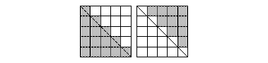
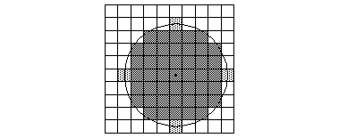
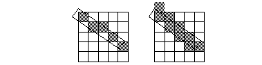
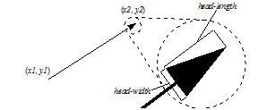
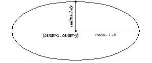
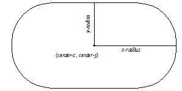
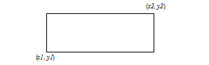

*********************
DUIM-Graphics Library
*********************

Overview
========

The DUIM-Graphics library contains interfaces that define a wide variety
drawing operations for use in your GUI applications, as well as two
classes. The library contains a single module, *duim-graphics*, from
which all the interfaces described in this chapter are exposed.
`DUIM-Graphics Module`_ contains complete reference
entries for each exposed interface.

The DUIM graphic drawing model is an idealized model of graphical
pictures. The model provides the language that application programs use
to describe the intended visual appearance of textual and graphical
output. Usually not all of the contents of the screen are described
using the graphic drawing model. For example, menus and scroll bars
would usually be described in higher-level terms.

An important aspect of the DUIM graphic drawing model is its extreme
device independence. The model describes ideal graphical images and
ignores limitations of actual graphics devices. One consequence of this
is that the actual visual appearance of the screen can only be an
approximation of the appearance specified by the model: however, another
important consequence of this is that the model is highly portable.

DUIM separates output into two layers:

A text/graphics layer in which you specify the desired visual appearance
independent of device resolution and characteristics

#. A rendering layer in which some approximation of the desired visual
   appearance is created on the device.

Of course application programs can inquire about the device resolution
and characteristics if they wish and modify their desired visual
appearance on that basis. There is also a third layer above these two
layers, the adaptive toolkit layer where one specifies the desired
functionality rather than the desired visual appearance.

Definitions
===========

This section contains definitions of terms that will be used in this
chapter.

-  *Drawing plane* A drawing plane is an infinite two-dimensional plane
   on which graphical output occurs. The drawing plane contains an
   arrangement of colors and opacities that is modified by each
   graphical output operation. It is not possible to read back the
   contents of a drawing plane, except by examining the output-history.
   Normally each window has its own drawing plane.
-  *Coordinates* Coordinates are a pair of real numbers in
   implementation-defined units that identify a point in the drawing
   plane.
-  *Mediums* In this chapter, we use a medium as a destination for
   output. The medium has a drawing plane, two designs (called the
   medium’s foreground and background), a transformation, a clipping
   region, a line style, and a text style. There are per-medium,
   dynamically scoped, default drawing options. Different medium classes
   are provided to allow you to draw on different sorts of devices, such
   as displays, printers, and virtual devices such as bitmaps.
-  *Sheets* Many sheets can be used for doing output, so the drawing
   functions can also take a sheet as the output argument. In this case,
   drawing function "trampolines" to the sheet’s medium. So, while the
   functions defined here are specified to be called on mediums, they
   can also be called on sheets.
-  *Streams* A stream is a special kind of sheet that implements the
   stream protocol; streams include additional state such as the current
   text cursor (which is some point in the drawing plane).
-  By default, the "fundamental" coordinate system of a DUIM stream (not
   a general sheet or medium, whose fundamental coordinate system is not
   defined) is a left handed system with x increasing to the right, and
   y increasing downward. (0,0) is at the upper left corner.
-  For more general information about DUIM streams, you should refer to
   the manual *Library Reference: System and I/O*.

Drawing is approximate
======================

Note that although the drawing plane contains an infinite number of
mathematical points, and drawing can be described as an infinite number
of color and opacity computations, the drawing plane cannot be viewed
directly and has no material existence: it is only an abstraction. What
*can* be viewed directly is the result of rendering portions of the
drawing plane onto a medium. No infinite computations or objects of
infinite size are required to implement DUIM, because the results of
rendering have finite size and finite resolution.

A drawing plane is described as having infinitely fine spatial, color,
and opacity resolution, and as allowing coordinates of unbounded
positive or negative magnitude. A viewport into a drawing plane, on the
other hand, views only a finite region (usually rectangular) of the
drawing plane. Furthermore, a viewport has limited spatial resolution
and can only produce a limited number of colors. These limitations are
imposed by the display hardware on which the viewport is displayed. A
viewport also has limited opacity resolution, determined by the finite
arithmetic used in the drawing engine.

Coordinates are real numbers in implementation-defined units. Often
these units equal the spatial resolution of a viewport, so that a line
of thickness 1 is equivalent to the thinnest visible line. However, this
equivalence is not required and should not be assumed by application
programs.

DUIM can be quite restrictive in the size and resolution of its
viewports. For example, the spatial resolution might be only a few dozen
points per inch, the maximum size might be only a few hundred points on
a side, and there could be as few as two displayable colors (usually
black and white). Fully transparent and fully opaque opacity levels are
supported, but a DUIM implementation might support only a few opacity
levels in between (or possibly even none). A DUIM implementation might
implement color blending and unsaturated colors by stippling, although
it is preferred, when possible, for a viewport to display a uniform
color as a uniform color rather than as a perceptible stipple.

However, there are no such limitations when DUIM records the output to a
sheet, since DUIM just remembers the drawing operations that were
performed, not the results of rendering.

The application programmer uses the DUIM graphic drawing model as an
interface to describe the intended visual appearance. DUIM then
approximates that ideal appearance in a viewport, within its limitations
of spatial resolution, color resolution, number of simultaneously
displayable colors, and drawing speed.

Naturally, doing this usually requires trade-offs, for example between
speed and accuracy, and these trade-offs depend on the hardware and
software environment and the user concerns in any given situation. For
example:

-  If the device only supports a limited number of colors, the desired
   color may be approximated using techniques such as dithering or
   stippling.
-  If the device cannot draw curves precisely, they may be approximated,
   with or without anti-aliasing.
-  If the device has limited opacity resolution, color blending may be
   approximate. A viewport might display colors that do not appear in
   the drawing plane, both because of color and opacity approximation
   and because of anti-aliasing at the edges of drawn shapes.

Drawing computations are always carried out "in color", even if the
viewport is only capable of displaying black and white. In other words,
the DUIM drawing model is always the fully general model, even if an
implementation’s color resolution is limited enough that full use of the
model is not possible. Of course an application that fundamentally
depends on color will not work well on a viewport that cannot display
color. Other applications will degrade gracefully.

Whether the implementation uses raster graphics or some other display
technique is invisible at this interface. DUIM does not specify the
existence of pixels nor the exact details of scan conversion, which will
vary from one drawing engine to the next.

Rendering conventions for geometric shapes
==========================================

This section describes the conventions for how DUIM renders a shape on a
display device.

When DUIM draws a geometric shape on a display device, the idealized
geometric shape must somehow be rendered on that device. This involves
mapping points on the idealized geometric shape onto points on the
display device.

Idealized geometric shapes are made up of a set of mathematical points
which have no size. The rendering of these shapes on the display device
is usually composed of pixels, which are roughly square, and are
specified in "device coordinates". Device coordinates are calculated by
transforming the user-supplied coordinates by each of the following:

-  The user-supplied transformation
-  The medium transformation
-  The transformation that maps from the sheet to the display device

*Note:* If the last of these is a pure translation that translates by an
integer multiple of device units, then it has no effect on the rendering
other than placement of the figure drawn on the display device.

Roughly speaking, a pixel is affected by drawing a shape only when it is
inside that shape. Since pixels are little squares, and the abstract
points in an idealized geometric shape have no size, most shapes will
have many pixels that lie only partially inside the shape. It is
important, therefore, to describe which pixels will be affected when
rendering a shape, and which will not.

On devices that support color or grayscale, the rendering engine uses
anti-aliasing techniques to render pixels that lie only partially inside
the shape. That is, the affected pixels are drawn a little lighter than
pixels that are wholly within the shape, the precise shade depending on
how much of it is inside the shape.

The conventions used by DUIM are the same as the conventions used by
X11:

-  A pixel is a addressed by its upper-left corner.
-  A pixel is considered to be inside a shape, and hence affected by the
   rendering of that shape, if the center of the pixel is inside the
   shape. If the center of the pixel lies exactly on the boundary of the
   shape, it is considered to be inside the shape if the inside of the
   shape is immediately to the right of the center point of the pixel
   (that is, an increasing x direction on the display device). If the
   center of the pixel lies exactly on a horizontal boundary, it is
   considered to be inside the shape if the inside of the shape is
   immediately below the center point of the pixel (that is, an
   increasing y direction on the display device). This situation is
   illustrated in `How pixels are defined to be "inside" and
   "outside" shapes`_.
-  An unfilled idealized geometric shape is drawn by calculating an
   artificial area for the shape, and then deciding which pixels are
   inside or outside that area, using the rules described above. The
   artificial area is calculated by taking the filled shape consisting
   of those points that are within half the line thickness from the
   outline curve (using a normal distance function, that is, the length
   of the line drawn at right angles to the tangent to the outline curve
   at the nearest point). To visualize this, imagine a filled shape the
   same size as the unfilled shape, and overlay on this filled shape an
   identical, but slightly smaller, unfilled shape.

It is important to note that these rules imply that the decision point
used for insideness checking is offset from the point used for
addressing the pixel by half a device unit in both the x and y
directions. It is worth considering the motivations for these
conventions.

When two shapes share a common edge, it is important that only one of
the shapes own any pixel. The two triangles in `Two
triangles`_ illustrate this. The pixels along the
diagonal belong to the lower figure. When the decision point of the
pixel (its center) lies to one side of the line or the other, there is
no issue. When the boundary passes through a decision point, which side
the inside of the figure is on is used to decide.

Two triangles

The reason for choosing the decision point half a pixel offset from the
address point is to reduce the number of common figures (such as
rectilinear lines and rectangles with integral coordinates) that invoke
the boundary condition rule. This usually leads to more symmetrical
results. For instance, shows a circle drawn when the decision point is
the same as the address point. The four lighter points are
indeterminate: it is not clear whether they are inside or outside the
shape. Since each boundary case is determined according to which side
has the figure on it, and since the same rule must be applied uniformly
for all figures, there is no choice but to pick only two of the four
points, leading to an undesirable lopsided figure.

Choosing any two of the shaded pixels causes asymmetry

If all four boundary points had been chosen instead, the result would be
a symmetrical figure. However, since this figure is symmetrical about a
whole pixel, it is one pixel wider than it ought to be. The problem with
this can be seen clearly in `Two forms of a circle inscribed in a
square`_, in which a circle is drawn over a square.
In the left-hand figure, the decision point is at the center of the
pixel, but in the right-hand figure, it is not.

Two forms of a circle inscribed in a square

.. figure:: images/graphics-6.png
   :align: center
   :alt: 
It is for this reason that the decision point is at the center of the
pixel. This draws circles that look like the one in `An
aesthetically pleasing circle`_.

An aesthetically pleasing circle

.. figure:: images/graphics-7.png
   :align: center
   :alt: 
A consequence of these rendering conventions is that, when the start or
end coordinate (minus half the line thickness, if the shape is a path)
is not an integer, then rendering is not symmetric under reflection
transformations. Thus, to correctly and portably draw an outline of
thickness 1 around a (rectilinear) rectangular area with integral
coordinates, the outline path must have half-integral coordinates.
Drawing rectilinear areas whose boundaries are not on pixel boundaries
cannot be guaranteed to be portable. In other words, the "control
points" for a rectangular area are at the corners, while the control
points for a rectilinear path are in the center of the path, not at the
corners. Therefore, in order for a path and an area to abut seamlessly,
the coordinates of the path must be offset from the coordinates of the
area by half the thickness of the path.

Permissible alternatives during rendering
^^^^^^^^^^^^^^^^^^^^^^^^^^^^^^^^^^^^^^^^^

Some platforms may distinguish between lines of the minimum thinness
from lines that are thicker than that. The two rasterizations depicted
in `Two examples of lines of thickness 1`_ are
both perfectly reasonable rasterizations of tilted lines that are a
single device unit wide. The right-hand line is drawn as a tilted
rectangle, the left as the "thinnest visible" line.

Two examples of lines of thickness 1

For thick lines, a platform may choose to draw the exact tilted
fractional rectangle, or the coordinates of that rectangle might be
rounded so that it is distorted into another polygonal shape. The latter
case may be prove to be faster on some platforms. The two rasterizations
depicted in `Two examples of lines of thickness
2`_ are both reasonable.

Two examples of lines of thickness 2

.. figure:: images/graphics-9.png
   :align: center
   :alt: 
The decision about which side of the shape to take when a boundary line
passes through the decision point is made arbitrarily, although this is
compatible with the X11 definition. This is not necessarily the most
convenient decision. The main problem with this is illustrated by the
case of a horizontal line (see `Two possible definitions of
horizontal lines. Left figure is X11 definition`_).
The DUIM definition draws the rectangular slice above the coordinates,
since those pixels are the ones whose centers have the figure
immediately above them. This definition makes it simpler to draw
rectilinear borders around rectilinear areas.

Two possible definitions of horizontal lines. Left figure is X11
definition

.. figure:: images/graphics-10.png
   :align: center
   :alt: 
Drawing using path related functions
====================================

A number of functions are provided that let you perform a number of
connected drawing operations by encapsulating all the operations as a
single path, rendering the graphic itself only when the whole path has
been defined explicitly. You can use these functions by following the
general procedure below:

Create a new path using *start-path*.

#. Define the appearance of the path using any combination of *line-to*
   , *move-to*, *curve-to*, and *arc-to*.
#. Optionally, use *close-path* to create a closed path from the
   segments defined in step `Define the appearance of the path using
   any combination of line-to, move-to, curve-to, and
   arc-to.`_ above.
#. End the current path definition using *end-path* (if you have not
   already used *close-path*).
#. Render the outline of the path to the drawable object using
   *stroke-path*.
#. If the path you created is closed, flood fill the path using
   *fill-path*.

Each of these functions is described in a little more in the following
sections. For full details about each individual function, refer to its
full reference entry in `DUIM-Graphics
Module`_.

Functions for controlling the definition of a path
^^^^^^^^^^^^^^^^^^^^^^^^^^^^^^^^^^^^^^^^^^^^^^^^^^

The following generic functions provide overall control of the
definition of a path. In each case, the argument *drawable* is either a
sheet or a medium.

start-path

Generic function

start-path *drawable* => ()

Starts a new path on *drawable*. The path can be created with any
number of calls to *line-to*, *curve-to*, *arc-to*, and *move-to*.
Its appearance can also be manipulated using *fill-path* and
*stroke-path*.

After creating the path, use either *close-path* or *end-path* to finish
the path, or *abort-path* to abandon it altogether.

end-path

Generic function

end-path *drawable* => ()

Ends the definition of the current path in *drawable*. Once the
definition has been ended, the path can be rendered to the drawable
using *fill-path* or *stroke-path*.

The function *close-path* can also be used to end the definition of a
path.

close-path

Generic function

close-path *drawable* => ()

Closes the current path on the *drawable*: that is, creates a closed
figure from the elements already defined.

For example, if you create a path that has four connected lines (using
*line-to*), you can use *close-path* to join the first and last lines
in the path to create a closed, five-sided figure.

abort-path

Generic function

abort-path *drawable* => ()

Aborts the current path on *drawable*. Any operations that have been
performed since the last call to *start-path* are discarded.

fill-path

Generic function

fill-path *drawable* => ()

Uses the current brush to fill the current path on *drawable*. Only
closed paths can be filled. If the path has not already been closed
using `close-path`_, it is closed
automatically.

stroke-path

Generic function

stroke-path *drawable* => ()

Uses the current pen to draw the current path on *drawable*. Note that
the path must not have been previously filled. This function does not
close the path: you must use *close-path* if you wish to do this.

Functions for describing the appearance of a path
^^^^^^^^^^^^^^^^^^^^^^^^^^^^^^^^^^^^^^^^^^^^^^^^^

The following generic functions actually perform drawing operations
within a path. Again, in each case, the argument *drawable* is either a
sheet or a medium. All other arguments are instances of ``<real>``.

line-to

Generic function

line-to *drawable x y* => ()

Draws a line from the current position in the path to (*x*,*y*).

curve-to

Generic function

curve-to *drawable x1 y1 x2 y2 x3 y3* => ()

Draws a curve in the current path on *drawable* starting from the
current position, and passing through (*x1*,*y1*), (*x2*, *y2*), and
(*x3*, *y3*).

move-to

Generic function

move-to *drawable x y* => ()

Move the position in the current path on *drawable* to (*x*,*y*).

The function *move-to* can be used several times within the definition
of a path, allowing for the definition of several visually separate
sections within the same path.

arc-to

Generic function

arc-to *drawable center-x center-y radius-1-dx radius-1-dy radius-2-dx
radius-2-dy* #key *start-angle end-angle* => ()

Draws an arc in the current path on *drawable*.

Description of the arguments for arc-to

.. figure:: images/graphics-11.png
   :align: center
   :alt: 
The center of the arc is defined by (*center-x*, *center-y*), the
points furthest away from the center for each radius are calculated by
adding *radius-1-dx* and *radius-1-dy* to *center-x* and *center-y*
respectively (to calculate the outermost points for the first radius),
and adding *radius-2-dx* and *radius-2-dy* to *center-x* and *center-y*
respectively (to calculate the outermost points for the second radius).

The arguments *start-angle* and *end-angle* define the extent of the arc
that is drawn.

For each function listed above, an equivalent function is also provided
that passes composite objects in its arguments, rather than separate
coordinates. These functions take the same name as the functions above,
but with a *\** character appended. (Thus, *line-to\** performs the same
operation as *line-to*, but passes composite objects in its arguments).
You should be aware that using these composite object functions may lead
to a loss of performance. For more details, see the full reference
entries for each function.

DUIM-Graphics Module
====================

This section contains a complete reference of all the interfaces that
are exported from the *duim-graphics* module.

abort-path
----------

Generic function
''''''''''''''''
Aborts the current path on the specified drawable object.

   :signature: abort-path *drawable* => ()

Arguments

-  *drawable* An instance of type *type-union(`See
   <sheet> <silica.htm#13118>`_, `<medium> <silica.htm#60437>`_)*.

Values

-  None.

   :description:

Aborts the current path on *drawable*. Any operations that have been
performed since the last call to `start-path`_
are discarded.

   See also

`close-path`_

`end-path`_

`start-path`_

arc-to
------

Generic function
''''''''''''''''
Draws an arc in the current path on the specified drawable.

   :signature: arc-to *drawable center-x center-y radius-1-dx radius-1-dy radius-2-dx
radius-2-dy* #key *start-angle end-angle* => ()

arc-to\* *drawable center radius-1-dx radius-1-dy radius-2-dx
radius-2-dy* #key *start-angle end-angle* => ()

Arguments

-  *drawable* An instance of type *type-union(`See
   <sheet> <silica.htm#13118>`_, `<medium> <silica.htm#60437>`_)*.
-  *radius-1-dx* An instance of type ``<real>``.
-  *radius-1-dy* An instance of type ``<real>``.
-  *radius-2-dx* An instance of type ``<real>``.
-  *radius-2-dy* An instance of type ``<real>``.
-  *start-angle* An instance of type ``false-or(<real>)``.
-  *end-angle* An instance of type ``false-or(<real>)``.

The following arguments are specific to *arc-to*.

-  *center-x* An instance of type ``<real>``.
-  *center-y* An instance of type ``<real>``.

The following argument is specific to *arc-to\**.

-  *center* An instance of type `<transform> <geom.htm#33417>`_.

Values

-  None.

   :description:

Draws an arc in the current path on the specified drawable.

This function is used, in combination with `See
line-to`_, `curve-to`_,
and `move-to`_, to define a path. The function
`start-path`_ should be used to start the
definition of the path, and `end-path`_ can be
used to finish the definition.

The center of the arc is defined by (*center-x*, *center-y*), and the
extreme points of the virtual ellipse around the arc (that is, the
points furthest away from the center for each radius) are calculated by
adding the radius vectors *radius-1-dx* and *radius-1-dy* to *center-x*
and *center-y* respectively (to calculate the outermost points for the
first radius), and adding the radius vectors *radius-2-dx* and
*radius-2-dy* to *center-x* and *center-y* respectively (to calculate
the outermost points for the second radius).

Please note that *arc-to* does not currently support arcs whose
orientation is not axis-aligned ellipses. For all practical purposes,
this means that *radius-1-dy* and *radius-2-dx* must always be 0.

.. figure:: images/graphics-12.png
   :align: center
   :alt: 
The arguments *start-angle* and *end-angle* define the extent of the arc
that is drawn.

The function *arc-to\** is identical to *arc-to*, except that it passes
composite objects, rather than separate coordinates, in its arguments.
You should be aware that using this function may lead to a loss of
performance.

   See also

`curve-to`_

`draw-bezier-curve`_

`draw-line`_

`line-to`_

`move-to`_

close-path
----------

Generic function
''''''''''''''''
Closes the current path on the specified drawable.

   :signature: close-path *drawable* => ()

Arguments

-  *drawable* An instance of type *type-union(`See
   <sheet> <silica.htm#13118>`_, `<medium> <silica.htm#60437>`_)*.

Values

-  None.

   :description:

Closes the current path on the *drawable*: that is, creates a closed
figure from the elements already defined.

For example, if you create a path that has four connected lines (using
`line-to`_), you can use *close-path* to join
the first and last lines in the path to create a closed, five-sided
figure.

Only closed paths can be filled, although `See
fill-path`_ will close a non-closed path
automatically.

   See also

`abort-path`_

`end-path`_

`start-path`_

copy-area
---------

Generic function
''''''''''''''''
Copies a rectangle of pixels from a specified medium to the same medium.

   :signature: copy-area *medium from-x from-y width height to-x to-y* #key *function*
=> ()

Arguments

-  *medium* An instance of type *`<medium> <silica.htm#60437>`_*.
-  *from-x* An instance of type *<coordinate>*.
-  *from-y* An instance of type *<coordinate>*.
-  *width* An instance of type ``<integer>``.
-  *height* An instance of type ``<integer>``.
-  *to-x* An instance of type *<coordinate>*.
-  *to-y* An instance of type *<coordinate>*.
-  *function* An instance of type ``<function>``. Default value: `See
   $boole-1 <dcs.htm#36174>`_.

   :description:

Copies the pixels from the *medium* starting at the position specified
by (*from-x*, *from-y*) to the position (*to-x*, *to-y*) on the same
medium. A rectangle whose width and height is specified by *width* and
*height* is copied. If *medium* is a medium or a stream, then the x and
y values are transformed by the user transformation. The copying must be
done by *medium-copy-copy*.

   See also

`copy-from-pixmap`_

`copy-to-pixmap`_

copy-from-pixmap
----------------

Generic function
''''''''''''''''
Copies a rectangle of pixels from the specified pixmap to the specified
medium.

   :signature: copy-from-pixmap *pixmap pixmap-x pixmap-y width height medium medium-x
medium-y* #key *function* => ()

Arguments

-  *pixmap* An instance of type :class:`<pixmap>`.
-  *pixmap-x* An instance of type *<coordinate>*.
-  *pixmap-y* An instance of type *<coordinate>*.
-  *width* An instance of type ``<integer>``.
-  *height* An instance of type ``<integer>``.
-  *medium* An instance of type *<coordinate>*.
-  *medium-x* An instance of type *<coordinate>*.
-  *medium-y* An instance of type *<coordinate>*.
-  *function* An instance of type ``<function>``. Default value: `See
   $boole-1 <dcs.htm#36174>`_.

   :description:

Copies a rectangle of pixels from *pixmap* starting at the position
specified by (*pixmap-x*,*pixmap-y*) into *medium* at the position
(*medium-x*,*medium-y*). A rectangle whose width and height is
specified by *width* and *height* is copied. If *medium* is a medium or
a stream, then *medium-x* and *medium-y* are transformed by the user
transformation. The copying must be done by *medium-copy-copy*.

   See also

`copy-area`_

`copy-to-pixmap`_

`<pixmap>`_

copy-to-pixmap
--------------

Generic function
''''''''''''''''
Copies a rectangle of pixels from the specified medium to the specified
pixmap.

   :signature: copy-to-pixmap *medium medium-x medium-y width height pixmap pixmap-x
pixmap-y* #key *function* => ()

Arguments

-  *medium* An instance of type *`<medium> <silica.htm#60437>`_*.
-  *medium-x* An instance of type *<coordinate>*.
-  *medium-y* An instance of type *<coordinate>*.
-  *width* An instance of type ``<integer>``.
-  *height* An instance of type ``<integer>``.
-  *pixmap* An instance of type :class:`<pixmap>`.
-  *pixmap-x* An instance of type *<coordinate>*.
-  *pixmap-y* An instance of type *<coordinate>*.
-  *function* An instance of type ``<function>``. Default value: `See
   $boole-1 <dcs.htm#36174>`_.

   :description:

Copies the pixels from the *medium* starting at the position specified
by (*medium-x*,*medium-y*) into *pixmap* at the position specified by
(*pixmap-x*,*pixmap-y*). A rectangle whose width and height is
specified by *width* and *height* is copied. If *medium* is a medium or
a stream, then *medium-x* and *medium-y* are transformed by the user
transformation. The copying must be done by *medium-copy-copy*.

If *pixmap* is not supplied, a new pixmap will be allocated.

   See also

`copy-area`_

`copy-from-pixmap`_

curve-to
--------

Generic function
''''''''''''''''
Draws a curve through three specified points in the current path on the
specified drawable.

   :signature: curve-to *drawable x1 y1 x2 y2 x3 y3* => ()

curve-to\* *drawable point1 point2 point3* => ()

Arguments

-  *drawable* An instance of type *type-union(`See
   <sheet> <silica.htm#13118>`_, `<medium> <silica.htm#60437>`_)*.

The following arguments are specific to *curve-to*.

-  *x1* An instance of type ``<real>``.
-  *y1* An instance of type ``<real>``.
-  *x2* An instance of type ``<real>``.
-  *y2* An instance of type ``<real>``.
-  *x3* An instance of type ``<real>``.
-  *y3* An instance of type ``<real>``.

The following arguments are specific to *curve-to\**.

-  *point1* An instance of type `<transform> <geom.htm#33417>`_.
-  *point2* An instance of type `<transform> <geom.htm#33417>`_.
-  *point3* An instance of type `<transform> <geom.htm#33417>`_.

Values

-  None.

   :description:

Draws a curve in the current path on *drawable* starting from the
current position, and passing through (*x1*,*y1*), (*x2*, *y2*), and
(*x3*, *y3*).

This function is used, in combination with `See
line-to`_, `move-to`_, and
`arc-to`_, to define a path. The function `See
start-path`_ should be used to start the definition
of the path, and `end-path`_ can be used to
finish the definition.

The function *curve-to\** is identical to *curve-to*, except that it
passes composite objects, rather than separate coordinates, in its
arguments. You should be aware that using this function may lead to a
loss of performance.

   See also

`arc-to`_

`draw-bezier-curve`_

`draw-line`_

`line-to`_

`move-to`_

destroy-pixmap
--------------

Generic function
''''''''''''''''
Destroys the specified pixmap.

   :signature: destroy-pixmap *pixmap* => ()

Arguments

-  *pixmap* An instance of type :class:`<pixmap>`.

   :description:

Destroys *pixmap*.

   See also

`draw-pixmap`_

do-with-output-to-pixmap
------------------------

Generic function
''''''''''''''''
Returns a pixmap for the specified medium.

   :signature: do-with-output-to-pixmap *medium continuation* #key *width height
clear?* => *pixmap*

Arguments

-  *medium* An instance of type *`<medium> <silica.htm#60437>`_*.
-  *continuation* An instance of type ``<function>``.
-  *width* An instance of type ``<integer>``.
-  *height* An instance of type ``<integer>``.
-  *clear?* An instance of type ``<boolean>``. Default value: ``#t``.

Values

-  *pixmap* An instance of type :class:`<pixmap>`.

   :description:

Returns a pixmap for the specified medium. This function is called by
`with-output-to-pixmap`_ and returns the pixmap
that is operated on. If you are subclassing `See
<medium> <silica.htm#60437>`_, you must define new methods on this
function.

The *width* and *height* are integers that give the width and height of
the pixmap. If they are unsupplied, the result pixmap will be large
enough to contain all of the output done by the body of code executed by
`with-output-to-pixmap`_.

   See also

`with-output-to-pixmap`_

draw-arrow
----------

Generic function
''''''''''''''''
Draws an arrow between two specified points.

   :signature: draw-arrow *drawable x1 y1 x2 y2* #key *from-head? to-head? head-length
head-width* => ()

draw-arrow\* *drawable point1 point2* #key *from-head? to-head?
head-length head-width* => ()

Arguments

-  *drawable* An instance of type *type-union(`See
   <sheet> <silica.htm#13118>`_, `<medium> <silica.htm#60437>`_)*.
-  *from-head?* An instance of type ``<boolean>``. Default value: ``#f``.
-  *to-head?* An instance of type ``<boolean>``. Default value: ``#t``.
-  *head-length* An instance of type ``<integer>``. Default value: *10*.
-  *head-width* An instance of type ``<integer>``. Default value: *5*.

The following arguments are specific to *draw-arrow*.

-  *x1* An instance of type ``<real>``.
-  *y1* An instance of type ``<real>``.
-  *x2* An instance of type ``<real>``.
-  *y2* An instance of type ``<real>``.

The following arguments are specific to *draw-arrow\**.

-  *point1* An instance of type `<transform> <geom.htm#33417>`_.
-  *point2* An instance of type `<transform> <geom.htm#33417>`_.

Values

-  None.

   :description:

Draws an arrow on *drawable* between two (*x1*,*y1*) and (*x2*, *y2*
), using the current pen. Dashed lines start dashing from the first
point.

If *from-head?* is ``#t``, then the arrow-head points from (*x1*,*y1*)
to (*x2*, *y2*). If *to-head?* is ``#t``, then the arrow-head points
from (*x2*, *y2*) to (*x1*,*y1*).

If both *from-head?* and *to-head?* are ``#t``, then a double-headed
arrow is drawn.

The arguments *head-length* and *head-width* specify the length and
width of the arrow-head respectively, in pixels.

The function *draw-arrow\** is identical to *draw-arrow*, except that
it passes composite objects, rather than separate coordinates, in its
arguments. You should be aware that using this function may lead to a
loss of performance.

   See also

`draw-line`_

draw-bezier-curve
-----------------

Generic function
''''''''''''''''
Draws a bezier curve through the specified set of points.

   :signature: draw-bezier-curve *sheet coord-seq* #key *filled?* => ()

draw-bezier-curve\* *drawable points* #key *filled?* => ()

Arguments

-  *filled?* An instance of type ``<boolean>``. Default value: ``#t``.

The following arguments are specific to *draw-bezier-curve*.

-  *sheet* An instance of type *`<sheet> <silica.htm#13118>`_*.
-  *coord-seq* An instance of type *limited(<sequence>, of:
   <coordinate>)*.

The following arguments are specific to *draw-bezier-curve\**.

-  *drawable* An instance of type *type-union(`See
   <sheet> <silica.htm#13118>`_, `<medium> <silica.htm#60437>`_)*.
-  *points* An instance of type *limited(<sequence>, of: `See
   <point> <geom.htm#15734>`_)*.

Values

-  None.

   :description:

Draws a bezier curve on *sheet* or *drawable* (depending on the function
you use) through the sequence of coordinates given by *coord-seq*,
using the current pen. Dashed lines start dashing from the first point.

If *filled?* is ``#t`` then the bezier-curve will be filled, using the
current brush.

The function *draw-bezier-curve\** is identical to *draw-bezier-curve*,
except that it passes composite objects, rather than separate
coordinates, in its arguments. You should be aware that using this
function may lead to a loss of performance.

   See also

`curve-to`_

`draw-line`_

draw-circle
-----------

Generic function
''''''''''''''''
Draws a circle with the specified center and radius.

   :signature: draw-circle *drawable center-x center-y radius* #key *start-angle
end-angle filled?* => ()

draw-circle\* *drawable center radius #key start-angle end-angle
filled?* => ()

Arguments

-  *drawable* An instance of type *type-union(`See
   <sheet> <silica.htm#13118>`_, `<medium> <silica.htm#60437>`_)*.
-  *radius* An instance of type ``<real>``.
-  *start-angle* An instance of type ``false-or(<real>)``.
-  *end-angle* An instance of type ``false-or(<real>)``.
-  *filled?* An instance of type ``<boolean>``. Default value: ``#t``.

The following arguments are specific to *draw-circle*.

-  *center-x* An instance of type ``<real>``.
-  *center-y* An instance of type ``<real>``.

The following argument is specific to *draw-circle\**.

-  *center* An instance of type `<transform> <geom.htm#33417>`_.

Values

-  None.

   :description:

Draws a circle on *drawable* with center (*center-x*,*center-y*) and a
radius of *radius* pixels, using the current pen.

The *start-angle* and *end-angle* arguments let you draw a sector of a
circle rather than a whole circle.

If *filled?* is ``#t``, then the circle will be filled, using the current
brush.

The function *draw-circle\** is identical to *draw-circle*, except that
it passes composite objects, rather than separate coordinates, in its
arguments. You should be aware that using this function may lead to a
loss of performance.

   See also

`draw-ellipse`_

`draw-oval`_

draw-ellipse
------------

Generic function
''''''''''''''''
Draws an ellipse with the specified center and radius vectors.

   :signature: draw-ellipse *drawable center-x center-y radius-1-dx radius-1-dy
radius-2-dx radius-2-dy* #key *start-angle end-angle filled?* => ()

draw-ellipse\* *drawable center radius-1-dx radius-1-dy radius-2-dx
radius-2-dy* #key *start-angle end-angle filled?* => ()

Arguments

-  *drawable* An instance of type *type-union(`See
   <sheet> <silica.htm#13118>`_, `<medium> <silica.htm#60437>`_)*.
-  *radius-1-dx* An instance of type ``<real>``.
-  *radius-1-dy* An instance of type ``<real>``.
-  *radius-2-dx* An instance of type ``<real>``.
-  *radius-2-dy* An instance of type ``<real>``.
-  *start-angle* An instance of type ``false-or(<real>)``.
-  *end-angle* An instance of type ``false-or(<real>)``.
-  *filled?* An instance of type ``<boolean>``. Default value: ``#t``.

The following arguments are specific to *draw-ellipse*.

-  *center-x* An instance of type ``<real>``.
-  *center-y* An instance of type ``<real>``.

The following argument is specific to *draw-ellipse\**.

-  *center* An instance of type `<transform> <geom.htm#33417>`_.

Values

-  None.

   :description:

Draws an ellipse on *drawable* with the specified center and extreme
points, using the current pen.

The center of the ellipse is defined by (*center-x*, *center-y*), and
the extreme points of the ellipse (that is, the points furthest away
from the center for each radius) are calculated by adding the radius
vectors *radius-1-dx* and *radius-1-dy* to *center-x* and *center-y*
respectively (to calculate the outermost points for the first radius),
and adding the radius vectors *radius-2-dx* and *radius-2-dy* to
*center-x* and *center-y* respectively (to calculate the outermost
points for the second radius).

Please note that *draw-ellipse* does not currently support
non-axis-aligned ellipses. For all practical purposes, this means that
*radius-1-dy* and *radius-2-dx* must always be 0.

The arguments *start-angle* and *end-angle* let you draw just a section
of the ellipse, rather than the whole ellipse.

If *filled?* is ``#t`` then the ellipse will be filled, using the current
brush.

The function *draw-ellipse\** is identical to *draw-ellipse*, except
that it passes composite objects, rather than separate coordinates, in
its arguments. You should be aware that using this function may lead to
a loss of performance.

   See also

`draw-circle`_

`draw-oval`_

draw-image
----------

Generic function
''''''''''''''''
Draws the specified image at the specified position.

   :signature: draw-image *drawable image x y* => ()

draw-image\* *drawable image point* => ()

Arguments

-  *drawable* An instance of type *type-union(`See
   <sheet> <silica.htm#13118>`_, `<medium> <silica.htm#60437>`_)*.
-  *image* An instance of type `<image> <dcs.htm#51234>`_.

The following arguments are specific to *draw-image*.

-  *x* An instance of type ``<real>``.
-  *y* An instance of type ``<real>``.

The following argument is specific to *draw-image\**.

-  *point* An instance of type `<transform> <geom.htm#33417>`_.

Values

-  None.

   :description:

Draws *image* on *drawable* at (*x*,*y*).

The function *draw-image\** is identical to *draw-image*, except that
it passes composite objects, rather than separate coordinates, in its
arguments. You should be aware that using this function may lead to a
loss of performance.

   See also

`draw-pixmap`_

`draw-text`_

draw-line
---------

Generic function
''''''''''''''''
Draws a line between the specified points.

   :signature: draw-line *drawable x1 y1 x2 y2* => ()

draw-line\* *drawable point1 point2* => ()

Arguments

-  *drawable* An instance of type *type-union(`See
   <sheet> <silica.htm#13118>`_, `<medium> <silica.htm#60437>`_)*.

The following arguments are specific to *draw-line*.

-  *x1* An instance of type ``<real>``.
-  *y1* An instance of type ``<real>``.
-  *x2* An instance of type ``<real>``.
-  *y2* An instance of type ``<real>``.

The following arguments are specific to *draw-line\**.

-  *point1* An instance of type `<transform> <geom.htm#33417>`_.
-  *point2* An instance of type `<transform> <geom.htm#33417>`_.

Values

-  None.

   :description:

Draws a line on *drawable* between (*x1*, *y1*) and (*x2*,*y2*),
using the current pen. Dashed lines start dashing from the first point.

The function *draw-line\** is identical to *draw-line*, except that it
passes composite objects, rather than separate coordinates, in its
arguments. You should be aware that using this function may lead to a
loss of performance.

   See also

`curve-to`_

`draw-arrow`_

`draw-bezier-curve`_

`draw-lines`_

`draw-point`_

`line-to`_

draw-lines
----------

Generic function
''''''''''''''''
Draws a series of lines between the specified sequence of points.

   :signature: draw-lines *drawable coord-seq* => ()

draw-lines\* *drawable points* => ()

Arguments

-  *drawable* An instance of type *type-union(`See
   <sheet> <silica.htm#13118>`_, `<medium> <silica.htm#60437>`_)*.

The following argument is specific to *draw-lines*.

-  *coord-seq* An instance of type *limited(<sequence>, of:
   <coordinate>)*.

The following argument is specific to *draw-lines\**.

-  *points* An instance of type *limited(<sequence>, of: `See
   <point> <geom.htm#15734>`_)*.

Values

-  None.

   :description:

Draws a series of lines on *drawable* between the specified sequence of
points, using the current pen. Dashed lines start dashing from the first
point of each line.

The function *draw-lines\** is identical to *draw-line*, except that it
passes composite objects, rather than separate coordinates, in its
arguments. You should be aware that using this function may lead to a
loss of performance.

Example

draw-lines(medium,

vector(100, 150,

200, 250,

300, 350,

400, 450));

   See also

`draw-line`_

`draw-points`_

`draw-rectangles`_

draw-oval
---------

Generic function
''''''''''''''''
Draws an oval with the specified center and radii.

   :signature: draw-oval *drawable center-x center-y x-radius y-radius* #key *filled?*
=> ()

draw-oval\* *drawable center x-radius y-radius* #key *filled?* => ()

Arguments

-  *drawable* An instance of type *type-union(`See
   <sheet> <silica.htm#13118>`_, `<medium> <silica.htm#60437>`_)*.
-  *x-radius* An instance of type ``<real>``.
-  *y-radius* An instance of type ``<real>``.
-  *filled?* An instance of type ``<boolean>``. Default value: ``#t``.

The following arguments are specific to *draw-oval*.

-  *center-x* An instance of type ``<real>``.
-  *center-y* An instance of type ``<real>``.

The following argument is specific to *draw-oval\**.

-  *center* An instance of type `<transform> <geom.htm#33417>`_.

Values

-  None.

   :description:

Draws an oval on *drawable* with center (*center-x*,*center-y*) and
radii defined by *x-radius* and *y-radius*, using the current pen.

Ovals are similar to ellipses, except that they have straight edges.

If *filled?* is ``#t`` then the oval will be filled, using the current
brush.

The function *draw-oval\** is identical to *draw-oval*, except that it
passes composite objects, rather than separate coordinates, in its
arguments. You should be aware that using this function may lead to a
loss of performance.

   See also

`draw-circle`_

`draw-ellipse`_

draw-pixmap
-----------

Generic function
''''''''''''''''
Draws the contents of the specified pixmap at the specified point.

   :signature: draw-pixmap *drawable pixmap x y* #key *function* => ()

draw-pixmap\* *drawable pixmap point* #key *function* => ()

Arguments

-  *drawable* An instance of type *type-union(`See
   <sheet> <silica.htm#13118>`_, `<medium> <silica.htm#60437>`_)*.
-  *pixmap* An instance of type :class:`<pixmap>`.
-  *function* An instance of type ``<function>``. Default value: `See
   $boole-1 <dcs.htm#36174>`_.

The following arguments are specific to *draw-pixmap*.

-  *x* An instance of type ``<real>``.
-  *y* An instance of type ``<real>``.

The following argument is specific to *draw-pixmap\**.

-  *point* An instance of type `<transform> <geom.htm#33417>`_.

Values

-  None.

   :description:

Draws the contents of *pixmap* on *drawable* at (*x*,*y*).

The function *draw-pixmap\** is identical to *draw-pixmap*, except that
it passes composite objects, rather than separate coordinates, in its
arguments. You should be aware that using this function may lead to a
loss of performance.

   See also

`destroy-pixmap`_

`draw-image`_

`draw-text`_

`make-pixmap`_

draw-point
----------

Generic function
''''''''''''''''
Draws a single point at the specified position.

   :signature: draw-point *drawable x y* => ()

draw-point\* *drawable point* => ()

Arguments

-  *drawable* An instance of type *type-union(`See
   <sheet> <silica.htm#13118>`_, `<medium> <silica.htm#60437>`_)*.

The following arguments are specific to *draw-point*.

-  *x* The x coordinate.
-  *y* The y coordinate.

The following argument is specific to *draw-point\**.

-  *point* An instance of type `<transform> <geom.htm#33417>`_.

Values

-  None.

   :description:

Draws a single point on *drawable* at (*x*,*y*).

The function *draw-point\** is identical to *draw-point*, except that
it passes composite objects, rather than separate coordinates, in its
arguments. You should be aware that using this function may lead to a
loss of performance.

   See also

`draw-line`_

`draw-points`_

draw-points
-----------

Generic function
''''''''''''''''
Draws a sequence of points at the specified positions.

   :signature: draw-points *drawable coord-seq* => ()

draw-points\* *drawable points* => ()

Arguments

-  *drawable* An instance of type *type-union(`See
   <sheet> <silica.htm#13118>`_, `<medium> <silica.htm#60437>`_)*.

The following argument is specific to *draw-points*.

-  *coord-seq* An instance of type *limited(<sequence>, of:
   <coordinate>)*.

The following argument is specific to *draw-points\**.

-  *points* An instance of type *limited(<sequence>, of: `See
   <point> <geom.htm#15734>`_)*.

Values

-  None.

   :description:

Draws a sequence of points on *drawable* at the specified positions.

The function *draw-points\** is identical to *draw-points*, except that
it passes composite objects, rather than separate coordinates, in its
arguments. You should be aware that using this function may lead to a
loss of performance.

   See also

`draw-lines`_

`draw-point`_

`draw-rectangles`_

draw-polygon
------------

Generic function
''''''''''''''''
Draws a polygon joining the specified points.

   :signature: draw-polygon *drawable coord-seq* #key *closed? filled?* => ()

draw-polygon\* *drawable points* #key *closed? filled?* => ()

Arguments

-  *drawable* An instance of type *type-union(`See
   <sheet> <silica.htm#13118>`_, `<medium> <silica.htm#60437>`_)*.
-  *closed?* An instance of type ``<boolean>``. Default value: ``#t``.
-  *filled?* An instance of type ``<boolean>``. Default value: ``#t``.

The following argument is specific to *draw-polygon*.

-  *coord-seq* An instance of type *limited(<sequence>, of:
   <coordinate>)*.

The following argument is specific to *draw-polygon\**.

-  *points* An instance of type *limited(<sequence>, of: `See
   <point> <geom.htm#15734>`_)*.

Values

-  None.

   :description:

Draws a polygon on *drawable* joining the specified points, using the
current pen. Dashed lines start dashing at the starting point of the
first segment.

If *closed?* is ``#t``, then the polygon is closed, that is, a line is
drawn from the last point in the sequence back to the first.

If *filled?* is ``#t`` then the polygon will be filled, using the current
brush.

The function *draw-polygon\** is identical to *draw-polygon*, except
that it passes composite objects, rather than separate coordinates, in
its arguments. You should be aware that using this function may lead to
a loss of performance.

   See also

`draw-rectangle`_

`draw-regular-polygon`_

`draw-triangle`_

draw-rectangle
--------------

Generic function
''''''''''''''''
Draws a rectangle at the specified position.

   :signature: draw-rectangle *drawable x1 y1 x2 y2* #key *filled?* => ()

draw-rectangle\* *drawable point1 point2* #key *filled?* => ()

Arguments

-  *drawable* An instance of type *type-union(`See
   <sheet> <silica.htm#13118>`_, `<medium> <silica.htm#60437>`_)*.
-  *filled?* An instance of type ``<boolean>``. Default value: ``#t``.

The following arguments are specific to *draw-rectangle*.

-  *x1* An instance of type ``<real>``.
-  *y1* An instance of type ``<real>``.
-  *x2* An instance of type ``<real>``.
-  *y2* An instance of type ``<real>``.

The following arguments are specific to *draw-rectangle\**.

-  *point1* An instance of type `<transform> <geom.htm#33417>`_.
-  *point2* An instance of type `<transform> <geom.htm#33417>`_.

Values

-  None.

   :description:

Draws a rectangle on *drawable* with left and right corners at (*x1*
,*y1*) and (*x2*,*y2*), using the current pen. Dashed lines start
dashing at the starting point of the first segment.

Note that the specified points could represent either top or bottom
corners: only one rectangle is possible between and pair of points.

If *filled?* is ``#t`` then the rectangle will be filled, using the
current brush.

The function *draw-rectangle\** is identical to *draw-rectangle*,
except that it passes composite objects, rather than separate
coordinates, in its arguments. You should be aware that using this
function may lead to a loss of performance.

   See also

`draw-polygon`_

`draw-rectangles`_

`draw-regular-polygon`_

`draw-triangle`_

draw-rectangles
---------------

Generic function
''''''''''''''''
Draws a sequence of rectangles at the specified positions.

   :signature: draw-rectangles *drawable coord-seq* #key *filled?* => ()

draw-rectangles\* *drawable points* #key *filled?* => ()

Arguments

-  *drawable* An instance of type *type-union(`See
   <sheet> <silica.htm#13118>`_, `<medium> <silica.htm#60437>`_)*.
-  *filled?* An instance of type ``<boolean>``. Default value: ``#t``.

The following argument is specific to *draw-rectangles*.

-  *coord-seq* An instance of type *limited(<sequence>, of:
   <coordinate>)*.

The following argument is specific to *draw-rectangles\**.

-  *points* An instance of type *limited(<sequence>, of: `See
   <point> <geom.htm#15734>`_)*.

Values

-  None.

   :description:

Draws a sequence of rectangles on *drawable* with left and right corners
at the specified positions, using the current pen. Dashed lines start
dashing at the starting point of the first segment of each rectangle.

If *filled?* is ``#t`` then the rectangles will be filled, using the
current brush.

The function *draw-rectangles\** is identical to *draw-rectangles*,
except that it passes composite objects, rather than separate
coordinates, in its arguments. You should be aware that using this
function may lead to a loss of performance.

   See also

`draw-lines`_

`draw-points`_

`draw-rectangle`_

draw-regular-polygon
--------------------

Generic function
''''''''''''''''
Draws a regular polygon that touches the specified points, and has the
specified number of sides.

   :signature: draw-regular-polygon *drawable x1 y1 x2 y2 nsides* #key *handedness
closed? filled?* => ()

draw-regular-polygon\* *drawable point1 point2 nsides* #key *handedness
closed? filled?* => ()

Arguments

-  *drawable* An instance of type *type-union(`See
   <sheet> <silica.htm#13118>`_, `<medium> <silica.htm#60437>`_)*.
-  *nsides* An instance of type ``<integer>``.
-  *handedness* Default value: *#"left"*.
-  *closed?* An instance of type ``<boolean>``. Default value: ``#t``.
-  *filled?* An instance of type ``<boolean>``. Default value: ``#t``.

The following arguments are specific to *draw-regular-polygon*.

-  *x1* An instance of type ``<real>``.
-  *y1* An instance of type ``<real>``.
-  *x2* An instance of type ``<real>``.
-  *y2* An instance of type ``<real>``.

The following arguments are specific to *draw-regular-polygon\**.

-  *point1* An instance of type `<transform> <geom.htm#33417>`_.
-  *point2* An instance of type `<transform> <geom.htm#33417>`_.

Values

-  None.

   :description:

Draws a regular polygon on *drawable*, using the current pen, that
touches the specified points, and has the specified number of sides.
Dashed lines start dashing at the starting point of the first segment.

.. figure:: images/graphics-17.png
   :align: center
   :alt: 
If *filled?* is ``#t`` then the polygon will be filled, using the current
brush.

The function *draw-regular-polygon\** is identical to
*draw-regular-polygon*, except that it passes composite objects, rather
than separate coordinates, in its arguments. You should be aware that
using this function may lead to a loss of performance.

   See also

`draw-polygon`_

`draw-rectangle`_

`draw-triangle`_

draw-text
---------

Generic function
''''''''''''''''
Draws text at the specified point, in a specified direction.

   :signature: draw-text *drawable text x y* #key *start end align-x align-y
towards-point transform-glyphs?* => ()

draw-text\* *drawable text point* #key *start end align-x align-y
towards-point transform-glyphs?* => ()

Arguments

-  *drawable* An instance of type *type-union(`See
   <sheet> <silica.htm#13118>`_, `<medium> <silica.htm#60437>`_)*.
-  *text* An instance of type *type-union(<string>, <character>)*.
-  *start* An instance of type ``<integer>``. Default value: 0.
-  *end* An instance of type ``<integer>``. Default value: *size(* *text*
   *)*.
-  *align-x* An instance of type *one-of(#"left", #"right", #"center")*
   . Default value: *#"left"*.
-  *align-y* An instance of type *one-of(#"top", #"bottom",
   #"baseline")*. Default value: *#"baseline"*.
-  *transform-glyphs?* An instance of type ``<boolean>``. Default value:
   ``#f``.
-  *do-tabs?* An instance of type ``<boolean>``. Default value: ``#f``

The following arguments are specific to *draw-text*.

-  *towards-x* An instance of type ``<real>``.
-  *towards-y* An instance of type ``<real>``.
-  *x* An instance of type ``<real>``.
-  *y* An instance of type ``<real>``.

The following arguments are specific to *draw-text\**.

-  *towards-point* An instance of type `See
   <transform> <geom.htm#33417>`_.
-  *point* An instance of type `<transform> <geom.htm#33417>`_.

Values

-  None.

   :description:

Draws text from *text* on *drawable* at (*x*,*y*). Text is drawn in
the direction of the point (*towards-x*,*towards-y*).

.. figure:: images/graphics-18.png
   :align: center
   :alt: 
If *start* and *end* are specified, then only a section of text is
drawn, starting at character *start*, and ending with character *end*.
By default, the whole of *text* is drawn.

The *align-x* and *align-y* arguments let you specify the left-right
alignment and the top-bottom alignment (respectively) of the text that
is written to *drawable*.

For *align-x*, the whole of the distance between (*x*,*y*) and
(*towards-x*,*towards-y*) is used to align *text*. Thus, if *align-x*
is *#"right"*, the text will appear closer to (*towards-x*,*towards-y*
) than to (*x*,*y*), assuming *text* occupies less space than the
distance between these two points.

The argument *transform-glyphs?* controls whether the text is reversed
in cases when *towards-x* is less than *x*. If *transform-glyphs?* is
``#t``, then text is reversed in these cases, that is, the last character
of *text* to be written is still closest to the point (*towards-x*
,*towards-y*), and the text appears reversed. If *transform-glyphs?* is
``#f``, then the first character of *text* to be written is closest to
the point (*towards-x*,*towards-y*), and the text does not appear
reversed.

If *do-tabs?* is ``#t``, then any tab characters in *text* are honored,
and are drawn as tabs. If *do-tabs?* is ``#f``, then tab characters are
replaced by spaces.

The function *draw-text\** is identical to *draw-text*, except that it
passes composite objects, rather than separate coordinates, in its
arguments. You should be aware that using this function may lead to a
loss of performance.

   See also

`draw-image`_

`draw-pixmap`_

draw-triangle
-------------

Generic function
''''''''''''''''
Draws a triangle between the specified points.

   :signature: draw-triangle *drawable x1 y1 x2 y2 x3 y3* #key *filled?* => ()

draw-triangle\* *drawable p1 p2 p3* #key *filled?* => ()

Arguments

-  *drawable* An instance of type *type-union(`See
   <sheet> <silica.htm#13118>`_, `<medium> <silica.htm#60437>`_)*.
-  *filled?* An instance of type ``<boolean>``. Default value: ``#t``.

The following arguments are specific to *draw-triangle*.

-  *x1* An instance of type ``<real>``.
-  *y1* An instance of type ``<real>``.
-  *x2* An instance of type ``<real>``.
-  *y2* An instance of type ``<real>``.
-  *x3* An instance of type ``<real>``.
-  *y3* An instance of type ``<real>``.

The following arguments are specific to *draw-triangle\**.

-  *p1* An instance of type `<transform> <geom.htm#33417>`_.
-  *p2* An instance of type `<transform> <geom.htm#33417>`_.
-  *p3* An instance of type `<transform> <geom.htm#33417>`_.

Values

-  None.

   :description:

Draws a triangle on *drawable* between the specified points, using the
current pen. Dashed lines start dashing at the starting point of the
first segment.

.. figure:: images/graphics-19.png
   :align: center
   :alt: 
If *filled?* is ``#t`` then the triangle will be filled, using the current
brush.

The function *draw-triangle\** is identical to *draw-triangle*, except
that it passes composite objects, rather than separate coordinates, in
its arguments. You should be aware that using this function may lead to
a loss of performance.

   See also

`draw-polygon`_

`draw-rectangle`_

`draw-regular-polygon`_

end-path
--------

Generic function
''''''''''''''''
Ends the definition of the current path in the specified drawable
object.

   :signature: end-path *drawable* => ()

Arguments

-  *drawable* An instance of type *type-union(`See
   <sheet> <silica.htm#13118>`_, `<medium> <silica.htm#60437>`_)*.

Values

-  None.

   :description:

Ends the definition of the current path in *drawable*. Once the
definition has been ended, the path can be rendered to the drawable
using `fill-path`_ or `See
stroke-path`_.

The function `close-path`_ can also be used to
end the definition of a path.

   See also

`abort-path`_

`close-path`_

`start-path`_

fill-path
---------

Generic function
''''''''''''''''
Uses the current brush to fill the current path on the specified
drawable object.

   :signature: fill-path *drawable* => ()

Arguments

-  *drawable* An instance of type *type-union(`See
   <sheet> <silica.htm#13118>`_, `<medium> <silica.htm#60437>`_)*.

Values

-  None.

   :description:

Uses the current brush to fill the current path on *drawable*. If the
path has not already been closed using `See
close-path`_, it is closed automatically.

   See also

`stroke-path`_

`close-path`_

line-to
-------

Generic function
''''''''''''''''
Draws a line from the current position in the path to a new position.

   :signature: line-to *drawable x y* => ()

line-to\* *drawable point* => ()

Arguments

-  *drawable* An instance of type *type-union(`See
   <sheet> <silica.htm#13118>`_, `<medium> <silica.htm#60437>`_)*.

The following arguments are specific to *line-to*.

-  *x* An instance of type ``<real>``.
-  *y* An instance of type ``<real>``.

The following argument is specific to *line-to\**.

-  *point* An instance of type `<transform> <geom.htm#33417>`_.

Values

-  None.

   :description:

Draws a line from the current position in the path to (*x*,*y*).

This function is used, in combination with `See
move-to`_, `curve-to`_,
and `arc-to`_, to define a path. The function
`start-path`_ should be used to start the
definition of the path, and `end-path`_ can be
used to finish the definition.

The function *line-to\** is identical to *line-to*, except that it
passes composite objects, rather than separate coordinates, in its
arguments. You should be aware that using this function may lead to a
loss of performance.

   See also

`arc-to`_

`curve-to`_

`draw-bezier-curve`_

`draw-line`_

`move-to`_

make-pixmap
-----------

Generic function
''''''''''''''''
Creates a pixmap from the specified medium with a specified size.

   :signature: make-pixmap *medium width height* => *pixmap*

Arguments

-  *medium* An instance of type *`<medium> <silica.htm#60437>`_*.
-  *width* An instance of type ``<integer>``.
-  *height* An instance of type ``<integer>``.

Values

-  *pixmap* An instance of type :class:`<pixmap>`.

   :description:

Creates a pixmap from *medium* with a specified size, in pixels, given
by *width* and *height*.

   See also

`draw-pixmap`_

`<pixmap>`_

`pixmap?`_

move-to
-------

Generic function
''''''''''''''''
Move the position in the current path on the specified drawable.

   :signature: move-to *drawable x y* => ()

move-to\* *drawable point* => ()

Arguments

-  *drawable* An instance of type *type-union(`See
   <sheet> <silica.htm#13118>`_, `<medium> <silica.htm#60437>`_)*.

The following arguments are specific to *move-to*.

-  *x* An instance of type ``<real>``.
-  *y* An instance of type ``<real>``.

The following argument is specific to *move-to\**.

-  *point* An instance of type `<transform> <geom.htm#33417>`_.

Values

-  None.

   :description:

Move the position in the current path on *drawable* to (*x*,*y*).

This function is used, in combination with `See
line-to`_, `curve-to`_,
and `arc-to`_, to define a path. The function
`start-path`_ should be used to start the
definition of the path, and `end-path`_ can be
used to finish the definition.

The function *move-to* can be used several times within the definition
of a path, allowing for the definition of several visually separate
drawings within the same path.

The function *move-to\** is identical to *move-to*, except that it
passes composite objects, rather than separate coordinates, in its
arguments. You should be aware that using this function may lead to a
loss of performance.

   See also

`arc-to`_

`curve-to`_

`line-to`_

<pixmap>
--------

Open abstract instantiable class
''''''''''''''''''''''''''''''''
The class of pixmap objects.

   :superclasses:

`<image> <dcs.htm#51234>`_

Init-keywords

None.

   :description:

The class of pixmap objects.

A pixmap can be thought of as an "off-screen window", that is, a medium
that can be used for graphical output, but is not visible on any display
device. Pixmaps are provided to allow you to generate a piece of output
associated with some display device that can then be rapidly drawn on a
real display device. For example, an electrical CAD system might
generate a pixmap that corresponds to a complex, frequently used part in
a VLSI schematic, and then use `See
copy-from-pixmap`_ to draw the part as needed.

   :operations:

The following operation is exported from the *DUIM-Graphics* module.

`copy-from-pixmap`_ `See
destroy-pixmap`_ `See
draw-image`_
 `draw-pixmap`_ `See
pixmap?`_

The following operation is exported from the *DUIM-DCs* module.

`image-height <dcs.htm#44679>`_ `image-width <dcs.htm#32781>`_

   See also

`draw-pixmap`_

`make-pixmap`_

`pixmap?`_

pixmap?
-------

Generic function
''''''''''''''''
Returns true if the specified object is a pixmap.

   :signature: pixmap? *object* => *pixmap?*

Arguments

-  *object* An instance of type ``<object>``.

Values

-  *pixmap?* An instance of type ``<boolean>``.

   :description:

Returns true if *object* is a pixmap.

   See also

`<pixmap>`_

<pixmap-medium>
---------------

Open abstract instantiable class
''''''''''''''''''''''''''''''''
The class of pixmap mediums.

   :superclasses:

*`<medium> <silica.htm#60437>`_*

Init-keywords

None.

   :description:

The class of pixmap mediums, that, is mediums capable of doing output to
a pixmap.

   :operations:

-  `with-output-to-pixmap`_

   See also

`<medium> <silica.htm#60437>`_

`with-output-to-pixmap`_

restore-clipping-region
-----------------------

start-path
----------

Generic function
''''''''''''''''
Starts a new path on the specified drawable object.

   :signature: start-path *drawable* => ()

Arguments

-  *drawable* An instance of type *type-union(`See
   <sheet> <silica.htm#13118>`_, `<medium> <silica.htm#60437>`_)*.

Values

-  None.

   :description:

Starts a new path on *drawable*. The path can be created with any
number of calls to `line-to`_, `See
curve-to`_ and `move-to`_.
Its appearance can also be manipulated using `See
fill-path`_ and `See
stroke-path`_.

After creating the path, use either `See
close-path`_ or `See
end-path`_ to finish the path, or `See
abort-path`_ to abandon it altogether.

   See also

`abort-path`_

`close-path`_

`end-path`_

stroke-path
-----------

Generic function
''''''''''''''''
Uses the current pen to draw the current path on the specified drawable
object.

   :signature: stroke-path *drawable* => ()

Arguments

-  *drawable* An instance of type *type-union(`See
   <sheet> <silica.htm#13118>`_, `<medium> <silica.htm#60437>`_)*.

Values

-  None.

   :description:

Uses the current pen to draw the current path on *drawable*. Note that
the path must not have been previously filled. This function does not
close the path: you must use `close-path`_ if
you wish to do this.

   See also

`close-path`_

`fill-path`_

with-output-to-pixmap
---------------------

Macro
'''''
Executes a body of code, returning the results to a pixmap.

Macro call

with-output-to-pixmap (*medium*, #rest *options*) *body* end =>
*pixmap*

Arguments

-  *medium* An instance of type `See
   <pixmap-medium>`_.
-  *options* An instance of type ``<object>``.
-  *body* An instance of type ``<object>``.

Values

-  *pixmap* An instance of type :class:`<pixmap>`.

   :description:

Executes a body of code, returning the results to a pixmap.Binds
*medium* to a pixmap medium, that is, a medium that does output to a
pixmap, and then evaluates *body* in that context. All the output done
to *medium* inside of *body* is drawn on the pixmap stream. The pixmap
medium supports the medium output protocol, including all of the
graphics functions.

The returned value is a pixmap that can be drawn onto *medium* using
`copy-from-pixmap`_.

   See also

`do-with-output-to-pixmap`_

`<pixmap-medium>`_

