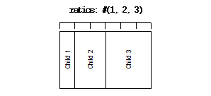

********************
DUIM-Layouts Library
********************

Overview
========

The DUIM-Layouts library contains interfaces that define a number of
layouts for use in your GUI applications, as well as the necessary
functions, generic functions, and macros for creating, manipulating, and
calculating them automatically. The library contains a single module,
*duim-layouts*, from which all the interfaces described in this chapter
are exposed. `DUIM-Layouts Module`_ contains
complete reference entries for each exposed interface.

Layouts are sheet objects that determine how the interface elements are
presented on the screen. A layout object takes a number of children,
expressed as a vector, and lays out those children according to certain
constraints. Each child of a layout must be an instance of a DUIM class.

The class hierarchy for DUIM-Layouts
====================================

This section presents an overview of the available classes of layout,
and describes the class hierarchy present.

The <layout> class and its subclasses
^^^^^^^^^^^^^^^^^^^^^^^^^^^^^^^^^^^^^

The base class for the majority of DUIM layouts is the *<layout>* class,
which is itself a subclass of *<sheet>*. All other layout-oriented
classes are subclasses of *<sheet>*.

The immediate subclasses of *<sheet>* that are exposed by the
DUIM-Layouts library are shown in `Overall class hierarchy for the
DUIM-Layouts library`_. Only
*<basic-composite-pane>*, *<leaf-pane>*, and *<layout>* have any
subclasses defined. See `Subclasses of
<layout>`_ for details of the subclasses of
*<layout>*.

Overall class hierarchy for the DUIM-Layouts library

.. figure:: images/layouts-2.png
   :align: center
   :alt: 
<sheet>

<basic-composite-pane>

<single-child-composite-pane>

<multiple-child-composite-pane>

<layout>

See `Subclasses of <layout>`_

<leaf-pane>

<null-pane>

<drawing-pane>

<simple-pane>

<top-level-sheet>

All the actual layouts provided by the DUIM-Layouts library are
subclasses of the base *<layout>* class, and are described in `See
Subclasses of <layout>`_. In addition, a number of
different types of pane are supplied by the DUIM-Layouts library.

*<basic-composite-pane>*

-  This is a basic type of pane that is used to create any sheet that
   can contain children. It has two subclasses, one used for sheets that
   take only a single child, and one for sheets that can take several
   children.

*<drawing-pane>*

-  This type of pane is used to create sheets on which geometric objects
   are drawn, for example, using the function provided by the
   DUIM-Geometry module or the DUIM-Graphics module. For more
   information on these modules, see `DUIM-Geometry
   Library <geom.htm#31148>`_, and `DUIM-Graphics
   Library <graphics.htm#46330>`_, respectively.

*<top-level-sheet>*

-  This class is used for any sheets that are at the top level of the
   hierarchy of windows on the screen: that is, there is no other sheet
   that is the parent of an instance of *<top-level-sheet>*.
-  *<leaf-pane>* In contrast to *<top-level-sheet>*, an instance of
   *<leaf-pane>* cannot have any children, and is at the end of the
   hierarchy of windows on the screen.
-  *<simple-pane>* This class is the most basic type of pane, and is
   used when no other more suitable class is available.

Subclasses of <layout>
^^^^^^^^^^^^^^^^^^^^^^

The subclasses of *<layout>* are shown in `Subclasses of the
<layout> class`_.

Subclasses of the *<layout>* class

.. figure:: images/layouts-2.png
   :align: center
   :alt: 
<layout>

<row-layout>

<column-layout>

<fixed-layout>

<pinboard-layout>

<stack-layout>

<table-layout>

<grid-layout>

The layouts provided by DUIM fall roughly into two categories:

-  Layout classes that calculate the position and size of their children
   for you, subject to some constraints.
-  Layout classes that let you specify precisely the position of their
   children, and, optionally, the size of the children as well.

The classes of layout available are as follows:

*<column-layout>*

-  This class lays out its children in a single column, with all its
   children left-aligned by default.
-  *<row-layout>* This class lays out its children in a single row.
-  *<stack-layout>* This class lays out its children one on top of
   another, aligned at the top left corner by default. It is
   specifically for windows that contain a number of layouts, only one
   of which is visible at any one time, such as property sheets, tab
   controls, or wizards.
-  *<table-layout>* This class lays out its children in a table,
   according to a specified number of rows and columns.

*<pinboard-layout>*

-  This does not constrain the position of its children in any way. It
   is up to you to position each child individually, like pins on a
   pinboard.
-  *<fixed-layout>* This class is like *<pinboard-layout>*, in that you
   must specify the position of each child. Unlike *<pinboard-layout>*,
   however, you must also specify the size of each child.

In addition to the basic types of layout described above, a subclass of
*<table-layout>* is provided, as follows:

-  *<grid-layout>* This is a specialized version of *<table-layout>*,
   in which all the cells in the table are forced to be the same size.

Column, row, and pinboard layouts

.. figure:: images/layouts-2.png
   :align: center
   :alt: 

.. figure:: images/layouts-3.png
   :align: center
   :alt: 
DUIM-Layouts Module
===================

This section contains a complete reference of all the interfaces that
are exported from the *duim-layouts* module.

allocate-space
--------------

Open generic function
'''''''''''''''''''''
Allocates space within a layout for its children.

   :signature: allocate-space *pane* *width height* => ()

Arguments

-  *pane* An instance of type `<sheet> <silica.htm#13118>`_.
-  *width* An instance of type ``<integer>``.
-  *height* An instance of type ``<integer>``.

   :description:

Allocates space within a layout for its children. During the space
allocation pass, a composite pane arranges its children within the
available space and allocates space to them according to their space
requirements and its own composition rules by calling *allocate-space*
on each of the child panes. For example, `See
<column-layout>`_ arranges all its children in a
vertical column. The *width* and *height* arguments are the width and
height of *pane* in device units, that is, pixels. These arguments give
the amount of space into which all children must fit.

This function actually calls `See
do-allocate-space`_ to perform the calculations.
Client code may specialize `do-allocate-space`_,
but not call it. Call *allocate-space* instead.

   See also

`do-allocate-space`_

<basic-user-pane>
-----------------

Base class
''''''''''
The class of basic user panes.

   :superclasses:

<wrapping-layout-pane>

Init-keywords

-  *region:* An instance of type `<region> <geom.htm#79228>`_.
   Default value: *`$nowhere <geom.htm#77397>`_*.
-  *transform:* An instance of type `<transform> <geom.htm#33417>`_.
   Default value: `$identity-transform <geom.htm#70198>`_.
-  *port:* An instance of type *false-or(`See
   <port> <silica.htm#11606>`_)*. Default value: ``#f``.

*style-descriptor:*

-  An instance of type *false-or(<object>)*. Default value: ``#f``.
-  *help-context:* An instance of type *<object-table>*. Default value:
   *make(<object-table>)*.
-  *help-source:* An instance of type *<object-table>*. Default value:
   *make(<object-table>)*.

   :description:

The class of basic user panes. This is the class that gets subclassed by
`define pane`_.

You specify where on the screen the pane is to be displayed using the
*region:* init-keyword. The region specified should be relative to the
top left corner of the pane’s parent, since the pane must be displayed
within the confines of its parent.

If you wish the location of the pane to be transformed in some way, use
the *transform:* init-keyword.

If you wish to use a port other than the default port, use the *port:*
init-keyword.

You can specify the appearance for text in the pane using the
*style-descriptor:* init-keyword.

The *help-source:* and *help-context:* keywords let you specify pointers
to valid information available in any online help you supply with your
application. The *help-context:* keyword should specify a context-ID
present in the online help. This context-ID identifies the help topic
that is applicable to the current pane. The *help-source:* init-keyword
identifies the source file in which the help topic identified by
*help-context:* can be found. A list of context-IDs should be provided
by the author of the online help system.

   :operations:

-  None.

   See also

`define pane`_

<column-layout>
---------------

Open abstract instantiable class
''''''''''''''''''''''''''''''''
The class of column layouts.

   :superclasses:

`<layout>`_

Init-keywords

-  *border:* An instance of type ``<integer>``. Default value: 0.

*spacing:*, *y-spacing:*

-  An instance of type ``<integer>``. Default value: 0.

*equalize-heights?:*

-  An instance of type ``<boolean>``. Default value: ``#f``.

*equalize-widths?:*

-  An instance of type ``<boolean>``. Default value: ``#f``.
-  *x-alignment:* An instance of type *one-of(#"left", #"right",
   #"center")*. Default value: *#"left"*.

*ratios:*, *y-ratios:*

-  An instance of type *false-or(limited(<sequence>), of: <integer>))*.
   Default value: ``#f``.

   :description:

The class of column layouts. A column layout arranges its children in a
column, automatically calculating the size and placement of each child
within the specified parameters.

Three buttons arranged in a column layout

.. figure:: images/layouts-2.png
   :align: center
   :alt: 

.. figure:: images/layouts-4.png
   :align: center
   :alt: 
The *border:* init-keyword provides a border of whitespace around the
children in the layout, and the value of this init-keyword represents
the size of the border in pixels. This basically has the same effect as
using the macro ` <gadgets.htm#78138>`_ around the layout, except it
uses a simpler syntax.

The *spacing:* or *y-spacing:* init-keywords let you specify how much
vertical space should be inserted, in pixels, between the children of
the layout. These two init-keywords can be used interchangeably.

If true, *equalize-heights?:* ensures that all the children of the
layout have the same height.

If true, *equalize-widths?:* ensures that all the children of the layout
have the same width.

By default, all the children of a column layout are left-aligned. You
can specify that they should be right or center-aligned using the
*x-alignment:* keyword.

The *ratios:* or *y-ratios:* init-keywords let you specify the
proportion of the total layout that should be taken up by each
individual child. These two init-keywords can be used interchangeably.

The value passed to *ratios:* needs to be a sequence of as many integers
as there are children in the layout. Each child is then allocated the
appropriate portion of vertical space in the layout. For example, if the
value *#(1, 2, 3)* is specified for the *ratios:* init-keyword of a
column layout containing three children, then the first child would
claim a sixth of the available vertical space, the second child would
claim a third of the vertical space, and the third child would claim
half the vertical space, as shown in the diagram below.

.. figure:: images/layouts-5.png
   :align: center
   :alt: 
   :operations:

-  None.

Example

contain(make(<column-layout>,

children: vector(make(<button>,

label: "Hello"),

make(<button>,

label: "World"))

spacing: 100,

x-alignment: #"right",

ratios: #(1, 3)));

   See also

`<grid-layout>`_

`<layout>`_

`<row-layout>`_

`<stack-layout>`_

`<table-layout>`_

`vertically`_

compose-space
-------------

Generic function
''''''''''''''''
Returns the amount of space required for a specified child of a
composite pane.

   :signature: compose-space *pane* #key *width height* => *space-req*

Arguments

-  *pane* An instance of type `<sheet> <silica.htm#13118>`_.
-  *width* An instance of type *<integer>>*.
-  *height* An instance of type ``<integer>``.

Values

-  *space-req* An instance of type `See
   <space-requirement>`_.

   :description:

Returns the amount of space required for *pane*, which is a child of a
composite pane. During the space composition pass, a composite pane will
typically ask each of its children how much space it requires by calling
*compose-space*. They answer by returning instances of `See
<space-requirement>`_. The composite pane then forms
its own space requirement by composing the space requirements of its
children according to its own rules for laying out its children.

The value returned by *compose-space* is an instance of `See
<space-requirement>`_ that represents how much space
*pane* requires.

The *width* and *height* arguments are real numbers that the
*compose-space* method for a pane may use as "recommended" values for
the width and height of the pane. These are used to drive top-down
layout.

This function actually calls `do-compose-space`_
to perform the space calculations. Client code may specialize `See
do-compose-space`_ but should not call it. Call
*compose-space* instead.

   See also

`do-compose-space`_

`<space-requirement>`_

current-pane
------------

Generic function
''''''''''''''''
Returns the current pane.

   :signature: current-pane => *pane*

 Values

-  *pane* An instance of type `<sheet> <silica.htm#13118>`_.

   :description:

Returns the current pane: that is, the pane that has the mouse focus.

define pane
-----------

Definition macro
''''''''''''''''
Defines a new class of DUIM pane.

Macro call

define pane *name* ({*supers* },\*) {*slots-and-panes* } end

Arguments

-  *name* A Dylan name*bnf*.
-  *supers* A Dylan name*bnf*.
-  *slots-and-panes* A Dylan body*bnf*.

Values

-  None.

   :description:

This macro lets you define a new class of DUIM pane.

The *name* argument represents the name of the new class of pane, and
*supers* is a list of zero or more superclasses for the new class.
Multiple superclass names are separated by commas.

The *slots-and-panes* argument represents the slot information for the
new class, together with any init-keywords and default values that the
slots should take.

Panes are sheets which represent a "useful unit" in a GUI. There is no
protocol class called *<pane>*.

-  In most cases (such as when defining a frame using *define frame*),
   a pane class groups existing gadgets (or panes) to form effectively a
   new gadget, without actually creating a new class of *<gadget>*.
-  Sometimes, a pane class implements some complex output-only sheet.
-  Sometimes, a pane class implements the `See
   <sheet> <silica.htm#13118>`_ part of a ` <gadgets.htm#34543>`_.

In general, a pane is best described as a *concrete* sheet.

Example

define pane <my-pane> ()

slot my-layout,

init-keyword: layout:;

slot my-exit-buttons,

init-keyword: exit-buttons:;

end pane <my-pane>;

   See also

` <frames.htm#50581>`_

do-allocate-space
-----------------

Open generic function
'''''''''''''''''''''
Called by `allocate-space`_ to calculate space
requirements for a pane.

   :signature: do-allocate-space *pane width height* => ()

Arguments

-  *pane* An instance of type `<sheet> <silica.htm#13118>`_.
-  *width* An instance of type ``<integer>``.
-  *height* An instance of type ``<integer>``.

   :description:

This function is called by `allocate-space`_ to
calculate space requirements for a pane. When calculating space
requirements for classes of pane you have defined yourself, you should
add methods to this function, but not call it directly. Call
*allocate-space* instead.

   See also

`allocate-space`_

do-compose-space
----------------

Open generic function
'''''''''''''''''''''
Called by `compose-space`_ to calculate space
requirements for a child.

   :signature: do-compose-space *pane* #key *width height* => *space-req*

Arguments

-  *pane* An instance of type `<sheet> <silica.htm#13118>`_.
-  *width* An instance of type ``<integer>``.
-  *height* An instance of type ``<integer>``.

Values

-  *space-req* An instance of type `See
   <space-requirement>`_.

   :description:

This function is called by *`compose-space`_* to
calculate space requirements for a child. When calculating space
requirements for children in classes of pane you have defined yourself,
you should specialize this function by adding methods for it. However,
you should not call *do-compose-space* explicitly: call *`See
compose-space`_* instead.

Example

Assume that you have defined a new class of scroll bar as follows:

define class <my-scroll-bar>

(<scroll-bar>,

<leaf-pane>)

end class <test-scroll-bar>;

A new method for do-compose-space can be defined as follows:

define method do-compose-space

(pane :: <my-scroll-bar>, #key width, height)

=> (space-req :: <space-requirement>)

select (gadget-orientation(pane))

#"horizontal" =>

make(<space-requirement>,

width: width \| 50,

min-width: 50,

max-width: $fill,

height: 10);

#"vertical" =>

make(<space-requirement>,

width: 10,

height: height \| 50,

min-height: 50,

max-height: $fill);

end

end method do-compose-space;

   See also

`compose-space`_

<drawing-pane>
--------------

Open abstract instantiable class
''''''''''''''''''''''''''''''''
The class of drawing panes.

   :superclasses:

`<layout>`_

Init-keywords

*display-function:*

-  An instance of type *false-or(<function>)*. Default value: ``#f``.

   :description:

The class of drawing panes. This is a pane that provides event handling
and a drawing surface. Note that a drawing pane can be wrapped around a
layout pane to provide a medium for all the children of the layout pane.

The *display-function:* init-keyword defines the display function for
the pane. This gets called by the `See
handle-repaint <silica.htm#28833>`_ method for *<simple-pane>*.

   :operations:

-  None.

   See also

`handle-repaint <silica.htm#28833>`_

`pane-display-function`_

`<simple-pane>`_

$fill
-----

Constant
''''''''
Default value for width and height init-keywords for layout panes.

   :type:

*<integer>*

Value

100000

   :description:

This constant is used as the default value for any *width:* and
*height:* init-keywords in layout panes.

These defaults gives the intuitive behavior that specifying only the
width or height of a pane causes it to be allocated at least that much
space, and it may be given extra space if there is extra space in the
layout. This default behavior can be changed if either the *min-width:*
or *min-height:* init-keywords are specified explicitly.

   See also

`make`_

<fixed-layout>
--------------

Open abstract instantiable class
''''''''''''''''''''''''''''''''
The class of fixed layouts.

   :superclasses:

`<layout>`_

Init-keywords

-  None.

   :description:

The class of fixed layouts. Fixed layouts are similar to pinboard
layouts, in that the positioning and geometry of the children of a fixed
layout are entirely determined by the programmer. You can place children
at any point in a fixed layout, and the layout does not attempt to
calculate an optimum position or size for any of them.

Fixed layouts differ from pinboard layouts, however, in that any
children placed in a fixed layout are left at exactly the size and
position that they were created: pinboard layouts leave the positions of
any children alone, but constrains the sizes of the children to obey any
constraints they have been given.

Fixed layouts are most useful if you know exactly what size and position
every child in the layout should be.

   :operations:

-  None.

   See also

`<layout>`_

`<pinboard-layout>`_

<grid-layout>
-------------

Open abstract instantiable class
''''''''''''''''''''''''''''''''
The class of grid layouts.

   :superclasses:

`<table-layout>`_

Init-keywords

*cell-space-requirement:*

-  An instance of type `<space-requirement>`_.

   :description:

The class of grid layouts. A grid layout arranges its children in a
grid, automatically calculating the size and placement of each child
within the specified parameters.

The *cell-space-requirement:* init-keyword lets you specify the
preferred space requirement for any individual cell in the grid layout.

   :operations:

-  None.

   See also

`<column-layout>`_

`<row-layout>`_

`<stack-layout>`_

`<table-layout>`_

horizontally
------------

Statement macro
'''''''''''''''
Lays out a series of gadgets horizontally.

Macro call

horizontally ([*options* ]) {*panes* }+ end

Arguments

-  *options* Dylan arguments*bnf*.
-  *panes* One or more occurrences of Dylan body*bnf*.

Values

-  None.

   :description:

This macro lays a series of gadgets out horizontally, creating the
necessary layouts for you automatically.

The *options* are passed directly to the row layout, and thus can be any
legitimate combinations of init-keywords for `See
<row-layout>`_. If no options are specified, then
the default values for row layout are used.

The *panes* argument consists of a number of Dylan expressions, each of
which creates an instance of a gadget or layout that is to be included
in the horizontal layout.

Example

contain(horizontally ()

make(<button>, label: "Hello");

make(<button>, label: "World")

end);

   See also

`<row-layout>`_

`tabling`_

`vertically`_

<layout>
--------

Open abstract class
'''''''''''''''''''
The superclass class of all layout classes.

   :superclasses:

`<sheet> <silica.htm#13118>`_

Init-keywords

*space-requirement:*

-  An instance of type `<space-requirement>`_.
   Required.
-  *width:* An instance of type ``<integer>``. Required.
-  *height:* An instance of type ``<integer>``. Required.
-  *min-width:* An instance of type ``<integer>``. Default value: 0.
-  *min-height:* An instance of type ``<integer>``. Default value: 0.
-  *max-width:* An instance of type ``<integer>``. Default value: `See
   $fill`_.
-  *max-height:* An instance of type ``<integer>``. Default value: `See
   $fill`_.
-  *resizable?:* An instance of type ``<boolean>``. Default value: ``#t``.
-  *fixed-width?:* An instance of type ``<boolean>``. Default value: ``#f``
   .
-  *fixed-height?:* An instance of type ``<boolean>``. Default value:
   ``#f``.

   :description:

The class of layouts. This is the basic class from which all other forms
of layout inherit. You cannot create direct instances of this class.

The *space-requirement:* init-keyword describes the space required for
the layout. It is generally calculated automatically based on the values
of the various width and height init-keywords, and the class of layout
that is being created.

The *width:*, *height:*, *min-width:*, *min-height:*, *max-width:*,
and *max-height:* init-keywords between them describe the configuration
of the layout. The default values for these init-keywords (where
applicable) are set such that the layout always fills the available
space in any given direction.

Finally, three init-keywords are available that control how the layout
is affected when the frame containing it is resized. All three
init-keywords take boolean values. You can specify whether a layout is
resizeable using the *resizable?:* init-keyword. If *fixed-width?:* or
*fixed-height?:* are true, then the layout cannot be resized in the
appropriate direction. Setting both to ``#t`` is equivalent to setting
resizeable?: to ``#f``. Different subclasses of layout restrict the
values of these init-keywords in different ways, such that, for
instance, a row layout has a fixed height.

   :operations:

-  None.

   See also

`<column-layout>`_

`<grid-layout>`_

`<pinboard-layout>`_

`<row-layout>`_

`<stack-layout>`_

`<table-layout>`_

layout-border
-------------

Generic function
''''''''''''''''
Returns the amount of whitespace around the children in a layout.

   :signature: layout-border *layout* => *border*

Arguments

-  *layout* An instance of type *type-union(
    `<row-layout>`_, `See
   <column-layout>`_, `See
   <table-layout>`_,* `See
   <grid-layout>`_*,
    `<stack-layout>`_)*.

Values

-  *border* An instance of type ``<integer>``.

   :description:

Returns the amount of whitespace, in pixels, around the children in
*layout*.

Note that this function does not apply to pinboard layouts, because the
positioning of the children in a pinboard layout is completely in the
control of the programmer.

   See also

*`layout-border-setter`_*

layout-border-setter
--------------------

Generic function
''''''''''''''''
Sets the amount of whitespace around the children in a layout.

   :signature: layout-border *border* *layout* => *border*

Arguments

-  *border* An instance of type ``<integer>``.
-  *layout* An instance of type *type-union(
    `<row-layout>`_, `See
   <column-layout>`_, `See
   <table-layout>`_,* `See
   <grid-layout>`_*,
    `<stack-layout>`_)*.

Values

-  *border* An instance of type ``<integer>``.

   :description:

Sets the amount of whitespace, in pixels, around the children in
*layout*.

You can also set this value a layout is created using the *border:*
init-keyword.

Note that this function does not apply to pinboard layouts, because the
positioning of the children in a pinboard layout is completely in the
control of the programmer.

   See also

*`layout-border`_*

layout-equalize-heights?
------------------------

Generic function
''''''''''''''''
Returns true if the children of the specified layout are all the same
height.

   :signature: layout-equalize-heights? *layout* => *equal?*

Arguments

-  *layout* An instance of type *type-union(
    `<row-layout>`_, `See
   <column-layout>`_)*.

Values

-  *equal?* An instance of type ``<boolean>``.

   :description:

Returns true if the children of *layout* are all the same height. The
layout must be either a row or a column layout.

You can only set this value when a layout is created, using the
*equalize-heights?:* init-keyword. There is no equivalent setter
function.

   See also

*`layout-equalize-widths?`_*

layout-equalize-widths?
-----------------------

Generic function
''''''''''''''''
Returns true if the children of the specified layout are all the same
width.

   :signature: layout-equalize-widths? *layout* => *equal?*

Arguments

-  *layout* An instance of type *type-union(
    `<row-layout>`_, `See
   <column-layout>`_)*.

Values

-  *equal?* An instance of type ``<boolean>``.

   :description:

Returns true if the children of *layout* are all the same width. The
layout must be either a row or a column layout.

You can only set this value when a layout is created, using the
*equalize-widths?:* init-keyword. There is no equivalent setter
function.

   See also

*`layout-equalize-heights?`_*

<leaf-pane>
-----------

Open abstract class
'''''''''''''''''''
The class of leaf panes.

   :superclasses:

`<sheet> <silica.htm#13118>`_

Init-keywords

None.

   :description:

The class of leaf panes. These are sheets that live at the leaf of the
sheet tree that obeys the layout protocols.

Subclass this class if you want to create a basic leaf pane.

-  If you want to do output to it, mix in one of the
   *<sheet-with-medium-mixin>* classes.
-  If you want to do input from it, min in one of the
   *<sheet-with-event-queue>* classes.
-  If you want to repaint it, mix in one of the
   *<sheet-with-repainting-mixin>* classes.

   :operations:

-  None.

make
----

G.f. method
'''''''''''
Creates an instance of *<space-requirement>*.

   :signature: make *space-requirement-class* #key *width min-width max-width height
* *min-height max-height*
 => *space-req*

Arguments

-  *space-requirement-class* The class `See
   <space-requirement>`_.
-  *width* An instance of type ``<integer>``. Default value: `See
   $fill`_.
-  *min-width* An instance of type ``<integer>``. Default value: *width*
   .
-  *max-width* An instance of type ``<integer>``. Default value: *width*
   .
-  *height* An instance of type ``<integer>``. Default value: `See
   $fill`_.
-  *min-height* An instance of type ``<integer>``. Default value:
   *height*.
-  *max-height* An instance of type ``<integer>``. Default value:
   *height*.

Values

-  *space-req* An instance of type `See
   <space-requirement>`_.

   :description:

Creates an instance of *<space-requirement>*.

The various width and height arguments let you control the values of
corresponding init-keywords to
 `<space-requirement>`_, thereby control the
width and height of a layout under various circumstances. See `See
<space-requirement>`_, for a full description of
this behavior.

   See also

`$fill`_

`<space-requirement>`_

<multiple-child-composite-pane>
-------------------------------

Open abstract class
'''''''''''''''''''
The class of composite panes that can have multiple children.

   :superclasses:

`<layout>`_

Init-keywords

None.

   :description:

The class of composite panes that can have multiple children. Subclass
this class if you want to create a class of pane that can have more than
one child.

   :operations:

-  None.

   See also

`<single-child-composite-pane>`_

<null-pane>
-----------

Sealed instantiable class
'''''''''''''''''''''''''
The class of null panes.

   :superclasses:

`<leaf-pane>`_

Init-keywords

None.

   :description:

The class of null panes. This class acts as a filler: use it when you
need to "fill space" somewhere in a complex layout.

   :operations:

-  None.

   See also

` <gadgets.htm#12504>`_

` <gadgets.htm#78138>`_

pane-display-function
---------------------

Generic function
''''''''''''''''
Returns the function used to display the specified pane.

   :signature: pane-display-function *pane* => *pane-display-function*

Arguments

-  *pane* An instance of type `<sheet> <silica.htm#13118>`_.

Values

*pane-display-function*

-  An instance of type *false-or(<function>)*.

   :description:

Returns the function used to display *pane*, where *pane* is any pane
that can have a *display-function:* init-keyword specified. The *value*
returned by *pane-display-function* is the value of the
*display-function:* init-keyword.

The display function gets called by the `See
handle-repaint <silica.htm#28833>`_ method for `See
<simple-pane>`_ and `See
<drawing-pane>`_.

   See also

`<drawing-pane>`_

pane-layout
-----------

Generic function
''''''''''''''''
Returns the layout that contains the specified pane in *define pane*.

   :signature: pane-layout *pane* => *layout-pane*

Arguments

-  *pane* An instance of type `<sheet> <silica.htm#13118>`_.

Values

-  *layout-pane* An instance of type `<sheet> <silica.htm#13118>`_.

   :description:

Returns the layout that contains the specified pane in `define
pane`_.

   See also

`define pane`_

<pinboard-layout>
-----------------

Open abstract instantiable class
''''''''''''''''''''''''''''''''
The class of pinboard layouts.

   :superclasses:

`<layout>`_

Init-keywords

-  *stretchable?:* An instance of type ``<boolean>``.

   :description:

The class of pinboard layouts. Unlike other types of layout, pinboard
layouts are unusual in that the positioning and geometry of the children
of a pinboard layout are entirely determined by the programmer. You can
place children at any point in a pinboard layout, and the pinboard
layout does not attempt to calculate an optimum position or size for any
of them.

Three buttons arranged in a pinboard layout

.. figure:: images/layouts-2.png
   :align: center
   :alt: 

A pinboard layout leaves the subsequent positions of any children placed
in the layout alone. However, the size of each child is constrained
according to any constraints that have been specified for those
children. Compare this to fixed layouts, where the sizes of any children
are not constrained in this way.

Because the size of a pinboard layout’s children are constrained,
pinboard layouts are most useful for placing sheets randomly in a
layout, since DUIM ensures that the sheets remain a sensible size for
their contents.

If *stretchable?:* is true, then the pinboard layout can be resized
dynamically as its parent is resized (for instance, by the user resizing
a window on screen).

   :operations:

-  None.

   See also

`<fixed-layout>`_

`<layout>`_

relayout-children
-----------------

Generic function
''''''''''''''''
Lays out the children of the specified sheet again.

   :signature: relayout-children *sheet* #key *port-did-it?* => ()

Arguments

-  *sheet* An instance of type `<sheet> <silica.htm#13118>`_.
-  *port-did-it?* An instance of type ``<boolean>``. Default value: ``#f``
   .

   :description:

Lays out the children of *sheet* again.

   See also

`relayout-parent`_

relayout-parent
---------------

Generic function
''''''''''''''''
Lays out the parent of the specified sheet again.

   :signature: relayout-parent *sheet* #key *width height* => ()

Arguments

-  *sheet* An instance of type `<sheet> <silica.htm#13118>`_.
-  *width* An instance of type ``<integer>``.
-  *height* An instance of type ``<integer>``.

   :description:

Lays out the parent of *sheet* again. If *width* and *height* are
specified, then the parent is laid out in accordance with these
dimensions.

   See also

`relayout-children`_

<row-layout>
------------

Open abstract instantiable class
''''''''''''''''''''''''''''''''
The class of row layouts.

   :superclasses:

`<layout>`_

Init-keywords

-  *border:* An instance of type ``<integer>``. Default value: 0.

*x-spacing:*, *spacing:*

-  An instance of type ``<integer>``. Default value: 0.

*equalize-heights?:*

-  An instance of type ``<boolean>``. Default value: ``#f``.

*equalize-widths?:*

-  An instance of type ``<boolean>``. Default value: ``#f``.
-  *y-alignment:* An instance of type *one-of(#"top", #"bottom",
   #"center")*. Default value: *#"top"*.

*x-ratios:*, *ratios:*

-  An instance of type *false-or(<sequence>)*. Default value: ``#f``.

   :description:

The class of row layouts. A row layout arranges its children in a row,
automatically calculating the size and placement of each child within
the specified parameters.

Three buttons arranged in a row layout

.. figure:: images/layouts-2.png
   :align: center
   :alt: 

The *border:* init-keyword provides a border of whitespace around the
children in the layout, and the value of this init-keyword represents
the size of the border in pixels. This basically has the same effect as
using the macro ` <gadgets.htm#78138>`_ around the layout, except it
uses a simpler syntax.

The *spacing:* or *x-spacing:* init-keywords let you specify how much
horizontal space, in pixels, should be inserted between the children of
the layout. These two init-keywords can be used interchangeably.

If true, *equalize-heights?:* ensures that all the children of the
layout have the same height.

If true, *equalize-widths?:* ensures that all the children of the layout
have the same width.

By default, all the children of a row layout are aligned at the top. You
can specify that they should be aligned at the bottom, or in the center,
using the *y-alignment:* keyword.

The *ratios:* or *x-ratios:* init-keywords let you specify the
proportion of the total layout that should be taken up by each
individual child. These two init-keywords can be used interchangeably.

The value passed to *ratios:* needs to be a sequence of as many integers
as there are children in the layout. Each child is then allocated the
appropriate portion of horizontal space in the layout. For example, if
the value *#(1, 2, 3)* is specified for the *ratios:* init-keyword of a
row layout containing three children, then the first child would claim a
sixth of the available horizontal space, the second child would claim a
third of the horizontal space, and the third child would claim half the
horizontal space, as shown in the diagram below.

-  None.

Example

To make a row of buttons that are all the same size:

contain(make(<row-layout>,

equalize-widths?: #t,

children: buttons))

   See also

`<column-layout>`_

`horizontally`_

`<layout>`_

`<grid-layout>`_

`<stack-layout>`_

`<table-layout>`_

<simple-pane>
-------------

Open abstract instantiable class
''''''''''''''''''''''''''''''''
The class of simple panes.

   :superclasses:

`<layout>`_

Init-keywords

*display-function:*

-  An instance of type *false-or(<function>)*. Default value: ``#f``.

   :description:

The class of simple panes.

The *display-function:* init-keyword defines the display function for
the pane. This gets called by the `See
handle-repaint <silica.htm#28833>`_ method for *<simple-pane>*.

   :operations:

-  None.

   See also

`<drawing-pane>`_

`handle-repaint <silica.htm#28833>`_

`pane-display-function`_

<single-child-composite-pane>
-----------------------------

Open abstract class
'''''''''''''''''''
The class of composite panes that can only have one child.

   :superclasses:

`<layout>`_

Init-keywords

None.

   :description:

The class of composite panes that can only have one child.

   :operations:

-  None.

   See also

`<multiple-child-composite-pane>`_

<space-requirement>
-------------------

Abstract instantiable class
'''''''''''''''''''''''''''
The class of all space requirement objects.

   :superclasses:

<object>

Init-keywords

-  *width:* An instance of type ``<integer>``. Default value: `See
   $fill`_.
-  *min-width:* An instance of type ``<integer>``. Default value: *width*
   .
-  *max-width:* An instance of type ``<integer>``. Default value: *width*
   .
-  *height:* An instance of type ``<integer>``. Default value: `See
   $fill`_.
-  *min-height:* An instance of type ``<integer>``. Default value:
   *height*.
-  *max-height:* An instance of type ``<integer>``. Default value:
   *height*.
-  *label:* An instance of type *type-union(<string>,* `See
   <image> <dcs.htm#51234>`_*)*.

   :description:

The class of all space requirement objects. This type of object is used
to reserve space when it is required in a layout in order to accommodate
gadgets or other layouts.

The various init-keywords let you constrain the width and height of the
object in a variety of ways.

If no init-keywords are specified, the object returned tries to fill all
the available space.

Specifying *width:* or *height:* specifies the preferred width or height
of the object.

Specifying any of the *min-* or *max-* init-keywords lets you minimum
and maximum width or height for the object.

The following inequalities hold for all widths and heights:

min-height: <= height: <= max-height:

min-width: <= width: <= max-width:

If either *min-width:* or *min-height:* is 0, the object is "infinitely
shrinkable" in that direction. If either *max-width:* or *max-height:*
is `$fill`_, the object is "infinitely
stretchable" in that direction. The latter is a particularly useful way
of ensuring that objects fill the available width, and can be used, say,
to ensure that a series of buttons fill the entire width of the layout
that they occupy.

An example of the use of *max-width:* to force the size of a button to
fit the available space can be found in the entry for
` <gadgets.htm#20680>`_.

The *label:* init-keyword specifies a label which is measured to give
the preferred width and height.

   :operations:

`space-requirement-height`_ `See
space-requirement-max-height`_ `See
space-requirement-max-width`_ `See
space-requirement-min-height`_ `See
space-requirement-min-width`_
 `space-requirement-width`_

Example

Given the following definition of a button class:

define class <basic-test-button>

(<leaf-pane>)

end class <basic-test-button>;

The following method for `do-compose-space`_
creates the necessary space requirements to accommodate the new button
class in a layout.

define method do-compose-space

(pane :: <basic-test-button>, #key width, height)

=> (space-req :: <space-requirement>)

ignore(width, height);

make(<space-requirement>,

width: 40,

height: 15)

end method do-compose-space;

   See also

`$fill`_

space-requirement?
------------------

Generic function
''''''''''''''''
Returns true if the specified object is a space requirement.

   :signature: space-requirement? *object* => *boolean*

Arguments

-  *object* An instance of type ``<object>``.

Values

-  *boolean* An instance of type ``<boolean>``.

   :description:

Returns true if *object* is an instance of `See
<space-requirement>`_.

   See also

`<space-requirement>`_

space-requirement-height
------------------------

Generic function
''''''''''''''''
Returns the preferred height of the specified space requirement.

   :signature: space-requirement-height *sheet* *space-req* => *height*

Arguments

-  *sheet* An instance of type `<sheet> <silica.htm#13118>`_.
-  *space-req* An instance of type `See
   <space-requirement>`_.

Values

-  *height* An instance of type *<number>*.

   :description:

Returns preferred the height of *space-req*. This is the value of the
*height:* init-keyword that was passed when the object was created.

   See also

`space-requirement-max-height`_

`space-requirement-min-height`_

space-requirement-max-height
----------------------------

Generic function
''''''''''''''''
Returns the maximum allowed height of the specified space requirement.

   :signature: space-requirement-max-height *sheet* *space-req* => *max-height*

Arguments

-  *sheet* An instance of type `<sheet> <silica.htm#13118>`_.
-  *space-req* An instance of type `See
   <space-requirement>`_.

Values

-  *max-height* An instance of type *<number>*.

   :description:

Returns the maximum allowed height of *space-req*. This is the value of
the *max-height:* init-keyword that was passed when the object was
created.

   See also

`space-requirement-height`_

`space-requirement-min-height`_

space-requirement-max-width
---------------------------

Generic function
''''''''''''''''
Returns the maximum allowed width of the specified space requirement.

   :signature: space-requirement-max-width *sheet* *space-req* => *max-width*

Arguments

-  *sheet* An instance of type `<sheet> <silica.htm#13118>`_.
-  *space-req* An instance of type `See
   <space-requirement>`_.

Values

-  *max-width* An instance of type *<number>*.

   :description:

Returns the maximum allowed width of *space-req*. This is the value of
the *max-width:* init-keyword that was passed when the object was
created.

   See also

`space-requirement-min-width`_

`space-requirement-width`_

space-requirement-min-height
----------------------------

Generic function
''''''''''''''''
Returns the minimum allowed height of the specified space requirement.

   :signature: space-requirement-min-height *sheet* *space-req* => *min-height*

Arguments

-  *sheet* An instance of type `<sheet> <silica.htm#13118>`_.
-  *space-req* An instance of type `See
   <space-requirement>`_.

Values

-  *min-height* An instance of type *<number>*.

   :description:

Returns the minimum allowed height of *space-req*. This is the value of
the *min-height:* init-keyword that was passed when the object was
created.

   See also

`space-requirement-height`_

`space-requirement-max-height`_

space-requirement-min-width
---------------------------

Generic function
''''''''''''''''
Returns the minimum allowed width of the specified space requirement.

   :signature: space-requirement-min-width *sheet* *space-req* => *min-width*

Arguments

-  *sheet* An instance of type `<sheet> <silica.htm#13118>`_.
-  *space-req* An instance of type `See
   <space-requirement>`_.

Values

-  *min-width* An instance of type *<number>*.

   :description:

Returns the minimum allowed width of *space-req*. This is the value of
the *min-width:* init-keyword that was passed when the object was
created.

   See also

`space-requirement-max-width`_

`space-requirement-width`_

space-requirement-width
-----------------------

Generic function
''''''''''''''''
Returns the preferred width of the specified space requirement.

   :signature: space-requirement-width *sheet* *space-req* => *width*

Arguments

-  *sheet* An instance of type `<sheet> <silica.htm#13118>`_.
-  *space-req* An instance of type `See
   <space-requirement>`_.

Values

-  *width* An instance of type *<number>*.

   :description:

Returns the preferred width of *space-req*. This is the value of the
*width:* init-keyword that was passed when the object was created.

   See also

`space-requirement-max-width`_

`space-requirement-min-width`_

<stack-layout>
--------------

Open abstract instantiable class
''''''''''''''''''''''''''''''''
The class of stack layouts.

   :superclasses:

`<layout>`_

Init-keywords

-  *border:* An instance of type ``<integer>``. Default value: 0.
-  *mapped-page:* An instance of *<sheet>*.

   :description:

The class of stack layouts. Stack layouts position all of their children
at the top-left one on top of the other. The layout sizes itself to be
large enough to fit the largest child. They are primarily useful for
creating layouts that simulate sets of several pages where only one
child is visible at a time, and all the others are withdrawn, and are
used to control the layout of elements such as tab controls or wizard
frames. To make a new page appear, you withdraw the current page, and
then map the new page. The new page is automatically the correct size
and in the correct position.

The *border:* init-keyword provides a border of whitespace around the
children in the layout, and the value of this init-keyword represents
the size of the border in pixels. This basically has the same effect as
using the macro ` <gadgets.htm#78138>`_ around the layout, except it
uses a simpler syntax.

The *mapped-page:* init-keyword allows you to assign a page to be mapped
onto the screen when a stack layout is first created. If it is not
specified, then the first page in the stack layout is mapped.

   :operations:

-  None.

   See also

`<column-layout>`_

`<grid-layout>`_

`<layout>`_

`<row-layout>`_

`<table-layout>`_

stack-layout-mapped-page
------------------------

Generic function
''''''''''''''''
Returns the currently mapped page for a stack layout.

   :signature: stack-layout-mapped-page *stack-layout* => *page*

Arguments

-  *stack-layout* An instance of *<stack-layout>*.

Values

-  *page* An instance of *<sheet>*.

   :description:

Returns the currently mapped *page* for the specified *stack-layout*.

stack-layout-mapped-page-setter
-------------------------------

Generic function
''''''''''''''''
Sets the mapped page for a stack layout.

   :signature: stack-layout-mapped-page *page* *stack-layout* => *page*

Arguments

-  *page* An instance of *<sheet>*.**
-  *stack-layout* An instance of *<stack-layout>*.

Values

-  *page* An instance of *<sheet>*.

   :description:

Sets the mapped page for the specified *stack-layout* to *page*.

table-contents
--------------

Generic function
''''''''''''''''
Returns the contents of the specified table.

   :signature: table-contents *table* => *contents*

Arguments

-  *table* An instance of type `See
   <table-layout>`_.

Values

-  *contents* An instance of type `<sheet> <silica.htm#13118>`_.

   :description:

Returns the contents of *table*.

   See also

`table-contents-setter`_

table-contents-setter
---------------------

Generic function
''''''''''''''''
Sets the contents of the specified table.

   :signature: table-contents-setter *contents table* => *contents*

Arguments

-  *contents* An instance of type `<sheet> <silica.htm#13118>`_.
-  *table* An instance of type `See
   <table-layout>`_.

Values

-  *contents* An instance of type `<sheet> <silica.htm#13118>`_.

   :description:

Sets the contents of *table*.

   See also

`table-contents`_

<table-layout>
--------------

Open abstract instantiable class
''''''''''''''''''''''''''''''''
The class of table layouts.

   :superclasses:

`<layout>`_

Init-keywords

-  *border:* An instance of type ``<integer>``. Default value: 0.
-  *rows:* An instance of type *false-or(<integer>)*. Default value:
   ``#f``.
-  *columns:* An instance of type *false-or(<integer>)*. Default value:
   ``#f``.
-  *contents:* An instance of type *limited(<sequence>, of:
   limited(<sequence>, of: <sheet>))*.
-  *x-spacing:* An instance of type ``<integer>``. Default value: 0.
-  *y-spacing:* An instance of type ``<integer>``. Default value: 0.
-  *x-ratios:* An instance of type *false-or(<sequence>)*. Default
   value: ``#f``.
-  *y-ratios:* An instance of type *false-or(<sequence>)*. Default
   value: ``#f``.
-  *x-alignment:* An instance of type *one-of(#"left", #"right",
   #"center")*. Default value: *#"left"*.
-  *y-alignment:* An instance of type *one-of(#"top", #"bottom",
   #"center")*. Default value: *#"top"*.

   :description:

The class of table layouts.

The *border:* init-keyword provides a border of whitespace around the
children in the layout, and the value of this init-keyword represents
the size of the border in pixels. This basically has the same effect as
using the macro ` <gadgets.htm#78138>`_ around the layout, except it
uses a simpler syntax.

The *rows:* and *columns:* init-keywords are used to specify the number
of rows and columns for the table layout.

The *contents:* init-keyword is used to specify the contents of each
cell of the table. It should consist of a sequence of sequences of
sheets. If *contents:* is not specified, you should supply the children
of the table with a number of rows and columns. You should not supply
both children and rows and columns, however.

The *x-spacing:* and *y-spacing:* init-keywords let you specify how much
vertical and horizontal space should be inserted, in pixels, between the
children of the layout.

The *x-ratios:* and *y-ratios:* init-keywords let you specify the
proportion of the total horizontal and vertical space that should be
taken up by each individual child.

The value passed to *x-ratios:* needs to be a sequence of as many
integers as there are columns of children in the layout. The value
passed to *y-ratios:* needs to be a sequence of as many integers as
there are rows of children in the layout. Each child is then allocated
the appropriate portion of horizontal and vertical space in the layout,
according to the combination of the values for these two keywords.

The two init-keywords can be used on their own, or together, as
described in the examples below.

For example, if the value *#(1, 2, 3)* is specified for the *x-ratios:*
init-keyword of a table layout containing three columns of children,
then the first column would claim a sixth of the available horizontal
space, the second column would claim a third of the horizontal space,
and the third column would claim half the horizontal space, as shown in
the diagram below.

.. figure:: images/layouts-9.png
   :align: center
   :alt: 
Alternatively, if the value *#(1, 2, 3)* is specified for the
*y-ratios:* init-keyword of a table layout containing three rows of
children, then the first row would claim a sixth of the available
vertical space, the second row would claim a third of the vertical
space, and the third row would claim half the vertical space, as shown
in the diagram below.

.. figure:: images/layouts-10.png
   :align: center
   :alt: 
Finally, if both the *x-ratios:* and *y-ratios:* init-keywords are
specified, then each child in the layout is affected individually, as
shown in the diagram below.

.. figure:: images/layouts-11.png
   :align: center
   :alt: 
By default, all the children of a table layout are left-aligned. You can
specify that they should be right or center-aligned using the
*x-alignment:* keyword.

By default, all the children of a table layout are aligned at the top.
You can specify that they should be aligned at the bottom, or in the
center, using the *y-alignment:* keyword.

   :operations:

-  `table-contents`_ `See
   table-contents-setter`_

Example

\*t\* := make(<vector>, size: 9);

for (i from 1 to 9) \*t\*[i - 1] :=

make(<button>, label: format-to-string("%d", i)) end;

contain(make(<table-layout>,

x-spacing: 10, y-spacing: 0,

children: \*t\*, columns: 3));

   See also

`<column-layout>`_

`<grid-layout>`_

`<layout>`_

`<row-layout>`_

`<stack-layout>`_

`tabling`_

tabling
-------

Statement macro
'''''''''''''''
Lays out a series of gadgets in a table.

Macro call

tabling ([*options* ]) {*panes* }+ end

Arguments

-  *options* Dylan arguments*bnf*.
-  *panes* One or more occurrences of Dylan body*bnf*.

Values

-  None.

   :description:

This macro lays a series of gadgets out in a table, creating the
necessary layouts for you automatically.

The *options* are passed directly to the table layout, and thus can be
any legitimate combinations of init-keywords for `See
<table-layout>`_. If no options are specified, then
the default values for table layout are used.

The *panes* argument consists of a number of Dylan expressions, each of
which creates an instance of a gadget or layout that is to be included
in the vertical layout.

   See also

`horizontally`_

`<table-layout>`_

`vertically`_

<top-level-sheet>
-----------------

Open abstract instantiable class
''''''''''''''''''''''''''''''''
The class of top level sheets.

   :superclasses:

`<layout>`_

Init-keywords

-  *display:* An instance of type *false-or(`See
   <display> <silica.htm#77659>`_)*. Default value: ``#f``.
-  *frame:* An instance of type *false-or(* ` <frames.htm#16922>`_*)*.
   Default value: ``#f``.
-  *frame-manager:* An instance of type
    *false-or(* `<frame-manager> <silica.htm#32466>`_*)*. Default
   value: ``#f``.
-  *container:* An instance of type *false-or(<object>)*. Default
   value: ``#f``.

*container-region:*

-  An instance of type *false-or(`<region> <geom.htm#79228>`_)*.
   Default value: ``#f``.

   :description:

The class of top level sheets.

The *container:* and *container-region:* init-keywords are for use in
embedded frames, such as OLE objects in HTML browser windows. The
*container:* init-keyword denotes the container itself, and
*container-region:* is used to specify the region of the screen in which
the container appears. Note that the container referred to is a native
window system object.

   :operations:

-  None.

vertically
----------

Statement macro
'''''''''''''''
Lays out a series of gadgets vertically.

Macro call

vertically ([*options* ]) {*panes* }+ end

Arguments

-  *options* Dylan arguments*bnf*.
-  *panes* One or more occurrences of Dylan body*bnf*.

Values

-  None.

   :description:

This macro lays a series of gadgets out vertically, creating the
necessary column layout for you automatically.

The *options* are passed directly to the column layout, and thus can be
any legitimate combinations of init-keywords for `See
<column-layout>`_. If no options are specified, then
the default values for table layout are used.

The *panes* argument consists of a number of Dylan expressions, each of
which creates an instance of a gadget or layout that is to be included
in the vertical layout.

Example

contain(vertically (border: 5, equalize-widths: #t)

make(<button>, label: "Hello");

make(<button>, label: "World")

end);

   See also

`<column-layout>`_

`horizontally`_

`tabling`_

