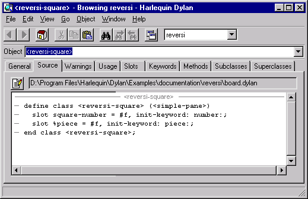

**********************************
Learning More About an Application
**********************************

In this chapter, we examine the browser in detail.

.. index:: browser tool
   single: tools; browser

The browser
===========

The Open Dylan browser is a tool for examining the contents and
properties of the different kinds of objects we deal with in Open
Dylan.

In the browser, the term “object” has a broader sense than is usual in
Dylan. Not only can we examine objects in the sense of Dylan class
instances, but we can also browse libraries, modules, and even running
applications, their threads, and run-time values in those threads.

Similarities between the browser and World Wide Web browsers
------------------------------------------------------------

The way the browser works is similar to a World Wide Web browser. Just
as a web browser shows one page of HTML at a time, the browser describes
the properties of one object at a time. And just as an HTML page can
contain links to other pages, object descriptions in the browser can
refer to other browsable objects. To browse them, you simply
double-click on their names.

The browser has a history mechanism just like a web browser, allowing
you to move back and forth between objects you have browsed by clicking
on Back (|image0|) and Forward (|image1|) toolbar buttons.

Compiler databases and the browser
----------------------------------

The browser gets some of its information from the compiler database for
the project. See ` <model.htm#25398>`_ and ` <model.htm#16835>`_ for
details of how compiler databases are derived, and how they fit in to
the overall view of a project that Open Dylan presents.

Browsing a project in source and run-time contexts
--------------------------------------------------

The browser allows you to look at projects in both source and run-time
contexts. That is, the browser can show you information gathered from
the source code representation of a project and also information
gathered from a running instantiation of the application or DLL that you
have built from that project.

You can look at the static relationships between source code definitions
(for example, the superclass and subclass relationships between the
classes a project defines) as well as the dynamic properties of run-time
values (for example, the value of a local variable in a stack frame).

In the first case, you are looking at information taken from the
project’s compiler database, and in the second, you are looking at
information taken from the application as it runs.

The browser matches run-time objects up with their source code
definitions to make as much information as possible available when
browsing. For instance, if you select a local variable on the stack in
the debugger, and choose the shortcut (right-click) menu’s *Browse Type*
command, the browser is able to locate the source code definition of the
variable’s class.

Browsing Reversi
================

In this section, we use the Open Dylan browser to explore Reversi.

If it is not already open, open the Reversi project.

Go to the Reversi project’s Definitions page.

Note that the project window’s Definitions page will only contain
information if that project has already been built. That is because,
like the browser, the project window gets this list of definitions from
the project’s compiler database.

The Definitions page will be the starting point for our browsing work.
We are going to browse definitions in Reversi, and examine the
relationships between them.

Expand “library reversi”, and then “module reversi”.

Double-click on *<reversi-square>* in the list of definitions.

To find this definition easily, you can use the Definitions page’s popup
list to show only Classes.

The browser appears.

   The Open Dylan browser.

The browser arranges information about objects in a set of property
pages, with the set of pages available varying according to the type of
object being browsed. Though we do not describe all the possible pages
here, nearly all have clear meanings. See `List of property pages`_
for a summary of the pages available in the browser. (Some of these
pages also appear in the project window.)

We now take a look at some of the pages available for *<reversi-square>*
.

The Source page
---------------

The browser provides a Source page for any object that has a definition
in source code. For *<reversi-square>*, we can see the source code
definition in *board.dylan* that created it.

The Source page shows the definition in a read-only source code pane. If
we wanted to edit the definition, we could click the Edit Source
(|image2|) button above the source code pane. That would open an editor
window on *board.dylan*, with the insertion point positioned at the
start of the definition of *<reversi-square>*.

For objects that have a representation in the project sources, the
Source page will always be the first page that you see when the browser
displays the object for the first time.

We now move on to look at some of the other pages of information about
*<reversi-square>*.

The General page
----------------

The browser provides a General page for every object it can browse. The
General page gives an overview of the object being browsed: its name,
the type of object it is, the source file containing its definition (if
any), and so on.

Select the *<reversi-square>* definition’s General page.

The General page for *<reversi-square>* shows that it is a class from
the source file *board.dylan*, that it is defined in the *reversi*
module of the *reversi* library, and that it has two slots.

.. figure:: ../images/browgen.png
   :align: center

   General details about the *<reversi-square>* class definition.

Navigation in the browser
=========================

This section explains how to navigate through objects in the browser,
and explains the browser history mechanism.

Moving from one object to another
---------------------------------

The object information displayed in browser pages often has its own
properties and contents that we might also want to browse. With a simple
double-click on the information we are interested in, we can move on to
browsing other objects.

Go to *<reversi-square>* ’s Superclasses page.

The Superclasses page shows a class’s superclasses in a tree view. In
this case, we see a single expandable item, the class *<simple-pane>*,
meaning that *<simple-pane>* is *<reversi-square>* ’s only superclass.

If we want to browse the definition of *<simple-pane>*, all we need to
do is double-click on it.

Double-click on *<simple-pane>*.

The browser switches to browsing the definition of the class
*<simple-pane>*. The default view is again the Source page.

Select the Superclasses page again.

The Superclasses page now shows the four superclasses of *<simple-pane>*.
Notice that the superclass names are not directly visible in the
current module (*reversi*, as selected in the toolbar pop-up) and so
are qualified. For example, *<standard-input-mixin>* appears as::

    <standard-input-mixin>:duim-sheets-internals:duim-sheets

We see more about this in `Namespace issues in the browser`_.

We could continue traversing the class hierarchy by double-clicking on a
superclass name to browse that class definition in its own right, or, by
clicking on the *+* signs, we could expand the names to reveal their
superclasses.

.. index::
   single: browsing; history feature

Using the history feature
-------------------------

As soon as the browser has displayed more than one object, its history
feature is enabled. You can access the browser history by choosing an
object from the Object combo box, or from the *Go* menu. In addition,
the Back (|image3|) and Forward (|image4|) buttons allow you to
navigate the browser history.

Choose **Go > Back** or click on the Back button.

The browser returns to browsing the *<reversi-square>* definition.

Notice that the browser remembers which property page you were browsing.

.. index::
   single: browsing; library definitions

Browsing a project’s library
============================

To browse the current project’s library definition, choose **Go >
Library** or the Browse Library (|image5|) button.

Click the Browse Library button.

The browser switches to the Reversi project’s library definition. We see
the usual General and Source page, as well as Warnings, Usage,
Definitions, and Names.

The Warnings and Definitions pages are the same as those that we see in
project windows. The Names page provides views of all the Dylan names in
the library, with a variety of possible constraints.

The Usage page gives a tree view of the library usage relationships for
the current library. The first level of expansion shows the names of the
libraries that Reversi uses. Expanding those library names shows the
libraries they use, and so on.

.. index:: namespace qualifier format
   single: browsing; namespace qualifier format

Namespace issues in the browser
===============================

Move through the browser history to find the *<simple-pane>* object
again.

Go to its Superclasses page.

We saw this page in `Moving from one object to another`_.  There, we
said that the special naming format used for the superclasses here
meant that they were not part of the *current module* of the *current
library*.

To the browser, the current module is whatever module name is selected
in the drop-down list box above the Object field (currently *reversi* )
and the current library is the library defined by the project.

Change the selected value in the drop-down list to *dylan:dylan*.

The name *<simple-pane>* in the Object list changes to
*<simple-pane>:duim-layouts:duim-layouts*.

This new representation of the *<simple-pane>* name says that
*<simple-pane>* is found in the *duim-layouts* module of the
*duim-layouts* library. This browser uses this special *name* :*module*
:*library* naming format whenever *name* is not exported by the current
module of the current library.

By changing the list setting to *dylan:dylan*, we told the browser that
any name not in the *dylan* module of the *dylan* library should be
printed using the special suffix.

The browser’s ability to display names from other modules than the
current module in an unambiguous fashion is important, because while
browsing you may come across names not defined in your library. The
browser needs to be able to make it clear when a name is not from the
current library and module.

.. index::
   single: browsing; run-time values

Browsing run-time values of variables and constants
===================================================

You can browse the values of variables and constants in running
applications. The browser shows the run-time value of a variable or
constant in its Values page. Simply browse the definition of the
variable or constant by double-clicking on it in the project’s
Definitions page.

The values are shown in a table. Thread variables (variables local to a
particular application thread) are shown with an entry for each thread
containing a variable of that name. Constants and global variables only
ever have one value across all threads, so this is shown as a single
table entry entitled “All threads”. You can update the value shown in
the browser with **View > Refresh**.

We will browse Reversi’s *\*reversi-piece-shape\** variable to show how
we can monitor the value of a variable while an application is running.
That variable stores the current shape of the pieces being used on the
Reversi board. By default, Reversi uses circular pieces.

Start the Reversi application.

In the Reversi project window’s Definitions page, double-click on the
variable *\*reversi-piece-shape\**.

In the browser, choose the Values page.

.. figure:: ../images/values.png
   :align: center

   Browsing values in a running application thread.

The value of *\*reversi-piece-shape\** is shown as *#"circle"* for all
threads. This is what we expected. Reversi has only a single thread, and
we expected some value that would represent a circle.

Choose **Options > Squares** in the running Reversi application.

Choose **View > Refresh** in the browser.

.. figure:: ../images/values-square.png
   :align: center

   Updated variable value after changing state of application.

The value is now *#"square"*. This reflects the internal change to the
variable that our menu selection caused.

.. index::
   single: browsing; function parameters
   single: browsing; local variables

Browsing local variables and parameters on the stack
====================================================

You can browse the contents of the local variables and function
parameter values in call frames, as seen in the debugger. These are
values on the stack in a paused application thread. Simply double-click
on one in the debugger stack pane, and the browser will display its
contents. See `See Browsing local variables <expanding.htm#13818>`_ for
an example of browsing local variable and parameter values.

.. index::
   single: browsing; paused threads

Browsing paused application threads
===================================

Browsing functionality for paused application threads is done in the
debugger, not the browser. Think of the debugger as a specialized
browser for paused application threads.

However, you can browse a list of current application threads in the
browser, along with a text message describing their state, by choosing
**Go > Threads** in the project window, editor, or debugger.

If you double-click on a thread name in that list, Open Dylan opens
a debugger window on the thread, or, if it already exists, raises the
debugger window for the thread, thus pausing the application. Once in
the debugger, you can browse the local variables and parameters in call
frames in the usual way. See `Browsing run-time values of variables
and constants`_.

.. index::
   single: browsing; keeping browser up to date

Keeping browser displays up to date
===================================

Because the browser shows values either gathered at a point in program
execution or during compilation, there are opportunities for the
information displayed on a browser page to get out of date:

-  If you are browsing a definition and you have edited its source, you
   must recompile it to ensure that the compiler database is up to date.
-  Even when you have recompiled a definition, you must make sure that
   the browser display is refreshed with **View > Refresh**.
-  If you are browsing a run-time object, that object might have since
   changed. Refresh the browser display with **View > Refresh** to make
   sure you are seeing the most up-to-date value.

.. index::
   single: browser tool; list of property pages

List of property pages
======================

The following is a list of property pages supported in the browser. Some
of these pages can also be seen in the project window.

-  Breakpoints The breakpoints specified for a project.
-  Contents The slot names and values of a run-time instance.
-  Definitions The names of the Dylan language definitions created by a
   module, library or project.
-  DLLs The DLLs currently loaded while debugging. You can sort them by
   version or by file location.
-  Elements The keys and elements of a collection instance.
-  General The properties of the object (name, type, location).
-  Hierarchy The hierarchy of a DUIM sheet, layout or frame.
-  Keywords The initialization keywords for a class.
-  Libraries The list of libraries in the project.
-  Memory The object’s memory in the application, shown in bytes.
-  Methods The methods of a generic function, or the methods
   specializing on a class. You can show either methods defined directly
   on the class or all methods applicable to the class.
-  Names The names defined in a module or library. Includes details of
   from where a name was imported, and whether a name is exported. You
   can filter to show local names only (that is, names created by the
   module or library rather than imported from elsewhere), exported
   names only (which can be both local and imported), or all names
   (local and imported).
-  Slots The slots of a class.
-  Source The source code for a source form, with breakpoints shown.
-  Sources The source files contained in a project, and their contents.
-  Subclasses The subclass hierarchy of a class.
-  Superclasses The superclass hierarchy of a class.
-  Threads The threads in an application, with priorities, status, and
   other properties.
-  Usage The used and client definitions for a source form.
-  Values The run-time values of constants and variables.
-  Warnings The compiler warnings associated with a source form.

.. |image0| image:: ../images/brow-left.png
.. |image1| image:: ../images/brow-right.png
.. |image2| image:: ../images/editsrc.png
.. |image3| image:: ../images/brow-left.png
.. |image4| image:: ../images/brow-right.png
.. |image5| image:: ../images/library.png
