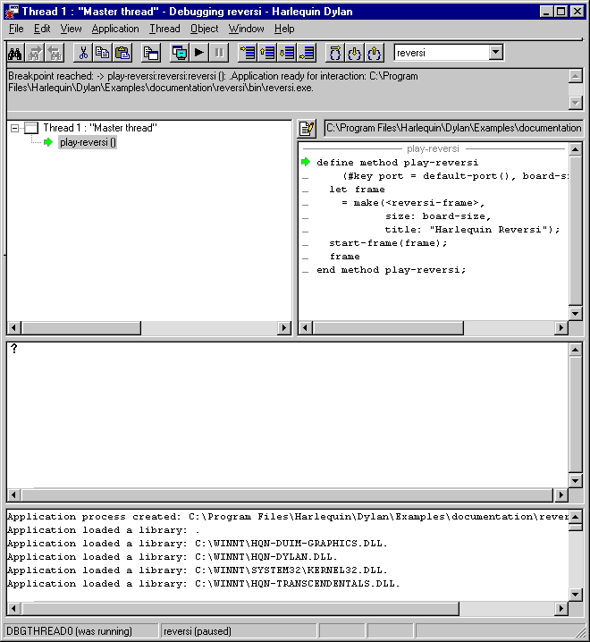
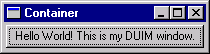

*************************************
Debugging and Interactive Development
*************************************

In this chapter, we look more closely at Open Dylan’s debugger
tool.

The debugger
============

The debugger is a tool for browsing and interacting with a paused
application thread. Any thread in an application can be viewed in the
debugger (or you can use separate debugger windows for different
threads). You can consider the debugger a specialized version of the
browser that browses paused application threads.

The debugger provides standard debugging facilities like stepping and
breakpoints. It also provides a graphical interface for browsing the
state of the control stack in a paused application thread, allowing you
to examine local variables and arguments in each stack frame.

You can also use the debugger’s interaction pane to interact with a
paused application thread. Simply enter Dylan code at a prompt, and the
code is executed in the context of the paused thread.

Debugger panes
==============

We now take a look at the basic debugger window panes.

The easiest way to bring up the debugger is to choose **Application >
Debug** in the project tool. This starts the application, then pauses its
main thread and opens the debugger window on that thread. We can
demonstrate this now with Reversi. If you are already running that
application, exit it now.

Choose **Application > Debug** in the Reversi project window.

   The debugger.

The debugger has four panes: the context pane, the stack pane, the
source pane, and the interaction pane.

Context pane
------------

The pane at the top of the debugger is the *context* pane. The context
pane gives an overview of the state of the application thread to which
the debugger is attached. You can hide the context pane by using **View >
Context Window**.

.. figure:: images/dbgctxt.png
   :align: center

   The debugger’s context pane.

Here, the application stopped because there is a breakpoint on the call
to *play-reversi* in *start-reversi.dylan*. That is the function call
that starts the application running. The rules for what appears in the
context pane are as follows.

If you paused the application yourself, by choosing **Application >
Pause**, or by clicking the pause toolbar button (|image0|), the
message “User requested pause” appears in the context pane of all open
debugger windows.

If the application paused because of some other event,

-  the context pane for the debugger on the thread that caused the pause
   shows a message explaining why that thread paused the application.
-  the context pane in all other open debuggers shows the message
   “Stopped in Thread *x*”, where *x* is the name of the thread that
   has stopped.

Often the message describes an unhandled Dylan error or breakpoint. The
message could also describe an out-of-language error (for example in
foreign code) or one of a number of application events upon which you
can ask the debugger to pause the application, such as when a library is
loaded. You can see a list of possible exceptions and the actions that
will be taken upon them in the Debugger Options dialog. See
`Debugger options`_.

Stack pane
----------

The *stack* pane shows the thread’s control stack at the moment it was
paused, with certain call frames filtered out. It depicts the stack in a
tree view. We call this a *stack backtrace* or *backtrace*.

When a debugger window opens, the stack pane opens in expanded form,
showing the backtrace details. You can expand and collapse the backtrace
in the normal way for a tree view, by clicking *+* or *-* symbols. In
addition, the menu commands **View > Expand**, **View > Expand All**,
**View > Collapse**, and **View > Collapse All** control expansion.

.. note:: The stack pane may not always contain exactly what you expect to
   see. First, a function call you expect to see might have been optimized
   away during compilation. Second, because the stack pane filters out
   certain call frames by default, a frame you are looking for may only
   become visible when you change the filtering settings. By default, only
   frames for Dylan functions defined in or imported into the thread’s
   current module appear in the stack pane. This default setting is
   indicated by “Filtered visible frames”, which appears in the stack pane
   filtering drop-down list (see :ref:`searching-stack-backtrace-for-cause`
   for information about the drop-down list settings).

Choose the **View > Debugger Options** dialog’s Stack page in the debugger
window to control the filtering rules. See `Stack options`_ for details.

You can select any item shown in a backtrace and right-click to produce
a pop-up menu. The menu allows you to carry out other operations on
them, such as browsing their values or editing their source code
representation. Double-clicking an item opens it in the browser.

Thread titles
^^^^^^^^^^^^^

The root node in the backtrace is the number and title of the thread.
Threads are assigned titles using the following scheme:

-  Thread *x* : “*name* ”.
-  A Dylan thread that has a name. The name is a string.
-  Thread *x* : Anonymous thread
-  A Dylan thread that has no name.
-  Thread *x* : Foreign thread
-  Any non-Dylan thread.

The initial thread in a Dylan application is always called Thread 1:
“Master thread”. Each subsequently created thread is assigned an integer
number by incrementing the value used for the previous thread, and a
title derived according to the scheme above.

In Reversi, there is only one thread, the master thread.

.. _call-frames:

Call frames
^^^^^^^^^^^

Under the root node, at the first level of expansion, the stack pane
lists the call frames in the backtrace. The most recently executed call
frame is listed first.

Each call frame is represented by the name of the function or method
whose call created the frame. If you select a name, the source code
associated with it (if any) appears in the pane opposite. See
`Source pane`_ for details of this pane.

Beside each frame name is an icon indicating the sort of call that
created the frame:

.. figure:: images/blue-m.png
   :align: center

This was a call to a method selected through run-time dispatch.

.. figure:: images/grey-f.png
   :align: center

This was a direct call, either to a method whose dispatch details were
all worked out at compile time, or to a method constant (a function).

This was a call to a foreign (non-Dylan) function. Some of the calls
that the Dylan run-time system makes are foreign calls.

.. figure:: images/green-arrow.png
   :align: center

This arrow denotes the position of the stack pointer in the thread. It
will always be at the top of the list of frames.

When debugging, be aware that some function call frames may be optimized
away by, for example, inlining or tail-call optimization. This is
particularly important to note if you are compiling in Production mode,
where more optimization occurs than in Interactive Development mode.

The debugger also hides certain stack frames concerned with activities
like method dispatch, since these are of no interest in debugging user
applications.

You can filter other frames out of the backtrace if you wish, according
either to their type or to their names. For instance, you can filter out
all foreign call frames or all frames whose names contain a particular
string. See `Stack options`_.

.. figure:: images/dbgbak.png
   :align: center

   The debugger’s stack pane.

Local variables and call parameters
^^^^^^^^^^^^^^^^^^^^^^^^^^^^^^^^^^^

Some call frames shown in the backtrace can be expanded one level
further. At this final level of expansion, the pane shows the values of
the local variable bindings, including the values that were passed as
parameters in the call. Bindings are listed in the order in which they
were created, so the parameter bindings appear first.

The bindings, preceded by a yellow star icon (|image1|), are shown in
the form::

    *name* = *value*

Where *value* is displayed in a summarizing notation, which defaults to
the value’s class enclosed in curly braces if there is no simple printed
representation. For example, basic numeric types, strings, booleans, and
sequences thereof can be printed literally, but an instance of
``<reversi-frame>`` cannot.

Source pane
-----------

The debugger’s source pane shows a source code definition for the method
or function that created the call frame that is currently selected in
the stack pane.

A text field above the source pane shows the location on disk of the
source file containing the definition. If you click the Edit Source
(|image2|) button, Open Dylan opens the source file in an editor
window, with the insertion point placed at the start of the definition.

If the debugger cannot locate the source code for the method or function
that created the selected call frame, or if you select a local variable
or the backtrace’s root node, the debugger leaves the source pane empty,
writes “No source available” in the field above the source pane, and
makes the Edit Source button unavailable.

.. index::
   single: arrow; green

The source pane shows the same green arrow (|image3|) seen in the stack
pane. This *current location* arrow shows the point to which execution
within that call frame had proceeded before the application was paused.
(Thus the current location arrow that you see in the source pane for the
top-most call frame in the stack pane is the most accurate depiction of
the point at which execution was paused.)

Often, the arrow is located at a point where a function has called
another function that has not yet returned, or at the point at which
execution will resume when a function returns.

.. figure:: images/source.png
   :align: center

   The current location arrow in the debugger’s source pane.

The line at which the arrow is located is not always precisely correct,
because optimizations carried out by the compiler may have produced
object code that does not correspond to the source code in a way that
can be easily depicted in this pane. The chance of imprecision is
increased when compiling a project in Production mode.

In our example, the arrow appears at the start of the definition of the
*play-reversi* method. This shows that execution paused at the beginning
of the execution of *play-reversi*.

Interaction pane
----------------

The interaction pane allows you to enter Dylan expressions for
evaluation in the context of the paused thread. (In some language
implementations, an interaction tool like this is called a *listener*.)

See `Interacting with an application`_ for a discussion of interaction.

The interaction pane also logs thread events that the debugger noticed
(such as DLL loading) and debugging messages explicitly output by the
thread (for example via the Functional-Extensions library’s
*debug-message* function).

The pane does not collect ordinary output from the application being
debugged. Such output continues to go to its ordinary destination, such
as the standard output.

Keeping debugger windows up to date
===================================

It can be costly to keep all the panes of open debugger windows up to
date. For this reason, Open Dylan only refreshes the information in
debugger windows in certain circumstances.

.. note:: In the following descriptions, a window being “refreshed” can
   also mean the window being displayed for the first time, with up-to-date
   contents, if it has not yet been displayed.

-  If an application thread pauses and a debugger window appears (or
   comes to the foreground), the debugger window for that thread is
   refreshed automatically.

Threads pause when: there is an unhandled Dylan error in the thread,
there was an out-of-language error in the thread, execution in the
thread reached a breakpoint or step point, or the thread reached the end
of an interactive evaluation.

-  If you issue the pause command (**Application > Pause** or

-  If you issue the pause command from the project window or editor, the
   debugger for the application’s master thread is refreshed.

In all of these circumstances, any other open debugger windows will not
be refreshed unless you choose **View > Refresh** in them. If you choose
**View > Refresh All Debuggers**, Open Dylan updates every open
debugger window.

The Misc page of the debugger’s **View > Debugger Options** dialog
contains the option “Refresh all open debuggers when entering debugger“.
By default, this option is not set. When turned on, the rules above are
ignored and every open debugger window is refreshed whenever the
application pauses.

.. index:: Application menu

Controlling execution
=====================

The **Application** menu, shared by the debugger, editor, and project
windows, contains a set of commands for controlling the execution of an
application or DLL. Some toolbar buttons provide shortcuts to these
commands.

In a project window, the commands on the **Application** menu act upon the
executable application (.EXE file) or DLL that was last built for that
project. The command selects the application or DLL depending on the
target file type setting on the *Project > Settings* dialog’s Link page.

In a debugger window, the commands act upon the application that created
the thread being debugged. In an editor window, the commands act upon
the application of the active project. (Note that the **Application** menu
is not available in the editor if the source file being edited is not
part of the active project—the project whose name is visible in the main
window’s drop-down list. See `The active project`_ for more details.)

.. index::
   single: applications; starting
   single: applications; stopping

Starting and stopping applications
----------------------------------

**Application > Start** (or the toolbar start/resume button (|image4|))
executes the application with which the window is associated.

After you have started executing an application, the **Application >
Start** command is never available again until you stop the application
with **Application > Stop**, or until the application terminates
normally.

**Application > Stop** (or the toolbar stop button (|image5|)) terminates
the process of the application with which the window is associated.
Before terminating the process, Open Dylan asks you to confirm that
you want to do so. This helps reduce the chance of an accidental
termination that loses valuable application state.

After you have stopped an application in this way, you can start it
again with **Application > Start**.

.. index::
   single: applications; pausing
   single: applications; resuming

Pausing and resuming execution of applications
----------------------------------------------

**Application > Pause** (or the toolbar pause button (|image6|)) pauses
the execution of the application with which the window is associated.

When an application is paused, you can browse and debug its threads or
interact with it. Choose **Application > Resume** (or the toolbar
start/resume button (|image7|)) to resume execution.

You should normally only use **Application > Resume** when the application
stopped because you paused it or it reached a breakpoint (both of which
are out-of-language events, that is, events not described completely in
terms of the Dylan language). If the application stopped because of an
unhandled condition or a call to *break* (both in-language events), you
should instead use the items on the **Thread** menu to signal a Dylan
restart. See `Restarts`_ for information on the **Thread** menu.

If you use **Application > Resume** to continue from an in-language event,
your application may signal further errors because you did not use the
(in-language) restart mechanism to deal with the existing error.

Any Dylan restarts which were available before you resumed the
application should still be available, so you can continue by signalling
a restart as before. See `Restarts`_ for more details.

Restarting applications
-----------------------

**Application > Restart** restarts the application with which the window
is associated. There is no toolbar shortcut button for this command.

This command is only available if the application is already running.
Since restarting an application logically consists of stopping it and
starting it again, choosing this command is equivalent to choosing
**Application > Stop**, then **Application > Start**.

.. index::
   single: applications; interacting with

Interacting with applications
-----------------------------

**Application > Interact** (or the toolbar interact button (|image8|))
pauses the execution of the application with which the window is
associated and opens a debugger window on it. The behavior is exactly
the same as **Application > Debug** (see `Debugging techniques`_)
except the stack and source panes of the debugger window are hidden.

See `Interacting with an application`_ for a discussion of interaction.

.. _debugging-techniques:

Debugging techniques
====================

Because of the different characteristics of executable (EXE) files,
DLLs, and OLE components, in each case there is a slightly different
technique for invoking the debugger. This section covers these
techniques. Debugging a client/server application is discussed in
`Debugging client/server applications`_.

.. index::
   single: applications; debugging
   single: debugging; applications
   single: debugging; executables

Debugging executables
---------------------

Use **Application > Debug** (or the toolbar debug button (|image9|)) and
**Application > Interact** (or the toolbar interact button (|image10|))
to debug an executable (EXE) application.

These commands start the executable associated with the window, then
pause its main thread and open a debugger window on that thread. If the
application is already running, these commands pause the application in
its current state.

If you want to start an application up in the debugger, so that you can
examine its initial state, you want the application’s library and the
libraries it uses to initialize completely before the debugger pauses
it. To do this, you need to specify the application’s *start function*.
A start function is a function that the application calls upon startup
to set things running, such as a call to start an event loop in a
windowing application. See :ref:`start-function` for details.

You can specify a start function on the Debug page of the **Project >
Settings…** dialog. When you use **Application > Debug** or **Application >
Interact**, the environment places a temporary breakpoint on the start
function so that the application starts and then enters the debugger on
entry to the start function. For this reason, the expression that calls
the start function should appear after all definitions in the project,
so that all definitions will be accessible in the debugger.

If the project does not specify a start function, the application will
enter the debugger after all expressions are executed and the main
thread is about to exit. In this case, the debugger is entered as the
application has finished, which is not normally very useful. If you
always specify a start function, you can pause the application at a more
useful point.

Debugging DLLs
--------------

Debugging DLLs is similar to debugging executable (EXE) applications (see
`Debugging executables`_ above), but there are a couple of differences.

One difference is that DLLs may not have a start function. Without a
start function, there is nothing for the environment to place a
breakpoint upon in order to pause the DLL’s execution and enter the
debugger.

Nonetheless, for debugging it is still useful to be able to pause the
DLL once it has initialized completely but before it exits. To do this,
simply remove the name in the Start Function section of the **Project >
Settings…** dialog’s Debug page. Then, when you choose **Application >
Debug** or **Application > Interact**, the debugger lets the DLL execute
all its top-level expressions, and pauses the DLL just as its main
thread is about to exit. This gives you access to all the definitions
and state that the DLL creates.

If the DLL does have a start function, simply specify it and the
**Application > Debug** and **Application > Interact** commands will work as
they do for EXE applications: the environment adds a breakpoint on the
start function, and on entry to the function the DLL’s main thread is
paused and a debugger window is opened on it.

Another consideration is that it is not normally possible to execute a
DLL directly; instead, you start an EXE that calls it. The environment
normally handles this issue for you, by using a small EXE that takes the
target DLL name as a command-line argument, loads it (causing all its
top-level expressions to be executed), and exits. When you choose
**Application > Start**, **Application > Debug**, or **Application >
Interact** the environment runs the EXE. The point at which the EXE is
paused again depends on whether you supply a start function.

Alternatively, you can supply your own EXE in the Executable field of
the **Project > Settings…** dialog’s Debug page. The **Application > Start**,
**Application > Debug**, and **Application > Interact** commands then
call your EXE and behave in the same way as if your EXE was the
project target file. That is to say, execution of the EXE proceeds
without intervention from the debugger until the DLL loads. Only then
will the debugger be in a position to pause the DLL. (Again, the point
at which the pause occurs depends on whether you specify a start
function.)

Debugging OLE components
------------------------

To debug in-process OLE servers and OLE controls, which must be built as
DLLs, you can use the same debugging processes as described in
`Debugging DLLs`_.

If you want to test your server or control in a container application,
simply enter the name of the application executable in the Executable
field of the **Project > Settings…** dialog’s Debug page. This executable
could be any OLE container, such as WordPad. The **Application > Start**,
**Application > Debug**, and **Application > Interact** commands then
execute the container executable. Execution proceeds normally until the
code of the OLE server or control is executed; only then will the
debugger be able to intervene either by pausing when the server or
control loads or when a start function is called.

In the case of an OLE compound document server, of course, the debugger
will only be able to act if you choose to insert an instance of your OLE
server object into your test container application.

Restarts
========

The debugger provides a way to signal any restart for which a handler is
available at a given point in application execution. Restarts are part
of the Dylan language’s condition system, and are explained in chapter 7
of the DRM.

You can use the debugger to signal a restart if your application has
entered the debugger due to a condition having been signalled but not
handled, or due to it reaching a breakpoint. You cannot do so if the
application has paused because you used **Application > Pause**. (Use
**Application > Resume** to restart your application in that case.)

To select a restart to be signalled, choose **Thread > Continue…**, which
displays a dialog listing all available restarts.

For convenience, there are two other menu items for signalling ``<abort>``
restarts, which are defined to mean “terminate the current computation”.

**Thread > Abort** signals the innermost available ``<abort>`` restart—that
is, it aborts as little as possible—whereas **Thread > Abort All** signals
the outermost ``<abort>`` restart—that is, it aborts as much as possible.

Although the meaning of ``<abort>`` restarts is part of the Dylan
language, your application must provide handlers to implement them. If
you are using DUIM for your application’s GUI, note that DUIM frames
normally provide ``<abort>`` handlers in the event loop, so that aborting
while processing an event will proceed to process the next event. See
the DUIM documentation for *start-frame* and *start-dialog*.

.. index::
   single: applications; debugging a specific thread
   single: debugging; choosing a thread to debug

Choosing an application thread to debug
=======================================

As we noted earlier, each application thread can have its own debugger
or you can use one debugger window to view various threads one at a
time. The command we have seen so far, **Application > Debug**, debugs
only the application’s main thread. To debug another thread in the
application, choose **Go > Threads** from the debugger, project window, or
editor. From the debugger window you can also use **Thread > Select
Thread…**. To bring up multiple debugger windows, use **Window > New
Window** from an existing debugger.

The **Go > Threads** command launches a browser on the application itself,
treating it as an object consisting of one or more threads whose states
are visible in a table. If you browse a particular thread, Open
Dylan refreshes the existing debugger window to display the thread or
opens a debugger window if none already exists.

You can then debug a thread from the table by double clicking, or by
using the right-click popup menu. This action stops the thread if it is
running, and opens a debugger window on it.

Changing the debugger layout
============================

Open Dylan lays out the debugger window to suit the situation. If
you choose **Application > Interact**, the debugger uses its interaction
layout. In this layout, the interaction pane is maximized and the stack
and source panes do not appear at all. This layout hosts interactive
sessions and is sometimes casually referred to as “the interactor”.

If the debugger was invoked because of an error or because you chose
**Application > Debug** or **Application > Pause**, the interaction pane
will be a small pane below the stack and source panes.

You can change the automatic layout using **View > Interacting Layout**
and **View > Debugging Layout**. You can also hide or show the context
window using **View > Context Window**.

Interacting with an application
===============================

Open Dylan allows you to interact with your applications.
Interaction consists of executing Dylan expressions and definitions in
the context of a paused application thread. Open Dylan also offers
the *Dylan playground*, a facility for interactive Dylan programming
experiments outside the context of application development.

To explain the things you can do interactively, this section includes
two examples. One uses the Dylan playground and the other uses the
Reversi application. First, however, we discuss the interaction pane, a
debugger pane that hosts interactive sessions.

About the interaction pane
--------------------------

The debugger’s interaction pane provides a prompt (where you can enter
Dylan expressions and definitions for execution. The prompt is a
question mark (*?* ).

The interaction pane is similar to what some other languages call a
*listener* tool, and it provides the “read-eval-print” model of
interaction that is standard in those tools. However, in Open Dylan
interactions, the “eval” phase is not really evaluation. It consists of
compiling your code and then sending the compiled code to the paused
application thread itself, where it is executed, modifying the state of
the thread accordingly. This means that you can interactively add
features to an application and even redefine parts of it, all while the
application is still running.

The size of the interaction pane differs according to the situation. See
`Changing the debugger layout`_ for details of the
different layouts and how to change them.

Starting an interactive session with an application
---------------------------------------------------

The simplest way to start interacting with an application is to choose
**Application > Interact** or click the interact toolbar button (|image11|).
This starts the application if necessary, and then pauses it.

If the application was started afresh, the pause occurs at the same
point as it would with **Application > Debug** (see `Debugging
executables`_). Otherwise the application is paused in
its current state. A debugger window then opens on the paused thread.

.. _interaction-basics-using-the-dylan-playground:

Interaction basics using the Dylan playground
---------------------------------------------

The Dylan playground allows you to carry out interactive Dylan
programming experiments. The playground is a pre-built Dylan application
that you can start from the main window using the Open Playground button
(|image12|), or with the menu command **Tools > Open Playground** from
any Open Dylan window. The playground has its own project, which
also opens when you start it.

Start the playground with **Tools > Open Playground** in any open window.

Upon opening the playground, its project window appears. Then the
playground application starts automatically and enters the debugger. The
debugger window has a large interaction pane, and no visible stack or
source panes. This is the debugger’s *interaction layout*. (We can
change the layout to the normal debugging layout with **View > Debugging
Layout**.)

One of the simplest things we can do in the interaction pane is to use
it as a desktop calculator.

Enter *56 - 24;* at the interaction pane prompt.

Make sure to include the terminating semi-colon, and to include spaces
between the numbers and the *-* sign::

    ? 56 - 24;
    => $0 = 32
    ?

Here, text entered after the *?* represents interaction pane input, and
text after the *=>* represents interaction pane output.

Any compilation warnings resulting from typing errors are displayed in
the interaction pane itself.

The interaction pane offers a history facility which allows us to refer
to previous interaction results. Each value returned by an interactive
expression is bound to a name, which we can then use in subsequent
expressions. We call these bindings history variables. They are named
using a dollar sign ($) suffixed with an integer. To keep the history
variable names unique, the integer suffix increments each time a new
history variable is created. So far, our one result was assigned to the
history variable *$0*.

We can add the value bound to *$0* to itself.

Enter *$0 + $0;* at the interaction pane prompt::

    ? $0 + $0;
    => $1 = 64
    ?

This expression produces the expected result of 64 and creates a new
history variable, *$1*, bound to that result.

.. note:: History variable values are local to the debugger in which they
   were created, so you cannot refer to a history variable from any other
   debugger’s interaction pane.

We can define new classes and methods interactively simply by entering
their definitions.

Enter the following definition of ``<my-class>`` at the interaction pane
prompt.

.. code-block:: dylan

    define class <my-class> (<object>)
      slot my-slot :: <integer>
    end class <my-class>;

.. note:: You can hit Return to format your input in multi-line form where
   you prefer. (An expression is only evaluated when you hit Return after a
   semicolon.)

The output in the interaction pane is::

    ? define class <my-class> (<object>)
    slot my-slot :: <integer>
    end class <my-class>;
    => No values

Enter *<my-class>;* at the interaction pane prompt::

    ? <my-class>;
    => $2 = {<class>: <my-class>}
    ?

Return values in the interactor are “live”. You can use the shortcut
(right-click) menu to perform a variety of useful operations on them.

The **Show Contents** command allows you to browse the contents of values
within the interaction pane itself. What you see depends on the type of
the value; with a class, each slot name and slot value is listed. Each
slot value is bound to new history variable so you can refer to it in
future interactive expressions.

Right-click over *$2 = {<class>: <my-class>}* and choose **Show Contents**::

    => $2 = {<class>: <my-class>}
    ? Contents of {<class>: <my-class>}
    => {<class>: <my-class>} is a <class>
    $3 = instance?-iep : ’\\<-49>’
    $4 = debug-name : "<my-class>"
    $5 = class-implementation-class : {<implementation-class>}
    $6 = class-subtype-bit : 0
    $7 = class-module : {<module>}
    ?

For the duration of the interactive session with a project,
interactively created definitions, objects, and any resultant warnings
are layered onto the project’s compiler database. During an interactive
session, these items will be available in the project window and
browser. You can think of them as being like any definition or object,
with the exception that they do not come from a source file.

Enter *define variable \*obj\* = make(<my-class>);* at the interaction
pane prompt.

In the playground’s project window, go to the Definitions page.

Expand *library dylan-playground* and then *module dylan-playground*.

Three definitions are listed under *module dylan-playground* : one for
*\*obj\**, one for ``<my-class>``, one for the *my-slot* accessor, one
for its getter, and one for the method *main*. Thus we see two
interactively created definitions alongside one definition created at
compile time.

.. figure:: images/interact-objs.png
   :align: center

   Interactively created definitions alongside a compile-time definition.

We can also use the interactor to make a GUI window by using the Dylan
User Interface Manager (DUIM) capabilities. For example:

At the interaction pane prompt, enter:

.. code-block:: dylan

    contain(make(<push-button>,
                 label: "Hello World! This is my DUIM window."));

The code is compiled and run and a DUIM window opens.

   Window created interactively with the Dylan User Interface Manager.

For more information about creating GUI interfaces with Open Dylan,
see the *Building Applications Using DUIM* and *DUIM Reference* manuals.

.. _example-interaction-reversi:

An example interaction with Reversi
-----------------------------------

In the following example we interact with the Reversi application after
first making a few moves.

Open the Reversi project, and choose **Application > Start**.

If you were following the **Application > Debug** example earlier in this
chapter, you could simply choose **Application > Resume** instead of
starting Reversi again.

Make some moves on the board.

Choose **Application > Interact**.

A debugger window appears, in the interaction layout of a large
interaction pane and no stack or source panes.

Now we are ready to write Dylan code interactively. Note that because
**Application > Interact** pauses the application, we are not interacting
with a running application. The only way the state of the application
changes is through our interactions. So we must choose **Application >
Resume** to see interactive changes in effect.

As an example, we can change the shape of the pieces on the board by
setting the value of the variable *\*reversi-piece-shape\** instead of
by going to Reversi’s **Options** menu.

Enter *\*reversi-piece-shape\* := #"triangle";* at the interaction pane
prompt.

Choose **Application > Resume**.

Make a few moves on the Reversi board.

The new moves are shown in triangular pieces, as well as any previous
moves that have repainted after being obscured by other windows. To see
only triangular pieces, minimize and restore the board or resize it.

Interactive access to local variables and arguments on the stack
----------------------------------------------------------------

Interactive expressions can refer to variables from the debugger’s
current stack backtrace, simply by using their name. Before referring to
a variable, you must select the stack frame that contains the variables
you want to use. This is so the debugger can resolve any ambiguities
arising when local variables in different stack frames have the same
name.

For example, with this backtrace::

    [-] go()
        x = 4
        y = 5
    [-] set()
        x = 30
        y = 2
    [-] ready()

If you select the stack frame for the call to *go*, evaluating the
expression *x + y* yields the result 9. But if you select the stack
frame for the call to *set*, evaluating the expression *x + y* yields
the result 32.

Effects of interactive changes to application threads
-----------------------------------------------------

As stated in `About the interaction pane`_, because the interaction pane
compiles and executes the code you enter in the context of the paused
thread to which the debugger is connected, it is possible to define new
bindings, redefine existing bindings, and get and set values in an
application. You can then resume execution to test your changes.

The level of optimization that occurred when the application was
originally built does, however, affect the kinds of things you can do
interactively. It is best to compile a project in Interactive
Development mode if you want to define and redefine classes and methods
interactively. Even in that mode you may encounter some restrictions,
particularly when trying to make changes in system libraries.

As noted in `An example interaction with Reversi`_, the results of compiling
interactive changes to threads are added to a temporary layer of the compiler
database for the application’s project. This allows you to browse the
effects of your changes while the application remains running, but these
changes are not saved to disk in the compiler database file, nor are
they saved in the project source code files. When you stop or close an
application, Open Dylan removes the interactive layer
automatically. (This is one of the reasons why you are asked to confirm
when you choose **Application > Stop**.)

Interaction pane commands
-------------------------

The debugger’s interaction pane accepts various commands. You can get a
list of available commands, and documentation for each command, with the
*:help* command.

**:help**
    *Interaction command*

    ::

        :help
        :help *command-name*

    The first form prints a list of interaction commands in the interaction
    pane. The second form prints documentation on a command from the list.

**:in**
    *Interaction command*

    ::

        :in *module-name* *[* :*library-name* *]*

    Sets the context in the interaction pane. The current library is the
    default if not otherwise specified. Using this command is equivalent to
    using the context drop-down list on the debugger/interactor toolbar.

.. index:: active project
   single: projects; active project
.. _active-project:

The active project
==================

All tools in Open Dylan need to know with which project they are
associated. A project window is, naturally, always associated with the
project it describes. A browser window is associated with the project
from which the object it is currently browsing came. A debugger window
is associated with the project of the application to which it is
connected.

These associations are fairly natural, but the situation for editor
windows is slightly more complicated. An editor window can be editing a
source file that is part of more than one open project. If we choose
**Project > Build** in the editor window of a source file that appears in
two open projects, how does Open Dylan know which project to
rebuild?

The answer is that the editor has an *active project*. This is the
project whose name is visible in the drop-down list in the main window.
You can change the active project by changing the setting in the list.
The active project is always one of the projects that have been
explicitly opened—that is, one for which there is a project window.

The editor also uses the active project to determine two other things.
First, the editor shows breakpoint information in its leftmost column
for source files in the active project **only**. Second, the **Project**,
**Build**, and **Application** menus are disabled in editor windows on
source files that are not part of the active project.

A project can become the active project automatically as well as by
being set explicitly in the main window’s drop-down list. The main
window’s **Options > Environment Options…** dialog has two options on the
General page controlling when projects become active automatically:
“Project becomes active when opened” and “Project becomes active when
application started“.

.. index:: breakpoints
   single: debugging; breakpoints

Breakpoints
===========

Open Dylan allows you to set breakpoints on application code from
within any window. Breakpoints allow you to pause an application at a
predefined point in execution, in order to examine it in a debugger
window. You can set breakpoints on Dylan code lines in a source code
file or on suitable generic functions, methods, and functions.

Non-pausing breakpoints are also available. These breakpoints do not
pause the thread when execution reaches them, but simply log a message
in the debugger interaction pane to say they have been reached. To
distinguish breakpoints that pause the application from non-pausing
breakpoints, we sometimes call them *pausing* breakpoints.

You can set, disable, and clear breakpoints from any Open Dylan
tool that has an **Application** menu. In addition, you can use the
shortcut (right-click) menu to do the same on any selected method in the
project window or browser. Finally, you can set breakpoints on lines of
code in the editor and on the browser Source page.

It is possible for the same code to be shown with different sets of
breakpoints in different contexts. When looking at source in the browser
or debugger, the set of breakpoints shown is that for the project being
browsed. Within the editor, the set of breakpoints shown is that for the
active project.

How breakpoints work
--------------------

A breakpoint forces a pause in application execution, which we call a
*break*. When a thread within an application attempts to execute an
item of code that has a breakpoint on it, Open Dylan pauses the
application and opens a debugger window on the thread that reached the
breakpoint.

There are also non-pausing breakpoints that print a message in the
debugger’s interaction pane. Generally, when we refer to breakpoints, we
mean the pausing kind.

Breakpoints can be either enabled or disabled. Enabled breakpoints are
shown with a solid red octagon icon, while disabled breakpoints are
shown with a hollow red octagon.

When you first set a breakpoint, it is enabled. You can disable a
breakpoint if you do not want it to cause a break next time you run the
application. If you decide that you never want the application to break
at that point again, you can clear the breakpoint to remove it
completely.

When Open Dylan encounters a breakpoint, it prints the breakpoint
location in the debugger’s context pane, and also (if the breakpoint
option *Print Message* is checked) adds it to the debugger’s interaction
pane. See `Breakpoint options`_.

Breakpoints are associated with the application’s project, rather than
the compiled application itself. This means breakpoints only have an
effect if the application is executing under debugger control within the
development environment, via **Application > Start** and similar commands.

When you set a breakpoint in a function that is in a used library, the
breakpoint does not go into the project that owns the function, but
instead into the project you are browsing—or the active project, if in
the editor.

Setting breakpoints on functions
--------------------------------

You can set breakpoints on generic functions and their methods. The
application will break to the debugger on entry to the function.

To set a breakpoint on an individual method, select it on either the
project window Definitions or Sources page, or in the browser’s Methods
page. Bring up the shortcut (right-click) menu and choose **Set
Breakpoint**.

The simplest way to set a breakpoint on all the methods of a generic
function is to choose **Application > New Breakpoint**, and enter the
name of the generic function in the dialog that appears. The application
will break to the debugger whenever any method on that generic function
is called.

Setting breakpoints on lines of code
------------------------------------

You can set breakpoints on lines of code in source code files. The
application will break to the debugger when it executes that line of
code, or, depending on the way the code has been compiled, as near as
possible to that line.

You can set a breakpoint on a line of code in any tool that can show you
it. The editor is the obvious tool to use, but you can also breakpoint
lines of code that you can see in the debugger’s source pane or the
browser’s Source page.

To set a breakpoint in any of these situations, click on the leftmost
column of the line you wish to breakpoint. You can only do this for
lines showing an underscore character in the leftmost column.

When you set the breakpoint, a solid red circle appears to show that it
is an enabled pausing breakpoint. You can toggle the breakpoint between
enabled and disabled by clicking on the circle. You can also use the
shortcut (right-click) menu to manipulate breakpoints on lines of code.
See `Breakpoint commands on the shortcut menu`_.

Browsing a project’s breakpoints
--------------------------------

You can see all of a project’s breakpoints in the project window’s
Breakpoints page. This shows the location of the breakpoint (the name of
the function or the line of the source code file),

You can also manipulate any breakpoint here by selecting it and using
the commands on the shortcut (right-click) menu. See `Breakpoint
commands on the shortcut menu`_.

Breakpoint commands on the shortcut menu
----------------------------------------

In some situations you can right-click to produce the shortcut menu,
which contains several breakpoint manipulation commands. These are:

-  When you are browsing the project breakpoints in the project window’s
   Breakpoints page.
-  When you have selected a method in the project window’s Definitions
   or Sources page.
-  When you are browsing a generic function and have selected a method
   in the browser’s Methods page.
-  When your mouse pointer is over a breakpoint icon in the leftmost
   column of either the editor window, the debugger source pane, or the
   browser Source page.
-  When your mouse pointer is over an underscore in the leftmost column
   of either the editor window, the debugger source pane, or the browser
   Source page.

Underscores show lines where you could add a breakpoint.

The commands available on the shortcut menu depend on the context. The
complete list of commands follows.

“Trace”
    Sets a trace point for the selected function. When you set a trace
    point for a function and then run and pause the application, the
    nesting levels of recursive calls and their subsequent output are
    printed to the debugger’s interaction pane. This allows you to see
    the values of the function’s arguments and the associated result
    values.

“Untrace”
    Removes the trace point for the selected function.

“Untrace All”
    Removes all trace points for the current project.

“Run to Cursor”
    Only available in the debugger. Sets a temporary pausing breakpoint
    at the line the mouse pointer is on, then starts the application or
    resumes the application if it was paused. The application runs until
    that line is reached, at which point the application enters the
    debugger and the breakpoint is cleared.

    Temporary breakpoints are denoted by a solid green circle.

“Set Breakpoint”
    Sets an enabled pausing breakpoint at the line the mouse pointer is
    on.

“Clear Breakpoint”
    Removes any breakpoint at the line the mouse pointer is on.

Edit Breakpoint Options…
    Pops up a dialog for editing breakpoint options. See `Breakpoint
    options`_.

    The dialog appears even if a breakpoint did not exist on the function
    or line.

Breakpoint Enabled?
    A toggle for enabling and disabling the breakpoint at the line where
    the mouse pointer is.

Breakpoint commands on the Application and Go menus
---------------------------------------------------

The **Application** and **Go** menus available in the project window,
editor, and debugger contains several breakpoint manipulation commands.

The **Go > Breakpoints** command, chosen from the project window, shows
the Breakpoints page. Chosen from the debugger, it raises the project
window for the application being debugged and shows its Breakpoints
page. Chosen from the editor, it raises the project window for the
active project (see :ref:`start-function`) and shows its Breakpoints page.

The **Application > New Breakpoint** command sets a breakpoint on a
generic function (and all its methods) or a non-generic function. It
produces a dialog into which you enter the name you wish to breakpoint.

The **Application > Enable All Breakpoints** command sets enables all
disabled breakpoints. **Application > Disable All Breakpoints** disables
all enabled breakpoints.

.. _breakpoint-options:

Breakpoint options
------------------

The **Edit Breakpoint Options…** dialog, available from the shortcut
(right-click) menu, contains the following sections.

-  “Enabled” Check item for toggling whether a breakpoint is enabled or
   disabled. A disabled breakpoint does not affect the application’s
   execution. New breakpoints are enabled by default.
-  “Pause application”
-  Check item for toggling whether the breakpoint pauses the application
   when it is encountered.
-  New breakpoints pause the application by default.
-  If you turn pausing off, the non-pausing breakpoint simply logs a
   message in the debugger interaction pane whenever it was reached.
   This kind of breakpoint is shown with a solid yellow triangle when
   enabled and a hollow yellow triangle when disabled.
-  “Print message”
-  Check box for toggling whether the breakpoint prints any message in
   the debugger’s interaction pane when it is encountered. By default a
   new breakpoint does print a message.
-  “Message text” Text field for entering some identifying message to be
   associated with the breakpoint (if any). The text is used in debugger
   messages referring to the breakpoint. This field is not available if
   *Print message* is not checked.
-  “One shot” Check box for toggling whether the breakpoint is temporary
   or permanent. Temporary breakpoints are removed after they have been
   encountered. By default, new breakpoints are permanent.
-  The shortcut (right-click) menu’s *Run to Cursor* command creates
   temporary breakpoints.

Stepping
========

After pausing an application, the debugger allows you to continue its
execution in small steps, after which control returns to the debugger.
There are three stepping commands: Step Over, Step Out, and Step Into.

Each command makes all application threads begin executing again. The
application executes until the thread belonging to the debugger that
issued the stepping command reaches the destination of the “step”. At
that point, all threads pause and control returns to the debugger.

The steps relate to functions on the control stack for a particular
thread. The steps are defined at the level of source code, not object
code. This means that stepping operations in an application that was
compiled in Production mode can sometimes work in unexpected ways,
because of optimizations carried out by the compiler.

To step through in a particular application thread, issue the stepping
command in the debugger on that thread. The commands are available on
the debugger’s **Thread** menu as well as on toolbar buttons.

The following sections give examples to illustrate what the three
stepping commands do.

Step over
---------

Choosing **Thread > Step Over** in a debugger “steps over” the next
function call that occurs in that debugger’s thread, executing the call
in full and then returning control to the debugger. The command operates
in the context of the currently selected call frame in the debugger’s
stack pane.

Consider this stack backtrace::

    [-] Thread 1: "Master thread"
    |image13| [+] concerto
    [+] opus

The selected frame is *concerto*, the source code for which looks like
this:

.. code-block:: dylan

    define method concerto () => ()
      first-movement(#"moderato");
      |image14| second-movement(#"adagio-sostenuto");
      third-movement(#"allegro-scherzando");
    end method;

Where execution was paused in the call to *second-movement*. Choosing
**Thread > Step Over** runs through the entire execution of
*second-movement* before returning control to the debugger.

**Thread > Step Over** does an implied **Thread > Step Out** too, so that if
when you choose **Thread > Step Over** there is no more code, it steps out
rather than continuing the application no longer under the debugger. See
`Step out`_ for details of **Thread > Step Out**.

Step into
---------

Choosing **Thread > Step Into** in a debugger “steps into” the next
function call that occurs in that debugger’s thread, and then returns
control to the debugger before the function begins to execute. This
command is not sensitive to the debugger’s selected call frame.

Typically, this command causes a new frame to appear at the top of the
stack.

**Thread > Step Into** does an implied **Thread > Step Over** (and hence an
implied **Thread > Step Out** ), so that if you when choose **Thread > Step
Into** and there is nothing to step into, it acts like a **Thread > Step
Over** (or a **Thread > Step Out** once you leave the function). See
`Step over`_ for details of **Thread > Step Over** and `Step out`_ for
details of **Thread > Step Out**.

Step out
--------

Choosing **Thread > Step Out** in a debugger “steps out” of the current
function call, that is, it resumes execution of the application until a
function returns, and then passes control back to the debugger.

This command is sensitive to the debugger’s selected call frame: it
always steps out of the function running in that frame.

Consider this stack backtrace::

    [-] Thread 1: "Master thread"
    [+] -- presto ()
    [+] -- allegro ()
    [+] -- moderato ()
    |image15| [+] -- andante () <<<<
    [+] -- adagietto ()
    [+] -- adagio ()
    [+] -- largo ()

The selected frame is *andante*. Choosing **Thread > Step Out** resumes
execution of the thread until *andante* returns.

.. index:: client/server applications
   single: debugging; client/server applications

Debugging client/server applications
====================================

If you have a client/server application, where both the client
application and server application are written in Dylan, you can debug
them in parallel.

Start by opening both projects in the environment. It is not possible to
run two instances of the environment, with one debugging the client and
the other debugging the server: if any libraries are shared between the
applications, both environment instances will attempt to lock the
compiler database files for those libraries. Since all applications
ultimately use the Dylan library, and most share other libraries—not the
least of which in this case being networking libraries—using two
Open Dylan processes is never a practical debugging method.

This is not a disadvantage. By running both client and server in one
Open Dylan, you can be debugging in the client, and then when the
client invokes the server you can smoothly start debugging that instead.
This can be very useful for tracking down synchronization bugs.

Once you have both projects open, you can start both applications up.
Note that by default the action of starting a project will switch the
active project, so the last project you start will be the active one by
default. You can change this behavior in the main window with **Options >
Environment Options…** so that the active project does not switch in this
situation. See `The active project`_ for more information.

If you need to rebuild a library shared between the client and server,
you need to stop both running applications, since Windows forbids
writing to a DLL that is currently in use.

Be careful when setting breakpoints if the client and server library
share source files. If you set a breakpoint when editing a shared file,
the breakpoint will be set in the editor’s active project. You can
change the active project using the drop-down list in the main window.

Breakpoints set in other windows’ source pages (such as in the browser)
act on the project associated with that window. Note that this makes it
possible to set breakpoints in both the client and the server so that
the debugger correctly opens up on the appropriate project as the
breakpoints are reached. However, you cannot set the same breakpoint in
both projects at once. Instead you have to go into each project and set
the breakpoint separately.

.. index:: bug report, compiler warnings report
   single: reports, generating; bug
   single: reports, generating; compiler warnings

Exporting a bug report or a compiler warnings report
====================================================

You can save a formatted bug report or compiler warnings report for an
application by choosing **File > Export…** in the debugger or project
window. The bug report includes a stack backtrace for all threads in the
application, while the compiler warnings report contains the same
information provided in the project window’s Warnings page.

The Export… dialog gives you the option of saving the report as either
text HTML. If you choose to save the report to a file, an editor window
automatically opens to show the file. The saved report contains a
section for user-supplied information into which you can type
supplemental text.

.. note:: This is **not** a facility for saving backtraces for any bugs you
   find in the Open Dylan environment. The debugger cannot introspect
   on the development environment’s threads.

.. figure:: images/export.png
   :align: center

   The Export… dialog.

.. _debugger-options:

Debugger options
================

The **View > Debugger Options** command brings up a dialog that controls
the options for the debugger. This dialog has three property pages:
Stack, Exceptions, and Misc. The options on these pages apply on a
per-thread basis—you can have different settings for different threads’
debuggers.

.. _stack-options:

Stack options
-------------

The Stack page controls the filtering of stack frames from the
debugger’s backtrace pane.

Show stack frames of types

-  Check the boxes to show any of the following frame types: “Dylan
   function calls”, “Foreign function calls”, “Cleanup frames”, and
   “Unknown stack frame types”. By default, only “Dylan function calls”
   is selected.
-  The selections made here correspond to the “Filtered” rules used in
   the filtering drop-down list. If you change the types of stack frames
   to be shown after filtering, the new filtering rules are applied by
   the filtering drop-down list selections when you next invoke a
   debugger window. The new rules also persist between sessions.

Show stack frames from modules

-  Choose one of “Current module” (show frames whose corresponding
   definitions are defined in the current module only), “Current module
   and imported from used modules” (show frames from the current module
   and the modules it uses; the default), and “All modules” (show frames
   from all modules in the thread).
-  These three options correspond to the “local”, “visible” and “all”
   statements in the filtering drop-down list.

Show stack frames matching

-  Enter a string in the “Include” text box; only frame names including
   this string will be shown in backtraces.
-  Enter a string in the “Exclude” text box; frame names including this
   string will be excluded from backtraces.

Exceptions options
------------------

The Exceptions page controls the action taken when a particular
exception occurs in the thread. Use the Action list to select an action.

The possible actions are:

-  Ignore Throw the exception away and allow the application to
   continue.
-  Report Write the message into the debugger’s interaction pane and
   continue.
-  Debug Pause the application. Update the debugger for the thread that
   signalled the exception. Write the message into a log. Activate any
   other debugger panels, but without updating them automatically. Allow
   an arbitrary amount of debugging and continue executing the
   application once **Application > Resume** is selected.

Miscellaneous options
---------------------

The Misc page presents miscellaneous, high-level debugger options.

-  Use a new debugger for each thread
-  When checked, uses a new debugger window for each new thread you
   choose to debug.
-  Confirm before entering the debugger after an error
-  When checked (the default), presents an application error dialog
   asking if you want to abort the current application, continue with a
   selected restart, debug the application or exit the application. See
   :ref:`dylan-runtime-application-error`.

Expand stack backtrace when first opening debugger

-  When checked (the default), expands the stack backtrace one level, to
   show stack frames. Otherwise just shows the application’s thread
   number and title.
-  Expand first stack frame when refreshing debugger
-  When checked (the default), the debugger displays the first stack in
   expanded form and selects the code whenever a debugger appears or is
   refreshed.

Refresh all open debuggers when entering debugger

-  When checked, refreshes stack information in all threads’ open
   debugger windows upon entry to the debugger by any one thread.
   Otherwise only the debugger window for the thread that has entered
   the debugger will be refreshed. This option is not checked by
   default.

Open debugger window on pause button

-  When checked (the default), clicking the toolbar Pause button or
   choosing **Application > Pause** causes the application to enter the
   debugger as well as pausing execution. Otherwise these actions only
   cause the application’s execution to be paused. This option is
   checked by default.

Just-in-time debugging
======================

The Windows operating system has the built-in capability to perform
“just-in-time” debugging. Just-in-time, or JIT, debugging is where an
application crashes while not running under a debugger, and the
operating system arranges to start up an available debugger and attach
it to the crashed process in order to obtain a backtrace. The system
registry contains an entry for the debugger that should be invoked when
this happens. Open Dylan is capable of acting as a JIT debugger; during
the installation process you have the opportunity to install Open Dylan
as your machine’s default debugger.

If you set Open Dylan up as your JIT debugger, it is simple to make
a connection to the Open Dylan debugger “just in time“. When the
application signals an error, and that error is unhandled, the operating
system displays a dialog giving you a chance to attach to a debugger. If
you then click **Debug** in the dialog, the Open Dylan debugger can
attach to the application.

That is the procedure for console applications. Attaching the debugger
to a DUIM application takes slightly longer. DUIM applications have a
*default-handler* method that displays a standard dialog describing the
unhandled Dylan error, and offering the chance to terminate the
application (*Yes* button), ignore the error (*No* button), or debug the
application (*Cancel* button). This is the dialog that we saw in
:ref:`problems-at-run-time`.

To attach the debugger in this situation, click **Cancel**. Because the
application is not running under a debugger already, the error falls
through to be caught by the operating system. At this point, the
operating system displays its dialog and you can click **Debug** to make
the Open Dylan debugger attach.

Once the debugger attaches successfully, another dialog appears, asking
whether you would like to open a project. If the crashed process is a
Dylan application for which you have a project, you should take this
opportunity to open the related project before you start your debugging.

It is not strictly necessary to open a project, since the debugger will
still be able to use whatever debugging information is available in the
executable file itself in order to provide a backtrace. But it is worth
opening a project because you can then browse the source code or the
definitions in the project, and use the interactor to evaluate Dylan
expressions.

(Of course, if the crashed application is not a Dylan application at
all, and also does not contain any embedded Dylan components, then you
will not be able to open a project.)

Once you have made your selection and have clicked *OK*, the Open
Dylan debugger window appears. The debugger provides a full description
of the state of the program at the point of the crash. You can then
start to debug the application in the normal way.

.. |image1| image:: images/yellow-star.png
.. |image2| image:: images/editsrc.png
.. |image3| image:: images/green-arrow.png
.. |image4| image:: images/start.png
.. |image5| image:: images/stopbutton.png

.. |image7| image:: images/start.png
.. |image8| image:: images/interact.png
.. |image9| image:: images/debug.png
.. |image10| image:: images/interact.png
.. |image11| image:: images/interact.png
.. |image12| image:: images/playground.png
.. |image13| image:: images/green-arrow.png
.. |image14| image:: images/green-arrow.png
.. |image15| image:: images/green-arrow.png
