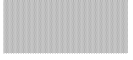

**********************
The Interactive Editor
**********************

The Open Dylan environment has a text editor that is specifically
designed to make it easy to write and interact with your Dylan code. One
of its most unique features is that it actually lets you compile
selections of code as you develop your application. This is why we say
the editor is *interactive*.

You can use the editor in one of two styles: Emacs or Windows. Using the
editor options, as described in
` <../../../../../../../ldisk2/doc/dylan/product/guide/environment/src/appx.htm#52521>`_,
you can choose from either an Emacs or Windows style keyboard layout and
default settings.

The editor allows you to perform a wide range of operations by using
menu commands, as well as keyboard commands. These operations range from
simple tasks such as navigating around a file to more complex actions
that have been specifically designed to ease the task of writing and
working with Dylan code, such as compiling selected blocks of code,
setting breakpoints, editing multiple sources, and browsing objects.
*You can do all of these things while your application is running.*

This chapter describes the editor and gives you a general overview of
how to use it. Some familiarity with Emacs and Windows usage is
presumed.

While basic use of the editor is quite intuitive, by becoming familiar
with the menus and options, you can more effectively use the editor to
perform advanced operations.

Invoking the editor and displaying files
----------------------------------------

The editor window lets you read and edit text files stored in your
filesystem. You can invoke the Open Dylan editor in a variety of
ways:

-  Click the New Text File (

-  Double-click on a file listed in a project window and an editor
   window opens and displays the file.
-  Click the Edit Source (

-  Choose a file name from the *File* menu on a project window, an
   existing editor window, or the main window. (The main window’s *File*
   menu only lists files if they have been viewed previously.)
-  Choose *Edit Source* from the popup (shortcut) menu for an object.

When the editor opens, a buffer containing the text of the current file
is displayed, and you can move around it and change its contents as you
wish, then save it back to the original file (assuming that you have
permission to write to it). ` <editopt.htm#43811>`_ shows a file opened
in an editor window.

.. figure:: ../images/editorgm.png
   :align: center

   Editor window showing the game.dylan file from the Reversi project.

Display conventions
~~~~~~~~~~~~~~~~~~~

The editor separates each definition in a source file with a gray line.
Printed in the middle of each line is the name of the definition below
it. These code separators also appear above top-level expressions
wrapped with *begin* … *end*. A file has to have been compiled for code
separators to show.

The code separators are just a visual aid, and are not part of the file
itself. If you opened the source file in a different editor you would
not see the separators. The compiler also ignores them.

When you add a new definition, or a new *begin* … *end* top-level form,
the code separators will only be updated if you manually refresh the
editor window (*View > Refresh* ), move the cursor past an existing
separator, or perform some other operation that forces the editor to
redisplay.

If you have opened a source file in the editor by double-clicking on an
item in the debugger’s source pane, Open Dylan positions the
insertion point at the line containing the problem. If the problem
identified by the debugger spans a range of lines, the entire range is
highlighted in the editor. Likewise, if the problem is an undefined
binding and you have opened the source from the project window’s
Warnings tab page, the binding in question is highlighted.

Changing the editor options and layout
~~~~~~~~~~~~~~~~~~~~~~~~~~~~~~~~~~~~~~

By default the editor uses Windows-style defaults and therefore
associates each opened file with a new editor window. However, you can
change this and edit many different files at once in the same editor by
using the *View > Editor Options…* Display tab page. Alternatively, you
can use the Restore tab page to switch to Emacs defaults, which changes
this default (and others). For details about the Editor Options dialog,
its tab pages and settings, see
` <../../../../../../../ldisk2/doc/dylan/product/guide/environment/src/appx.htm#52521>`_.

The editor offers a number of different viewing options for the window’s
layout.

-  The status bar, located at the bottom of the editor window, lets you
   examine any output messages from the environment. You can show or
   hide the status bar using *View > Status Bar*. This is where you
   will see messages displayed about your interactive development, such
   as “Compiling definition…” when you compile a selection.
-  The standard Dylan toolbar can be viewed or hidden with *View >
   Toolbar*.
-  The color dispatch optimizations feature, as described in `See
   Dispatch Optimization Coloring in the
   Editor <../coloring.htm#27192>`_, shows you where and how to optimize
   your code and is controlled by *View > Color Dispatch Optimizations*
   .

The editor window’s context: the active project
~~~~~~~~~~~~~~~~~~~~~~~~~~~~~~~~~~~~~~~~~~~~~~~

In an editor window, the toolbar and menu commands act upon the
application of the active project. For instance, the *Project*, *Build*,
and *Application* menus are not available in the editor if the source
file being edited is not part of the active project—the project whose
name is visible in the main window’s drop-down list. See `See The active
project <../debug.htm#21333>`_ for more details.

Menu commands and special features
----------------------------------

The editor offers all of the standard *File* and *Edit* menu commands a
user expects to find on a text editing window (such as New, Open, Cut,
Copy, Paste, Find/Replace, and so forth). The editor also has the
standard Open Dylan menus, such as *Go*, *Project*, *Application*,
and *Window*. This section describes the additional menu commands
provided by the Open Dylan editor.

The *Go* menu commands open an appropriate window, usually the browser
or the project window, to show you the corresponding item. For instance,
*Go > Breakpoints* opens the project window for the active project and
displays the Breakpoints tab page. Likewise, when you choose *Go > Edit
Compiler Warnings* an editor window opens on the source code
corresponding to the first compiler warning for the project. The cursor
is automatically positioned at the problem area in the code. In Emacs
mode, you can use Ctrl+. (Ctrl+ period) to view the source for the next
compiler warning, and so forth.

The *Object* menu commands require that you place the cursor in an
element name in the editor window. The commands then allow you to browse
that element or edit the related code. For instance, if the cursor is
placed in a class name, *Object > Edit Subclasses* opens an editor
window to display a composite buffer containing the subclasses of that
class.

The editor’s *Project* menu contains two special commands beyond the
standard Project commands on other Dylan windows:

Compile Selection
   Allows you to compile a selection of code independently while an
   application is running. This is one of the editor’s special
   interactive capabilities. For details and an example of interactive
   development using Compile Selection, see ` <editopt.htm#41268>`_.

Macroexpand Selection
   When the cursor is placed in a macro in the editor window, choosing
   this command expands the macro code in the buffer so that you can see
   the actions it performs. Use *Edit > Undo* (or the toolbar/keyboard
   equivalents) to return to the original contents of the buffer.

The editor’s *Application* menu is the same as for the debugger or the
project window, except that it contains extra breakpoint commands. These
breakpoint commands are also part of the shortcut menu. See `See
Breakpoint options <../debug.htm#23683>`_ for details.

If you have Microsoft Visual SourceSafe installed, the editor displays
a *SourceSafe* menu. This menu is Open Dylan’s interface to source
control. For more information, see ` <editopt.htm#33650>`_.

Shortcut menus
~~~~~~~~~~~~~~

The editor provides a shortcut menu whose items vary depending on where
your cursor is when you right-click. The most basic shortcut menu pops
up if you right-click in a file when the cursor is *not* in the middle
of a code element (like a method or a class name). This menu contains
the items: Edit Source, Cut, Copy, Paste, Delete.

A more extensive shortcut menu pops up if you right-click when the
cursor is in (or on either side of) a code element. In addition to the
commands in the basic shortcut menu, this menu contains the following
commands:

Describe
   Opens a window that lists the element’s module, library,
   source file, and describes the element.

Browse
   Opens a browser window on the object.

Browse Type
   Opens a browser window on the type of the object.

Edit Source
   Takes you to the portion of code in the source file where
   that element is originally defined.

Edit Clients
   Opens an editor window that displays the users of the
   selected definition.

Edit Used Definitions
   Opens an editor window that displays definitions used by the
   selected definition.

Show Documentation
    Opens the Open Dylan HTML Help.

If you right-click when the cursor is in a method name, the shortcut
menu also contains tracing commands and breakpoint manipulation
commands. For details about these shortcut commands, see `See Breakpoint
options <../debug.htm#23683>`_.

Breakpoint commands are also available if you right-click when your
mouse pointer is over the leftmost column of the editor window (see `See
Breakpoint options <../debug.htm#23683>`_). Underscores in the leftmost
column indicate lines where you could add a breakpoint (see
` <editopt.htm#43811>`_).

Using the editor for interactive development
--------------------------------------------

You will recall from `See An example interaction with
Reversi <../debug.htm#33511>`_ that we were able to change the shapes of
the Reversi game pieces while the application was running simply by
providing new definitions in the interactor. Now imagine that you were
developing the Reversi application and wanted to interact with it as you
coded the sources. The Open Dylan editor allows you to compile
pieces of your code and see the results in the running application by
using *Project > Compile Selection*.

In the following example we interact with the Reversi application from
an editor window opened on one of the Reversi sources.

Open the Reversi project, and choose *Application > Start*.

Make some moves on the board.

Open the file *board.dylan* in the editor by double-clicking it in the
reversi project window.

Find the variable definition:

.. code-block:: dylan

    define variable \*reversi-piece-shape\* = #"circle";

Change the word *circle* to *square*, so that the line reads:

.. code-block:: dylan

    define variable \*reversi-piece-shape\* = #"square";

Select the line of code and choose *Project > Compile Selection*.

Notice that the status bar says “Compiling region…” and then
“\*reversi-piece-shape\* successfully downloaded“.

Make a few moves on the board.

The new moves and any refreshed area of the board display square game
pieces.

Unlike the interactor, which compiles and executes the code you enter in
the context of the paused thread to which the debugger is connected, the
editor compiles the code you select in the context of a special
interaction thread that it chooses automatically. This prevents
unnecessary tampering with user threads.

Source control with Visual SourceSafe
-------------------------------------

To simplify the process of working with files under source control, the
Open Dylan editor provides an interface to Microsoft’s Visual
SourceSafe, an external source code control system. This section
describes the editor interface to Visual SourceSafe. (For information on
using Visual SourceSafe, see Visual SourceSafe documentation.)

What is the editor’s source control interface?
~~~~~~~~~~~~~~~~~~~~~~~~~~~~~~~~~~~~~~~~~~~~~~

A source code control system provides one or more repositories
(databases) where developers place source code and related files for a
project. Files in the database can be accessed by several developers
simultaneously by copying them from the database to their local machine.
A developer can “check out” one or more files from the database in order
to make changes and, when finished, “check in” the updated files for use
by other developers. The database maintains a history of the changes
made to each file, making it possible to retrieve older versions if
necessary. It also provides mechanisms to resolve conflicts when two or
more developers are making changes to the same files at the same time.

The Open Dylan source control interface provides access to a subset
of Visual SourceSafe features, which are described in
` <editopt.htm#13586>`_. To perform more complex actions, you must use
the source control system’s native interface.

Open Dylan detects a Visual SourceSafe installation on a machine
and automatically makes its interface to source control available by
creating an additional *SourceSafe* menu on editor windows (see
` <editopt.htm#57280>`_). Therefore, you must have Visual SourceSafe
installed in order to see the *SourceSafe* menu.

   The SourceSafe menu on a Open Dylan editor window.

The SourceSafe menu commands
~~~~~~~~~~~~~~~~~~~~~~~~~~~~

The *SourceSafe* menu provides the following commands:

Get Latest Version…
   Copies the latest version of a file in the database onto the
   developer’s machine.

Check Out…
   Copies the latest version of a file in the database onto
   the developer’s machine. In addition, the database is updated to note
   that the file is being edited by the developer.

Check In…
   Copies a file from the developer’s machine back into the
   database, creating a new version of the file, and notes that the file
   is no longer being edited by the developer.

Undo Check Out…
   Notes in the database that a file is no longer being edited by the
   developer and does not change the latest version of the file. In
   addition, the latest version of the file is copied from the database
   onto the developer’s machine; any changes the developer may have made
   to the local copy of the file are abandoned.

Merge with Source Control…
   Merges the changes made by the developer to the local copy of a file
   with the latest version of the file in the database and replaces the
   local copy of the file with the merged edition; the file remains
   checked out by the developer.

Add to Source Control…
   Creates the first version of a file in the source control database
   using the copy on the developer’s machine as the initial content.

Remove from Source Control…
   Removes a file and its history from the database.

Show History…
   Displays the list of changes made to a file as recorded
   in the database.

Show Differences…
   Compares the latest version of a file in the database against a copy
   on the developer’s machine and displays the differences, if any. This
   command can be used to check to see if others may have made changes
   to a file that should be merged into the developer’s copy before it
   is checked into the database.

Using the editor’s source control interface
~~~~~~~~~~~~~~~~~~~~~~~~~~~~~~~~~~~~~~~~~~~

The first time you choose one of the *SourceSafe* menu items, the editor
prompts you for the name of the SourceSafe database, as shown in
` <editopt.htm#51518>`_.

   The Select Database dialog.

Your site’s Visual SourceSafe administrator supplies the name of your
SourceSafe database. (The Open Dylan interface offers the name of
the last database used in the Visual SourceSafe explorer as the
default.)

The editor then requests the identity of the file (or files) to be
manipulated by a source control operation, as shown in
` <editopt.htm#59619>`_.

   The Select Project and File dialog.

SourceSafe organizes its database into a hierarchical collection of
projects. Each project can hold both files and projects (in other words,
subprojects). The project named *$/* refers to the root of the
SourceSafe database. In ` <editopt.htm#59619>`_ the developer has
selected a project three levels below the root.

When using Visual SourceSafe, you may omit the file name in all
operations (except for *SourceSafe > Add to Source Control…* and *Remove
from Source Control…* ) to cause the operation to be performed on all
files in the project. For instance, to check out all the files in a
project, leave the File field empty in the Select Project and File
dialog.

The Reason field is provided mainly as a convenience. Not all operations
prompt you for a Reason; in such cases the dialog only asks for the
project and file names. When a Reason is requested, it is optional and
may be left blank.
