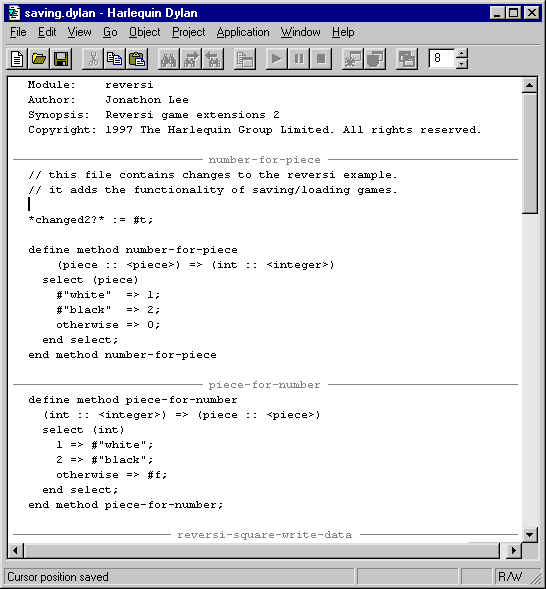
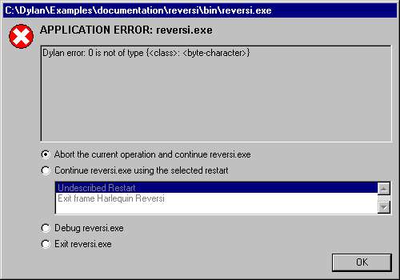
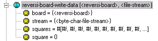
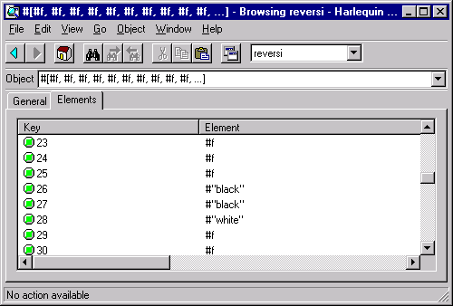

***********
Fixing Bugs
***********

Though we can play Reversi, we cannot save games in progress and resume
play at a later date. In this section, we add a save feature to the
game, available through **Save**, **Save As** and **Open** commands on the
**File** menu. (If you look at the version of Reversi we have at the
moment, you will see that those items are disabled.)

The code we will add to implement the save feature has a small bug that
we must correct before the feature will work properly. In doing so, we
will see the editor, debugger, and browser tools.

Rebuilding the application
==========================

There is another prepared Dylan source file with the changes we need to
implement the game-saving facility.

In the Reversi project window, go to the Sources page and select
*piece-shapes.dylan*.

Choose **Project > Insert File**.

The Insert File into Project dialog appears.

In the dialog, select *saving.dylan* and click **Open**.

Open Dylan puts *saving.dylan* below *piece-shapes.dylan* in the
list of project sources.

Now we can rebuild the executable Reversi application.

Choose **Project > Build** in the Reversi project window.

Open Dylan builds the application again.

If you are still running Reversi when you choose **Project > Build**, you
will be asked to confirm that you want to stop running it and go ahead
with the build.

Towards the end of the build, the link warning dialog appears again,
asking whether we want to link the application executable despite there
being serious warnings. Again, we do want to link the application.

Click **Yes** in the link warning dialog.

Notice the message in the status bar at the bottom of the Reversi
project window after rebuilding Reversi::

    Build completed. 5 serious warnings, 1 warning.

In the next section, we look at what serious warnings and warnings are,
and how the environment helps us deal with them.

Problems at compile time
========================

In this section we look at how the compiler handles problems that it
comes across in a project’s source code. When we rebuilt Reversi in
`Rebuilding the application`_, the compiler
discovered nine problems in the project’s source code. It reported those
problems and divided them into two categories: serious warnings and
warnings.

The compiler issues a *serious warning* for code that would lead to an
exception at run time if it was executed. Among the causes of serious
warnings are Dylan syntax errors, references to undefined bindings, and
calls to functions with the wrong number or type of arguments.

For code with only cosmetic problems, such as a method definition that
ends with *end class* instead of *end method*, the compiler issues
a *warning*.

You can see a table of any warnings or serious warnings that were
generated the last time a project was compiled by choosing the Warnings
page in the project window. After a build where there were warnings or
serious warnings, like this one, the Warnings page is selected
automatically.

.. figure:: ../images/warnings2-0b1.png
   :align: center

   The project window’s Warnings page.

The table has four columns:

-  Source Shows the source code location of the problem that caused the
   warning or serious warning. The column has the form {*file name*
   }:{*line number* }.
-  Library Shows the library containing the source code that caused the
   warning.
-  Owner Shows the problem area that caused the warning.
-  Warning Shows the warning or serious warning message.

The items in the table are sorted lexically by the Source column value.
Warnings and serious warnings without associated source locations have
empty Source fields, and appear at the top of the list. (To sort the
table by the values in another column, click on that column’s header.)

Each warning or serious warning is linked to the source definition that
caused it. We can select individual warnings and serious warnings to
learn more about the problems they are describing.

Select the first item in the Source column, a serious warning in
*saving.dylan* at line 20.

We can now see the full text of the serious warning::

    Serious warning at saving:20:
    Unexpected token "define".

If we double-click on an item, Open Dylan opens the appropriate
source file in an editor window, and positions the insertion point at
the line containing the problem. If the problem spans a range of lines,
the entire range is highlighted in the editor. Likewise, if the problem
is an undefined binding, the binding in question is highlighted.

Double-click on the same item.

An editor window appears.

Notice how the editor separates each definition in a source file with a
gray line. Printed in the middle of each line is the name of the
definition below it. These code separators also appear above top-level
expressions wrapped with *begin* … *end*.

The code separators are just a visual aid, and are not part of the file
itself. If you opened the source file in a different editor you would
not see the separators. They are ignored by the compiler.

When you add a new definition, or a new *begin* … *end* top-level form,
the code separators will only be updated if you manually refresh the
editor window (**View > Refresh**), move the cursor past an existing
separator, or perform some other operation that forces the editor to
redisplay.

   The Open Dylan editor.

Now we can see the cause of the first serious warning. A semi-colon is
missing from the end of the definition of *number-for-piece* in
*saving.dylan*. The missing semi-colon makes the definitions of
*number-for-piece* and *piece-for-number* run into one another instead
of being separate.

As it turns out, all the other serious warnings that were reported were
caused by this single missing semi-colon. The compiler could not parse
the definitions of *number-for-piece* and *piece-for-number*. The
compiler skips over such source code and does not generate object code
for it.

This means that any subsequent references to *number-for-piece* and
*piece-for-number* in the source code would be references to name
bindings that are never defined in the compiled application. Lines 32,
50, 59, and 73 referred to one or the other of these names, which
triggered the serious warnings.

Add the missing semi-colon so that the last line of the definition
*number-for-piece* appears as follows::

    end method number-for-piece;

While we are editing the file, we can fix the non-serious warning. It is
caused by a mismatched *end* clause in *reversi-game-write-data*. It is
a method, but the *end* clause says *end class* instead of *end method*.

Locate the definition of the *reversi-game-write-data* method in
*saving.dylan*.

Change the last line of the definition so that it appears as follows::

    end method reversi-game-write-data;

Choose **File > Save** in the editor.

Open Dylan saves the file, first making a backup of the previous
version in *saving.dylan~* —that is, in a file of the same name, but
with an extra character in the file extension, a tilde (~), to show that
it is a backup file.

Having attended to the cause of the serious warnings and warnings, we
can rebuild the application and try out the new version.

Choose **Project > Build**.

You can choose this in either the editor or the project window.

Notice the status bar in the Reversi project window after the build is
complete::

    Build completed with no warnings.

As well as removing the serious warning our semi-colon correction
addressed, all the other serious warnings that were follow-on effects of
the missing semi-colon have gone away. In addition, the single ordinary
warning was removed by the *end* -clause fix.

Controlling the compiler’s treatment of warnings
------------------------------------------------

We have seen that serious warnings are caused by code that, if executed,
would lead to a run-time exception. Some programming language compilers
would refuse to link an executable file or DLL for such code, on the
grounds that the code ought to be fixed before it is executed.

In Open Dylan, we can choose to go ahead and link in this
situation. The choice is controlled from the main window, under the
Build page of the **Options > Environment Options** dialog.

The option “Always link, even if there are serious warnings” forces the
compiler to link an executable file or DLL for a project regardless of
any serious warnings. We can also choose “Ask whether to link if there
are serious warnings“, and “Don’t link if there are serious warnings”.
“Ask whether to link if there are serious warnings” is the default
setting.

Problems at run time
====================

Now we have taken a brief look at how Open Dylan treats
compile-time problems, we will look at how it lets us debug problems
that only emerge as exceptions at run time.

.. note:: The numbered example steps in this section lead us through a
   possible debugging scenario. In places the example is a little
   unrealistic. This is because usually you are familiar with at least some
   of the code you are debugging, and also because the main purpose of the
   example is to introduce features of Open Dylan.

With the rebuilt version of Reversi that compiled with no warnings,
start a new game, with **Application > Start**.

After a couple of moves, save the new game by choosing **File > Save** in
the Reversi window.

The Save dialog appears.

Choose a file to save into, and click **Save**.

An application error dialog appears.

   A Dylan run-time application error.

The dialog appeared because the Open Dylan debugger caught an
unhandled Dylan exception in the Reversi application. Something is wrong
with the game-saving code. We must start up a debugger window to see
what went wrong.

Choose Debug reversi.exe and click **OK** to enter the debugger.

The Open Dylan debugger appears. We discuss the debugger in detail
in ` <debug.htm#18907>`_.

In its uppermost pane, the debugger shows the error that it caught. It
will be::

    Dylan error: *n* is not of type {<class>: <BYTE-CHARACTER>}

where *n* is either 0, 1, or 2. (The value depends on the state of the
game when we saved it. The reason for this will become clear shortly.)

In the left-hand pane beneath the message, there is a tree item for the
master thread of the Reversi application. This tells us that the
exception was raised in that thread. (In Reversi’s case, there happens
to be only one thread, but other applications might have multiple
threads, and knowing the thread that raised the exception is useful. See
` <debug.htm#18907>`_ for more information about debugger options.)

When expanded, the tree item shows the current state of the call stack
for Reversi’s master thread. When the debugger is invoked on a thread,
it pauses execution in that thread. So when we expand the tree we see
the stack almost exactly as it was at the moment that the debugger was
invoked.

The reason why what we see is *almost* exactly what the stack was like
at the moment the debugger was invoked is that the stack pane normally
filters out a lot of call frames that the Open Dylan run-time
system creates. Because these are not frames that the running
application creates directly, most of the time they are of no interest,
and so it is convenient to hide them. You can change the filtering with
the drop-down list available directly above the thread pane in the
debugger. The default filter setting is “Filtered visible frames”.

.. figure:: ../images/errstack2-0.png
   :align: center

   The Reversi application stack after a game-saving error.

Each item in the list is a call frame on the stack for the thread being
debugged. We call this list of call frames a stack backtrace or simply a
*backtrace*.

The backtrace shows frames in the order they were created, with the most
recent at the top of the list. The frames are represented by the names
of the functions whose call created them, and are accompanied by an icon
denoting the sort of call it was. See ` <debug.htm#21078>`_ for details
of the icons and their meanings, but note for now that the green arrow
icon represents the current location of the stack pointer—that is, the
call at which the thread was paused.

Searching the stack backtrace for the cause of the error
--------------------------------------------------------

In this section we examine the backtrace and see what events led up to
the unhandled exception.

Looking at the top of the backtrace, we can see that the most recent
call activity in the Reversi master thread concerned catching the
unhandled exception and invoking the debugger. The calls to
*primitive\_invoke\_debugger*, *default-handler*, and *error* were all
part of this. But if we move down the backtrace to the point below the
call to *error*, we can examine the sequence of calls that led to the
unhandled exception and find out how to fix the error.

The first interesting call for us is the one to *write-element*. This
is the last of the calls appearing in the stack frame that Reversi made
before the unhandled exception.

Select the call frame for *write-element*.

The source code definition of *write-element* appears in the pane
opposite. This source code pane is read only; if we wanted to edit a
definition shown in it we would click on the Edit Source (|image0|)
button above the source code pane, which would open the file containing
the definition in an editor window.

Looking at the source code for *write-element*, the green arrow icon
points to an assignment to *sb.buffer-next*. Here, the green arrow is
showing the point at which execution would resume in that call frame if
the application’s execution was continued. What we do not know is
whether the preceding call, to *coerce-from-element*, returned. It may
be that the call failed (because the arguments were not what
*coerce-from-element* was expecting) or that it succeeded but does not
appear in the stack pane because of the default filtering.

To work out what has happened, we can examine the stack pane filtering
with the filtering drop-down list.

Choose “Filtered frames” from the stack pane filtering drop-down list
(which by default is set to “Filtered visible frames”).

The stack pane updates itself.

The six settings available from the stack pane filtering drop-down list
provide a quick way of changing what you view in the stack pane:

All frames
   Shows all frames in the thread being debugged.

All visible frames
   Shows all the frames in the thread that are part of the module’s
   context, in this case the reversi module’s context, which includes
   calls to any functions imported from other modules.

All local frames
   Shows all frames defined in the current (reversi) module.

Filtered frames
   Shows a filtered list of function calls in the thread
   being debugged.

Filtered visible frames
   Shows a filtered list of function calls in the current module plus
   calls to functions imported from any other modules used.

Filtered local frames
    Shows a filtered list of function calls from the current module only.

The “Filtered…” settings do not, by default, show foreign function
calls, cleanup frames, and frames of unknown type, whereas the “All…”
settings show everything. You can set the filtering rules using **View >
Debugger Options…**, see ` <debug.htm#23810>`_ for details.

.. figure:: ../images/unfilterederrstack2-0.png
   :align: center

   Stack pane showing call frames from all modules.

So the question is whether the call to *coerce-from-element* failed, or
whether it succeeded, but comes from a module that Reversi does not
explicitly use. The stack pane now shows a frame for the call to
*coerce-from-element*. The name has the suffix
*streams-internals:streams*. This means that *coerce-from-element* is a
name from the *streams-internals* module of the *streams* library.

This *name* :*module* :*library* form of printing Dylan names is used in
a number of different places in Open Dylan. It shows that *name* is
not part of the module, or module and library, that a tool is currently
focused on. (The debugger and browser both have a toolbar pop-up where
you can change the current module.)

Returning to our example, we now know that *write-element* ’s call to
*coerce-from-element* succeeded, because it created a call frame. We can
see that *coerce-from-element* is now the last frame on the stack before
the call to *error*.

Select the call frame for *coerce-from-element*.

The green arrow in the source code definition for *coerce-from-element*
points to an assignment containing a call to *byte-char-to-byte*.
Notice that this call does not appear in the backtrace. Because the
backtrace is now showing call frames from all modules, we know that the
exception must have been raised while attempting to call this function,
before a call frame was created for it.

Since the error dialog told us that the exception was caused by
something being of the wrong type, there is a good chance that the value
of *elt*, the argument to *byte-char-to-byte*, is of the wrong type.
Notice too that *elt* ’s type is not specified in the signature of
*coerce-from-element*.

We need to know the value passed to *elt*. We can find out by expanding
the *coerce-from-element* call frame: a call frame preceded by a *+* can
be expanded to show the values of its arguments and local variables.

Expand the call frame for *coerce-from-element*.

We can now see the value that was passed for *elt*. It is an integer
value, either 0, 1, or 2. It is this value that caused the error that
occurred. This is the message again::

    Dylan error: *n* is not of type {<class>: <BYTE-CHARACTER>}

where *n* is either 0, 1, or 2.

Our next task is to find out why *coerce-from-element* was sent an
integer instead of a byte character. To do this, we can simply move down
the backtrace and examine earlier calls.

Select the call frame for *write-element*.

We can see here that the value passed to *elt* in *coerce-from-element*
is the value of one of *write-element* ’s parameters, also called *elt*
.

We need to move further down the stack to the *reversi-board-write-data*
call.

Select the call frame for *reversi-board-write-data*.

The *reversi-board-write-data* method takes an instance of
*<reversi-board>* and an instance of *<file-stream>* as arguments. A
*<reversi-board>* instance is what the application uses to represent the
state of the board during a game. A *<file-stream>* is what Reversi is
using to write the state of the board out into a file that can be
re-loaded later.

We can see that this method calls *reversi-board-squares* on the
*<reversi-board>* instance and then iterates over the value returned,
apparently writing each element to the stream with
*reversi-square-write-data*. (Notice that *reversi-square-write-data*
does not appear on the stack—this is because it contains only a tail
call to *write-element*, and so is optimized away.)

We are closing in on the bug. It is looking like the value representing
the Reversi board squares (*squares* ), and the file stream the squares
are being written to (*stream* ), have incompatible element types, with
the squares being represented by integers, and the file stream being
composed of byte characters.

Browsing local variables
------------------------

In this section we use the Open Dylan browser to help confirm the
cause of the unhandled Dylan exception.

Expand the call frame for *reversi-board-write-data*.

We can now see the values of the local variables in this frame. The
arguments are listed first: *board* and *stream*, followed by the
*squares* sequence and iteration variable *square*.

   Local variables in the *reversi-board-write-data* call frame.

The notation

.. code-block:: dylan

    board = {<reversi-board>}

means that *board* is an instance of *<reversi-board>* —an actual
instance in the paused application. The curly braces mean that this is
an instance of the class rather than the class definition itself.

We can look at this *<reversi-board>* instance in the *browser*, which
allows us to examine the contents and properties of all kinds of things
we come across in Open Dylan.

Double-click on the *board* item.

The browser appears.

.. figure:: ../images/firstbrowse.png
   :align: center

   Browsing an instance of *<reversi-board>*.

The browser shows us in its Object field that we are browsing an
instance of *<reversi-board>*. Like the debugger, the browser uses the
curly braces notation to depict an *instance* of a class as opposed to
its definition.

The browser presents information in property pages. In the page selected
by default, we see the names of the slots in the instance and the values
they had when the exception occurred. The property pages that the
browser shows depend on what it is browsing; the set of pages for a
class definition is quite different from that for a method definition,
for example.

However, the browser always provides a General page. The General page
gives an overview of the currently browsed object.

Choose the General page.

The fields on the General page for our *<reversi-board>* value tell us
that it is an instance of type *<reversi-board>* and that it has two
slots. The third field, Source, is labeled “n/a” for “not applicable“.
The Source field shows a source file name for anything the compiler saw
during compilation, such as a definition. We are browsing an instance,
not a compiler record, so it is not relevant to associate the instance
with a source location. For more on the browser’s distinction between
run-time and compile-time objects, see ` <browsing.htm#40077>`_.

Choose the Contents page.

If we double-click on items on the Contents page, the browser moves on
to browsing them.

Double-click on the *reversi-board-squares* item.

   Browsing the elements of a collection.

Now we can see the elements of the *reversi-board-squares* collection.

Click on the Back (|image1|) button to return to browsing *board*, the
*<reversi-board>* instance.

Going back to the bug we are tracking down, two more useful pieces of
information have emerged from seeing the *<reversi-board>* instance in
the browser.

First, we can tell from the Contents page, which shows the slot values
in the instance, that the call to *reversi-board-squares* in
*reversi-board-write-data*, below, is clearly just a call to the
default accessor on the *<reversi-board>* slot of the same name.

.. code-block:: dylan

    define method reversi-board-write-data
        (board :: <reversi-board>, stream :: <file-stream>)
    => ()
      let squares = reversi-board-squares(board);
      for (square from 0 below size(squares))
        reversi-square-write-data(squares[square], stream);
      end for;
    end method reversi-board-write-data;

Second, we can see that the *reversi-board-squares* slot holds a
sequence, and that the sequence does not have an *<integer>* element
type.

So we still do not know where the integer that caused the exception came
from. However, we have yet to check what goes on in
*reversi-square-write-data* ; perhaps that method is converting the
elements in the *reversi-board-squares* sequence into integers?

Browsing definitions
--------------------

In this section, we browse the definition of *reversi-square-write-data*
to see whether it converts the board squares into integers.

To browse the definition, we have the option of locating it on the
project window Definitions page or (more efficiently) moving it directly
in the browser.

Delete the text in the browser’s Object field and type
*reversi-square-write-data* in its place.

Press Return.

The browser switches to the definition of the
*reversi-square-write-data* method. When we browse a definition as
opposed to an instance, the browser usually shows a larger set of
property pages that supply a lot of information about the definition and
the relationships between it and other definitions in a project. The
default property page here is the Source page, which shows the source
code for the method.

Here is the code:

.. code-block:: dylan

    define method reversi-square-write-data
      (square :: <piece>, stream :: <file-stream>)
    => ()
      write-element(stream, number-for-piece(square));
    end method reversi-square-write-data

So *number-for-piece* is most likely returning the integer value that
was passed to *write-element* (and that we can see on the stack as the
*elt* local variable). The square value has type *<piece>* —this, then,
is the element type of the sequence used to represent the state of the
board.

Browse the definition of *number-for-piece*.

You can do this either by typing the name into the Object field, or by
clicking on the name on the Source page and selecting *Browse* from the
right-click popup menu.

The definition of *number-for-piece* completes the story. It is here
that the board square representations are converted into integers. This
is where the integer that caused the exception came from.

Fixing the error
----------------

In this section, we fix the Reversi project source code to eliminate the
cause of the exception we have been tracking down.

This is what we have learned about the error so far:

-  It occurred when trying to save a Reversi game.
-  It was caused in a call to *coerce-from-element*, which attempted to
   pass an integer to *byte-char-to-byte*, a method which expects an
   instance of *<byte-character>*.
-  The *coerce-from-element* method received the integer from
   *write-element*, which received the integer from
   *reversi-square-write-data*.
-  The *reversi-square-write-data* method uses the *number-for-piece*
   method to translate board square representations (type *<piece>* )
   into instances of *<integer>*. The *<piece>* values are either *#f*
   (no piece on this square), *#"white"* (a white piece on this square),
   or *#"black"* (a black piece on this square); those values are
   translated into 0, 1, and 2 respectively. That is why *n* could have
   been either 0, 1, or 2 in the error message::

    Dylan error: *n* is not of type {<class>: <BYTE-CHARACTER>}

So the value of *n* depends on the state of the first square to be
written.

In addition:

-  The *write-element* generic function is from the Open Dylan
   Streams library. It is part of that library’s protocol for writing to
   streams.
-  The stack shows that the *write-element* method tried to coerce an
   integer to a byte character, and that the attempt failed.

So we know that Reversi is trying to write integer values to a file
stream with a *<byte-character>* element type, and the exception occurs
during the attempt to coerce an integer into a byte character.

We could simply change the file stream’s element type to *<integer>*.

In fact, we have not yet looked at the call that created the file
stream. That call is *reversi-game-save-game*.

Return to the debugger and select the call frame for
*reversi-game-save-game*.

As expected, the source pane shows that the file stream is created with
an element type of *<byte-character>*. The relevant code fragment is:

.. code-block:: dylan

    let file-stream = make(<file-stream>, locator: file,
                           direction: #"output",
                           element-type: <byte-character>);

Click the Edit Source (|image2|) button above the source code pane.

An editor window opens on *saving.dylan*.

We now have *saving.dylan* in the editor, and the insertion point is
positioned at the start of the definition for *reversi-game-save-game*.
We can make the change to *<integer>*, but should first check
*reversi-game-load-game*, the method that loads games saved by
*reversi-game-save-game*, to see what sort of file-stream elements it
expects to read back.

That definition is located directly below that of
*reversi-game-save-game*. It shows that the file-stream element type
expected is *<byte>*.

.. code-block:: dylan

    let file-stream = make(<file-stream>, locator: file,
                           direction: #"input",
                           element-type: <byte>);

The class *<byte>* is actually a constant value, defined:

.. code-block:: dylan

    define constant <byte> = limited(<integer>, min: 0, max: 255);

So there is no harm in changing the *element-type:* argument in
*reversi-game-save-game* ’s call to *make* from *<byte-character>* to
*<integer>* (because 0, 1, and 2 are all within the defined range for
*<byte>* ), but for symmetry we may as well change it to *<byte>*.

Fix the definition of *reversi-game-save-game*.

The *element-type:* keyword in the call to *make* on *<file-stream>*
should take *<byte>*, not *<byte-character>*.

Choose **File > Save** in the editor.

Before we can rebuild the application we need to stop the current
version running.

Choose **Application > Stop** in the editor.

A dialog appears asking you to confirm that you want to stop the
application.

Click **OK**.

Rebuild the application with **Project > Build**.

Start the application again, and try to save a game.

The save operation now works without raising an unhandled exception.

Loading the saved game back in
------------------------------

The next step is to test the code for loading a saved game. To test this
we need to change the state of the board from what it was like when we
saved the game.

Clear the Reversi board by clicking **New Game** in the Reversi
application.

Choose **File > Open** in the Reversi application, select the file you
saved the game into, and click **Open**.

Reversi now shows the state of the game you saved earlier.

.. |image0| image:: ../images/editsrc.png

.. |image2| image:: ../images/editsrc.png
