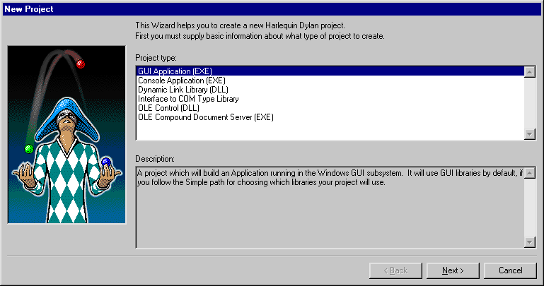
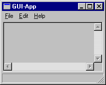
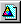

***************************
Creating and Using Projects
***************************

In this chapter we look more closely at projects. We take a break from
Reversi and develop some new projects of our own. To do this, we use
Open Dylan’s New Project wizard. We also look at some of the
options and settings associated with projects, and some of the features
of the project window.

Creating a new project
======================

We now create a new project for a simple “Hello World” application that
will run in an MS-DOS console window.

We create the project by clicking the New Project (|image0|) button in
the main window, or by choosing **File > New** in any window.

Click the New Project button in the main window.

The New Project wizard appears.

   The New Project wizard.

The New Project wizard guides us through the process of creating a new
project. Across a series of pages, it gathers the following information:

-  The type of target file (.EXE or .DLL) that should be created when
   the project is built.
-  The name of the project and a folder on disk for storing its files.
-  The libraries and modules that the project will use.
-  Documentation keywords to be used in the project’s various files.

When we have supplied all the information that it requires, the wizard
creates a new project, consisting of the following files:

-  A project file. The file has the same name as you give the project,
   but with a .HDP extension.
-  A Dylan source file, called *library.dylan*, that defines a library
   with the same name as the project
-  A Dylan source file, called *module.dylan*, that defines a module
   with the same name as the project
-  An initial Dylan source file into which we can write application
   code. The file has the same name as the project, but with a .DYLAN
   file extension.

Some application types contain:

-  A Dylan source file containing some useful constant and function
   definitions. The file has the same name as the project, with *-info*
   appended, and with a .DYLAN file extension. So for a project called
   Hello, the file would be *Hello-info.dylan*.

The *project* *-info.dylan* file appears only if you ask for template
code to be included in your project.

And for GUI applications that use the DUIM library, there can also be:

-  A Dylan source file, called *frame.dylan*, that defines the
   application’s DUIM frame and a set of default menus.

The *frame.dylan* file appears only if you ask for template code to be
included in your project. We discuss this in `Projects for GUI
applications`_.

For more information on DUIM, see *Building Applications Using DUIM* and
the *DUIM Reference*.

Specifying the type of the project
----------------------------------

The first page in the New Project wizard asks us to specify the kind of
target we want to build from the project.

In the Project type box, the default option is “GUI Application (EXE)”.
Our “Hello World” application is going to be an MS-DOS console
application, so we need to change this option setting from the default.

Select “Console Application (EXE)” in the Project type box.

Click **Next**.

We now move to the second page.

Specifying the project name and location
----------------------------------------

The second page in the New Project wizard asks us to supply a name for
our project, and to specify a location for the automatically generated
project and source files.

.. figure:: images/pwiz2.png
   :align: center

   The New Project wizard’s second page.

When naming projects, remember that Open Dylan uses the name given
to a project as a basis for naming some of the files that make up the
project, so the name should only contain characters that are valid in
Windows file names.

In addition, the project name is used as the default name of the library
and module that the project defines, so unless you change those names
(with the *Advanced…* dialog; see `Advanced project settings`_), the
project name must also be a valid Dylan name.

Here we can also specify, using the “Include any available templates”
check box, that the wizard should generate skeleton code for our project
if a template for the project type is available.

Template code provides a skeleton version of the sources for a project
of the type we are creating. We can then modify the skeleton code to fit
our needs. The content of the skeleton code not only reflects the type
of project selected on the first page, but also our answers to
subsequent questions that the wizard asks.

Since we want to develop a simple “Hello World” application, we are
going to call the project Hello.

Type **Hello** in the Name box.

As you type Hello, the Location box fills in a folder for the
automatically generated project and source files.

The New Project wizard will create the folder in the Location box
automatically if it does not already exist.

Click **Next**.

We now move to the third page.

Choosing the libraries that the project uses
--------------------------------------------

The next stage in creating our project is to decide which libraries and
modules it is going to use. The third page of the wizard offers three
different ways to do this. Each of the three options is described below.

-  Minimal If we choose this the project uses the Functional-Dylan
   library only.
-  Functional-Dylan is a convenience library that combines the standard
   Dylan library with a language extensions library called
   Functional-Extensions. Thus Functional-Dylan provides a “Harlequin
   dialect” of Dylan. (The standard Dylan library, without Harlequin’s
   extensions, is also included in the set of Open Dylan
   libraries.)
-  Simple If we choose this the wizard presents a series of choices we
   can make to determine which libraries and modules the project should
   use.
-  Custom If we choose this the wizard presents a table of all the
   libraries and modules available, and allows us to select the ones we
   want our project to use.

All our Hello project needs to do is print a text message saying “Hello
World” to the standard output in an MS-DOS console window. The
Functional-Dylan library contains a function to do this, so for our
project we can select the Minimal button and move on to the next page in
the wizard.

Select **Minimal** in the Use Libraries box.

Click **Next**.

We now move to the final page.

.. index::
   single: Author: interchange format keyword, setting default
   single: Copyright: interchange format keyword, setting default
   single: interchange keywords, setting defaults for new projects

The final page in the New Project wizard
----------------------------------------

The final page of the New Project wizard gives us the option of
supplying text for the documentation keywords *Synopsis:*, *Author:*,
*Copyright:*, and *Version:*.

If we supply values for these keywords, the wizard adds them to the top
of each of the files that it creates for the project, including the
project file itself. With the exception of *Synopsis:*, these keywords
are defined as part of the Dylan interchange format, on page 23 of the
DRM. *Synopsis:* is a not a standard Dylan interchange keyword, but an
additional one that Open Dylan accepts.

.. figure:: images/pwiz3.png
   :align: center

   The New Project wizard’s third page.

Change the default keyword text as you wish, or turn the keywords off
altogether.

Click **Finish**.

Now we have supplied all the information the wizard asks for, it creates
the new Hello project and opens it.

Examining the files in the Hello project
----------------------------------------

:ref:`hello-project` shows our new Hello project.

The default view shows the Sources page, where we can see the files
*library.dylan*, *module.dylan*, and *Hello.dylan*.

.. _hello-project:

.. figure:: images/hellopr.png
   :align: center

   The Hello project.

The *library.dylan* file defines a Dylan library called *Hello*, which
uses the library *harlequin-dylan*. The *module.dylan* file defines a
module of the *Hello* library which is also called *Hello*, and which
uses various modules exported from the *harlequin-dylan* library.

The *Hello.dylan* file is an initial file into which we can write the
code for our project. It contains a default start function called *main*,
and the last lines of the file call this *main* function. For more on
the purpose of this function, see `The project start function`_.

We can add further files to the project as we see fit. But our “Hello
World” application is trivial: we can write the code into *Hello.dylan*
now, and our work will be done. The application will simply call the
function *format-out* on the string *"Hello World\\n"*. The
*format-out* function (exported from the *simple-format* module) formats
its argument on the standard output.

Open the *Hello.dylan* file in the editor.

Add the following code in the definition of *main*:

.. code-block:: dylan

    format-out("Hello World\\n");

Choose **File > Save** to save the change to *Hello.dylan*.

Now we can build our “Hello World” application.

Choose **Project > Build** in the project window.

Test the application by choosing **Project > Start**.

An MS-DOS console window appears, into which “Hello World” is written.
Then a notifier dialog appears to confirm that the console application
has terminated.

You can find the *hello.exe* file in the *bin* subfolder of the *Hello*
project folder we specified on the second page of the New Project
wizard. See :ref:`projects-on-disk` for more details of where build
products reside.

Projects for GUI applications
-----------------------------

In this section, we define a more typical project. This project will be
a for GUI application. To do this, we take a different path through the
New Project wizard. We look at the project files that the wizard
creates, then build and run our GUI application.

Creating a GUI project
----------------------

First, we create the new project for our GUI application.

Click the New Project (|image1|) button in the main window.

On the first page, we want to specify the project type.

Select “GUI Application (EXE)” in the Project type box.

Click **Next**.

We now move to the second page of the wizard.

Here, we want to name the project and specify a folder for its files.

Name the project *GUI-App* and choose a location for it.

The New Project wizard can set up some skeleton program code for our
project, according to the project’s characteristics as we specify them.
Template code is not relevant for all kinds of projects—for instance,
our Hello project would not have benefited from any more initial program
structure than it had—but the wizard will include any that is relevant
if we check the “Include any available templates” box.

Make sure the “Include any available templates” box is checked.

We ignore the **Advanced…** button again.

Click **Next**.

We now move to the third page of the wizard.

When we created the Hello project, we chose the Minimal option here, to
use only the Functional-Dylan library. Our GUI application also needs to
use other libraries for access to the native window system.

Select “Simple” in the Use Libraries box.

Click **Next**.

We now proceed through a series of pages allowing us to specify our
project requirements in high-level terms, without knowing the names of
specific Open Dylan API libraries.

The wizard will make our project’s library definition use the right
libraries and modules to do what we ask on these pages, and will include
suitable template code in the project sources. Thus the Simple option is
a useful way to create projects until you are more familiar with the
libraries that Open Dylan offers.

On the first page we can specify the what I/O and system support we want
in our project. For each option, the wizard shows which libraries the
project will use.

Leave the default settings on this page as they are, and click **Next**.

The next page is for specifying GUI support details. Here, we can decide
whether we want to do the window programming for the application by
using DUIM, Open Dylan’s high-level GUI toolkit, or by using the
Win32 API libraries described in the *C FFI and Win32* library
reference. We want to use DUIM in this project.

Select “Dylan User Interface Manager (DUIM)”.

Click **Next**.

Now the wizard offers different pages, which we don't explain here.
We will keep clicking *Next* until we get to the last page of the wizard.
This is the page for specifying source file headers, as we saw in
`The final page in the New Project wizard`_.

Click **Next** until the last page of the wizard appears.

If you made any changes to this page last time, they will have been
preserved. Whenever you click **Finish**, the wizard saves all these
headers (except *Synopsis:* ) and some other details, and reinstates
them next time you create a project. See `Saving settings in the New
Project wizard`_ for a list of the details that the
wizard saves.

Make any changes you want to here, and then click **Finish**.

The wizard creates the new GUI-App project and opens it.

Examining and building the new GUI project
------------------------------------------

Now, we examine the template code that the wizard has set up for us in
the GUI-App project sources.

The GUI-App project contains the same basic set of files as Hello. There
is a *library.dylan* file, a *module.dylan* file, and a *GUI-App.dylan*
file. In addition, there is a *GUI-App-info.dylan* file and a
*frame.dylan* file.

The *GUI-App-info.dylan* file appears whenever you choose “GUI
Application (EXE)” as the target type on the first page of the wizard.
It contains some simple code that you might want to use for identifying
your application and its version number.

The *frame.dylan* file defines a DUIM frame for the application and a
set of default menus. Frames are DUIM’s way of representing application
windows. More knowledge of DUIM is necessary to understand the code in
*frame.dylan* properly, but we can start by seeing what the code
actually does when we build the project. All projects including template
code can be built without requiring any further work.

Choose **Project > Build** in the GUI-App project window.

Choose **Application > Start**.

An application window appears.

   The GUI-App skeleton application.

We can see from the window that the template code creates a skeleton
application with File, Edit, and Help menus. There is even some
functionality attached to the basic application. If we choose **File >
New**, an editor pane is initialized, into which we can type. The other
**File** and **Edit** menu commands have their standard effects. The **Help >
About** command uses some of the constants from *GUI-App-info.dylan* to
identify the application as “GUI-App Version 1.0”.

Creating a project using the Custom library option
==================================================

The New Project wizard’s Use Libraries page has a Custom option which
allows complete control over the libraries and modules a project will
use. This section explains how to choose libraries and modules using
this option.

After selecting Custom and clicking *Next*, the wizard shows a page
with three list panes. We can make selections from each list pane.

At first, the only list enabled is the Choose Library Groups list.
Because there are many libraries available in Open Dylan, the
wizard puts libraries into groups according to their functionality. We
can select a group to see the list of libraries it contains, and then
choose a library from the list. When we select a group, the wizard
displays the library list in the second pane.

Libraries are grouped by functionality in a fairly broad fashion, so
some libraries appear in more than one group because they fit more than
one description. For instance, the C-FFI library appears in both the
“Interoperability” group and the “Win32” group.

Notice the check next to “Core”, indicating that “Core” is the only
group from which a library or libraries will be used by default. Note
that when using Custom library selection to create a project with any
GUI or OLE features, you must explicitly specify the GUI and OLE
libraries you wish to use.

If we select “Core”, we can see which libraries from that group would be
used in a default project.

Select “Core” in the Library Group list.

.. figure:: images/p2frag2-0.png
   :align: center

   Functional-Dylan is the default library for use in new projects.

So, by default, a project would use the library Functional-Dylan. (Note
that Functional-Dylan is the default library for use in new projects.
Your copy of Open Dylan may have more library groups.)

If we now select Functional-Dylan in the Library list, we can see which
modules from the Functional-Dylan library a default project would
include.

Select “Functional-Dylan” in the Library list.

.. figure:: images/p2frag2_2-0.png
   :align: center

   Default modules from Functional-Dylan for use in new projects.

Although the list shows that the Dylan and Functional-Extensions modules
are not used, they are actually used indirectly, since the
Functional-Dylan module is simply a repackaging of those two modules.

Remember that, in Dylan, the library is the unit of compilation, and
modules are simply interfaces to functionality within a library. By
deciding not to use a particular exported module, you will import fewer
interfaces into your application, but the delivered application will not
be any smaller on disk, or in memory when it is running.

Saving settings in the New Project wizard
=========================================

Whenever you click **Finish** on the last page of the New Project wizard,
the wizard stores some of the choices and text-field settings you made
so that they are available next time you create a project. The details
that are saved persistently are as follows.

-  The parent of the folder in the Location box.

The parent folder is saved in the expectation that you will want to
create several projects in sibling folders.

-  In the *Advanced…* dialog (see `Advanced project settings`_),
   the contents of the Start Function box and the setting of
   Compilation Mode.
-  The setting of the “Include any available templates” check-box.

On the last wizard page:

-  The contents of the Source File Headers boxes, except for *Synopsis:*.

*Synopsis:* is not saved because it is likely to change with each new
project.

Nothing from the first page is saved.

Advanced project settings
=========================

The *Advanced...* button on the first page of the New Project wizard
leads to the Advanced Project Settings dialog. The dialog has five
sections.

The Library and Module Names section allows you to specify names for
your project’s main library and module. The default value in both cases
is the name of the project.

The remaining sections—Start Function, Version Information, Compilation
Mode, and Windows Subsystem—all control settings that you can both set
here and change after creating a project by choosing **Project >
Settings…**. See `Project settings`_ for details.

Adding, moving, and deleting project sources
============================================

In this section we discuss how to insert files into a project, how
re-order them, and how to delete them from the project.

Inserting files into a project
------------------------------

To insert a new file or subproject into a project, choose **Project >
Insert File...** in the project window. The project window prompts you
with the *Insert File into Project* dialog, through which you can find a
file to insert.

The file you choose will appear below the currently selected file in the
list, unless you insert a subproject (a .HDP file), which will appear at
the bottom of the list.

You can insert any file into a project; if the compiler does not know
what to do with it, it ignores it. For instance, you can insert .TXT
files into a project, and the compiler will skip over them.

When you have chosen your file, the project window places the file below
the file currently selected in the list.

If you have added a subproject (a .HDP file), remember that you still
need to edit the library and module definitions in your project to
import from the new subproject.

Moving the position of a file within a project
----------------------------------------------

To move a file to a new position in a project, select the file in the
Sources page and use **Project > Move File Up** and **Project > Move File
Down**.

Deleting files from a project
-----------------------------

To delete a file from a project, select the file in the Sources page and
choose **Project > Remove File**. You could also select **Edit > Cut**,
**Edit > Delete**, or the scissors toolbar icon.

Open Dylan asks you if you are sure you want to delete the file
from the project, because you cannot undo the operation. Note that the
file is not deleted from disk, just removed from the Sources list in the
project. You can always put it back with **Project > Insert File**.

.. note:: The project window’s Definitions page shows the definitions that
   were part of the project when it was last compiled. The list is taken
   from the current compiler database for the project. If you delete a
   source file from the project, the definitions from that file stay on the
   Definitions page until you rebuild the project, which causes the
   compiler database to be updated.

.. index:: start function
   single: applications; start function

.. _start-function:

The project start function
==========================

The New Project wizard always adds a *start function* to the end of the
last file in the project.

The Dylan language does not require that a program define an explicit
start function, such as *main* in C or Java. However, when you are
debugging or interacting, Open Dylan finds it useful to know what
you consider to be your program’s start function. It allows the name of
your start function to be recorded in its project information. By
default, this name will be *main*, and corresponds to the *main*
function that the New Project creates by default in the *project-name*
*.dylan* file for all new projects. However, you are free to change the
name if you like—there is nothing special about it.

The *project-name* *.dylan* file for all new projects will contain a
definition of *main* and a call to it. Projects that include template
code will contain this definition of *main* :

.. code-block:: dylan

    define method main () => ()
      start-template()
    end method main;

Projects that do not include template code will contain this definition:

.. code-block:: dylan

    define method main () => ()
      // Your program starts here...
    end method main;

For both kinds of project, the *project-name* *.dylan* file will end
with this expression:

.. code-block:: dylan

    begin
      main();
    end;

The name of the Start Function is one of the project settings you can
change in the **Project > Settings…** dialog. It appears on the Debug page
in the Start Function section. The default name is *main*, but you can
change it to any valid Dylan name you like. If you do so, make sure to
replace the call to *main* with a call to your new start function. The
source file is not updated automatically.

Note that you can make the wizard use a different start function name in
new project files by changing the default setting in the Advanced
Project Settings dialog. Click **Advanced…** on the second wizard page to
produce the dialog. In this case, the generated project code will call
the correct new name without requiring you to make a change by hand.

The debugger uses the start function name to know where to pause a
program that you start up in interaction mode with **Application >
Interact** or the Interact (|image2|) toolbar button, or in debugging
mode with **Application > Debug**. When you start a program either way,
the debugger allows the program to execute normally, but sets a
breakpoint on the start function so that interaction or debugging begins
at a point where the entire program has already been initialized.

If no start function is nominated for a project, the program pauses
precisely before it exits but after everything in it has executed. This
is usually what we want for a DLL, but not for an application.

.. note:: To be sure that you can access all the definitions in your
   application when you start it up in interaction mode, the call to *main*
   must come after all the definitions in the project. Typically, this
   means the call must be the last expression in the last file listed in
   the project. Otherwise, the application will be paused before all its
   definitions have been initialized, and interactions involving its
   definitions could behave in unexpected ways.
   See :ref:`application-and-library-initialization`
   for more information on this topic.

.. _project-settings:

Project settings
================

The **Project > Settings...** dialog allows you to set options for
compiling, linking, and debugging projects. There are separate pages for
each category, each described below.

Compile page
------------

The **Project > Settings…** dialog’s Compile page controls the compilation
mode setting for the current project. Any project can be compiled in one
of two modes: Interactive Development mode, and Production mode. See
:ref:`compilation-modes` for details of the modes.

Link page
---------

The **Project > Settings…** dialog’s Link page controls whether a project
is linked as an executable or as a DLL, and what its name will be. It
also allows you to specify version information for the target, a base
address for it, and the Windows subsystem it runs in.

.. note:: The default linker used in Open Dylan is a GNU linker. If
   you own Microsoft Developer Studio, you can use the Microsoft linker
   instead. To change the default linker, go to the main window and choose
   **Options > Environment Options…**, then choose that dialog’s Build
   page.

Target File section of the Link page
------------------------------------

The **Project > Settings…** dialog’s Link page has a Target File section
that contains the name of the project target and the type of the target.
The default target name is derived from the name of the project. Note
that the name will always end in .EXE or .DLL according to the target
type, regardless of any extension you give to the target’s name.

Base Address section of the Link page
-------------------------------------

The **Project > Settings…** dialog’s Link page has a Base Address section
that allows you to specify a base address for your target file. This is
the address at which the target will be loaded into memory.

Windows 95, Windows 98, and Windows NT all provide a default base
address, one for EXEs and one for DLLs, and will also relocate the
target automatically if there is no room for it at that address. You can
provide a value in the Base Address if you would like the target to be
loaded at a particular location. The value should be specified in
hexadecimal, using Dylan’s *#x* prefix: for example, *#x1000000*.

Version Information section of the Link page
--------------------------------------------

The **Project > Settings…** dialog’s Link page has a Version Information
section that allows you to add major and minor version numbers to a DLL
or EXE. The values in this section are recorded in the DLL or EXE that
the project builds. Open Dylan uses them at compile time and run
time to determine if compatible versions of Dylan libraries are in use.
See :ref:`versioning` for details.

Windows Subsystem section of the Link page
------------------------------------------

The **Project > Settings…** dialog’s Link page has a Win32 Subsystem
section that allows you to specify that the target should run in the
“Windows GUI” (WINDOWS) subsystem or the “Windows Console” (CONSOLE)
subsystem. You may wish to change this value if you change the code of a
console-mode project to make it create its own windows, or vice versa.

The default for a project created in the New Project wizard as a
“Console Application (EXE)” is to run in the Windows Console subsystem,
while the default for a project created as a “GUI Application (EXE)” is
to run in the “Windows GUI” (WINDOWS) subsystem.

Debug page
----------

The **Project > Settings…** dialog’s Debug page allows you to specify a
command line with which to execute the project target, and the start
function for the project.

The command line facility is especially useful for testing console
applications from within the development environment. If there are
values in the Command Line section of this dialog when you run a project
target with *Project > Start* (and similar commands), Open Dylan
uses them to execute the application. It creates a new process from the
executable named in the Executable field and passes it the arguments
from the Arguments field. Thus the values in these fields should form a
valid MS-DOS command line when concatenated.

See `The project start function`_ for details of the start function.

Another use of the Command Line section is to arrange to test and debug
DLLs and OLE components. See :ref:`debugging-techniques` for a description
of these debugging techniques.

.. index:: .LID files
   single: file extensions; .LID

Project files and LID files
===========================

Open Dylan’s project files can be exported in a portable library
interface format called LID (library interchange description). Harlequin
and other Dylan vendors have chosen LID as the standard interchange
format for Dylan libraries. LID files describe libraries in a flat ASCII
text format for ease of interchange between different Dylan systems. The
*Core Features and Mathematics* reference volume describes the LID
format. LID files must have the extension .LID.

Opening a LID file as a project
-------------------------------

When you open a LID file in the development environment, it is converted
into a project file and opened in a project window. (This process does
not modify the original LID file on disk.)

In order to open a LID file as a text file in an editor, open the LID
file using **File > Open** and select the file type filter “Dylan Library
Interchange Descriptions (as text)” before clicking **Open**.

Exporting a project into a LID file
-----------------------------------

To export a project as a LID file for use in other Dylan
implementations, use **File > Save As** and choose the file type “Dylan
Library Interchange Descriptions”.

Note that a LID file created by export will list source files by name
only, and without paths. In addition it will not contain any of the
project settings, any files that are not Dylan source files (.DYLAN
files), and any information about whether the project was created as a
console application.

