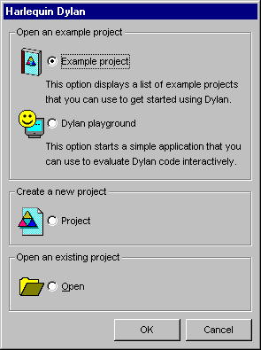
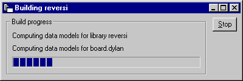
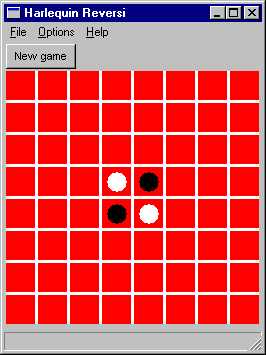
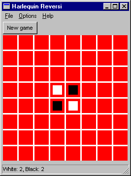

***********
Quick Start
***********

This first chapter is a quick introduction to building applications with
Open Dylan.

Starting work with Open Dylan
=============================

In this section, you will start Open Dylan’s development
environment, and choose one of several supplied examples to work with.

Start the Open Dylan environment.

You can do this by choosing the Start menu shortcut *Start* *>*
*Programs* *>* *Open Dylan* *>* *Dylan*. Open Dylan will also
start if you open any file associated with it, such as a Dylan source
file.

When Open Dylan starts, the *main window* appears:

.. figure:: ../images/mainwin.png
   :align: center

   The Open Dylan main window.

The *initial dialog* also appears:

   The initial dialog.

The main window will be present throughout your Open Dylan session.
It provides a way to set environment-wide options and to control the
display of all Dylan windows. To exit Open Dylan, choose *File >
Exit* in the main window.

The initial dialog (`See The initial dialog. <quick-start.htm#25162>`_)
is there to help you get working quickly, whether by looking at an
example project, creating a new project, opening an existing project or
text file, or starting an interactive Dylan session in the *Dylan
playground*. (See ` <debug.htm#42200>`_ for more information.)

We want to browse the example projects.

Select the “Example project” option and click *OK*.

The Open Example Project dialog appears.

The Open Example Project dialog shows several categories of example
Dylan project. If you expand a category you can see the examples
offered.

The “Getting Started” category contains two very simple projects to help
you start programming in Dylan and using the libraries included with
Open Dylan. The “Documentation” category contains examples from the
Open Dylan documentation set.

The source files for the example projects are stored under the top-level
Open Dylan installation folder, in the subfolder *Examples*. Each
example has its own project folder. The files that Open Dylan
creates when building a project are also stored under this folder.

We are going to look at the example called Reversi, which is in the
“Documentation” category.

.. figure:: ../images/examples-dlg.png
   :align: center

   The Open Dylan Examples dialog.

Expand the “Documentation” category by clicking the *+* next to it.

Select “Reversi”, then click *OK*.

A *project window* appears.

The project window is one of four programming tools in Open Dylan.
The other tools are the browser, the editor, and the debugger.

The project window
==================

In the project window you can see the project that you are working on. A
*project* represents a Dylan library under development. We look at
projects in more detail in ` <projects.htm#23024>`_.

.. figure:: ../images/motproj.png
   :align: center

   The Open Dylan project window.

Projects are a key concept in Open Dylan. Virtually all programming
tasks you can carry out in Open Dylan take place in the context of
a project. (An exception is editing text files: you can edit a text file
without its being part of a project.)

Every time you open a project, or create a new one, Open Dylan
displays it in a project window. If you have more than one project open
at a time, each is displayed in a separate window.

You will use the project window frequently during development. Some of
the things you can do in or begin from the project window are:

-  Building, running, and interacting with applications.
-  Editing source files.
-  Browsing warnings generated when a project was last built.
-  Browsing the classes, functions, variables, and so on that a project
   defines.
-  Browsing the libraries used by a project.
-  Browsing and setting breakpoints on source code.

In short, the project window is a focal point for work in Open
Dylan.

The Reversi project
===================

The project window that is now on your screen has several pages of
information about the project Reversi. This project represents a Dylan
library called Reversi that can be built into an executable application.
Reversi implements a popular board game.

The default view in the project window is the Sources page, which
displays the source files that the project contains. We can see that the
Reversi project contains six source files. These files include
definition files for the Reversi library and the modules it
exports—*library.dylan* and *module.dylan* respectively. Later, we will
add some more files to the project to implement new game features.

Building an executable application
==================================

We can use the project window to build an executable application from
the Reversi project.

This will be a normal Windows executable file with an EXE extension.
Open Dylan puts the files it builds in a subfolder of your
top-level Open Dylan installation folder, devoted to the Reversi
project. We will see more about where projects and their build products
reside on disk in ` <model.htm#32022>`_.

Building Reversi
----------------

To build an executable application for a project, choose *Project >
Build* in its project window.

Choose *Project > Build* in the Reversi project window.

Open Dylan starts building the application. A progress indicator
window appears.

   The build progress indicator.

Because we have never built the Reversi application before, Open
Dylan examines and compiles every source file. When compilation is
finished, it links the compiled files together with the system libraries
that the application uses, and creates an executable file. Before it
does that, however, a dialog appears.

.. figure:: ../images/linkqn.png
   :align: center

   The link warning dialog.

The dialog appears to let us know that the compiler issued *serious
warnings* while compiling the project sources, and to let us choose
whether to go ahead with the “link” phase of building. The “link” phase
creates the executable application for the project.

Why are there serious warnings? Recall from `See The Reversi
project <quick-start.htm#14321>`_ that we will be adding some more
source files to the project later on. These files implement new game
features that require debugging and will help to demonstrate the
Open Dylan development environment further. Because we built the
project without adding the extra files, the compiler detected that some
code in the project refers to name bindings that were otherwise
undefined, and issued the serious warnings.

If there are serious warnings when compiling a project, we will usually
want to fix the code first before trying to run the application. But
sometimes it is useful to be able to execute an application that is only
partly finished. As long as we know that the code containing the
references to the undefined bindings is not going to be executed, we can
safely test the rest of the application.

Reversi has been carefully coded to avoid calling these undefined names
until the files containing their definitions are included in the project
and the project is rebuilt. So there is no harm in building an
executable for Reversi.

If we click *Yes* in the link warning dialog, an executable is created;
if we click *No*, building stops. In either case, the serious warnings
are recorded in the project window’s Warnings page.

Click *Yes* in the link warning dialog.

Open Dylan links an executable for Reversi.

Running Reversi
---------------

Now that the application is built, we can run it. The project window
menu command *Application > Start* runs the most recently built
executable for that window’s project.

Choose *Application > Start*.

The Reversi application window appears.

   The Reversi application.

The Reversi application is now up and running.

When you choose *Application > Start*, the executable starts, runs, and
terminates normally, but at the same time it has an invisible connection
to the Open Dylan debugger. This means you can pause execution at
any time to debug the application and even interact with it. (Use
*Application > Pause* to do this.) In addition, if there is an unhandled
error inside the application, the debugger will catch it automatically
so that you can examine it. We will learn more about the debugger later,
in ` <expanding.htm#35733>`_ and also in ` <debug.htm#18907>`_.

Three ways of running Dylan applications
========================================

There are three ways we can run the Reversi application we have just
built. The first is to choose *Application > Start* from the Reversi
project window, as we have just seen. This menu command is also
available in the Open Dylan debugger and editor.

The second way to run the application is to click the “Start/Resume”
button (|image0|) on the project window’s toolbar. Again, we can do
this in the Open Dylan debugger and editor too. And again like
*Application > Start*, running an application this way connects it to
the debugger, so that any unhandled errors are caught and we can pause
and interact with the application.

Finally, we can run the application from outside Open Dylan as we
would any other executable application file—such as by typing its file
name into an MS-DOS console window, or double-clicking on it in an
Explorer window. If we run an application this way, Open Dylan
cannot connect a debugger to it. Any unhandled errors could therefore
crash the application, which we would not be able to pause and interact
with in the paused context.

Looking at definitions and expressions
======================================

Each file listed on the Sources page of the Reversi project window is
now preceded by a *+* symbol. This means we can now expand a file name
to reveal a list of all the Dylan definitions and top-level expressions
in that file.

In the Reversi project window, select the Sources page.

Expand the *algorithms.dylan* item by clicking the *+* next to it.

The definitions and expressions are sorted alphabetically under the file
name in which they appear. Definitions are the Dylan name bindings
created by compiling top-level definitions in the source code that the
file contains. Thus *define* *class* causes a class name to appear in
the list of definitions, *define* *method* a method name, and so on, but
the names of accessors on a class’s slots do not appear.

The expressions in the list are, roughly speaking, anything that appears
at top level in the source file but is not a definition. Typically such
expressions are assignments to global variables or function calls. For
example, in the listing for *algorithms.dylan*, there are several
top-level calls to the method *install-algorithm*, which stores values
in a globally visible table. Expressions that are part of a larger
expression, or part of a definition, are not shown.

In addition to the normal Dylan syntactic conventions—a leading dollar
sign for a constant, enclosure in angle brackets for a class, and so
on—icons appear next to definition names to indicate the kind of Dylan
object to which the names are bound. Constants, for example, are
indicated by an octagonal icon containing a stylized dollar sign
(|image1|). Expressions are indicated by a green octagon (|image2|).

You can also see definitions (but not expressions) listed by library and
module on the Definitions page. This page includes a facility for
filtering definitions out of the visible list according to their type or
whether their name contains a given string.

These lists are just one use to which the Open Dylan environment
puts its *compiler database*, a rich collection of information that the
compiler derives from every project it builds.

The fact that the compiler database is derived during compilation
explains why the file names in the Sources page were not expandable when
we first opened the Reversi project, and also why we would have seen
that the Definitions page was empty at that time. The compiler database
for Reversi did not exist until after we built the Reversi application.
However, when we open the Reversi project in future sessions, Open
Dylan will read in the database from disk.

Compiler databases are mostly used by the *browser* tool, which we will
look at later. See ` <model.htm#25398>`_ for more details of the
compiler database and ` <browsing.htm#36258>`_ for details of the
browser.

Building DLLs
=============

By default, Open Dylan projects are built into executable
applications (.EXE files), but with a simple setting we make them be
built into dynamic-link libraries (.DLL files).

This option is just one that we can change in the project window’s
*Project > Settings* dialog. From that dialog we can also set compiler
optimizations, project version information, and command-line arguments
for console applications. For more details, see
` <projects.htm#32945>`_.

Making changes to an application
================================

We will now make a change to the Reversi application. We are going to
add a new feature that allows someone playing Reversi to change the
shape of the pieces.

If you look at the Reversi application again now, you will see that some
of the commands on the *Options* menu—*Circles*, *Squares* and
*Triangles* —are unavailable. Our changes will enable these items.

Among the Reversi example files, there is a prepared Dylan source file
with the changes we need for this new piece-shapes code. It is not yet a
part of the project, so to incorporate it into our Reversi application,
we must add it to the project.

Exit Reversi by selecting *File > Exit* from the Reversi application
window.

You can also tell the environment to terminate a running application
using *Application > Stop* or the project window’s stop button (|image3|
). When you ask to terminate an application in this way, the environment
asks you for confirmation, to prevent application state being lost by
accident.

In the Reversi project window, select the Sources page.

The positions of files in the sources list are important. The last file
in the list should always be the file that contains the code that starts
the application running. Unlike C or Java, Dylan does not require us to
write a function of a predetermined name in order to start an
application. We simply make the last piece of code in the last source
file an expression that does something with all the Dylan definitions
that the source files contain.

In the Reversi project, *start-reversi.dylan* contains the code that
starts the application and so must be at the bottom of the source file
list. We want the file we are going to add to appear between
*board.dylan* and *start-reversi.dylan*.

Select *board.dylan*.

Choose *Project > Insert File*.

The Insert File into Project dialog appears.

In the Insert File into Project dialog, select *piece-shapes.dylan* and
click *Open*.

Open Dylan adds *piece-shapes.dylan* below *board.dylan*.

Now that *piece-shapes.dylan* is part of the sources that will be used
to build the Reversi application, we can rebuild the executable.

Choose *Project > Build* in the Reversi project window.

Open Dylan builds the application again.

This time, Open Dylan compiles only one file: *piece-shapes.dylan*.
No changes had been made to the existing source files, so it did not
need to recompile them. It simply linked the existing compiled files
with the new one to make the new executable.

This incremental compilation feature can save a lot of time during
development, when you want to rebuild your application after a small
change in order to test its effects. Open Dylan automatically works
out which files it needs to recompile and which it does not. The
compiler also updates a project’s database during incremental
compilation.

When compilation of *piece-shapes.dylan* is complete, there are still
some serious warnings. The link warning dialog appears to ask you to
confirm that you want to link an executable for Reversi.

Click *Yes* in the link warning dialog.

We can now run the new version of Reversi.

Choose *Application > Start* in the Reversi project window.

A new Reversi application window appears.

In the Reversi application, select the *Options* menu.

Thanks to our compiling the changes to the project, the *Circles*,
*Squares*, and *Triangles* items are now available:

.. figure:: ../images/othmen.png
   :align: center

   The Reversi application’s *Options* menu after the code changes.

Choose *Squares*.

The Reversi application updates the board, laying the pieces out again
as squares rather than circles.

   The Reversi application with square pieces.

.. |image0| image:: ../images/play.png
.. |image1| image:: ../images/constant.png

.. |image3| image:: ../images/stopbutton.png
