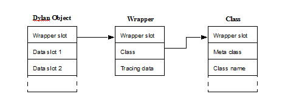

#########################
Open Dylan Runtime Design
#########################

Tony Mann, Jonathan Bachrach

Harlequin, Ltd.

4 December 1995

Warning
*******

Parts of this document were originally written for the GLUE project, and
were aimed at a target audience which is not Dylan literate. There are
vestigial patronizing references in some of these sections.

The Dylan Implementation Model
******************************

Object Representation
=====================

Harlequin’s implementation achieves dynamic typing of Dylan objects by
associating the type with an object based on tagging.

In many circumstances, the Dylan compiler can statically determine the
type of an object. This knowledge can be used to select an alternative
representation which is more efficient than the canonical
representation. For example, the canonical representation of a double
float object in Dylan is as a pointer to heap-allocated storage which
contains the IEEE bit pattern of the double float in addition to a
reference to the Dylan class object ``<double-float>``. The compiler may
choose to represent the value as a direct bit pattern, wherever this
does not violate the semantics of the program.

Tagging Scheme
--------------

All Dylan values are represented as data of the same size, the size of a
pointer. The bit pattern of these values contains tag bits which
indicate whether the value is actually a pointer, or whether it is a
direct value. Since there are three major groups (integers, characters
and everything else), the representation for all platforms is to use two
bits.

+----------+-----------------+
| Tag Bits | Type            |
+==========+=================+
| 00       | Heap Allocated  |
+----------+-----------------+
| 01       | Integers        |
+----------+-----------------+
| 10       | Characters      |
+----------+-----------------+
| 11       | Unused          |
+----------+-----------------+

Integers and Characters
-----------------------

Integers and characters are represented as direct values, using the tag
bits as the only indication of type. The tagging scheme uses the least
significant two bits. With this scheme, a character or integer is
converted to its untagged representation by arithmetic right shifting by
two bits. Similarly the conversion from an untagged to a tagged
representation is to shift left and add in the tag bits.

Operations on these values (e.g., addition, or other arithmetic
operations) are always performed on the untagged representation. This is
sub-optimal, because it is possible to perform arithmetic operations
directly on the tagged values. It is planned to improve this mechanism
at a later date, along with a revision of the tagging scheme.

Boxed Objects
-------------

Apart from integers and characters, all Dylan objects are indirectly
represented as *boxed* values (that is, they are pointers to heap
allocated boxes). The runtime system is responsible for ensuring that
these boxed values are appropriately tagged, because the runtime system
provides the allocation service, and must ensure appropriate alignment.

Boxed objects are dynamically identified by their first slot, which is
an identification wrapper. This identification wrapper (itself a boxed
Dylan object) contains a pointer to the class of the object it is
wrapping, as well as some encoded information for the garbage collector
about which slots should be traced.

Boxed Objects
-------------

Note that two indirections are necessary to find the class of an object.
In practice, this is a rare operation, because almost all dynamic class
testing within Dylan is implicit, and the implementation can use the
wrapper for these implicit tests. Note that there is potentially a
many-to-one correspondence between wrapper objects and class objects.

The Dylan compiler builds literal boxed objects statically whenever it
can. In practice, this will include most function objects apart from
closures, virtually all wrappers, and most class objects, as well as
strings, symbols, and literal vectors and lists.

Variably Sized Objects
----------------------

Variably sized objects, such as strings, vectors and arrays, are boxed
objects which contain a *repeated slot*. The repeated slot is
implemented as a variably sized data area preceded by a normal slot
containing the size of the variably sized data represented as a tagged
integer. The size slot is used at the Dylan language level to determine
the size of the array. There is also a special encoding for it in the
tracing data of the wrapper so that the memory manager knows how to
trace the repeated data. For example, an instance of the ``<byte-string>``
*"foo"* is represented as in:.

.. figure:: images/runtime-3.gif
   :align: center

   An Instance of ``<byte-string>``

Function Objects
----------------

Dylan provides two built-in classes of functions: ``<generic-function>``
and ``<method>``. These both obey the same general purpose calling
convention, but also support specialized calling conventions (described
below) which the compiler may use depending on the detail of its
knowledge about the function being called, and the circumstances. Slots
in the function object point to the code which implements each
convention.

All functions also have a slot which encodes the number of required
parameters the function accepts, and whether the function accepts
optional or keyword parameters. Another slot in each function object
contains a vector of the types which are acceptable for each required
parameter. These slots are used for consistency checking of the
arguments.

Generic functions have further slots which support the method
dispatching process — including a slot which contains a vector of all
the methods belonging to the generic function, and a slot which contains
a cache of sorted applicable methods for combinations of arguments which
have been processed before.

Methods may be closures, in which case a slot in the method object
contains the environment for the method, which is represented as a
vector of closed-over variables. If the variable is known actually to be
constant, then the constant value is stored directly in the vector.
Alternatively, if there is any possibility of an assignment to the
variable, then the value is stored with an extra indirection to a *value
cell*, which may be shared between many closures with related
environments.

Calling Convention
==================

Some terminology
----------------

Arguments passed to a function at the implementation level fall into 2
different groups. *Language parameters* correspond to the explicit
arguments in the source code. *Implementation parameters* correspond to
the house-keeping information used by the implementation.

The overall calling convention consists of several specific conventions
with different properties, described below. Each convention is
implemented by a separate *entry point*. There are partial orderings
between the entry points for these conventions, depending on how
specific each one is. The code which implements a control flow from one
entry point to the next may be obliged to rearrange parameters (e.g. on
the stack). This process is called *stack fixing*.

The register model
------------------

Three registers are used within the calling convention to support the
passing of *implementation parameters*: Note that for the C backend,
global (or thread-local) variables might be used instead of real
registers to pass these parameters.

+-----------+------------------------------------------------+
| Register  | Purpose                                        |
+===========+================================================+
| arg-count | number of args passed                          |
+-----------+------------------------------------------------+
| function  | the ``<function>`` object being called         |
+-----------+------------------------------------------------+
| mlist     | the next-method list (``#f`` for direct-entry) |
+-----------+------------------------------------------------+

The argument passing conventions
--------------------------------

For each of the conventions, arguments are pushed onto the stack in
reverse order (i.e. the rightmost argument is pushed first). The
leftmost (or leftmost few) arguments are passed in registers. This has a
possible disadvantage from the opposite ordering in terms of the need
for temporary variables to hold interim results for order-of-evaluation
reasons. In practice, the disadvantages will be small because:

-  Many arguments to functions are expected to be simple expressions
   (like constants or variable references) - so order of evaluation does
   not normally matter.
-  On a RISC implementation, we won’t want to push each argument anyway
   - instead it will be more efficient to allocate enough stack space
   for the call, and store each argument when it’s available. This works
   well with a conservative GC - but it might be poor with a total GC.

This calling convention has the following advantages:

-  required arguments can always be found at a known offset from a stack
   or frame pointer for any of the calling conventions
-  optional arguments appear in the same order in memory as they would
   if vectored up as ``#rest`` parameters
-  Stack allocating the optional arguments as vectors is almost trivial.

For the native code implementation, the callee is responsible for
popping any arguments from the stack. This is always possible (even with
dynamically sized optional args), because the argcount is available to
say how many arguments were passed. This is not possible for the C
backend - and this is the only substantial difference from the C arg
passing convention.

Calling Convention Goals
------------------------

*Internal entry points* should be as efficient as possible. I.e. there
should not be any constraints on them because Dylan is a dynamic
language.

#. There must be a consistent convention for all functions at the
   *external entry point*, so that functions can be called without the
   caller having any knowledge knowledge of what they are.
#. The code which is executed at external entry points should be shared
   by all functions with similar properties / lambda-lists.
#. The design should make the path from the external entry point to the
   internal entry point as simple as is reasonably possible.

The External Entry Point Convention
-----------------------------------

All Dylan function objects support the *external* convention. Each
function object has an *XEP* slot containing the code to support this
convention. External entry points are used for all unoptimized, normal
calls to functions. This includes direct calls to methods and generic
functions. Of course, whenever the compiler can use a more efficient
entry point instead, then it will.

The registers are used as follows:

+-----------+----------------------+
| Register  | Purpose              |
+===========+======================+
| argcount  | number of arguments  |
+-----------+----------------------+
| function  | the function object  |
+-----------+----------------------+
| mlist     | not used             |
+-----------+----------------------+

If the function has a complex lambda list (with ``#rest`` or ``#key``),
then the external entry code will be one of a standard set of stack fixing
functions. This stack fixer will make use of information in the function
register to determine which keys to look for, whether the arg-count is
legal, whether the arguments have appropriate types etc. The stack fixer
will then tail jump to the internal entry point (again, found from the
function object). This mechanism requires 2 transfers of control (caller
-> stack-fixer -> callee).

For example, consider the following Dylan code:

.. code-block:: dylan

    define method func1 (a, b, #rest optionals, #key key1, key2)
    end method;
    func1(1, 2, key2: 99);

For the call to ``func1``, above, the parameters are described in the
following table:

XEP Parameters for the Call to *func1*

+---------------------+-----------------------------------+
| XEP Parameters      | Values                            |
+=====================+===================================+
| language parameters | ``1``, ``2``, ``#"key2"``, ``99`` |
+---------------------+-----------------------------------+
| *argcount*          | 4                                 |
+---------------------+-----------------------------------+
| *function*          | generic function `func1``         |
+---------------------+-----------------------------------+

Internal Entry Point Convention
-------------------------------

The IEP convention uses a fixed number of language parameters,
corresponding to each of the parameters of the function (5 in the case
of *func1*, above, corresponding to a, b, optionals, key1, key2). In
addition, there are two implementation parameters:

-  *mlist*, a list of the next applicable methods to call if the
   function is a method called from a generic function (this parameter
   is used to support calls to *next-method*). If the function is not
   being called from a generic function, the value is *#f* (false).
-  *function*, the Dylan function object being called (as for the XEP).

The implementation parameters are not obligatory for all IEP code. It is
only necessary to pass *mlist* if the function contains a call to
*next-method*. It is only necessary to pass *function* if the function
is a closure (because the value is used by the IEP code to locate the
environment of the closure). If the IEP is called from the XEP code,
both the implementation parameters will always be set, even though they
may not be necessary. For the same call to ``func1``, above, the
parameters are described in ` <runtime.htm#12946>`_.

IEP Parameters for the Call to *func1*

+---------------------+---------------------------------------------+
| IEP Parameters      | Values                                      |
+=====================+=============================================+
| language parameters | ``1``, ``2``, ``optionals``, ``#f``, ``99`` |
+---------------------+---------------------------------------------+
| *mlist*             | ``#f``                                      |
+---------------------+---------------------------------------------+
| *function*          | generic function ``func1``                  |
+---------------------+---------------------------------------------+

Note that the language parameters now correspond to the formal
parameters of the function, whereas, for the XEP, they corresponded to
the supplied arguments.

The value of *optionals* in the set of language parameters is the Dylan
vector ``#[#"key2", 99]`` which corresponds to all the optional arguments.
The language parameter corresponding to ``key1`` is ``#f``, because the
keyword ``#"key1"`` was not supplied. However, the language parameter
corresponding to ``key2`` is ``99``, because ``#"key2"`` was supplied with
that value.

The Method Entry Point Convention
---------------------------------

All ``<method>`` objects support the *method entry point* convention. Each
method object has an *MEP* slot containing the code to support this
convention. When a method is called by a generic function (or via next
method), the caller uses a dedicated entry point (available from the
function object). If the method accepts ``#key`` or ``#rest`` parameters, then
the method is called with a (possibly stack-allocated) vector
representing the optional args. This vector appears as a single extra
required argument.

If the method accepts ``#key`` parameters, then the method entry point will
process the supplied keywords - stack fixing them so that they appear as
required arguments. It will then tail-call the internal entry point.

If the method does not accept #key, then the method entry point is the
same as the internal entry point.

Special Features
================

Introduction to bind-exit and unwind-protect
--------------------------------------------

The following sections describe the implementation for the native code
compiler, only.

Bind-exit and unwind-protect are represented on the stack as frames
which contain information about how to invoke the relevant
continuation. Unwind-protect frames are also chained together, and the
current environment of existing unwind-protects is available in
``%current-unwind-protect-frame``.

There are primitives to build each type of frame, and also to remove
unwind-protect frames (bind-exit frames just have to be popped - so that
is done inline). The primitive which removes unwind-protect frames in
the fall-through case is also responsible for invoking the cleanup code
(which is called as a sub-function in the same function frame as its
parent).

There are also primitives to do non-local exits (*NLX*). These are
passed the address of the bind-exit frame for the destination, and also
the multiple values to be returned. As part of the NLX, any intervening
unwind-protects are invoked and their frames are removed.
Multiple-values are saved around the unwind-protects in the bind-exit
frame of the destination.

unwind-protect
--------------

An *unwind-protect* frame (*UPF*) looks as follows:

+--------+----------------------------------+
| Offset | Value                            |
+========+==================================+
| 8      | address of start of cleanup code |
+--------+----------------------------------+
| 4      | frame pointer                    |
+--------+----------------------------------+
| 0      | previous unwind-protect frame    |
+--------+----------------------------------+

The compiler compiles unwind-protect as follows:

.. code-block:: dylan

    let frame = primitive-build-unwind-protect-frame(tag1);
    do-the-protected-forms-setting-results-as-for-a-return();
    primitive-unwind-protect-cleanup();
    goto(tag-finished);
    tag1:
      do-the-cleanup-forms();
      end-cleanup(); // inlined as a return instruction
    tag-finished:

If the protected body exits normally, then
*primitive-unwind-protect-cleanup* is called (in the runtime system).
This causes the unwind-protect frame to be unlinked from the chain, and
the cleanup code to be invoked, as a subroutine call within the same
function frame as the protected body. The cleanup code finishes by
executing a return instruction. The runtime system ensures that any
multiple values are restored, and returns control to the compiled code,
which then executes the code following the unwind-protect.

If the cleanup code is invoked because of an NLX, then the runtime
function finds the ultimate destination *bind exit frame* (*BEF*) from
the UPF. The runtime function then passes this BEF to another runtime
function (as for *bind-exit)* to test whether there are any further
intervening cleanups, or to transfer control to the ultimate destination
if not.

bind-exit
---------

A *bind-exit* frame (*BEF*) looks as follows:

+--------+------------------------------+
| Offset | Value                        |
+========+==============================+
| 52     | continuation address         |
+--------+------------------------------+
| 48     | frame pointer                |
+--------+------------------------------+
| 44     | current unwind-protect frame |
+--------+------------------------------+
| 4      | space for stack-allocated    |
|        | vector for up to 8 multiple  |
|        | values                       |
+--------+------------------------------+
| 0      | pointer to saved multiple    |
|        | values as a vector           |
+--------+------------------------------+

The compiler compiles bind-exit as follows:

.. code-block:: dylan

    let frame = primitive-build-bind-exit-frame(tag1);
    let closure = make-bind-exit-closure(frame);
    do-the-bind-exit-body-setting-results-as-for-a-return();
    tag1:

During an NLX, multiple-values will be saved in the frame if an
intervening unwind-protect is active. The frame itself contains space
for 8 values. If more values are present, then they will be heap
allocated.

When an NLX occurs, the transfer of control is implemented by a call
into the runtime system, passing the pointer to the BEF as a parameter.
The runtime function first checks whether there is an intervening
cleanup, by testing whether the target dynamic environment in the BEF
matches the current global dynamic environment. If there is no
intervening cleanup, then control is transferred to the destination of
the BEF. Alternatively, if there is an intervening cleanup, then the
ultimate destination field of the current UPF is set to the destination
BEF, and the cleanup code is invoked within a loop which repeatedly
tests for further intervening unwind-protect frames until no more are
found.

Multiple Values
---------------

The current implementation of multiple values supports Common Lisp
semantics. It is about to be replaced by a new version which which
support the new Dylan semantics.

Harlequin’s current implementation uses a register to return a single
Dylan value, as this is the only value that is used by almost all
callers. In addition, each function returns a count of the number of
values being returned. This count can be examined by the caller, if
required, to determine how many values were returned. If a function is
returning more than one value, the additional values are stored in a
global (thread-local) area, where the caller may retrieve then, if
desired. On RISC architectures, the multiple value count is returned in
a register. For the x86 architecture, the *direction flag* register is
set / unset to specify whether single / multiple values are being
returned, respectively. If multiple values are being returned, then the
count of the values is stored in a global (thread-local) location.

Documentation for the new version will be available shortly. Until then,
here’s an overview:

Functions which return a fixed number of return values just return those
values, without returning a count. The first few values will be returned
in registers (an architecture-specific number), and remaining values
will be returned in a thread-local overspill area. If a function always
returns zero values, then no code need be executed to indicate this
fact.

Functions which return a dynamically-sized number of values return their
values as above, but also return a count of the number being returned in
a register. If a function dynamically happens to return zero values,
then the return count will be set to zero, but the value*#f* will be
returned as if it were a the first return value.

If the caller of a function can statically determine the number of
return values (i.e. at compile-time), then it need perform no checks.
However, if the caller has no knowledge of the function being called,
then it must check the properties of the callee function object to
determine whether the static or dynamic convention is being used, and
may then need to read either the dynamic return value count, or the
static count in the properties of the function object.

This design has some interesting implications for tail-call
optimization. A function can simply tail another function only if both
the following rules apply:

#. The callee is known to return at least as many values as the caller,
   and they have appropriate types.
#. If the caller returns a dynamically-sized number of values, then the
   callee must too.

Name Mangling
=============

In Dylan, unlike C, identifier names are case insensitive. Dylan also
permits additional characters to appear in names. As a further
complication, Dylan provides multiple namespaces, and the namespaces are
controlled within a two-tier hierarchy of modules and libraries.

In order to make it possible to link Dylan code with tools designed to
support more traditional languages, the Dylan compiler transforms the
names which appear in Dylan programs to C compatible names, via a
process called *mangling*.

The library, module and identifier names are each processed, according
to the following rules:

#. All uppercase characters are converted to lowercase.
#. Any character which appears on the left-hand side of the table is mapped
   to the new character sequence accordingly.

+------+----------+---------------+
| Old  | New      | Comment       |
+======+==========+===============+
| *-*  | *\_*     | dash          |
+------+----------+---------------+
| *!*  | *\_E\_*  | exclamation   |
+------+----------+---------------+
| *$*  | *\_D\_*  | dollar        |
+------+----------+---------------+
| *\** | *\_T\_*  | times         |
+------+----------+---------------+
| */*  | *\_S\_*  | slash         |
+------+----------+---------------+
| *<*  | *\_L\_*  | less          |
+------+----------+---------------+
| *>*  | *\_G\_*  | greater       |
+------+----------+---------------+
| *?*  | *\_Q\_*  | question mark |
+------+----------+---------------+
| *+*  | *\_PL\_* | plus          |
+------+----------+---------------+
| *&*  | *\_AP\_* | ampersand     |
+------+----------+---------------+
| *^*  | *\_CR\_* | caret         |
+------+----------+---------------+
| *\_* | *\_UB\_* | underbar      |
+------+----------+---------------+
| *~*  | *\_SG\_* | squiggle      |
+------+----------+---------------+
| * *  | *\_SP\_* | space         |
+------+----------+---------------+

Finally, the fully mangled name is created by concatenating the
processed library, module, and identifier names respectively, separated
by ``X``.

For example, the Dylan identifier ``add-new!`` in module ``internal`` of
library ``dylan`` would be mangled as ``dylanXinternalXadd\_new\_E\_``.

In-line Call Caches
*******************

No documentation available here about this yet.

Static Booting
**************

No documentation available here about this yet.

FFI
***

No documentation available here about this yet.

Allocation
**********

No documentation available here about this yet.

HARP instruction set
********************

No documentation available here about this yet.

Compiler Support for Threads
****************************

Dylan Portability Interface
===========================

The Simple Threads Library is designed for implementation using
different threads APIs from common operating systems, including Unix
and Windows. Harlequin’s implementation of the library is designed
to be directly portable onto these operating systems. This portability
is achieved by using primitive operations defined within our runtime
system. Each primitive operation must be implemented specially for each
operating system.

The set of portable primitive operations is collectively called the
*portability layer*. The Dylan compiler has special knowledge of the
portability layer via primitive function definitions and some
specialized emit methods for flow-graph node types which are specific to
threads.

Portability and Runtime Layers
------------------------------

The design assumes that each of the concrete classes of the Simple
Threads Library (``<thread>``, ``<simple-lock>``, ``<recursive-lock>``,
``<semaphore>`` and ``<notification>``) corresponds with an equivalent
lower-level feature provided directly by either the operating system or
the runtime system. The Dylan objects which are instances of these
classes are implemented as *containers* for handles corresponding to
low-level (non-Dylan) objects. The Dylan objects contain normal Dylan
slots too, and these are directly manipulated by the Dylan library.
However, the slots containing the low-level handles may only be
manipulated via primitive function calls. For each of the classes,
primitive functions are defined to both create and destroy the low-level
handles, as well as to perform the basic functions of the class, such as
*wait-for* and *release*. The platform-specific implementation of these
primitive functions is free to choose any representation for these
handles, provided that it is the same shape as a Dylan slot (which is
equivalent to C’s *void \**).

As with all Dylan objects, the container objects defined by the threads
library are subject to automatic memory management, and possible
relocation by the garbage collector. The contents of the container slots
will be copied during such a relocation — but the values they contain
will not be subject to garbage collection or relocation themselves.

The portability layer provides no direct support for the *fluid-bind*
operation. The library implements a *fluid-variable* as a thread-local
variable, and uses the high-level Dylan construct *unwind-protect* [also
called *cleanup* in Dylan’s infix syntax] to manage the creation and
deletion of new bindings.

The portability layer includes support for conditional update of atomic
variables, as well as assignment. The implementation mechanism for these
is not defined, but it is hoped that many platforms will provide direct
hardware support for this operation. Where hardware support is not
available, the low-level implementation may choose to use a lock to
protect conditional updates and assignments, as a fall back option. It
is assumed that atomic variables may always be read as normal variables.

`Implementations of Dylan Thread Interfaces`_
shows the expected mapping between the concrete Dylan classes and
low-level operating system features, for three of the most popular
general-purpose operating systems.

Implementations of Dylan Thread Interfaces
------------------------------------------

+-------------------------+-----------------------+-----------------------+
|  Dylan Interface        | Unix Implementation   | Win32 Implementation  |
+=========================+=======================+=======================+
| ``<thread>``            | thread                | thread                |
+-------------------------+-----------------------+-----------------------+
| ``<simple-lock>``       | mutex                 | critical region       |
+-------------------------+-----------------------+-----------------------+
| ``<recursive-lock>``    | mutex                 | critical region       |
+-------------------------+-----------------------+-----------------------+
| ``<semaphore>``         | semaphore             | semaphore             |
+-------------------------+-----------------------+-----------------------+
| ``<notification>``      | condition variable    | event                 |
+-------------------------+-----------------------+-----------------------+
| ``fluid-variable``      | thread-local variable | thread-local variable |
+-------------------------+-----------------------+-----------------------+
| ``conditional-update!`` | mutex                 | exchange instruction  |
|                         |                       | (using a guard value  |
|                         |                       | as a lock);           |
+-------------------------+-----------------------+-----------------------+

Dylan Types for Threads Portability
-----------------------------------

Three Dylan types merit discussion for their use with portability
primitives: ``<thread>``, ``<portable-container>``, and ``<optional-name>``.
Objects that are instances of the ``<thread>`` and
``<portable-container>`` classes have slots which contain lower-level
objects that are specific to the Dylan runtime or operating system. The
``<optional-name>`` type allows an object, such as a lock, to have a name
represented as a string or, if no name is supplied, as the Boolean false
value ``#f``.

<thread>

[Class]

A Dylan object of class ``<thread>`` contains two OS handles. One of these
represents the underlying OS thread, and the other may be used by
implementations to contain the current status of the thread, as an aid
to the implementation of the join state.

<portable-container>

[Class]

The ``<portable-container>`` class is used by the implementation as a
superclass for all the concrete synchronization classes (``<simple-lock>``,
``<recursive-lock>``, ``<semaphore>``, and ``<notification>``). Each
``<portable-container>`` object contains an OS handle, which is available
to the runtime for storing any OS-specific data. Subclasses may provide
additional slots.

<optional-name>

[Type]
------

This is a union type which is used to represent names of synchronization
objects. Values of the type are either strings (of class ``<byte-string>``)
or false (``#f``).

Various classes of Dylan objects are passed through the portability
interface, and hence require description in terms of lower level
languages. `Correspondence Between Dylan Types and C
Types`_ maps the layout of these Dylan objects onto
their C equivalents, which are used by runtime-specific implementations
of the portability layer.

In general, all Dylan types can be thought of as equivalent to the C
type ``D``, which is in turn equivalent to the C type ``void\*``. Of
course, runtime-specific implementations of the portability layer must
have access to relevant fields of the Dylan objects on which they
operate. The type definitions in `Correspondence Between Dylan Types
and C Types`_ give implementations access to fields
needed for specific types. These definitions are not necessarily
complete descriptions of the Dylan objects, however. The objects may
contain additional fields that are not of interest to the portability
layer, and subclasses may add additional fields of their own.

Correspondence Between Dylan Types and C Types
----------------------------------------------

+----------------------------+---------------+--------------------------------------+
| Dylan Type                 | C Type        | C Type Definition                    |
+============================+===============+======================================+
| ``<object>``               | *D*           | *typedef void\* D;*                  |
+----------------------------+---------------+--------------------------------------+
| ``<small-integer>``        | *DINT*        | *platform specific (size of void\*)* |
+----------------------------+---------------+--------------------------------------+
| ``<function>``             | *DFN*         | *typedef D(\*DFN)(D, int, …);*       |
+----------------------------+---------------+--------------------------------------+
| ``<simple-object-vector>`` | *SOV\**       | *typedef struct \_sov {              |
|                            |               | * *D class;                          |
|                            |               | * *DINT size;*                       |
|                            |               | *D data[ ];*                         |
|                            |               | *} SOV;*                             |
+----------------------------+---------------+--------------------------------------+
| ``<byte-string>``          | *B\_STRING\** | *typedef struct \_bst {              |
|                            |               | * *D class;                          |
|                            |               | * *DINT size;*                       |
|                            |               | *char data[ ];*                      |
|                            |               | *} B\_STRING;*                       |
+----------------------------+---------------+--------------------------------------+
| ``<optional-name>``        | *D\_NAME*     | *typedef void\* D\_NAME;*            |
+----------------------------+---------------+--------------------------------------+
| ``<portable-container>``   | *CONTAINER\** | *typedef struct \_ctr {              |
|                            |               | * *D class;                          |
|                            |               | * *void\* handle;*                   |
|                            |               | *} CONTAINER;*                       |
+----------------------------+---------------+--------------------------------------+
| ``<thread>``               | *D\_THREAD\** | *typedef struct \_dth {              |
|                            |               | * *D class;                          |
|                            |               | * *void\* handle1;*                  |
|                            |               | *void\* handle2;*                    |
|                            |               | *} D\_THREAD;*                       |
+----------------------------+---------------+--------------------------------------+

Compiler Support for the Portability Interface
==============================================

The Compiler Flow Graph
-----------------------

The front end of the compiler parses Dylan source code and produces an
intermediate representation, the Implicit Continuation Representation
(ICR). The ICR is a directed acyclic graph (DAG) of Dylan objects. A
*leaf* in the ICR represents a basic computational object, such as a
variable (of class ``<variable-leaf>``) or a function (of class
``<function-leaf>``). A *node* in the ICR represents an operation such as
assignment (class ``<assignment>``), conditional execution (class ``<if>``),
or a reference to a leaf (class ``<reference>``).

In mapping Dylan code to the ICR, the compiler uses a set of
*converters*, which perform syntactic pattern matching against
fragments of Dylan code and generate the ICR corresponding to the
matched code. For example, when the compiler encounters a top-level
variable definition (introduced by the Dylan *define variable*
construct), the converter for *define variable* creates a new instance
of ``<global-variable-leaf>`` in the ICR to represent this variable and to
record data such as its name, initial value, and typing information.

The back end of the compiler traverses the flow graph and emits code in
the target language for compiler output. Methods in the back end
specialize on node and leaf classes to enable them to produce the
appropriate output.

Compiler Support for Atomic and Fluid Variables
-----------------------------------------------

The portability layer provides support for atomic variable access and
for Dylan fluid variables (implemented as thread-local variables).
Atomic variables and thread variables are directly represented in the
flow graph, where they are subject to dataflow analysis. The variables
themselves appear as leaves in the graph.

Because both atomic and fluid variables need special treatment when they
are accessed, the back end must emit output that is different from that
for accessing other kinds of variables. The compiler defines two
specialized classes of leaf for the ICR, ``<atomic-global-variable-leaf>``
(corresponding to atomic variables) and ``<fluid-global-variable-leaf>``
(corresponding to fluid variables). These are subclasses of
``<global-variable-leaf>`` and therefore inherit general characteristics
of leaves that represent variables.

ICR leaves representing both atomic and fluid variables are created by
the converter for ``define variable``. When the compiler encounters a
definition of an atomic variable (introduced by the ``define
atomic-variable`` construct), the converter for ``define variable`` creates
an instance of ``<atomic-global-variable-leaf>`` in the ICR. When the
compiler encounters a definition of a fluid variable (introduced by the
``define fluid-variable`` construct), the converter creates an instance of
``<fluid-global-variable-leaf>``.

The operations of reading, writing, and conditionally updating atomic
variables and of reading and writing fluid variables are not represented
by primitive functions. Instead, they are represented directly in the
flow graph. They are implemented by specializing methods on the leaf
classes that represent atomic and fluid variables.

Compiler Support for Primitives
-------------------------------

When the compiler constructs the flow graph, it represents a function
call as a node in the ICR. Just as the compiler distinguishes atomic and
fluid variables by means of specialized leaf classes, so it
distinguishes calls to primitive functions of the portability interface
by means of a specialized node class.

A function call is an operation on several components: the function
object, the arguments, and the destination for returned values. When the
compiler encounters a regular Dylan call, which typically appears as a
call to a generic function, it represents the call in the ICR as a node
of class ``<combination>``.

However, the compiler contains a table of the primitive functions in the
portability interface. Before creating an ICR node to represent a
function call, the compiler looks up the function being called in the
table of primitives. If the function appears in the table, the compiler
creates an ICR node of class ``<primitive-combination>``.

When the back end traverses the flow graph, methods specialized on the
node class ``<primitive-combination>`` emit calls to primitive functions.

Support for Dylan Language Features
===================================

Interfacing to Foreign Code
---------------------------

It is intended that threads created by the Dylan library may
inter-operate with code written in other languages with no special
constraints. Dylan is interfaced with other languages via a Foreign
Language Interface (*FLI*), which acts as a barrier between Dylan
conventions and the *neutral* conventions of the platform. The FLI is
responsible for:

#. mapping between Dylan and foreign data types,
#. converting between Dylan and foreign calling conventions
#. maintaining the Dylan dynamic environment
#. maintaining any support necessary for garbage collection (such as
   ensuring that all Dylan values can be traced).

The first and second of these require no significant extensions to
support multiple threads, since these are inherently computations which
have no effect on any thread other than the one performing the
computation.

There is a requirement that the dynamic environment for each thread is
stored in a thread-local variable. Since the environment is stored in
this way, its value is preserved across calls into foreign code, and it
will still be valid if the foreign code calls back into Dylan. The
techniques described in [MG95] for maintaining the dynamic environment
across foreign calls are therefore directly appropriate to a
multi-threaded implementation too.

If an object is passed to foreign code with dynamic extent, then it is
sufficient to ensure that the object is referenced from the current
stack, which the garbage collector will scan conservatively. In a
multi-threaded implementation, the garbage collector will scan all the
stacks conservatively, so there is no requirement to maintain a
thread-global data structure.

If an object is passed with indefinite extent, then it must be recorded
in a table. The table may be maintained by the runtime system, by means
of suitable primitive functions to add and remove references. There are
potentially synchronization problems associated with multiple threads
manipulating a global data structure — but the runtime system
implementation is free to choose whether to have separate tables for
each thread, or whether to have a global table with an associated lock
to guard accesses. Either technique is possible — but Harlequin have not
yet implemented this feature.

One further consideration is the interaction of the Dylan threads
library itself with foreign components:

If foreign code is not designed for multiple threads (for instance,
because it uses global data structures, and doesn’t synchronize
updates), then the code may fail if it is invoked from multiple Dylan
threads. However, this problem is not related to the Dylan
implementation, since it would fail if called from multiple threads
created by any means. The solution is to modify the foreign component to
make it thread safe.

If foreign code is designed for use with multiple threads, then it is
valid for it to use the synchronization facilities of the Dylan library
(by calling back into Dylan, to invoke the Simple Threads Library
synchronization functions). Alternatively, it may use its own methods
for synchronization, provided that these are not incompatible with the
methods provided by the operating system. This is valid whenever it has
been possible to implement the runtime system support for threads
directly in terms of operating system features, and it is anticipated
that this will always be true if the operating system supports threads.
Typically, foreign code is expected to make direct use of operating
system threads facilities.

However, a problem may arise if a thread is created in foreign code, and
the new thread then calls back into Dylan. In this case, the Dylan
thread library itself will not be able to find an existing ``<thread>``
object corresponding to the current thread, and the fluid variables for
the current thread will not have been correctly initialized. Worse
still, the garbage collector may not have enough information to locate
the roots of the thread. Harlequin have not yet allowed for this in
their implementation, but they have an anticipated solution.

It is possible to detect that a thread has never been executing on the
Dylan side of the FLI before because it will have an uninitialized
(zero) value for its thread-local dynamic environment variable. This can
be checked at a call-in in the stub function which implements the FLI.
Once such a thread has been detected, appropriate initialization steps
can be taken. A function in the runtime system can be called to register
the stack of the thread for root tracing; the dynamic environment can be
set to point to a suitable value on the stack; finally a new Dylan
``<thread>`` object can be allocated and initialized with
``primitive-initialize-current-thread`` (as for the first thread).

Finalization
------------

As has been discussed, the Dylan synchronization objects are implemented
as wrappers around lower-level operating system structures. The Dylan
objects are subject to garbage collection, and their memory will be
automatically freed by the garbage collector at an undefined point in
the program. But the low-level structures are not Dylan objects and must
be explicitly freed when the Dylan container is collected (primitive
functions are provided for this purpose). However, the core language of
Dylan provides no *finalization* mechanism to invoke cleanup code when
objects are reclaimed. Harlequin’s implementation of the Simple Threads
Library strictly requires this, but it is not yet implemented. It is
intended to provide finalization support for Dylan with a new garbage
collector which is currently under development.

Runtime System Functions
************************

Primitive Functions for the threads library
===========================================

This section describes in detail the arguments, values, and operations
of the primitive functions.

Threads
-------

primitive-make-thread

[Primitive]

Signature

(thread :: <thread>, name :: <optional-name>, priority ::
<small-integer>, function :: <function>) => ()

Arguments

*thread* A Dylan thread object.

*name* The name of the thread (as a ``<byte-string>``) or *#f*.

*priority* The priority at which the thread is to run.

*function* The initial function to run after the thread is created.

Description

Creates a new OS thread and destructively modifies the container slots
in the Dylan thread object with the handles of the new OS thread. The
new OS thread is started in a way which calls the supplied Dylan
function.

primitive-destroy-thread

[Primitive]

Signature

(thread :: <thread>) => ()

Arguments

*thread* A Dylan thread object.

Description

Frees any runtime-allocated memory associated with the thread.

primitive-initialize-current-thread

[Primitive]

Signature

(thread :: <thread>) => ()

Arguments

*thread* A Dylan thread object.

Description

The container slots in the Dylan thread object are destructively
modified with the handles of the current OS thread. This function will
be used to initialize the first thread, which will not have been started
as the result of a call to *primitive-make-thread*.

primitive-thread-join-single

[Primitive]

Signature

(thread :: <thread>) => (error-code :: <small-integer>)

Arguments

*thread* A Dylan thread object.

Values

*error-code* 0 = ok, anything else is an error, corresponding to a
multiple join.

Description

The calling thread blocks (if necessary) until the specified thread has
terminated.

primitive-thread-join-multiple

[Primitive]

Signature

(thread-vector :: <simple-object-vector>) => (result)

Arguments

*thread-vector* A ``<simple-object-vector>`` containing ``<thread>`` objects

Values

*result* The ``<thread>`` that was joined, if the join was successful;
otherwise, a ``<small-integer>`` indicating the error.

Description

The calling thread blocks (if necessary) until one of the specified
threads has terminated.

primitive-thread-yield

[Primitive]

Signature

() => ()

Description

For co-operatively scheduled threads implementations, the calling thread
yields execution in favor of another thread. This may do nothing in
some implementations.

primitive-current-thread

[Primitive]

Signature

() => (thread-handle)

Values

*thread-handle* A low-level handle corresponding to the current thread

Description

Returns the low-level handle of the current thread, which is assumed to
be in the handle container slot of one of the ``<thread>`` objects known
to the Dylan library. This result is therefore NOT a Dylan object. The
mapping from this value back to the ``<thread>`` object must be performed
by the Dylan threads library, and not the primitive layer, because the
``<thread>`` object is subject to garbage collection, and may not be
referenced from any low-level data structures.

Simple Locks
------------

primitive-make-simple-lock

[Primitive]

Signature

(lock :: <portable-container>, name :: <optional-name>) => ()

Arguments

*lock* A Dylan ``<simple-lock>`` object.

*name* The name of the lock (as a ``<byte-string>``) or *#f*.

Description

Creates a new OS lock and destructively modifies the container slot in
the Dylan lock object with the handle of the new OS lock.

primitive-destroy-simple-lock

[Primitive]

Signature

(lock :: <portable-container>) => ()

Arguments

*lock* A Dylan ``<simple-lock>`` object.

Description

Frees any runtime-allocated memory associated with the lock.

primitive-wait-for-simple-lock

[Primitive]

Signature

(lock :: <portable-container>) => (error-code :: <small-integer>)

Arguments

*lock* A Dylan ``<simple-lock>`` object.

Values

*error-code* 0 = ok

Description

The calling thread blocks until the specified lock is available
(unlocked) and then locks it. When the function returns, the lock is
owned by the calling thread.

primitive-wait-for-simple-lock-timed

[Primitive]

Signature

(lock :: <portable-container>, millisecs :: <small-integer>)
=> (error-code :: <small-integer>)

Arguments

*lock* A Dylan ``<simple-lock>`` object.

*millisecs* Timeout period in milliseconds

Values

*error-code* 0 = ok, 1 = timeout expired

Description

The calling thread blocks until either the specified lock is available
(unlocked) or the timeout period expires. If the lock becomes available,
this function locks it. If the function returns 0, the lock is owned by
the calling thread, otherwise a timeout occurred.

primitive-release-simple-lock

[Primitive]

Signature

(lock :: <portable-container>) => (error-code :: <small-integer>)

Arguments

*lock* A Dylan ``<simple-lock>`` object.

Values

*error-code* 0 = ok, 2 = not locked

Description

Unlocks the specified lock. The lock must be owned by the calling
thread, otherwise the result indicates “not locked”.

primitive-owned-simple-lock

[Primitive]

Signature

(lock :: <portable-container>) => (owned :: <small-integer>)

Arguments

*lock* A Dylan ``<simple-lock>`` object.

Values

*owned* 0= not owned, 1 = owned

Description

Returns 1 if the specified lock is owned (locked) by the calling thread.

Recursive Locks
---------------

primitive-make-recursive-lock

[Primitive]

Signature

(lock :: <portable-container>, name :: <optional-name>) => ()

Arguments

*lock* A Dylan ``<recursive-lock>`` object.

*name* The name of the lock (as a ``<byte-string>``) or *#f*.

Description

Creates a new OS lock and destructively modifies the container slot in
the Dylan lock object with the handle of the new OS lock.

primitive-destroy-recursive-lock

[Primitive]

Signature

(lock :: <portable-container>) => ()

Arguments

*lock* A Dylan``<recursive-lock>`` object.

Description

Frees any runtime-allocated memory associated with the lock.

primitive-wait-for-recursive-lock

[Primitive]

Signature

(lock :: <portable-container>) => (error-code :: <small-integer>)

Arguments

*lock* A Dylan ``<recursive-lock>`` object.

Values

*error-code* 0 = ok

Description

The calling thread blocks until the specified lock is available
(unlocked or already locked by the calling thread). When the lock
becomes available, this function claims ownership of the lock and
increments the lock count. When the function returns, the lock is
owned by the calling thread.

primitive-wait-for-recursive-lock-timed

[Primitive]

Signature

(lock :: <portable-container>, millisecs :: <small-integer>)
=> (error-code :: <small-integer>)

Arguments

*lock* A Dylan ``<recursive-lock>`` object.

*millisecs* Timeout period in milliseconds

Values

*error-code* 0 = ok, 1 = timeout expired

Description

The calling thread blocks until the specified lock is available
(unlocked or already locked by the calling thread). If the lock
becomes available, this function claims ownership of the lock,
increments an internal lock count, and returns 0. If a timeout
occurs, the function leaves the lock unmodified and returns 1.

primitive-release-recursive-lock

[Primitive]

Signature

(lock :: <portable-container>) => (error-code :: <small-integer>)

Arguments

*lock* A Dylan``<recursive-lock>`` object.

Values

*error-code* 0 = ok, 2 = not locked

Description

Checks that the lock is owned by the calling thread, and returns 2 if
not. If the lock is owned, its internal count is decremented by 1. If
the count is then zero, the lock is then released.

primitive-owned-recursive-lock

[Primitive]

Signature

(lock :: <portable-container>) => (owned :: <small-integer>)

Arguments

*lock* A Dylan ``<recursive-lock>`` object.

Values

*owned* 0= not owned, 1 = owned

Description

Returns 1 if the specified lock is locked and owned by the calling
thread.

Semaphores
----------

primitive-make-semaphore

[Primitive]

Signature

(lock :: <portable-container>, name :: <optional-name>,

initial :: <small-integer>, max :: <small-integer>) => ()

Arguments

*lock* A Dylan ``<semaphore>`` object.

*name* The name of the lock (as a ``<byte-string>``) or *#f*.

*initial* The initial value for the semaphore count

Description

Creates a new OS semaphore with the specified initial count and
destructively modifies the container slot in the Dylan lock object with
the handle of the new OS semaphore.

primitive-destroy-semaphore

[Primitive]

Signature

(lock :: <portable-container>) => ()

Arguments

*lock* A Dylan ``<semaphore>`` object.

Description

Frees any runtime-allocated memory associated with the semaphore.

primitive-wait-for-semaphore

[Primitive]

Signature

(lock :: <portable-container>) => (error-code :: <small-integer>)

Arguments

*lock* A Dylan ``<semaphore>`` object.

Values

*error-code* 0 = ok

Description

The calling thread blocks until the internal count of the specified
semaphore becomes greater than zero. It then decrements the semaphore
count.

primitive-wait-for-semaphore-timed

[Primitive]

Signature

(lock :: <portable-container>, millisecs :: <small-integer>)

=> (error-code :: <small-integer>)

Arguments

*lock* A Dylan ``<semaphore>`` object.

*millisecs* Timeout period in milliseconds

Values

*error-code* 0 = ok, 1 = timeout expired

Description

The calling thread blocks until either the internal count of the
specified semaphore becomes greater than zero or the timeout period
expires. In the former case, the function decrements the semaphore count
and returns 0. In the latter case, the function returns 1.

primitive-release-semaphore

[Primitive]

Signature

(lock :: <portable-container>) => (error-code :: <small-integer>)

Arguments

*lock* A Dylan ``<semaphore>`` object.

Values

*error-code* 0 = ok, 3 = count exceeded

Description

This function checks that internal count of the semaphore is not at its
maximum limit, and returns 3 if the test fails. Otherwise the internal
count is incremented.

Notifications
-------------

primitive-make-notification

[Primitive]

Signature

(notification :: <portable-container>, name :: <optional-name>) => ()

Arguments

*notification* A Dylan <*notification>* object.

*name* The name of the notification (as a ``<byte-string>``) or *#f*.

Description

Creates a new OS notification (condition variable) and destructively
modifies the container slot in the Dylan lock object with the handle of
the new OS notification.

primitive-destroy-notification

[Primitive]

Signature

(notification :: <portable-container>) => ()

Arguments

*notification* A Dylan ``<notification>`` object.

Description

Frees any runtime-allocated memory associated with the notification.

primitive-wait-for-notification

[Primitive]

Signature

(notification :: <portable-container>, lock :: <portable-container>)

=> (error-code :: <small-integer>)

Arguments

*notification* A Dylan ``<notification>`` object.

*lock* A Dylan ``<simple-lock>`` object.

Values

*error-code* 0 = ok, 2 = not locked, 3 = other error

Description

The function checks that the specified lock is owned by the calling
thread, and returns 2 if the test fails. Otherwise, the calling thread
atomically releases the lock and then blocks, waiting to be notified of
the condition represented by the specified notification. When the
calling thread is notified of the condition, the function reclaims
ownership of the lock, blocking if necessary, before returning 0.

primitive-wait-for-notification-timed

[Primitive]

Signature

(notification :: <portable-container>, lock :: <portable-container>,

millisecs :: <small-integer>) => (error-code :: <small-integer>)

Arguments

*notification* A Dylan ``<notification>`` object.

*lock* A Dylan ``<simple-lock>`` object.

*millisecs* Timeout period in milliseconds

Values

*error-code* 0 = ok, 1 = timeout, 2 = not locked, 3 = other error

Description

The function checks that the specified lock is owned by the calling
thread, and returns 2 if the test fails. Otherwise, the calling thread
atomically releases the lock and then blocks, waiting to be notified of
the condition represented by the specified notification, or for the
timeout period to expire. The function then reclaims ownership of the
lock, blocking indefinitely if necessary, before returning either 0 or 1
to indicate whether a timeout occurred.

primitive-release-notification

[Primitive]

Signature

(notification :: <portable-container>, lock :: <portable-container>)

=> (error-code :: <small-integer>)

Arguments

*notification* A Dylan ``<notification>`` object.

*lock* A Dylan ``<simple-lock>`` object.

Values

*error-code* 0 = ok, 2 = not locked

Description

If the calling thread does not own the specified lock, the function
returns the error value 2. Otherwise, the function releases the
specified notification, notifying another thread that is blocked waiting
for the notification to occur. If more than one thread is waiting for
the notification, it is unspecified which thread is notified. If no
threads are waiting, then the release has no effect.

primitive-release-all-notification

[Primitive]

Signature

(notification :: <portable-container>, lock :: <portable-container>)

=> (error-code :: <small-integer>)

Arguments

*notification* A Dylan ``<notification>`` object.

*lock* A Dylan ``<simple-lock>`` object.

Values

*error-code* 0 = ok, 2 = not locked

Description

If the calling thread does not own the specified lock, the function
returns the error value 2. Otherwise, the function releases the
specified notification, notifying all other threads that are blocked
waiting for the notification to occur. If no threads are waiting, then
the release has no effect.

Timers
------

primitive-sleep

[Primitive]

Signature

(millisecs :: <small-integer>) => ()

Arguments

*millisecs* Time interval in milliseconds

Description

This function causes the calling thread to block for the specified time
interval.

Thread Variables
----------------

primitive-allocate-thread-variable

[Primitive]

Signature

(initial-value) => (handle-on-variable)

Arguments

*initial-value* A Dylan object that is to be the initial value of the
fluid variable.

Values

*handle-on-variable* An OS handle on the fluid variable, to be stored
as the immediate value of the variable. Variable reading and assignment
will indirect through this handle. The handle is not a Dylan object.

Description

This function creates a new thread-local variable handle, and assigns
the specified initial value to the location indicated by the handle. The
function must arrange to assign the initial value to the thread-local
location associated with all other existing threads, too. The function
must also arrange that whenever a new thread is subsequently created, it
also has its thread-local location indicated by the handle set to the
initial value.

Simple Runtime Primitives
=========================

primitive\_allocate

[Function]

Signature:

D primitive\_allocate(int size)

Implementation:

This is the interface to the memory allocator which might be dependent
on the garbage collector. It takes a size in bytes as a parameter, and
returns some freshly allocated memory which the run-time system knows
how to memory-manage.

primitive\_byte\_allocate

[Function]

Signature:

D primitive\_byte\_allocate(int word-size, int byte-size)

Implementation:

This is built on the same mechanism as *primitive\_allocate*, but it is
specifically designed for allocating objects which have Dylan slots, but
also have a repeated slot of byte-sized elements, such as a byte string,
or a byte vector. It takes two parameters, a size in ‘words’ for the
object slots (e.g., one for ‘class’ and a second for ‘size’), followed
by the number of bytes for the vector. The value returned from the
primitive is the freshly allocated memory making up the string.

primitive\_fill\_E\_

[Function]

Signature:

D primitive\_fill\_E\_ (D storage[], int size, D value)

Implementation:

(The odd name is a result of name mangling from *primitive-fill!*).
This takes a Dylan object (or a pointer to the middle of one), a size,
and a value. It inserts the value into as many slots as are specified by
*size*.

primitive\_replace\_E\_

[Function]

Signature:

D primitive\_replace\_E\_ (D dst[], D src[], int size)

Implementation:

(See *primitive\_fill\_E\_* re. name). This copies from the source
vector into the destination vector as many values as are specified in
the *size* parameter.

primitive\_replace\_vector\_E\_

[Function]

Signature:

D primitive\_replace\_vector\_E\_ (SOV\* dest, SOV\* source)

Implementation:

This is related to *primitive\_replace\_E\_*, except that the two
arguments are guaranteed to be simple object vectors, and they are
self-sizing. It takes two parameters, ‘dest’, and ‘source’, and the data
from ‘source’ is copied into ‘dest’. ‘Dest’ is returned.

primitive\_allocate\_vector

[Function]

Signature:

D primitive\_allocate\_vector (int size)

Implementation:

This is related to *primitive\_allocate*, except that it takes a ‘size’
argument, which is the size of repeated slots in a simple object vector
(SOV). An object which is big enough to hold the specified indices is
allocated, and appropriately initialized, so that the ‘class’ field
shows that it is an SOV, and the ‘size’ field shows how big it is.

primitive\_copy\_vector

[Function]

Signature:

D primitive\_copy\_vector(D vector)

Implementation:

This takes a SOV as a parameter, and allocates a fresh SOV of the same
size. It copies all the data that was supplied from the old one to the
new one, and returns the new one.

primitive\_initialize\_vector\_from\_buffer

[Function]

Signature:

D primitive\_initialize\_vector\_from\_buffer (SOV \* vector, int size,
D\* buffer)

Implementation:

This primitive takes a pre-existing vector, and copies data into it from
a buffer so as to initialize an SOV. The primitive takes a SOV to be
updated, a ‘size’ parameter (the specified size of the SOV), and a
pointer to a buffer which will supply the necessary data. The class and
size values for the new SOV are set, and the data written to the rest of
the SOV. The SOV is returned.

primitive\_make\_string

[Function]

Signature:

D primitive\_make\_string(char \* string)

Implementation:

This takes as a parameter a ‘C’ string with is zero-terminated, and
returns a Dylan string with the same data inside it.

primitive\_continue\_unwind

[Function]

Signature:

D primitive\_continue\_unwind ()

Implementation:

This is used as the last thing to be done at the end of an
unwind-protect cleanup. It is responsible for determining why the
cleanup is being called, and thus taking appropriate action afterwards.

It handles 2 basic cases:

-  a non-local exit
-  a normal unwind-protect

In the first case we wish to transfer control back to some other
location, but there is a cleanup that needs to be done first. In this
case there will be an unwind-protect frame on the stack which contains a
marker to identify the target of the non-local exit. Control can thus be
transferred, possibly invoking another unwind-protect on the way.

Alternatively, no transfer of control may be required, and
unwind-protect can proceed normally. As a result of evaluating our
protected forms, the multiple values of these forms are stored in the
unwind-protect frame. These values are put back in the multiple values
area, and control is returned.

primitive\_nlx

[Function]

Signature:

D primitive\_nlx (Bind\_exit\_frame\* target, SOV\* arguments)

Implementation:

This takes two parameters: a bind-exit frame which is put on the stack
whenever a bind-exit frame is bound, and an SOV of the multiple values
that we wish to return to that bind-exit point. We then step to the
bind-exit frame target, while checking to see if there are any
intervening unwind-protect frames. If there are, we put the marker for
our ultimate destination into the unwind-protect frame that has been
detected on the stack between us and our destination. The multiple
values we wish to return are put into the unwind-protect frame. The
relevant cleanup code is invoked, and at the end of this a
primitive\_continue\_unwind should be called. This should detect that
there is further to go, and insert the multiple values into any
intervening frames.

primitive\_inlined\_nlx

[Function]

Signature:

D primitive\_inlined\_nlx (Bind\_exit\_frame\* target, D
first\_argument)

Implementation:

This is similar to *primitive\_nlx*, except that it is used when the
compiler has been able to gain more information about the circumstances
in which the non-local-exit call is happening. In particular it is used
when it is possible to in-line the call, so that the multiple values
that are being passed are known to be in the multiple values area,
rather than having been created as an SOV. An SOV has to be built up
from these arguments.

primitive\_make\_box

[Function]

Signature:

D\* primitive\_make\_box(D object)

Implementation:

A box is a value-cell that is used for closed-over variables which are
subject to assignment. The function takes a Dylan object, and returns a
value-cell box which contains the object. The compiler deals with the
extra level of indirection needed to get the value out of the box.

primitive\_make\_environment

[Function]

Signature:

D\* primitive\_make\_environment(int size, …)

Implementation:

This is the function which makes the vector which is used in a closure.
The arguments to this are either boxes, or normal Dylan objects. This
takes an argument of ‘size’ for the initial arguments to be closed over,
plus the arguments themselves. ‘Size’ arguments are built up into an SOV
which is used as an environment.

Entry Point Functions
=====================

xep\_ 0 … xep\_9

[Function]

Signature:

D xep\_0 (FN\* function, int argument\_count)

Implementation:

These are the XEP entry-point handlers for those Dylan functions which
do not accept optional parameters. Each Dylan function has an external
(safe) entry point with full checking. After checking, this calls the
internal entry point, which is the most efficient available.

The compiler itself only ever generates code for the internal entry
point. Any value put into the external entry point field of an object is
a shared value provided by the runtime system. If the function takes no
parameters, the value will be ‘xep0’; if it takes a single required
parameter it will be ‘xep1’, and so on. There are values available for
‘xep0’ to ‘xep9’. For more than nine required parameters, the next
function (below) is used.

xep

[Function]

Signature:

xep (FN\* function, int argument\_count, …)

Implementation:

If the function takes more than nine required parameters, then the
function will simply be called *xep*, the general function which will
work in all such cases. The arguments are passed as ‘varargs’. This
function will check the number of arguments, raising an error if it is
wrong. It then sets the calling convention for calling the internal
entry point. This basically means that the function register is
appropriately set, and the implementation ‘mlist’ parameter is set to
*#f*.

optional\_xep

[Function]

Signature:

D optional\_xep (FN\* function, int argument\_count, …)

Implementation:

This function is used as the XEP code for any Dylan function which has
optional parameters. In this case, the external entry point conventions
do not require the caller to have any knowledge of where the optionals
start. The XEP code is thus responsible for separating the code into
those which are required parameters, to be passed via the normal machine
conventions, and those which are optionals. to be passed as a Dylan SOV.
If the function object takes keywords, all the information about which
keywords are accepted is stored in the function itself. The vector of
optional parameters is scanned by the XEP code to see if any appropriate
ones have been supplied. If one is found, then the associated value is
taken and used as an implicit parameter to the internal entry point. If
a value is not supplied, then a suitable default parameter which is
stored inside the function object is passed instead.

gf\_xep\_0 … gf\_xep\_9

[Function]

Signature:

D gf\_xep\_0(FN\* function, int argument\_count)

Implementation:

These primitives are similar to *xep\_0* through *xep\_9*, but deal
with the entry points for generic functions. Generic functions do not
require the ‘mlist’ parameter to be set, so a special optimized entry
point is provided. These versions are for 0 - 9 required parameters.
These functions call the internal entry point.

gf\_xep

[Function]

Signature:

D gf\_xep (FN\* function, int argument\_count, …)

Implementation:

This primitive is similar to *xep*, but deals with the entry points for
generic functions. Generic functions do not require the ‘mlist’
parameter to be set, so a special optimized entry point is provided.
This is the general version for functions which do not take optional
arguments. This function calls the internal entry point.

gf\_optional\_xep

[Function]

Signature:

D gf\_optional\_xep (FN\* function, int argument\_count, …)

Implementation:

This is used for all generic functions which take optional arguments.
This function calls the internal entry point.

primitive\_basic\_iep\_apply

[Function]

Signature:

D primitive\_basic\_iep\_apply (FN\* f, int argument\_count, D a[])

Implementation:

This is used to call internal entry points. It takes three parameters: a
Dylan function object (where the iep is stored in a slot), an argument
count of the number of arguments that we are passing to the iep, and a
vector of all of these arguments. This is a ‘basic’ IEP apply because is
does no more than check the argument count, and call the IEP with the
appropriate number of Dylan parameters. It does not bother to set any
implementation parameters. Implementation parameters which could be set
in by other primitives are ‘function’, and a ‘mlist’ (the list of
next-methods) . Not all IEPs care about the ‘function’ or ‘mlist’
parameters, but when the compiler calls ‘primitive\_basic\_iep\_apply’,
it has to make sure that any necessary ‘function’ or ‘mlist’ parameters
have been set up.

primitive\_iep\_apply

[Function]

Signature:

D primitive\_iep\_apply (FN\* f, int argument\_count, D a[])

Implementation:

This is closely related to *primitive\_basic\_iep\_apply*. It takes the
same number of parameters, but it sets the explicit,
implementation-dependent function parameter which is usually set to the
first argument, and also sets the ‘mlist’ argument to ‘false’. This is
the normal case when a method object is being called directly, rather
than as part of a generic function.

primitive\_xep\_apply

[Function]

Signature:

D primitive\_xep\_apply (FN\* f, int argument\_count, D a[])

Implementation:

This is a more usual usage of apply, i.e., the standard Dylan calling
convention being invoked by *apply*. It takes three parameters: the
Dylan function to be called, the number of arguments being passed, and a
vector containing all those arguments. This primitive relates to the
external entry point for the function, and guarantees full type checking
and argument count checking. This primitive does all that is necessary
to conform with the xep calling convention of Dylan: i.e., it sets the
‘function’ parameter, it sets the argument count, and then calls the XEP
for the function.

Compiler Primitives
*******************

General Primitives
==================

primitive-make-box

[Primitive]

Signature

(object :: <object>) => <object>

primitive-allocate

[Primitive]

Signature

(size :: <raw-small-integer>) => <object>)

primitive-byte-allocate

[Primitive]

Signature

(word-size :: <raw-small-integer>, byte-size :: <raw-small-integer>) =>
<object>)

primitive-make-environment

[Primitive]

Signature

(size :: <raw-small-integer>) => <object>

primitive-copy-vector

[Primitive]

Signature

(vector :: <object>) => <object>

primitive-make-string

[Primitive]

Signature

(vector :: <raw-c-char\*>) => <raw-c-char\*>

primitive-function-code

[Primitive]

Signature

(function :: <object>) => <object>

primitive-function-environment

[Primitive]

Signature

(function :: <object>) => <object>

Low-Level Apply Primitives
==========================

primitive-xep-apply

[Primitive]

Signature

(function :: <object>, buffer-size :: <raw-small-integer>, buffer ::
<object>) => :: <object>

primitive-iep-apply

[Primitive]

Signature

(function :: <object>, buffer-size :: <raw-small-integer>, buffer ::
<object>) => <object>)

primitive-true?

[Primitive]

Signature

(value :: <raw-small-integer>) => <object>

Description

This primitive returns Dylan true if *value* is non-zero, and false if
*value* is zero.

primitive-false?

[Primitive]

Signature

(value :: <raw-small-integer>) => <object>

Description

This is the complement of *primitive-true?*, returning *#t* if the
value is 0, *#f* otherwise.

primitive-equals?

[Primitive]

Signature

(x :: <object>, y :: <object>) => <raw-c-int>

primitive-continue-unwind

[Primitive]

Signature

() => <object>

primitive-nlx

[Primitive]

Signature

(bind-exit-frame :: <raw-c-void\*>, args :: <raw-c-void\*>) =>
<raw-c-void>

primitive-inlined-nlx

[Primitive]

Signature

(bind-exit-frame :: <raw-c-void\*>, first-argument :: <raw-c-void\*>) =>
<raw-c-void>

rimitive-variable-lookup

[Primitive]

Signature

(variable-pointer :: <raw-c-void\*>) => <raw-c-void\*>

primitive-variable-lookup-setter

[Primitive]

Signature

(value :: <raw-c-void\*>, variable-pointer :: <raw-c-void\*>) =>
<raw-c-void\*>

Integer Primitives
==================

primitive-int?

[Primitive]

Signature

(x :: <object>) => <raw-small-integer>

primitive-address-equals?

[Primitive]

Signature

(x :: <raw-address>, y :: <raw-address>) => <raw-address>

primitive-address-add

[Primitive]

Signature

(x :: <raw-address>, y :: <raw-address>) => <raw-address>

primitive-address-subtract

[Primitive]

Signature

(x :: <raw-address>, y :: <raw-address>) => <raw-address>

primitive-address-multiply

[Primitive]

Signature

(x :: <raw-address>, y :: <raw-address>) => <raw-address>

primitive-address-left-shift

[Primitive]

Signature

(x :: <raw-address>, y :: <raw-address>) => <raw-address>

primitive-address-right-shift

[Primitive]

Signature

(x :: <raw-address>, y :: <raw-address>) => <raw-address>

primitive-address-not

[Primitive]

Signature

(x :: <raw-address>) => <raw-address>

primitive-address-and

[Primitive]

Signature

(x :: <raw-address>, y :: <raw-address>) => <raw-address>

primitive-address-or

[Primitive]

Signature

(x :: <raw-address>, y :: <raw-address>) => <raw-address>

primitive-small-integer-equals?

[Primitive]

Signature

(x :: <raw-small-integer>, y :: <raw-small-integer>) =>
<raw-small-integer>

primitive-small-integer-not-equals?

[Primitive]

Signature

(x :: <raw-small-integer>, y :: <raw-small-integer>) =>
<raw-small-integer>

primitive-small-integer-less-than?

[Primitive]

Signature

(x :: <raw-small-integer>, y :: <raw-small-integer>) =>
<raw-small-integer>

primitive-small-integer-greater-than?

[Primitive]

Signature

(x :: <raw-small-integer>, y :: <raw-small-integer>) =>
<raw-small-integer>

primitive-small-integer-greater-than-or-equal?

[Primitive]

Signature

(x :: <raw-small-integer>, y :: <raw-small-integer>) =>
<raw-small-integer>

primitive-small-integer-negate

[Primitive]

Signature

(x :: <raw-small-integer>) => <raw-small-integer>

primitive-small-integer-add

[Primitive]

Signature

(x :: <raw-small-integer>, y :: <raw-small-integer>) =>
<raw-small-integer>

primitive-small-integer-subtract

[Primitive]

Signature

(x :: <raw-small-integer>, y :: <raw-small-integer>) =>
<raw-small-integer>

primitive-small-integer-multiply

[Primitive]

Signature

(x :: <raw-small-integer>, y :: <raw-small-integer>) =>
<raw-small-integer>

primitive-small-integer-divide

[Primitive]

Signature

(x :: <raw-small-integer>, y :: <raw-small-integer>) =>
<raw-small-integer>

primitive-small-integer-modulo

[Primitive]

Signature

(x :: <raw-small-integer>, y :: <raw-small-integer>) =>
<raw-small-integer>

primitive-small-integer-left-shift

[Primitive]

Signature

(x :: <raw-small-integer>, y :: <raw-small-integer>) =>
<raw-small-integer>

primitive-small-integer-right-shift

[Primitive]

Signature

(x :: <raw-small-integer>, y :: <raw-small-integer>) =>
<raw-small-integer>

primitive-small-integer-not

[Primitive]

Signature

(x :: <raw-small-integer>) => <raw-small-integer>

primitive-small-integer-and

[Primitive]

Signature

(x :: <raw-small-integer>, y :: <raw-small-integer>) =>
<raw-small-integer>

primitive-small-integer-or

[Primitive]

Signature

(x :: <raw-small-integer>, y :: <raw-small-integer>) =>
<raw-small-integer>

primitive-small-integer-xor

[Primitive]

Signature

(x :: <raw-small-integer>, y :: <raw-small-integer>) =>
<raw-small-integer>

In addition to the small-integer operators above, there are also
definitions for three other integer types, defined in the same manner.
The following table summarizes the relationship between these types and
Dylan primitives.

Integer Types and Dylan Primitives
                                  
+------------------+---------------------------+----------------------------------+
| General Variety  | Class of Primitive        | Value of *type* in Primitive     |
| of Integer       | Parameters and Return     | Name primitive-*type*-*operator* |
|                  | Values                    |                                  |
+==================+===========================+==================================+
| Small Integer    | ``<raw-small-integer>``   | *small-integer*                  |
+------------------+---------------------------+----------------------------------+
| Big Integer      | ``<raw-big-integer>``     | *big-integer*                    |
+------------------+---------------------------+----------------------------------+
| Machine Integer  | ``<raw-machine-integer>`` | *machine-integer*                |
+------------------+---------------------------+----------------------------------+
| Unsigned Machine | ``<raw-unsigned-machine-  | *unsigned-machine-integer*       |
| Integer          | integer>``                |                                  |
+------------------+---------------------------+----------------------------------+

Float Primitives
================

primitive-decoded-bits-as-single-float

[Primitive}

Signature

(sign :: <raw-small-integer>, exponent :: <raw-small-integer>,
 significand :: <raw-small-integer>) => <raw-single-float>)

primitive-bits-as-single-float

[Primitive]

Signature

(x :: <raw-small-integer>) => <raw-single-float>

Description

Uses a custom emitter to map to a call to a function called
*integer\_to\_single\_float* in the runtime system.

primitive-single-float-as-bits

[Primitive]

Signature

(x :: <raw-single-float>) => <raw-small-integer>

Description

Uses a custom emitter to map to a call to a function called
*single\_float\_to\_integer* in the runtime system.

primitive-single-float-equals?

[Primitive]

Signature

(x :: <raw-single-float>, y :: <raw-single-float>) => <raw-c-int>

primitive-single-float-not-equals?

[Primitive]

Signature

(x :: <raw-single-float>, y :: <raw-single-float>) => <raw-c-int>

primitive-single-float-less-than?

[Primitive]

Signature

(x :: <raw-single-float>, y :: <raw-single-float>) => <raw-c-int>

primitive-single-float-less-than-or-equal?

[Primitive]

Signature

(x :: <raw-single-float>, y :: <raw-single-float>) => <raw-c-int>

primitive-single-float-greater-than?

[Primitive]

Signature

(x :: <raw-single-float>, y :: <raw-single-float>) => <raw-c-int>

primitive-single-float-greater-than-or-equal?

[Primitive]

Signature

(x :: <raw-single-float>, y :: <raw-single-float>) => <raw-c-int>

primitive-single-float-negate

[Primitive]

Signature

(x :: <raw-single-float>) => <raw-single-float>

primitive-single-float-add

[Primitive]

Signature

(x :: <raw-single-float>, y :: <raw-single-float>) => <raw-single-float>

primitive-single-float-subtract

[Primitive]

Signature

(x :: <raw-single-float>, y :: <raw-single-float>) => <raw-single-float>

primitive-single-float-multiply

[Primitive]

Signature

(x :: <raw-single-float>, y :: <raw-single-float>) => <raw-single-float>

primitive-single-float-divide

[Primitive]

Signature

(x :: <raw-single-float>, y :: <raw-single-float>) => <raw-single-float>

primitive-single-float-unary-divide

[Primitive]

Signature

(x :: <raw-single-float>>) => <raw-single-float>

Accessor Primitives
===================

primitive-element

[Primitive]

Signature

(array :: <object>, index :: <raw-small-integer>) => <object>

Description

This is used for de-referencing slots in the middle of Dylan objects,
and thus potentially invokes read-barrier code. It takes two parameters:
a Dylan object, and an index which is the ‘word’ index into the object.
It returns the Dylan value found in that corresponding slot.

primitive-element-setter

[Primitive]

Signature

(new-value :: <object>, array :: <object>, index :: <raw-small-integer>)
=> <object>

Description

This is the assignment operator corresponding to *primitive-element*,
which is used to change the value of a Dylan slot. This takes an extra
initial parameter which is the new value to put into the object. The new
value is stored in the appropriate object at the given index.

primitive-byte-element

[Primitive]

Signature

(array <object>, base-index :: <raw-small-integer>, byte-offset ::
<raw-small-integer>) => <raw-c-char>

Description

This is similar to *primitive-element*, but deals with byte vectors. It
takes a new value and a Dylan object, along with a base offset and a
byte offset. The base offset, expressed in words, and the byte offset,
expressed in bytes, are added, and the byte found at that location is
returned.

primitive-byte-element-setter

[Primitive]

Signature

(new-value :: <raw-c-char>) array :: <object>, base-index ::
<raw-small-integer>,  byte-offset :: <raw-small-integer>) => <raw-c-char>

Description

This is the corresponding setter for *primitive-byte-element*.

primitive-fill!

[Primitive]

Signature

(array :: <object>, size :: <raw-small-integer>, value :: <object>) =>
<object>

primitive-replace!

[Primitive]

Signature

(new-array :: <object>, array :: <object>, size :: <raw-small-integer>)
=> <object>

primitive-replace-bytes!

[Primitive]

Signature

(dst :: <raw-c-void\*>, src :: <raw-c-void\*>, size :: <raw-c-int>) =>
<raw-c-void>

The following primitives, named *primitive-* *type* *-at* and
*primitive-* *type* *-at-setter* load or store, respectively, a value of
the designated *type* at the specified address.

primitive-untyped-at

[Primitive]

Signature

(address :: <raw-pointer>) => <raw-untyped>

primitive-untyped-at-setter

[Primitive]

Signature

(new-value :: <raw-untyped>, address :: <raw-pointer>) => <raw-untyped>

primitive-pointer-at

[Primitive]

Signature

(address :: <raw-pointer>) => <raw-pointer>

primitive-pointer-at-setter

[Primitive]

Signature

(new-value :: <raw-pointer>, address :: <raw-pointer>) => <raw-pointer>

primitive-byte-character-at

[Primitive]

Signature

(address :: <raw-pointer>) => <raw-byte-character>

primitive-byte-character-at-setter

[Primitive]

Signature

(new-value :: <raw-byte-character>, address :: <raw-pointer>) =>
<raw-byte-character>

primitive-small-integer-at

[Primitive]

Signature

(address :: <raw-pointer>) => <raw-small-integer>

primitive-small-integer-at-setter

[Primitive]

Signature

(new-value :: <raw-small-integer>, address :: <raw-pointer>) =>
<raw-small-integer>

primitive-big-integer-at

[Primitive]

Signature

(address :: <raw-pointer>) => <raw-big-integer>

primitive-big-integer-at-setter

[Primitive]

Signature

(new-value :: <raw-big-integer>, address :: <raw-pointer>) =>
<raw-big-integer>

primitive-machine-integer-at

[Primitive]

Signature

(address :: <raw-pointer>) => <raw-machine-integer>

primitive-machine-integer-at-setter

[Primitive]

Signature

(new-value :: <raw-machine-integer>, address :: <raw-pointer>) =>
<raw-machine-integer>

primitive-unsigned-machine-integer-at

[Primitive]

Signature

(address :: <raw-pointer>) => <raw-unsigned-machine-integer>

primitive-unsigned-machine-integer-at-setter

[Primitive]

Signature

(new-value :: <raw-unsigned-machine-integer>, address :: <raw-pointer>)
 => <raw-unsigned-machine-integer>

primitive-single-float-at

[Primitive]

Signature

(address :: <raw-pointer>) => <raw-single-float>

primitive-single-float-at-setter

[Primitive]

Signature

(new-value :: <raw-single-float>, address :: <raw-pointer>) =>
<raw-single-float>

primitive-double-float-at

[Primitive]

Signature

(address :: <raw-pointer>) => <raw-double-float>

primitive-double-float-at-setter

[Primitive]

Signature

(new-value :: <raw-double-float>, address :: <raw-pointer>) =>
<raw-double-float>

primitive-extended-float-at

[Primitive]

Signature

(address :: <raw-pointer>) => <raw-extended-float>

primitive-extended-float-at-setter

[Primitive]

Signature

(new-value :: <raw-extended-float>, address :: <raw-pointer>) =>
<raw-extended-float>

primitive-signed-8-bit-integer-at

[Primitive]

Signature

(address :: <raw-pointer>) => <raw-signed-8-bit-integer>

primitive-signed-8-bit-integer-at-setter

[Primitive]

Signature

(new-value :: <raw-signed-8-bit-integer>, address :: <raw-pointer>)
 => <raw-signed-8-bit-integer>

primitive-unsigned-8-bit-integer-at

[Primitive]

Signature

(address :: <raw-pointer>) => <raw-unsigned-8-bit-integer>

primitive-unsigned-8-bit-integer-at-setter

[Primitive]

Signature

(new-value :: <raw-unsigned-8-bit-integer>, address :: <raw-pointer>)
 => <raw-unsigned-8-bit-integer>

primitive-signed-16-bit-integer-at

[Primitive]

Signature

(address :: <raw-pointer>) => <raw-signed-16-bit-integer>

primitive-signed-16-bit-integer-at-setter

[Primitive]

Signature

(new-value :: <raw-signed-16-bit-integer>, address :: <raw-pointer>)
 => <raw-signed-16-bit-integer>

primitive-unsigned-16-bit-integer-at

[Primitive]

Signature

(address :: <raw-pointer>) => <raw-unsigned-16-bit-integer>

primitive-unsigned-16-bit-integer-at-setter

[Primitive]

Signature

(new-value :: <raw-unsigned-16-bit-integer>, address :: <raw-pointer>)
 => <raw-unsigned-16-bit-integer>

primitive-signed-32-bit-integer-at

[Primitive]

Signature

(address :: <raw-pointer>) => <raw-signed-32-bit-integer>

primitive-signed-32-bit-integer-at-setter

[Primitive]

Signature

(new-value :: <raw-signed-32-bit-integer>, address :: <raw-pointer>)
 => <raw-signed-32-bit-integer>

primitive-unsigned-32-bit-integer-at

[Primitive]

Signature

(address :: <raw-pointer>) => <raw-unsigned-32-bit-integer>

primitive-unsigned-32-bit-integer-at-setter

[Primitive]

Signature

(new-value :: <raw-unsigned-32-bit-integer>, address :: <raw-pointer>)
 => <raw-unsigned-32-bit-integer>

primitive-signed-64-bit-integer-at

[Primitive]

Signature

(address :: <raw-pointer>) => <raw-signed-64-bit-integer>

primitive-signed-64-bit-integer-at-setter

[Primitive]

Signature

(new-value :: <raw-signed-64-bit-integer>, address :: <raw-pointer>)
 => <raw-signed-64-bit-integer>

primitive-unsigned-64-bit-integer-at

[Primitive]

Signature

(address :: <raw-pointer>) => <raw-unsigned-64-bit-integer>

primitive-unsigned-64-bit-integer-at-setter

[Primitive]

Signature

(new-value :: <raw-unsigned-64-bit-integer>, address :: <raw-pointer>)
 => <raw-unsigned-64-bit-integer>

primitive-ieee-single-float-at

[Primitive]

Signature

(address :: <raw-pointer>) => <raw-ieee-single-float>

primitive-ieee-single-float-at-setter

[Primitive]

Signature

(new-value :: <raw-ieee-single-float>, address :: <raw-pointer>) =>
<raw-ieee-single-float>

primitive-ieee-double-float-at

[Primitive]

Signature

(address :: <raw-pointer>) => <raw-ieee-double-float>

primitive-ieee-double-float-at-setter

[Primitive]

Signature

(new-value :: <raw-ieee-double-float>, address :: <raw-pointer>)
 => <raw-ieee-double-float>

primitive-ieee-extended-float-at

[Primitive]

Signature

(address :: <raw-pointer>) => <raw-ieee-extended-float>

primitive-ieee-extended-float-at-setter

[Primitive]

Signature

(new-value :: <raw-ieee-extended-float>, address :: <raw-pointer>)
=> <raw-ieee-extended-float>

