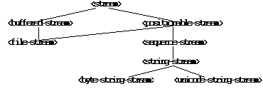

******************
The Streams Module
******************

Introduction
------------

This chapter describes the Streams module, which allows you to establish
and control input to and output from aggregates of data, such as files
on disk, or sequences. This module, together with the Standard-IO
module, provides similar functionality to the *Java.io* package in Java.
See ` <standard-io.htm#62747>`_, for details about the Standard-IO
module in Dylan.

`Concepts <streams.htm#16216>`_ discusses the basic concepts
involved in streaming over data. `Stream
classes <streams.htm#26950>`_ describes the different classes of stream
available, and how to create them, and `Reading from and writing to
streams <streams.htm#30984>`_ describes how to read from and write to
them.

More specialized subjects are covered next: `Locking
streams <streams.htm#38959>`_ discusses locking streams while they are
in use; `Using buffered streams <streams.htm#98716>`_ describes
using buffered streams; `Wrapper streams <streams.htm#17647>`_
describes wrapper streams; `Conditions <streams.htm#90823>`_ the
different stream-specific error conditions that can be raised.For the
most part, you do not have to worry about the information in these later
sections when using streams.

Finally, `The STREAMS module <streams.htm#65324>`_ gives complete
details on all interfaces in the Streams module. Each entry in this
section is arranged in alphabetical order.

Discussing error conditions
---------------------------

This chapter uses two special terms in discussions of error conditions.

When it notes that something *is an error*, this means that the result
is undefined. In particular, it does not*necessarily* mean that an error
condition will be signalled. So, for instance, the following example
text means only that the result of using *pull-stream-element* in the
case described is undefined:

It is an error to apply *pull-stream-element* to an element that has
already been read from the stream.

A given function is only guaranteed to raise an exception in response to
an error if the documentation for that function specifically states that
it will signal an error. Note that the specific error condition that is
signaled may depend on the program state; in such situations, the
specific error condition is not stated in the documentation. Consider
the following hypothetical example, which states that an implementation
must signal an error, but does not say what error must be signaled:

When *index* is a *<stream-index>*, if it is invalid for some reason,
this function signals an error.

By contrast, the following example names the class of which the
condition signaled is guaranteed to be a general instance:

If the end of the stream is encountered and no value was supplied for
*on-end-of-stream*, *read-last-element* signals an `
<end-of-stream-error> <streams.htm#44614>`_ condition.

If the name of the condition class is given, applications are permitted
to specialize error handlers on that class.

Goals of the module
-------------------

The Streams module provides:

-  A generic, easy-to-use interface for streaming over sequences and
   files. The same high-level interface for consuming or producing is
   available irrespective of the type of stream, or the types of the
   elements being streamed over.
-  Efficiency, especially for the common case of file I/O.
-  Access to an underlying buffer management protocol.

The Streams module does not address a number of related issues,
including:

-  A standard object-printing package such as Smalltalk’s *printOn:* or
   Lisp’s *print-object*, or a formatted printing facility such as
   Lisp’s *format*. These facilities are provided by the Print, Format,
   and Format-out libraries. For convenience, the Harlequin-Extensions
   library also provides simple formatting capabilities.
-  General object dumping and loading.
-  A comprehensive range of I/O facilities for using memory-mapped
   files, network connections, and so on.
-  An interface for naming files. The Locators module provides such an
   interface.
-  An interface to operating system functionality, such as file renaming
   or deleting operations. The File-System module provides such an
   interface.

Concepts
--------

A *stream* provides sequential access to an aggregate of data, such as a
Dylan sequence or a disk file. Streams grant this access according to a
metaphor of *reading* and *writing*: elements can be read from streams
or written to them.

Streams are represented as Dylan objects, and all are general instances
of the class `<stream> <streams.htm#97619>`_, which the Streams
module defines.

It is usual to say that a stream is established *over* the data
aggregate. Hence, a stream providing access to the string *"hello
world"* is said to be a stream over the string *"hello world"*.

Streams permitting reading operations are called *input* streams. Input
streams allow elements from the underlying data aggregate to be
consumed. Conversely, streams permitting writing operations are called
*output* streams. Output streams allow elements to be written to the
underlying data aggregate. Streams permitting both kinds of operations
are called *input-output* streams.

The Streams module provides a set of functions for reading elements from
an input stream. These functions hide the details of indexing,
buffering, and so on. For instance, the function `
read-element <streams.htm#52501>`_ reads a single data element from an
input stream.

The following expression binds *stream* to an input stream over the
string *"hello world"*:

let stream = make(<string-stream>, contents: "hello world");
                                                            

The first invocation of `read-element <streams.htm#52501>`_ on
*stream* returns the character “h”, the next invocation “e”, and so on.
Once a stream has been used to consume all the elements of the data, the
stream is said to be at its end. This condition can be tested with the
function `stream-at-end? <streams.htm#44998>`_. The following code
fragment applies *my-function* to all elements of the sequence:

let stream = make(<sequence-stream>, contents: seq);
                                                    

while (~stream-at-end?(stream))

my-function(read-element(stream));

end;
    

When all elements of a stream have been read, further calls to `
read-element <streams.htm#52501>`_ result in the `
<end-of-stream-error> <streams.htm#44614>`_ condition being signaled. An
alternative end-of-stream behavior is to have a distinguished
end-of-stream value returned. You can supply such an end-of-stream value
as a keyword argument to the various read functions; the value can be
any object. Supplying an end-of-stream value to a read function is more
concise than asking whether a stream is at its end on every iteration of
a loop.

The Streams module also provides a set of functions for writing data
elements to an output stream. Like the functions that operate upon input
streams, these functions hide the details of indexing, growing an
underlying sequence, buffering for a file, and so on. For instance, the
function `write-element <streams.htm#31863>`_ writes a single data
element to an output stream.

The following forms bind *stream* to an output stream over an empty
string and create the string “I see!”, using the function `
stream-contents <streams.htm#24606>`_ to access all of the stream’s
elements.

let stream = make(<byte-string-stream>, direction: #"output");
                                                              

write(stream, "I see!");

stream-contents(stream);
                        

Calling `write <streams.htm#80743>`_ on a sequence has the same
effect as calling `write-element <streams.htm#31863>`_ on all the
elements of the sequence. For more information about writing to streams,
see `Writing to streams <streams.htm#24150>`_.

Some streams are *positionable* ; that is, any element of the stream can
be accessed at any time. Positionable streams allow you to set the
position at which the stream is accessed by the next operation. The
following example uses positioning to return the character “w” from a
stream over the string *"hello world"*:

let stream = make(<string-stream>, contents: "hello world");
                                                            

stream-position(stream) := 6;

read-element(stream);
                     

The following example returns a string. The first ten characters are the
fill characters for the underlying sequence of the stream. The fill
character for *<string>* is “** “ (the space character), so in the
example below, the first ten characters are spaces.

let stream = make(<string-stream>, direction: #"output");
                                                         

adjust-stream-position(stream, 10);

write(stream, "whoa!");

stream-contents(stream);
                        

You can request a sequence containing all of the elements of a
positionable stream by calling `
stream-contents <streams.htm#24606>`_ on it. If the positionable stream
is a *<file-stream>*, then it must be readable. Otherwise, it must be a
sequence stream. The sequence returned never shares structure with any
underlying sequence that might be used in the future by the stream. For
instance, the string returned by calling `
stream-contents <streams.htm#24606>`_ on an output `
<string-stream> <streams.htm#31880>`_ will not be the same string as
that being used to represent the string stream.

When making an input `<string-stream> <streams.htm#31880>`_, you can
cause the stream to produce elements from any subsequence of the
supplied string. For example:

read-to-end(make(<string-stream>,
                                 

contents: "hello there, world",

start: 6,

end: 11));
          

This example evaluates to *"there"*. The interval (*start*, *end*)
includes the index *start* but excludes the index *end*. This is
consistent with standard Dylan functions over sequences, such as
*copy-sequence*. The `read-to-end <streams.htm#35461>`_ function is
one of a number of convenient utility functions for operating on streams
and returns all the elements up to the end of the stream from the
stream’s current position.

Streams, growing sequences, and object identity
^^^^^^^^^^^^^^^^^^^^^^^^^^^^^^^^^^^^^^^^^^^^^^^

When writing to output streams over sequences, Dylan may from time to
time need to grow the underlying sequence that it is using to represent
the stream data.

Consider the example of an output stream instantiated over an empty
string. As soon as a write operation is performed on the stream, it is
necessary to replace the string object used in the representation of the
string stream. As well as incurring the cost of creating a new string,
references to the string within the program after the replacement
operation has occurred will still refer to the *original* string, and
this may not be what the user intended.

To guarantee that other references to a sequence used in an output `
<sequence-stream> <streams.htm#41852>`_ will have access to any elements
written to the sequence via the stream, supply a stretchy collection
(such as a *<stretchy-vector>*) to *make*. A stream over a stretchy
vector will use the same stretchy vector throughout the stream’s
existence.

For example:

let sv = make(<stretchy-vector>);
                                 

let stream = make(<sequence-stream>,

contents: sv,

direction: #"output");
                      

write(stream,#(1, 2, 3, 4, 5, 6, 7, 8, 9));
                                           

write(stream,"ABCDEF");
                       

values(sv, stream-contents(stream));
                                    

The example returns two values. Each value is the same (*==*) stretchy
vector:

(1, 2, 3, 4, 5, 6, 7, 8, 9, ’A’, ’B’, ’C’, ’D’, ’E’, ’F’)
                                                         

If a stretchy vector is not supplied, the result is different:

let v = make(<vector>, size: 5);
                                

let stream = make(<sequence-stream>,
                                    

contents: v,

direction: #"output");
                      

write(stream,#(1, 2, 3, 4, 5, 6, 7, 8, 9));
                                           

write(stream,"ABCDEF");
                       

values(v, stream-contents(stream));
                                   

This example returns as its first value the original vector, whose
contents are unchanged, but the second value is a new vector:

(1, 2, 3, 4, 5, 6, 7, 8, 9, ’A’, ’B’, ’C’, ’D’, ’E’, ’F’)
                                                         

This difference arises because the output stream in the second example
does not use a stretchy vector to hold the stream data. A vector of at
least 15 elements is necessary to accommodate the elements written to
the stream, but the vector supplied, *v*, can hold only 5. Since the
stream cannot change *v* ’s size, it must allocate a new vector each
time it grows.

Stream classes
--------------

The exported streams class heterarchy includes the classes shown in `
Streams module classes. <streams.htm#49178>`_. Classes shown in bold are
all instantiable.

   Streams module classes.

<stream>
        

*Open abstract class*
                     

The superclass of all stream classes and a direct subclass of *<object>*
.

<positionable-stream>
                     

Open abstract class
                   

A subclass of `<stream> <streams.htm#97619>`_ supporting the
Positionable Stream Protocol.

<buffered-stream>
                 

Open abstract class
                   

A subclass of `<stream> <streams.htm#97619>`_ supporting the Stream
Extension Protocol and the Buffer Access Protocol.

Buffered streams support the *buffer-size:* init-keyword, which can be
used to suggest the size of the stream’s buffer. However, the
instantiated stream might not use this value: it is taken purely as a
suggested value.

<file-stream>
             

Open abstract instantiable class
                                

The class of single-buffered streams over disk files. The class supports
several init-keywords: *locator:*, *direction:*, *if-exists:*, and
*if-does-not-exist:*.

When you instantiate this class, an indirect instance of it is created.
The file being streamed over is opened immediately upon creating the
stream.

<sequence-stream>
                 

Open class
          

The class of streams over sequences. The class supports several
init-keywords: *contents:*, *direction:*, *start:*, and *end:*.

This class can be used for streaming over all sequences, but there are
also subclasses that are specialized for streaming over strings: see
`<string-stream> <streams.htm#31880>`_, `
<byte-string-stream> <streams.htm#57476>`_, and `
<unicode-string-stream> <streams.htm#75284>`_ for full details.

Creating streams
^^^^^^^^^^^^^^^^

This section describes how to create and manage different types of file
stream and sequence stream.

File streams
^^^^^^^^^^^^

File streams are intended only for accessing the contents of files. More
general file handling facilities, such as renaming, deleting, moving,
and parsing directory names, are provided by the File-System module: see
` <file-system.htm#46956>`_ for details. The make method on `
<file-stream> <streams.htm#43060>`_ does not create direct instances of
`<file-stream> <streams.htm#43060>`_, but instead an instance of a
subclass determined by `type-for-file-stream <streams.htm#47613>`_.

make *file-stream-class*
                        

G.f method
          

make <file-stream> #key locator: direction: if-exists:
 if-does-not-exist: buffer-size: element-type:
 asynchronous?: share-mode => *file-stream-instance*
                                                      

Creates and opens a stream over a file, and returns a new instance of a
concrete subclass of `<file-stream> <streams.htm#43060>`_ that
streams over the contents of the file referenced by *filename*. To
determine the concrete subclass to be instantiated, this method calls
the generic function `type-for-file-stream <streams.htm#47613>`_.

The *locator:* init-keyword should be a string naming a file. If the
Locators library is in use, *filename* should be an instance of
*<locator>* or a string that can be coerced to one.

The *direction:* init-keyword specifies the direction of the stream.
This can be one of *#"input"*, *#"output"*, or *#"input-output"*. The
default is *#"input"*.

The *if-exists:* and *if-does-not-exist:* init-keywords specify actions
to take if the file named by *filename* does or does not already exist
when the stream is created. These init-keywords are discussed in more
detail in `Options when creating file streams <streams.htm#76495>`_.

The *buffer-size:* init-keyword can be used to suggest the size of a
stream’s buffer. See `<buffered-stream> <streams.htm#48998>`_.

The *element-type:* init-keyword specifies the type of the elements in
the file named by *filename*. See `Options when creating file
streams <streams.htm#76495>`_ for more details.

Options when creating file streams
^^^^^^^^^^^^^^^^^^^^^^^^^^^^^^^^^^

When creating file streams, you can supply the following init-keywords
to *make* in addition to those described in `File
streams <streams.htm#55466>`_:

-  *if-exists:* An action to take if the file already exists.

*if-does-not-exist*:
                     

An action to take if the file does not already exist.
                                                     

-  *element-type:* How the elements of the underlying file are accessed.
-  *asynchronous?:* Allows asynchronous writing of stream data to disk.
-  *share-mode:* How the file can be accessed while the stream is
   operating on it.

The *if-exists:* init-keyword allows you to specify an action to take if
the file named by *filename* already exists. The options are:

-  *#f* The file is opened with the stream position at the beginning.
   This is the default when the stream’s direction is *#"input"* or
   *#"input-output"*.

*#"new-version"*
                

If the underlying file system supports file versioning, a new version of
the file is created. This is the default when the stream’s direction is
*#"output"*.
                                                                                                                                                              

If the file system does not support file versioning, the default is
*#"replace"* when the direction of the stream is *#"output"*.
                                                                                                                                  

-  *#"overwrite"* Set the stream’s position to the beginning of the
   file, but preserve the current contents of the file. This is useful
   when the direction is *#"input-output"* or *#"output"* and you want
   to overwrite an existing file.
-  *#"replace"* Delete the existing file and create a new file.
-  *#"append"* Set the stream’s initial position to the end of the
   existing file so that all new output occurs at the end of the file.
   This option is only useful if the file is writeable.
-  *#"truncate"* If the file exists, it is truncated, setting the size
   of the file to 0. If the file does not exist, create a new file.
-  *#"signal"* Signal a `<file-exists-error> <streams.htm#11082>`_
   condition.

The *if-does-not-exist:* init-keyword allows you to specify an action to
take if the file named by *filename* does not exist. The options are:

-  *#f* No action.
-  *#"signal"* ** Signal a `
   <file-does-not-exist-error> <streams.htm#89205>`_ condition. This is
   the default when the stream’s direction is *#"input"*.
-  *#"create"* Create a new zero-length file. This is the default when
   the stream’s direction is *#"output"* or *#"input-output"*.

Because creating a file stream *always* involves an attempt to open the
underlying file, the aforementioned error conditions will occur during
file stream instance initialization.

File permissions are checked when creating and opening file streams, and
if the user attempts to open a file for input, and has no read
permission, or to open a file for output, and has no write permission,
then an `<invalid-file-permissions-error> <streams.htm#32531>`_
condition is signalled at the time the file stream is created.

The *element-type:* init-keyword controls how the elements of the
underlying file are accessed. This allows file elements to be
represented abstractly; for instance, contiguous elements could be
treated as a single database record. The three possible element types
are:

`<byte-character> <streams.htm#56420>`_
                                           

The file is accessed as a sequence of 8-bit characters.
                                                       

`<unicode-character> <streams.htm#37656>`_
                                              

The file is accessed as a sequence of 16-bit Unicode characters.
                                                                

-  `<byte> <streams.htm#47677>`_ The file is accessed as a sequence
   of unsigned 8-bit integers.

The *asynchronous?:* init-keyword allows asynchronous writing of stream
data to disk. If *#f*, whenever the stream has to write a buffer to
disk, the thread which triggered the write must wait for the write to
complete. If *asynchronous?* is *#t*, the write proceeds in parallel
with the subsequent actions of the thread.

Note that asynchronous writes complicate error handling a bit. Any write
error which occurs most likely occurs after the call which triggered the
write. If this happens, the error is stored in a queue, and the next
operation on that stream signals the error. If you *close* the stream
with the *wait?* flag *#f*, the close happens asynchronously (after all
queued writes complete) and errors may occur after *close* has returned.
A method *wait-for-io-completion* is provided to catch any errors that
may occur after *close* is called.

The *share-mode:* keyword determines how a file can be accessed by other
streams while the stream has it open. The possible values are:

-  *#”share-read”* Allow other streams to be opened to the file for
   reading but not for writing.
-  *#”share-write”* Allow other streams to be opened for writing but not
   for reading.

*#”share-read-write”*
                     

Allow other streams to be opened for writing or reading.
                                                        

-  *#”exclusive”* Do not allow other streams to be opened to this file.

Sequence streams
^^^^^^^^^^^^^^^^

There are *make* methods on the following stream classes:

-  `<sequence-stream> <streams.htm#41852>`_
-  `<string-stream> <streams.htm#31880>`_
-  `<byte-string-stream> <streams.htm#57476>`_
-  `<unicode-string-stream> <streams.htm#75284>`_

Rather than creating direct instances of *<sequence-stream>* or
*<string-stream>*, the *make* methods for those classes might create an
instance of a subclass determined by `
type-for-sequence-stream <streams.htm#90813>`_.

make *sequence-stream-class*
                            

G.f. method
           

make <sequence-stream> #key contents direction start end
                                                        

=> *sequence-stream-instance*
                             

Creates and opens a stream over a sequence, and returns a general
instance of `<sequence-stream> <streams.htm#41852>`_. To determine
the concrete subclass to be instantiated, this method calls the generic
function `type-for-sequence-stream <streams.htm#90813>`_.

The *contents:* init-keyword is a general instance of *<sequence>* which
is used as the input for an input stream, and as the initial storage for
an output stream. If *contents* is a stretchy sequence (such as an
instance of *<stretchy-vector>*), then it is the only storage used by
the stream.

The *direction:* init-keyword specifies the direction of the stream. It
must be one of *#"input"*, *#"output"*, or *#"input-output"* ; the
default is *#"input"*.

The *start:* and *end:* init-keywords are only valid when *direction:*
is *#"input"*. They specify the portion of the sequence to create the
stream over: *start:* is inclusive and *end:* is exclusive. The default
is to stream over the entire sequence: *start:* is by default 0, and
*end:* is *contents.size*.

make *string-stream-class*
                          

G.f. method
           

make <string-stream> #key contents direction start end
                                                      

=> *string-stream-instance*
                           

Creates and opens a stream over a string, and returns an instance of
`<string-stream> <streams.htm#31880>`_.

If supplied, *contents:* must be an instance of *<string>*. The
*direction:*, *start:*, and *end:* init-keywords are as for *make* on
`<sequence-stream> <streams.htm#41852>`_.

make *byte-string-stream-class*
                               

G.f. method
           

make <byte-string-stream #key contents direction start end
                                                          

=> *byte-string-stream-instance*
                                

Creates and opens a stream over a byte string, and returns a new
instance of `<byte-string-stream> <streams.htm#57476>`_.

If supplied, *contents:* must be an instance of *<string>*. The
*direction:*, *start:*, and *end:* init-keywords are as for *make* on
`<sequence-stream> <streams.htm#41852>`_.

make *unicode-string-stream-class*
                                  

G.f. method
           

make <unicode-string-stream> #key contents direction start end
                                                              

=> *unicode-string-stream-instance*
                                   

Creates and opens a stream over a Unicode string, and returns a new
instance of `<unicode-string-stream> <streams.htm#75284>`_.

If supplied, *contents:* must be an instance of *<string>*. The
*direction:*, *start:*, and *end:* init-keywords are as for *make* on
`<sequence-stream> <streams.htm#41852>`_.

Closing streams
^^^^^^^^^^^^^^^

It is important to call *close* on streams when you have finished with
them. Typically, external streams such as *<file-stream>* and
*<console-stream>* allocate underlying system resources when they are
created, and these resources are not recovered until the stream is
closed. The total number of such streams that can be open at one time
may be system dependent. It may be possible to add reasonable
finalization methods to close streams when they are no longer referenced
but these are not added by default. See the *Core Features and
Mathematics* manual for full details about finalization.

Locking streams
^^^^^^^^^^^^^^^

In an application where more than one control thread may access a common
stream, it is important to match the granularity of locking to the
transaction model of the application. Ideally, an application should
lock a stream which is potentially accessed by multiple threads, only
once per transaction. Repeated and unnecessary locking and unlocking can
seriously degrade the performance of the Streams module. Thus an
application which wishes to write a complex message to a stream that
needs to be thread safe should lock the stream, write the message and
then unlock the stream after the entire message is written. Locking and
unlocking the stream for each character in the message would be a poor
match of locking to transaction model. The time required for the lock
manipulation would dominate the time required for the stream
transactions. Unfortunately this means that there is no way for the
Streams module to choose a default locking scheme without the likelihood
of seriously degrading streams performance for all applications whose
transaction models are different from the model implied by the chosen
default locking scheme. Instead, the Streams module provides the user
with a single, per instance slot, *stream-lock:*, which is inherited by
all subclasses of *<stream>*. You should use the generic functions
*stream-lock* and *stream-lock-setter*, together with other appropriate
functions and macros from the Threads library, to implement a locking
strategy appropriate to your application and its stream transaction
model. The functions in the Streams module are not of themselves thread
safe, and make no guarantees about the atomicity of read and write
operations.

stream-lock
           

Open generic function
                     

stream-lock *stream* => *lock*
                              

Returns the *lock* for the specified *stream*, or *#f* if no lock has
been set. The *lock* argument is of type *<lock>*.

stream-lock-setter
                  

Open generic function
                     

stream-lock-setter *stream lock* => *lock*
                                          

Sets the *lock* for the specified *stream*. The *lock* argument is of
type *<lock>*, or *#f*. If *lock* is *#f*, the lock for *stream* is
freed.

For full details on the *<lock>* class, see the documentation on the
Threads library in the *Core Features and Mathematics* manual.

Reading from and writing to streams
-----------------------------------

This section describes how you can read from or write to a stream. Note
that it is an error to call any of these functions on a buffered stream
while its buffer is held by another thread; see `Using buffered
streams <streams.htm#98716>`_ for details about buffered streams.

Reading from streams
^^^^^^^^^^^^^^^^^^^^

The following are the basic functions for reading from streams.

read-element
            

Open generic function
                     

read-element *input-stream* #key *on-end-of-stream* => *element-or-eof*
                                                                       

Returns the next element in *input-stream*. If the stream is not at its
end, the stream is advanced in preparation for a subsequent read
operation.

The *on-end-of-stream* keyword allows you to specify a value to be
returned if the stream is at its end. If this is not supplied, `
read-element <streams.htm#52501>`_ signals an `
<end-of-stream-error> <streams.htm#44614>`_ condition on reading the end
of the stream.

If no input is available and the stream is not at its end, `
read-element <streams.htm#52501>`_ waits until input becomes available.

See also `unread-element <streams.htm#49967>`_.

read
    

Open generic function
                     

read *input-stream* *n* #key *on-end-of-stream* => *sequence-or-eof*
                                                                    

Returns a sequence of the next *n* elements from *input-stream*.

The type of the sequence returned depends on the type of the stream’s
underlying aggregate. For instances of `
<sequence-stream> <streams.htm#41852>`_, the type of the result is given
by *type-for-copy* of the underlying aggregate. For instances of `
<file-stream> <streams.htm#43060>`_, the result is a vector that can
contain elements of the type returned by calling `
stream-element-type <streams.htm#86633>`_ on the stream.

The stream position is advanced so that the next call to any function
that reads from or writes to *input-stream* acts on the stream position
immediately following the last of the *n* elements read.

If the stream is not at its end, `read <streams.htm#43521>`_ waits
until input becomes available.

If the end of the stream is reached before all *n* elements have been
read, the behavior is as follows.

If *on-end-of-stream* was supplied, it is returned as the value of `
read <streams.htm#43521>`_.

If *on-end-of-stream* argument was not supplied, and at least one
element was read from the stream, then an `
<incomplete-read-error> <streams.htm#14263>`_ condition is signalled.
When signalling this condition, `read <streams.htm#43521>`_ supplies
two values: a sequence of the elements that were read successfully, and
*n*.

If *on-end-of-stream* was not supplied, and no elements were read from
the stream, an `<end-of-stream-error> <streams.htm#44614>`_
condition is signalled.

The second of these is in some sense the most general behavior, in that
the first and third cases could, in principle, be duplicated by using
the second case, handling the signalled *<incomplete-read-error>*, and
returning appropriate results.

A number of other functions are available for reading from streams. See
`peek <streams.htm#78157>`_, `read-into! <streams.htm#88110>`_,
`discard-input <streams.htm#40817>`_, and `
stream-input-available? <streams.htm#32951>`_.

Convenience functions for reading from streams
^^^^^^^^^^^^^^^^^^^^^^^^^^^^^^^^^^^^^^^^^^^^^^

The following is a small set of reading functions that search for
particular elements in a stream. These functions behave as though they
were implemented in terms of the more primitive functions described in
`Reading from streams <streams.htm#63626>`_.

read-to
       

Function
        

read-to *input-stream* *element* #key *on-end-of-stream* *test*
                                                               

=> *sequence-or-eof* *found?*
                             

Returns a new sequence containing the elements of *input-stream* from
the stream’s current position to the first occurrence of *element*, but
not *element* itself.

*found?* is *#t* if the read terminated with *element*, or *#f* if the
read terminated by reaching the end of the stream’s source. The stream
is left positioned after *element*.

See also `read-through <streams.htm#17090>`_.

read-to-end
           

Function
        

read-to-end *input-stream* => *sequence*
                                        

Returns a sequence of all the elements up to, and including, the last
element of *input-stream*, starting from the stream’s current position.

skip-through
            

Function
        

skip-through *input-stream* *element* #key *test* => *found?*
                                                             

Positions *input-stream* after the first occurrence of *element*,**
starting from the stream’s current position. Returns *#t* if the element
was found, or *#f* if the end of the stream was encountered. When `
skip-through <streams.htm#94944>`_ does not find the *element*, it
leaves *input-stream* positioned at the end of the stream.

Writing to streams
^^^^^^^^^^^^^^^^^^

This section describes the basic functions for writing to streams.

write-element
             

Open generic function
                     

write-element *output-stream* *element* => ()
                                             

Writes *element* to *output-stream* at the stream’s current position. It
is an error if the type of *element* is inappropriate for the stream’s
underlying aggregate.

If the stream is positionable, and it is not positioned at its end, `
write-element <streams.htm#31863>`_ overwrites the element at the
current position and then advance the stream position.

write
     

Open generic function
                     

write *output-stream* *sequence* #key *start* *end* => ()
                                                         

Writes the elements of *sequence* to *output-stream*, starting at the
stream’s current position.

If supplied, *start* and *end* delimit the portion of *sequence* to
write to the stream. The value of *start* is inclusive and that of *end*
is exclusive. If *start* and *end* are not supplied, the whole sequence
is written.

For positionable streams, if the initial position of the stream is such
that writing *sequence* will flow past the current end of the stream,
then the stream is extended to accommodate the extra elements. Once the
write operation has finished, the stream is positioned one place past
the last element written.

See `force-output <streams.htm#76938>`_, `
synchronize-output <streams.htm#80064>`_, and `
discard-output <streams.htm#62260>`_.

Reading and writing by lines
^^^^^^^^^^^^^^^^^^^^^^^^^^^^

The following functions provide line-based input and output operations.

The newline sequence for string streams is a sequence comprising the
single newline character *\\n*. For character file streams, the newline
sequence is whatever sequence of characters the underlying platform uses
to represent a newline. For example, on MS-DOS platforms, the sequence
comprises two characters: a carriage return followed by a linefeed.

*Note:* No other functions in the Streams module do anything to manage
the encoding of newlines; calling `
write-element <streams.htm#31863>`_ on the character *\\n* does not
cause the *\\n* character to be written as the native newline sequence,
unless *\\n* happens to *be* the native newline sequence.

read-line
         

Open generic function
                     

read-line *input-stream* #key *on-end-of-stream* => *string-or-eof*
*newline?*
                                                                              

Returns a newly allocated *<string>* containing all the input in
*input-stream* up to the next newline. The string does not contain the
newline itself.

*newline?* is *#t* if the read terminated with a newline or *#f* if the
read terminated because it came to the end of the stream.

The type of the result string is chosen so that the string can contain
characters of *input-stream* ’s element type. For example, if the
element type is `<byte-character> <streams.htm#56420>`_, the string
will be a *<byte-string>*.

write-line
          

Open generic function
                     

write-line *output-stream* *string* #key *start* *end* => ()
                                                            

Writes *string* followed by a newline sequence to *output-stream*.

The default method behaves as though it calls `
write <streams.htm#80743>`_ on *string* and then calls `
new-line <streams.htm#47641>`_, with *output-stream* locked across both
calls.

If supplied, *start* and *end* delimit the portion of *string* to write
to the stream. They default to 0 and *string* *.size* respectively.

new-line
        

Open generic function
                     

new-line *output-stream* => ()
                              

Writes a newline sequence to *output-stream*.

A method for `new-line <streams.htm#47641>`_ is defined on `
<string-stream> <streams.htm#31880>`_ that writes the character *\\n* to
the string stream.

See also `read-line-into! <streams.htm#19940>`_.

Querying streams
^^^^^^^^^^^^^^^^

The following functions can be used to determine various properties of a
stream.

stream-open?
            

Open generic function
                     

stream-open? *stream* => *open?*
                                

Returns *#f* if the stream has been closed, and *#t* otherwise. Note
that an input stream which is at its end, but has not been closed, is
still open and *stream-open?* will return #t.

stream-element-type
                   

Open generic function
                     

stream-element-type *stream* => *element-type*
                                              

Returns the element type of *stream* as a Dylan *<type>*.

stream-at-end?
              

Open generic function
                     

stream-at-end? *stream* => *boolean*
                                    

Returns *#t* if the stream is at its end and *#f* if it is not. For
input streams, it returns *#t* if a call to `
read-element <streams.htm#52501>`_ with no supplied keyword arguments
would signal an `<end-of-stream-error> <streams.htm#44614>`_. For
output streams, this function always returns *#f*.

For output streams, note that you can determine if a stream is one place
past the last written element by comparing `
stream-position <streams.htm#85690>`_ to `
stream-size <streams.htm#32694>`_.

Using file streams
^^^^^^^^^^^^^^^^^^

The following operations can be performed on file streams.

close
     

G.f. method
           

close *file-stream* #key *abort* *wait?* => ()
                                              

Closes a file stream. If the stream is asynchronous and *wait?* is false
(its default value is *#t*), then a close request is merely enqueued to
be performed after all pending write operations; otherwise the file is
closed immediately and all underlying system resources held on behalf of
the stream are freed.

If *abort?*. is false (the default) all buffered data is written before
closing; if *abort?* false, this data is discarded.

If *synchronize?* (default value *#f*) is true, the file is flushed to
the physical disk before closing — this guarantees that no data is
retained in the operating system’s write cache. Calling *close* with
*synchronize?* *#t* is equivalent to calling *force-output* with
*synchronize?* true and then calling *close*.

wait-for-io-completion
                      

Statement macro
               

wait-for-io-completion *file-stream* => ()
                                          

If *file-stream* is asynchronous, waits for all pending *write* or
*close* operations to complete and signals any queued errors. If
*file-stream* is not asynchronous, returns immediately.

with-open-file
              

Statement macro
               

with-open-file (*stream-var* = *filename*, #rest *keys*) *body* end =>
*values*
                                                                                 

This macro provides a safe mechanism for working with file streams. It
creates a file stream and binds it to *stream-var*, evaluates a *body*
of code within the context of this binding, and then closes the stream.
The macro calls `close <streams.htm#30019>`_ upon exiting *body*.

The values of the last expression in *body* are returned.

The *keys* are passed to the *make* method on `
<file-stream> <streams.htm#43060>`_.

For example, the following expression yields the contents of file
*foo.text* as a `<byte-vector> <streams.htm#46456>`_:

with-open-file (fs = "foo.text", element-type: <byte>)
                                                      

read-to-end(fs)

end;
    

It is roughly equivalent to:

begin
     

let hidden-fs = #f; // In case the user bashes fs variable

block ()

hidden-fs := make(<file-stream>,

locator: "foo.text", element-type: <byte>);

let fs = hidden-fs;

read-to-end(fs);

cleanup

if (hidden-fs) close(hidden-fs) end;

end block;

end;
    

Using buffered streams
----------------------

The Streams module provides efficient support for general use of
buffered I/O. Most ordinary programmers using the module do not need to
be concerned with buffering in most cases. When using buffered streams,
the buffering is transparent, but programs requiring more control can
access buffering functionality when appropriate. This section describes
the available buffering functionality.

Overview
^^^^^^^^

A buffered stream maintains some sort of buffer. All buffered streams
use the sealed class `<buffer> <streams.htm#77969>`_ for their
buffers. You can suggest a buffer size when creating buffered streams,
but normally you do not need to do so, because a buffer size that is
appropriate for the stream’s source or destination is chosen for you.

Instances of the class `<buffer> <streams.htm#77969>`_ also contain
some state information. This state information includes an index where
reading or writing should begin, and an index that is the end of input
to be read, or the end of space available for writing.

Buffered streams also maintain a *held* state, indicating whether the
application has taken the buffer for a stream and has not released it
yet. When a thread already holds the buffer for a stream, it is an error
to get the buffer again (or any other buffer for the same stream).

Useful types when using buffers
^^^^^^^^^^^^^^^^^^^^^^^^^^^^^^^

The following types are used in operations that involve buffers.

<byte>
      

Type
    

A type representing limited integers in the range 0 to 255 inclusive.

<byte-character>
                

Type
    

A type representing 8-bit characters that instances of *<byte-string>*
can contain.

<unicode-character>
                   

Type
    

A type representing Unicode characters that instances of
*<unicode-string>* can contain.

<byte-vector>
             

Type
    

A subtype of *<vector>* whose element-type is `
<byte> <streams.htm#47677>`_.

Wrapper streams
---------------

Sometimes stream data requires conversion before an application can use
it: you might have a stream over a file of EBCDIC characters which you
would prefer to handle as their ASCII equivalents, or you might need to
encrypt or decrypt file data.

Wrapper streams provide a mechanism for working with streams which
require such conversion. Wrapper streams hold on to an underlying
stream, delegating to it most streams operations. The wrapper stream
carries out appropriate processing in its own implementations of the
streaming protocol.

The Streams module includes a base class called `
<wrapper-stream> <streams.htm#54696>`_ upon which other wrapping streams
can be implemented.

A subclass of `<wrapper-stream> <streams.htm#54696>`_ can “pass on”
functions such as
 `read-element <streams.htm#52501>`_ and `
write-element <streams.htm#31863>`_ by simply delegating these
operations to the inner stream, as shown below:

define method read-element (ws :: <io-wrapper-stream>,
                                                      

#key on-end-of-stream)

=> (element)

read-element(ws.inner-stream,

on-end-of-stream: on-end-of-stream)

end method;
           

define method write-element (ws :: <io-wrapper-stream>, element)
                                                                

=> ()

write-element(ws.inner-stream, element)

end method;
           

Assuming that *<io-wrapper-stream>* delegates all other operations to
its inner stream, the following would suffice to implement a 16-bit
Unicode character stream wrapping an 8-bit character stream.

define class <unicode-stream> (<io-wrapper-stream>) end class;
                                                              

define method read-element (s :: <unicode-stream>,
                                                  

#key on-end-of-stream)

=> (ch :: <unicode-character>)

with-stream-locked (s)

let first-char = read-element(s.inner-stream,

on-end-of-stream);

let second-char = read-element(s.inner-stream,

on-end-of-stream)

end;

convert-byte-pair-to-unicode(first-char, second-char)

end method;
           

define method write-element (s :: <unicode-stream>,
                                                   

c :: <character>)

=> ()

let (first-char, second-char) =

convert-unicode-to-byte-pair(c);

with-stream-locked (s)

write-element(s.inner-stream, first-char);

write-element(s.inner-stream, second-char)

end;

c

end method;
           

define method stream-position (s :: <unicode-stream>)
                                                     

=> p :: <integer>;

truncate/(stream-position(s.inner-stream), 2)

end method;
           

define method stream-position-setter (p :: <integer>,
                                                     

s :: <unicode-stream>);

stream-position(s.inner-stream) := p \* 2

end method;
           

Wrapper streams and delegation
^^^^^^^^^^^^^^^^^^^^^^^^^^^^^^

One problem with wrapper streams is the need for a wrapper stream to
intercept methods invoked by its inner stream. For example, consider two
hypothetical streams, *<interactive-stream>* and *<dialog-stream>*, the
latter a subclass of `<wrapper-stream> <streams.htm#54696>`_. Both
of these classes have a method called *prompt*. The
*<interactive-stream>* class specializes `read <streams.htm#43521>`_
thus:

define method read (s :: <interactive-stream>,
                                              

n :: <integer>,

#key on-end-of-stream);

prompt(s);

next-method()

end method;
           

If a *<dialog-stream>* ** is used to wrap an *<interactive-stream>* then
an invocation of `read <streams.htm#43521>`_ on the
*<dialog-stream>* will call *prompt* on the inner
 *<interactive-stream>*, not on the *<dialog-stream>*, as desired. The
problem is that the *<dialog-stream>* delegates some tasks to its inner
stream, but handles some other tasks itself.

Delegation by inner-streams to outer-streams is implemented by the use
of the `outer-stream <streams.htm#37941>`_ function. The `
outer-stream <streams.htm#37941>`_ function is used instead of the
stream itself whenever a stream invokes one of its other protocol
methods.

A correct implementation of the `read <streams.htm#43521>`_ method
in the example above would be as follows:

define method read (stream :: <interactive-stream>,
                                                   

n :: <integer>,

#key on-end-of-stream)

prompt(s.outer-stream);

next-method()

end method;
           

The *initialize* method on `<stream> <streams.htm#97619>`_ is
defined to set the `outer-stream <streams.htm#37941>`_ slot to be
the stream itself. The *initialize* method on `
<wrapper-stream> <streams.htm#54696>`_ is specialized to set the `
outer-stream <streams.htm#37941>`_ slot to be the “parent” stream:

define method initialize (stream :: <wrapper-stream>,
                                                     

#key on, #rest all-keys);

an-inner-stream.outer-stream := stream;

next-method()

end method;

Conditions
----------

The following classes are available for error conditions on streams.
                                                                    

`<end-of-stream-error> <streams.htm#44614>`_
                                                

`<incomplete-read-error> <streams.htm#14263>`_

`<file-error> <streams.htm#31958>`_

`<file-exists-error> <streams.htm#11082>`_

`<file-does-not-exist-error> <streams.htm#89205>`_

`<invalid-file-permissions-error> <streams.htm#32531>`_
                                                           

There is no recovery protocol defined for any of these errors. Every
condition that takes an init-keyword has a slot accessor for the value
supplied. The name of this accessor function takes the form *class* *-*
*key*, where *class* is the name of the condition class (without the
angle brackets) and *key* is the name of the init-keyword. For example,
the accessor function for the *locator:* init-keyword for `
<file-error> <streams.htm#31958>`_ is *file-error-locator*.

For more information, please refer to the reference entry for the
individual conditions.

Streams protocols
-----------------

This section describes the protocols for different classes of stream.

Positionable stream protocol
^^^^^^^^^^^^^^^^^^^^^^^^^^^^

This section describes the protocol for positionable streams.

A stream position can be thought of as a natural number that indicates
how many elements into the stream the stream’s current location is.
However, it is not always the case that a single integer contains enough
information to reposition a stream. Consider the case of an
“uncompressing” file stream that requires additional state beyond simply
the file position to be able to get the next input character from the
compressed file.

The Streams module addresses this problem by introducing the class `
<stream-position> <streams.htm#39170>`_, which is subclassed by various
kinds of stream implementations that need to maintain additional state.
A stream can be repositioned as efficiently as possible when `
stream-position-setter <streams.htm#28551>`_ is given a value previously
returned by `stream-position <streams.htm#85690>`_ on that stream.

It is also legal to set the position of a stream to an integer position.
However, for some types of streams, to do so might be slow, perhaps
requiring the entire contents of the stream up to that point to be read.

<position-type>
               

Type
    

type-union(<stream-position>, <integer>)
                                        

A type used to represent a position in a stream. In practice, positions
within a stream are defined as instances of *<integer>*, but this type,
together with the *<stream-position>* class, allows for cases where this
might not be possible.

<stream-position>
                 

Abstract class
              

A direct subclass of *<object>*. It is used in rare cases to represent
positions within streams that cannot be represented as instances of
*<integer>*, such as a stream that supports compression.

stream-position
               

Open generic function
                     

stream-position *positionable-stream* => *position*
                                                   

Returns the current position of *positionable-stream* for reading or
writing.

stream-position-setter
                      

Open generic function
                     

stream-position-setter *position* *positionable-stream* =>
*new-position*
                                                                         

Changes the stream’s position to *position*, for reading or writing.

The following are all possible values of *position*: an integer between
0 and *positionable-stream* *.stream-size*, a valid `
<stream-position> <streams.htm#39170>`_, *#"start"*, or *#"end"*.

*Note:* You cannot use *stream-position-setter* to set the position past
the current last element of the stream: use `
adjust-stream-position <streams.htm#46888>`_ instead.

adjust-stream-position
                      

Open generic function
                     

adjust-stream-position *positionable-stream* *delta* #key *from*
 => *new-position*
                                                                

Moves the position of *positionable-stream* to be offset *delta*
elements from the position indicated by *from*. The new position is
returned. The *delta* offset must be an instance of *<integer>*.

The value of *from* can be one of the symbols *#"current"*, *#"start"*,
and *#"end"*. The default is *#"current"*.

Using `adjust-stream-position <streams.htm#46888>`_ to set the
position of a stream to be beyond its current last element grows the
underlying aggregate to a new size.

as
  

G.f. method
           

as *integer-class* *stream-position* => *integer*
                                                 

Coerces a `<stream-position> <streams.htm#39170>`_ to an integer.
The *integer-class* argument is the class *<integer>*.

stream-size
           

Open generic function
                     

stream-size *positionable-stream* => *size*
                                           

Returns the number of elements in *positionable-stream*.

For input streams, this is the number of elements that were available
when the stream was created. It is unaffected by any read operations
that might have been performed on the stream.

For output and input-output streams, this is the number of elements that
were available when the stream was created (just as with input streams),
added to the number of elements written past the end of the stream
(regardless of any repositioning operations).

stream-contents
               

Open generic function
                     

stream-contents *positionable-stream* #key *clear-contents?* =>
*sequence*
                                                                          

Returns a sequence that contains all of *positionable-stream* ’s
elements from its start to its end, regardless of its current position.
The type of the returned sequence is as for `
read <streams.htm#43521>`_. See page `read <streams.htm#43668>`_.

The *clear-contents?* argument only applies to writeable sequence
streams. If clear-contents? is *#t* (the default for streams to which it
is applicable), this function sets the size of the stream to zero, and
the position to the stream’s start. Thus the next call to `
stream-contents <streams.htm#24606>`_ will return only the elements
written after the previous call to `
stream-contents <streams.htm#24606>`_. The *clear-contents?* argument is
not defined for file streams, or any other external stream. It is also
an error to apply it to input-only streams.

*Note:* You must use `read-to-end <streams.htm#35461>`_ for input
streams.

unread-element
              

Open generic function
                     

unread-element *positionable-stream* *element* => *element*
                                                           

Returns *element* to *positionable-stream* so that the next call to
 `read-element <streams.htm#52501>`_ returns *element*. It is an
error if *element* was not the last element read from the stream. You
may not call *unread-element* more than once without an intervening read
operation (that is, you cannot unread more than one element at a time).

Wrapper stream protocol
^^^^^^^^^^^^^^^^^^^^^^^

This section describes the protocol for implementing wrapper streams.
For information on using wrapper streams, see `Wrapper
streams <streams.htm#17647>`_.

<wrapper-stream>
                

Open instantiable class
                       

The class that implements the basic wrapper-stream functionality. A
required init-keyword, *inner-stream:*, specifies the wrapped stream.

inner-stream
            

Open generic function
                     

inner-stream *wrapper-stream* => *wrapped-stream*
                                                 

Returns the stream wrapped by *wrapper-stream*.

inner-stream-setter
                   

Open generic function
                     

inner-stream-setter *stream* *wrapper-stream* => *stream*
                                                         

Wraps *stream* with *wrapper-stream*. It does so by setting the `
inner-stream <streams.htm#61882>`_ slot of *wrapper-stream* to *stream*,
and the `outer-stream <streams.htm#37941>`_ slot of *stream* to
*wrapper-stream*.

outer-stream
            

Open generic function
                     

outer-stream *stream* => *wrapping-stream*
                                          

Returns the stream that is wrapping *stream*.

outer-stream-setter
                   

Open generic function
                     

outer-stream-setter *wrapper-stream* *stream* => *wrapper-stream*
                                                                 

Sets the *outer-stream* slot of *stream* to *wrapper-stream*.

The STREAMS module
------------------

This section includes complete reference entries for all interfaces that
are exported from the *streams* module.

adjust-stream-position
~~~~~~~~~~~~~~~~~~~~~~

Open generic function
'''''''''''''''''''''

Summary
       

Moves the position of a positionable stream by a specified amount.

Signature
         

adjust-stream-position *positionable-stream* *delta* #key *from* =>
*new-position*

Arguments
         

*positionable-stream*
                     

An instance of `<positionable-stream> <streams.htm#65194>`_.
                                                                

-  *delta* An instance of *<integer>*.
-  *from* One of *#"current"*, *#"start"*, or *#"end"*. Default
   value: *#"current"*.

Values
      

-  *new-position* An instance of `
   <stream-position> <streams.htm#39170>`_.

Description
           

Moves the position of *positionable-stream* to be offset *delta*
elements from the position indicated by *from*. The new position is
returned.

When *from* is *#"start"*, the stream is positioned relative to the
beginning of the stream. When *from* is *#"end"*, the stream is
positioned relative to its end. When *from* is *#"current"*, the
current position is used.

Using *adjust-stream-position* to set the position of a stream to be
beyond its current last element causes the underlying aggregate to be
grown to a new size. When extending the underlying aggregate for a
stream, the contents of the unwritten elements are the fill character
for the underlying sequence.

Example
       

The following example returns a string, the first ten characters of
which are the space character, which is the fill character for the
sequence *<string>*.

let stream = make(<string-stream>,
                                  

direction: #"output");

adjust-stream-position(stream, 10);

write(stream, "whoa!");

stream-contents(stream);
                        

See also
        

`stream-position-setter <streams.htm#50877>`_

as
~~

G.f. method
'''''''''''

Summary
       

Coerces a `<stream-position> <streams.htm#39170>`_ to an integer.

Signature
         

as *integer-class* *stream-position* => *integer*

Arguments
         

-  *integer-class* The class *<integer>*.
-  *stream-position* An instance of `
   <stream-position> <streams.htm#39170>`_.

Values
      

-  *integer* An instance of *<integer>*.

Description
           

Coerces a `<stream-position> <streams.htm#39170>`_ to an integer.
The *integer-class* argument is the class *<integer>*.

See also
        

`as <streams.htm#88550>`_

<buffer>
~~~~~~~~

Sealed instantiable class
'''''''''''''''''''''''''

Summary
       

A subclass of *<vector>* whose *element-type* is `
<byte> <streams.htm#47677>`_.

Superclasses
            

*<vector>*

Init-keywords
             

-  *size:* An instance of *<integer>* specifying the size of the buffer.
   Default value: 0.
-  *next:* An instance of *<integer>*. For an input buffer, this is
   where the next input byte can be found. For an output buffer, this is
   where the next output byte should be written to. Default value: 0.
-  *end:* An instance of *<integer>*. The value of this is one more
   than the last valid index in a buffer. For an input buffer, this
   represents the number of bytes read.

Description
           

A subclass of *<vector>* whose *element-type* is `
<byte> <streams.htm#47677>`_.

Instances of `<buffer> <streams.htm#77969>`_ contain a data vector
and two indices: the inclusive start and the exclusive end of valid data
in the buffer. The accessors for these indexes are called *buffer-next*
and *buffer-end*.

Note that *size:* is not taken as a suggestion of the size the user
would like, as with the value passed with *buffer-size:* to *make* on
`<buffered-stream> <streams.htm#48998>`_; if you supply a value with
the *size:* init-keyword, that size is allocated, or, if that is not
possible, an error is signalled, as with making any vector.

** <buffered-stream>
~~~~~~~~~~~~~~~~~~~~

Open abstract class
'''''''''''''''''''

Summary
       

A subclass of `<stream> <streams.htm#97619>`_ supporting the Stream
Extension and Buffer Access protocols.

Superclasses
            

`<stream> <streams.htm#97619>`_

Init-keywords
             

-  *buffer-size:* An instance of *<integer>*. This is the size of the
   buffer in bytes.

Description
           

A subclass of `<stream> <streams.htm#97619>`_ supporting the Stream
Extension Protocol and the Buffer Access Protocol. It is not
instantiable.

Streams of this class support the *buffer-size:* init-keyword, which can
be used to suggest the size of the stream’s buffer. However, the
instantiated stream might not use this value: it is taken purely as a
suggested value. For example, a stream that uses a specific device’s
hardware buffer might use a fixed buffer size regardless of the value
passed with the *buffer-size:* init-keyword.

In general, it should not be necessary to supply a value for the
*buffer-size:* init-keyword.

<byte>
~~~~~~

Type
''''

Summary
       

A type representing limited integers in the range 0 to 255 inclusive.

Supertypes
          

*<integer>*

Init-keywords
             

None.

Description
           

A type representing limited integers in the range 0 to 255 inclusive.

Operations
          

`type-for-file-stream <streams.htm#47613>`_

<byte-character>
~~~~~~~~~~~~~~~~

Type
''''

Summary
       

A type representing 8-bit characters that instances of *<byte-string>*
can contain.

Supertypes
          

*<character>*

Init-keywords
             

None.

Description
           

A type representing 8-bit characters that instances of *<byte-string>*
can contain.

Operations
          

`type-for-file-stream <streams.htm#47613>`_

<byte-string-stream>
~~~~~~~~~~~~~~~~~~~~

Open instantiable class
'''''''''''''''''''''''

Summary
       

The class of streams over byte strings.

Superclasses
            

`<string-stream> <streams.htm#31880>`_

Init-keywords
             

-  *contents:* A general instance of *<sequence>*.
-  *direction:* Specifies the direction of the stream. It must be one of
   *#"input"*, *#"output"*, or *#"input-output"*. Default value:
   *#"input"*.
-  *start:* An instance of *<integer>*. This specifies the start
   position of the byte string to be streamed over. Only valid when
   *direction:* is *#"input"*. Default value: 0.
-  *end:* An instance of *<integer>*. This specifies the sequence
   position immediately after the portion of the byte string to stream
   over. Only valid when *direction:* is *#"input"*. Default value:
   *contents.size*.

Description
           

The class of streams over byte strings. It is a subclass of *`
<string-stream> <streams.htm#31880>`_*.

The class supports the same init-keywords as `
<sequence-stream> <streams.htm#41852>`_.

The *contents:* init-keyword is used as the input for an input stream,
and as the initial storage for an output stream.

The *start:* and *end:* init-keywords specify the portion of the byte
string to create the stream over: *start:* is inclusive and *end:* is
exclusive. The default is to stream over the entire byte string.

Operations
          

`make byte-string-stream-class <streams.htm#56293>`_

See also
        

`make byte-string-stream-class <streams.htm#56293>`_

`<sequence-stream> <streams.htm#41852>`_

<byte-vector>
~~~~~~~~~~~~~

Sealed class
''''''''''''

Summary
       

A subtype of *<vector>* whose element-type is `
<byte> <streams.htm#47677>`_.

Superclasses
            

*<vector>*

Init-keywords
             

See Superclasses.

Description
           

A subclass of *<vector>* whose element-type is `
<byte> <streams.htm#47677>`_.

Operations
          

None.

See also
        

`<byte> <streams.htm#47677>`_

close
~~~~~

Open generic function
'''''''''''''''''''''

Summary
       

Closes a stream.

Signature
         

close *stream* #key #all-keys => ()

Arguments
         

-  *stream* An instance of `<stream> <streams.htm#97619>`_.

Values
      

None.

Description
           

-  Closes *stream*, an instance of `<stream> <streams.htm#97619>`_.

close
~~~~~

G.f. method
'''''''''''

Summary
       

Closes a file stream.

Signature
         

close *file-stream* #key *abort?* *wait?* => ()

Arguments
         

-  *file-stream* An instance of `
   <file-stream> <streams.htm#43060>`_.
-  *abort?* An instance of *<boolean>*. Default value: *#f*.
-  *wait?* An instance of *<boolean>*.

Values
      

None.

Description
           

Closes a file stream. This method frees whatever it can of any
underlying system resources held on behalf of the stream.

If *abort* is false, any pending data is forced out and synchronized
with the file’s destination. If *abort* is true, then any errors caused
by closing the file are ignored.

discard-input
~~~~~~~~~~~~~

Open generic function
'''''''''''''''''''''

Summary
       

Discards input from an input stream.

Signature
         

discard-input *input-stream* => ()

Arguments
         

-  *input-stream* An instance of `<stream> <streams.htm#97619>`_.

Values
      

-  None.

Description
           

Discards any pending input from *input-stream*, both buffered input
and, if possible, any input that might be at the stream’s source.

This operation is principally useful for “interactive” streams, such as
TTY streams, to discard unwanted input after an error condition arises.
There is a default method on `<stream> <streams.htm#97619>`_ so that
applications can call this function on any kind of stream. The default
method does nothing.

See also
        

`discard-output <streams.htm#62260>`_

discard-output
~~~~~~~~~~~~~~

Open generic function
'''''''''''''''''''''

Summary
       

Discards output to an output stream.

Signature
         

discard-output *output-stream* => ()

Arguments
         

-  *output-stream* An instance of `<stream> <streams.htm#97619>`_.

Values
      

-  None.

Description
           

Attempts to abort any pending output for *output-stream*.

A default method on `<stream> <streams.htm#97619>`_ is defined, so
that applications can call this function on any sort of stream. The
default method does nothing.

See also
        

`discard-input <streams.htm#40817>`_

<end-of-stream-error>
~~~~~~~~~~~~~~~~~~~~~

Error
'''''

Summary
       

Error type signaled on reaching the end of an input stream.

Superclasses
            

*<error>*

Init-keywords
             

-  *stream:* An instance of `<stream> <streams.htm#97619>`_.

Description
           

Signalled when one of the read functions reaches the end of an input
stream. It is a subclass of *<error>*.

The *stream:* init-keyword has the value of the stream that caused the
error to be signaled. Its accessor is *end-of-stream-error-stream*.

Operations
          

None.

See also
        

`<file-does-not-exist-error> <streams.htm#89205>`_

`<file-error> <streams.htm#31958>`_

`<file-exists-error> <streams.htm#11082>`_

`<incomplete-read-error> <streams.htm#14263>`_

`<invalid-file-permissions-error> <streams.htm#32531>`_

<file-does-not-exist-error>
~~~~~~~~~~~~~~~~~~~~~~~~~~~

Error
'''''

Summary
       

Error type signaled when attempting to read a file that does not exist.

Superclasses
            

`<file-error> <streams.htm#31958>`_

Init-keywords
             

-  See Superclasses.

Description
           

Signaled when an input file stream creation function tries to read a
file that does not exist. It is a subclass of `
<file-error> <streams.htm#31958>`_.

Operations
          

None.

See also
        

`<end-of-stream-error> <streams.htm#44614>`_

`<file-error> <streams.htm#31958>`_

`<file-exists-error> <streams.htm#11082>`_

`<incomplete-read-error> <streams.htm#14263>`_

`<invalid-file-permissions-error> <streams.htm#32531>`_

<file-error>
~~~~~~~~~~~~

Error
'''''

Summary
       

The base class for all errors related to file I/O.

Superclasses
            

*<error>*

Init-keywords
             

-  *locator:* An instance of *<locator>*.

Description
           

The base class for all errors related to file I/O. It is a subclass of
*<error>*.

The *locator:* init-keyword indicates the locator of the file that
caused the error to be signalled. Its accessor is *file-error-locator*.

Operations
          

None.

See also
        

`<end-of-stream-error> <streams.htm#44614>`_

`<file-does-not-exist-error> <streams.htm#89205>`_

`<file-exists-error> <streams.htm#11082>`_

`<incomplete-read-error> <streams.htm#14263>`_

`<invalid-file-permissions-error> <streams.htm#32531>`_

<file-exists-error>
~~~~~~~~~~~~~~~~~~~

Error
'''''

Summary
       

Error type signaled when trying to create a file that already exists.

Superclasses
            

`<file-error> <streams.htm#31958>`_

Init-keywords
             

-  See Superclasses.

Description
           

Signalled when an output file stream creation function tries to create a
file that already exists. It is a subclass of `
<file-error> <streams.htm#31958>`_.

Operations
          

None.

See also
        

`<end-of-stream-error> <streams.htm#44614>`_

`<file-does-not-exist-error> <streams.htm#89205>`_

`<file-error> <streams.htm#31958>`_

`<incomplete-read-error> <streams.htm#14263>`_

`<invalid-file-permissions-error> <streams.htm#32531>`_

<file-stream>
~~~~~~~~~~~~~

Open abstract instantiable class
''''''''''''''''''''''''''''''''

Summary
       

The class of single-buffered streams over disk files.

Superclasses
            

`<buffered-stream> <streams.htm#11181>`_ `
<positionable-stream> <streams.htm#65194>`_

Init-keywords
             

-  *locator:* An instance of *<string>* or *<locator>*. This specifies
   the file over which to stream.
-  *direction:* Specifies the direction of the stream. It must be one of
   *#"input"*, *#"output"*, or *#"input-output"*. Default value:
   *#"input"*.
-  *if-exists:* One of *#f*, *#"new-version"*, *#"overwrite"*,
   *#"replace"*, *#"append"*, *#"truncate"*, *#"signal"*. Default
   value: *#f*.

*if-does-not-exist:*
                    

One of *#f*, *#"signal"*, or *#"create"*. Default value: depends on
the value of *direction:*.
                                                                                                  

-  *asynchronous?*: If *#t,* all writes on this stream are performed
   asynchronously. Default value:*#f*.

Description
           

The class of single-buffered streams over disk files. It is a subclass
of `<positionable-stream> <streams.htm#65194>`_ and `
<buffered-stream> <streams.htm#48998>`_.

When you instantiate this class, an indirect instance of it is created.
The file being streamed over is opened immediately upon creating the
stream.

The class supports several init-keywords: *locator:*, *direction:*,
*if-exists:*, and *if-does-not-exist:*.

Operations
          

`close <streams.htm#27136>`_ `make
file-stream-class <streams.htm#14403>`_

See also
        

`make file-stream-class <streams.htm#14403>`_

force-output
~~~~~~~~~~~~

Open generic function
'''''''''''''''''''''

Summary
       

Forces pending output from an output stream buffer to its destination.

Signature
         

force-output *output-stream* #key *synchroniz?* e=> ()

Arguments
         

-  *output-stream* An instance of `<stream> <streams.htm#97619>`_.
-  *synchronize?* An instance of *<boolean>*. Default value: *#f*.

Values
      

-  None.

Description
           

Forces any pending output from *output-stream* ’s buffers to its
destination. Even if the stream is asynchronous, this call waits for all
writes to complete. If *synchronize?* is true, also flushes the
operating system’s write cache for the file so that all data is
physically written to disk. This should only be needed if you’re
concerned about system failure causing loss of data.

See also
        

`synchronize-output <streams.htm#80064>`_

<incomplete-read-error>
~~~~~~~~~~~~~~~~~~~~~~~

Error
'''''

Summary
       

Error type signaled on encountering the end of a stream before reading
the required number of elements.

Superclasses
            

`<end-of-stream-error> <streams.htm#44614>`_

Init-keywords
             

-  *sequence:* An instance of *<sequence>*.
-  *count:* An instance of *<integer>*.

Description
           

This error is signaled when input functions are reading a required
number of elements, but the end of the stream is read before completing
the required read.

The *sequence:* init-keyword contains the input that was read before
reaching the end of the stream. Its accessor is
*incomplete-read-error-sequence*.

The *count:* init-keyword contains the number of elements that were
requested to be read. Its accessor is *incomplete-read-error-count*.

Operations
          

None.

See also
        

`<end-of-stream-error> <streams.htm#44614>`_

`<file-does-not-exist-error> <streams.htm#89205>`_

`<file-error> <streams.htm#31958>`_

`<file-exists-error> <streams.htm#11082>`_

`<invalid-file-permissions-error> <streams.htm#32531>`_

inner-stream
~~~~~~~~~~~~

Open generic function
'''''''''''''''''''''

Summary
       

Returns the stream being wrapped.

Signature
         

inner-stream *wrapper-stream* => *wrapped-stream*

Arguments
         

-  *wrapper-stream* An instance of `
   <wrapper-stream> <streams.htm#54696>`_.

Values
      

-  *wrapped-stream* An instance of `<stream> <streams.htm#97619>`_.

Description
           

Returns the stream wrapped by *wrapper-stream*.

See also
        

`inner-stream-setter <streams.htm#19858>`_

`outer-stream <streams.htm#37941>`_

`<wrapper-stream> <streams.htm#54696>`_

inner-stream-setter
~~~~~~~~~~~~~~~~~~~

Open generic function
'''''''''''''''''''''

Summary
       

Wraps a stream with a wrapper stream.

Signature
         

inner-stream-setter *stream* *wrapper-stream* => *stream*

Arguments
         

-  *stream* An instance of `<stream> <streams.htm#97619>`_.
-  *wrapper-stream* An instance of `
   <wrapper-stream> <streams.htm#54696>`_.

Values
      

-  *stream* An instance of `<stream> <streams.htm#97619>`_.

Description
           

Wraps *stream* with *wrapper-stream*. It does so by setting the `
inner-stream <streams.htm#61882>`_ slot of *wrapper-stream* to *stream*,
and the `outer-stream <streams.htm#37941>`_ slot of *stream* to
*wrapper-stream*.

*Note:* Applications should not set `
inner-stream <streams.htm#61882>`_ and `
outer-stream <streams.htm#37941>`_ slots directly. The
*inner-stream-setter* function is for use only when implementing stream
classes.

See also
        

`inner-stream <streams.htm#61882>`_

`outer-stream-setter <streams.htm#31564>`_

<invalid-file-permissions-error>
~~~~~~~~~~~~~~~~~~~~~~~~~~~~~~~~

Error
'''''

Summary
       

Error type signalled when accessing a file in a way that conflicts with
the permissions of the file.

Superclasses
            

`<file-error> <streams.htm#31958>`_

Init-keywords
             

-  See Superclasses.

Description
           

Signalled when one of the file stream creation functions tries to access
a file in a manner for which the user does not have permission. It is a
subclass of `<file-error> <streams.htm#31958>`_.

Operations
          

None.

See also
        

`<end-of-stream-error> <streams.htm#44614>`_

`<file-does-not-exist-error> <streams.htm#89205>`_

`<file-error> <streams.htm#31958>`_

`<file-exists-error> <streams.htm#11082>`_

`<incomplete-read-error> <streams.htm#14263>`_

make *byte-string-stream-class*
~~~~~~~~~~~~~~~~~~~~~~~~~~~~~~~

G.f. method
'''''''''''

Summary
       

Creates and opens a stream over a byte string.

Signature
         

make *byte-string-stream-class* #key *contents* *direction* *start*
*end*
                                                                         

=> *byte-string-stream-instance*
                                

Arguments
         

*byte-string-stream-class*
                          

The class `<byte-string-stream> <streams.htm#57476>`_.
                                                          

-  *contents* An instance of *<byte-string>*.
-  *direction* One of *#"input"*, *#"output"*, or *#"input-output"*.
   Default value: *#"input"*.
-  *start* An instance of *<integer>*. Default value: 0.
-  *end* An instance of *<integer>*. Default value: *contents* *.size*
   .

Values
      

*byte-string-stream-instance*
                             

An instance of `<byte-string-stream> <streams.htm#57476>`_.
                                                               

Description
           

Creates and opens a stream over a byte string.

This method returns a new instance of `
<byte-string-stream> <streams.htm#57476>`_.

If supplied, *contents* describes the contents of the stream, and must
be an instance of *<byte-string>*. The *direction*, *start*, and
*end* init-keywords are as for *make* on `
<sequence-stream> <streams.htm#41852>`_.

Example
       

let stream = make(<byte-string-stream>,
                                       

direction: #"output");
                      

See also
        

`<byte-string-stream> <streams.htm#57476>`_

`make sequence-stream-class <streams.htm#54372>`_

make *file-stream-class*
~~~~~~~~~~~~~~~~~~~~~~~~

G.f method
''''''''''

Summary
       

Creates and opens a stream over a file.

Signature
         

make *file-stream-class* #key *filename* *direction*
 *if-exists* *if-does-not-exist*
 *buffer-size* *element-type*
 => *file-stream-instance*

Arguments
         

-  *file-stream-class* The class `
   <file-stream> <streams.htm#43060>`_.
-  *filename* An instance of *<object>*.
-  *direction* One of *#"input"*, *#"output"*, or *#"input-output"*.
   The default is *#"input"*.
-  *if-exists* One of *#f*, *#"new-version"*, *#"overwrite"*,
   *#"replace"*, *#"append"*, *#"truncate"*, *#"signal"*. Default
   value: *#f*.
-  *if-does-not-exist* One of *#f*, *#"signal"*, or *#"create"*.
   Default value: depends on the value of *direction*.
-  *buffer-size* An instance of *<integer>*.
-  *element-type* One of `<byte-character> <streams.htm#56420>`_,
    `<unicode-character> <streams.htm#37656>`_, or `
   <byte> <streams.htm#47677>`_, or *#f*.

Values
      

*file-stream-instance*
                      

An instance of `<file-stream> <streams.htm#43060>`_.
                                                        

Description
           

Creates and opens a stream over a file.

Returns a new instance of a concrete subclass of `
<file-stream> <streams.htm#43060>`_ that streams over the contents of
the file referenced by *filename*. To determine the concrete subclass
to be instantiated, this method calls the generic function `
type-for-file-stream <streams.htm#47613>`_.

The *filename* init-keyword should be a string naming a file. If the
Locators library is in use, *filename* should be an instance of
*<locator>* or a string that can be coerced to one.

The *direction* init-keyword specifies the direction of the stream.

The *if-exists* and *if-does-not-exist* init-keywords specify actions to
take if the file named by *filename* does or does not already exist when
the stream is created. These init-keywords are discussed in more detail
in `Options when creating file streams <streams.htm#76495>`_.

The *buffer-size* init-keyword is explained in `
<buffered-stream> <streams.htm#11181>`_.

The *element-type* init-keyword specifies the type of the elements in
the file named by *filename*. This allows file elements to be
represented abstractly; for instance, contiguous elements could be
treated as a single database record. This init-keyword defaults to
something useful, potentially based on the properties of the file; `
<byte-character> <streams.htm#56420>`_ and
 `<unicode-character> <streams.htm#37656>`_ are likely choices. See
`Options when creating file streams <streams.htm#76495>`_.

See also
        

`<buffered-stream> <streams.htm#11181>`_

`<file-stream> <streams.htm#43060>`_

`type-for-file-stream <streams.htm#47613>`_

make *sequence-stream-class*
~~~~~~~~~~~~~~~~~~~~~~~~~~~~

G.f. method
'''''''''''

Summary
       

Creates and opens a stream over a sequence.

Signature
         

make *sequence-stream-class* #key *contents* *direction* *start* *end*
 => *sequence-stream-instance*

Arguments
         

*sequence-stream-class*
                       

The class `<sequence-stream> <streams.htm#41852>`_.
                                                       

-  *contents* An instance of *<sequence>*.
-  *direction* One of *#"input"*, *#"output"*, or *#"input-output"*.
   Default value: *#"input"*.
-  *start* An instance of *<integer>*. Default value: 0.
-  *end* An instance of *<integer>*. Default value: *contents* *.size*
   .

Values
      

*sequence-stream-instance*
                          

An instance of `<sequence-stream> <streams.htm#41852>`_.
                                                            

Description
           

Creates and opens a stream over a sequence.

This method returns a general instance of `
<sequence-stream> <streams.htm#41852>`_. To determine the concrete
subclass to be instantiated, this method calls the generic function `
type-for-sequence-stream <streams.htm#90813>`_.

The *contents* init-keyword is a general instance of *<sequence>* which
is used as the input for input streams, and as the initial storage for
an output stream. If *contents* is a stretchy vector, then it is the
only storage used by the stream.

The *direction* init-keyword specifies the direction of the stream.

The *start* and *end* init-keywords are only valid when *direction* is
*#"input"*. They specify the portion of the sequence to create the
stream over: *start* is inclusive and *end* is exclusive. The default is
to stream over the entire sequence.

Example
       

let sv = make(<stretchy-vector>);
                                 

let stream = make(<sequence-stream>,

contents: sv,

direction: #"output");
                      

write(stream,#(1, 2, 3, 4, 5, 6, 7, 8, 9));

write(stream,"ABCDEF");

values(sv, stream-contents(stream));

See also
        

`<sequence-stream> <streams.htm#41852>`_

`type-for-sequence-stream <streams.htm#90813>`_

make *string-stream-class*
~~~~~~~~~~~~~~~~~~~~~~~~~~

G.f. method
'''''''''''

Summary
       

Creates and opens a stream over a string.

Signature
         

make *string-stream-class* #key *contents* *direction* *start* *end*
 => *string-stream-instance*

Arguments
         

*string-stream-class*
                     

The class `<string-stream> <streams.htm#31880>`_.
                                                     

-  *contents* An instance of *<string>*.
-  *direction* One of *#"input"*, *#"output"*, or *#"input-output"*.
   Default value: *#"input"*.
-  *start* An instance of *<integer>*. Default value: 0.
-  *end* An instance of *<integer>*. Default value: *contents* *.size*
   .

Values
      

*string-stream-instance*
                        

An instance of `<string-stream> <streams.htm#31880>`_.
                                                          

Description
           

Creates and opens a stream over a string.

This method returns an instance of `
<string-stream> <streams.htm#31880>`_. If supplied, *contents* describes
the contents of the stream. The *direction*, *start*, and *end*
init-keywords are as for *make* on `
<sequence-stream> <streams.htm#41852>`_.

Example
       

let stream = make(<string-stream>,
                                  

contents: "here is a sequence");
                                

See also
        

`make sequence-stream-class <streams.htm#54372>`_

`<string-stream> <streams.htm#31880>`_

make *unicode-string-stream-class*
~~~~~~~~~~~~~~~~~~~~~~~~~~~~~~~~~~

G.f. method
'''''''''''

Summary
       

Creates and opens a stream over a Unicode string.

Signature
         

make *unicode-string-stream-class* #key *contents* *direction* *start*
*end*
 => *unicode-string-stream-instance*

Arguments
         

*unicode-string-stream-class*
                             

The class `<unicode-string-stream> <streams.htm#75284>`_.
                                                             

-  *contents* An instance of *<unicode-string>*.
-  *direction* One of *#"input"*, *#"output"*, or *#"input-output"*.
   Default value: *#"input"*.
-  *start* An instance of *<integer>*. Default value: 0.
-  *end* An instance of *<integer>*. Default value: *contents* *.size*
   .

Values
      

*unicode-string-stream-instance*
                                

An instance of `<unicode-string-stream> <streams.htm#75284>`_.
                                                                  

Description
           

Creates and opens a stream over a Unicode string.

This method returns a new instance of `
<unicode-string-stream> <streams.htm#75284>`_. If supplied, *contents*
describes the contents of the stream, and must be an instance of
*<unicode-string>*. The *direction*, *start*, and *end* init-keywords
are as for *make* on `<sequence-stream> <streams.htm#41852>`_.

See also
        

`make sequence-stream-class <streams.htm#54372>`_

`<unicode-string-stream> <streams.htm#75284>`_

new-line
~~~~~~~~

Open generic function
'''''''''''''''''''''

Summary
       

Writes a newline sequence to an output stream.

Signature
         

new-line *output-stream* => ()

Arguments
         

-  *output-stream* An instance of `<stream> <streams.htm#97619>`_.

Values
      

-  None.

Description
           

Writes a newline sequence to *output-stream*.

A method for `new-line <streams.htm#47641>`_ is defined on `
<string-stream> <streams.htm#31880>`_ that writes the character *\\n* to
the string stream.

outer-stream
~~~~~~~~~~~~

Open generic function
'''''''''''''''''''''

Summary
       

Returns a stream’s wrapper stream.

Signature
         

outer-stream *stream* => *wrapping-stream*

Arguments
         

-  *stream* An instance of `<stream> <streams.htm#97619>`_.

Values
      

-  *wrapping-stream* An instance of `
   <wrapper-stream> <streams.htm#54696>`_.

Description
           

Returns the stream that is wrapping *stream*.

See also
        

`inner-stream <streams.htm#61882>`_

`outer-stream-setter <streams.htm#31564>`_

`<wrapper-stream> <streams.htm#54696>`_

outer-stream-setter
~~~~~~~~~~~~~~~~~~~

Open generic function
'''''''''''''''''''''

Summary
       

Sets a stream’s wrapper stream.

Signature
         

outer-stream-setter *wrapper-stream* *stream* => *wrapper-stream*

Arguments
         

-  *wrapper-stream* An instance of `
   <wrapper-stream> <streams.htm#54696>`_.
-  *stream* An instance of `<stream> <streams.htm#97619>`_.

Values
      

-  *wrapper-stream* An instance of `
   <wrapper-stream> <streams.htm#54696>`_.

Description
           

Sets the `outer-stream <streams.htm#37941>`_ slot of *stream* to
*wrapper-stream*.

*Note:* Applications should not set `
inner-stream <streams.htm#61882>`_ and `
outer-stream <streams.htm#37941>`_ slots directly. The `
outer-stream-setter <streams.htm#31564>`_ function is for use only when
implementing stream classes.

See also
        

`inner-stream-setter <streams.htm#19858>`_

`outer-stream <streams.htm#37941>`_

peek
~~~~

Open generic function
'''''''''''''''''''''

Summary
       

Returns the next element of a stream without advancing the stream
position.

Signature
         

peek *input-stream* #key *on-end-of-stream* => *element-or-eof*

Arguments
         

-  *input-stream* An instance of `<stream> <streams.htm#97619>`_.
-  *on-end-of-stream* An instance of *<object>*.

Values
      

-  *element-or-eof* An instance of *<object>*, or *#f*.

Description
           

This function behaves as `read-element <streams.htm#52501>`_ does,
but the stream position is not advanced.

See also
        

`read-element <streams.htm#37574>`_

<positionable-stream>
~~~~~~~~~~~~~~~~~~~~~

Open abstract class
'''''''''''''''''''

Summary
       

The class of positionable streams.

Superclasses
            

`<stream> <streams.htm#97619>`_

Init-keywords
             

See Superclasses.

Description
           

A subclass of `<stream> <streams.htm#97619>`_ supporting the
Positionable Stream Protocol. It is not instantiable.

Operations
          

`adjust-stream-position <streams.htm#46888>`_ `
stream-contents <streams.htm#24606>`_
 `stream-position <streams.htm#85690>`_ `
stream-position-setter <streams.htm#28551>`_
 `unread-element <streams.htm#43265>`_

<position-type>
~~~~~~~~~~~~~~~

Type
''''

Summary
       

A type representing positions in a stream.

Equivalent
          

type-union(<stream-position>, <integer>)

Supertypes
          

None.

Init-keywords
             

None.

Description
           

A type used to represent a position in a stream. In practice, positions
within a stream are defined as instances of *<integer>*, but this type,
together with the
 `<stream-position> <streams.htm#39170>`_ class, allows for cases
where this might not be possible.

See also
        

`<stream-position> <streams.htm#39170>`_

read
~~~~

Open generic function
'''''''''''''''''''''

Summary
       

Reads a number of elements from an input stream.

Signature
         

read *input-stream* *n* #key *on-end-of-stream* => *sequence-or-eof*

Arguments
         

-  *input-stream* An instance of `<stream> <streams.htm#97619>`_.
-  *n* An instance of *<integer>*.
-  *on-end-of-stream* An instance of *<object>*.

Values
      

-  *sequence-or-eof* An instance of *<sequence>*, or an instance of
   *<object>* if the end of stream is reached.

Description
           

Returns a sequence of the next *n* elements from *input-stream*.

The type of the sequence returned depends on the type of the stream’s
underlying aggregate. For instances of `
<sequence-stream> <streams.htm#41852>`_, the type of the result is given
by *type-for-copy* of the underlying aggregate. For instances of `
<file-stream> <streams.htm#43060>`_, the result is a vector that can
contain elements of the type returned by calling `
stream-element-type <streams.htm#86633>`_ on the stream.

The stream position is advanced so that subsequent reads start after the
*n* elements.

If the stream is not at its end, *read* waits until input becomes
available.

If the end of the stream is reached before all *n* elements have been
read, the behavior is as follows.

-  If a value for the *on-end-of-stream* argument was supplied, it is
   returned as the value of *read*.
-  If a value for the *on-end-of-stream* argument was not supplied, and
   at least one element was read from the stream, then an `
   <incomplete-read-error> <streams.htm#14263>`_ condition is signaled.
   When signaling this condition, *read* supplies two values: a sequence
   of the elements that were read successfully, and *n*.
-  If the *on-end-of-stream* argument was not supplied, and no elements
   were read from the stream, an `
   <end-of-stream-error> <streams.htm#44614>`_ condition is signalled.

** See also
           

`<end-of-stream-error> <streams.htm#44614>`_

`<incomplete-read-error> <streams.htm#14263>`_

`stream-element-type <streams.htm#86633>`_

read-element
~~~~~~~~~~~~

Open generic function
'''''''''''''''''''''

Summary
       

Reads the next element in a stream.

Signature
         

read-element *input-stream* #key *on-end-of-stream*
 => *element-or-eof*

Arguments
         

-  *input-stream* An instance of `<stream> <streams.htm#97619>`_.
-  *on-end-of-stream* An instance of *<object>*.

Values
      

-  *element-or-eof* An instance of *<object>*.

Description
           

Returns the next element in the stream. If the stream is not at its end,
the stream is advanced so that the next call to `
read-element <streams.htm#52501>`_ returns the next element along in
*input-stream*.

The *on-end-of-stream* keyword allows you to specify a value to be
returned if the stream is at its end. If the stream is at its end and no
value was supplied for *on-end-of-stream*, `
read-element <streams.htm#52501>`_ signals an `
<end-of-stream-error> <streams.htm#44614>`_ condition.

If no input is available and the stream is not at its end, `
read-element <streams.htm#52501>`_ waits until input becomes available.

Example
       

The following piece of code applies *function* to all the elements of a
sequence:

let stream = make(<sequence-stream>, contents: seq);
                                                    

while (~stream-at-end?(stream))

function(read-element(stream));

end;
    

See also
        

`<end-of-stream-error> <streams.htm#44614>`_

`peek <streams.htm#78157>`_

`unread-element <streams.htm#49967>`_

read-into!
~~~~~~~~~~

Open generic function
'''''''''''''''''''''

Summary
       

Reads a number of elements from a stream into a sequence.

Signature
         

read-into! *input-stream* *n* *sequence* #key *start* *on-end-of-stream*
=> *count-or-eof*

Arguments
         

-  *input-stream* An instance of `<stream> <streams.htm#97619>`_.
-  *n* An instance of *<integer>*.
-  *sequence* An instance of *<mutable-sequence>*.
-  *start* An instance of *<integer>*.
-  *on-end-of-stream* An instance of *<object>*.

Values
      

-  *count-or-eof* An instance of *<integer>*, or an instance of
   *<object>* if the end of stream is reached..

Description
           

Reads the next *n* elements from *input-stream*, and inserts them into
a mutable sequence starting at the position *start*. Returns the number
of elements actually inserted into *sequence* unless the end of the
stream is reached, in which case the *on-end-of-stream* behavior is as
for `read <streams.htm#43521>`_.

If the sum of *start* and *n* is greater than the size of *sequence*,
*read-into!* reads only enough elements to fill sequence up to the end.
If *sequence* is a stretchy vector, no attempt is made to grow it.

If the stream is not at its end, *read-into!* waits until input becomes
available.

** See also
           

`read <streams.htm#43668>`_

read-line
~~~~~~~~~

Open generic function
'''''''''''''''''''''

Summary
       

Reads a stream up to the next newline.

Signature
         

read-line *input-stream* #key *on-end-of-stream*
 => *string-or-eof* *newline?*

Arguments
         

-  *input-stream* An instance of `<stream> <streams.htm#97619>`_.
-  *on-end-of-stream* An instance of *<object>*.

Values
      

-  *string-or-eof* An instance of *<string>*, or an instance of
   *<object>* if the end of the stream is reached.
-  *newline?* An instance of *<boolean>*.

ioDescription
             

Returns a new string containing all the input in *input-stream* up to
the next newline sequence.

The resulting string does not contain the newline sequence. The second
value returned is *#t* if the read terminated with a newline or *#f* if
the read terminated because it came to the end of the stream.

The type of the result string is chosen so that the string can contain
characters of *input-stream* ’s element type. For example, if the
element type is `<byte-character> <streams.htm#56420>`_, the string
will be a *<byte-string>*.

If *input-stream* is at its end immediately upon calling *read-line*
(that is, the end of stream appears to be at the end of an empty line),
then the end-of-stream behavior and the interpretation of
*on-end-of-stream* is as for `read-element <streams.htm#52501>`_.

Example
       

See also
        

`read-element <streams.htm#37574>`_

read-line-into!
~~~~~~~~~~~~~~~

Open generic function
'''''''''''''''''''''

Summary
       

Reads a stream up to the next newline into a string.

Signature
         

read-line-into! *input-stream* *string*
 #key *start* *on-end-of-stream* *grow?*
 => *string-or-eof* *newline?*

Arguments
         

-  *input-stream* An instance of `<stream> <streams.htm#97619>`_.
-  *string* An instance of *<string>*.
-  *start* An instance of *<integer>*. Default value: 0.
-  *on-end-of-stream* An instance of *<object>*.
-  *grow?* An instance of *<boolean>*. Default value: *#f*.

Values
      

-  *string-or-eof* An instance of *<string>*, or an instance of
   *<object>* if the end of the stream is reached.
-  *newline?* An instance of *<boolean>*.

Description
           

Fills *string* with all the input from *input-stream* up to the next
newline sequence. The *string* must be a general instance of *<string>*
that can hold elements of the stream’s element type.

The input is written into *string* starting at the position *start*. By
default, *start* is the start of the stream.

The second return value is *#t* if the read terminated with a newline,
or *#f* if the read completed by getting to the end of the input stream.

If *grow?* is *#t*, and *string* is not large enough to hold all of the
input, *read-line-into!* creates a new string which it writes to and
returns instead. The resulting string holds all the original elements of
*string*, except where *read-line-into!* overwrites them with input
from *input-stream*.

In a manner consistent with the intended semantics of *grow?*, when
*grow?* is *#t* and *start* is greater than or equal to *string* *.size*,
*read-line-into!* grows *string* to accommodate the *start* index and
the new input.

If *grow?* is *#f* and *string* is not large enough to hold the input,
the function signals an error.

The end-of-stream behavior and the interpretation of *on-end-of-stream*
is the same as that of `read-line <streams.htm#92568>`_.

See also
        

`read-line <streams.htm#92568>`_

read-through
~~~~~~~~~~~~

Function
''''''''

Summary
       

Returns a sequence containing the elements of the stream up to, and
including, the first occurrence of a given element.

Signature
         

read-through *input-stream* *element* #key *on-end-of-stream* *test*
 => *sequence-or-eof* *found?*

Arguments
         

-  *input-stream* An instance of `<stream> <streams.htm#97619>`_.
-  *element* An instance of *<object>*.
-  *on-end-of-stream* An instance of *<object>*.
-  *test* An instance of *<function>*. Default value: *==*.

Values
      

-  *sequence-or-eof* An instance of *<sequence>*, or an instance of
   *<object>* if the end of the stream is reached.
-  *found?* An instance of *<boolean>*.

Description
           

This function is the same as `read-to <streams.htm#47345>`_, except
that *element* is included in the resulting sequence.

If the *element* is not found, the result does not contain it. The
stream is left positioned after *element*.

See also
        

`read-to <streams.htm#47345>`_

read-to
~~~~~~~

Function
''''''''

Summary
       

Returns a sequence containing the elements of the stream up to, but not
including, the first occurrence of a given element.

Signature
         

read-to *input-stream* *element* #key *on-end-of-stream* *test* =>
 *sequence-or-eof* *found?*

Arguments
         

-  *input-stream* An instance of `<stream> <streams.htm#97619>`_.
-  *element* An instance of *<object>*.
-  *on-end-of-stream* An instance of *<object>*.
-  *test* An instance of *<function>*. Default value: *==*.

Values
      

-  *sequence-or-eof* An instance of *<sequence>*, or an instance of
   *<object>* if the end of the stream is reached.
-  *found?* An instance of *<boolean>*.

Description
           

Returns a new sequence containing the elements of *input-stream* from
the stream’s current position to the first occurrence of *element*. The
result does not contain *element*.

The second return value is *#t* if the read terminated with *element*,
or *#f* if the read terminated by reaching the end of the stream’s
source. The “boundary” element is consumed, that is, the stream is left
positioned after *element*.

The *read-to* function determines whether the element occurred by
calling the function *test*. This function must accept two arguments,
the first of which is the element retrieved from the stream first and
the second of which is *element*.

The type of the sequence returned is the same that returned by `
read <streams.htm#43521>`_. The end-of-stream behavior is the same as
that of `read-element <streams.htm#52501>`_.

See also
        

`read-element <streams.htm#37574>`_

read-to-end
~~~~~~~~~~~

Function
''''''''

Summary
       

Returns a sequence containing all the elements up to, and including, the
last element of the stream.

Signature
         

read-to-end *input-stream* => *sequence*

Arguments
         

-  *input-stream* An instance of `<stream> <streams.htm#97619>`_.

Values
      

-  *sequence* An instance of *<sequence>*.

Description
           

Returns a sequence of all the elements up to, and including, the last
element of *input-stream*, starting from the stream’s current position.

The type of the result sequence is as described for `
read <streams.htm#43521>`_. There is no special end-of-stream behavior;
if the stream is already at its end, an empty collection is returned.

Example
       

read-to-end(make(<string-stream>,
                                 

contents: "hello there, world",

start: 6,

end: 11));
          

See also
        

`read <streams.htm#43668>`_

<sequence-stream>
~~~~~~~~~~~~~~~~~

Open instantiable class
'''''''''''''''''''''''

Summary
       

The class of streams over sequences.

Superclasses
            

`<positionable-stream> <streams.htm#65194>`_

Init-keywords
             

-  *contents:* A general instance of *<sequence>* which is used as the
   input for an input stream, and as the initial storage for an output
   stream.
-  *direction:* Specifies the direction of the stream. It must be one of
   *#"input"*, *#"output"*, or *#"input-output"*. Default value:
   *#"input"*.
-  *start:* An instance of *<integer>*. This specifies the start
   position of the sequence to be streamed over. Only valid when
   *direction:* is *#"input"*. Default value: 0.
-  *end:* An instance of *<integer>*. This specifies the sequence
   position immediately after the portion of the sequence to stream
   over. Only valid when *direction:* is *#"input"*. Default value:
   *contents.size*.

Description
           

The class of streams over sequences. It is a subclass of `
<positionable-stream> <streams.htm#65194>`_.

If *contents:* is a stretchy vector, then it is the only storage used by
the stream.

The `<sequence-stream> <streams.htm#41852>`_ class can be used for
streaming over all sequences, but there are also subclasses `
<string-stream> <streams.htm#31880>`_, `
<byte-string-stream> <streams.htm#57476>`_, and `
<unicode-string-stream> <streams.htm#75284>`_, which are specialized for
streaming over strings.

The *start:* and *end:* init-keywords specify the portion of the
sequence to create the stream over: *start:* is inclusive and *end:* is
exclusive. The default is to stream over the entire sequence.

Operations
          

`make sequence-stream-class <streams.htm#54372>`_

See also
        

`<byte-string-stream> <streams.htm#57476>`_

`make sequence-stream-class <streams.htm#54372>`_

`<string-stream> <streams.htm#31880>`_

`<unicode-string-stream> <streams.htm#75284>`_

skip-through
~~~~~~~~~~~~

Function
''''''''

Summary
       

Skips through an input stream past the first occurrence of a given
element.

Signature
         

skip-through *input-stream* *element* #key *test* => *found?*

Arguments
         

-  *input-stream* An instance of `<stream> <streams.htm#97619>`_.
-  *element* An instance of *<object>*.
-  *test* An instance of *<function>*. Default value: *==*.

Values
      

-  *found?* An instance of *<boolean>*.

Description
           

Positions *input-stream* after the first occurrence of *element*,**
starting from the stream’s current position. Returns *#t* if the element
was found, or *#f* if the end of the stream was encountered. When `
skip-through <streams.htm#94944>`_ does not find *element*, it leaves
*input-stream* positioned at the end.

The `skip-through <streams.htm#94944>`_ function determines whether
the element occurred by calling the test function *test*. The test
function must accept two arguments. The order of the arguments is the
element retrieved from the stream first and element second.

<stream>
~~~~~~~~

*Open abstract class*
'''''''''''''''''''''

Summary
       

The superclass of all stream classes.

Superclasses
            

*<object>*

Init-keywords
             

-  *outer-stream:* The name of the stream wrapping the stream. Default
   value: the stream itself (that is, the stream is not wrapped).

Description
           

The superclass of all stream classes and a direct subclass of *<object>*.
It is not instantiable.

The *outer-stream:* init-keyword should be used to delegate a task to
its wrapper stream. See `Wrapper streams and
delegation <streams.htm#38451>`_ for more information.

Operations
          

`close <streams.htm#30019>`_ `
discard-input <streams.htm#40817>`_ `
discard-output <streams.htm#62260>`_ `
force-output <streams.htm#76938>`_
 `new-line <streams.htm#47641>`_ `
outer-stream <streams.htm#37941>`_ `
outer-stream-setter <streams.htm#31564>`_
 `peek <streams.htm#78157>`_ `read <streams.htm#43521>`_ `
read-element <streams.htm#52501>`_ `read-into! <streams.htm#88110>`_
`read-line <streams.htm#92568>`_
 `read-line-into! <streams.htm#19940>`_ `
read-through <streams.htm#17090>`_ `read-to <streams.htm#47345>`_
`read-to-end <streams.htm#35461>`_
 `skip-through <streams.htm#94944>`_ `
stream-at-end? <streams.htm#44998>`_ `
stream-element-type <streams.htm#86633>`_
 `stream-input-available? <streams.htm#32951>`_ `
stream-lock <streams.htm#74441>`_
 `stream-lock-setter <streams.htm#21693>`_ `
stream-open? <streams.htm#86829>`_ `
synchronize-output <streams.htm#80064>`_
 ** `write <streams.htm#80743>`_ `
write-element <streams.htm#31863>`_

stream-at-end?
~~~~~~~~~~~~~~

Open generic function
'''''''''''''''''''''

Summary
       

Tests whether a stream is at its end.

Signature
         

stream-at-end? *stream* => *at-end?*

Arguments
         

-  *stream* An instance of `<stream> <streams.htm#97619>`_.

Values
      

-  *at-end?* An instance of *<boolean>*.

Description
           

Returns *#t* if the stream is at its end and *#f* if it is not. For
input streams, it returns *#t* if a call to `
read-element <streams.htm#52501>`_ with no supplied keyword arguments
would signal an `<end-of-stream-error> <streams.htm#44614>`_.

This function differs from `
stream-input-available? <streams.htm#32951>`_, which tests whether the
stream can be read.

For output-only streams, this function always returns *#f*.

For output streams, note that you can determine if a stream is one place
past the last written element by comparing `
stream-position <streams.htm#85690>`_ to `
stream-size <streams.htm#32694>`_.

Example
       

The following piece of code applies *function* to all the elements of a
sequence:

let stream = make(<sequence-stream>, contents: seq);
                                                    

while (~stream-at-end?(stream))

function(read-element(stream));

end;
    

See also
        

`<end-of-stream-error> <streams.htm#44614>`_

`read-element <streams.htm#37574>`_

`stream-input-available? <streams.htm#32951>`_

stream-contents
~~~~~~~~~~~~~~~

Open generic function
'''''''''''''''''''''

Summary
       

Returns a sequence containing all the elements of a positionable stream.

Signature
         

stream-contents *positionable-stream* #key *clear-contents?*
 => *sequence*

Arguments
         

*positionable-stream*
                     

An instance of `<positionable-stream> <streams.htm#65194>`_.
                                                                

-  *clear-contents?* An instance of *<boolean>*. Default value: *#t*.

Values
      

-  *sequence* An instance of *<sequence>*.

Description
           

Returns a sequence that contains all of *positionable-stream* ’s
elements from its start to its end, regardless of its current position.
The type of the returned sequence is as for `
read <streams.htm#43521>`_. See page `read <streams.htm#43668>`_.

The *clear-contents?* argument is only applicable to writeable sequence
streams, and is not defined for file-streams or any other external
stream. It returns an error if applied to an input only stream. If
clear-contents? is *#t* (the default for cases where the argument is
defined), this function sets the size of the stream to zero, and the
position to the stream’s start. Thus the next call to `
stream-contents <streams.htm#24606>`_ will return only the elements
written after the previous call to `
stream-contents <streams.htm#24606>`_.

Note that the sequence returned never shares structure with any
underlying sequence that might be used in the future by the stream. For
instance, the string returned by calling `
stream-contents <streams.htm#24606>`_ on an output `
<string-stream> <streams.htm#31880>`_ will not be the same string as
that being used to represent the string stream.

Example
       

The following forms bind *stream* to an output stream over an empty
string and create the string “I see!”, using the function `
stream-contents <streams.htm#24606>`_ to access all of the stream’s
elements.

let stream = make(<byte-string-stream>,
                                       

direction: #"output");

write-element(stream, ’I’);

write-element(stream, ’ ’);

write(stream, "see");

write-element(stream, ’!’);

stream-contents(stream);
                        

See also
        

`read-to-end <streams.htm#37762>`_

`stream-contents <streams.htm#24606>`_

stream-element-type
~~~~~~~~~~~~~~~~~~~

Open generic function
'''''''''''''''''''''

Summary
       

Returns the element-type of a stream.

Signature
         

stream-element-type *stream* => *element-type*

Arguments
         

-  *stream* An instance of `<stream> <streams.htm#97619>`_.

Values
      

-  *element-type* An instance of *<type>*.

Description
           

Returns the element type of *stream* as a Dylan *<type>*.

stream-input-available?
~~~~~~~~~~~~~~~~~~~~~~~

Open generic function
'''''''''''''''''''''

Summary
       

Tests if an input stream can be read.

Signature
         

stream-input-available? *input-stream* => *available?*

Arguments
         

-  *input-stream* An instance of `<stream> <streams.htm#97619>`_.

Values
      

-  *available?* An instance of *<boolean>*.

Description
           

Returns *#t* if *input-stream* would not block on `
read-element <streams.htm#52501>`_, otherwise it returns *#f*.

This function differs from `stream-at-end? <streams.htm#44998>`_.
When `stream-input-available? <streams.htm#32951>`_ returns *#t*,
`read-element <streams.htm#52501>`_ will not block, but it may
detect that it is at the end of the stream’s source, and consequently
inspect the *on-end-of-stream* argument to determine how to handle the
end of stream.

See also
        

`read-element <streams.htm#37574>`_

`stream-at-end? <streams.htm#44998>`_

stream-lock
~~~~~~~~~~~

Open generic function
'''''''''''''''''''''

Summary
       

Returns the lock for a stream.

Signature
         

stream-lock *stream* => *lock*

Arguments
         

-  *stream* An instance of `<stream> <streams.htm#97619>`_.

Values
      

-  *lock* An instance of *<lock>*, or *#f*.

Description
           

Returns *lock* for the specified *stream*. You can use this function,
in conjunction with `stream-lock-setter <streams.htm#21693>`_ to
implement a basic stream locking facility. For full details on the
*<lock>* class, see the documentation on the Threads library in the
*Core Features and Mathematics* manual.

See also
        

`stream-lock-setter <streams.htm#21693>`_

stream-lock-setter
~~~~~~~~~~~~~~~~~~

Open generic function
'''''''''''''''''''''

Summary
       

Sets a lock on a stream.

Signature
         

stream-lock-setter *stream lock* => *lock*

Arguments
         

-  *stream* An instance of `<stream> <streams.htm#97619>`_.
-  *lock* An instance of *<lock>*, or *#f*.

Values
      

-  *lock* An instance of *<lock>*, or *#f*.

Description
           

Sets *lock* for the specified *stream*. If *lock* is *#f*, then the
lock on *stream* is freed. You can use this function in conjunction with
`stream-lock <streams.htm#74441>`_ to implement a basic stream
locking facility. For full details on the *<lock>* class, see the
documentation on the Threads library in the *Core Features and
Mathematics* manual.

See also
        

`stream-lock <streams.htm#74441>`_

stream-open?
~~~~~~~~~~~~

Open generic function
'''''''''''''''''''''

Summary
       

Generic function for testing whether a stream is open.

Signature
         

stream-open? *stream* => *open?*

Arguments
         

-  *stream* An instance of `<stream> <streams.htm#97619>`_.

Values
      

-  *open?* An instance of *<boolean>*.

Description
           

Returns *#t* if *stream* is open and *#f* if it is not.

See also
        

`close <streams.htm#30019>`_

** stream-position
~~~~~~~~~~~~~~~~~~

Open generic function
'''''''''''''''''''''

Summary
       

Finds the current position of a positionable stream.

Signature
         

stream-position *positionable-stream* => *position*

Arguments
         

*positionable-stream*
                     

An instance of `<positionable-stream> <streams.htm#65194>`_.
                                                                

Values
      

-  *position* An instance of `<position-type> <streams.htm#88576>`_.

Description
           

Returns the current position of *positionable-stream* for reading or
writing.

The value returned can be either an instance of `
<stream-position> <streams.htm#39170>`_ or an integer. When the value is
an integer, it is an offset from position zero, and is in terms of the
stream’s element type. For instance, in a Unicode stream, a position of
four means that four Unicode characters have been read.

Example
       

The following example uses positioning to return the character “w” from
a stream over the string *"hello world"*:

let stream = make(<string-stream>,
                                  

contents: "hello world");

stream-position(stream) := 6;

read-element(stream);
                     

See also
        

`<position-type> <streams.htm#88576>`_

<stream-position>
~~~~~~~~~~~~~~~~~

Abstract class
''''''''''''''

Summary
       

The class representing non-integer stream positions.

Superclasses
            

*<object>*

Init-keywords
             

None.

Description
           

A direct subclass of *<object>*. It is used in rare cases to represent
positions within streams that cannot be represented by instances of
*<integer>*. For example, a stream that supports compression will have
some state associated with each position in the stream that a single
integer is not sufficient to represent.

The `<stream-position> <streams.htm#39170>`_ class is disjoint from
the class *<integer>*.

Operations
          

`as <streams.htm#88550>`_ `
stream-position-setter <streams.htm#28551>`_ `
stream-size <streams.htm#32694>`_

See also
        

`<position-type> <streams.htm#88576>`_

stream-position-setter
~~~~~~~~~~~~~~~~~~~~~~

Open generic function
'''''''''''''''''''''

Summary
       

Sets the position of a stream.

Signature
         

stream-position-setter *position* *positionable-stream*
 => *new-position*

Arguments
         

-  *position* An instance of `<position-type> <streams.htm#88576>`_.

*positionable-stream*
                     

An instance of `<positionable-stream> <streams.htm#65194>`_.
                                                                

Values
      

-  *new-position* An instance of `
   <stream-position> <streams.htm#39170>`_, or an instance of
   *<integer>*.

Description
           

Changes the stream’s position for reading or writing to *position*.

When it is an integer, if it is less than zero or greater than
*positionable-stream* *.stream-size* this function signals an error. For
file streams, a *<stream-position-error>* is signalled. For other types
of stream, the error signalled is *<simple-error>*.

When *position* is a `<stream-position> <streams.htm#39170>`_, if it
is invalid for some reason, this function signals an error. Streams are
permitted to restrict the *position* to being a member of the set of
values previously returned by calls to `
stream-position <streams.htm#85690>`_ on the same stream.

The *position* may also be *#"start"*, meaning that the stream should
be positioned at its start, or *#"end"*, meaning that the stream should
be positioned at its end.

*Note:* You cannot use *stream-position-setter* to set the position past
the current last element of the stream: use `
adjust-stream-position <streams.htm#46888>`_ instead.

See also
        

`adjust-stream-position <streams.htm#46888>`_

`<stream-position> <streams.htm#39170>`_

stream-size
~~~~~~~~~~~

Open generic function
'''''''''''''''''''''

Summary
       

Finds the number of elements in a stream.

Signature
         

stream-size *positionable-stream* => *size*

Arguments
         

*positionable-stream*
                     

An instance of `<positionable-stream> <streams.htm#65194>`_.
                                                                

Values
      

-  *size* An instance of *<integer>*, or *#f*.

Description
           

Returns the number of elements in *positionable-stream*.

For input streams, this is the number of elements that were available
when the stream was created. It is unaffected by any read operations
that might have been performed on the stream.

For output and input-output streams, this is the number of elements that
were available when the stream was created (just as with input streams),
added to the number of elements written past the end of the stream
(regardless of any repositioning operations).

It is assumed that:

-  There is no more than one stream open on the same source or
   destination at a time.
-  There are no shared references to files by other processes.
-  There are no alias references to underlying sequences, or any other
   such situations.

In such situations, the behavior of `
stream-size <streams.htm#32694>`_ is undefined.

<string-stream>
~~~~~~~~~~~~~~~

Open instantiable class
'''''''''''''''''''''''

Summary
       

The class of streams over strings.

Superclasses
            

`<sequence-stream> <streams.htm#41852>`_

Init-keywords
             

-  *contents:* A general instance of *<sequence>*.
-  *direction:* Specifies the direction of the stream. It must be one of
   *#"input"*, *#"output"*, or *#"input-output"* ; Default value:
   *#"input"*.
-  *start:* An instance of *<integer>*. Only valid when *direction:* is
   *#"input"*. Default value: 0.
-  *end:* An instance of *<integer>*. This specifies the string
   position immediately after the portion of the string to stream over.
   Only valid when *direction:* is *#"input"*. Default value:
   *contents.size*.

Description
           

The class of streams over strings.

The *contents:* init-keyword is used as the input for an input stream,
and as the initial storage for an output stream.

The *start:* init-keyword specifies the start position of the string to
be streamed over.

The class supports the same init-keywords as `
<sequence-stream> <streams.htm#41852>`_.

The *start:* and *end:* init-keywords specify the portion of the string
to create the stream over: *start:* is inclusive and *end:* is
exclusive. The default is to stream over the entire string.

Example
       

`make string-stream-class <streams.htm#23065>`_

See also
        

`make string-stream-class <streams.htm#23065>`_

`<sequence-stream> <streams.htm#41852>`_

synchronize-output
~~~~~~~~~~~~~~~~~~

Open generic function
'''''''''''''''''''''

Summary
       

Synchronizes an output stream with the application state.

Signature
         

synchronize-output *output-stream* => ()

Arguments
         

-  *output-stream* An instance of `<stream> <streams.htm#97619>`_.

Values
      

-  None.

Description
           

Forces any pending output from *output-stream* ’s buffers to its
destination. Before returning to its caller,
 `synchronize-output <streams.htm#80064>`_ also attempts to ensure
that the output reaches the stream’s destination before, thereby
synchronizing the output destination with the application state.

When creating new stream classes it may be necessary to add a method to
the `synchronize-output <streams.htm#80064>`_ function, even though
it is not part of the Stream Extension Protocol.

See also
        

`force-output <streams.htm#76938>`_

type-for-file-stream
~~~~~~~~~~~~~~~~~~~~

Open generic function
'''''''''''''''''''''

Summary
       

Finds the type of file-stream class that needs to be instantiated for a
given file.

Signature
         

type-for-file-stream *filename* *element-type* #rest #all-keys
 => *file-stream-type*

Arguments
         

-  *filename* An instance of *<object>*.
-  *element-type* One of `<byte-character> <streams.htm#56420>`_,
    `<unicode-character> <streams.htm#37656>`_, or `
   <byte> <streams.htm#47677>`_, or *#f*.

Values
      

-  *file-stream-type* An instance of *<type>*.

Description
           

Returns the kind of file-stream class to instantiate for a given file.
The method for *make* on `<file-stream> <streams.htm#43060>`_ calls
this function to determine the class of which it should create an
instance.

See also
        

`<file-stream> <streams.htm#43060>`_

`make file-stream-class <streams.htm#14403>`_

type-for-sequence-stream
~~~~~~~~~~~~~~~~~~~~~~~~

Open generic function
'''''''''''''''''''''

Summary
       

Finds the type of sequence-stream class that needs to be instantiated
for a given sequence.

Signature
         

type-for-sequence-stream *sequence* => *sequence-stream-type*

Arguments
         

-  *sequence* An instance of *<sequence>*.

Values
      

*sequence-stream-type*
                      

An instance of *<type>*.
                         

Description
           

Returns the sequence-stream class to instantiate over a given sequence
object. The method for *make* on `
<sequence-stream> <streams.htm#41852>`_ calls this function to determine
the concrete subclass of `<sequence-stream> <streams.htm#41852>`_
that it should instantiate.

There are `type-for-sequence-stream <streams.htm#90813>`_ methods
for each of the string object classes. These methods return a stream
class object that the Streams module considers appropriate.

See also
        

`make sequence-stream-class <streams.htm#54372>`_

`<sequence-stream> <streams.htm#41852>`_

<unicode-character>
~~~~~~~~~~~~~~~~~~~

Type
''''

Summary
       

The type that represents Unicode characters.

Supertypes
          

*<character>*

Init-keywords
             

None.

Description
           

A type representing Unicode characters that instances of
*<unicode-string>* can contain.

Operations
          

`type-for-file-stream <streams.htm#47613>`_

<unicode-string-stream>
~~~~~~~~~~~~~~~~~~~~~~~

Open instantiable class
'''''''''''''''''''''''

Summary
       

The class of streams over Unicode strings.

Superclasses
            

`<string-stream> <streams.htm#31880>`_

Init-keywords
             

-  *contents:* A general instance of *<sequence>*.
-  *direction:* Specifies the direction of the stream. It must be one of
   *#"input"*, *#"output"*, or *#"input-output"*. Default value:
   *#"input"*.
-  *start:* An instance of *<integer>*. This specifies the start
   position of the Unicode string to be streamed over. Only valid when
   *direction:* is *#"input"*. Default value: 0.
-  *end:* An instance of *<integer>*. This specifies the sequence
   position immediately after the portion of the Unicode string to
   stream over. Only valid when *direction:* is *#"input"*. Default
   value: *contents.size*.

Description
           

The class of streams over Unicode strings. It is a subclass of `
<string-stream> <streams.htm#31880>`_.

The *contents:* init-keyword is used as the input for an input stream,
and as the initial storage for an output stream. If it is a stretchy
vector, then it is the only storage used by the stream.

The class supports the same init-keywords as `
<sequence-stream> <streams.htm#41852>`_.

The *start:* and *end:* init-keywords specify the portion of the Unicode
string to create the stream over: *start:* is inclusive and *end:* is
exclusive. The default is to stream over the entire Unicode string.

Operations
          

`make unicode-string-stream-class <streams.htm#76047>`_

See also
        

`make unicode-string-stream-class <streams.htm#76047>`_

`<sequence-stream> <streams.htm#41852>`_

unread-element
~~~~~~~~~~~~~~

Open generic function
'''''''''''''''''''''

Summary
       

Returns an element that has been read back to a positionable stream.

Signature
         

unread-element *positionable-stream* *element* => *element*

Arguments
         

*positionable-stream*
                     

An instance of `<positionable-stream> <streams.htm#65194>`_.
                                                                

-  *element* An instance of *<object>*.

Values
      

-  *element* An instance of *<object>*.

Description
           

“Unreads” the last element from *positionable-stream*. That is, it
returns *element* to the stream so that the next call to `
read-element <streams.htm#52501>`_ will return *element*. The stream
must be a `<positionable-stream> <streams.htm#65194>`_.

It is an error to do any of the following:

-  To apply `unread-element <streams.htm#43265>`_ to an element that
   is not the element most recently read from the stream.
-  To call `unread-element <streams.htm#43265>`_ twice in
   succession.
-  To unread an element if the stream is at its initial position.
-  To unread an element after explicitly setting the stream’s position.

See also
        

`read-element <streams.htm#37574>`_

wait-for-io-completion
~~~~~~~~~~~~~~~~~~~~~~

G. f. method
''''''''''''

Summary
       

Waits for all pending operations on a stream to complete.

Signature
         

wait-for-io-completion *file-stream* => ()

Arguments
         

-  *file-stream* An instance of *<stream>*.

Description
           

If ** is asynchronous, waits for all pending write or close operations
to complete and signals any queued errors. If *file-stream* is not
asynchronous, returns immediately.

with-open-file
~~~~~~~~~~~~~~

Statement macro
'''''''''''''''

Summary
       

Runs a body of code within the context of a file stream.

Macro call
          

with-open-file (*stream-var* = *filename*, #rest *keys*)
 *body* end => *values*

Arguments
         

-  *stream-var* An Dylan variable-name*bnf*.
-  *filename* An instance of *<string>*.
-  *keys* Instances of *<object>*.
-  *body* A Dylan body*bnf*.

Values
      

-  *values* Instances of *<object>*.

Description
           

Provides a safe mechanism for working with file streams. The macro
creates a file stream and binds it to *stream-var*, evaluates a *body*
of code within the context of this binding, and then closes the stream.
The macro calls `close <streams.htm#30019>`_ upon exiting *body*.

The values of the last expression in *body* are returned.

Any *keys* are passed to the *make* method on `
<file-stream> <streams.htm#43060>`_.

Example
       

The following expression yields the contents of file *foo.text* as a
`<byte-vector> <streams.htm#46456>`_:

with-open-file (fs = "foo.text", element-type: <byte>)
                                                      

read-to-end(fs)

end;
    

It is roughly equivalent to:

begin
     

let hidden-fs = #f; // In case the user bashes fs variable

block ()

hidden-fs := make(<file-stream>,

locator: "foo.text", element-type: <byte>);

let fs = hidden-fs;

read-to-end(fs);

cleanup

if (hidden-fs) close(hidden-fs) end;

end block;

end;
    

See also
        

`close <streams.htm#27136>`_

`<file-stream> <streams.htm#43060>`_

`make file-stream-class <streams.htm#14403>`_

<wrapper-stream>
~~~~~~~~~~~~~~~~

Open instantiable class
'''''''''''''''''''''''

Summary
       

The class of wrapper-streams.

Superclasses
            

`<stream> <streams.htm#97619>`_

Init-keywords
             

-  *inner-stream:* An instance of `<stream> <streams.htm#97619>`_.

Description
           

The class that implements the basic wrapper-stream functionality.

It takes a required init-keyword *inner-stream:*, which is used to
specify the wrapped stream.

The `<wrapper-stream> <streams.htm#54696>`_ class implements default
methods for all of the stream protocol functions described in this
document. Each default method on `
<wrapper-stream> <streams.htm#54696>`_ simply “trampolines” to its inner
stream.

Operations
          

`inner-stream <streams.htm#61882>`_

`inner-stream-setter <streams.htm#19858>`_

`outer-stream-setter <streams.htm#31564>`_

Example
       

In the example below, *<io-wrapper-stream>*, a subclass of `
<wrapper-stream> <streams.htm#54696>`_, “passes on” functions such as
 `read-element <streams.htm#52501>`_ and `
write-element <streams.htm#31863>`_ by simply delegating these
operations to the inner stream:

define method read-element (ws :: <io-wrapper-stream>,
                                                      

#key on-end-of-stream)

=> (element)

read-element(ws.inner-stream)

end method;
           

define method write-element (ws :: <io-wrapper-stream>,
                                                       

element)

=> ()

write-element(ws.inner-stream,element)

end method;
           

Assuming that *<io-wrapper-stream>* delegates all other operations to
its inner stream, the following is sufficient to implement a 16-bit
Unicode character stream wrapping an 8-bit character stream.

define class <unicode-stream> (<io-wrapper-stream>)
                                                   

end class;
          

define method read-element (s :: <unicode-stream>,
                                                  

#key on-end-of-stream)

=> (ch :: <unicode-character>)

with-stream-locked (s)

let first-char = read-element(s.inner-stream,

on-end-of-stream);

let second-char = read-element(s.inner-stream,

on-end-of-stream);

end;

convert-byte-pair-to-unicode(first-char, second-char)

end method;
           

define method write-element (s :: <unicode-stream>,
                                                   

c :: <character>)

=> ()

let (first-char, second-char)

= convert-unicode-to-byte-pair(c);

with-stream-locked (s)

write-element(s.inner-stream, first-char);

write-element(s.inner-stream, second-char)

end;

c

end method;
           

define method stream-position (s :: <unicode-stream>)
                                                     

=> (p :: <integer>)

truncate/(stream-position(s.inner-stream), 2)

end method;
           

define method stream-position-setter (p :: <integer>,
                                                     

s :: <unicode-stream>);

stream-position(s.inner-stream) := p \* 2

end method;
           

write
~~~~~

Open generic function
'''''''''''''''''''''

Summary
       

Writes the elements of a sequence to an output stream.

Signature
         

write *output-stream* *sequence* #key *start* *end* => ()

Arguments
         

-  *output-stream* An instance of `<stream> <streams.htm#97619>`_.
-  *sequence* An instance of *<sequence>*.
-  *start* An instance of *<integer>*. Default value: 0.
-  *end* An instance of *<integer>*. Default value: *sequence* *.size*
   .

Values
      

-  None.

ioDescription
             

Writes the elements of *sequence* to *output-stream*, starting at the
stream’s current position.

The elements in *sequence* are accessed in the order defined by the
forward iteration protocol on *<sequence>*. This is effectively the
same as the following:

do (method (elt) write-element(stream, elt)
                                           

end, sequence);

sequence;
         

If supplied, *start* and *end* delimit the portion of *sequence* to
write to the stream. The value of *start* is inclusive and that of *end*
is exclusive.

If the stream is positionable, and it is not positioned at its end, `
write <streams.htm#80743>`_ overwrites elements in the stream and then
advance the stream’s position to be beyond the last element written.

*Implementation Note:* Buffered streams are intended to provide a very
efficient implementation of `write <streams.htm#80743>`_,
particularly when sequence is an instance of *<byte-string>*,
*<unicode-string>*, `<byte-vector> <streams.htm#46456>`_, or `
<buffer> <streams.htm#77969>`_, and the stream’s element type is the
same as the element type of sequence.

Example
       

The following forms bind *stream* to an output stream over an empty
string and create the string “I see!”, using the function `
stream-contents <streams.htm#24606>`_ to access all of the stream’s
elements.

let stream = make(<byte-string-stream>,
                                       

direction: #"output");

write-element(stream, ’I’);

write-element(stream, ’ ’);

write(stream, "see");

write-element(stream, ’!’);

stream-contents(stream);
                        

See also
        

`read <streams.htm#43668>`_

`write-element <streams.htm#31863>`_

`write-line <streams.htm#74397>`_

write-element
~~~~~~~~~~~~~

Open generic function
'''''''''''''''''''''

Summary
       

Writes an element to an output stream.

Signature
         

write-element *output-stream* *element* => ()

Arguments
         

-  *output-stream* An instance of `<stream> <streams.htm#97619>`_.
-  *element* An instance of *<object>*.

Values
      

-  None.

Description
           

Writes *element* to *output-stream* at the stream’s current position.
The output-stream must be either *#"output"* or *#"input-output"*. It
is an error if the type of *element* is inappropriate for the stream’s
underlying aggregate.

If the stream is positionable, and it is not positioned at its end, `
write-element <streams.htm#31863>`_ overwrites the element at the
current position and then advances the stream position.

Example
       

The following forms bind *stream* to an output stream over an empty
string and create the string “I see!”, using the function `
stream-contents <streams.htm#24606>`_ to access all of the stream’s
elements.

let stream = make(<byte-string-stream>,
                                       

direction: #"output");

write-element(stream, ’I’);

write-element(stream, ’ ’);

write-element(stream, ’d’);

write-element(stream, ’o’);

stream-contents(stream);
                        

See also
        

`read-element <streams.htm#37574>`_

`write <streams.htm#80743>`_

`write-line <streams.htm#74397>`_

write-line
~~~~~~~~~~

Open generic function
'''''''''''''''''''''

Summary
       

Writes a string followed by a newline to an output stream.

Signature
         

write-line *output-stream* *string* #key *start* *end* => ()

Arguments
         

-  *output-stream* An instance of `<stream> <streams.htm#97619>`_.
-  *string* An instance of *<string>*.
-  *start* An instance of *<integer>*. Default value: 0.
-  *end* An instance of *<integer>*. Default value: *string* *.size*.

Values
      

-  None.

Description
           

Writes *string* followed by a newline sequence to *output-stream*.

The default method behaves as though it calls `
write <streams.htm#80743>`_ on *string* and then calls `
new-line <streams.htm#47641>`_.

If supplied, *start* and *end* delimit the portion of *string* to write
to the stream.

See also
        

`read-line <streams.htm#92568>`_

`write <streams.htm#80743>`_

`write-element <streams.htm#31863>`_

