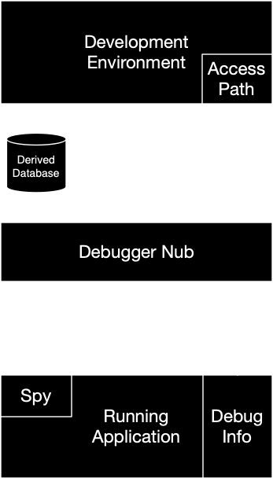

***********************
The ACCESS-PATH library
***********************

Original document by Jonathan Bachrach, Scott McKay, Tony Mann, Tucker
Withington, and Paul Howard.

.. current-library:: access-path

The purpose of this document is to describe the debugger access path,
which is an interface that abstracts the operations which are
performed over the “tether” between the Open Dylan development
environment and the running (“remote”) application.  The architecture
of the tethered environment is given by the following diagram. This
document describes the part of the diagram labelled “Access Path”. It
is target-independent, and runs in the same address space as the rest
of the Open Dylan environment.

.. image:: ../images/access-path.png
   :align: center
   :class: only-light

The “Debugger Nub” might be on the same machine as the development
environment, or it might be on the same machine as the application (in
which case it might or might not be in the same process as the
application). It might even be split across more than one machine or
more than one process.  In any case, the Debugger Nub is the part that
knows how to read and write from the runtime environment, set and
clear breakpoints, and so on. This part of the architecture is
target-specific.  The access path is able to invoke debugger nubs on
remote machines by means of a “Debugger Connection” to the remote
machine. This connection can be thought of as a connection to a server
process on that remote machine, which has the responsibility of
invoking the debugger nub, on demand.

The “Spy” is a very lightweight component that is physically part of
the application. It cooperates closely with the Debugger Nub and
native debugging APIs (such as ``ptrace`` or :file:`/proc`), which
provide most of the debugging functionality. At minimum, this part
preserves a mapping between static handles and objects that are
subject to relocation by the garbage collector. (The access path
exposes an interface to this mapping, which we call proxy objects, or
just proxies.)  Nearly all of the functionality described in this
document is provided either in the development environment or by the
Debugger Nub. The one exception to this in the main set of protocols
is the Remote Object Registration, which is provided by the Spy. Other
things, such as language-specific remote function call, will also be
provided in the Spy.  The running application contains Dylan code, and
may also contain “foreign” code.

The Derived Database contains information about most or all of the
Dylan code, but will contain no information about the foreign
code. The Derived Database does not contain enough information to be
able to look up the name of a variable from its address or get a
source line number from a PC; this information is pinned down during
linking, and so is stored in the “Debug Info” part of the application.
Since applications may contain foreign code as well as Dylan code,
this architecture supports debugging of both. The access path exposes
all of the necessary functionality to make this work.

The ACCESS-PATH Module
======================

The following sections describe the interface that attaches the
development environment (the “local” side) to an application being
debugger (the “remote” side).

.. current-module:: access-path

Creating and Attaching Access Paths
-----------------------------------

The following functions are used to create an access path with a
particular application running, or to attach a remote process to an
access path.

.. class:: <access-path>
   :abstract:
   :instantiable:

   :superclasses: :drm:`<object>`

   :keyword application:
   :keyword arguments:
   :keyword process:
   :keyword core-file:
   :keyword required application-object: An instance of :drm:`<object>`.
   :keyword symbol-file-locations: An instance of :drm:`<sequence>`.

   The class that represents a “path” to an application being debugged.

   If ``application:`` is supplied, it must be a string which names
   the application to be run, along with any necessary relative path
   qualification. In this case, the ``arguments:`` init keyword may
   also be supplied; it must be a string giving optional command line
   arguments to the application. In this case, the application’s
   initial state is stopped; you must call :func:`restart` in order to start
   it.

   For example,

   .. code-block:: dylan

      let path = make(<access-path>,
                      application: "/bin/rm",
                      arguments: "-rf /");
      restart(path);

   If ``process:`` is supplied, then the access path is attached to
   the application being run in the given :class:`<remote-process>`
   object. In this case, none of ``application:``, ``arguments:``, or
   ``core-file:`` may be supplied. In this case, the application’s
   initial state is running; you must call :func:`stop` in order to halt
   it. When an access path is created in this way, the access path
   will potentially instruct the debugger server (via the debugger
   connection) to create a new remote debugger process.

   If ``core-file:`` is supplied, it must be a string which names a
   core file from an application that dumped core. Again, this string
   must include any relative path qualifications. In this case, the
   application’s initial state is post-mortem.

   For example,

   .. code-block:: dylan

      let path = make(<access-path>,
                      core-file: as(<locator>, "/home/dilbert/core"));

.. class:: <application-access-path>

   :superclasses: :class:`<access-path>`

   :keyword required application: An instance of :drm:`<string>`.
   :keyword arguments: An instance of :drm:`<string>`.
   :keyword debugger-connection: An instance of :drm:`<object>`.
   :keyword library-search-paths: An instance of :drm:`<sequence>`.
   :keyword start-in-own-shell?: An instance of :drm:`<boolean>`.
   :keyword working-directory: An instance of :drm:`<string>`, or ``#f``.

.. class:: <access-path-creation-error>

   :superclasses: :drm:`<error>`

   An instance of this error will be signaled during the
   initialization of an :class:`<access-path>` if the debugger nub was
   unable to create it. This might occur if the supplied application
   name did not exist, for example, or a temporary file system error
   made a path inaccessible.

Access Path Functions
---------------------

In general, these functions only return a meaningful value if the
corresponding init keyword was supplied in the call to :drm:`make` that
created the access path. It may be possible in some cases to derive a
meaningful value, but this is not always the case.

.. generic-function:: access-path-abstract-handle

   :signature: access-path-abstract-handle (object) => (value)

   :parameter object: An instance of :class:`<access-path>`.
   :value value: An instance of :drm:`<object>`.

.. generic-function:: access-path-abstract-handle-setter

   :signature: access-path-abstract-handle-setter (value object) => (value)

   :parameter value: An instance of :drm:`<object>`.
   :parameter object: An instance of :class:`<access-path>`.
   :value value: An instance of :drm:`<object>`.

   Instances of :class:`<access-path>` have a slot for an abstract
   handle. The access path library does not define its type, nor the
   mode of its use. It does, however, provide a means of accessing it
   and setting it. Clients of the :lib:`access-path` library may use
   this slot for their own purposes. (Note that :class:`<access-path>`
   is a sealed class).

.. generic-function:: access-path-application-object

   :signature: access-path-application-object (object) => (value)

   :parameter object: An instance of :class:`<access-path>`.
   :value value: An instance of :drm:`<object>`.

.. generic-function:: access-path-application

   :signature: access-path-application (object) => (application)

   :parameter object: An instance of :drm:`<object>`.
   :value application: An instance of :drm:`<string>`, or ``#f``.

   Returns the locator that names the application associated with the
   access path. This may return ``#f`` if the ``application:`` init
   keyword was not supplied when the access path was created.

.. generic-function:: access-path-arguments

   :signature: access-path-arguments (object) => (value)

   :parameter object: An instance of :class:`<application-access-path>`.
   :value value: An instance of :drm:`<string>`.

.. generic-function:: access-path-process

   :signature: access-path-process (object) => (#rest results)

   :parameter object: An instance of :drm:`<object>`.
   :value process: An instance of :class:`<remote-process>`, or ``#f``.

   Returns the process associated with the access path, as a
   :class:`<remote-process>` object. This may return ``#f`` if one of
   the ``application:`` or ``process:`` init keywords was not supplied when
   the access path was created.

.. generic-function:: access-path-core-file

   :signature: access-path-core-file (object) => (#rest results)

   :parameter object: An instance of :drm:`<object>`.
   :value core-file: An instance of :drm:`<string>`, or ``#f``.

.. constant:: $max-spy-function-arguments

.. generic-function:: spy-function-argument-remote-vector

   :signature: spy-function-argument-remote-vector (object) => (value)

   :parameter object: An instance of :class:`<access-path>`.
   :value value: An instance of :drm:`<object>`.

.. generic-function:: spy-function-argument-remote-vector-setter

   :signature: spy-function-argument-remote-vector-setter (value object) => (value)

   :parameter value: An instance of :drm:`<object>`.
   :parameter object: An instance of :class:`<access-path>`.
   :value value: An instance of :drm:`<object>`.

.. constant:: $max-stepping-locations

.. generic-function:: stepping-locations-remote-vector

   :signature: stepping-locations-remote-vector (object) => (value)

   :parameter object: An instance of :class:`<access-path>`.
   :value value: An instance of :drm:`<object>`.

.. generic-function:: stepping-locations-remote-vector-setter

   :signature: stepping-locations-remote-vector-setter (value object) => (value)

   :parameter value: An instance of :drm:`<object>`.
   :parameter object: An instance of :class:`<access-path>`.
   :value value: An instance of :drm:`<object>`.

.. constant:: $access-ok

Modeling Remote Objects
=======================

Debugger Connections
--------------------

.. class:: <debugger-connection>
   :abstract:
   :instantiable:

   :superclasses: :drm:`<object>`

   The class that models a debugger connection to a (potentially
   remote) machine. This connection might be implicit (for the local
   machine), or it might be a network connection to a server process
   (for a remote machine).

.. variable:: *open-debugger-connections*

.. generic-function:: connection-hostname

   :signature: connection-hostname (object) => (value)

   :parameter object: An instance of :class:`<debugger-connection>`.
   :value value: An instance of :drm:`<string>`.

.. generic-function:: connection-hostname-setter

   :signature: connection-hostname-setter (value object) => (value)

   :parameter value: An instance of :drm:`<string>`.
   :parameter object: An instance of :class:`<debugger-connection>`.
   :value value: An instance of :drm:`<string>`.

.. generic-function:: connection-open?

   :signature: connection-open? (object) => (value)

   :parameter object: An instance of :class:`<remote-debugger-connection>`.
   :value value: An instance of :drm:`<boolean>`.

.. generic-function:: connection-open?-setter

   :signature: connection-open?-setter (value object) => (value)

   :parameter value: An instance of :drm:`<boolean>`.
   :parameter object: An instance of :class:`<remote-debugger-connection>`.
   :value value: An instance of :drm:`<boolean>`.

.. generic-function:: connection-password

   :signature: connection-password (object) => (value)

   :parameter object: An instance of :class:`<remote-debugger-connection>`.
   :value value: An instance of :drm:`<string>`.

.. generic-function:: describe-debugger-connection

   :signature: describe-debugger-connection (connection) => (#rest results)

   :parameter connection: An instance of :drm:`<object>`.
   :value #rest results: An instance of :drm:`<object>`.

.. method:: describe-debugger-connection
   :specializer: <local-debugger-connection>

.. method:: describe-debugger-connection
   :specializer: <remote-debugger-connection>

.. function:: do-open-debugger-connections

   :signature: do-open-debugger-connections (f) => ()

   :parameter f: An instance of :class:`<function>`.

.. class:: <access-connection>
   :open:
   :abstract:

   :superclasses: :drm:`<object>`

   :keyword required debugger-connection: An instance of :class:`<debugger-connection>`.
   :keyword description: An instance of :drm:`<string>`.
   :keyword process: An instance of :const:`<nub>`.

.. generic-function:: make-access-connection
   :open:

   :signature: make-access-connection (ap conn) => (conn)

   :parameter ap: An instance of :class:`<access-path>`.
   :parameter conn: An instance of :class:`<debugger-connection>`.
   :value conn: An instance of :class:`<access-connection>`.

.. function:: do-open-access-connections

   :signature: do-open-access-connections (f server) => ()

   :parameter f: An instance of :drm:`<function>`.
   :parameter server: An instance of :class:`<debugger-connection>`.

.. generic-function:: connection-open-tethers

   :signature: connection-open-tethers (object) => (value)

   :parameter object: An instance of :class:`<debugger-connection>`.
   :value value: An instance of :drm:`<stretchy-vector>`.

.. generic-function:: connection-process

   :signature: connection-process (object) => (value)

   :parameter object: An instance of :class:`<access-connection>`.
   :value value: An instance of :const:`<nub>`.

.. generic-function:: connection-process-list

   :signature: connection-process-list (object) => (value)

   :parameter object: An instance of :class:`<debugger-connection>`.
   :value value: An instance of :drm:`<stretchy-vector>`.

.. generic-function:: connection-process-list-setter

   :signature: connection-process-list-setter (value object) => (value)

   :parameter value: An instance of :drm:`<stretchy-vector>`.
   :parameter object: An instance of :class:`<debugger-connection>`.
   :value value: An instance of :drm:`<stretchy-vector>`.

.. generic-function:: connection-process-setter

   :signature: connection-process-setter (value object) => (value)

   :parameter value: An instance of :const:`<nub>`.
   :parameter object: An instance of :class:`<access-connection>`.
   :value value: An instance of :const:`<nub>`.

.. generic-function:: connection-network-address

   :signature: connection-network-address (object) => (value)

   :parameter object: An instance of :class:`<remote-debugger-connection>`.
   :value value: An instance of :drm:`<string>`.

.. function:: host-machine

   :signature: host-machine () => (connection)

   :value connection: An instance of :class:`<debugger-connection>`.

   Returns an instance of :class:`<debugger-connection>` that
   represents the machine on which :func:`host-machine` was called.

.. constant:: $local-hostname

.. generic-function:: do-processes
   :open:

   :signature: do-processes (function dc) => ()

   :parameter function: An instance of :drm:`<function>`.
   :parameter dc: An instance of :class:`<debugger-connection>`.

    Applies *function* to each of the :class:`<remote-process>`
    objects which are potentially debuggable on the machine
    corresponding to *dc*. This will involve a communication with the
    server process running on that machine. The server process is
    expected to filter out those processes which are not amenable to
    debugging.

.. generic-function:: get-process-page-fault-count

   :signature: get-process-page-fault-count (ap) => (count)

   :parameter ap: An instance of :class:`<access-path>`.
   :value count: An instance of :drm:`<integer>`.

Remote Processes
----------------

.. class:: <remote-process>
   :abstract:

   :superclasses: :drm:`<object>`

   :keyword nub-descriptor: An instance of :type:`<nubprocess>`.
   :keyword remote-process-actual-identifier: An instance of :class:`<abstract-integer>`.
   :keyword remote-process-name: An instance of :drm:`<string>`.
   :keyword remote-process-system-identifier: An instance of :drm:`<string>`.

.. generic-function:: remote-process-name

   :signature: remote-process-name (object) => (value)

   :parameter object: An instance of :class:`<remote-process>`.
   :value value: An instance of :drm:`<string>`.

.. generic-function:: remote-process-system-identifier

   :signature: remote-process-system-identifier (object) => (value)

   :parameter object: An instance of :class:`<remote-process>`.
   :value value: An instance of :drm:`<string>`.

.. generic-function:: remote-process-actual-identifier

   :signature: remote-process-actual-identifier (object) => (value)

   :parameter object: An instance of :class:`<remote-process>`.
   :value value: An instance of :class:`<abstract-integer>`.

Remote Threads
--------------

.. class:: <remote-thread>
   :abstract:

   :superclasses: :drm:`<object>`

   :keyword required access-path: An instance of :class:`<access-path>`.
   :keyword name: An instance of :drm:`<string>`.
   :keyword required nub-descriptor: An instance of :const:`<nubthread>`.
   :keyword os-priority: An instance of :drm:`<integer>`.
   :keyword required rnub-descriptor: An instance of :class:`<abstract-integer>`.
   :keyword state: An instance of :drm:`<string>`.

   The class that models a thread in an application process. Instances
   of :class:`<remote-thread>` are guaranteed to be unique. It is not
   possible for more than one instance of :class:`<remote-thread>` to
   refer to the same application thread. This remains true for the
   entire lifetime of the thread.

.. generic-function:: do-threads

   :signature: do-threads (function ap) => ()

   :parameter function: An instance of :drm:`<function>`.
   :parameter ap: An instance of :class:`<access-path>`.

   Applies function to each of the :class:`<remote-thread>` objects
   corresponding to the threads of the application’s process.

.. generic-function:: register-thread

   :signature: register-thread (object) => (value)

   :parameter object: An instance of :class:`<active-remote-register>`.
   :value value: An instance of :class:`<remote-thread>`.

.. generic-function:: thread-name

   :signature: thread-name (object) => (value)

   :parameter object: An instance of :class:`<remote-thread>`.
   :value value: An instance of :drm:`<string>`.

   Returns the name of the thread as a string.

.. generic-function:: thread-access-path

   :signature: thread-access-path (object) => (value)

   :parameter object: An instance of :class:`<remote-thread>`.
   :value value: An instance of :class:`<access-path>`.

.. generic-function:: get-thread-cpu-time

   :signature: get-thread-cpu-time (ap thread) => (timer)

   :parameter ap: An instance of :class:`<access-path>`.
   :parameter thread: An instance of :class:`<remote-thread>`.
   :value timer: An instance of :drm:`<integer>`.

.. generic-function:: get-process-wall-clock-time

   :signature: get-process-wall-clock-time (ap) => (timer)

   :parameter ap: An instance of :class:`<access-path>`.
   :value timer: An instance of :drm:`<integer>`.

.. generic-function:: number-of-active-threads

   :signature: number-of-active-threads (ap) => (count)

   :parameter ap: An instance of :class:`<access-path>`.
   :value count: An instance of :drm:`<integer>`.

.. generic-function:: thread-state

   :signature: thread-state (object) => (value)

   :parameter object: An instance of :class:`<remote-thread>`.
   :value value: An instance of :drm:`<string>`.

   Returns the state of the thread as a string.

.. generic-function:: thread-priority

   :signature: thread-priority (t #key normalize?) => (p)

   :parameter t: An instance of :class:`<remote-thread>`.
   :parameter #key normalize?: An instance of :drm:`<object>`.
   :value p: An instance of :drm:`<number>`.

   Returns the priority of the thread as a real number. If normalize
   is true (the default) then the priority will be normalized to the
   scale used by the Dylan threads library. Otherwise the priority
   corresponds to a scale which is dependent on the remote machine.

.. generic-function:: thread-suspended?

   :signature: thread-suspended? (object) => (value)

   :parameter object: An instance of :class:`<remote-thread>`.
   :value value: An instance of :drm:`<boolean>`.

   Returns ``#t`` if the given thread has been suspended, else returns
   ``#f``. Note that “suspended” means “suspended by the debugger”, via
   a call to :func:`suspend-thread`. So, even with the application in
   the stopped state, this function might return ``#f``. A good
   interpretation of :func:`thread-suspended?` is: will this thread
   not resume execution upon a call to :func:`continue`, or will it
   continue unhandled?

.. generic-function:: thread-permanently-suspended?

   :signature: thread-permanently-suspended? (ap thread) => (suspended?)

   :parameter ap: An instance of :class:`<access-path>`.
   :parameter thread: An instance of :class:`<remote-thread>`.
   :value suspended?: An instance of :drm:`<boolean>`.

.. generic-function:: thread-permanently-suspended?-setter

   :signature: thread-permanently-suspended?-setter (suspend? ap thread) => (suspend?)

   :parameter suspend?: An instance of :drm:`<boolean>`.
   :parameter ap: An instance of :class:`<access-path>`.
   :parameter thread: An instance of :class:`<remote-thread>`.
   :value suspend?: An instance of :drm:`<boolean>`.

.. generic-function:: stack-size

   :signature: stack-size (object) => (value)

   :parameter object: An instance of :class:`<remote-thread>`.
   :value value: An instance of :drm:`<integer>`.

.. generic-function:: stack-size-setter

   :signature: stack-size-setter (value object) => (value)

   :parameter value: An instance of :drm:`<integer>`.
   :parameter object: An instance of :class:`<remote-thread>`.
   :value value: An instance of :drm:`<integer>`.

.. generic-function:: stack-size-valid?

   :signature: stack-size-valid? (object) => (value)

   :parameter object: An instance of :class:`<remote-thread>`.
   :value value: An instance of :drm:`<boolean>`.

.. generic-function:: stack-size-valid?-setter

   :signature: stack-size-valid?-setter (value object) => (value)

   :parameter value: An instance of :drm:`<boolean>`.
   :parameter object: An instance of :class:`<remote-thread>`.
   :value value: An instance of :drm:`<boolean>`.

.. generic-function:: stack-trace-valid?

   :signature: stack-trace-valid? (object) => (value)

   :parameter object: An instance of :class:`<remote-thread>`.
   :value value: An instance of :drm:`<boolean>`.

.. generic-function:: stack-trace-valid?-setter

   :signature: stack-trace-valid?-setter (value object) => (value)

   :parameter value: An instance of :drm:`<boolean>`.
   :parameter object: An instance of :class:`<remote-thread>`.
   :value value: An instance of :drm:`<boolean>`.

.. generic-function:: thread-stack

   :signature: thread-stack (object) => (value)

   :parameter object: An instance of :class:`<remote-thread>`.
   :value value: An instance of :class:`<stack-frame>`, or ``#f``.

.. generic-function:: thread-stack-setter

   :signature: thread-stack-setter (value object) => (value)

   :parameter value: An instance of :class:`<stack-frame>`, or ``#f``.
   :parameter object: An instance of :class:`<remote-thread>`.
   :value value: An instance of :class:`<stack-frame>`, or ``#f``.

Remote Libraries
----------------

In this section, we use the term “library” to mean a traditional
shared library, such as a DLL under Windows.

.. class:: <remote-library>
   :abstract:

   :superclasses: :drm:`<object>`

   :keyword base-address: An instance of :type:`<remote-value>`.
   :keyword core-name: An instance of :drm:`<string>`.
   :keyword locator: An instance of :drm:`<string>`.
   :keyword nub-descriptor: An instance of :const:`<nublibrary>`.
   :keyword rnub-descriptor: An instance of :class:`<abstract-integer>`.
   :keyword version-major: An instance of :drm:`<integer>`.
   :keyword version-minor: An instance of :drm:`<integer>`.

   The class that models a library in the remote application. Like
   :class:`<remote-thread>`, instances of :class:`<remote-library>`
   are unique, and always refer to the same loaded library.

.. generic-function:: do-libraries

   :signature: do-libraries (function application) => ()

   :parameter function: An instance of :drm:`<function>`.
   :parameter application: An instance of :class:`<access-path>`.

   Applies *function* to each of the <remote-library> objects
   corresponding to the libraries of the *application*.

.. generic-function:: library-version

   :signature: library-version (lib) => (major-version-number minor-version-number)

   :parameter lib: An instance of :class:`<simple-remote-library>`.
   :value major-version-number: An instance of :drm:`<integer>`.
   :value minor-version-number: An instance of :drm:`<integer>`.

   Returns the version of the shared library as a string.

.. generic-function:: library-base-address

   :signature: library-base-address (object) => (value)

   :parameter object: An instance of :class:`<remote-library>`.
   :value value: An instance of :type:`<remote-value>`.

.. generic-function:: library-image-name

   :signature: library-image-name (object) => (value)

   :parameter object: An instance of :class:`<remote-library>`.
   :value value: An instance of :drm:`<string>`.

   Returns a :drm:`<string>` that indicates where the library was loaded from.

.. generic-function:: library-core-name

   :signature: library-core-name (object) => (value)

   :parameter object: An instance of :class:`<remote-library>`.
   :value value: An instance of :drm:`<string>`.

.. generic-function:: library-object-files

   :signature: library-object-files (object) => (value)

   :parameter object: An instance of :class:`<remote-library>`.
   :value value: An instance of :drm:`<sequence>`.

.. generic-function:: extend-remote-library

   :signature: extend-remote-library (path library file) => ()

   :parameter path: An instance of :class:`<access-path>`.
   :parameter library: An instance of :class:`<remote-library>`.
   :parameter file: An instance of :class:`<remote-object-file>`.

.. generic-function:: find-or-make-library

   :signature: find-or-make-library (ap lib) => (lib)

   :parameter ap: An instance of :class:`<access-path>`.
   :parameter lib: An instance of :const:`<nublibrary>`.
   :value lib: An instance of :class:`<remote-library>`.

.. generic-function:: self-contained-component?

   :signature: self-contained-component? (object) => (value)

   :parameter object: An instance of :class:`<remote-library>`.
   :value value: An instance of :drm:`<boolean>`.

.. generic-function:: self-contained-component?-setter

   :signature: self-contained-component?-setter (value object) => (value)

   :parameter value: An instance of :drm:`<boolean>`.
   :parameter object: An instance of :class:`<remote-library>`.
   :value value: An instance of :drm:`<boolean>`.

Remote Object Files
-------------------

.. class:: <remote-object-file>

   :superclasses: :drm:`<object>`

   :keyword client-data: An instance of :drm:`<object>`.
   :keyword language: An instance of :drm:`<integer>`.
   :keyword required library: An instance of :class:`<remote-library>`.
   :keyword required name: An instance of :drm:`<byte-string>`.
   :keyword object-extension: An instance of :drm:`<byte-string>`.
   :keyword path: An instance of :drm:`<byte-string>`.
   :keyword source-extension: An instance of :drm:`<byte-string>`.

.. generic-function:: remote-object-file-core-name

   :signature: remote-object-file-core-name (object) => (value)

   :parameter object: An instance of :class:`<remote-object-file>`.
   :value value: An instance of :drm:`<byte-string>`.

.. generic-function:: remote-object-file-source-extension

   :signature: remote-object-file-source-extension (object) => (value)

   :parameter object: An instance of :class:`<remote-object-file>`.
   :value value: An instance of :drm:`<byte-string>`.

.. generic-function:: remote-object-file-object-extension

   :signature: remote-object-file-object-extension (object) => (value)

   :parameter object: An instance of :class:`<remote-object-file>`.
   :value value: An instance of :drm:`<byte-string>`.

.. generic-function:: remote-object-file-path

   :signature: remote-object-file-path (object) => (value)

   :parameter object: An instance of :class:`<remote-object-file>`.
   :value value: An instance of :drm:`<byte-string>`.

.. generic-function:: remote-object-file-library

   :signature: remote-object-file-library (object) => (value)

   :parameter object: An instance of :class:`<remote-object-file>`.
   :value value: An instance of :class:`<remote-library>`.

.. generic-function:: remote-object-file-language

   :signature: remote-object-file-language (object) => (value)

   :parameter object: An instance of :class:`<remote-object-file>`.
   :value value: An instance of :drm:`<integer>`.

.. generic-function:: remote-object-file-client-data

   :signature: remote-object-file-client-data (object) => (value)

   :parameter object: An instance of :class:`<remote-object-file>`.
   :value value: An instance of :drm:`<object>`.

Reading and Writing Memory
==========================

The following functions can be used to do “raw” reads and writes on
memory and registers in the remote application. Note that, since this
is not intended to be a kernel debugger, the memory functions always
operate in terms of the virtual memory of the application.

.. type:: <remote-value>

   The type that is used to contain remote values and
   addresses. Instances of this type hold values that are the size of
   a machine object or pointer.  This type serves to hide any
   precision problems that might be encountered when modeling a 32-bit
   machine if the local Dylan implementation supports only 30-bit
   integers, or for allowing modeling of 64-bit applications on 32-bit
   machines. The type is guaranteed to be disjoint from any of the
   classes defined in this document. However, it is permitted for
   instances of :type:`<remote-value>` to be instances of
   :drm:`<real>`, as defined in the Dylan library.

.. method:: =
   :specializer: <remote-value>, <remote-value>

   Tests two remote-values for equality. Two remote values are equal
   if they represent the same bit pattern (of whatever size that may
   be).

.. generic-function:: as-integer

   :signature: as-integer (x) => (i)

   :parameter x: An instance of :drm:`<object>`.
   :value i: An instance of :class:`<abstract-integer>`.

   Converts the remote value to an <abstract-integer> (NB the
   concrete representation may be a big integer as defined in the
   :lib:`big-integers` library.) This function might be a NOP.  Note:
   the :drm:`as` function cannot be used for the same purpose, because
   of the possibility of :type:`<remote-value>` being derived from a
   class defined in the Dylan library.

.. method:: as-integer
   :specializer: <remote-value>

.. method:: as-integer
   :specializer: <descriptor-pointer>

.. generic-function:: as-integer-losing-precision

   :signature: as-integer-losing-precision (x) => (i)

   :parameter x: An instance of :type:`<remote-value>`.
   :value i: An instance of :drm:`<integer>`.

.. generic-function:: as-remote-value

   :signature: as-remote-value (x) => (ptr)

   :parameter x: An instance of :class:`<abstract-integer>`.
   :value ptr: An instance of :type:`<remote-value>`.

   Converts the given abstract integer to a :type:`<remote-value>`.

.. generic-function:: as-remote-pointer

   :signature: as-remote-pointer (x) => (ptr)

   :parameter x: An instance of :class:`<abstract-integer>`.
   :value ptr: An instance of :const:`<descriptor-pointer>`.

.. generic-function:: indexed-remote-value

   :signature: indexed-remote-value (x i) => (ptr)

   :parameter x: An instance of :type:`<remote-value>`.
   :parameter i: An instance of :drm:`<integer>`.
   :value ptr: An instance of :type:`<remote-value>`.

   Given a :type:`<remote-value>` base and an integer offset, returns the
   result of adding the offset (measured in remote-value-sized units)
   to the base.

.. generic-function:: byte-indexed-remote-value

   :signature: byte-indexed-remote-value (x i) => (ptr)

   :parameter x: An instance of :type:`<remote-value>`.
   :parameter i: An instance of :drm:`<integer>`.
   :value ptr: An instance of :type:`<remote-value>`.

   Identical to :func:`indexed-remote-value`, except that the offset
   is added in bytes rather than in remote-value-sized units.

.. generic-function:: remote-value-byte-size

   :signature: remote-value-byte-size (ap) => (value-size)

   :parameter ap: An instance of :class:`<access-path>`.
   :value value-size: An instance of :drm:`<integer>`.

.. generic-function:: tagged-remote-value-as-integer

   :signature: tagged-remote-value-as-integer (x) => (i)

   :parameter x: An instance of :type:`<remote-value>`.
   :value i: An instance of :drm:`<integer>`.

.. generic-function:: tagged-remote-value-as-character

   :signature: tagged-remote-value-as-character (x) => (c)

   :parameter x: An instance of :type:`<remote-value>`.
   :value c: An instance of :drm:`<character>`.

.. generic-function:: integer-as-tagged-remote-value

   :signature: integer-as-tagged-remote-value (i) => (x)

   :parameter i: An instance of :drm:`<integer>`.
   :value x: An instance of :type:`<remote-value>`.

.. generic-function:: character-as-tagged-remote-value

   :signature: character-as-tagged-remote-value (c) => (x)

   :parameter c: An instance of :drm:`<character>`.
   :value x: An instance of :type:`<remote-value>`.

.. generic-function:: remote-value-<

   :signature: remote-value-< (x y) => (answer)

   :parameter x: An instance of :type:`<remote-value>`.
   :parameter y: An instance of :type:`<remote-value>`.
   :value answer: An instance of :drm:`<boolean>`.

.. generic-function:: remote-value-<=

   :signature: remote-value-<= (x y) => (answer)

   :parameter x: An instance of :type:`<remote-value>`.
   :parameter y: An instance of :type:`<remote-value>`.
   :value answer: An instance of :drm:`<boolean>`.

.. generic-function:: remote-value-=

   :signature: remote-value-= (x y) => (answer)

   :parameter x: An instance of :type:`<remote-value>`.
   :parameter y: An instance of :type:`<remote-value>`.
   :value answer: An instance of :drm:`<boolean>`.

.. generic-function:: remote-value-as-string

   :signature: remote-value-as-string (ap val radix) => (str)

   :parameter ap: An instance of :class:`<access-path>`.
   :parameter val: An instance of :type:`<remote-value>`.
   :parameter radix: An instance of :drm:`<integer>`.
   :value str: An instance of :drm:`<string>`.

.. generic-function:: string-as-remote-value

   :signature: string-as-remote-value (ap str radix) => (val)

   :parameter ap: An instance of :class:`<access-path>`.
   :parameter str: An instance of :drm:`<string>`.
   :parameter radix: An instance of :drm:`<integer>`.
   :value val: An instance of :type:`<remote-value>`.

.. generic-function:: remote-value-low-order-bits

   :signature: remote-value-low-order-bits (x bit-count) => (value)

   :parameter x: An instance of :type:`<remote-value>`.
   :parameter bit-count: An instance of :drm:`<integer>`.
   :value value: An instance of :drm:`<integer>`.

.. class:: <remote-register>
   :abstract:

   :superclasses: :drm:`<object>`

   :keyword required category: An instance of :drm:`<symbol>`.
   :keyword required code: An instance of :drm:`<integer>`.
   :keyword required descriptor: An instance of :drm:`<integer>`.
   :keyword required name: An instance of :drm:`<byte-string>`.

   The class that is used to “name” a remote register.

.. class:: <unassigned-remote-register>

   :superclasses: :class:`<remote-register>`

   The class that is used to designate a register that is not
   considered to be within the context of a thread in the
   application. A subclass of :class:`<remote-register>`. Read/write
   operations cannot be performed on instances of
   :class:`<unassigned-remote-register>`.

.. class:: <active-remote-register>

   :superclasses: :class:`<remote-register>`

   :keyword required thread: An instance of :class:`<remote-thread>`.

   The class that is used to designate a register within the context
   of a thread inside the running application. Note that read/write
   operations can only be performed on instances of
   :class:`<active-remote-register>`.

.. generic-function:: register-name

   :signature: register-name (r) => (sym)

   :parameter r: An instance of :class:`<remote-register>`.
   :value sym: An instance of :drm:`<string>`.

   Returns the name of the remote register as a symbol.

.. generic-function:: do-registers

   :signature: do-registers (function ap #key type) => ()

   :parameter function: An instance of :drm:`<function>`.
   :parameter ap: An instance of :class:`<access-path>`.
   :parameter #key type: An instance of :drm:`<object>`.

   Applies *function* to each of the registers in the given register
   set. *function* is called with one argument, an
   :class:`<unassigned-remote-register>` object.  *type* can be one of
   ``#f``, ``#"general"``, ``#"float"``, or ``#"special"``. If it is
   ``#f``, *function* is called on all the registers. If it is
   ``#"general"``, *function* is called only on the general-purpose
   registers. If it is ``#"float"``, function is called only on the
   floating-point registers. If it is ``#"special"``, function is called
   only on the special-purpose registers.

.. generic-function:: find-register

   :signature: find-register (ap nub-register) => (descriptor)

   :parameter ap: An instance of :class:`<access-path>`.
   :parameter nub-register: An instance of :drm:`<integer>`.
   :value descriptor: An instance of :class:`<unassigned-remote-register>`.

.. generic-function:: active-register

   :signature: active-register (ap thread register) => (reg)

   :parameter ap: An instance of :class:`<access-path>`.
   :parameter thread: An instance of :class:`<remote-thread>`.
   :parameter register: An instance of :class:`<unassigned-remote-register>`.
   :value reg: An instance of :class:`<active-remote-register>`.

   Returns an :class:`<active-remote-register>` whose attributes are identical
   to the given :class:`<unassigned-remote-register>`. The returned
   instance can then be used to refer to that register within the
   specified remote-thread of the running application.

.. type:: <remote-location>

   The type used to represent a remote address. It is the union of
   :type:`<remote-value>` and :class:`<active-remote-register>`.

   Note that some operations can only be sensibly performed on memory
   addresses and not registers, notable examples being the setting
   of breakpoints and querying page protection. In these cases the
   address is actually required to be of type :type:`<remote-value>`
   rather than the more general :type:`<remote-location>`.

.. class:: <remote-type>
   :abstract:

   :superclasses: :drm:`<object>`

   The type used to represent a remote type.

Functions for Querying Page Protection
--------------------------------------

The debugger manager is required to check the page protection on an
address before attempting to obtain a :type:`<remote-value>` from that
location (or write one to it). This is because the garbage collector
may have placed a read barrier or write barrier, meaning that the
objects at that address are invalid pending further GC activity. If
the page is protected, then the read/write must be done within the
context of the application, via the spy, and not via the debugger
nub. These functions may not be called if the application is in the
running state.

.. generic-function:: page-read-permission?

   :signature: page-read-permission? (ap address) => (ans)

   :parameter ap: An instance of :class:`<access-path>`.
   :parameter address: An instance of :type:`<remote-value>`.
   :value ans: An instance of :drm:`<boolean>`.

   Returns ``#t`` if read permissions are enabled at the given address in
   the application, else returns ``#f``.

.. generic-function:: page-write-permission?

   :signature: page-write-permission? (ap address) => (ans)

   :parameter ap: An instance of :class:`<access-path>`.
   :parameter address: An instance of :type:`<remote-value>`.
   :value ans: An instance of :drm:`<boolean>`.

   Returns ``#t`` if write permissions are enabled at the given
   address in the application, else returns ``#f``.

.. generic-function:: page-execute-permission?

   :signature: page-execute-permission? (ap address) => (ans)

   :parameter ap: An instance of :class:`<access-path>`.
   :parameter address: An instance of :type:`<remote-value>`.
   :value ans: An instance of :drm:`<boolean>`.

   Returns ``#t`` if execute permissions are enabled at the given
   address in the application, else returns ``#f``.

.. generic-function:: remote-virtual-page-size

   :signature: remote-virtual-page-size (ap) => (page-size)

   :parameter ap: An instance of :class:`<access-path>`.
   :value page-size: An instance of :drm:`<integer>`.

   Returns the the size of a memory page on the remote machine, in
   :type:`<remote-value>` units, as an integer.

.. generic-function:: remote-address-page-number

   :signature: remote-address-page-number (ap addr) => (id)

   :parameter ap: An instance of :class:`<access-path>`.
   :parameter addr: An instance of :type:`<remote-value>`.
   :value id: An instance of :drm:`<integer>`.

   Turns an address into an integer-enumerated memory page ID.

.. generic-function:: page-relative-address

   :signature: page-relative-address (ap addr) => (id offset)

   :parameter ap: An instance of :class:`<access-path>`.
   :parameter addr: An instance of :type:`<remote-value>`.
   :value id: An instance of :drm:`<integer>`.
   :value offset: An instance of :drm:`<integer>`.

   Turns an address into an integer-enumerated memory page ID, and an
   offset into the page.

.. generic-function:: calculate-stack-address

   :signature: calculate-stack-address (ap thread offset) => (addr)

   :parameter ap: An instance of :class:`<access-path>`.
   :parameter thread: An instance of :class:`<remote-thread>`.
   :parameter offset: An instance of :drm:`<integer>`.
   :value addr: An instance of :type:`<remote-value>`.

   Returns the address of a position on the stack of the application's
   thread. Offset 0 is the top of the stack. Offset 1 is the position
   1 remote-value below the top of the stack, and so on.

Functions for Reading and Writing
---------------------------------

Note that, for all the functions described in this section, it is an
error to call them if the application is in the running
state. Furthermore, any of these functions might signal a
:class:`<remote-access-violation-error>` if a read or write is to an
illegal address or causes an access violation.  Note also that
:type:`<remote-value>` instances read from an application are likely
to become “stale” once the application has been made runnable or has
been single-stepped. For example, the garbage collector in the
application might discard an object. Longer-lived objects must be
registered via the Spy’s object registration facility.

.. class:: <remote-access-violation-error>

   :superclasses: :drm:`<error>`

   The condition signaled if some sort of an access error occurs while
   reading or writing remote memory.

.. generic-function:: read-value

   :signature: read-value (ap address #key stack-frame) => (val)

   :parameter ap: An instance of :class:`<access-path>`.
   :parameter address: An instance of :const:`<remote-location>`.
   :parameter #key stack-frame: An instance of :drm:`<object>`.
   :value val: An instance of :type:`<remote-value>`.

   Reads a memory word from the location given by *address*, and
   returns its contents as a :type:`<remote-value>`.

.. method:: read-value
   :specializer: <access-path>, <active-remote-register>

.. method:: read-value
   :specializer: <access-path>, <remote-value>

.. generic-function:: write-value

   :signature: write-value (ap address value) => (val)

   :parameter ap: An instance of :class:`<access-path>`.
   :parameter address: An instance of :const:`<remote-location>`.
   :parameter value: An instance of :type:`<remote-value>`.
   :value val: An instance of :type:`<remote-value>`.

   Writes remote-value into the memory location given by
   *address*, and returns the value.

.. method:: write-value
   :specializer: <access-path>, <active-remote-register>, <remote-value>

.. method:: write-value
   :specializer: <access-path>, <remote-value>, <remote-value>

.. generic-function:: read-8b

   :signature: read-8b (ap address) => (val)

   :parameter ap: An instance of :class:`<access-path>`.
   :parameter address: An instance of :const:`<remote-location>`.
   :value val: An instance of :drm:`<integer>`.

   Reads an 8-bit byte from the location given by *address*, and
   returns its contents as an :drm:`<integer>`.

.. generic-function:: write-8b

   :signature: write-8b (ap address value) => (val)

   :parameter ap: An instance of :class:`<access-path>`.
   :parameter address: An instance of :const:`<remote-location>`.
   :parameter value: An instance of :drm:`<integer>`.
   :value val: An instance of :drm:`<integer>`.

   Writes an 8-bit byte, as an integer, into the memory location at
   *address*, and returns the value.

.. generic-function:: read-16b

   :signature: read-16b (ap address) => (val)

   :parameter ap: An instance of :class:`<access-path>`.
   :parameter address: An instance of :const:`<remote-location>`.
   :value val: An instance of :drm:`<integer>`.

   Reads a 16-bit word from the location given by remote-location, and
   returns its contents as an :drm:`<integer>`.

.. generic-function:: write-16b

   :signature: write-16b (ap address value) => (val)

   :parameter ap: An instance of :class:`<access-path>`.
   :parameter address: An instance of :const:`<remote-location>`.
   :parameter value: An instance of :drm:`<integer>`.
   :value val: An instance of :drm:`<integer>`.

   Writes a 16-bit word, as an integer, into the memory location at
   *address*, and returns the value.

.. generic-function:: read-32b

   :signature: read-32b (ap address) => (val)

   :parameter ap: An instance of :class:`<access-path>`.
   :parameter address: An instance of :const:`<remote-location>`.
   :value val: An instance of :drm:`<integer>`.

   Reads a 32-bit w ord from the location given by *address*,
   and returns its contents as an :drm:`<integer>`.

.. generic-function:: write-32b

   :signature: write-32b (ap address value) => (val)

   :parameter ap: An instance of :class:`<access-path>`.
   :parameter address: An instance of :const:`<remote-location>`.
   :parameter value: An instance of :drm:`<integer>`.
   :value val: An instance of :drm:`<integer>`.

   Writes a 32-bit word, as an integer, into the memory location at
   *address*, and returns the value.

.. generic-function:: read-64b

   :signature: read-64b (ap address) => (val)

   :parameter ap: An instance of :class:`<access-path>`.
   :parameter address: An instance of :const:`<remote-location>`.
   :value val: An instance of :drm:`<integer>`.

   Reads a 64-bit word from the location given by *address*, and
   returns its contents as an :drm:`<integer>`.

.. generic-function:: write-64b

   :signature: write-64b (ap address value) => (val)

   :parameter ap: An instance of :class:`<access-path>`.
   :parameter address: An instance of :const:`<remote-location>`.
   :parameter value: An instance of :drm:`<integer>`.
   :value val: An instance of :drm:`<integer>`.

   Writes a 64-bit word, as an integer, into the memory location at
   *address*, and returns the value.

.. generic-function:: read-single-float

   :signature: read-single-float (ap address) => (val)

   :parameter ap: An instance of :class:`<access-path>`.
   :parameter address: An instance of :const:`<remote-location>`.
   :value val: An instance of :drm:`<single-float>`.

   Reads a single-precision floating-point number from the
   location given by remote-location, and returns its contents as
   a :drm:`<single-float>`.

.. method:: read-single-float
   :specializer: <access-path>, <active-remote-register>

.. method:: read-single-float
   :specializer: <access-path>, <remote-value>

.. generic-function:: write-single-float

   :signature: write-single-float (ap address value) => (val)

   :parameter ap: An instance of :class:`<access-path>`.
   :parameter address: An instance of :const:`<remote-location>`.
   :parameter value: An instance of :class:`<single-float>`.
   :value val: An instance of :drm:`<single-float>`.

   Writes a single-precision floating-point number, into the memory
   location at *address*, and returns the value.

.. method:: write-single-float
   :specializer: <access-path>, <active-remote-register>, <single-float>

.. method:: write-single-float
   :specializer: <access-path>, <remote-value>, <single-float>

.. generic-function:: read-double-float

   :signature: read-double-float (ap address) => (val)
   :parameter ap: An instance of :class:`<access-path>`.
   :parameter address: An instance of :const:`<remote-location>`.
   :value val: An instance of :drm:`<double-float>`.

   Reads a double-precision floating-point number from the location
   given by remote-location, and returns its contents as a
   :drm:`<double-float>`.

.. method:: read-double-float
   :specializer: <access-path>, <active-remote-register>

.. method:: read-double-float
   :specializer: <access-path>, <remote-value>

.. generic-function:: write-double-float

   :signature: write-double-float (ap address value) => (val)

   :parameter ap: An instance of :class:`<access-path>`.
   :parameter address: An instance of :const:`<remote-location>`.
   :parameter value: An instance of :drm:`<double-float>`.
   :value val: An instance of :drm:`<double-float>`.

.. method:: write-double-float
   :specializer: <access-path>, <active-remote-register>, <double-float>

.. method:: write-double-float
   :specializer: <access-path>, <remote-value>, <double-float>

   Writes a double-precision floating-point number, into the memory
   location at address, and returns the value.

.. generic-function:: read-byte-string

   :signature: read-byte-string (ap address length) => (val)

   :parameter ap: An instance of :class:`<access-path>`.
   :parameter address: An instance of :type:`<remote-value>`.
   :parameter length: An instance of :drm:`<integer>`.
   :value val: An instance of :drm:`<byte-string>`.

   Reads a byte string starting from the location given by *address*,
   and returns its contents as a :drm:`<byte-string>`. *length* is the
   number of bytes to read.

.. generic-function:: write-byte-string

   :signature: write-byte-string (ap address value #key ending-index) => (val)

   :parameter ap: An instance of :class:`<access-path>`.
   :parameter address: An instance of :type:`<remote-value>`.
   :parameter value: An instance of :drm:`<byte-string>`.
   :parameter #key ending-index: An instance of :drm:`<object>`.
   :value val: An instance of :drm:`<byte-string>`.

   Writes a byte string into the memory starting at *address*, and
   returns the value.

Controlling the Application
===========================

The control functions described in this section are asynchronous and
may return immediately, even though the remote application might not
yet have entered the desired state. When the application’s state
changes, an appropriate stop reason is sent. See
:func:`wait-for-stop-reason`.

.. generic-function:: restart

   :signature: restart (ap) => ()

   :parameter ap: An instance of :class:`<access-path>`.

   Starts (or restarts) the application from the beginning. After
   making a new access path with the ``application:`` init keyword,
   restart is used to start up the application.  :func:`restart` may
   be called with the application in any state, and will put the
   application into the running state. Note that not all access paths
   will be able to restart an application that is in the post-mortem
   state.

.. generic-function:: stop

   :signature: stop (ap) => ()

   :parameter ap: An instance of :class:`<access-path>`.

   Stops the application. This stops all of the threads in the
   application’s process. After starting or continuing an application
   or making a new access path with the ``process:`` init keyword,
   :func:`stop` is used to stop the application.  :func:`stop` may be
   called only when the application is in the running state, and will
   put the application into the stopped state.

.. generic-function:: continue

   :signature: continue (ap #key resume) => ()

   :parameter ap: An instance of :class:`<access-path>`.
   :parameter #key resume: An instance of :drm:`<object>`.

   Continues the application from where it was stopped. This
   continues all of the threads in the application’s process.

   If the application was stopped due to a first-chance exception, the
   exception will be ignored (ie. considered “handled”) when it
   resumes, thus bypassing any structured handling system that might
   exist. For a second-chance exception, the application simply
   continues.  :func:`continue` may be called only when the application is in
   the stopped state, and will put the application into the running
   state.

.. generic-function:: continue-unhandled

   :signature: continue-unhandled (ap #key resume) => ()

   :parameter ap: An instance of :class:`<access-path>`.
   :parameter #key resume: An instance of :drm:`<object>`.

   Continues the application from where it was stopped. This continues
   all of the threads in the application’s process.

   If the application was stopped due to a first-chance exception, it
   will be given the chance to handle that exception itself (which
   will result in the exception occurring a second time if the
   application provides no handler for it). If the application was
   stopped due to a second-chance exception, it will abort.
   :func:`continue-unhandled` may be called only when the application
   is in the stopped state, and will put the application into the
   running state.

.. generic-function:: suspend-thread

   :signature: suspend-thread (ap thread) => ()

   :parameter ap: An instance of :class:`<access-path>`.
   :parameter thread: An instance of :class:`<remote-thread>`.

   Suspends the given thread in the application. This function may
   only be called when the application is in the stopped state — the
   thread in question will not resume execution when the application
   continues.

   This function has no effect if the thread has already been suspended.

.. generic-function:: resume-thread

   :signature: resume-thread (ap thread) => ()

   :parameter ap: An instance of :class:`<access-path>`.
   :parameter thread: An instance of :class:`<remote-thread>`.

   Resumes the given thread in the application. This function may only
   be called when the application is in the stopped state, and will
   only have an effect if the thread was previously suspended by a
   call to :func:`suspend-thread`. The thread will resume its
   execution when the application continues.

.. generic-function:: dylan-resume-thread

   :signature: dylan-resume-thread (ap thread) => ()

   :parameter ap: An instance of :class:`<access-path>`.
   :parameter thread: An instance of :class:`<remote-thread>`.

.. generic-function:: step

   :signature: step (ap n) => ()

   :parameter ap: An instance of :class:`<access-path>`.
   :parameter n: An instance of :drm:`<integer>`.

   Single-steps the application over *n* instructions. This steps only
   the current thread.  :func:`step` may be called only when the
   application is in the stopped state, and will put the application
   into the running state. The application will run only for as long
   as it takes to step, and then a :class:`<single-step-stop-reason>`
   event will be queued.

.. generic-function:: step-over

   :signature: step-over (ap n) => ()

   :parameter ap: An instance of :class:`<access-path>`.
   :parameter n: An instance of :drm:`<integer>`.

   Single-steps the application over *n* instructions, stepping over
   function calls. This steps only the current thread.
   :func:`step-over` may be called only when the application is in the
   stopped state, and will put the application into the running
   state. The application will run only for as long as it takes to
   step, and then a :class:`<single-step-stop-reason>` event will be
   queued.

.. generic-function:: step-out

   :signature: step-out (ap) => ()

   :parameter ap: An instance of :class:`<access-path>`.

   Steps the application out of its current function frame, stopping
   at the next instruction in the calling frame.

   :func:`step-out` may be called only when the application is in the
   stopped state, and will put the application into the running
   state. The application will run only for as long as it takes to
   step, and then a <single-step-stop-reason> event will be queued.

.. generic-function:: application-state-running?

   :signature: application-state-running? (ap) => (running?)

   :parameter ap: An instance of :class:`<access-path>`.
   :value running?: An instance of :drm:`<boolean>`.

   Returns ``#t`` if the remote-application is in the running state.

.. generic-function:: application-state-stopped?

   :signature: application-state-stopped? (ap) => (stopped?)

   :parameter ap: An instance of :class:`<access-path>`.
   :value stopped?: An instance of :drm:`<boolean>`.

   Returns ``#t`` if the remote-application is in the stopped state,
   because it has been halted.

.. generic-function:: application-state-unstarted?

   :signature: application-state-unstarted? (ap) => (unstarted?)

   :parameter ap: An instance of :class:`<access-path>`.
   :value unstarted?: An instance of :drm:`<boolean>`.

   Returns ``#t`` if the remote-application is in the unstarted state,
   because it has never been started with a call to :func:`restart` or
   :func:`continue`.

.. generic-function:: application-state-post-mortem?

   :signature: application-state-post-mortem? (ap) => (post-mortem?)

   :parameter ap: An instance of :class:`<access-path>`.
   :value post-mortem?: An instance of :drm:`<boolean>`.

   Returns ``#t`` if the remote-application is in the post-mortem state,
   because the access path is attached to a post-mortem dump.

.. generic-function:: kill-application

   :signature: kill-application (ap #key do-cleanups?) => (success?)

   :parameter ap: An instance of :class:`<access-path>`.
   :parameter #key do-cleanups?: An instance of :drm:`<object>`.
   :value success?: An instance of :drm:`<boolean>`.

   Kill the application’s process.

   If ``do-cleanups?`` is true, all of the cleanups for the
   application are run before it is killed. The default is ``#f``.

   :func:`kill-application` may be called only when the application is
   in the stopped state. If ``do-cleanups?`` is false, the application
   will be put into the dead state. If ``do-cleanups?`` is true, the
   application will be put into the running state.

.. generic-function:: close-application

   :signature: close-application (ap) => ()

   :parameter ap: An instance of :class:`<access-path>`.

.. generic-function:: register-exit-process-function

   :signature: register-exit-process-function (ap exit-process) => ()

   :parameter ap: An instance of :class:`<access-path>`.
   :parameter exit-process: An instance of :class:`<remote-symbol>`.

Remote Function Calling
=======================

.. generic-function:: remote-call

   :signature: remote-call (access-path thread function #rest arguments) => (ret-addr cookie)

   :parameter access-path: An instance of :class:`<access-path>`.
   :parameter thread: An instance of :class:`<remote-thread>`.
   :parameter function: An instance of :type:`<remote-value>`.
   :parameter #rest arguments: An instance of :drm:`<object>`.
   :value ret-addr: An instance of :type:`<remote-value>`.
   :value cookie: An instance of :drm:`<object>`.

   Prepares the given thread to perform a specific function call once
   the application is resumed.  *function* is a
   :type:`<remote-value>`, *arguments* is zero or more
   :type:`<remote-value>` objects. The call is made using the C
   calling-conventions on the remote machine. (It is expected that a
   higher level will deal with language-specific calling conventions
   and language-specific return results).

   *return-address* is a :type:`<remote-value>` representing the point
   at which control in the application will resume when the called
   function returns. A breakpoint should be placed on this address
   before allowing the remote call to proceed in order to obtain
   notification of the remote function’s return and restore the
   thread’s dynamic context if necessary.

   *context* is a cookie that will be required by
   :func:`remote-restore-context` in order to ensure that the dynamic state of
   the thread will be restored back to what it was before the remote
   call.  It is an error to call :func:`remote-call` if the application is not
   in the stopped state

   This function does not put the application into the running state,
   but the specified thread will make the remote call as soon as the
   application is resumed by continue or continue-handled.

.. generic-function:: remote-call-result

   :signature: remote-call-result (ap thr) => (result)

   :parameter ap: An instance of :class:`<access-path>`.
   :parameter thr: An instance of :class:`<remote-thread>`.
   :value result: An instance of :type:`<remote-value>`.

   Obtains the result of a remote call (assuming the C calling
   convention).  *result* is a :type:`<remote-value>` that contains the return
   value of the function.  In order to obtain a sensible result at the
   correct time, this function must be called when the breakpoint
   (that should have been set up after a call to :func:`remote-call`) is
   actually encountered by the application. But note also that this is
   only true when the breakpoint is encountered by the thread that
   made the remote call, and when the thread is in the same stack
   frame as it was when the remote call was made. Calling
   :func:`remote-call-result` when these conditions do not hold will have
   unpredictable results.

.. generic-function:: remote-restore-context

   :signature: remote-restore-context (ap thr ctx) => ()

   :parameter ap: An instance of :class:`<access-path>`.
   :parameter thr: An instance of :class:`<remote-thread>`.
   :parameter ctx: An instance of :class:`<thread-context>`.

   Restores the dynamic context (register set) of a remote-thread that
   was previously instructed to do a remote call. The *context*
   argument is that received as a returned result from
   :func:`remote-call`. Like :func:`remote-call-result`, this should
   be called when the breakpoint (set on the remote function’s return
   address) is encountered, and in the relevant context as described
   above. Basically, :func:`remote-call-result` and
   :func:`remote-restore-context` should be called at the same time,
   in either order.  The justification for having two separate
   functions, :func:`remote-call-result` and
   :func:`remote-restore-context`, is that the function result may
   sometimes be known not to be of interest. It also allows the
   possibility of not restoring the context if desired.  Having called
   one or both of :func:`remote-call-result` and
   :func:`remote-restore-context`, it will be necessary to remove the
   breakpoint that was set in order to trap the return of the remote
   function.

.. generic-function:: remote-call-spy

   :signature: remote-call-spy (ap thr function #rest arguments) => (result aborted?)

   :parameter ap: An instance of :class:`<access-path>`.
   :parameter thr: An instance of :class:`<remote-thread>`.
   :parameter function: An instance of :type:`<remote-value>`.
   :parameter #rest arguments: An instance of :drm:`<object>`.
   :value result: An instance of :type:`<remote-value>`.
   :value aborted?: An instance of :drm:`<boolean>`.

   A restricted remote calling protocol specifically for calling
   functions in the spy. The arguments are the same as those for
   :func:`remote-call`, and once again the C calling convention is
   assumed. The function argument should be a :type:`<remote-value>`,
   and must be the entry point of a known spy function in the remote
   application.

   This function actually makes the spy call and returns its result
   (as a :type:`<remote-value>`).  Although this obviously causes the
   application to run, it does not “officially” enter the running
   state. Clients of the access path can assume that once this
   function has returned, the application is still in the stopped
   state, and that all threads and their stacks are in precisely the
   same state as before the call. While the call is made, all threads
   are suspended except for the one making the call.

   Clearly, the strictness of this protocol places restrictions on
   what spy functions are allowed to do. They may not unwind the stack
   or take non-local exits, and they must not be capable of generating
   stop-reasons!

Breakpoints and Watchpoints
===========================

The following functions are used to set and clear breakpoints and
watchpoints in the remote application. Hitting a breakpoint or a
watchpoint in the application causes the corresponding stop reason to
be signaled. Breakpoints and watchpoints are visible to all the
threads in the remote application.

.. note::
   Watchpoints are not currently implemented or used.

.. generic-function:: enable-breakpoint

   :signature: enable-breakpoint (ap address) => (success)

   :parameter ap: An instance of :class:`<access-path>`.
   :parameter address: An instance of :type:`<remote-value>`.
   :value success: An instance of :drm:`<boolean>`.

   Sets a breakpoint at the given address (which must be a
   :type`<remote-value>`) in the remote application. Returns true if the
   operation succeeds, or ``#f`` if it fails.

.. generic-function:: disable-breakpoint

   :signature: disable-breakpoint (ap address) => (success)

   :parameter ap: An instance of :class:`<access-path>`.
   :parameter address: An instance of :type:`<remote-value>`.
   :value success: An instance of :drm:`<boolean>`.

   Clears a breakpoint at the given address (which must be a
   :type:`<remote-value>`) in the remote application. Returns true if
   the operation succeeds, or ``#f`` if it fails.

.. generic-function:: query-breakpoint?

   :signature: query-breakpoint? (ap address) => (success)

   :parameter ap: An instance of :class:`<access-path>`.
   :parameter address: An instance of :type:`<remote-value>`.
   :value success: An instance of :drm:`<boolean>`.

   Returns true if a breakpoint has been set at the given address
   (which must be a :type:`<remote-value>`) in the application,
   otherwise returns ``#f``.

.. generic-function:: enable-read-watchpoint

   :signature: enable-read-watchpoint (ap address size) => (success)

   :parameter ap: An instance of :class:`<access-path>`.
   :parameter address: An instance of :type:`<remote-value>`.
   :parameter size: An instance of :drm:`<integer>`.
   :value success: An instance of :drm:`<boolean>`.

   Sets a “read” watchpoint at the given *address* (which must be a
   :type:`<remote-value>`) in the application. *size* is an integer
   dictating the number of words that the watchpoint will
   cover. Returns true if the watchpoint is set successfully, and
   ``#f`` otherwise.

.. generic-function:: disable-read-watchpoint

   :signature: disable-read-watchpoint (ap address) => (success)

   :parameter ap: An instance of :class:`<access-path>`.
   :parameter address: An instance of :type:`<remote-value>`.
   :value success: An instance of :drm:`<boolean>`.

   Clears a previously-set “read” watchpoint at the given address
   (which must be a :type:`<remote-value>`) in the
   application. Returns true if the operation is successful, and #f
   otherwise.

.. generic-function:: query-read-watchpoint?

   :signature: query-read-watchpoint? (ap address) => (success)

   :parameter ap: An instance of :class:`<access-path>`.
   :parameter address: An instance of :type:`<remote-value>`.
   :value success: An instance of :drm:`<boolean>`.

   Returns true if a “read” watchpoint has been set at the given
   address (which must be a :type:`<remote-value>`) in the
   application, otherwise returns ``#f``.

.. generic-function:: enable-write-watchpoint

   :signature: enable-write-watchpoint (ap address size) => (success)

   :parameter ap: An instance of :class:`<access-path>`.
   :parameter address: An instance of :type:`<remote-value>`.
   :parameter size: An instance of :drm:`<integer>`.
   :value success: An instance of :drm:`<boolean>`.

   Sets a “write” watchpoint at the given *address* (which must be a
   :type:`<remote-value>`) in the application. *size* is an integer
   dictating the number of words that the watchpoint will
   cover. Returns true if the watchpoint is set successfully, and
   ``#f`` otherwise.

.. generic-function:: disable-write-watchpoint

   :signature: disable-write-watchpoint (ap address) => (success)

   :parameter ap: An instance of :class:`<access-path>`.
   :parameter address: An instance of :type:`<remote-value>`.
   :value success: An instance of :drm:`<boolean>`.

   Clears a previously-set “write” watchpoint at the given address
   (which must be a :type:`<remote-value>`) in the
   application. Returns true if the operation is successful, and #f
   otherwise.

.. generic-function:: query-write-watchpoint?

   :signature: query-write-watchpoint? (ap address) => (success)

   :parameter ap: An instance of :class:`<access-path>`.
   :parameter address: An instance of :type:`<remote-value>`.
   :value success: An instance of :drm:`<boolean>`.

   Returns true if a “write” watchpoint has been set at the given
   *address* (which must be a :type:`<remote-value>`) in the application,
   otherwise returns ``#f``.

.. generic-function:: recover-breakpoint

   :signature: recover-breakpoint (ap thread) => ()

   :parameter ap: An instance of :class:`<access-path>`.
   :parameter thread: An instance of :class:`<remote-thread>`.

Stop Reasons
============

The debugger gets notified of state changes in the application via
stop reasons.

Receiving and Processing Stop Reasons
-------------------------------------

.. generic-function:: wait-for-stop-reason

   :signature: wait-for-stop-reason (access-path #key timeout profile-interval) => (maybe-sr)

   :parameter access-path: An instance of :class:`<access-path>`.
   :parameter #key timeout: An instance of :drm:`<object>`.
   :parameter #key profile-interval: An instance of :drm:`<object>`.
   :value maybe-sr: An instance of :class:`<stop-reason>`, or ``#f``.

   Waits for some kind of stop reason to occur on *access-path*. When
   the function returns, it returns a :class:`<stop-reason>`
   object. The stop reason is recorded on a queue asynchronously to
   the caller of this function, so stop reasons are never lost.

   If timeout is supplied, it is a real number specifying the number
   of seconds to wait for a stop reason. If the timer expires before
   a stop reason comes in, :func:`wait-for-stop-reason` will return ``#f``.

.. generic-function:: inform-profiling-started

   :signature: inform-profiling-started (ap) => ()

   :parameter ap: An instance of :class:`<access-path>`.

.. generic-function:: inform-profiling-stopped

   :signature: inform-profiling-stopped (ap) => ()

   :parameter ap: An instance of :class:`<access-path>`.

Stepping at Source Code Level
-----------------------------

.. constant:: $step-operation-step-into

.. constant:: $step-operation-step-out

.. constant:: $step-operation-step-over

.. generic-function:: apply-thread-stepping-control

   :signature: apply-thread-stepping-control (access-path thread locations operation #key stack-frame) => ()

   :parameter access-path: An instance of :class:`<access-path>`.
   :parameter thread: An instance of :class:`<remote-thread>`.
   :parameter locations: An instance of :drm:`<sequence>`.
   :parameter operation: An instance of :drm:`<integer>`.
   :parameter #key stack-frame: An instance of :drm:`<object>`.

.. generic-function:: remove-all-stepping-control-for-thread

   :signature: remove-all-stepping-control-for-thread (path thread) => ()

   :parameter path: An instance of :class:`<access-path>`.
   :parameter thread: An instance of :class:`<remote-thread>`.

The Class Hierarchy of Stop Reasons
-----------------------------------

.. class:: <stop-reason>
   :abstract:

   The base class for all stop reasons.

   :superclasses: :drm:`<object>`

.. class:: <internal-stop-reason>
   :abstract:

   The base class of all stop-reasons that are signaled by the
   application.

   :superclasses: :class:`<stop-reason>`

   :keyword required process: An instance of :class:`<remote-process>`.
   :keyword required thread: An instance of :class:`<remote-thread>`.

.. class:: <basic-stop-reason>
   :abstract:

   :superclasses: :class:`<internal-stop-reason>`

   This is the root class of all stop-reasons that are signaled by the
   application and defined within the confines of the access-path
   layer. These stop-reasons are, by definition of this layer,
   language-independent.

.. class:: <language-level-stop-reason>
   :open:
   :abstract:

   :superclasses: :class:`<internal-stop-reason>`

   This is the root class of all stop-reasons that are signaled by the
   application but not defined within the access-path library. It is
   intended that access-path clients should create a subtree of stop
   reasons under this class, and synthesize them by interpreting the
   context of :class:`<basic-stop-reason>` objects as they are
   signaled.

.. class:: <unhandled-stop-reason>
   :open:
   :abstract:

   :superclasses: :class:`<stop-reason>`

   The application can now timeout on an incoming debug event 
   (e.g. page faults), for which the debugger needs to pass back
   an unhandled exception; this stop-reason models those special
   circumstances.

.. class:: <external-stop-reason>
   :open:
   :abstract:

   :superclasses: :class:`<stop-reason>`

   The base class of all stop-reasons that were caused by behaviour
   outside of the application (for example, the debugger stopped the
   application explicitly).  The access-path could not and does not
   define these stop-reasons, hence the class is left open.

.. class:: <profiler-stop-reason>

   :superclasses: :class:`<external-stop-reason>`

.. class:: <profiler-unhandled-stop-reason>

   :superclasses: :class:`<profiler-stop-reason>`, :class:`<unhandled-stop-reason>`

.. class:: <timeout-stop-reason>

   :superclasses: :class:`<external-stop-reason>`

.. generic-function:: stop-reason-process

   :signature: stop-reason-process (object) => (value)

   :parameter object: An instance of :class:`<internal-stop-reason>`.
   :value value: An instance of :class:`<remote-process>`.

   Specifies the remote process in which the internal stop-reason
   occurred.

.. generic-function:: stop-reason-thread

   :signature: stop-reason-thread (object) => (value)

   :parameter object: An instance of :class:`<internal-stop-reason>`.
   :value value: An instance of :class:`<remote-thread>`.

   Specifies the remote thread in which the internal stop-reason
   occurred.

.. class:: <process-stop-reason>
   :abstract:

   :superclasses: :class:`<basic-stop-reason>`

   The superclass of all stop-reasons that have something to do with
   the running process. At the moment, only two such stop-reasons
   (creation and exiting of the running process) are defined.

.. class:: <create-process-stop-reason>

   :superclasses: :class:`<process-stop-reason>`

   :keyword required executable: An instance of :class:`<remote-library>`.

   The class that represents the stop reason signaled when a process
   is created.

.. generic-function:: stop-reason-executable-component

   :signature: stop-reason-executable-component (object) => (value)

   :parameter object: An instance of :class:`<create-process-stop-reason>`.
   :value value: An instance of :class:`<remote-library>`.

.. class:: <exit-process-stop-reason>

   :superclasses: :class:`<process-stop-reason>`

   :keyword required exit-code: An instance of :drm:`<integer>`.

   The class that represents the stop reason signaled when a process
   is destroyed.

.. generic-function:: stop-reason-process-exit-code

   :signature: stop-reason-process-exit-code (object) => (value)

   :parameter object: An instance of :class:`<exit-process-stop-reason>`.
   :value value: An instance of :drm:`<integer>`.

   Specifies the exit code for the process.

.. class:: <thread-stop-reason>
   :abstract:

   :superclasses: :class:`<basic-stop-reason>`

   The superclass of all thread-related stop-reasons.

.. class:: <create-thread-stop-reason>

   :superclasses: :class:`<thread-stop-reason>`

   The class that represents the stop reason signaled when a thread is
   created.

.. generic-function:: create-thread-event-handler
   :open:

   :signature: create-thread-event-handler (application) => (stop-reason)

   :parameter application: An instance of :drm:`<object>`.
   :value stop-reason: An instance of :class:`<stop-reason>`.

.. method:: create-thread-event-handler
   :specializer: <access-path>

   :signature: interactive-thread-break-event-handler (application) => (stop-reason)

   :parameter application: An instance of :drm:`<object>`.
   :value stop-reason: An instance of :class:`<stop-reason>`.

.. method:: interactive-thread-break-event-handler
   :specializer: <access-path>

.. class:: <exit-thread-stop-reason>

   :superclasses: :class:`<thread-stop-reason>`

   :keyword required exit-code: An instance of :drm:`<integer>`.

   The class that represents the stop reason signaled when a thread is
   created.

.. generic-function:: interactive-thread-break-event-handler
   :open:

.. generic-function:: stop-reason-thread-exit-code

   :signature: stop-reason-thread-exit-code (object) => (value)

   :parameter object: An instance of :class:`<exit-thread-stop-reason>`.
   :value value: An instance of :drm:`<integer>`.

   Specifies the exit code for the thread.

.. class:: <library-stop-reason>
   :abstract:

   :superclasses: :class:`<basic-stop-reason>`

   :keyword required library: An instance of :class:`<remote-library>`.

   The superclass of all library-related stop-reasons.

.. generic-function:: stop-reason-library

   :signature: stop-reason-library (object) => (value)

   :parameter object: An instance of :class:`<library-stop-reason>`.
   :value value: An instance of :class:`<remote-library>`.

   Specifies the library to which the stop-reason corresponds.

.. class:: <load-library-stop-reason>

   :superclasses: :class:`<library-stop-reason>`

   The class that represents the stop reason signaled when a shared
   library is loaded.

.. class:: <unload-library-stop-reason>

   :superclasses: :class:`<library-stop-reason>`

   The class that represents the stop reason signaled when a shared
   library is unloaded.

.. class:: <rip-stop-reason>

   :superclasses: :class:`<basic-stop-reason>`

   :keyword required exit-code: An instance of :drm:`<integer>`.

   The class that represents the stop reason signaled when the remote
   application dies completely.

.. generic-function:: stop-reason-exit-code

   :signature: stop-reason-exit-code (object) => (value)

   :parameter object: An instance of :class:`<RIP-stop-reason>`.
   :value value: An instance of :drm:`<integer>`.

   Specifies the exit code for the application.

.. class:: <debug-point-stop-reason>
   :abstract:

   :superclasses: :class:`<basic-stop-reason>`

   :keyword required address: An instance of :type:`<remote-value>`.

   The superclass of all debug point stop reasons.

.. generic-function:: stop-reason-debug-point-address

   :signature: stop-reason-debug-point-address (object) => (value)

   :parameter object: An instance of :class:`<debug-point-stop-reason>`.
   :value value: An instance of :type:`<remote-value>`.

   Specifies the debug-point address corresponding to the stop-reason,
   e.g. the address at which a breakpoint was hit, as a
   :type:`<remote-value>`.

.. class:: <breakpoint-stop-reason>

   :superclasses: :class:`<debug-point-stop-reason>`

   The class that represents the stop reason signaled when a
   breakpoint is hit.

.. class:: <single-step-stop-reason>

   :superclasses: :class:`<breakpoint-stop-reason>`

   The class that represents the stop reason signaled when a
   single-step “virtual breakpoint” is hit.

.. class:: <source-step-stop-reason>

   :superclasses: :class:`<breakpoint-stop-reason>`

.. class:: <source-step-into-stop-reason>

   :superclasses: :class:`<source-step-stop-reason>`

.. class:: <source-step-out-stop-reason>

   :superclasses: :class:`<source-step-stop-reason>`

.. class:: <source-step-over-stop-reason>

   :superclasses: :class:`<source-step-stop-reason>`

.. class:: <watchpoint-stop-reason>

   :superclasses: :class:`<debug-point-stop-reason>`

   The class that represents the stop reason signaled when a
   watchpoint is hit.

.. class:: <read-watchpoint-stop-reason>

   :superclasses: :class:`<watchpoint-stop-reason>`

   The class that represents the stop reason signaled when a
   watchpoint is hit.

.. class:: <write-watchpoint-stop-reason>

   :superclasses: :class:`<watchpoint-stop-reason>`

   The class that represents the stop reason signaled when a
   watchpoint is hit.

.. class:: <exception-stop-reason>
   :abstract:

   :superclasses: :class:`<basic-stop-reason>`

   :keyword required exception-address: An instance of :type:`<remote-value>`.
   :keyword first-chance?: An instance of :drm:`<boolean>`.

   The abstract class upon which all other exception stop reasons are
   based.

.. generic-function:: stop-reason-exception-address

   :signature: stop-reason-exception-address (object) => (value)

   :parameter object: An instance of :class:`<exception-stop-reason>`.
   :value value: An instance of :type:`<remote-value>`.

.. generic-function:: stop-reason-exception-first-chance?

   :signature: stop-reason-exception-first-chance? (object) => (value)

   :parameter object: An instance of :class:`<exception-stop-reason>`.
   :value value: An instance of :drm:`<boolean>`.

.. class:: <invoke-debugger-stop-reason>
   :abstract:

   :superclasses: :class:`<exception-stop-reason>`

   The class that represents a programmatic entry to the debugger,
   such as an unhandled condition being signaled by the
   application.

.. class:: <system-initialized-stop-reason>

   :superclasses: :class:`<invoke-debugger-stop-reason>`

.. class:: <system-invoke-debugger-stop-reason>

   :superclasses: :class:`<invoke-debugger-stop-reason>`

.. class:: <memory-exception-stop-reason>
   :abstract:

   :superclasses: :class:`<exception-stop-reason>`

   The class that represents the stop reason signaled when a memory
   exception occurs.

.. class:: <access-violation-stop-reason>

   :superclasses: :class:`<memory-exception-stop-reason>`

   :keyword required violation-address: An instance of :type:`<remote-value>`.
   :keyword required violation-operation: An instance of :drm:`<integer>`.

   The class that represents the stop reason signaled when a memory
   access violation occurs.

.. generic-function:: stop-reason-access-violation-address

   :signature: stop-reason-access-violation-address (object) => (value)

   :parameter object: An instance of :class:`<access-violation-stop-reason>`.
   :value value: An instance of :type:`<remote-value>`.

.. generic-function:: stop-reason-access-violation-operation

   :signature: stop-reason-access-violation-operation (object) => (value)

   :parameter object: An instance of :class:`<access-violation-stop-reason>`.
   :value value: An instance of :drm:`<integer>`.

.. constant:: $access-violation-on-execute

.. constant:: $access-violation-on-read

.. constant:: $access-violation-on-write

.. constant:: $access-violation-undecidable
   
.. class:: <array-bounds-exception-stop-reason>

   :superclasses: :class:`<memory-exception-stop-reason>`

   The class that represents the stop reason signaled when an
   out-of-bounds array references occurs.

.. class:: <instruction-exception-stop-reason>
   :abstract:

   :superclasses: :class:`<exception-stop-reason>`

   The class that represents the stop reason signaled when an
   instruction exception occurs.

.. class:: <illegal-instruction-exception-stop-reason>

   :superclasses: :class:`<instruction-exception-stop-reason>`

   The class that represents the stop reason signaled when an illegal
   instruction exception occurs.

.. class:: <privileged-instruction-exception-stop-reason>

   :superclasses: :class:`<instruction-exception-stop-reason>`

   The class that represents the stop reason signaled when a
   privileged instruction exception occurs.

.. class:: <arithmetic-exception-stop-reason>
   :abstract:

   :superclasses: :class:`<exception-stop-reason>`

   The class that represents the stop reason signaled when an
   arithmetic exception occurs.

.. class:: <float-exception-stop-reason>
   :abstract:

   :superclasses: :class:`<arithmetic-exception-stop-reason>`

   The class that represents the stop reason signaled when a
   floating point exception occurs.

.. class:: <denormal-exception-stop-reason>

   :superclasses: :class:`<float-exception-stop-reason>`

   The class that represents the stop reason signaled when a floating
   point exception occurs.

.. class:: <float-divide-by-zero-exception-stop-reason>

   :superclasses: :class:`<float-exception-stop-reason>`

   The class that represents the stop reason signaled when a floating
   divide-by-zero exception occurs.

.. class:: <inexact-result-exception-stop-reason>

   :superclasses: :class:`<float-exception-stop-reason>`

   The class that represents the stop reason signaled when an inexact
   result exception occurs.

.. class:: <invalid-float-operation-exception-stop-reason>

   :superclasses: :class:`<float-exception-stop-reason>`

   The class that represents the stop reason signaled when an invalid
   floating point operation exception occurs.

.. class:: <float-overflow-exception-stop-reason>

   :superclasses: :class:`<float-exception-stop-reason>`

   The class that represents the stop reason signaled when a floating
   point overflow exception occurs.

.. class:: <float-underflow-exception-stop-reason>

   :superclasses: :class:`<float-exception-stop-reason>`

   The class that represents the stop reason signaled when a floating
   point underflow exception occurs.

.. class:: <float-stack-check-exception-stop-reason>

   :superclasses: :class:`<float-exception-stop-reason>`

   The class that represents the stop reason signaled when a floating
   point stack check exception occurs. Note that this exception will
   only occur on Intel hardware.

.. class:: <integer-exception-stop-reason>
   :abstract:

   :superclasses: :class:`<exception-stop-reason>`

   The class that represents the stop reason signaled when an integer
   exception occurs.

.. class:: <integer-divide-by-zero-exception-stop-reason>

   :superclasses: :class:`<integer-exception-stop-reason>`

   The class that represents the stop reason signaled when an
   integer divide-by-zero exception occurs.

.. class:: <integer-overflow-exception-stop-reason>

   :superclasses: :class:`<integer-exception-stop-reason>`

.. class:: <noncontinuable-exception-stop-reason>

   :superclasses: :class:`<exception-stop-reason>`

   The class that represents the stop reason signaled when some kind
   on non-continuable exception occurs.

.. class:: <stack-overflow-exception-stop-reason>

   :superclasses: :class:`<exception-stop-reason>`

.. class:: <unclassified-exception-stop-reason>

   :superclasses: :class:`<exception-stop-reason>`

.. class:: <output-debug-string-stop-reason>

   :superclasses: :class:`<basic-stop-reason>`

   :keyword required debug-string: An instance of :drm:`<string>`.

.. generic-function:: stop-reason-debug-string

   :signature: stop-reason-debug-string (object) => (value)

   :parameter object: An instance of :class:`<output-debug-string-stop-reason>`.
   :value value: An instance of :drm:`<string>`.

First-Chance Exceptions
-----------------------

The underlying implementation of the debugger access path (the
debugger nub and the operating system APIs that it uses) may support
the notion of first- and second-chance exceptions. A first-chance
exception is one that is signaled to the debugger as soon as it is
raised/thrown in the application. At the point of signaling a
first-chance exception to the debugger, the application may or may not
have its own handler in scope to deal with it. Therefore the debugger
must decide, having performed its own processing of the first-chance
exception, whether the application should resume by attempting to
handle it, or whether it should resume by ignoring it. For example, if
the exception is a breakpoint interrupt, due to a breakpoint that was
set by the debugger (an instance of
:class:`<breakpoint-stop-reason>`), it is likely that the debugger
would want the application to ignore it. The opposite may be true of,
say, an :class:`<array-bounds-exception-stop-reason>`.  If a
first-chance exception is “given back” to the application to handle,
and no handler is installed to deal with it, the debugger may receive
notification of the exception again, as a second-chance exception. Some
systems, however, do not provide this second notification, in which
case first-chance would be the default (and only) case.

.. generic-function:: first-chance-exception?

   :signature: first-chance-exception? (app thread) => (b)

   :parameter app: An instance of :class:`<access-path>`.
   :parameter thread: An instance of :class:`<remote-thread>`.
   :value b: An instance of :drm:`<boolean>`.

   This can be called (only) when the application is in the stopped
   state. If the application stopped due to the specified thread
   reporting a first-chance exception, this returns true, otherwise it
   returns ``#f``.

.. generic-function:: receivable-first-chance-exceptions

   :signature: receivable-first-chance-exceptions (ap) => (seq)

   :parameter ap: An instance of :class:`<access-path>`.
   :value seq: An instance of :drm:`<sequence>`.

   Returns a sequence of exception classes (subclasses of
   :class:`<exception-stop-reason>`). For instances of these classes,
   the given access-path is capable of differentiating between first-
   and second-chance occurrences. If this sequence is empty, then the
   implementation has no notion of first/second chance occurrences at
   all. (In this special case, :func:`first-chance-exception?` will
   invariably return #f, and continue-unhandled will have identical
   behaviour to continue).

.. generic-function:: receiving-first-chance?

   :signature: receiving-first-chance? (ap etype) => (yes-or-no)

   :parameter ap: An instance of :class:`<access-path>`.
   :parameter etype: An instance of :class:`<class>`.
   :value yes-or-no: An instance of :drm:`<boolean>`.

   Returns true if the given :class:`<access-path>` is currently
   reporting first-chance occurrences of the given exception class,
   otherwise returns ``#f``. This function is guaranteed to return
   ``#f`` for exception classes that are not members of the sequence
   returned by :func:`receivable-first-chance-exceptions` for the same
   :class:`<access-path>`.

.. generic-function:: receiving-first-chance?-setter

   :signature: receiving-first-chance?-setter (set ap etype) => (#rest results)

   :parameter set: An instance of :drm:`<object>`.
   :parameter ap: An instance of :drm:`<object>`.
   :parameter etype: An instance of :drm:`<object>`.
   :value #rest results: An instance of :drm:`<object>`.

   Allows the given <access-path> to receive (or prevents it from
   receiving) first-chance occurrences of the given exception
   class. This function is allowed to silently fail if the exception
   class is not a member of the sequence returned by
   :func:`receivable-first-chance-exceptions` for the same
   :class:`<access-path>`.

.. generic-function:: exception-name

   :signature: exception-name (ap ex) => (name)

   :parameter ap: An instance of :class:`<access-path>`.
   :parameter ex: An instance of :class:`<class>`.
   :value name: An instance of :drm:`<string>`.

   Generates a printable name for the given exception class. Valid
   names are only guaranteed for classes that are members of the
   sequence returned by :func:`receivable-first-chance-exceptions` for
   the same :class:`<access-path>`.

Stack Backtraces
================

Note that, for all the functions described in this section and its
subsections, it is an error to call them if the application is not in
the stopped state.

Stack Frames
------------

.. class:: <stack-frame>
   :abstract:

   A class that represents a frame in the control stack.

   :superclasses: :drm:`<object>`

   :keyword required index: An instance of :drm:`<integer>`.
   :keyword link-next: An instance of :class:`<stack-frame>`, or ``#f``.
   :keyword link-previous: An instance of :class:`<stack-frame>`, or ``#f``.
   :keyword required next-instruction: An instance of :type:`<remote-value>`.
   :keyword required pointer: An instance of :type:`<remote-value>`.
   :keyword required return-address: An instance of :type:`<remote-value>`.
   :keyword required thread: An instance of :class:`<remote-thread>`.

.. generic-function:: link-next

   :signature: link-next (object) => (value)

   :parameter object: An instance of :class:`<stack-frame>`.
   :value value: An instance of :class:`<stack-frame>`, or ``#f``.

.. generic-function:: link-next-setter

   :signature: link-next-setter (value object) => (value)

   :parameter value: An instance of :class:`<stack-frame>`, or ``#f``.
   :parameter object: An instance of :class:`<stack-frame>`.
   :value value: An instance of :class:`<stack-frame>`, or ``#f``.

.. generic-function:: link-previous

   :signature: link-previous (object) => (value)

   :parameter object: An instance of :class:`<stack-frame>`.
   :value value: An instance of :class:`<stack-frame>`, or ``#f``.

.. generic-function:: link-previous-setter

   :signature: link-previous-setter (value object) => (value)

   :parameter value: An instance of :class:`<stack-frame>`, or ``#f``.
   :parameter object: An instance of :class:`<stack-frame>`.
   :value value: An instance of :class:`<stack-frame>`, or ``#f``.

.. class:: <function-frame>

   A class that represents a function-call frame in the control stack.

   :superclasses: :class:`<stack-frame>`

.. generic-function:: initialize-stack-trace

   :signature: initialize-stack-trace (path thread) => (top-frame)

   :parameter path: An instance of :class:`<access-path>`.
   :parameter thread: An instance of :class:`<remote-thread>`.
   :value top-frame: An instance of :class:`<function-frame>`.

   Informs the debugger nub to perform any initializations necessary
   on the given thread to enable doing further stack backtrace
   operations. The returned value is the initial frame for the thread.

.. generic-function:: number-of-frames-on-stack

   :signature: number-of-frames-on-stack (path thread) => (count)

   :parameter path: An instance of :class:`<access-path>`.
   :parameter thread: An instance of :class:`<remote-thread>`.
   :value count: An instance of :drm:`<integer>`.

.. generic-function:: next-frame

   :signature: next-frame (path frame) => (maybe-frame)

   :parameter path: An instance of :class:`<access-path>`.
   :parameter frame: An instance of :class:`<function-frame>`.
   :value maybe-frame: An instance of :class:`<function-frame>`, or ``#f``.

   Returns the “next” function frame in the backtrace as a
   :class:`<function-frame>`, where “next” means a more recently
   created call frame.

.. generic-function:: previous-frame

   :signature: previous-frame (path frame) => (maybe-frame)

   :parameter path: An instance of :class:`<access-path>`.
   :parameter frame: An instance of :class:`<function-frame>`.
   :value maybe-frame: An instance of :class:`<function-frame>`, or ``#f``.

   Returns the “previous” function frame in the backtrace as a
   :class:`<function-frame>`, where “previous” means a less recently
   created call frame. If *frame* is the bottom of the stack, this
   returns ``#f``.

.. generic-function:: frame-pointer

   :signature: frame-pointer (path frame) => (fp)

   :parameter path: An instance of :class:`<access-path>`.
   :parameter frame: An instance of :class:`<function-frame>`.
   :value fp: An instance of :type:`<remote-value>`.

   Returns the address of the frame pointer for the frame as a
   :type:`<remote-value>`.

.. generic-function:: frame-return-address

   :signature: frame-return-address (path frame) => (ret-addr)

   :parameter path: An instance of :class:`<access-path>`.
   :parameter frame: An instance of :class:`<function-frame>`.
   :value ret-addr: An instance of :type:`<remote-value>`.

   Returns the return address for the frame as a :type:`<remote-value>`.

.. generic-function:: frame-instruction-address

   :signature: frame-instruction-address (path frame) => (ip)

   :parameter path: An instance of :class:`<access-path>`.
   :parameter frame: An instance of :class:`<function-frame>`.
   :value ip: An instance of :type:`<remote-value>`.

   Returns the address of the next instruction to be executed for the
   frame as a :type:`<remote-value>`. In the case of the topmost
   frame, this is the value of the thread's program counter. In the
   case of an arbitrary frame, this should be equal to the return
   address of the called frame.

.. generic-function:: older-stack-frame?

   :signature: older-stack-frame? (ap this-one than-this-one) => (answer)

   :parameter ap: An instance of :class:`<access-path>`.
   :parameter this-one: An instance of :type:`<remote-value>`.
   :parameter than-this-one: An instance of :type:`<remote-value>`.
   :value answer: An instance of :drm:`<boolean>`.

   Decides whether one stack frame is older than another, purely by
   considering their frame pointers. Note that this decision has to be
   made by the debugger nub, because that is the only component that
   "knows" the direction of stack growth.

.. generic-function:: register-interactive-code-segment

   :signature: register-interactive-code-segment (path from to) => ()

   :parameter path: An instance of :class:`<access-path>`.
   :parameter from: An instance of :type:`<remote-value>`.
   :parameter to: An instance of :type:`<remote-value>`.

   A function via which the stack tracer can be informed that a region
   of code has been dynamically created, and was not present in any
   executable or library when the target application was started up.
   This enables the debugger nub to do whatever is necessary to ensure
   that the stack can still be reliably traced, given that there may
   be no debug tables for this code.

.. generic-function:: lexicals

   :signature: lexicals (object) => (value)

   :parameter object: An instance of :class:`<function-frame>`.
   :value value: An instance of :drm:`<vector>`.

.. generic-function:: lexicals-setter

   :signature: lexicals-setter (value object) => (value)

   :parameter value: An instance of :drm:`<vector>`.
   :parameter object: An instance of :class:`<function-frame>`.
   :value value: An instance of :drm:`<vector>`.

.. generic-function:: stack-frame-pointer

   :signature: stack-frame-pointer (object) => (value)

   :parameter object: An instance of :class:`<stack-frame>`.
   :value value: An instance of :type:`<remote-value>`.

.. generic-function:: frame-thread

   :signature: frame-thread (object) => (value)

   :parameter object: An instance of :class:`<stack-frame>`.
   :value value: An instance of :class:`<remote-thread>`.

.. generic-function:: full-lexicals-read?

   :signature: full-lexicals-read? (object) => (value)

   :parameter object: An instance of :class:`<function-frame>`.
   :value value: An instance of :drm:`<boolean>`.

.. generic-function:: full-lexicals-read?-setter

   :signature: full-lexicals-read?-setter (value object) => (value)

   :parameter value: An instance of :drm:`<boolean>`.
   :parameter object: An instance of :class:`<function-frame>`.
   :value value: An instance of :drm:`<boolean>`.

.. generic-function:: partial-lexicals-read?

   :signature: partial-lexicals-read? (object) => (value)

   :parameter object: An instance of :class:`<function-frame>`.
   :value value: An instance of :drm:`<boolean>`.

.. generic-function:: partial-lexicals-read?-setter

   :signature: partial-lexicals-read?-setter (value object) => (value)

   :parameter value: An instance of :drm:`<boolean>`.
   :parameter object: An instance of :class:`<function-frame>`.
   :value value: An instance of :drm:`<boolean>`.

.. generic-function:: lexicals-count

   :signature: lexicals-count (object) => (value)

   :parameter object: An instance of :class:`<function-frame>`.
   :value value: An instance of :drm:`<integer>`.

.. generic-function:: lexicals-count-setter

   :signature: lexicals-count-setter (value object) => (value)

   :parameter value: An instance of :drm:`<integer>`.
   :parameter object: An instance of :class:`<function-frame>`.
   :value value: An instance of :drm:`<integer>`.

.. generic-function:: lexicals-nub-table

   :signature: lexicals-nub-table (object) => (value)

   :parameter object: An instance of :class:`<function-frame>`.
   :value value: An instance of :class:`<nubhandle>`, or ``#f``.

.. generic-function:: lexicals-nub-table-setter

   :signature: lexicals-nub-table-setter (value object) => (value)

   :parameter value: An instance of :class:`<nubhandle>`, or ``#f``.
   :parameter object: An instance of :class:`<function-frame>`.
   :value value: An instance of :class:`<nubhandle>`, or ``#f``.

.. generic-function:: next-instruction

   :signature: next-instruction (object) => (value)

   :parameter object: An instance of :class:`<stack-frame>`.
   :value value: An instance of :type:`<remote-value>`.

Frame Arguments and Lexicals
----------------------------

.. class:: <lexical-variable>
   :abstract:

   :superclasses: :drm:`<object>`

   :keyword required address: An instance of :const:`<remote-location>`.
   :keyword required argument?: An instance of :drm:`<boolean>`.
   :keyword required name: An instance of :drm:`<byte-string>`.

   A class representing a lexical variable in a stack frame.

.. generic-function:: lexical-variable-name

   :signature: lexical-variable-name (v) => (name)

   :parameter v: An instance of :class:`<lexical-variable>`.
   :value name: An instance of :drm:`<string>`.

   Returns the name of the lexical variable as a :drm:`<string>`
   object. Note that the name may well be a “mangled” name.

.. generic-function:: lexical-variable-address

   :signature: lexical-variable-address (object) => (value)

   :parameter object: An instance of :class:`<lexical-variable>`.
   :value value: An instance of :const:`<remote-location>`.

   Returns the address of the lexical variable as a
   :type:`<remote-value>`.  To get the value of a lexical variable,
   simply use one of the primitive read functions (such as
   :func:`read-value`) on the address of the lexical variable. To set
   the value of a lexical variable, simply use one of the primitive
   write functions.

.. generic-function:: do-frame-arguments

   :signature: do-frame-arguments (function ap frame) => ()

   :parameter function: An instance of :class:`<function>`.
   :parameter ap: An instance of :class:`<access-path>`.
   :parameter frame: An instance of :class:`<function-frame>`.

   Applies function to each of the arguments in the frame. The
   function is called with one argument, an argument that is
   represented as a :class:`<lexical-variable>` object.

.. generic-function:: do-frame-lexicals

   :signature: do-frame-lexicals (function ap frame) => ()

   :parameter function: An instance of :class:`<function>`.
   :parameter ap: An instance of :class:`<access-path>`.
   :parameter frame: An instance of :class:`<function-frame>`.

   Applies function to each of the arguments and lexicals in the
   frame. The function is called with one argument, a lexical variable
   that is represented as a :class:`<lexical-variable>` object.

.. generic-function:: find-lexical-variable

   :signature: find-lexical-variable (ap frame name) => (lx)

   :parameter ap: An instance of :class:`<access-path>`.
   :parameter frame: An instance of :class:`<function-frame>`.
   :parameter name: An instance of :drm:`<string>`.
   :value lx: An instance of :class:`<lexical-variable>`, or ``#f``.

   Attempts to find a lexical variable, whose name is the same as the
   supplied string, within the lexicals of the given function
   frame. If such a lexical is found, it is returned as an instance of
   :class:`<lexical-variable>`, otherwise ``#f`` is returned.

Continuing and Restarting Frames
--------------------------------

Issue: Restart frame.

Issue: Return from frame.

Issue: Trap on exit.

Symbol Lookup
=============

.. class:: <remote-symbol>

   :superclasses: :drm:`<object>`

   :keyword required address: An instance of :type:`<remote-value>`.
   :keyword required language: An instance of :drm:`<integer>`.
   :keyword library: An instance of :class:`<remote-library>`, or ``#f``.
   :keyword required name: An instance of :drm:`<string>`.
   :keyword object-file: An instance of :class:`<remote-object-file>`, or ``#f``.
   :keyword storage-status: An instance of ``one-of(#"public", #"static", #"exported")``.

   A class representing a global symbol in the executable or its
   libraries.

.. class:: <remote-function>

   :superclasses: :class:`<remote-symbol>`

   :keyword required absolute-end: An instance of :type:`<remote-value>`.
   :keyword required debug-end: An instance of :type:`<remote-value>`.
   :keyword required debug-start: An instance of :type:`<remote-value>`.

.. generic-function:: remote-function-debug-start

   :signature: remote-function-debug-start (object) => (value)

   :parameter object: An instance of :class:`<remote-function>`.
   :value value: An instance of :type:`<remote-value>`.

.. generic-function:: remote-function-debug-end

   :signature: remote-function-debug-end (object) => (value)

   :parameter object: An instance of :class:`<remote-function>`.
   :value value: An instance of :type:`<remote-value>`.

.. generic-function:: remote-function-end

   :signature: remote-function-end (object) => (value)

   :parameter object: An instance of :class:`<remote-function>`.
   :value value: An instance of :type:`<remote-value>`.

.. generic-function:: first-frame-breakable-address

   :signature: first-frame-breakable-address (symbol) => (#rest results)

   :parameter symbol: An instance of :drm:`<object>`.
   :value #rest results: An instance of :drm:`<object>`.

.. method:: first-frame-breakable-address
   :specializer: <remote-symbol>

.. method:: first-frame-breakable-address
   :specializer: <remote-function>

.. generic-function:: last-frame-breakable-address

   :signature: last-frame-breakable-address (symbol) => (#rest results)

   :parameter symbol: An instance of :drm:`<object>`.
   :value #rest results: An instance of :drm:`<object>`.

.. method:: last-frame-breakable-address
   :specializer: <remote-symbol>

.. method:: last-frame-breakable-address
   :specializer: <remote-function>

.. generic-function:: remote-symbol-name

   :signature: remote-symbol-name (object) => (value)

   :parameter object: An instance of :class:`<remote-symbol>`.
   :value value: An instance of :drm:`<string>`.

   Returns the name of the remote symbol as a :drm:`<string>`
   object. Note that the name may well be a “mangled” name.

.. generic-function:: remote-symbol-address

   :signature: remote-symbol-address (object) => (value)

   :parameter object: An instance of :class:`<remote-symbol>`.
   :value value: An instance of :type:`<remote-value>`.

   Returns the address of the remote symbol as a
   :type:`<remote-value>`.  To get the value of a remote symbol,
   simply use one of the primitive read functions (such as
   :func:`read-value`) on the address of the remote symbol.

.. generic-function:: remote-symbol-language

   :signature: remote-symbol-language (object) => (value)

   :parameter object: An instance of :class:`<remote-symbol>`.
   :value value: An instance of :drm:`<integer>`.

   Attempts to determine which language defines the given symbol. The
   :lib:`access-path` library currently defines the following possible
   return values:

.. constant:: $symbol-language-basic

.. constant:: $symbol-language-c

.. constant:: $symbol-language-c++

.. constant:: $symbol-language-cobol

.. constant:: $symbol-language-dylan

.. constant:: $symbol-language-fortran

.. constant:: $symbol-language-masm

.. constant:: $symbol-language-pascal

.. generic-function:: remote-symbol-library

   :signature: remote-symbol-library (object) => (value)

   :parameter object: An instance of :class:`<remote-symbol>`.
   :value value: An instance of :class:`<remote-library>`, or ``#f``.

   Returns the library to which the given :class:`<remote-symbol>`
   belongs.

.. generic-function:: remote-symbol-object-file

   :signature: remote-symbol-object-file (object) => (value)

   :parameter object: An instance of :class:`<remote-symbol>`.
   :value value: An instance of :class:`<remote-object-file>`, or ``#f``.

.. generic-function:: remote-symbol-storage-status

   :signature: remote-symbol-storage-status (object) => (value)

   :parameter object: An instance of :class:`<remote-symbol>`.
   :value value: An instance of ``one-of(#"public", #"static", #"exported")``.

.. generic-function:: remote-symbol-source-location-map

   :signature: remote-symbol-source-location-map (object) => (value)

   :parameter object: An instance of :class:`<remote-symbol>`.
   :value value: An instance of :class:`<source-location-map>`, or ``#f``.

.. generic-function:: remote-symbol-source-location-map-setter

   :signature: remote-symbol-source-location-map-setter (value object) => (value)

   :parameter value: An instance of :class:`<source-location-map>`, or ``#f``.
   :parameter object: An instance of :class:`<remote-symbol>`.
   :value value: An instance of :class:`<source-location-map>`, or ``#f``.

.. generic-function:: definitely-no-source-locations

   :signature: definitely-no-source-locations (object) => (value)

   :parameter object: An instance of :class:`<remote-symbol>`.
   :value value: An instance of :drm:`<boolean>`.

.. generic-function:: definitely-no-source-locations-setter

   :signature: definitely-no-source-locations-setter (value object) => (value)

   :parameter value: An instance of :drm:`<boolean>`.
   :parameter object: An instance of :class:`<remote-symbol>`.
   :value value: An instance of :drm:`<boolean>`.

.. generic-function:: do-symbols

   :signature: do-symbols (function ap #key library matching type) => ()

   :parameter function: An instance of :class:`<function>`.
   :parameter ap: An instance of :class:`<access-path>`.
   :parameter #key library: An instance of :drm:`<object>`.
   :parameter #key matching: An instance of :drm:`<object>`.
   :parameter #key type: An instance of :drm:`<object>`.

   Applies function to each of the symbols in the executable or its
   libraries. The *function* is called with one argument, a
   :class:`<remote-symbol>`.

   If ``library`` is supplied, only the given :class:`<remote-library>`
   is searched.

   If ``matching`` is supplied, only those symbols whose names
   contain the matching substring are returned.

   If ``type`` is supplied, only those symbols whose “types” match are
   returned. ``type`` can be one of ``#”static”``, ``#”global”``, or
   ``#”exported”``.

.. generic-function:: nearest-symbols

   :signature: nearest-symbols (ap address) => (symbol previous next)

   :parameter ap: An instance of :class:`<access-path>`.
   :parameter address: An instance of :type:`<remote-value>`.
   :value symbol: An instance of :class:`<remote-symbol>`, or ``#f``.
   :value previous: An instance of :class:`<remote-symbol>`, or ``#f``.
   :value next: An instance of :class:`<remote-symbol>`, or ``#f``.

   Returns three :class:`<remote-symbol>` objects which represent the
   nearest symbol to *address* (or ``#f`` if there is no such symbol),
   the previous symbol (or ``#f`` if there is no previous symbol), and the
   next symbol (or ``#f`` if there is no next symbol).

.. generic-function:: find-symbol

   :signature: find-symbol (ap name #key library type) => (maybe-sym)

   :parameter ap: An instance of :class:`<access-path>`.
   :parameter name: An instance of :drm:`<string>`.
   :parameter #key library: An instance of :drm:`<object>`.
   :parameter #key type: An instance of :drm:`<object>`.
   :value maybe-sym: An instance of :class:`<remote-symbol>`, or ``#f``.

   Attempts to find a symbol whose name is the same as the supplied
   string. If found, the symbol is returned as an instance of
   :class:`<remote-symbol>`, otherwise ``#f`` is returned.

   If the keyword ``library`` is supplied, it should be an instance of
   :class:`<remote-library>`, and the lookup will be restricted to
   this library alone. Otherwise, all libraries in the application
   will be searched.

   If ``type`` is supplied, it should be one of ``#”static”``,
   ``#”global”`` or ``#”exported”``, and the search will be restricted
   to symbols of this type. Otherwise, symbols of all types will be
   searched.

.. generic-function:: symbol-relative-address

   :signature: symbol-relative-address (ap address) => (sym-if-found offset)

   :parameter ap: An instance of :class:`<access-path>`.
   :parameter address: An instance of :type:`<remote-value>`.
   :value sym-if-found: An instance of :class:`<remote-symbol>`, or ``#f``.
   :value offset: An instance of :drm:`<integer>`.

.. generic-function:: address-within-definition?

   :signature: address-within-definition? (symbol addr) => (#rest results)

   :parameter symbol: An instance of :drm:`<object>`.
   :parameter addr: An instance of :drm:`<object>`.
   :value #rest results: An instance of :drm:`<object>`.

.. method:: address-within-definition?
   :specializer: <remote-symbol>, <remote-value>

.. method:: address-within-definition?
   :specializer: <remote-function>, <remote-value>

.. generic-function:: function-bounding-addresses

   :signature: function-bounding-addresses (ap address) => (lowerbound upperbound)

   :parameter ap: An instance of :class:`<access-path>`.
   :parameter address: An instance of :type:`<remote-value>`.
   :value lowerbound: An instance of :type:`<remote-value>`.
   :value upperbound: An instance of :type:`<remote-value>`.

.. generic-function:: classify-symbolic-name

   :signature: classify-symbolic-name (path name) => (classification)

   :parameter path: An instance of :drm:`<object>`.
   :parameter name: An instance of :drm:`<string>`.
   :value classification: An instance of :drm:`<object>`.

Disassembly
===========

.. generic-function:: interpret-instruction-at-current-location

   :signature: interpret-instruction-at-current-location (ap thread) => (flow destination length)

   :parameter ap: An instance of :class:`<access-path>`.
   :parameter thread: An instance of :class:`<remote-thread>`.
   :value flow: An instance of :drm:`<object>`.
   :value destination: An instance of :class:`<remote-value>`, or ``#f``.
   :value length: An instance of :drm:`<integer>`, or ``#f``.

   A less user-interface-oriented function for disassembly. This
   describes what the code is going to do next by returning an
   abstraction over the current machine instruction about to be
   executed by the thread. (This instruction has been added to support
   stepping).  *flow* is one of a set of values that describe what kind
   of flow of control the current instruction will cause. The
   :lib:`access-path` library defines these possible return values:

   - :const:`$flowLinear` means that this instruction will just flow
     to the next one when it has executed
   - :const:`$flowCallDirect` and :const:`$flowCallIndirect` both mean
     that the instruction will invoke a subroutine
   - :const:`$flowJumpDirect` and :const:`$flowJumpIndirect` both mean
     that the instruction will cause a jump to another location,
     :const:`$flowReturn` means that the instruction will return from
     the current subroutine
   - :const:`$flowInterrupt` means that the instruction is definitely going to
     generate a :class:`<stop-reason>`
   - :const:`$flowIllegal` means that the instruction could not be interpreted.

   Regardless of the value of flow, destination always contains the
   address of the next instruction that will be executed after the
   current one. The access-path implementation will do all necessary
   calculations for PC-relativity, indirection and return
   addresses. The flow value is really just an indicator of what
   calculations were performed, not of what calculations need to be
   performed.

   *length* will be an <integer> giving the size, in bytes, of the
   instruction that was examined, in case this is useful.

.. constant:: $flowcalldirect

.. constant:: $flowcallindirect

.. constant:: $flowillegal

.. constant:: $flowinterrupt

.. constant:: $flowjumpdirect

.. constant:: $flowjumpindirect

.. constant:: $flowlinear

.. constant:: $flowreturn

Source Code
===========

It is the responsibility of the access-path layer to present any
information that may be available within the application’s debugging
information about source code location. In order to do this, it
provides a simple abstraction called a :class:`<source-location-map>`,
which is associated with a :class:`<remote-symbol>`.

.. class:: <source-location-map>

   :superclasses: :drm:`<object>`

   :keyword required base-address: An instance of :type:`<remote-value>`.
   :keyword required base-linenumber: An instance of :drm:`<integer>`.
   :keyword required filename: An instance of :drm:`<byte-string>`.
   :keyword required function-symbol: An instance of :class:`<remote-symbol>`.
   :keyword required location-count: An instance of :drm:`<integer>`.
   :keyword required pairs: An instance of :drm:`<vector>`.

   A class abstracting over the available debugging information for
   known source code locations. These are created on a
   per-:class:`<remote-symbol>` basis. Most commonly, this will be
   useful when the :class:`<remote-symbol>` is known to denote a
   function.

.. generic-function:: function-source-location-map

   :signature: function-source-location-map (ap sym) => (slm)

   :parameter ap: An instance of :class:`<access-path>`.
   :parameter sym: An instance of :class:`<remote-symbol>`.
   :value slm: An instance of :class:`<source-location-map>`, or ``#f``.

   Attempts to generate a :class:`<source-location-map>` for the given
   :class:`<remote-symbol>`. The given symbol is not required to
   denote a function, but it is assumed that this will be the normal
   usage of the API, hence the name. ``#f`` can be returned from this
   function if no map can be constructed, possibly due to an absence
   of debugging information for this symbol.

.. generic-function:: source-filename

   :signature: source-filename (object) => (value)

   :parameter object: An instance of :class:`<source-location-map>`.
   :value value: An instance of :drm:`<byte-string>`.

   Returns a :drm:`<string>` naming the file associated with this
   :class:`<source-location-map>`, the file in which the associated
   :class:`<remote-symbol>` is defined. This will contain whatever
   path qualifications were provided in the debugging information
   format.

.. generic-function:: number-of-locations

   :signature: number-of-locations (object) => (value)

   :parameter object: An instance of :class:`<source-location-map>`.
   :value value: An instance of :drm:`<integer>`.

   The :class:`<source-location-map>` contains a list of line
   number/address pairs, which can be individually accessed by
   :func:`source-location-description` (below). This function returns
   the number of source locations available inside the map.

.. generic-function:: base-linenumber

   :signature: base-linenumber (object) => (value)

   :parameter object: An instance of :class:`<source-location-map>`.
   :value value: An instance of :drm:`<integer>`.

   All line numbers contained in the :class:`<source-location-map>`
   are expressed relative to the base line number returned by this
   function. This base line number should be added to line numbers in
   the map in order to obtain an absolute line number within the
   file. The reason for this abstraction is to accommodate (and
   preserve the utility of) debugging information formats that express
   line numbers relative to the start of a function.

.. generic-function:: base-address

   :signature: base-address (object) => (value)

   :parameter object: An instance of :class:`<source-location-map>`.
   :value value: An instance of :type:`<remote-value>`.

.. generic-function:: source-location-description

   :signature: source-location-description (slm i) => (function-relative-linenumber address)

   :parameter slm: An instance of :class:`<source-location-map>`.
   :parameter i: An instance of :drm:`<integer>`.
   :value function-relative-linenumber: An instance of :drm:`<integer>`.
   :value address: An instance of :type:`<remote-value>`.

   Returns a particular line/address pair within the debug map. The
   value of index should be an integer within the range from zero
   below the value returned by number-of-locations for this map. The
   result of supplying an invalid index is undefined. The
   *function-relative-linenumber* is expressed relative to the base
   line number for this :class:`<source-location-map>`. The address is an
   absolute code-location (PC) corresponding to the line number.

.. generic-function:: nearest-source-locations

   :signature: nearest-source-locations (ap slm ip) => (exact nearest-ahead nearest-behind)

   :parameter ap: An instance of :class:`<access-path>`.
   :parameter slm: An instance of :class:`<source-location-map>`.
   :parameter ip: An instance of :type:`<remote-value>`.
   :value exact: An instance of :drm:`<integer>`, or ``#f``.
   :value nearest-ahead: An instance of :drm:`<integer>`, or ``#f``.
   :value nearest-behind: An instance of :drm:`<integer>`, or ``#f``.

   Attempts to calculate the source locations within the map whose
   code-locations are nearest to the given address (a
   :type:`<remote-value>`). Each of the return values will be a valid integer
   index into the map, or ``#f`` if there is no such index.  *exact* indexes
   the source location that precisely corresponds to the given
   address, if one exists.  *nearest-ahead* indexes the source location
   whose address is closest to but higher than the given address.
   *nearest-behind* indexes the source location whose address is closest
   to but lower than the given address.

.. generic-function:: resolve-source-location

   :signature: resolve-source-location (ap filename #key line column library paths) => (code-location exact?)

   :parameter ap: An instance of :class:`<access-path>`.
   :parameter filename: An instance of :drm:`<string>`.
   :parameter #key line: An instance of :drm:`<object>`.
   :parameter #key column: An instance of :drm:`<object>`.
   :parameter #key library: An instance of :drm:`<object>`.
   :parameter #key paths: An instance of :drm:`<object>`.
   :value code-location: An instance of :class:`<remote-value>`, or ``#f``.
   :value exact?: An instance of :drm:`<boolean>`.

.. generic-function:: function-recorded-source-locations

   :signature: function-recorded-source-locations (ap sym) => (filename base-linenumber base-address line-positions code-offsets)

   :parameter ap: An instance of :class:`<access-path>`.
   :parameter sym: An instance of :class:`<remote-symbol>`.
   :value filename: An instance of :drm:`<byte-string>`, or ``#f``.
   :value base-linenumber: An instance of :drm:`<integer>`.
   :value base-address: An instance of :type:`<remote-value>`.
   :value line-positions: An instance of :drm:`<sequence>`.
   :value code-offsets: An instance of :drm:`<sequence>`.

Dylan-specific Extensions
=========================

.. generic-function:: dylan-thread-environment-block-address

   :signature: dylan-thread-environment-block-address (ap thread) => (teb)

   :parameter ap: An instance of :class:`<access-path>`.
   :parameter thread: An instance of :class:`<remote-thread>`.
   :value teb: An instance of :type:`<remote-value>`.

   Gets the thread-local pointer to the Dylan-level thread environment
   block.

.. generic-function:: dylan-thread-mv-buffer-live?

   :signature: dylan-thread-mv-buffer-live? (path thread) => (well?)

   :parameter path: An instance of :class:`<access-path>`.
   :parameter thread: An instance of :class:`<remote-thread>`.
   :value well?: An instance of :drm:`<boolean>`.

   Queries the necessary flags in the context of a dylan thread to
   decide whether the contents of the MV buffer are current.

.. generic-function:: dylan-calculate-destination-for-step-into

   :signature: dylan-calculate-destination-for-step-into (path thread) => (address use-function-register? success?)

   :parameter path: An instance of :class:`<access-path>`.
   :parameter thread: An instance of :class:`<remote-thread>`.
   :value address: An instance of :type:`<remote-value>`.
   :value use-function-register?: An instance of :drm:`<boolean>`.
   :value success?: An instance of :drm:`<boolean>`.

.. generic-function:: dylan-current-function

   :signature: dylan-current-function (ap thread) => (remote-lambda)

   :parameter ap: An instance of :class:`<access-path>`.
   :parameter thread: An instance of :class:`<remote-thread>`.
   :value remote-lambda: An instance of :type:`<remote-value>`.

