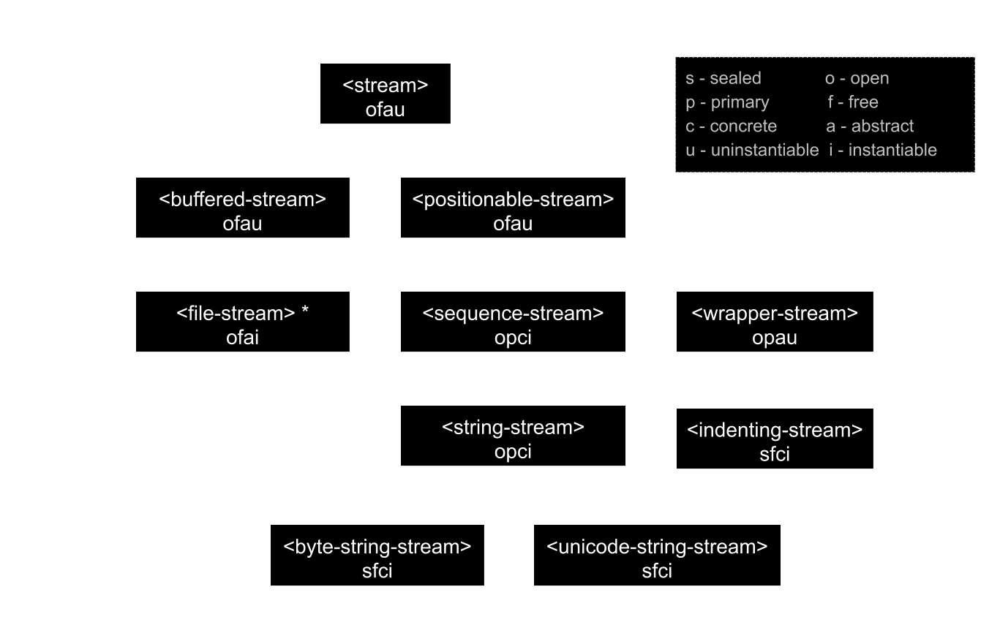

******************
The streams Module
******************

.. current-library:: io
.. current-module:: streams

.. TODO: I notice that with-*-to-string and stream-limit aren't documented.
   Need to do a comprehensive check of what's in the module exports.

This document describes the Streams module, which allows you to establish
and control input to and output from aggregates of data, such as files
on disk, or sequences. This module, together with the Standard-IO
module, provides similar functionality to the *java.io* package in Java.
See :doc:`standard-io`, for details about the Standard-IO module in Dylan.

`Concepts`_ discusses the basic concepts and terminology involved in streaming
over data.  `Stream classes`_ describes the different classes of stream
available, and how to create them, and `Reading from and writing to streams`_
describes how to read from and write to them.

More specialized subjects are covered next: `Locking streams`_ discusses
locking streams while they are in use; `Using buffered streams`_ describes
using buffered streams; `Wrapper streams`_ describes wrapper streams;
`Conditions`_ the different stream-specific error conditions that can be
raised. For the most part, you do not have to worry about the information in
these later sections when using streams.

Finally, `The streams Module Reference`_ gives complete details on all
interfaces in the Streams module, in alphabetical order.

Goals of this module
--------------------

- A generic, easy-to-use interface for streaming over aggregates of data. The
  same high-level interface for consuming or producing is available
  irrespective of the type of stream, or the types of the elements being
  streamed over.
- Efficiency, such that it may be used as a basis for the common cases of file
  and network I/O.
- Access to an underlying buffer management protocol.

Concepts
--------

A *stream* provides sequential access to an aggregate of data, such as a Dylan
:class:`<sequence>` or a disk file. Streams grant this access according to a
metaphor of *reading* and *writing*: elements can be read from streams or
written to them.

Streams are represented as general instances of the class :class:`<stream>`.
It is usual to say that a stream is established *over* the data
aggregate. Hence, a stream providing access to the string ``"hello world"`` is
said to be a stream over the string ``"hello world"``.

Streams permitting reading operations are called *input* streams. Input
streams allow elements from the underlying data aggregate to be
consumed. Conversely, streams permitting writing operations are called
*output* streams. Output streams allow elements to be written to the
underlying data aggregate. Streams permitting both kinds of operations
are called *input-output* streams.

Input Streams
^^^^^^^^^^^^^

The Streams module provides a set of functions for reading elements from
an input stream. These functions hide the details of indexing,
buffering, and so on. For instance, the function :gf:`read-element`
reads a single data element from an input stream.

The following expression binds *stream* to an input stream over the
string ``"hello world"``:

.. code-block:: dylan

    let stream = make(<string-stream>, contents: "hello world");

The first invocation of :gf:`read-element` on *stream* returns the
character "h", the next invocation "e", and so on. Once a stream has
been used to consume all the elements of the data, the stream is said to
be at its end. This condition can be tested with the function
:gf:`stream-at-end?`. The following code fragment applies *my-function*
to all elements of the sequence:

.. code-block:: dylan

    let stream = make(<sequence-stream>, contents: seq);
    while (~stream-at-end?(stream))
      my-function(read-element(stream));
    end;

When all elements of a stream have been read, further calls to
:gf:`read-element` result in an :class:`<end-of-stream-error>` condition being
signaled. Optionally, you may provide a distinguished value to return instead,
with the ``on-end-of-stream:`` parameter. This is often more concise and most
reading functions support it.

Output Streams
^^^^^^^^^^^^^^

The Streams module also provides a set of functions for writing data elements
to an output stream. Like the functions that operate upon input streams, these
functions hide the details of indexing, growing an underlying buffer, and so
on. For instance, the function :gf:`write-element` writes a single data element
to an output stream.

The following forms bind *stream* to an output stream over an empty
string and create the string "I see!", using the function
:gf:`stream-contents` to access all of the stream's elements.

.. code-block:: dylan

    let stream = make(<string-stream>, direction: #"output");
    write(stream, "I see!");
    stream-contents(stream);

Calling :gf:`write` on a sequence has the same effect as calling
:gf:`write-element` on all the elements of the sequence. For more
information about writing to streams, see `Writing to streams`_.

Positionable Streams
^^^^^^^^^^^^^^^^^^^^

Some streams are *positionable*; that is, any element of the stream can
be accessed at any time. Positionable streams allow you to set the
position at which the stream is accessed by the next operation. The
following example uses positioning to return the character "w" from a
stream over the string ``"hello world"``:

.. code-block:: dylan

    let stream = make(<string-stream>, contents: "hello world");
    stream-position(stream) := 6;
    read-element(stream);

The following example returns a string. The first ten characters are the
fill characters for the underlying sequence of the stream. The fill
character for :drm:`<string>` is " " (the space character), so in the
example below, the first ten characters are spaces.

.. code-block:: dylan

    let stream = make(<string-stream>, direction: #"output");
    adjust-stream-position(stream, 10);
    write(stream, "whoa!");
    stream-contents(stream);

You can request a sequence containing all of the elements of a
positionable stream by calling :gf:`stream-contents` on it. If the
positionable stream is a :class:`<file-stream>`, then it must be
readable. Otherwise, it must be a sequence stream. The sequence returned
never shares structure with any underlying sequence that might be used
in the future by the stream. For instance, the string returned by
calling :gf:`stream-contents` on an output :class:`<string-stream>` will
not be the same string as that being used to represent the string
stream.

When making an input :class:`<string-stream>`, you can cause the stream
to produce elements from any subsequence of the supplied string. For
example:

.. code-block:: dylan

    read-to-end(make(<string-stream>,
                     contents: "hello there, world",
                     start: 6,
                     end: 11));

This example evaluates to ``"there"``. The interval (*start*, *end*)
includes the index *start* but excludes the index *end*. This is
consistent with standard Dylan functions over sequences, such as
:drm:`copy-sequence`. The :gf:`read-to-end` function is one of a number
of convenient utility functions for operating on streams and returns all
the elements up to the end of the stream from the stream's current
position.

Stream classes
--------------

The exported streams class heterarchy includes the classes shown in
the image below. Classes shown in bold are all instantiable.

.. Original drawing:
   https://docs.google.com/drawings/d/1HGgJc2Ee-qFAPJqsYNGLhHTk8CmfxyWQdazuntLhcy4/
   There should be a link to request edit permission.

.. image:: ../images/streams.png
   :align: center
   :class: only-light

.. note:: :class:`<file-stream>` is included for completeness but is actually
   exported from the :doc:`file-system <../system/file-system>` module.

- :class:`<stream>`
- :class:`<positionable-stream>`
- :class:`<buffered-stream>`
- :class:`<file-stream>`
- :class:`<sequence-stream>`
- :class:`<string-stream>`
- :class:`<byte-string-stream>`
- :class:`<unicode-string-stream>`
- :class:`<wrapper-stream>`
- :class:`<indenting-stream>`

Sequence streams
^^^^^^^^^^^^^^^^

Dylan provides various functions for manipulating sequences, such as
:drm:`concatenate` and :drm:`copy-sequence`, but sometimes it can be useful to
use the streams model to create or consume sequences. For example, if you're
writing a library that reads bytes from a network socket you might write tests
that use a :class:`<sequence-stream>` over a :class:`<byte-vector>` to mock the
network stream.

String streams are the most commonly used type of sequence stream so there are
several features to make using them easier.

1. Calling ``make(<sequence-stream>, contents: "a string", direction: #"input")``
   returns a :class:`<string-stream>`.

2. :macro:`with-output-to-string` provides a convenient way to create a string
   using multiple calls to :gf:`format`.

3. :macro:`with-input-from-string` can be used to read the contents of a string.

4. :gf:`format-to-string` is implemented by making an output
   :class:`<string-stream>`, calling :gf:`format` on it, and then returning the
   stream contents.

Sequence streams and object identity
~~~~~~~~~~~~~~~~~~~~~~~~~~~~~~~~~~~~

When writing to output streams over sequences, Dylan may from time to
time need to grow the underlying sequence that it is using to represent
the stream data.

Consider the example of an output stream instantiated over an empty
string. As soon as a write operation is performed on the stream, it is
necessary to replace the string object used in the representation of the
string stream. As well as incurring the cost of creating a new string,
references to the string within the program after the replacement
operation has occurred will still refer to the *original* string, and
this may not be what the user intended.

To guarantee that other references to a sequence used in an output
:class:`<sequence-stream>` will have access to any elements written to the
sequence via the stream, supply a stretchy collection (such as a
:drm:`<stretchy-vector>`) to :drm:`make` when creating the stream. A stream
over a stretchy vector will use the same stretchy vector throughout the
stream's existence.

For example:

.. code-block:: dylan

    let v = make(<stretchy-vector>);
    let stream = make(<sequence-stream>,
                      contents: v,
                      direction: #"output");
    write(stream, #(1, 2, 3));
    write(stream, "ABC");
    values(v, stream-contents(stream));

The example returns two values. Each value is the same (:drm:`==`) stretchy
vector:

.. code-block:: dylan

    #[1, 2, 3, 'A', 'B', 'C']
    #[1, 2, 3, 'A', 'B', 'C']

If a stretchy vector is not supplied, the result is different:

.. code-block:: dylan

    let v = make(<vector>, size: 5);
    let stream = make(<sequence-stream>,
                      contents: v,
                      direction: #"output");
    write(stream, #(1, 2, 3));
    write(stream, "ABC");
    values(v, stream-contents(stream));

This example returns as its first value the original vector, which was
initially filled with all :drm:`#f` and then with the values from the first call
to :gf:`write`, but the second value is a new vector that had to be allocated
on the second call to :gf:`write`:

.. code-block:: dylan

   #[1, 2, 3, #f, #f]
   #[1, 2, 3, 'A', 'B', 'C']

This difference arises because the output stream in the second example does not
use a stretchy vector to hold the stream data. A vector of at least 6 elements
is necessary to accommodate the elements written to the stream, but ``v`` can
hold only 5. Since the stream cannot change ``v``'s size, it must allocate a new
vector each time it grows.

Closing streams
^^^^^^^^^^^^^^^

It is important to call :gf:`close` on streams when you have finished with
them. Typically, external streams such as :class:`<file-stream>` and
:class:`<console-stream>` allocate underlying system resources when they are
created, and these resources are not recovered until the stream is closed.

A common way to ensure that :gf:`close` is called is to use the ``cleanup``
clause of the :drm:`block` macro. For example:

.. code-block:: dylan

   let stream = open-my-stream(...);
   block ()
     ...read or write to stream...
   cleanup
     close(stream);
   end

To make this easier, and so you're less likely to forget to call :gf:`close`,
most libraries that provide stream classes provide a macro. For example,
:macro:`with-open-file` for file streams, ensures that :gf:`close` is called:

.. code-block:: dylan

   with-open-file (stream = "/my/file")
     ...read or write to stream...
     // close(stream) is called automatically
   end

with-output-to-string / with-input-from-string macros
^^^^^^^^^^^^^^^^^^^^^^^^^^^^^^^^^^^^^^^^^^^^^^^^^^^^^

The macro :macro:`with-output-to-string` provides a convenient way of
returning a :drm:`<string>` after performing a series of operations on a
:class:`<stream>`, and then close the stream.

Instead of writing this code:

.. code-block:: dylan

   let stream = make(<string-stream>, direction: #"output");
   write-element(stream, 'O');
   write-element(stream, 'k');
   contents(stream);

we can write:

.. code-block:: dylan

   with-output-to-string (stream)
     write-element(stream, 'O');
     write-element(stream, 'k');
   end;

The symmetric macro :macro:`with-input-from-string` creates a
:class:`<string-stream>` with direction `#"input"`, provides an
opportunity to perform operations and closes the stream.

For instance:

.. code-block:: dylan

   with-input-from-string (stream = "Foobar")
     for (i from 0,
          char = read-element(stream, on-end-of-stream: #f)
          then   read-element(stream, on-end-of-stream: #f),
          while: char)
       format-out("%d: %c\n", i, char)
     end;
   end;

   // 0: F
   // 1: o
   // 2: o
   // 3: b
   // 4: a
   // 5: r

will replace:

.. code-block:: dylan

   let s = make(<string-stream>, contents: "Foobar", direction: #"input");
   for (i from 0,
        char = read-element(s, on-end-of-stream: #f)
        then   read-element(s, on-end-of-stream: #f),
        while: char)
     format-out("%d: %c\n", i, char)
   end;
   close(s);

Locking streams
^^^^^^^^^^^^^^^

In an application where more than one thread may access a shared stream, it is
important to match the granularity of locking to the transaction model of the
application. Ideally, an application should lock a stream only once per
transaction, to minimize the performance penalty. Since the streams module
cannot know the transaction model of your code, it does not provide any
default locking scheme.

Instead, the streams module provides the user with a single, per-instance slot,
:gf:`stream-lock`, which is inherited by all subclasses of :class:`<stream>`.
You may provide a lock via the ``stream-lock:`` init keyword when creating the
stream, or set it with :gf:`lock-stream-setter`. Thereafter use
:gf:`lock-stream` and :gf:`unlock-stream` or the :macro:`with-stream-locked`
macro, together with other appropriate functions and macros from the
:doc:`threads <../dylan/threads>` module, to implement a locking strategy
appropriate to your application.

The functions in the streams module are not of themselves thread safe, and make
no guarantees about the atomicity of read and write operations.

Reading from and writing to streams
-----------------------------------

This section describes how you can read from or write to a stream. Note that
the result is undefined if you call any of these functions on a buffered stream
while its buffer is held by another thread; see `Using buffered streams`_ for
details about buffered streams.

Reading from streams
^^^^^^^^^^^^^^^^^^^^

The following are the basic functions for reading from streams.

- :gf:`read-element`
- :gf:`read`

A number of other functions are available for reading from streams. See
:gf:`peek`, :gf:`read-into!`, :gf:`discard-input`, and
:gf:`stream-input-available?`.

Convenience functions for reading from streams
^^^^^^^^^^^^^^^^^^^^^^^^^^^^^^^^^^^^^^^^^^^^^^

The following is a small set of reading functions that search for
particular elements in a stream. These functions behave as though they
were implemented in terms of the more primitive functions described in
`Reading from streams`_.

- :gf:`read-to`
- :gf:`read-to-end`
- :gf:`skip-through`

Writing to streams
^^^^^^^^^^^^^^^^^^

This section describes the basic functions for writing to streams.

- :gf:`write-element`
- :gf:`write`

See :gf:`force-output`, :gf:`synchronize-output`, and
:gf:`discard-output`.

Reading and writing by lines
^^^^^^^^^^^^^^^^^^^^^^^^^^^^

The following functions provide line-based input and output operations.

The newline sequence for string streams is a sequence comprising the
single newline character ``\n``. For character file streams, the newline
sequence is whatever sequence of characters the underlying platform uses
to represent a newline. For example, on MS-DOS platforms, the sequence
comprises two characters: a carriage return followed by a linefeed.

.. note:: No other functions in the Streams module do anything to
   manage the encoding of newlines; calling :gf:`write-element` on the
   character ``\n`` does not cause the ``\n`` character to be written as
   the native newline sequence, unless ``\n`` happens to *be* the native
   newline sequence.

- :gf:`read-line`
- :gf:`write-line`
- :gf:`new-line`

See also :gf:`read-line-into!`.

Querying streams
^^^^^^^^^^^^^^^^

The following functions can be used to determine various properties of a
stream.

- :gf:`stream-open?`
- :gf:`stream-element-type`
- :gf:`stream-at-end?`

For output streams, note that you can determine if a stream is one place
past the last written element by comparing :gf:`stream-position` to
:gf:`stream-size`.

Using file streams
^^^^^^^^^^^^^^^^^^

The following operations can be performed on file streams.

- :meth:`close(<file-stream>)`
- :gf:`stream-console?`
- :gf:`wait-for-io-completion`
- :macro:`with-open-file`

Using buffered streams
----------------------

The Streams module provides efficient support for general use of
buffered I/O. Most ordinary programmers using the module do not need to
be concerned with buffering in most cases. When using buffered streams,
the buffering is transparent, but programs requiring more control can
access buffering functionality when appropriate. This section describes
the available buffering functionality.

Overview
^^^^^^^^

A buffered stream maintains some sort of buffer. All buffered streams
use the sealed class :class:`<buffer>` for their buffers. You can
suggest a buffer size when creating buffered streams, but normally you
do not need to do so, because a buffer size that is appropriate for the
stream's source or destination is chosen for you.

Instances of the class :class:`<buffer>` also contain some state
information. This state information includes an index where reading or
writing should begin, and an index that is the end of input to be read,
or the end of space available for writing.

Buffered streams also maintain a *held* state, indicating whether the
application has taken the buffer for a stream and has not released it yet. When
a thread already holds the buffer for a stream, any attempt to get the buffer
again (or any other buffer for the same stream) has undefined results.

Useful types when using buffers
^^^^^^^^^^^^^^^^^^^^^^^^^^^^^^^

The following types are used in operations that involve buffers.

:type:`<byte>`
   A type representing limited integers in the range 0 to 255 inclusive.

:type:`<byte-character>`
   A type representing 8-bit characters that instances of
   :drm:`<byte-string>` can contain.

:type:`<unicode-character>`
   A type representing Unicode characters that instances of
   :drm:`<unicode-string>` can contain.

:type:`<byte-vector>`
   A subtype of :drm:`<vector>` whose element-type is :type:`<byte>`.

Wrapper streams
---------------

Sometimes stream data requires conversion before an application can use it: you
might have a stream over a file of UTF-8 bytes which you would prefer to handle
as UTF-32 equivalents, or you might need to encrypt or decrypt file data.

Wrapper streams provide a mechanism for working with streams which
require such conversion. Wrapper streams hold on to an underlying
stream, delegating to it most streams operations. The wrapper stream
carries out appropriate processing in its own implementations of the
streaming protocol.

The Streams module includes a base class called
:class:`<wrapper-stream>` upon which other wrapping streams can be
implemented.

A subclass of :class:`<wrapper-stream>` can "pass on" functions such as
:gf:`read-element` and :gf:`write-element` by simply delegating these
operations to the inner stream, as shown below:

.. code-block:: dylan

    define method read-element
        (ws :: <io-wrapper-stream>, #key on-end-of-stream)
     => (element)
      read-element(ws.inner-stream, on-end-of-stream: on-end-of-stream)
    end method;

    define method write-element
        (ws :: <io-wrapper-stream>, element)
     => ()
      write-element(ws.inner-stream, element)
    end method;

Assuming that ``<io-wrapper-stream>`` delegates all other operations to
its inner stream, the following would suffice to implement a 16-bit
Unicode character stream wrapping an 8-bit character stream.

.. code-block:: dylan

    define class <unicode-stream> (<io-wrapper-stream>) end class;

    define method read-element (s :: <unicode-stream>,
      #key on-end-of-stream)
     => (ch :: <unicode-character>)
      let first-char = read-element(s.inner-stream,
                                    on-end-of-stream);
      let second-char = read-element(s.inner-stream,
                                     on-end-of-stream)
      convert-byte-pair-to-unicode(first-char, second-char)
    end method;

    define method write-element (s :: <unicode-stream>,
      c :: <character>)
     => ()
      let (first-char, second-char) =
        convert-unicode-to-byte-pair(c);
      write-element(s.inner-stream, first-char);
      write-element(s.inner-stream, second-char)
      c
    end method;

    define method stream-position (s :: <unicode-stream>)
     => p :: <integer>;
      truncate/(stream-position(s.inner-stream), 2)
    end method;

    define method stream-position-setter (p :: <integer>,
        s :: <unicode-stream>);
      stream-position(s.inner-stream) := p * 2
    end method;

Wrapper streams and delegation
^^^^^^^^^^^^^^^^^^^^^^^^^^^^^^

One problem with wrapper streams is the need for a wrapper stream to
intercept methods invoked by its inner stream. For example, consider two
hypothetical streams, ``<interactive-stream>`` and ``<dialog-stream>``,
the latter a subclass of :class:`<wrapper-stream>`. Both of these
classes have a method called *prompt*. The ``<interactive-stream>``
class specializes :gf:`read` thus:

.. code-block:: dylan

    define method read (s :: <interactive-stream>,
        n :: <integer>,
        #key on-end-of-stream);
      prompt(s);
      next-method()
    end method;

If a ``<dialog-stream>`` is used to wrap an ``<interactive-stream>`` then
an invocation of :gf:`read` on the ``<dialog-stream>`` will call ``prompt`` on
the inner ``<interactive-stream>``, not on the ``<dialog-stream>``, as desired.
The problem is that the ``<dialog-stream>`` delegates some tasks to its inner
stream, but handles some other tasks itself.

Delegation by inner-streams to outer-streams is implemented by the use
of the :gf:`outer-stream` function. The :gf:`outer-stream` function is used
instead of the stream itself whenever a stream invokes one of its
other protocol methods.

A correct implementation of the :gf:`read` method in the example above
would be as follows:

.. code-block:: dylan

    define method read (stream :: <interactive-stream>,
        n :: <integer>,
        #key on-end-of-stream)
      prompt(s.outer-stream);
      next-method()
    end method;

The *initialize* method on :class:`<stream>` is defined to set the
:gf:`outer-stream` slot to be the stream itself. The *initialize* method
on :class:`<wrapper-stream>` is specialized to set the
:gf:`outer-stream` slot to be the "parent" stream:

.. code-block:: dylan

    define method initialize (stream :: <wrapper-stream>,
        #key on, #rest all-keys);
      an-inner-stream.outer-stream := stream;
      next-method()
    end method;

Conditions
----------

The following classes are available for error conditions on streams.

- :class:`<end-of-stream-error>`
- :class:`<incomplete-read-error>`
- :class:`<file-error>`
- :class:`<file-exists-error>`
- :class:`<file-does-not-exist-error>`
- :class:`<invalid-file-permissions-error>`

There is no recovery protocol defined for any of these errors. Every
condition that takes an init-keyword has a slot accessor for the value
supplied. The name of this accessor function takes the form *class* *-*
*key*, where *class* is the name of the condition class (without the
angle brackets) and *key* is the name of the init-keyword. For example,
the accessor function for the ``locator:`` init-keyword for
:class:`<file-error>` is :gf:`file-error-locator`.

For more information, please refer to the reference entry for the
individual conditions.

Indenting streams
-----------------

The Streams module provides an :class:`<indenting-stream>` which supports
managing indentation when printing text to a stream. Indenting streams
are implemented as wrapper streams, so the destination stream must be
provided at instantiation.

.. code-block:: dylan

   let is = make(<indenting-stream>, inner-stream: *standard-output*);
   with-indentation(is, 4)
     // Write normally to the indenting stream.
     format(is, "Hello %=!\n", name);
   end with-indentation;

Indenting streams analyze everything written to them so that indentation
can be maintained, without having to call :gf:`new-line` directly.

Using indenting streams
^^^^^^^^^^^^^^^^^^^^^^^

All operations available to :class:`<wrapper-stream>` are available, as
well as:

* :gf:`indent`
* :macro:`with-indentation`

Streams protocols
-----------------

This section describes the protocols for different classes of stream.

Positionable stream protocol
^^^^^^^^^^^^^^^^^^^^^^^^^^^^

This section describes the protocol for positionable streams.

A stream position can be thought of as a natural number that indicates
how many elements into the stream the stream's current location is.
However, it is not always the case that a single integer contains enough
information to reposition a stream. Consider the case of an
"uncompressing" file stream that requires additional state beyond simply
the file position to be able to get the next input character from the
compressed file.

The Streams module addresses this problem by introducing the class
:class:`<stream-position>`, which is subclassed by various kinds of
stream implementations that need to maintain additional state. A stream
can be repositioned as efficiently as possible when
:gf:`stream-position-setter` is given a value previously returned by
:gf:`stream-position` on that stream.

It is also legal to set the position of a stream to an integer position.
However, for some types of streams, to do so might be slow, perhaps
requiring the entire contents of the stream up to that point to be read.

- :class:`<position-type>`
- :class:`<stream-position>`
- :gf:`stream-position`
- :gf:`stream-position-setter`
- :gf:`adjust-stream-position`
- :meth:`as(<integer>, <stream-position>)`
- :gf:`stream-size`
- :gf:`stream-contents`
- :gf:`unread-element`

Wrapper stream protocol
^^^^^^^^^^^^^^^^^^^^^^^

This section describes the protocol for implementing wrapper streams.
For information on using wrapper streams, see `Wrapper streams`_.

- :class:`<wrapper-stream>`
- :gf:`inner-stream`
- :gf:`inner-stream-setter`
- :gf:`outer-stream`
- :gf:`outer-stream-setter`

The streams Module Reference
----------------------------

This section includes complete reference entries for all interfaces that
are exported from the *streams* module.

.. generic-function:: adjust-stream-position
   :open:

   Moves the position of a positionable stream by a specified amount.

   :signature: adjust-stream-position *positionable-stream* *delta* #key *from* => *new-position*

   :parameter positionable-stream: An instance of :class:`<positionable-stream>`.
   :parameter delta: An instance of :drm:`<integer>`.
   :parameter #key from: One of ``#"current"``, ``#"start"``, or
     ``#"end"``. Default value: ``#"current"``.
   :value new-position: An instance of :class:`<stream-position>`.

   :description:

     Moves the position of *positionable-stream* to be offset *delta*
     elements from the position indicated by *from*. The new position is
     returned.

     When *from* is ``#"start"``, the stream is positioned relative to
     the beginning of the stream. When *from* is ``#"end"``, the stream
     is positioned relative to its end. When *from* is ``#"current"``,
     the current position is used.

     Using *adjust-stream-position* to set the position of a stream to
     be beyond its current last element causes the underlying aggregate
     to be grown to a new size. When extending the underlying aggregate
     for a stream, the contents of the unwritten elements are the fill
     character for the underlying sequence.

   :example:

     The following example returns a string, the first ten characters of
     which are the space character, which is the fill character for the
     sequence :drm:`<string>`.

     .. code-block:: dylan

       let stream = make(<string-stream>,
                         direction: #"output");
       adjust-stream-position(stream, 10);
       write(stream, "whoa!");
       stream-contents(stream);

   :seealso:

     - :gf:`stream-position-setter`

.. method:: as
   :specializer: <integer>, <stream-position>

   Coerces a :class:`<stream-position>` to an integer.

   :signature: as *integer-class* *stream-position* => *integer*

   :parameter integer-class: The class :drm:`<integer>`.
   :parameter stream-position: An instance of :class:`<stream-position>`.
   :value integer: An instance of :drm:`<integer>`.

   :description:

     Coerces a :class:`<stream-position>` to an integer. The *integer-class*
     argument is the class :drm:`<integer>`.

   :seealso:

     - :drm:`as`

.. class:: <buffer>
   :sealed:
   :instantiable:

   A subclass of :drm:`<vector>` whose *element-type* is :type:`<byte>`.

   :superclasses: :drm:`<vector>`

   :keyword size: An instance of :drm:`<integer>` specifying the size of
     the buffer. Default value: 0.
   :keyword next: An instance of :drm:`<integer>`. For an input buffer,
     this is where the next input byte can be found. For an output buffer,
     this is where the next output byte should be written to. Default
     value: 0.
   :keyword end: An instance of :drm:`<integer>`. The value of this is one
     more than the last valid index in a buffer. For an input buffer, this
     represents the number of bytes read.

   :description:

     A subclass of :drm:`<vector>` whose *element-type* is :type:`<byte>`.

     Instances of :class:`<buffer>` contain a data vector and two indices:
     the inclusive start and the exclusive end of valid data in the
     buffer. The accessors for these indexes are called ``buffer-next``
     and ``buffer-end``.

     Note that ``size:`` is not taken as a suggestion of the size the user
     would like, as with the value passed with ``buffer-size:`` to :drm:`make`
     on :class:`<buffered-stream>`; if you supply a value with the ``size:``
     init-keyword, that size is allocated, or, if that is not possible, an
     error is signalled, as when making any vector.

.. class:: <buffered-stream>
   :open:
   :abstract:

   A subclass of :class:`<stream>` supporting the Stream Extension and
   Buffer Access protocols.

   :superclasses: :class:`<stream>`

   :keyword buffer-size: An instance of :drm:`<integer>`. This is the size
     of the buffer in bytes.

   :description:

     A subclass of :class:`<stream>` supporting the Stream Extension
     Protocol and the Buffer Access Protocol. It is not instantiable.

     Streams of this class support the ``buffer-size:`` init-keyword,
     which can be used to suggest the size of the stream's buffer.
     However, the instantiated stream might not use this value: it is
     taken purely as a suggested value. For example, a stream that uses
     a specific device's hardware buffer might use a fixed buffer size
     regardless of the value passed with the ``buffer-size:``
     init-keyword.

     In general, it should not be necessary to supply a value for the
     ``buffer-size:`` init-keyword.

.. type:: <byte>

   :type:    A type representing limited integers in the range 0 to 255 inclusive.

   :supertypes: :drm:`<integer>`

   :description:

      A type representing limited integers in the range 0 to 255 inclusive.

   :operations:

     - :gf:`type-for-file-stream`

.. type:: <byte-character>

   :type:    A type representing 8-bit characters that instances of :drm:`<byte-string>` can contain.

   :supertypes: :drm:`<character>`

   :description:

      A type representing 8-bit characters that instances of :drm:`<byte-string>`
      can contain.

   :operations:

     - :gf:`type-for-file-stream`

.. method:: byte-storage-address
   :specializer: <buffer>
   :sealed:

   Returns the address of the raw byte storage of a :class:`<buffer>`.

   :seealso:

     - :gf:`byte-storage-address`

.. method:: byte-storage-offset-address
   :specializer: <buffer>
   :sealed:

   Returns the address of the raw byte storage of a :class:`<buffer>`, with an offset.

   :seealso:

     - :gf:`byte-storage-offset-address`

.. class:: <byte-string-stream>
   :open:
   :instantiable:

   The class of streams over byte strings.

   :superclasses: :class:`<string-stream>`

   :keyword contents: A general instance of :drm:`<sequence>`.
   :keyword direction: Specifies the direction of the stream. It must
     be one of ``#"input"``, ``#"output"``, or ``#"input-output"``.
     Default value: ``#"input"``.
   :keyword start: An instance of :drm:`<integer>`. This specifies the
     start position of the sequence to be streamed over. Only valid when
     ``direction:`` is ``#"input"``. Default value: 0.
   :keyword end: An instance of :drm:`<integer>`. This specifies the
     sequence position immediately after the portion of the sequence to
     stream over. Only valid when ``direction:`` is ``#"input"``. Default
     value: *contents.size*.

   :description:

     The class of streams over byte strings. It is a subclass of
     :class:`<string-stream>`.

     The class supports the same init-keywords as
     :class:`<sequence-stream>`.

     The ``contents:`` init-keyword is used as the input for an input
     stream, and as the initial storage for an output stream.

     The ``start:`` and ``end:`` init-keywords specify the portion of the
     byte string to create the stream over: ``start:`` is inclusive and
     ``end:`` is exclusive. The default is to stream over the entire byte
     string.

   :operations:

     - :meth:`make(<byte-string-stream>)`

   :seealso:

     - :meth:`make(<byte-string-stream>)`
     - :class:`<sequence-stream>`

.. class:: <byte-vector>
   :sealed:

   A subtype of :drm:`<vector>` whose element-type is :type:`<byte>`.

   :superclasses: :drm:`<vector>`

   :keyword: See Superclasses.

   :description:

     A subclass of :drm:`<vector>` whose element-type is :type:`<byte>`.

   :seealso:

     - :type:`<byte>`

.. generic-function:: close
   :open:

   Closes a stream.

   :signature: close *stream* #key #all-keys => ()

   :parameter stream: An instance of :class:`<stream>`.

   :description:

     Closes *stream*, an instance of :class:`<stream>`.

.. method:: close
   :specializer: <file-stream>

   Closes a file stream.

   :signature: close *file-stream* #key *abort?* *wait?* => ()

   :parameter file-stream: An instance of :class:`<file-stream>`.
   :parameter #key abort?: An instance of :drm:`<boolean>`. Default value: :drm:`#f`.
   :parameter #key wait?: An instance of :drm:`<boolean>`.

   :description:

     Closes a file stream. This method frees whatever it can of any
     underlying system resources held on behalf of the stream.

     If *abort* is false, any pending data is forced out and
     synchronized with the file's destination. If *abort* is true, then
     any errors caused by closing the file are ignored.

   :seealso:

     - :gf:`close`

.. generic-function:: discard-input
   :open:

   Discards input from an input stream.

   :signature: discard-input *input-stream* => ()

   :parameter input-stream: An instance of :class:`<stream>`.

   :description:

     Discards any pending input from *input-stream*, both buffered input
     and, if possible, any input that might be at the stream's source.

     This operation is principally useful for "interactive" streams,
     such as TTY streams, to discard unwanted input after an error
     condition arises. There is a default method on :class:`<stream>` so
     that applications can call this function on any kind of stream. The
     default method does nothing.

   :seealso:

     - :gf:`discard-output`

.. generic-function:: discard-output
   :open:

   Discards output to an output stream.

   :signature: discard-output *output-stream* => ()

   :parameter output-stream: An instance of :class:`<stream>`.

   :description:

     Attempts to abort any pending output for *output-stream*.

     A default method on :class:`<stream>` is defined, so that
     applications can call this function on any sort of stream. The
     default method does nothing.

   :seealso:

     - :gf:`discard-input`

.. class:: <end-of-stream-error>

   Error type signaled on reaching the end of an input stream.

   :superclasses: :drm:`<error>`

   :keyword stream: An instance of :class:`<stream>`.

   :description:

     Signalled when one of the read functions reaches the end of an
     input stream. It is a subclass of :drm:`<error>`.

     The ``stream:`` init-keyword has the value of the stream that caused the
     error to be signaled. Its accessor is :gf:`stream-error-stream`.

   :seealso:

     - :class:`<file-does-not-exist-error>`
     - :class:`<file-error>`
     - :class:`<file-exists-error>`
     - :class:`<incomplete-read-error>`
     - :class:`<invalid-file-permissions-error>`

.. class:: <file-does-not-exist-error>

   Error type signaled when attempting to read a file that does not exist.

   :superclasses: :class:`<file-error>`

   :keyword: See Superclasses.

   :description:

     Signaled when an input file stream creation function tries to read
     a file that does not exist. It is a subclass of
     :class:`<file-error>`.

   :seealso:

     - :class:`<end-of-stream-error>`
     - :class:`<file-error>`
     - :class:`<file-exists-error>`
     - :class:`<incomplete-read-error>`
     - :class:`<invalid-file-permissions-error>`
     - :gf:`file-error-locator`

.. class:: <file-error>

   The base class for all errors related to file I/O.

   :superclasses: :drm:`<error>`

   :keyword locator: An instance of :class:`<locator>`.

   :description:

     The base class for all errors related to file I/O. It is a subclass
     of :drm:`<error>`.

     The ``locator:`` init-keyword indicates the locator of the file that caused
     the error to be signalled. Its accessor is :gf:`file-error-locator`.

   :seealso:

     - :class:`<end-of-stream-error>`
     - :class:`<file-does-not-exist-error>`
     - :class:`<file-exists-error>`
     - :class:`<incomplete-read-error>`
     - :class:`<invalid-file-permissions-error>`
     - :gf:`file-error-locator`

.. generic-function:: file-error-locator
   :sealed:

   Returns the :class:`<file-locator>` of the file associated with a
   :class:`<file-error>`.

   :signature: file-error-locator *error* => *locator*

   :parameter error: An instance of :class:`<file-error>`.
   :value locator: An instance of :class:`<file-locator>`.

.. class:: <file-exists-error>

   Error type signaled when trying to create a file that already exists.

   :superclasses: :class:`<file-error>`

   :keyword: See Superclasses.

   :description:

     Signalled when an output file stream creation function tries to
     create a file that already exists. It is a subclass of
     :class:`<file-error>`.

   :seealso:

     - :class:`<end-of-stream-error>`
     - :class:`<file-does-not-exist-error>`
     - :class:`<file-error>`
     - :class:`<incomplete-read-error>`
     - :class:`<invalid-file-permissions-error>`
     - :gf:`file-error-locator`

.. class:: <file-stream>
   :open:
   :abstract:
   :instantiable:

   The class of single-buffered streams over disk files.

   :superclasses: :class:`<buffered-stream>`, :class:`<positionable-stream>`

   :keyword locator: An instance of :drm:`<string>` or :class:`<locator>`. This
     specifies the file over which to stream.
   :keyword direction: Specifies the direction of the stream. It must be one of
     ``#"input"``, ``#"output"``, or ``#"input-output"``. Default value:
     ``#"input"``.
   :keyword if-exists: One of :drm:`#f`, ``#"new-version"``,
     ``#"overwrite"``, ``#"replace"``, ``#"append"``, ``#"truncate"``,
     ``#"signal"``. Default value: :drm:`#f`.
   :keyword if-does-not-exist: One of :drm:`#f`, ``#"signal"``, or
     ``#"create"``. Default value: depends on the value of ``direction:``.
   :keyword asynchronous?: If :drm:`#t`, all writes on this stream are
     performed asynchronously. Default value::drm:`#f`.

   :description:

     The class of single-buffered streams over disk files. It is a
     subclass of :class:`<positionable-stream>` and
     :class:`<buffered-stream>`.

     When you instantiate this class, an indirect instance of it is
     created. The file being streamed over is opened immediately upon
     creating the stream.

     The class supports several init-keywords: ``locator:``, ``direction:``,
     ``if-exists:``, and ``if-does-not-exist:``.

   :operations:

     - :meth:`close(<file-stream>)`
     - :meth:`make(<file-stream>)`

   :seealso:

     - :meth:`make(<file-stream>)`

.. generic-function:: force-output
   :open:

   Forces pending output from an output stream buffer to its destination.

   :signature: force-output *output-stream* #key *synchronize?* => ()

   :parameter output-stream: An instance of :class:`<stream>`.
   :parameter #key synchronize?: An instance of :drm:`<boolean>`. Default value: :drm:`#f`.

   :description:

     Forces any pending output from *output-stream* 's buffers to its
     destination. Even if the stream is asynchronous, this call waits
     for all writes to complete. If *synchronize?* is true, also flushes
     the operating system's write cache for the file so that all data is
     physically written to disk. This should only be needed if you're
     concerned about system failure causing loss of data.

   :seealso:

     - :gf:`synchronize-output`

.. class:: <incomplete-read-error>

   Error type signaled on encountering the end of a stream before
   reading the required number of elements.

   :superclasses: :class:`<end-of-stream-error>`

   :keyword sequence: An instance of :drm:`<sequence>`.
   :keyword count: An instance of :drm:`<integer>`.

   :description:

     This error is signaled when input functions are reading a required
     number of elements, but the end of the stream is read before
     completing the required read.

     The ``sequence:`` init-keyword contains the input that was read
     before reaching the end of the stream. Its accessor is
     ``incomplete-read-error-sequence``.

     The ``count:`` init-keyword contains the number of elements that were
     requested to be read. Its accessor is
     ``incomplete-read-error-count``.

   :seealso:

     - :class:`<end-of-stream-error>`
     - :class:`<file-does-not-exist-error>`
     - :class:`<file-error>`
     - :class:`<file-exists-error>`
     - :class:`<invalid-file-permissions-error>`

.. class:: <indenting-stream>
   :sealed:
   :instantiable:

   A wrapper stream which outputs indented text.

   :superclasses: :class:`<wrapper-stream>`

   :keyword inner-stream: An instance of :class:`<stream>`. Inherited from
     :class:`<wrapper-stream>`.
   :keyword indentation: An instance of :drm:`<integer>`.
     Default value is ``0``.
   :keyword input-tab-width: An instance of :drm:`<integer>`.
     Default value is ``8``.
   :keyword output-tab-width: An instance of :drm:`#f` or :drm:`<integer>`.
     Default value is :drm:`#f`.

   :description:

      A wrapper stream which outputs indented text.

      The initial indentation is controlled by ``indentation:``.

      When ``output-tab-width:`` is not false, then the indenting stream
      converts sequences of spaces used for indentation to tabs.

   :operations:

     * :gf:`indent`
     * :macro:`with-indentation`

.. generic-function:: indent

   Alters the indentation level of an :class:`<indenting-stream>`.

   :signature: indent *stream* *delta* => ()

   :parameter stream: An instance of :class:`<indenting-stream>`.
   :parameter delta: An instance of :drm:`<integer>`.

   :example:

     .. code-block:: dylan

        let is = make(<indenting-stream>, inner-stream: *standard-output*);
        indent(is, 4);
        format(is, "Hello, %=\n", name);
        indent(is, -4);

   :seealso:

     * :class:`<indenting-stream>`
     * :macro:`with-indentation`

.. generic-function:: inner-stream
   :open:

   Returns the stream being wrapped.

   :signature: inner-stream *wrapper-stream* => *wrapped-stream*

   :parameter wrapper-stream: An instance of :class:`<wrapper-stream>`.
   :value wrapped-stream: An instance of :class:`<stream>`.

   :description:

     Returns the stream wrapped by *wrapper-stream*.

   :seealso:

     - :gf:`inner-stream-setter`
     - :gf:`outer-stream`
     - :class:`<wrapper-stream>`

.. generic-function:: inner-stream-setter
   :open:

   Wraps a stream with a wrapper stream.

   :signature: inner-stream-setter *stream* *wrapper-stream* => *stream*

   :parameter stream: An instance of :class:`<stream>`.
   :parameter wrapper-stream: An instance of :class:`<wrapper-stream>`.
   :value stream: An instance of :class:`<stream>`.

   :description:

     Wraps *stream* with *wrapper-stream*. It does so by setting the
     :gf:`inner-stream` slot of *wrapper-stream* to *stream*, and the
     :gf:`outer-stream` slot of *stream* to *wrapper-stream*.

     .. note:: Applications should not set ``inner-stream`` and
        ``outer-stream`` slots directly. The ``inner-stream-setter``
        function is for use only when implementing stream classes.

   :seealso:

     - :gf:`inner-stream`
     - :gf:`outer-stream-setter`

.. class:: <invalid-file-permissions-error>

   Error type signalled when accessing a file in a way that conflicts
   with the permissions of the file.

   :superclasses: :class:`<file-error>`

   :keyword: See Superclasses.

   :description:

     Signalled when one of the file stream creation functions tries to access
     a file in a manner for which the user does not have permission. It is a
     subclass of :class:`<file-error>`.

   :seealso:

     - :class:`<end-of-stream-error>`
     - :class:`<file-does-not-exist-error>`
     - :class:`<file-error>`
     - :class:`<file-exists-error>`
     - :class:`<incomplete-read-error>`

.. generic-function:: lock-stream
   :open:

   Locks a stream.

   :signature: lock-stream *stream*

   :parameter stream: An instance of :class:`<stream>`.

   :description:

     Locks a stream. It is suggested that :macro:`with-stream-locked`
     be used instead of direct usages of :gf:`lock-stream` and
     :gf:`unlock-stream`.

     See `Locking streams`_ for more detail and discussion on using
     streams from multiple threads.

   :seealso:

     - :gf:`stream-lock`
     - :gf:`stream-lock-setter`
     - :gf:`unlock-stream`
     - :macro:`with-stream-locked`

.. method:: make
   :specializer: <byte-string-stream>

   Creates and opens a stream over a byte string.

   :signature: make *byte-string-stream-class* #key *contents* *direction* *start* *end* => *byte-string-stream-instance*

   :parameter byte-string-stream-class: The class :class:`<byte-string-stream>`.
   :parameter #key contents: An instance of :drm:`<string>`.
   :parameter #key direction: One of ``#"input"``, ``#"output"``, or
     ``#"input-output"``. Default value: ``#"input"``.
   :parameter #key start: An instance of :drm:`<integer>`. Default value: 0.
   :parameter #key end: An instance of :drm:`<integer>`. Default value: *contents.size*.
   :value byte-string-stream-instance: An instance of :class:`<byte-string-stream>`.

   :description:

     Creates and opens a stream over a byte string.

     This method returns an instance of :class:`<byte-string-stream>`.
     If supplied, *contents* describes the contents of the stream. The
     *direction*, *start*, and *end* init-keywords are as for
     :meth:`make <make(<sequence-stream>)>` on
     :class:`<sequence-stream>`.

   :example:

     .. code-block:: dylan

       let stream = make(<byte-string-stream>,
                         direction: #"output");

   :seealso:

     - :class:`<byte-string-stream>`
     - :meth:`make(<sequence-stream>)`

.. method:: make
   :specializer: <sequence-stream>

   Creates and opens a stream over a sequence.

   :signature: make *sequence-stream-class* #key *contents* *direction* *start* *end* => *sequence-stream-instance*

   :parameter sequence-stream-class: The class :class:`<sequence-stream>`.
   :parameter #key contents: An instance of :drm:`<string>`.
   :parameter #key direction: One of ``#"input"``, ``#"output"``, or
     ``#"input-output"``. Default value: ``#"input"``.
   :parameter #key start: An instance of :drm:`<integer>`. Default value: 0.
   :parameter #key end: An instance of :drm:`<integer>`. Default value: *contents.size*.
   :value sequence-stream-instance: An instance of :class:`<sequence-stream>`.

   :description:

     Creates and opens a stream over a sequence.

     This method returns a general instance of
     :class:`<sequence-stream>`. To determine the concrete subclass to
     be instantiated, this method calls the generic function
     :gf:`type-for-sequence-stream`.

     The *contents* init-keyword is a general instance of :drm:`<sequence>`
     which is used as the input for input streams, and as the initial
     storage for an output stream. If *contents* is a stretchy vector,
     then it is the only storage used by the stream.

     The *direction* init-keyword specifies the direction of the stream.

     The *start* and *end* init-keywords are only valid when *direction*
     is ``#"input"``. They specify the portion of the sequence to create
     the stream over: *start* is inclusive and *end* is exclusive. The
     default is to stream over the entire sequence.

   :example:

     .. code-block:: dylan

       let sv = make(<stretchy-vector>);
       let stream = make(<sequence-stream>,
                         contents: sv,
                         direction: #"output");
       write(stream,#(1, 2, 3, 4, 5, 6, 7, 8, 9));
       write(stream,"ABCDEF");
       values(sv, stream-contents(stream));

   :seealso:

     - :class:`<sequence-stream>`
     - :gf:`type-for-sequence-stream`

.. method:: make
   :specializer: <string-stream>

   Creates and opens a stream over a string.

   :signature: make *string-stream-class* #key *contents* *direction* *start* *end* => *string-stream-instance*

   :parameter string-stream-class: The class :class:`<string-stream>`.
   :parameter #key contents: An instance of :drm:`<string>`.
   :parameter #key direction: One of ``#"input"``, ``#"output"``, or
     ``#"input-output"``. Default value: ``#"input"``.
   :parameter #key start: An instance of :drm:`<integer>`. Default value: 0.
   :parameter #key end: An instance of :drm:`<integer>`. Default value: *contents.size*.
   :value string-stream-instance: An instance of :class:`<string-stream>`.

   :description:

     Creates and opens a stream over a string.

     This method returns an instance of :class:`<string-stream>`. If
     supplied, *contents* describes the contents of the stream. The
     *direction*, *start*, and *end* init-keywords are as for
     :meth:`make <make(<sequence-stream>)>` on
     :class:`<sequence-stream>`.

   :example:

     .. code-block:: dylan

       let stream = make(<string-stream>,
                         contents: "here is a sequence");

   :seealso:

     - :meth:`make(<sequence-stream>)`
     - :class:`<string-stream>`

.. method:: make
   :specializer: <unicode-string-stream>

   Creates and opens a stream over a Unicode string.

   :signature: make *unicode-string-stream-class* #key *contents* *direction* *start* *end* => *unicode-string-stream-instance*

   :parameter unicode-string-stream-class: The class :class:`<unicode-string-stream>`.
   :parameter #key contents: An instance of :drm:`<unicode-string>`.
   :parameter #key direction: One of ``#"input"``, ``#"output"``, or
     ``#"input-output"``. Default value: ``#"input"``.
   :parameter #key start: An instance of :drm:`<integer>`. Default value: 0.
   :parameter #key end: An instance of :drm:`<integer>`. Default value: *contents.size*.
   :value unicode-string-stream-instance: An instance of :class:`<unicode-string-stream>`.

   :description:

     Creates and opens a stream over a Unicode string.

     This method returns a new instance of
     :class:`<unicode-string-stream>`. If supplied, *contents* describes
     the contents of the stream, and must be an instance of
     :drm:`<unicode-string>`. The *direction*, *start*, and *end*
     init-keywords are as for :meth:`make <make(<sequence-stream>)>` on
     :class:`<sequence-stream>`.

   :seealso:

     - :meth:`make(<sequence-stream>)`
     - :class:`<unicode-string-stream>`

.. generic-function:: new-line
   :open:

   Writes a newline sequence to an output stream.

   :signature: new-line *output-stream* => ()

   :parameter output-stream: An instance of :class:`<stream>`.

   :description:

     Writes a newline sequence to *output-stream*.

     A method for ``new-line`` is defined on :class:`<string-stream>`
     that writes the character ``\n`` to the string stream.

.. generic-function:: outer-stream
   :open:

   Returns a stream's wrapper stream.

   :signature: outer-stream *stream* => *wrapping-stream*

   :parameter stream: An instance of :class:`<stream>`.
   :value wrapping-stream: An instance of :class:`<wrapper-stream>`.

   :description:

     Returns the stream that is wrapping *stream*.

   :seealso:

     - :gf:`inner-stream`
     - :gf:`outer-stream-setter`
     - :class:`<wrapper-stream>`

.. generic-function:: outer-stream-setter
   :open:

   Sets a stream's wrapper stream.

   :signature: outer-stream-setter *wrapper-stream* *stream* => *wrapper-stream*

   :parameter wrapper-stream: An instance of :class:`<wrapper-stream>`.
   :parameter stream: An instance of :class:`<stream>`.
   :value wrapper-stream: An instance of :class:`<wrapper-stream>`.

   :description:

     Sets the :gf:`outer-stream` slot of *stream* to *wrapper-stream*.

     .. note:: Applications should not set ``inner-stream`` and
        ``outer-stream`` slots directly. The ``outer-stream-setter``
        function is for use only when implementing stream classes.

   :seealso:

     - :gf:`inner-stream-setter`
     - :gf:`outer-stream`

.. generic-function:: peek
   :open:

   Returns the next element of a stream without advancing the stream
   position.

   :signature: peek *input-stream* #key *on-end-of-stream* => *element-or-eof*

   :parameter input-stream: An instance of :class:`<stream>`.
   :parameter #key on-end-of-stream: An instance of :drm:`<object>`.
   :value element-or-eof: An instance of :drm:`<object>`, or :drm:`#f`.

   :description:

     This function behaves as :gf:`read-element` does, but the stream
     position is not advanced.

   :seealso:

     - :gf:`read-element`

.. class:: <positionable-stream>
   :open:
   :abstract:

   The class of positionable streams.

   :superclasses: :class:`<stream>`

   :keyword: See Superclasses.

   :description:

     A subclass of :class:`<stream>` supporting the Positionable Stream
     Protocol. It is not instantiable.

   :operations:

     - :gf:`adjust-stream-position`
     - :gf:`stream-contents`
     - :gf:`stream-position`
     - :gf:`stream-position-setter`
     - :gf:`unread-element`

.. type:: <position-type>

   :type:    A type representing positions in a stream.

   :equivalent: ``type-union(<stream-position>, <integer>)``

   :supertypes: None.

   :description:

      A type used to represent a position in a stream. In practice, positions
      within a stream are defined as instances of :drm:`<integer>`, but this type,
      together with the :class:`<stream-position>` class, allows for cases where
      this might not be possible.

   :seealso:

     - :class:`<stream-position>`

.. generic-function:: read
   :open:

   Reads a number of elements from an input stream.

   :signature: read *input-stream* *n* #key *on-end-of-stream* => *sequence-or-eof*

   :parameter input-stream: An instance of :class:`<stream>`.
   :parameter n: An instance of :drm:`<integer>`.
   :parameter #key on-end-of-stream: An instance of :drm:`<object>`.
   :value sequence-or-eof: An instance of :drm:`<sequence>`, or an instance
     of :drm:`<object>` if the end of stream is reached.

   :description:

     Returns a sequence of the next *n* elements from *input-stream*.

     The type of the sequence returned depends on the type of the
     stream's underlying aggregate. For instances of
     :class:`<sequence-stream>`, the type of the result is given by
     :drm:`type-for-copy` of the underlying aggregate. For instances of
     :class:`<file-stream>`, the result is a vector that can contain
     elements of the type returned by calling :gf:`stream-element-type`
     on the stream.

     The stream position is advanced so that subsequent reads start
     after the *n* elements.

     If the stream is not at its end, *read* waits until input becomes
     available.

     If the end of the stream is reached before all *n* elements have
     been read, the behavior is as follows.

     - If a value for the *on-end-of-stream* argument was supplied, it
       is returned as the value of *read*.
     - If a value for the *on-end-of-stream* argument was not supplied,
       and at least one element was read from the stream, then an
       :class:`<incomplete-read-error>` condition is signaled. When
       signaling this condition, *read* supplies two values: a sequence
       of the elements that were read successfully, and *n*.
     - If the *on-end-of-stream* argument was not supplied, and no
       elements were read from the stream, an
       :class:`<end-of-stream-error>` condition is signalled.

   :seealso:

     - :class:`<end-of-stream-error>`
     - :class:`<incomplete-read-error>`
     - :gf:`stream-element-type`

.. generic-function:: read-element
   :open:

   Reads the next element in a stream.

   :signature: read-element *input-stream* #key *on-end-of-stream* => *element-or-eof*

   :parameter input-stream: An instance of :class:`<stream>`.
   :parameter #key on-end-of-stream: An instance of :drm:`<object>`.
   :value element-or-eof: An instance of :drm:`<object>`.

   :description:

     Returns the next element in the stream. If the stream is not at its
     end, the stream is advanced so that the next call to
     ``read-element`` returns the next element along in *input-stream*.

     The *on-end-of-stream* keyword allows you to specify a value to be
     returned if the stream is at its end. If the stream is at its end
     and no value was supplied for *on-end-of-stream*, ``read-element``
     signals an :class:`<end-of-stream-error>` condition.

     If no input is available and the stream is not at its end,
     ``read-element`` waits until input becomes available.

   :example:

     The following piece of code applies *function* to all the elements
     of a sequence:

     .. code-block:: dylan

       let stream = make(<sequence-stream>, contents: seq);
       while (~stream-at-end?(stream))
         function(read-element(stream));
       end;

   :seealso:

     - :class:`<end-of-stream-error>`
     - :gf:`peek`
     - :gf:`unread-element`

.. generic-function:: read-into!
   :open:

   Reads a number of elements from a stream into a sequence.

   :signature: read-into! *input-stream* *n* *sequence* #key *start* *on-end-of-stream* => *count-or-eof*

   :parameter input-stream: An instance of :class:`<stream>`.
   :parameter n: An instance of :drm:`<integer>`.
   :parameter sequence: An instance of :drm:`<mutable-sequence>`.
   :parameter #key start: An instance of :drm:`<integer>`.
   :parameter #key on-end-of-stream: An instance of :drm:`<object>`.
   :value count-or-eof: An instance of :drm:`<integer>`, or an instance of
     :drm:`<object>` if the end of stream is reached..

   :description:

     Reads the next *n* elements from *input-stream*, and inserts them
     into a mutable sequence starting at the position *start*. Returns
     the number of elements actually inserted into *sequence* unless the
     end of the stream is reached, in which case the *on-end-of-stream*
     behavior is as for :gf:`read`.

     If the sum of *start* and *n* is greater than the size of
     *sequence*, ``read-into!`` reads only enough elements to fill
     sequence up to the end. If *sequence* is a stretchy vector, no
     attempt is made to grow it.

     If the stream is not at its end, ``read-into!`` waits until input
     becomes available.

   :seealso:

     - :gf:`read`

.. generic-function:: read-line
   :open:

   Reads a stream up to the next newline.

   :signature: read-line *input-stream* #key *on-end-of-stream* => *string-or-eof* *newline?*

   :parameter input-stream: An instance of :class:`<stream>`.
   :parameter #key on-end-of-stream: An instance of :drm:`<object>`.
   :value string-or-eof: An instance of :drm:`<string>`, or an instance of
     :drm:`<object>` if the end of the stream is reached.
   :value newline?: An instance of :drm:`<boolean>`.

   :description:

     Returns a new string containing all the input in *input-stream* up
     to the next newline sequence.

     The resulting string does not contain the newline sequence. The
     second value returned is :drm:`#t` if the read terminated with a
     newline or :drm:`#f` if the read terminated because it came to the end
     of the stream.

     The type of the result string is chosen so that the string can
     contain characters of *input-stream* 's element type. For example,
     if the element type is :type:`<byte-character>`, the string will be a
     :drm:`<byte-string>`.

     If *input-stream* is at its end immediately upon calling
     ``read-line`` (that is, the end of stream appears to be at the end
     of an empty line), then the end-of-stream behavior and the
     interpretation of *on-end-of-stream* is as for :gf:`read-element`.

   :seealso:

     - :gf:`read-element`

.. generic-function:: read-line-into!
   :open:

   Reads a stream up to the next newline into a string.

   :signature: read-line-into! *input-stream* *string* #key *start* *on-end-of-stream* *grow?* => *string-or-eof* *newline?*

   :parameter input-stream: An instance of :class:`<stream>`.
   :parameter string: An instance of :drm:`<string>`.
   :parameter #key start: An instance of :drm:`<integer>`. Default value: 0.
   :parameter #key on-end-of-stream: An instance of :drm:`<object>`.
   :parameter #key grow?: An instance of :drm:`<boolean>`. Default value: :drm:`#f`.
   :value string-or-eof: An instance of :drm:`<string>`, or an instance of
     :drm:`<object>` if the end of the stream is reached.
   :value newline?: An instance of :drm:`<boolean>`.

   :description:

     Fills *string* with all the input from *input-stream* up to the
     next newline sequence. The *string* must be a general instance of
     :drm:`<string>` that can hold elements of the stream's element type.

     The input is written into *string* starting at the position
     *start*. By default, *start* is the start of the stream.

     The second return value is :drm:`#t` if the read terminated with a
     newline, or :drm:`#f` if the read completed by getting to the end of
     the input stream.

     If *grow?* is :drm:`#t`, and *string* is not large enough to hold all
     of the input, ``read-line-into!`` creates a new string which it
     writes to and returns instead. The resulting string holds all the
     original elements of *string*, except where ``read-line-into!``
     overwrites them with input from *input-stream*.

     In a manner consistent with the intended semantics of *grow?*, when
     *grow?* is :drm:`#t` and *start* is greater than or equal to
     *string.size*, ``read-line-into!`` grows *string* to accommodate
     the *start* index and the new input.

     If *grow?* is :drm:`#f` and *string* is not large enough to hold the
     input, the function signals an error.

     The end-of-stream behavior and the interpretation of
     *on-end-of-stream* is the same as that of :gf:`read-line`.

   :seealso:

     - :gf:`read-line`

.. generic-function:: read-through

   Returns a sequence containing the elements of the stream up to, and
   including, the first occurrence of a given element.

   :signature: read-through *input-stream* *element* #key *on-end-of-stream* *test* => *sequence-or-eof* *found?*

   :parameter input-stream: An instance of :class:`<stream>`.
   :parameter element: An instance of :drm:`<object>`.
   :parameter #key on-end-of-stream: An instance of :drm:`<object>`.
   :parameter #key test: An instance of :drm:`<function>`. Default value: :drm:`==`.
   :value sequence-or-eof: An instance of :drm:`<sequence>`, or an instance of
     :drm:`<object>` if the end of the stream is reached.
   :value found?: An instance of :drm:`<boolean>`.

   :description:

     This function is the same as :gf:`read-to`, except that *element*
     is included in the resulting sequence.

     If the *element* is not found, the result does not contain it. The
     stream is left positioned after *element*.

   :seealso:

     - :gf:`read-to`

.. generic-function:: read-to

   Returns a sequence containing the elements of the stream up to, but
   not including, the first occurrence of a given element.

   :signature: read-to *input-stream* *element* #key *on-end-of-stream* *test* => *sequence-or-eof* *found?*

   :parameter input-stream: An instance of :class:`<stream>`.
   :parameter element: An instance of :drm:`<object>`.
   :parameter #key on-end-of-stream: An instance of :drm:`<object>`.
   :parameter #key test: An instance of :drm:`<function>`. Default value: :drm:`==`.
   :value sequence-or-eof: An instance of :drm:`<sequence>`, or an instance of
     :drm:`<object>` if the end of the stream is reached.
   :value found?: An instance of :drm:`<boolean>`.

   :description:

     Returns a new sequence containing the elements of *input-stream*
     from the stream's current position to the first occurrence of
     *element*. The result does not contain *element*.

     The second return value is :drm:`#t` if the read terminated with
     *element*, or :drm:`#f` if the read terminated by reaching the end of
     the stream's source. The "boundary" element is consumed, that is,
     the stream is left positioned after *element*.

     The ``read-to`` function determines whether the element occurred by
     calling the function *test*. This function must accept two
     arguments, the first of which is the element retrieved from the
     stream first and the second of which is *element*.

     The type of the sequence returned is the same that returned by
     :gf:`read`. The end-of-stream behavior is the same as that of
     :gf:`read-element`.

   :seealso:

     - :gf:`read-element`

.. generic-function:: read-to-end

   Returns a sequence containing all the elements up to, and including,
   the last element of the stream.

   :signature: read-to-end *input-stream* => *sequence*

   :parameter input-stream: An instance of :class:`<stream>`.
   :value sequence: An instance of :drm:`<sequence>`.

   :description:

     Returns a sequence of all the elements up to, and including, the
     last element of *input-stream*, starting from the stream's current
     position.

     The type of the result sequence is as described for :gf:`read`.
     There is no special end-of-stream behavior; if the stream is
     already at its end, an empty collection is returned.

   :example:

     .. code-block:: dylan

       read-to-end(make(<string-stream>,
                        contents: "hello there, world",
                   start: 6,
                   end: 11));

   :seealso:

     - :gf:`read`

.. class:: <sequence-stream>
   :open:

   The class of streams over sequences.

   :superclasses: :class:`<positionable-stream>`

   :keyword contents: A general instance of :drm:`<sequence>` which is used
     as the input for an input stream, and as the initial storage for an
     output stream.
   :keyword direction: Specifies the direction of the stream. It must
     be one of ``#"input"``, ``#"output"``, or ``#"input-output"``.
     Default value: ``#"input"``.
   :keyword start: An instance of :drm:`<integer>`. This specifies the
     start position of the sequence to be streamed over. Only valid when
     ``direction:`` is ``#"input"``. Default value: 0.
   :keyword end: An instance of :drm:`<integer>`. This specifies the
     sequence position immediately after the portion of the sequence to
     stream over. Only valid when ``direction:`` is ``#"input"``. Default
     value: *contents.size*.

   :description:

     The class of streams over sequences. It is a subclass of
     :class:`<positionable-stream>`.

     If ``contents:`` is a stretchy vector, then it is the only storage
     used by the stream.

     The :class:`<sequence-stream>` class can be used for streaming over all
     sequences, but there are also subclasses :class:`<string-stream>`,
     :class:`<byte-string-stream>`, and :class:`<unicode-string-stream>`, which
     are specialized for streaming over strings.

     The ``start:`` and ``end:`` init-keywords specify the portion of the
     sequence to create the stream over: ``start:`` is inclusive and
     ``end:`` is exclusive. The default is to stream over the entire
     sequence.

   :operations:

     - :meth:`make(<sequence-stream>)`

   :seealso:

     - :class:`<byte-string-stream>`
     - :meth:`make(<sequence-stream>)`
     - :class:`<string-stream>`
     - :class:`<unicode-string-stream>`

.. generic-function:: skip-through

   Skips through an input stream past the first occurrence of a given element.

   :signature: skip-through *input-stream* *element* #key *test* => *found?*

   :parameter input-stream: An instance of :class:`<stream>`.
   :parameter element: An instance of :drm:`<object>`.
   :parameter #key test: An instance of :drm:`<function>`. Default value: :drm:`==`.
   :value found?: An instance of :drm:`<boolean>`.

   :description:

     Positions *input-stream* after the first occurrence of *element*,
     starting from the stream's current position. Returns :drm:`#t` if the
     element was found, or :drm:`#f` if the end of the stream was
     encountered. When ``skip-through`` does not find *element*, it
     leaves *input-stream* positioned at the end.

     The ``skip-through`` function determines whether the element
     occurred by calling the test function *test*. The test function
     must accept two arguments. The order of the arguments is the
     element retrieved from the stream first and element second.

.. class:: <stream>
   :open:
   :abstract:

   The superclass of all stream classes.

   :superclasses: :drm:`<object>`

   :keyword outer-stream: The name of the stream wrapping the stream.
     Default value: the stream itself (that is, the stream is not
     wrapped).

   :description:

     The superclass of all stream classes and a direct subclass of
     :drm:`<object>`. It is not instantiable.

     The ``outer-stream:`` init-keyword should be used to delegate a task
     to its wrapper stream. See `Wrapper streams and delegation`_ for
     more information.

   :operations:

     - :gf:`close`
     - :gf:`discard-input`
     - :gf:`discard-output`
     - :gf:`force-output`
     - :gf:`lock-stream`
     - :gf:`new-line`
     - :gf:`outer-stream`
     - :gf:`outer-stream-setter`
     - :gf:`peek`
     - :gf:`read`
     - :gf:`read-element`
     - :gf:`read-into!`
     - :gf:`read-line`
     - :gf:`read-line-into!`
     - :gf:`read-through`
     - :gf:`read-to`
     - :gf:`read-to-end`
     - :gf:`skip-through`
     - :gf:`stream-at-end?`
     - :gf:`stream-element-type`
     - :gf:`stream-input-available?`
     - :gf:`stream-lock`
     - :gf:`stream-lock-setter`
     - :gf:`stream-open?`
     - :gf:`synchronize-output`
     - :gf:`unlock-stream`
     - :macro:`with-stream-locked`
     - :gf:`write`
     - :gf:`write-element`

.. generic-function:: stream-at-end?
   :open:

   Tests whether a stream is at its end.

   :signature: stream-at-end? *stream* => *at-end?*

   :parameter stream: An instance of :class:`<stream>`.
   :value at-end?: An instance of :drm:`<boolean>`.

   :description:

     Returns :drm:`#t` if the stream is at its end and :drm:`#f` if it is not.
     For input streams, it returns :drm:`#t` if a call to
     :gf:`read-element` with no supplied keyword arguments would signal
     an :class:`<end-of-stream-error>`.

     This function differs from :gf:`stream-input-available?`, which
     tests whether the stream can be read.

     For output-only streams, this function always returns :drm:`#f`.

     For output streams, note that you can determine if a stream is one
     place past the last written element by comparing
     :gf:`stream-position` to :gf:`stream-size`.

   :example:

     The following piece of code applies *function* to all the elements of a
     sequence:

     .. code-block:: dylan

       let stream = make(<sequence-stream>, contents: seq);
       while (~stream-at-end?(stream))
         function(read-element(stream));
       end;

   :seealso:

     - :class:`<end-of-stream-error>`
     - :gf:`read-element`
     - :gf:`stream-input-available?`

.. generic-function:: stream-contents
   :open:

   Returns a sequence containing all the elements of a positionable stream.

   :signature: stream-contents *positionable-stream* #key *clear-contents?*  => *sequence*

   :parameter positionable-stream: An instance of :class:`<positionable-stream>`.
   :parameter #key clear-contents?: An instance of :drm:`<boolean>`. Default value: :drm:`#t`.
   :value sequence: An instance of :drm:`<sequence>`.

   :description:

     Returns a sequence that contains all of *positionable-stream* 's
     elements from its start to its end, regardless of its current
     position. The type of the returned sequence is as for :gf:`read`.

     The *clear-contents?* argument is only applicable to writeable
     sequence streams, and is not defined for file-streams or any other
     external stream. It returns an error if applied to an input only
     stream. If clear-contents? is :drm:`#t` (the default for cases where
     the argument is defined), this function sets the size of the stream
     to zero, and the position to the stream's start. Thus the next call
     to ``stream-contents`` will return only the elements written after
     the previous call to ``stream-contents``.

     Note that the sequence returned never shares structure with any
     underlying sequence that might be used in the future by the stream.
     For instance, the string returned by calling ``stream-contents`` on
     an output :class:`<string-stream>` will not be the same string as
     that being used to represent the string stream.

   :example:

     The following forms bind *stream* to an output stream over an empty
     string and create the string "I see!", using the function
     ``stream-contents`` to access all of the stream's elements.

     .. code-block:: dylan

       let stream = make(<byte-string-stream>,
                         direction: #"output");
       write-element(stream, 'I');
       write-element(stream, ' ');
       write(stream, "see");
       write-element(stream, '!');
       stream-contents(stream);

   :seealso:

     - :gf:`read-to-end`

.. generic-function:: stream-element-type
   :open:

   Returns the element-type of a stream.

   :signature: stream-element-type *stream* => *element-type*

   :parameter stream: An instance of :class:`<stream>`.
   :value element-type: An instance of :drm:`<type>`.

   :description:

     Returns the element type of *stream* as a Dylan :drm:`<type>`.

.. generic-function:: stream-input-available?
   :open:

   Tests if an input stream can be read.

   :signature: stream-input-available? *input-stream* => *available?*

   :parameter input-stream: An instance of :class:`<stream>`.
   :value available?: An instance of :drm:`<boolean>`.

   :description:

     Returns :drm:`#t` if *input-stream* would not block on
     :gf:`read-element`, otherwise it returns :drm:`#f`.

     This function differs from :gf:`stream-at-end?`. When
     :gf:`stream-input-available?` returns :drm:`#t`, :gf:`read-element`
     will not block, but it may detect that it is at the end of the
     stream's source, and consequently inspect the *on-end-of-stream*
     argument to determine how to handle the end of stream.

   :seealso:

     - :gf:`read-element`
     - :gf:`stream-at-end?`

.. generic-function:: stream-console?
   :open:

   Tests whether a stream is directed to the console.

   :signature: stream-console? *stream* => *console?*

   :parameter stream: An instance of :class:`<file-stream>`.
   :value console?: An instance of :drm:`<boolean>`.

   :description:

     Returns :drm:`#t` if the stream is directed to the console and :drm:`#f` if it is not.

   :example:

     The following piece of code tests whether stdout has been directed to the
     console (./example), or to a file (./example > file):

     .. code-block:: dylan

       if (stream-console?(*standard-output*))
         format-out("Output is directed to the console\n")
       else
         format-out("Output is not directed to the console\n")
       end if;

.. generic-function:: stream-lock
   :open:

   Returns the lock for a stream.

   :signature: stream-lock *stream* => *lock*

   :parameter stream: An instance of :class:`<stream>`.
   :value lock: An instance of :class:`<lock>`, or :drm:`#f`.

   :description:

     Returns *lock* for the specified *stream*. You can use this function,
     in conjunction with :gf:`stream-lock-setter` to
     implement a basic stream locking facility.

   :seealso:

     - :gf:`stream-lock-setter`

.. generic-function:: stream-lock-setter
   :open:

   Sets a lock on a stream.

   :signature: stream-lock-setter *stream lock* => *lock*

   :parameter stream: An instance of :class:`<stream>`.
   :parameter lock: An instance of :class:`<lock>`, or :drm:`#f`.
   :value lock: An instance of :class:`<lock>`, or :drm:`#f`.

   :description:

     Sets *lock* for the specified *stream*. If *lock* is :drm:`#f`, then
     the lock on *stream* is freed. You can use this function in
     conjunction with :gf:`stream-lock` to implement a basic stream
     locking facility.

   :seealso:

     - :gf:`stream-lock`

.. generic-function:: stream-open?
   :open:

   Generic function for testing whether a stream is open.

   :signature: stream-open? *stream* => *open?*

   :parameter stream: An instance of :class:`<stream>`.
   :value open?: An instance of :drm:`<boolean>`.

   :description:

     Returns :drm:`#t` if *stream* is open and :drm:`#f` if it is not.

   :seealso:

     - :gf:`close`

.. generic-function:: stream-position
   :open:

   Finds the current position of a positionable stream.

   :signature: stream-position *positionable-stream* => *position*

   :parameter positionable-stream: An instance of :class:`<positionable-stream>`.
   :value position: An instance of :class:`<position-type>`.

   :description:

     Returns the current position of *positionable-stream* for reading
     or writing.

     The value returned can be either an instance of
     :class:`<stream-position>` or an integer. When the value is an
     integer, it is an offset from position zero, and is in terms of the
     stream's element type. For instance, in a Unicode stream, a
     position of four means that four Unicode characters have been read.

   :example:

     The following example uses positioning to return the character "w"
     from a stream over the string ``"hello world"``:

     .. code-block:: dylan

       let stream = make(<string-stream>,
                         contents: "hello world");
       stream-position(stream) := 6;
       read-element(stream);

   :seealso:

   :class:`<position-type>`

.. class:: <stream-position>
   :abstract:

   The class representing non-integer stream positions.

   :superclasses: :drm:`<object>`

   :description:

     A direct subclass of :drm:`<object>`. It is used in rare cases to
     represent positions within streams that cannot be represented by
     instances of :drm:`<integer>`. For example, a stream that supports
     compression will have some state associated with each position in
     the stream that a single integer is not sufficient to represent.

     The :class:`<stream-position>` class is disjoint from the class
     :drm:`<integer>`.

   :operations:

     - :gf:`as`
     - :gf:`stream-position-setter`
     - :gf:`stream-size`

   :seealso:

     - :class:`<position-type>`

.. generic-function:: stream-position-setter
   :open:

   Sets the position of a stream.

   :signature: stream-position-setter *position* *positionable-stream* => *new-position*

   :parameter position: An instance of :class:`<position-type>`.
   :parameter positionable-stream: An instance of :class:`<positionable-stream>`.
   :value new-position: An instance of :class:`<stream-position>`, or an
     instance of :drm:`<integer>`.

   :description:

     Changes the stream's position for reading or writing to *position*.

     When it is an integer, if it is less than zero or greater than
     *positionable-stream.stream-size* this function signals an error. For
     file streams, a :class:`<stream-position-error>` is signalled. For other types
     of stream, the error signalled is :drm:`<simple-error>`.

     When *position* is a :class:`<stream-position>`, if it is invalid
     for some reason, this function signals an error. Streams are
     permitted to restrict the *position* to being a member of the set
     of values previously returned by calls to :gf:`stream-position` on
     the same stream.

     The *position* may also be ``#"start"``, meaning that the stream
     should be positioned at its start, or ``#"end"``, meaning that the
     stream should be positioned at its end.

     .. note:: You cannot use ``stream-position-setter`` to set the
       position past the current last element of the stream: use
       ``adjust-stream-position`` instead.

   :seealso:

     - :gf:`adjust-stream-position`
     - :class:`<stream-position>`

.. generic-function:: stream-size
   :open:

   Finds the number of elements in a stream.

   :signature: stream-size *positionable-stream* => *size*

   :parameter positionable-stream: An instance of :class:`<positionable-stream>`.
   :value size: An instance of :drm:`<integer>`, or :drm:`#f`.

   :description:

     Returns the number of elements in *positionable-stream*.

     For input streams, this is the number of elements that were
     available when the stream was created. It is unaffected by any read
     operations that might have been performed on the stream.

     For output and input-output streams, this is the number of elements
     that were available when the stream was created (just as with input
     streams), added to the number of elements written past the end of
     the stream (regardless of any repositioning operations).

     It is assumed that:

     - There is no more than one stream open on the same source or
       destination at a time.
     - There are no shared references to files by other processes.
     - There are no alias references to underlying sequences, or any
       other such situations.

     In such situations, the behavior of ``stream-size`` is undefined.

.. class:: <string-stream>
   :open:
   :instantiable:

   The class of streams over strings.

   :superclasses: :class:`<sequence-stream>`

   :keyword contents: A general instance of :drm:`<sequence>`.
   :keyword direction: Specifies the direction of the stream. It must
     be one of ``#"input"``, ``#"output"``, or ``#"input-output"``;
     Default value: ``#"input"``.
   :keyword start: An instance of :drm:`<integer>`. Only valid when
     ``direction:`` is ``#"input"``. Default value: 0.
   :keyword end: An instance of :drm:`<integer>`. This specifies the string
     position immediately after the portion of the string to stream over.
     Only valid when ``direction:`` is ``#"input"``. Default value:
     *contents.size*.

   :description:

     The class of streams over strings.

     The ``contents:`` init-keyword is used as the input for an input
     stream, and as the initial storage for an output stream.

     The ``start:`` init-keyword specifies the start position of the
     string to be streamed over.

     The class supports the same init-keywords as :class:`<sequence-stream>`.

     The ``start:`` and ``end:`` init-keywords specify the portion of the
     string to create the stream over: ``start:`` is inclusive and ``end:``
     is exclusive. The default is to stream over the entire string.

   :operations:

     - :meth:`make(<string-stream>)`

   :seealso:

     - :meth:`make(<string-stream>)`
     - :class:`<sequence-stream>`

.. generic-function:: synchronize-output
   :open:

   Synchronizes an output stream with the application state.

   :signature: synchronize-output *output-stream* => ()

   :parameter output-stream: An instance of :class:`<stream>`.

   :description:

     Forces any pending output from *output-stream*'s buffers to its
     destination. Before returning to its caller, ``synchronize-output``
     also attempts to ensure that the output reaches the stream's
     destination before, thereby synchronizing the output destination
     with the application state.

     When creating new stream classes it may be necessary to add a
     method to the ``synchronize-output`` function, even though it is
     not part of the Stream Extension Protocol.

   :seealso:

     - :gf:`force-output`

.. generic-function:: type-for-file-stream
   :open:

   Finds the type of file-stream class that needs to be instantiated for
   a given file.

   :signature: type-for-file-stream *filename* *element-type* #rest #all-keys => *file-stream-type*

   :parameter filename: An instance of :drm:`<object>`.
   :parameter element-type: One of :type:`<byte-character>`,
     :type:`<unicode-character>`, or :type:`<byte>`, or :drm:`#f`.
   :value file-stream-type: An instance of :drm:`<type>`.

   :description:

     Returns the kind of file-stream class to instantiate for a given
     file. The method for :meth:`make(<file-stream>)` calls this function
     to determine the class of which it should create an instance.

   :seealso:

     - :class:`<file-stream>`
     - :meth:`make(<file-stream>)`

.. generic-function:: type-for-sequence-stream
   :open:

   Determines the :class:`<sequence-stream>` subclass to instantiate to create
   a stream over the given sequence.

   :signature: type-for-sequence-stream *sequence* => *sequence-stream-type*

   :parameter sequence: An instance of :drm:`<sequence>`.
   :value sequence-stream-type: An instance of :drm:`<type>`.

   :description:

     Returns the :class:`<sequence-stream>` subclass to instantiate to create a
     stream over *sequence*. The method for :meth:`make(<sequence-stream>)`
     calls this function to determine the concrete subclass of
     :class:`<sequence-stream>` that it should instantiate.

     There are :gf:`type-for-sequence-stream` methods for each of the string
     classes. These methods return a stream class that the Streams module
     considers appropriate.

   :seealso:

     - :meth:`make(<sequence-stream>)`
     - :class:`<sequence-stream>`
     - :class:`<string-stream>`
     - :class:`<byte-string-stream>`
     - :class:`<unicode-string-stream>`

.. type:: <unicode-character>

   :type:    The type that represents Unicode characters.

   :supertypes: :drm:`<character>`

   :description:

      A type representing Unicode characters that instances of
      :drm:`<unicode-string>` can contain.

   :operations:

     - :gf:`type-for-file-stream`

.. class:: <unicode-string-stream>
   :open:
   :instantiable:

   The class of streams over Unicode strings.

   :superclasses: :class:`<string-stream>`

   :keyword contents: A general instance of :drm:`<sequence>`.
   :keyword direction: Specifies the direction of the stream. It must
     be one of ``#"input"``, ``#"output"``, or ``#"input-output"``.
     Default value: ``#"input"``.
   :keyword start: An instance of :drm:`<integer>`. This specifies the
     start position of the sequence to be streamed over. Only valid when
     ``direction:`` is ``#"input"``. Default value: 0.
   :keyword end: An instance of :drm:`<integer>`. This specifies the
     sequence position immediately after the portion of the sequence to
     stream over. Only valid when ``direction:`` is ``#"input"``. Default
     value: *contents.size*.

   :description:

     The class of streams over Unicode strings. It is a subclass of
     :class:`<string-stream>`.

     The ``contents:`` init-keyword is used as the input for an input
     stream, and as the initial storage for an output stream. If it is a
     stretchy vector, then it is the only storage used by the stream.

     The class supports the same init-keywords as
     :class:`<sequence-stream>`.

     The ``start:`` and ``end:`` init-keywords specify the portion of the
     Unicode string to create the stream over: ``start:`` is inclusive and
     ``end:`` is exclusive. The default is to stream over the entire
     Unicode string.

   :operations:

     - :meth:`make(<unicode-string-stream>)`

   :seealso:

     - :meth:`make(<unicode-string-stream>)`
     - :class:`<sequence-stream>`

.. generic-function:: unlock-stream
   :open:

   Unlocks a stream.

   :signature: unlock-stream *stream*

   :parameter stream: An instance of :class:`<stream>`.

   :description:

     Unlocks a stream. It is suggested that :macro:`with-stream-locked`
     be used instead of direct usages of :gf:`lock-stream` and
     :gf:`unlock-stream`.

     See `Locking streams`_ for more detail and discussion on using
     streams from multiple threads.

   :seealso:

     - :gf:`lock-stream`
     - :gf:`stream-lock`
     - :gf:`stream-lock-setter`
     - :macro:`with-stream-locked`

.. generic-function:: unread-element
   :open:

   Returns an element that has been read back to a positionable stream.

   :signature: unread-element *positionable-stream* *element* => *element*

   :parameter positionable-stream: An instance of :class:`<positionable-stream>`.
   :parameter element: An instance of :drm:`<object>`.
   :value element: An instance of :drm:`<object>`.

   :description:

     "Unreads" the last element from *positionable-stream*. That is, it
     returns *element* to the stream so that the next call to
     :gf:`read-element` will return *element*. The stream must be a
     :class:`<positionable-stream>`.

     The results of the following actions are undefined:

     - Applying :gf:`unread-element` to an element that is not the element
       most recently read from the stream.
     - Calling :gf:`unread-element` twice in succession.
     - Unreading an element if the stream is at its initial position.
     - Unreading an element after explicitly setting the stream's position.

   :seealso:

     - :gf:`read-element`

.. generic-function:: wait-for-io-completion

   Waits for all pending operations on a stream to complete.

   :signature: wait-for-io-completion *file-stream* => ()

   :parameter file-stream: An instance of :class:`<stream>`.

   :description:

     If *file-stream* is asynchronous, waits for all pending write or
     close operations to complete and signals any queued errors. If
     *file-stream* is not asynchronous, returns immediately.

.. macro:: with-indentation
   :statement:

   :macrocall:
     .. parsed-literal:: 
        with-indentation (`stream`)
          `body`
        end

     .. parsed-literal:: 

        with-indentation (`stream`, 4)
          `body`
        end

   :parameter stream: A Dylan expression *bnf*. An instance of
     :class:`<indenting-stream>`.
   :parameter indentation: A Dylan expression *bnf*. An instance
     of :drm:`<integer>`. Optional.
   :parameter body: A Dylan body *bnf*.

   :description:

     Runs a body of code with an indentation level managed automatically.
     This avoids the need to call :gf:`indent` to indent and then unindent
     around the body of code.

   :example:

     .. code-block:: dylan

        with-indentation(is, 4)
          format(is, "Hello %=\n", name);
        end with-indentation;

   :seealso:

     * :class:`<indenting-stream>`
     * :gf:`indent`

.. macro:: with-input-from-string
   :statement:

   Creates an input stream, to perform operations on it and closes the
   stream.

   :macrocall:
     .. parsed-literal::

        with-input-from-string (stream-name = string)
          body
        end

     .. parsed-literal::

        with-input-from-string (stream-name = string, class-name)
          body
        end

   :parameter stream-name: A Dylan variable-name *bnf*.
   :parameter string-expression: A Dylan string expression *bnf*.
   :parameter classname: A Dylan class.
   :parameter body: A Dylan body *bnf*.

   :description:

     In the first use, it creates a :class:`<string-stream>` with
     direction `#"input"` that is associated with a variable name.  In
     the second use, it allows to specify a class for the stream type.

   :example:

     .. code-block:: dylan

        with-input-from-string (stream = "Foobar")
          for (i from 0,
               char = read-element(stream, on-end-of-stream: #f)
               then   read-element(stream, on-end-of-stream: #f),
               while: char)
            format-out("%d: %c\n", i, char)
          end;
        end;

   :see-also:
      :macro:`with-output-to-string`

.. macro:: with-output-to-string
   :statement:

   Provides a convenient way of returning a :drm:`<string>` after
   performing a series of operations on a :class:`<stream>`, and then
   close the stream.

   :macrocall:
     .. parsed-literal::

        with-output-to-string (`stream-name`)
          `body`
        end => `string`

   :parameter stream-name: A Dylan variable-name *bnf*.
   :parameter body: A Dylan body *bnf*.
   :value string: Instance of :drm:`<string>`.

   :description:

     Creates a :class:`<string-stream>` with direction `#"output"` and
     provides an opportunity to perform operations and close the
     stream.

   :example:

     .. code-block:: dylan

        with-output-string (stream)
          print-document(document, stream)
        end;

   :see-also:
      :macro:`with-input-from-string`

.. macro:: with-stream-locked
   :statement:

   Run a body of code while the stream is locked.

   :macrocall:
     .. parsed-literal:: 
        with-stream-locked (`stream-var`)
          `body`
        end => `values`

   :parameter stream-var: An Dylan variable-name *bnf*.
   :parameter body: A Dylan body *bnf*.
   :value values: Instances of :drm:`<object>`.

   :description:

     Provides a safe mechanism for locking streams for use from multiple
     threads. The macro evaluates a *body* of code after locking the stream,
     and then unlocks the stream. The macro calls :gf:`unlock-stream` upon
     exiting *body*.

     The values of the last expression in *body* are returned.

   :seealso:

     - :gf:`lock-stream`
     - :gf:`stream-lock`
     - :gf:`stream-lock-setter`
     - :gf:`unlock-stream`

.. class:: <wrapper-stream>
   :open:
   :instantiable:

   The class of wrapper-streams.

   :superclasses: :class:`<stream>`

   :keyword inner-stream: An instance of :class:`<stream>`.

   :description:

     The class that implements the basic wrapper-stream functionality.

     It takes a required init-keyword ``inner-stream:``, which is used to
     specify the wrapped stream.

     The :class:`<wrapper-stream>` class implements default methods for all
     of the stream protocol functions described in this document. Each
     default method on :class:`<wrapper-stream>` simply "trampolines" to its
     inner stream.

   :operations:

     - :gf:`inner-stream`
     - :gf:`inner-stream-setter`
     - :gf:`outer-stream-setter`

   :example:

     In the example below, ``<io-wrapper-stream>``, a subclass of
     :class:`<wrapper-stream>`, "passes on" functions such as
     :gf:`read-element` and :gf:`write-element` by simply delegating these
     operations to the inner stream:

     .. code-block:: dylan

       define method read-element (ws :: <io-wrapper-stream>,
         #key on-end-of-stream)
        => (element)
         read-element(ws.inner-stream)
       end method;

       define method write-element (ws :: <io-wrapper-stream>,
         element)
        => ()
         write-element(ws.inner-stream, element)
       end method;

     Assuming that ``<io-wrapper-stream>`` delegates all other
     operations to its inner stream, the following is sufficient to
     implement a 16-bit Unicode character stream wrapping an 8-bit
     character stream.

     .. code-block:: dylan

       define class <unicode-stream> (<io-wrapper-stream>)
       end class;

       define method read-element (s :: <unicode-stream>,
         #key on-end-of-stream)
        => (ch :: <unicode-character>)
         let first-char = read-element(s.inner-stream,
                                       on-end-of-stream);
         let second-char = read-element(s.inner-stream,
                                        on-end-of-stream);
         convert-byte-pair-to-unicode(first-char, second-char)
       end method;

       define method write-element (s :: <unicode-stream>,
         c :: <character>)
        => ()
         let (first-char, second-char)
           = convert-unicode-to-byte-pair(c);
         write-element(s.inner-stream, first-char);
         write-element(s.inner-stream, second-char)
         c
       end method;

       define method stream-position (s :: <unicode-stream>)
        => (p :: <integer>)
         truncate/(stream-position(s.inner-stream), 2)
       end method;

       define method stream-position-setter (p :: <integer>,
           s :: <unicode-stream>);
         stream-position(s.inner-stream) := p * 2
       end method;

.. generic-function:: write
   :open:

   Writes the elements of a sequence to an output stream.

   :signature: write *output-stream* *sequence* #key *start* *end* => ()

   :parameter output-stream: An instance of :class:`<stream>`.
   :parameter sequence: An instance of :drm:`<sequence>`.
   :parameter #key start: An instance of :drm:`<integer>`. Default value: 0.
   :parameter #key end: An instance of :drm:`<integer>`. Default value: *sequence.size*.

   :description:

     Writes the elements of *sequence* to *output-stream*, starting at
     the stream's current position.

     The elements in *sequence* are accessed in the order defined by the
     forward iteration protocol on :drm:`<sequence>`. This is effectively
     the same as the following:

     .. code-block:: dylan

       do (method (elt) write-element(stream, elt)
           end, sequence);
       sequence;

     If supplied, ``start:`` and ``end:`` delimit the portion of *sequence* to
     write to the stream. The value of ``start:`` is inclusive and that of
     ``end:`` is exclusive.

     If the stream is positionable, and it is not positioned at its end,
     ``write`` overwrites elements in the stream and then advances the
     stream's position to be beyond the last element written.

     *Implementation Note:* Buffered streams are intended to provide a very
     efficient implementation of ``write``, particularly when sequence is an
     instance of :drm:`<byte-string>`, :drm:`<unicode-string>`,
     :class:`<byte-vector>`, or :class:`<buffer>`, and the stream's element
     type is the same as the element type of sequence.

   :example:

     The following forms bind *stream* to an output stream over an empty
     string and create the string "I see!", using the function
     :gf:`stream-contents` to access all of the stream's
     elements.

     .. code-block:: dylan

       let stream = make(<byte-string-stream>,
                         direction: #"output");
       write-element(stream, 'I');
       write-element(stream, ' ');
       write(stream, "see");
       write-element(stream, '!');
       stream-contents(stream);

   :seealso:

     - :gf:`read`
     - :gf:`write-element`
     - :gf:`write-line`

.. generic-function:: write-element
   :open:

   Writes an element to an output stream.

   :signature: write-element *output-stream* *element* => ()

   :parameter output-stream: An instance of :class:`<stream>`.
   :parameter element: An instance of :drm:`<object>`.

   :description:

     Writes *element* to *output-stream* at the stream's current position. The
     stream's direction must be either ``#"output"`` or
     ``#"input-output"``. The results are undefined if the type of *element* is
     inappropriate for the stream's underlying :gf:`stream-element-type`.

     If the stream is positionable, and it is not positioned at its end,
     :gf:`write-element` overwrites the element at the current position and
     then advances the stream position.

   :example:

     The following forms bind *stream* to an output stream over an empty string
     and create the string "I do", using the function :gf:`stream-contents` to
     access all of the stream's elements.

     .. code-block:: dylan

       let stream = make(<string-stream>, direction: #"output");
       write-element(stream, 'I');
       write-element(stream, ' ');
       write-element(stream, 'd');
       write-element(stream, 'o');
       stream-contents(stream);

   :seealso:

     - :gf:`read-element`
     - :gf:`write`
     - :gf:`write-line`

.. generic-function:: write-line
   :open:

   Writes a string followed by a newline to an output stream.

   :signature: write-line *output-stream* *string* #key *start* *end* => ()

   :parameter output-stream: An instance of :class:`<stream>`.
   :parameter string: An instance of :drm:`<string>`.
   :parameter #key start: An instance of :drm:`<integer>`. Default value: 0.
   :parameter #key end: An instance of :drm:`<integer>`. Default value: *string.size*.

   :description:

     Writes *string* followed by a newline sequence to *output-stream*.

     The default method behaves as though it calls :gf:`write` on *string*
     and then calls :gf:`new-line`.

     If supplied, *start* and *end* delimit the portion of *string* to
     write to the stream.

   :seealso:

     - :gf:`new-line`
     - :gf:`read-line`
     - :gf:`write`
     - :gf:`write-element`
