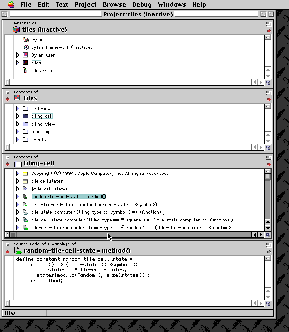
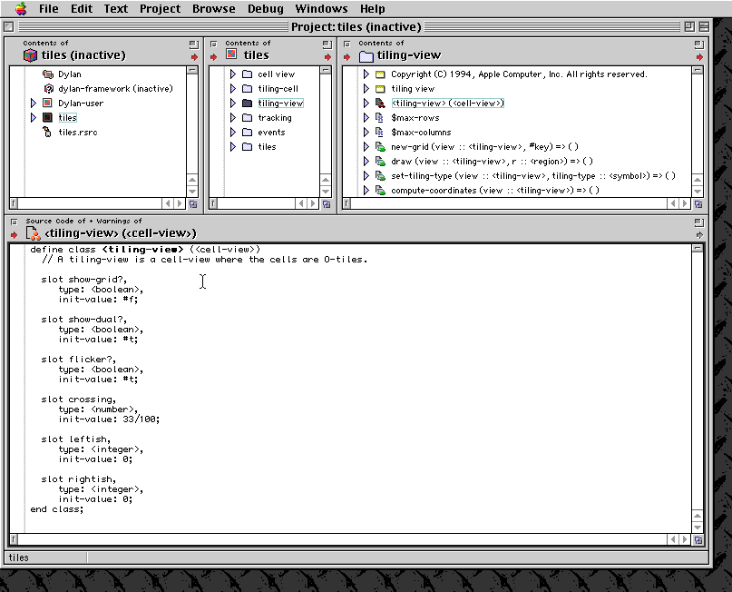
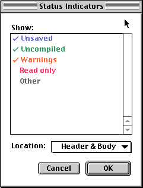
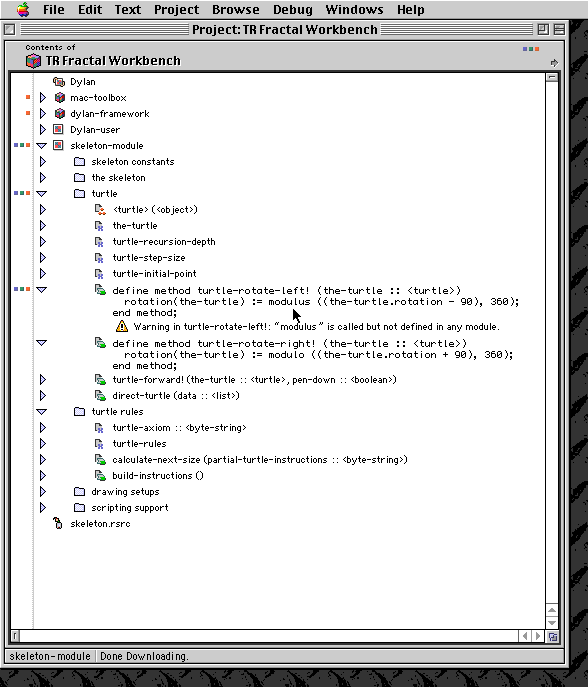

***********************
Apple Dylan Screenshots
***********************

Paul R Potts writes:

The Configurable Browser

At the heart of the :doc:`../index` TR was the extremely configurable
multi-pane browser window. Panes could be arranged and split
arbitrarily, and the "output" of any pane could be dragged and dropped
onto the input of another. This meant that the selected object in the
source pane would be displayed in a detailed view in the destination
pane. In this example note how four browser panes are linked together to
"drill down" to the function level. The little icons unobtrusively
indicate the type of each entity in the browser: a class definition,
function, slot, etc. Little colored squares in the margin indicate
unsaved objects, warnings, and other properties of the source code
records.

This also illustrates a key feature of the Apple Dylan TR: every part of
your source code was not just text in a text file, it was a separate
object in an object database. This gave the IDE incredible power,
because meta-data about each object could be maintained to facilitate
browsing via a variety of relationships and views, but less-than-optimal
implementation may have been responsible for some of the performance
problems of the Technology Release.

Certain other IDEs have also used this technique: for example, IBM's
`VisualAge <http://en.wikipedia.org/wiki/IBM_VisualAge>`_ tools use a
repository, and even included a complete source-code version tracking
system. This greatly facilitates activities like code refactoring.

Keeping your source code in a fully version-tracked, object-oriented
database with full metadata is an idea whose time has long since
arrived, yet most of us still spend our time editing text files. Apple
Dylan could export and import code from text files, but once you've used
an IDE that takes advantage of fine-grained object storage of your
source, you'll never want to go back.

   Browser panes of Apple Dylan Environment.

Here is a differently-configured browser showing how to "drill down" to
display a class definition.

   The Apple Dylan browser drilling down to a class definition.

It was also possible to view an entire nested hierarchy in a single
pane, using the little "disclosure triangles" to collapse and expand
parts of the hierarchy. Here is an example. Note that there were
sometimes cosmetic drawing problems in the browsers; keep in mind that
the Dylan TR was not a finished product, and Apple was quite open about
the fact that it had some rough edges.

.. figure:: images/appledylan-hierarchy.png
   :align: center

   Hierarchy of Apple Dylan.

Rather than display warnings and errors in a separate log window, a
legacy of separate text-file based compilers, Apple Dylan could use
configurable colored dots to indicate the source entities that contained
problems. It was possible to leave some problems to fix later, as long
as they were not critical errors and as long as the source entity
containing the problem was not needed to satisfy a dependency in the
code.

   Status indicator of Apple Dylan.

Here is a browser window showing how warnings could be displayed inline
with the code. Note that the status indicators propagate up even to the
top of the browser, to indicate that somewhere in this browser are
warnings. Apple Dylan's UI was designed from the ground up to allow
developers to work in multiple views of the code at once.

   Warnings of Apple Dylan.

In addition to letting you configure your own browser, the Dylan TR
provided a number of pre-defined browsers with special behaviors that
could give a particular view of the entities hooked into them. On the
next page, :doc:`browsers`, you can see some of these browsers.
