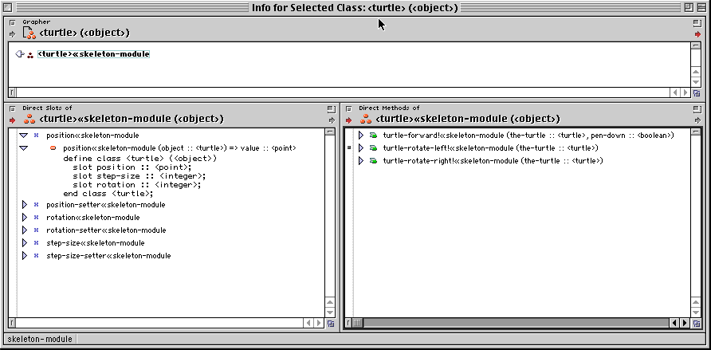

**********************************
Apple Dylan Screenshots - Browsers
**********************************

Paul R Potts writes:

Here is a simple example: a single-pane browser that shows a call graph.
One function is displayed, called turtle-forward! (note: the exclamation
point is part of the name, and by convention, generic functions that end
in an exclamation point change the state of the objects they are
passed). The functions called by turtle-forward are shown. These include
getters, since even simple slot access is done through getter functions,
whether it ultimately results in a real function call at run-time or
not.

Note that the functions include things that would generally be
considered intrinsic to the language, if one comes from a static
language background, like the ``+`` operator, which is shown to actually
be a generic function with a whole hierarchy of specialized methods for
handling "plus."

.. figure:: images/appledylan-call-grapher.png
   :align: center

   A hierarchy of specialized methods for handling "plus" operations.

Now, here's another browser, called "function family." It really shows
generic functions. This is the generic function "+". Note that
hard-coded intrinsic functions are still displayed, but no source is
available.

.. figure:: images/appledylan-function-family.png
   :align: center

   A function family browser.

This browser shows direct methods, and is designed to be used with a
class. In other words, it shows all functions that operate on the
"turtle" class, but not its ancestors.

.. figure:: images/appledylan-direct-methods.png
   :align: center

   Browsing all methods of a specific class.

Here's a useful one: it displays all direct methods and slots of a class
together.

   All direct methods and slots of a class.

There were several other specialized browsers available for displaying
all references from an entity, all references to an entity, but I think
you are beginning to get the idea. Whatever aspect of your code you
might want to focus on, :doc:`../index` was designed to provide you a
way to see it clearly. The dynamic nature of the language gave you much
more confidence that what you were saw in the IDE would correspond more
closely to what would happen at run-time.

Next in :doc:`dynamic`: a little bit about the dynamo (application nub),
the listener, and the debugging tools available.
