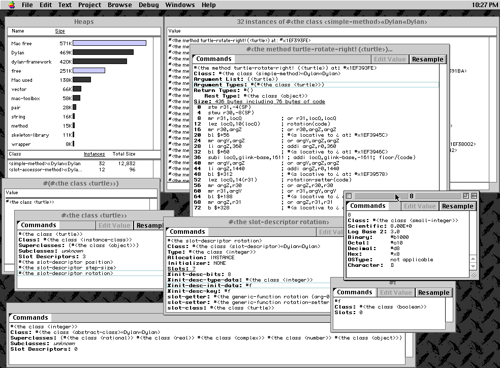

*********************************
Apple Dylan Screenshots - Dynamic
*********************************

Paul R Potts writes:

Dynamic Programming
===================

If you wanted to build and debug an application, your work would revolve
around the application nub. This was a small application shell, complete
with source code, that could be fleshed out with your objects and
debugged interactively, even on another machine across a network. Your
live objects would be downloaded to the application nub for debugging.
It was even possible to stop the application nub's event loop, stream
out objects, replace methods and objects, changing the behavior of your
code, and keep going, only rebuilding what you needed. All this is not
only possible but common in a truly dynamic environment.

.. figure:: images/appledylan-app-nub-info.png
   :align: center

   The application nub for debugging in Apple Dylan.

After PowerPC support was added, it was possible to build 68K, PowerPC,
or "fat" binaries with no additional effort.

.. figure:: images/appledylan-project-type.png
   :align: center

   Different project types in Apple Dylan.

I'm not going to to into extreme detail about all the tools available to
you for debugging an application, but let me quickly present a grab bag
of these tools. A developer could

- inspect the run-time heaps (top left)
- see the compiled code associated with any function
- recursively explore every detail of the representation down to the bit
  level

   A grab bag of the debugging tooks available in Apple Dylan.

This next image shows inspection of heap objects within a module:

.. figure:: images/appledylan-dynamic-runtime.png
   :align: center

   Inspection of heap objects within a module.

Next: Apple Dylan was a little bit strange in that it still showed its
MCL (Macintosh Common Lisp) innards. Also, Apple had ambitions for a
full-blown GUI-building tool, allowing you to lay out and tweak GUIs
without even writing code. See :doc:`misc`.
