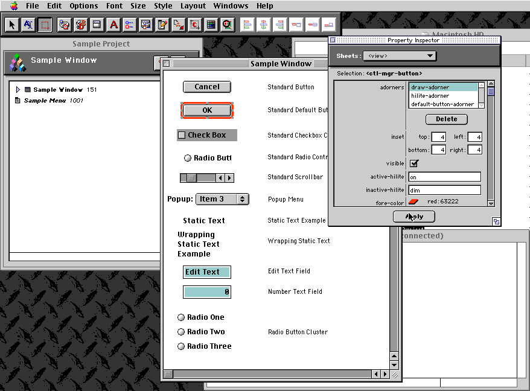
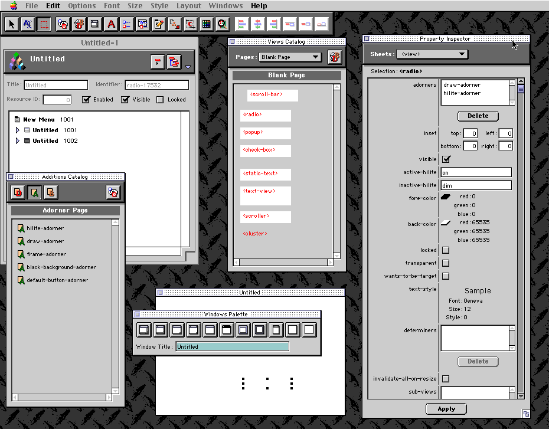
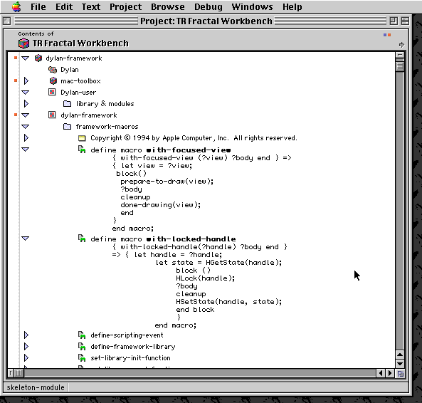

******************************
Apple Dylan Screenshots - Misc
******************************

Interface Builder
=================

:doc:`../index` came with a very preliminary interface builder, to
accompany its MacOS-specific GUI framework. It was not nearly complete,
but both the framework and the interface builder showed amazing promise.
Here is a shot of the interface builder:

   The interface builder of Apple Dylan.

Tools were included for generating menus, windows, dialogs, buttons,
checkboxes, images, and all the usual GUI components. Notice the
property inspector examining the non-standard default button with a red
border! This is a control manager button drawn by code from the
framework, but its behavior could be altered by specifying "determiners"
and "adorners" that would change the object's run-time behavior. These
corresponded directly to code entities available in the framework. User
interfaces could be tested out "live" by dynamically assembling
interface objects.

   A control manager button in Apple Dylan.

Macros
======

Now we come to a few of the more obscure details of Apple Dylan. The
macro system was not yet complete, but worked well enough to allow
inclusion of some simple macros such as "with-locked-handle" shown
below. This corresponds roughly to using a simple stack-based handle
locker class in C++, but instead it is done by performing a macro
rewrite of the source. Note that other Dylan implementation have gone
much farther towards implementing the whole Dylan macro system.

   The uncompleted macro system of Apple Dylan.

Lisp Leftovers
==============

There were some dark corners and secrets in Apple Dylan. Here we see
that the Macintosh Common Lisp "implementor" menus are available. Take a
look at the tantalizing option allowing you to switch between prefix and
infix Dylan. Nope, this did not mean that Apple Dylan would let you
transform one syntax to the other on the fly. But it did mean that many
of the internals, some of which come as source with the Dylan Technology
Release, were written in prefix (Lisp-style) Dylan, and at least
internally, both the original and newer syntax were supported. Prefix
Dylan was officially deemed a dead end, but one can imagine a future IDE
that would truly allow both to be intermixed freely, attempting to give
users the best of both. This is yet another aspect of what certainly
could have been the most remarkable development environment of its time,
and a rich source of ideas for the future.

.. figure:: images/appledylan-implementor-menu.png
   :align: center

   The Macintosh Common Lisp "implementor" menus was available in Apple
   Dylan.
