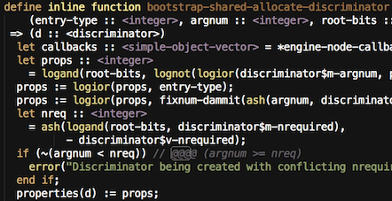
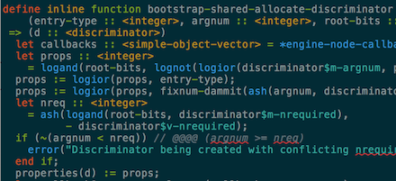

:Author: Bruce Mitchener
:Date: 2012-10-18 00:00:00

Improving Editor Support
========================

We have recently fixed some bugs in the syntax highlighting
support for Textmate and Sublime Text as well as for vim.

Sublime Text and Textmate
-------------------------

   Syntax highligting in Sublime Text

Textmate and Sublime Text used the same plugin which can
be found on GitHub at https://github.com/dylan-lang/dylan.tmbundle.

* Using OpenDylan specific modifiers (``dynamic``, ``sideways``, etc)
  won't break the highlighting.
* ``locked`` and ``thread`` variable definitions are highlighted
  correctly now.
* Keyword / header highlighting at the start of a file is improved.

Also, we've submitted a request for this plugin to be made
available via Package Control for Sublime Text and hope
that this is ready in the near future.

.. raw:: html

   

Vim
---

   Syntax highlighting in vim

We extended the Dylan support of vim:

* Improved comment handling such that all comments should
  be highlighted correctly now.
* Improved operator highlighting.
* Enabled spell checking for strings, comments and headers.
  To see this, you can toggle ``:set spell`` in vim.
* Enabled highlighting for the built-in functions as defined
  in the DRM.

The files for vim can be found in https://github.com/dylan-lang/dylan-vim.

Patches and further improvements are welcome!

